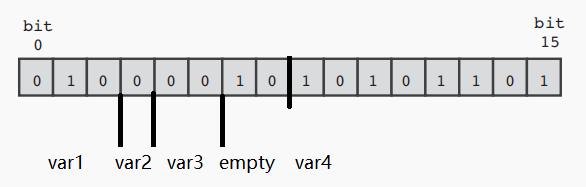

- 准备步骤（linux）
  collapsed:: true
	- 环境设置（简介）
	  collapsed:: true
		- GCC的设置
		- 可以参考Get Started with C++ in Visual Studio Code，
	- GCC编译器（简介）
	  collapsed:: true
		- 编译过程
		  collapsed:: true
			- 预处理
			- 读取程序的头部文件，结合头部文件与程序生成临时文件备用，
			- 调试选项
		- 编译
		  collapsed:: true
			- 将结合了头部文件的中间文件转换为汇编语言，输出到临时文件中备用，
		- 汇编
		  collapsed:: true
			- 根据CPU的具体类型调用对应的汇编器，将汇编语言转换为可执行的二进制代码，
		- 链接
		  collapsed:: true
			- 将多个二进制文件链接为一个可执行文件，
		- C语言标准
		  collapsed:: true
			- C语言具有多个不同标准，包括ansi，C99，C11等，
			- 可以在编译时使用后缀来指定希望使用的标准，
		- 编译器警告
		  collapsed:: true
			- GCC可以检查程序中的可能错误，并在编译时发出警告，
			- 可以在编译时使用后缀来指定编译中遇到错误时的编译器行为，
		- 优化
		  collapsed:: true
			- GCC通过简化了部分编译步骤来优化最终生成的可执行文件，然而这些优化也使得源代码与机器码之间存在一定的差异，使得调试变得困难，
			- 可以在编译时使用后缀来选择需要的优化行为，
	- 调试
	  collapsed:: true
		- （make工具）
		- （GDB调试器）
	- （字符集）
	  collapsed:: true
		- 基本组成
		  collapsed:: true
			- 英文字母（26个大写和26个小写）
			- 十进制阿拉伯数字（10个）
			- 29种符号
			- 5种空白符号
			- 不可打印字符（null、警报、退格、回车），分别用`\0, \a, \b, \r`表示，
		- ASCII码
		  collapsed:: true
			- ```
			  \\可以使用ASCII码给字符赋值，
			  char ch1 = 50;
			  
			  \\此处ASCII码50对应的为数字2，
			  putchar(ch1);
			  putchar('\n');
			  ```
		- 源代码字符集
		- 运行字符集
- C程序的基本组成
  collapsed:: true
	- 一般的C程序包括三步：代码编写（code），编译（compile），执行（execute），
	- 代码编写
	  collapsed:: true
		- 编写代码，并保存为.c扩展名的文件，
		- 包含需要的库
		  collapsed:: true
			- 为了使用对应的语句， 需要在程序开头引入对应的库——C语言并没有将所有函数都内置在语言的基本库中，
			- 语法为`#include<library.h>`，
		- 编写函数
		  collapsed:: true
			- main函数
			- 变量声明
			  collapsed:: true
				- 变量在使用前需要先声明（declaration），
				- 一般应先明确函数需要使用的变量，并将所有声明语句写在函数开始处，
				- 对于同一类型的变量，可以在一条语句中同时声明，即`int var1, var2;`，
			- 变量赋值
			- 其它函数
			  collapsed:: true
				- C程序中可以包含很多其它函数，这些函数会以子程序的方式被main调用，
				- 由于main被最先调用，而其它函数只能以子程序的方式被main调用；因此，理论上应先定义其它函数，在代码的最末尾再定义main函数，
				- 然而，可以通过代码开始处加入函数的“原型声明”，这样就可以将其它函数的定义写在main函数之后，
			- 结束函数
				- `return`语句表示函数的返回值，
				- （对于不产生返回值的main函数，不使用return语句也是合法的，但应养成使用return语句的习惯），
		- 预处理
		  collapsed:: true
			- 一般的C代码会以`#include`等语句作为开头，这些语句可以声明需要使用的库，或声明一些常量，
			- 这些语句会首先被预处理器处理，然后再传递给编译器，
	- 代码编译
	  collapsed:: true
		- 在Linux系统中，可以使用cd命令`cd /home/abc/Code`设置到文件对应的路径，
		- 不同于windows，linux的路径区分大小写，
		- 利用编译器编译对应文件，一般为`gcc file.c`，会输出可执行程序`a.out`，
		  collapsed:: true
			- （可以使用`gcc -std = c11 file.c`语句来选择不同的C标准），
			- 可以使用`gcc -o name file.c`将输出文件的名称改为`name`，
			- 可以使用`make file.c`来生成可执行文件，
		- 编译多源代码文件时，可以使用`gcc file1.c file2.c`，同样会输出（一个）可执行程序`a.out`，
	- 代码执行
	  collapsed:: true
		- 在编译器内运行输出的可执行程序`./a.out`（应注意`./`符号），
		- 如果程序存在错误，则编译器会报错；
		- 对于部分错误，编译器会生成可执行文件，但运行的结果可能与预期不符，
		- 对于部分错误，编译器不会生成可执行文件，
	- 中断程序运行
	  collapsed:: true
		- 采用Ctrl+C快捷键可以强制终止程序执行，
		- 也可以尝试直接关闭进程，
	- （测试和调试程序）
- 基本编程语法
  collapsed:: true
	- 基本语法
	  collapsed:: true
		- C语言利用{}来标志函数的主体部分，
		- 语句的结尾需要使用分号；
		- C语言区分大小写，
		- 一句代码可以写为多行，但需要在每行的末尾加上\符号，
		- 转义字符：反斜后的字符代表其他含义（一般为难以用字符表示的含义），如`\n`为换行符，
	- 变量命名
	  collapsed:: true
		- 变量的名称应能够较好的表明变量的使用目的，
		- 可以使用小写、大写字母，数字和下划线，
		- 名称的第一个字符必须为字母或下划线，不能为数字，
		- 关键字和保留字符
	- 注释
	  collapsed:: true
		- `/*comment*/`表示注释，中间的内容会被编译器忽略；
		- 也可使用`//comment`表示注释，但这种注释只能写在行内（因为没有结束符号），
		- 由于注释会被编译器忽略，因此理论上注释*可以*写在代码的*任何位置*，
		- 一般将注释写在函数代码的上方，即
		- ```
		  //comment
		  int func(void)
		  {
		   statements;
		  }
		  ```
- 数据类型
	- primitive
	  collapsed:: true
		- 数据存储
		  collapsed:: true
			- 存储单位
			  collapsed:: true
				- 位(bit)
				  collapsed:: true
					- 计算机中最基本的存储单元，只能保存0或1两个结果之一，
				- 字节(byte)
				  collapsed:: true
					- 定义8位为一个字节，
				- 存储形式
				  collapsed:: true
					- 整型数int
						- 16位（2字节）所能表示的最大有符号十进制整数为32767，无符号十进制整数为65535，
						- 32位（4字节）所能表示的最大有符号十进制整数为2147483647，无符号十进制整数为4294967295，
					- 浮点数
			- 存储空间
			  collapsed:: true
				- “基本”数据类型的存储空间是不变的，
				- char为1个字节（8位)，
				- 一般int为4个字节，float为4个字节，long为8个字节；但其占用空间会随编译器的不同而变化，
				- 可以使用sizeof函数判断数据类型的大小，
			- sizeof函数
			  collapsed:: true
				- `sizeof(var1)`接受一个变量，返回指定类型占用的内存大小（以字节为单位），
				- 如`(int)sizeof(char)`会返回1，即char变量占用1个字节，
		- 变量声明
		  collapsed:: true
			- 可以将声明语句和赋值语句写在一起，即`int num = 2;`是合法的，
			- 声明常量
			  collapsed:: true
				- 可以在代码的开始处使用`#define VAR1 value`将value赋值给VAR1，
				- 应注意语句中不需要赋值号=，
		- 数值
		  collapsed:: true
			- 整型数int
			  collapsed:: true
				- 其他整型数：short，long，long long，unsigned（只能存储正数），
				- unsigned int与int占用的存储空间相同，但是因为不需要存储负数，所以能表示的（十进制）数字的范围变大了一倍，
			- 浮点数float
			  collapsed:: true
				- 其他浮点数：double，long double（没有unsigned float类型），
				- 科学计数法：1.0e5表示1x10^{5}，2e-5表示2x10^{-5}，
				- 应注意1不能忽略，虽然数学中10^{5}和1x10^{5}相同，但1e5和e5在C中并不相同，
				- 将浮点数赋值给int类型不会报错，编译器会直接忽略数字的小数位（而不是四舍五入），
			- size_t类型
			  collapsed:: true
				- sizeof函数的返回值，类似无符号整数，
				- 可以使用显式类型转换`(int) sizeof(var1)`将sizeof返回的值转换为int值，
				- 也可直接用作部分函数（如malloc）的参数，
			- 复数
			  collapsed:: true
				- 包括float _Complex, double _Complex和long double _Complex类型，
				- complex.h文件包括了一些与复数相关的函数，
			- 数值溢出
			  collapsed:: true
				- inf值表示超出当前类型表示范围的值，
				- NaN值表示不符合函数运算规则的值（如向对数函数输入负值），
		- 字符char
		  collapsed:: true
			- 实质上，char类型存储的仍为数值，即字符在编码（如ASCII）中对应的整数；
			- 可以使用数值（八进制、十进制或十六进制）来给字符赋值，
			- 可以将字符的编码值通过数值的占位符（如%d）打印出来，
			- 可以用比较运算符对字符进行比较，如`'a' < 'z'`是合法的且为真（a的ASCII值为97，z的ASCII值为122），
			  collapsed:: true
				- 但比较字符的“大小”一般没有实际价值，
			- char形式需要用单引号括起来，char形式也可以表示部分转义序列（如换行符`'\n'`），
		- 布尔值_Bool
		  collapsed:: true
			- C中的布尔值类型命名为_Bool，
			- _Bool实质上是一种整型数，0代表假，1代表真，
			- 若给_Bool类型赋值其它非零数值，则该变量会被设置为1，
		- 类型转换（cast）
		  collapsed:: true
			- 意义
			  collapsed:: true
				- 理论上，不同数据类型之间是不能进行运算的，
				- 然而，为了保证程序的运行，C规定了一些（隐式）类型转换规则，
				- 此外，也可以使用显式类型转换以进行运算，
			- 隐式转换
			  collapsed:: true
				- 类型级别
				- 基本级别（从高到低）：double, float, unsigned long, long, unsigned int, int（short和char类型默认会被转换为int），
				- 赋值语句中，表达式的数值会*先计算得到结果*，再将结果转换为设定的被赋值变量的类型（不管类型的级别高低），
			- 类型升级
			  collapsed:: true
				- short和char类型默认会被转换为int，
				- 对于两种不同类型的变量的运算，C会将两者转换为更高的类型，
			- 类型降级
			  collapsed:: true
				- 浮点数被转换为整型数时，小数点后的值会被直接舍去（不会四舍五入），
			- 显式转换
			  collapsed:: true
				- 使用`(type1) var1`可以将变量var1转换为type1类型，
	- pointer
	  collapsed:: true
		- 引入
		  collapsed:: true
			- 当存储一个“数组”时，实际上存储的并非整个数组，而是数组的“位置”，
			- 例如，对于数组`array = int[20]`，变量`array`自身并非用了（20x4=）80个字节存储了数组中的每一个整型数，而只是存储了数组的开头数字在*内存*中的*位置*，
			- 这样，当后续语句调用array时，就可以去到内存中对应的位置，然后根据array的长度（80个字节）来逐个寻找需要调用的元素，
		- 定义
		  collapsed:: true
			- 存储“内存位置”的变量为一个指针，
			- 内存位置一般以十六进制数字储存，因此指针部分等同于int值，
		- 声明
		  collapsed:: true
			- 声明指针变量时必须指定指针所*指向*的变量的类型，
			  collapsed:: true
				- 不同的（基础）变量类型占用的存储空间（字节数）不同，
				- 为了进一步利用指针进行运算，需要明确变量所占用的字节数，
			- 一般语法为`type *point1`，其中type为“将要赋值给point1”的变量的数据类型，
			  collapsed:: true
				- 即所说的“指向”的变量的类型，而不是point1的类型，
				- 定义的指针变量为`point1`，而不是`*point1`，
		- 指针运算
		  collapsed:: true
			- 地址运算符`&`
			  collapsed:: true
				- `&`运算符接受*变量*作为参数，返回*变量地址*（可以赋值给指针），一般为十六进制数，
				  collapsed:: true
					- 由于指针也是变量，因此指针变量也可使用&运算符查询其地址，
				- printf函数中，指针的占位符为%p，
				  collapsed:: true
					- 即`printf("%p", &var)`会打印出变量var的地址，
					  collapsed:: true
						- printf中的占位变量一般是直接写出的，不需要&运算符，
						- 相比之下，scanf则与需要&运算符来赋值变量，其实质就是将数值利用指针赋值给变量，
			- 间接运算符`*`
			  collapsed:: true
				- `*`运算符接受*变量地址（指针）*作为参数，返回该地址存储的*变量*，
				  collapsed:: true
					- （未指定变量的指针`*point1`存储的值为nil），
				- 示例
				  collapsed:: true
					- ```
					  int var1 = 3;
					  //初始化变量var1
					  int *point1;
					  //初始化指针变量point1
					  int var2;
					  //初始化变量var2
					  
					  point1 = &var1; 
					  //将变量var1的内存地址赋值给指针变量point1
					  
					  var2 = *point1;
					  //将point1对应的地址存储的变量var1赋值给var2，
					  
					  (最后应有var2 = 3，)
					  ```
					- 其实际效果等同于`var2 = var1；`，
			- 指针的初始化
			  collapsed:: true
				- 指针存储的变量为地址，因此一般需要用其他变量的地址来初始化指针，
				- 也可以使用`malloc()`函数分配内存，
				- 一般变量
				  collapsed:: true
					- 基本方式为`int var1; point1 = &var1;`，
					- 只声明（创建）了的指针变量`int *point1;`不能直接用间接运算符`*`进行修改，
					- 因为C只分配了指针本身的内存，并未分配存储数据的内存，因此这样使用会导致错误，
					- 初始化后，变量`*point1`等同于变量`var1`，对`*point1`进行的操作等同于对`var1`进行的操作，
				- 数组变量
				- 多维数组变量
			- 基本运算
			  collapsed:: true
				- 指针类似int值，但是其基本运算与int值有一定不同，
				- 赋值给一般变量的指针可进行加法和减法运算，但一般不会起作用；由于指针可能指向不同的地址，因此一般不建议对指针进行运算，
				- 指针不能进行乘法和除法运算，
			- 数组运算
			  collapsed:: true
				- 数组变量实际上存储的是数组首元素的地址，即`array == &array[0]`，
				- 因此，可以将数组变量赋值给指针，此时的指针运算类似于数组下标运算，
		- 指向函数的指针
		  collapsed:: true
			- 引入
			  collapsed:: true
				- 函数指针常用作另一个函数的参数，用于选择具体需要用的函数，
				- 一个泛用的排序函数需要对数字，数组，字符串等不同的数据类型进行比较；然而比较这些数据类型所需要的操作不同，
			- 声明
			  collapsed:: true
				- 函数指针存储的是函数代码的初始字符的地址，
				- 类似其它指针的声明，函数指针也需要指出指针指向的“变量”的类型，
				- 函数的“类型”包括函数的返回值的数据类型，和形参的数据类型，
				  collapsed:: true
					- 即函数指针一般前后都有变量类型（void类型也需要声明），
				- 声明的简单策略为将函数原型声明中的函数名称FUNC更改为(*fpoint)，
				- 示例
				  collapsed:: true
					- ```
					  //一个简单的函数声明，
					  //函数接受的参数为type2类型，
					  //返回值为type1类型，
					  type1 FUNC (type2 arg2);
					  
					  //对应的指针也需要指明返回值类型和参数类型，
					  type1 (*fpoint1) (type2);
					  
					  //然后就可以将函数（名称）赋值给已声明的指针，
					  fpoint1 = FUNC;
					  ```
			- 使用
			  collapsed:: true
				- 一般用法为`fpoint(var2);`，等同于`FUNC(var2);`，
					- 也可使用`(*fpoint)(var2);`，
			- 函数指针组成的数组
			  collapsed:: true
				- 数组的元素不能是函数，但可以是（指向函数）的指针，
				- 一般用于需要逐个使用多个函数的情况；可以利用下标遍历数组，以达到使用不同函数的目的，
				- 数组内的函数应有相同的参数类型和返回值，
				- 可以使用typedef方法，先将函数指针声明为一个类型，即`typedef void (*FPOINT) (int (*fpoint) (int), char *str);`（此处的类型名FPOINT不在语句最后），
					- 由于指向函数的指针需要声明两个变量类型，因此声明函数指针数组的方式较为复杂，
					- 因此一般先使用typedef方法，将函数指针声明为一个类型，
				- 然后就可以使用类型FPOINT创建函数指针数组，即`FPOINT farray[10];`，
	- array
	  collapsed:: true
		- 区别
		  collapsed:: true
			- 不同于基本数据类型，高级数据类型的存储空间是可变的；
			- 例如，存储HI的字符串需要用到2个字符和1个分界符（即总共3个字节），而存储BYE的字符串需要用到3个字符和1个分界符（即总共4个字节），
		- array
		  collapsed:: true
			- 定义
			  collapsed:: true
				- 按*顺序*储存的一系列类型相同的变量，即变量可以为数值或字符；称数组中的变量为元素（element），
				- 数组的元素被依次存储在内存中相邻的位置，
			- 声明
			  collapsed:: true
				- 数组的声明
				  collapsed:: true
					- 由于数组并非一个固定的类型，因此声明数组的方式也随着其包含的元素的种类的不同而变化，
					- 一般方式为`type array1[n];`，type为希望计入数组的变量的类型，array1为数组名称，n为分配给数组的可包含的元素数量（正整数），
					- 虽然数组变量array1存储的是数组首元素的地址，但是不能直接用指针初始化数组，
					- 在声明数组时，编译器会先分配对应大小的空间，再将第一块空间的地址赋值给array1；然而声明指针时，编译器只是分配了一个地址，
				- 数组的初始化
				  collapsed:: true
					- 可以将声明语句和赋值语句写在一起，如`int array[5] = {1, 2, 3, 4, 5};`，注意赋值时应将变量用花括号括起来，
					  collapsed:: true
						- 不能将数组赋值给数组，创造多维数组需要其他的方式，即`int array[5] = {{1, 2}, {3, 4}};`是不合法的，
					- 对于数值数组，若输入的值少于声明的大小，则C默认将其余位置的值设置为0，
					- 如果在声明时赋值，可以让编译器自动确定数组的大小，即`int array[] = {1, 2, 3, 4, 5};`
					- （可以先定义固定常量`const int SIZE = 8;`，再用其声明数组`int array1[SIZE];`，以保证所有数组的大小相同），
					- 虽然数组为指向第一个元素的指针，但是*不能*使用数组初始化指针，即`int *point1  = {1，2，3};`是不合法的，
			- 访问与修改
			  collapsed:: true
				- 下标方法
				  collapsed:: true
					- 由于数组按顺序储存变量，因此可以通过整数下标访问存储进数组的元素，一般方式为`array1[n]`，
					- 数组的索引从0开始，即最后一个元素的索引为n - 1，
					- 使用数组中元素的方式基本类似使用变量，
					- 编译器*不会检查*下标是否正确，即编译器不会因错误的下标（如超出数组范围）而报错，然而错误的下标可能导致程序无法达成想要的结果，
				- 指针方法
				  collapsed:: true
					- 数组变量存储的是数组首元素的地址（指针），即`array == &array[0]`，
					  collapsed:: true
						- 即可以用printf函数和%p占位符打印出array变量，
					- 可以将数组array赋值（=）给已声明的同一类型的指针，然后就可以使用指针方法修改数组元素，
					  collapsed:: true
						- ```
						  int array[6];
						  int *point1;
						  point1 = array;
						  ```
					- 可以理解为`array[n] == *(array + n) `，
					  collapsed:: true
						- 此处得到的变量（即`array + n`）仍然为指针，因此可以使用间接运算符`*`，
						  collapsed:: true
							- 一般情况下，对赋值给其他变量的指针进行加减运算是无效的，因为加上一定位数之后的地址所指向的数据是不确定的，也没有操作意义，
							- 然而，对于赋值给数组的指针，由于指定了数组元素的类型，因此指针的加减运算就可以依据数组的元素类型所占的位置大小进行运算；
							- 在数组范围内，得到的地址仍然指向数组的元素，
						- 优先级
						  collapsed:: true
							- 间接运算符`*`的优先级高于算数运算符，
							- 即`*(array + 2) == array[2]`，而`*array + 2 == array[0] + 2`，
				- （下标与指针的区别）
				  collapsed:: true
					- 数组名array1为地址*常量*，即数组在内存中存储的位置；因此，可以使用下标方法查询地址，但不能更改地址，
					- 赋值了数组的指针是*变量*，即数组的内存位置（的副本）；因此，可以对指针进行修改，得到的新的位置就是数组的其它元素，
				- 数组的赋值与修改
				  collapsed:: true
					- 声明数组后，*只能*通过下标方法对数组的*元素*进行赋值，如`array[3] = 4；`，
					  collapsed:: true
						- 数组的下标方法对应的为具体的int变量，
						- 数组通过指针将输入的值赋值给对应的位置，位置（指针）在声明后是不能更改的，但位置存储的数值（变量）可以更改，
					- 如果希望声明后赋值，则必须在声明时*指定数组的大小*，
					- *不能*对以声明的数组使用花括号赋值，即`array = {1, 2, 3, 4, 5};`是不合法的，
					  collapsed:: true
						- 变量`array`存储的为数组的第一个元素的指针地址，因此不能被赋值给其它元素，
					- 使用赋值给数组的指针也*不能*对以声明的数组赋值，
					- ```
					  //*point1为指针地址对应的变量，不能用数组赋值，
					  *point1  = {1, 2, 3};
					  
					  //point1为地址，也不能用数组赋值，
					  point1  = {1, 2, 3};
					  ```
					- 核心在于，数组并非“一个”元素，而是由指针定义的一组元素，因此C的规定为，定义时可以逐个写入元素， 但定义后就只能通过指针修改对应位置的元素，而不能修改“一组”元素，
				- 数组函数
				  collapsed:: true
					- 数组不同于字符串，因此不能直接使用字符串函数，
					- 然而，string.h也提供了一些函数来处理数组，
					- memcpy函数
					  collapsed:: true
						- `memcpy(array1, array2, size_t);`接受两个数组（指针）和一个size_t参数，
						- 将array2处存储的变量，将*size_t大小*的数据复制到到array1处，
						- memcpy不会检查原数组和新数组的变量类型，只是复制了指定大小的数据；即拷贝过程*不涉及*数据转换；函数会按原样拷贝字节，再基于新数组的数据类型重新解释这些字节对应的值，
			- 通过函数调用数组
			  collapsed:: true
				- 函数形参的设置
					- 函数的形参需要设置为指针变量，如`int sum (int *start, int *end);`，
					- 声明形参时也可使用下标方法，即`int sum (int array[]);`
					- 应注意形参的类型应与数组的类型匹配，
			- 常量数组
			  collapsed:: true
				- 引入
				  collapsed:: true
					- 进行运算时，C通常只传递数据的值，这样可以保证原数据不被修改，
					- 如果需要修改原数据，则需要使用指针，
					- 然而，数组是通过指针形式存储的，因此对数组进行运算时，一般修改的就是原数组的数据，
					- 因此，如果程序出现错误，则原数组的数据可能无法恢复，
				- const函数形参
				  collapsed:: true
					- 如果希望函数不对数组进行更改，则可以在定义函数的形参时使用const关键字，
					- 对应的数组可以不是常量数组，
					  collapsed:: true
						- 然而，传递常量数组时，形参中的const关键字也不能省略，
					- 示例：对于`int sum(const int *array)`，如果在函数表达式中修改了数组，则编译器会报错，
					- （也可使用下标方式，即`int sum(const int array[])`，
					- 注意事项
					  collapsed:: true
						- 上式实际上是将指针固定为常量，因此不能*通过调用指针*来修改数组，即`*(point + n) = k`会报错，
						- 然而，若数组本身没有被设定为常量，则仍可以*通过下标方法*修改数组，即`array[n] = k`是合法的，
				- const数组
				  collapsed:: true
					- 类似设置不可更改的变量，可以使用const关键字来设置不可更改的数组，
					- 示例`const int days[12] = {31,28,31,30,31,30,31,31,30,31,30,31};`，
				- const指针
				  collapsed:: true
					- `const int * point1;`，即const关键字在间接运算符*左侧*，表明限定的是point1指向的值不能更改；然而指针point1可以指向别的变量，
					- `int * const point1;`，即const关键字在间接运算符*右侧*，表明限定的是指针point1不能更改；然而指针指向的地址对应的值则可以更改，
				- 其他规则
				  collapsed:: true
					- 常量数组只能赋值给常量指针，
					- 非常量的数组只能赋值给普通指针，
			- （variable-length arrays，VLA）
			  collapsed:: true
				- C允许用常量定义数组的长度，而不用每次输入数值，
				  collapsed:: true
					- 即`#define LENGTH 6`后，就可以使用`int array[LENGTH]`来创建一个含有6个元素的数组，
					- 语法上等同于`int array[6]`，
					- 使用带名称的常量可以使代码更好理解，也可以保证多个数组的一致性，
				- C99开始，变量也可用于定义数组的长度，
				  collapsed:: true
					- 即`int len = 6;`后，也可以使用`int array[len]`来创建一个含有6个元素的数组，
					- 然而，数组一旦被定义，其*长度*就不能改变，
				- 函数的适用性
				  collapsed:: true
					- VLA的加入可以使关于数组的函数有更好的适用性，
					- 对于用常量定义的数组，其函数一般写为`int sum (int array[LENGTH], int n);`；这样的函数需要修改参数才能用于其它数组，
					- 但对于变量定义的数组，其函数可写为`int sum ( int len，int array[len]);`；这样，函数可适用于由不同的变量len设置的数组，
				- 通过函数调用数组
				  collapsed:: true
					- 对于VLA，函数的形参需要先写出数组的长度变量，如`int sum (int rows, int column, int array[rows][columns]);`，
					- 调用函数时，就可以直接使用变量和数组的名称调用，即`sum (row, column, array1);`，
			- （复合字面量）
			  collapsed:: true
				- 类似于“没有名称”的数组，
				  collapsed:: true
					- 示例：`(int [2]){10, 20};`会创建“没有名称”的数组[10, 20]，
					- 数组的名称就是(int [2])，
					- 然而，如果希望使用数组，则仍然需要将其赋值给一个指针，即`int  *ar1; ar1 = (int [2]){10, 20};`，
					- 上述语法创建的对象等同于`int array[2] = {10, 20}`，
				- 一般用于创建临时数组，
		- nested array
		  collapsed:: true
			- 创建
			  collapsed:: true
				- 基本语法为`int array[2][3] = {{1, 2, 3}, {4, 5, 6}};`，
				- 最*接近*数组名称的数值为最外层数组的维度，
				- 注意事项
				  collapsed:: true
					- 同一维的数组一样，只能在初始化阶段用花括号赋值，
					- 不能将数组赋值给已经初始化的一维数组中的变量，以生成多维数组（嵌套列表），
					- 对于初始化为多维的数组，也不能利用花括号将数组赋值给其中的变量，
			- 指针数组
			  collapsed:: true
				- 二维数组实际上为指针组成的一维数组，
				  collapsed:: true
					- 即一维数组的每个元素都是指针变量，分别指向每个嵌套的数组，
					- 多维数组的情况类似，
				- 因此，可以通过初始化一个*指针数组*来建立二维数组，
				- 基本语法为`int *array[10]`，会创建一个包含10个指向int的指针的数组，
				  collapsed:: true
					- 下标符号[]的优先级高于*符号，
				- 需要逐个创建一维数组，再将其赋值给每个指针，才能完成二维数组的建立，
				- 与直接创建的区别
				  collapsed:: true
					- 未初始化的指针数组的每个元素都是“空指针”（占4个字节的地址），*可以*用其他的地址（指针）赋值，
					- 直接创建的数组（无论有没有赋值），其地址都是确定的，*不能*被赋值给其他指针，
				- 示例
				  collapsed:: true
					- ```
					  //初始化指针数组
					  int *ptarray[10];
					  
					  //声明指向数组的指针
					  int array1[10] = {1, 2, 3};
					  int array2[10] = {4, 5, 6};
					  
					  //利用以声明的指针赋值给指针数组
					  ptarray[0] = array1;
					  ptarray[1] = array2;
					  
					  //可以使用下标方法和指针方法访问数组
					  printf("%d %d", ptarray[0][0], *ptarray[1])
					  ```
			- 下标方法
			  collapsed:: true
				- 只能使用与数组同维数的下标，修改对应的元素的值，
				- 即对于二维数组`int array[2][3] = {{1, 2, 3}, {4, 5, 6}};`，`array[1][1] = 3;`是合法的，
				- 嵌套的数组存储的为地址（指针），因此不能赋值给元素；但也不能赋值给其他指针，
				- 因此，如果希望修改多维数组，一般方法为利用循环*逐个修改*元素，
			- 指针方法
			  collapsed:: true
				- 运算的核心为分清*变量的类型*，
				- 数组的名称`array`为指针变量，即数组首个*元素的地址*；
				- 使用间接运算符后的`*array`为数组的首个*元素*，
				  collapsed:: true
					- 对于一维数组，数组的首个元素就是数值，
					- 对于多维数组，数组的第一个变量仍为数组，即指针，即`*array`仍然为指针变量，
					- 对于多维数组，需要*多次使用*间接运算符`*(*array)`才能得到嵌套的元素，
					  collapsed:: true
						- 对于二维数组，`*(*array)`为数值，
						- 语法上可以不写括号，即`**array`也是合法的，但可能导致代码难以理解，
					- 因此对于多维数组，下标方法比指针方法更易于理解，
				- 使用整个嵌套的数组
				  collapsed:: true
					- 如果希望*调用*嵌套的整个数组，
					- 由于二维数组的每个元素仍然为数组（指针），因此需要通过*指向数组*的指针`int (*point1)[3]`，
					- 示例
					  collapsed:: true
						- ```
						  int array1[2][3] = {{1, 2, 3}, {4, 5, 6}};
						  
						  //指向int的指针会报错
						  int *point1; point1 = array1;
						  
						  //下标符号[]的优先级高于*符号，因此需要加上括号，
						  int (*point1)[3]; point1 = array1;
						  
						  //此时可以使用指针
						  //(*point1)[1] == array1[0][1]
						  printf("%d = %d. \n", (*point1)[0], array1[1][1]);
						  ```
			- 通过函数调用多维数组
			  collapsed:: true
				- 除了基本设置外，调用多维数组还需要其他语句，
				- 一般情况下，希望通过下标方法调用的数组中的元素，如`int array1[3][4] = {{2, 4, 6, 8}, {3, 5, 7, 9}, {12, 10, 8, 6}};`中的整型数2，4，6等，
				- 然而，由于数组通过指针存储，因此声明n维数组的形参时需要将*数组的维数*写出，即`int sum (int ar[][i][j]，…);`，
				  collapsed:: true
					- 也可写为指针形式，即`int sum (int (*ar)[i][j]，…);`，但应注意括号，因为[]运算符的优先度更高，
				- 在函数内调用时可以使用下标方法，即array[0][0] 会返回数值2，
				- 调用函数时，也可以直接使用数组的名称，即`sum (array1，…);`，
	- string
	  collapsed:: true
		- 定义
		  collapsed:: true
			- “字符串”的本质为元素均为char类型的数组，
			- 然而，字符串与数值数组存在一些差异，
			  collapsed:: true
				- 字符串需要用双引号括起来`"apple"`，而数组需要用花括号括起来`{10, 20}`，
				- 字符串以空字符'\0'结尾，即C会在双引号输入的字符串后自动加上空字符，
					- 字符串`char m1[10] = { 'L', 'i', 'm', 'i', 't', '\0'};`，等同于`char m1[10] = "Limit";`，
					- 而字符数组`char m1[10] = {'L', 'i', 'm', 'i', 't' };`，
				- 空字符同样为字符，但其对应编码为0；而标准的ASCII码中没有0对应的字符，所以不会混淆，
		- 字符串的声明与修改
		  collapsed:: true
			- 声明
				- 字符串的声明
					- 一般语法为`char str1[n];`，
					  collapsed:: true
						- n代表分配给str1的字符个数；
						- C中的字符串以空字符`\0`为结尾（分界符），以在内存中区分不同的字符串，因此实际上str1可存储的最大字符数为n-1个，
				- 字符串的初始化
					- 可以将声明语句和赋值语句写在一起，如`char str1[20] = "string";`，
					- 字符串一般用双引号赋值，
					- 理论上字符串也可以用类似数组的花括号赋值，但这样声明得到的实际为“字符数组”，即结尾没有终止符\0，
					- 只能在初始化时给字符串赋值；
				- 指针方法
				  collapsed:: true
					- 不同于数值数组，字符串`"string"`存储的就是其首字符的地址（指针），
					- 因此，*可以*将字符串直接赋值给指针，即`char *point1  = "string";`是合法的，
					  collapsed:: true
						- 相比之下，将数组直接赋值给指针（如`int *point1  = {1，2，3};`）是不合法的，
					- 然而，由于指针为变量，因此使用指针直接赋值时最好使用常量指针，即`const char *point1  = "string";`，
			- 访问与修改
			  collapsed:: true
				- 声明字符串后，*只能*对字符串中的*字符*进行赋值，如`str1[1] = 'c'；`，
				- 同数组类似，只有*声明*字符串时*才能*直接赋值，即`str1 = "string";`是不合法的，
				  collapsed:: true
					- 虽然字符串`"string"`存储的也是地址（指针），然而已经初始化的str1为不能更改的地址*常量*，因此不能被赋值给其它变量，
				- 使用赋值给字符串的指针赋值同样不会产生效果，
				  collapsed:: true
					- ```
					  //初始化
					  char str[10]; 
					  char *point; 
					  
					  //将字符串赋值给指针
					  point = str;
					  
					  //只会将string赋值给指针，str的值不会改变，
					  //即str与point并没有“绑定”在一起，
					  point = "string";
					  ```
				- 一般方法为使用strcpy函数将需要的字符串“复制”到指定字符串的位置，
		- 字符串的基本操作
		  collapsed:: true
			- 字符串字面量方法
			  collapsed:: true
				- 不同于数组，可以直接使用字符串自身，而不需要对字符串变量命名，
				- `str1`等同于`"string"`，两者存储的都是字符串的首字符的地址（指针），
				- 即`*str1 == *"string" == str1[0] == "string"[0]`，返回的都是字符串的首字符s，
				- 相比之下，直接使用数组`*{10, 20}`是不合法的，
				- ＠（静态存储区与内存）
			- 字符串的输入
			  collapsed:: true
				- 分配空间（声明字符串）
				  collapsed:: true
					- 最好使用数组声明方法`char str1[20];`，
					- 由于指针需要初始化才能使用，因此不应使用指针声明，
				- （gets函数）
				  collapsed:: true
					- `gets(str1);`提供一个输入行，并将换行符之前的所有输入（包括空格）存储到*已声明*的字符串str1中，
					- 然而，gets函数*不会检查*输入字符的长度——如果输入的字符数超过了声明的空间，则可能导致`Segmentation fault`，
				- fgets函数
				  collapsed:: true
					- `fgets(str1, n, stdin)；`同样提供一个输入行，根据设定值，读取n - 1个字符（包括空格）并存储到*已声明*的字符串str1中，
					- 第二个参数
					  collapsed:: true
						- fget提供第二个参数，来限制可供读取的字符，
						- 同样可以用回车结束输入，若字符不到限制的n - 1个，则fget会将换行符`\n`也写入字符串中，
					- 第三个参数
					  collapsed:: true
						- f的含义为file，即读取文件；读取键盘输入对应的参数为stdin，
					- 返回值
					  collapsed:: true
						- fget函数返回指向char的指针，一般为函数写入的字符串str1的地址，
						- 若函数读到文件结尾，或没有接收到输入，则会返回空指针NULL（等同于FALSE值），
					- （换行符的处理）
					  collapsed:: true
						- 遍历字符串，直到遇到换行符或空字符，
						- if 先遇到换行符，就将其替换为空字符，
						- else 先遇到空字符，就丢弃输入行的其余字符，
						- 参考fget3.c，p333，
				- @gets_s函数
				  collapsed:: true
					- `gets_s(str1, n)；`同样提供一个输入行，根据设定值，读取n - 1个字符（包括空格）并存储到*已声明*的字符串str1中，
					- gets_s函数只从键盘输入中读取数据，因此没有第三个参数，
					- 如果在n - 1个字符前读取到换行符，gets_s函数会丢弃换行符，
					- @如果读取n - 1个字符后也没有读取到换行符，gets_s函数会执行其他操作，
				- scanf函数
				  collapsed:: true
					- scanf输入字符串时*不需要*加入&符号，基本语法为`scanf("%s", str1);`，
					- scanf以空白（空格、换行符等）为分隔，因此scanf不会读取以空格分隔的整个字符串，而只会读取第一个词，并将其赋值给str1，
					- 然而，可以通过设定多个参数的方式来将空白分隔的字符串赋值给多个字符串变量，如`scanf("%s %s", str1, str2);`会将`apple orange`分别赋值给str1和str2，
					- 如果没有空白，scanf也可能导致数据溢出；可以使用借位符的转换说明限制读取的字符数，如`scanf("%10s", str1);`只会读取前10个字符，
				- sprintf函数
				  collapsed:: true
					- 类似printf函数，但sprintf将接受的字符串保存在字符串中，而不是打印出来，
					- 示例
					  collapsed:: true
						- ```
						  char str1[10] = "cpp";
						  char str2[20];
						  int num1 = 3;
						  
						  //会将app cpp 3.打印在命令行中，
						  printf("app %s %d.", str1, num1);
						  
						  //会将app cpp 3.保存在字符串str2中，
						  sprintf(str2, "app %s %d.", str1, num1);
						  ```
					- 浮点数可能占有较大的空间，因此保存浮点数时应注意分配给str2的空间是否足够，
			- 字符串的输出（打印）
			  collapsed:: true
				- puts函数
				  collapsed:: true
					- 接受一个指针变量，从对应的地址读取字符，直至遇到表示字符串末尾的空字符（并在末尾加入换行符），然后将所有字符打印在屏幕上，
					  collapsed:: true
						- 即`puts(str1);`等同于`printf("%s \n", str1);`，
						- 因此，只打印一个字符串时一般不使用printf函数，
						- 由于`puts(str1 + 5);`传递的是第六个字符的地址，因此puts会从字符串的第六个字符开始打印，
						- （警告：由于put以空字符结尾，若输入的参数不是字符串（如字符数组），则puts会一直打印内存中的内容，直到遇到空字符为止，因此应避免这种操作），
					- 由于可以字符串变量等同于字符串字面量，因此可以直接使用`puts("apple");`打印字符串，
					  collapsed:: true
						- `"apple"`存储的是字符串的首字符的地址（指针），
						- 因此传递给puts的变量实际上仍是指针变量，
				- fputs函数
				  collapsed:: true
					- 类似puts函数，但末尾不会加入换行符，
					- 即`fputs(str1, stdout);`等同于`printf("%s \n", str1);`，
					- 第二个参数
						- f的含义为file，即写入文件；输出到键盘对应的参数为stdout，
				- printf函数
				  collapsed:: true
					- 如果需要输出多个字符串，或将字符串变量嵌入语句中，则可以使用占位符`%s`，
			- （自定义输入/输出函数）
			  collapsed:: true
				- 可以使用getchar和putchar函数，自定义希望输出和输入的字符，
				-
		- 字符串函数
		  collapsed:: true
			- 大部分的字符串函数都放在头文件string.h中，
			  collapsed:: true
				- （大部分）字符串函数都*没有修改*字符串的地址，只是逐个遍历了对应地址的各个元素，并进行了操作，
				- 大部分字符串函数不能用于数组，因为字符串有明确的终止符`\0`，所以函数知道在何处停止循环；
				- 此外，字符占用的空间（1个字节）也与其它变量不同，
			- strlen（长度）
			  collapsed:: true
				- strlen函数
					- `strlen(str1)`返回字符串中的最后一个字符的下标（size_t值），
					- strlen不会计入末尾的空字符'\0'，因而其返回的值就是字符串的长度，
					  collapsed:: true
						- 因此，strlen返回的值一般和sizeof返回的值不相同；
			- strcat（拼接）
			  collapsed:: true
				- strcat函数
				  collapsed:: true
					- `strcat(str1, str2);`接受两个字符串（指针）作为参数，将str2的字符添加到str1末尾，
					- 返回值
					  collapsed:: true
						- strcat返回的为str1（的第一个字符）的地址，
						- str1的地址并没有改变，只是其末尾的空字符被替换为了str2的字符，
						- 即`strcat(str1, str2);`和str1的值（都为指向str1的指针）应该是相同的，
					- 实际运算
					  collapsed:: true
						- strcat先查找指针str1指向的位置的字符，
						- 再逐个向后寻找，直到字符串末尾的空白字符，
						- 将空白字符逐个替换为指针str2指向的位置的字符，
						- 直到str2后的第一个空白符为结束，
						- 因此，理论上参数可以不指向str2的第一个字符，
						- 示例
						  collapsed:: true
							- `str1 = orange\0, str2 = app\0`,
							- `strcat(str1,str2) = orangeapp\0`，
							- `strcat(str1,str2 + 1) = orangepp\0`，
					- 类似strcpy，strcat函数也不会检查分配给第一个数组的位置是否足以容纳第二个字符串，
				- strncat函数
				  collapsed:: true
					- `strncat(str1, str2, n);`类似strcat函数，但附加了第三个参数n，用来指定可以向str1后添加的最大字符数，
					- 如果str2的字符大于n，则strncat不会主动在最后添加*空字符*，而没有结尾的字符数组可能导致程序错误；
					- 因此，对于较长的字符串，应考虑主动添加空字符，即通过下标方法直接给最后一个字符赋值`str2[n] = '\0';`，
					- 此外，strncat函数只是提供了保证空间足够的一种方法，并非*主动*检查空间是否足够，
			- strcpy（复制）
			  collapsed:: true
				- 基本复制
				  collapsed:: true
					- 一般情况下，只需要知道地址就可以完成对字符串的操作；因此C不会创造一个字符串的副本，
					- 即操作`str2 = str1;`只会将str1的地址（指针）赋值给str2，
				- strcpy函数
				  collapsed:: true
					- `strcpy(str1, str2);`接受两个字符串（指针）作为参数，将str2的字符添加到str1*开头*，
					  collapsed:: true
						- 一般str1为仅声明的空字符串`char str1[10];`，此时的strcpy相当于把str2复制到str1中，
					- 返回值
						- strcpy返回的为str1（的第一个字符）的地址，
						- str1的地址并没有改变，
					- 实际操作
					  collapsed:: true
						- strcat先查找指针str1指向的位置的字符，
						- 再将对应的字符逐个替换为指针str2指向的位置的字符，
						- 直到str2后的第一个空白符为结束，
						- 因此，理论上参数可以不指向str1，str2的第一个字符，
						- 示例
						  collapsed:: true
							- `str1 = orange\0, str2 = app\0`
							- `strcpy(str1, str2) = app\0ge\0`，
							- 由于字符串以\0作为结尾，因此str1后面的字符不会被字符串函数计算，
							- 可见，若str1的长度（不算空字符）为n，则strcpy(str1 + n, str2)等同于strcat(str1, str2)，
					- strcpy函数不会检查分配给第一个数组的位置是否足以容纳第二个字符串，
						- 如果分配给str1的空间不够大，则多出来的字符可能会导致内存错误，
						- 如果连续定义了str1和str2，则C一般会将两个字符串存储在*内存中的相邻位置*，
						- 因此str1分配的空间不足时，str2前侧的字符会被str1挤占，
				- strncpy函数
				  collapsed:: true
					- `strncpy(str1, str2, n);`类似strcpy函数，但附加了第三个参数n，用来指定可以向str1添加的最大字符数，
					- 如果str2的字符大于n，则strncpy不会主动在最后添加*空字符*，而没有结尾的字符数组可能导致程序错误；
					- 因此，对于较长的字符串，应考虑主动添加空字符，即通过下标方法直接给最后一个字符赋值`str2[n] = '\0';`，
					- 此外，strncpy函数只是提供了保证空间足够的一种方法，并非*主动*检查空间是否足够，
			- strcmp（比较）
			  collapsed:: true
				- 由于字符串变量和字符串自变量存储的实际上都是字符串的地址；因此，用比较运算符`==`比较两个字符串时比较的也是*地址*，而不是字符串的*内容*，
				- strcmp函数
				  collapsed:: true
					- `strcmp(str1, str2)`比较两个字符串的内容，如果两个字符串相等就返回0，
					  collapsed:: true
						- 如果两个字符串不相等，则strcmp会返回两个字符串的不相同的字符的ASCII码的差值，
						- 一般strcmp函数只用于比较是否*相等*，而不是字符串相差多少，因此一般不关注其返回值，
					- 字符可以直接使用比较运算符比较，因此strcmp函数不应用于比较字符，
				- strncmp函数
				  collapsed:: true
					- `strcmp(str1, str2, n)`附加了第三个参数n，比较两个字符串的前n个字符的内容，如果相等就返回0，
		- 字符函数
		  collapsed:: true
			- 头文件ctype.h中存储了与字符相关的函数，
			- toupper函数接受一个字符作为参数，返回该字符的大写形式，
			- ispunct函数接受一个字符作为参数，若字符不是标点符号则返回0（False），
		- 字符串数组
		  collapsed:: true
			- 基本类似普通的二维数组，
			- 创建
			  collapsed:: true
				- 类似多维数组，基本语法为`char ptstr[5][20] = {"app", "bpp", "cpp"};`，
				- 最*接近*数组名称的数值为最外层数组的维度，
				- 同样，只能在初始化阶段用花括号赋值，
			- 通过指针创建
			  collapsed:: true
				- 可以通过初始化一个*指针数组*来建立二维字符串数组，
				  collapsed:: true
					- 下标符号[]的优先级高于*符号，
				- 示例
				  collapsed:: true
					- ```
					  //初始化字符串数组
					  char *ptstr[10];
					  
					  //声明指向字符串的指针
					  char str1[10] = "app";
					  char str2[10] = "cpp";
					  
					  //利用以声明的指针赋值给字符串数组
					  ptstr[0] = str1;
					  ptstr[1] = str2;
					  
					  //可以使用下标方法和指针方法访问数组
					  printf("%s %s", ptstr[0], *ptstr);
					  ```
			- 下标方法
			  collapsed:: true
				- 只能使用二维的下标修改对应的字符，
				- 即对于`char ptstr[10][20] = {"app", "bpp", "cpp"};`，`ptstr[0][1] = 'f';`是合法的，
			- 字符串函数
			  collapsed:: true
				- 由于字符串函数并不是通过修改字符串的地址来改变字符串，因此可以用于字符串数组，
				-
	- self-defined
		- struct
		  collapsed:: true
			- 引入
			  collapsed:: true
				- C提供的基本数据结构有时不能满足多样的输入需求，
				- 因此，C提供了让用户利用（基础）数据类型自定义数据结构的方式，即一个“结构”变量，
				- 结构类似面向对象设计中的“对象”，
			- 基础结构
			  collapsed:: true
				- 声明
				  collapsed:: true
					- 结构的定义`struct student{char name[n1]; float height, weight;};`，
					  collapsed:: true
						- 该语句声明了student结构；包含一个字符串name，和两个浮点数height, weight，
						- 同一类型的变量的声明可以放在一起，
					- 结构实例的创建`struct student data1;`
					  collapsed:: true
						- 在定义了datatype结构的具体形式后，就可以声明该结构的“实例”data1，
						- `struct datatype`关键词类似声明一般变量时的int，char关键词；应注意此处需要带上`struct`关键词，
						- 即可以同时声明多个datatype结构的实例，如`struct datatype data1, data2, data3;`
						- 也可以声明一个指向该结构的指针，如`struct datatype *dpoint1;`，
					- （结构的储存）
					  collapsed:: true
						- 理论上，C是按照声明结构时的顺序，逐个给每个变量分配内存的，
						- 即 {:height 180, :width 320}，
						- 因此，初始化时必须按照声明结构时的顺序赋值，
						- 然而，使用点标记法访问结构元素时显式指定的元素的名称，所以可以不按照顺序，
						- 部分操作系统中， 结构所占据的空间可能大于每个成员所占用的空间的和；这是因为系统会对结构中的数据的存放位置可能有一些要求，
				- 结构的指针形式
				  collapsed:: true
					- 声明
						- 结构是一种单独的数据类型，因此需要用struct关键字定义指针，
						- 此外，只能对一种结构声明其“专有”的指针，即声明时需要已声明的具体的结构类型，
						- 不同于数组，结构名称data1并不是结构的地址，因此将结构赋值给指针时需要&运算符，
						- 即`struct datatype2 *spoint2; spoint2 = &data2;`，
					- 箭头方法
						- 对于指向结构的*指针*，可以使用*箭头方法*访问结构中的元素，
						- 即`spoint2 -> num3 == (*spoint2).num3 == data2.num3`，
				- 初始化
				  collapsed:: true
					- 基本语法
					  collapsed:: true
						- `struct student data1 = {"Tom", 172.0, 60.0};`
						- 类似其他变量，也可以在声明时给结构赋值，
						- 初始化时需要使用常量赋值，而不能用已赋值的其它变量，
						- 初始化时必须按照声明结构时的顺序赋值，即`struct datatype data1 = {172.0, 60.0, "Tom"};`会报错，因为变量类型不匹配，
						- C会*按照顺序*给结构中的元素逐个赋值，因此`struct datatype data1 = {172.0};`可能不会报错，但会将172.0赋值给str1，而不是num1，
						- 类似数组，只能在初始化时使用花括号对结构实例赋值，
					- 显式初始化
					  collapsed:: true
						- 也可以使用*点标记法*（不加点输入的名称不能被识别）初始化结构示例，
						- 即`struct student data1 = {.name = "Tom", .height = 172.0, .weight = 60.0};`
						- 由于显式指定了元素的名称， 因此不需要按照声明结构时的顺序，
					- 使用其它已初始化的结构初始化
					  collapsed:: true
						- `struct datatype data2 = data1;`，
						- 可以利用已初始化的结构实例，初始化同一结构类型的其它实例，
						- 等同于创建了实例data1的一个名称为data2的副本，
						- 结构中有数组时也可完成初始化，
				- 实例的访问与修改
				  collapsed:: true
					- 类似数组，只能在初始化时使用花括号对结构实例赋值，
					- 点标记法
					  collapsed:: true
						- 对于已经初始化的实例，只能通过点标记法来修改实例中的元素，
						- 类似数组的下标，可以使用点（.）来访问结构实例中的元素，
						- 一般需要指定结构名称和需要访问的具体变量类型，如`data1.str1`会访问data1实例中的字符串变量str1；`data1.float1`会访问data1实例中的浮点数float1，
						- `data1.str1`等同于一个字符串变量，可以使用*字符串函数*对其进行修改，
						  collapsed:: true
							- 字符串（数组）变量是不可修改的左值，
							- 因此“修改”字符串实际上只能利用函数逐个更改对应位置的值，
							- 不能像修改普通变量一样直接利用=重新赋值，
					- 将结构的值赋值给结构
					  collapsed:: true
						- 由于数组的名称实际为数组首个变量的地址，因此不能将数组直接赋值给数组，即`array1 = array2;`是不合法的，
						- 同理，也不能直接利用赋值符号直接修改结构中的数组，
						- 然而， 可以*将结构整体*赋值给一个结构，即`struct2 = struct1;`是合法的；即使结构中有数组，赋值也可以进行，
						  collapsed:: true
							- struct1和struct2需要为同一结构的*实例*，且一般struct1的元素已经被赋值，
							- 语句将struct1的元素按结构定义逐个赋值给struct2中的元素，
				- 其它
				  collapsed:: true
					- （成员的指针形式声明）
					  collapsed:: true
						- 对于数组变量，如果希望优化结构的内存使用，可以通过malloc函数来创建长度可变的数组，
						- 在声明结构时可以用指针代替数组；即`char str1[20];`可写为`char *str1;`，
						- 赋值和使用字符串需要分为四步，
						  collapsed:: true
							- 创建一个临时字符串`char temp[LEN];`，
							- 确定输入的临时字符串的大小`strlen(temp) + 1;`
							- 给指针分配内存`data1 -> str1 = (char *) malloc(strlen(temp) + 1);`，
							- 将临时字符串的数据拷贝到分配的内存处`strcpy(data1 -> str1, temp);`，
							- 这样创建的变量str1在后续使用上基本等同于字符串变量，
						- 使用数据后需要用free函数释放对应的内存，即`free(data1 -> str1);`，
						- 这样声明的结构只存储了指针（数组元素对应的地址），没有存储数组的元素，
					- （复合字面量）
					  collapsed:: true
						- 一般用于创建临时结构，
						- 类似创建复合字面量数组，`(struct student){"Tom", 172.0, 60.0};`，会创建“没有名称”的结构{"Tom", 172.0, 60.0}，
						- 即*整个语句块*`(struct student){"Tom", 172.0, 60.0};`等同于声明`struct student stu1 = {"Tom", 172.0, 60.0};`后的变量stu1，
					- （伸缩型数组）
					  collapsed:: true
						- 规则
						  collapsed:: true
							- 结构中至少要有另一个成员，
							- 伸缩型数组必须为最后一个成员，
			- 多维结构
			  collapsed:: true
				- 嵌套结构（结构的“继承”）
					- 引入
					  collapsed:: true
						- 有时，部分结构可能会共用某些信息，
						- 例如电动车和燃油车都有价格信息，座位数量信息，车企名称信息等，
						- 然而，续航里程信息是电动车特有的，耗油量信息是燃油车特有的，
						- 可以分别创建两个结构来表示电动车和燃油车，但两个结构会有三个信息重复，
						- 为了简化代码，可以创建一个汽车结构，包含两类车都有的价格信息，座位数量信息，车企名称信息，
						- 在创建电动车和燃油车结构时，可以让汽车结构包括在这两类结构中，避免重复创建，
					- 嵌套结构的定义
					  collapsed:: true
						- 使用定义`struct datatype{char str1[n1], float num1, num2};`声明datatype结构后，`struct datatype`就等同于其它数据类型，
						- 因此创建嵌套结构时，可以直接使用已声明的datatype结构声明嵌套结构的元素，即`struct datatype2{struct datatype data1, float num3, int num4};`，
					- 匿名成员
					  collapsed:: true
						- C11标准中，可以使用匿名的子结构，
						- 即可以直接使用`struct datatype2{struct {char str1[n1]; float num1, num2;}; float num3; int num4};`，创建嵌套结构，
						- 初始化实例时，仍需要使用嵌套花括号`data2 = {{"Tom", 172.0, 60.0}; 90, 90};`，
						- 但使用嵌套结构的成员时，不需要使用嵌套结构，即`data2.str1;`就可以访问str1，
					- 嵌套结构的实例
					  collapsed:: true
						- 嵌套结构也是结构，因此初始化实例的方式相同，即`struct datatype2 data2;`，
						- 初始化的方式也基本类似结构，即可以使用“嵌套花括号”`struct datatype data2 = { {"Tom", 172.0, 60.0}, 20.1, 100};`来给嵌套结构赋值，
					- 嵌套结构的元素的访问
					  collapsed:: true
						- 同样，可以使用（嵌套）点标记法来访问嵌套结构中的元素，
						- 即`(data2.data1).str1`会先访问data2中的元素data1，再访问data1中的元素str1，
						- 原则上使用熟练以后，可以不需要括号，
						- 同样，`(data2.data1).str1`等同于一个字符串变量，可以使用字符串函数对其进行修改，
				- 结构变量组成的数组
					- @（结构与内存）
					  collapsed:: true
						- 数组为自动存储期类别，因此其信息被编译器存储在栈（stack）中，
						- 多个结构变量组成的数组可能会占用很大的内存，
						- 这可能导致栈溢出，
					- 声明
					  collapsed:: true
						- 由于结构也是一种变量，因此声明结构数组的方式类似于声明数组的基本方式，
						- 即`struct datatype datarray1[20];`会创建一个含有20个datatype结构的数组datarray1，
					- 数组的访问与修改
					  collapsed:: true
						- 类似基本数组，可以使用下标方法访问结构数组中的元素（结构），即`datarray1[2];`为一个结构实例，
						- 对于每个结构，可以使用结构的点标记法来访问结构中的元素，即`datarray1[2].num1;`为一个float值，
					- 结构数组与指针
					  collapsed:: true
						- 指针的赋值
							- 结构数组仍然为数组，所以*数组名称*datarray1实际上存储的是数组的第一个变量（即第一个结构）的地址，
							- 然而，*结构名称*data1存储的并不是结构的地址，因此将结构赋值给指针时需要&运算符，
							- 因此，对于声明为指向结构的指针，`spoint2 = datarray;`与`spoint2 = &datarray[0];`的含义相同，都是将结构数组的第一个结构赋值给指针，
			- 结构的使用
			  collapsed:: true
				- 通过函数调用结构
					- 调用结构成员
						- 若结构成员具有单个值的数据类型（即int等基本数据类型和指针），则可以在函数中直接使用点标记法调用成员；
						- 设置函数时无需其它声明；即使用函数调用结构成员基本等同于调用基本数据类型，
					- 通过结构地址（指针）调用结构
						- 可以将函数的参数设置为指向结构的指针，
						- 可以利用&运算符将结构的地址直接传递给函数，
						- 也可以先初始化一个指针，再将结构的地址赋值给指针，再将指针传递给函数，
						- 由于函数接收到的为结构的地址，因此可以使用箭头标记法调用结构的元素，
					- 将结构作为函数参数
						- 结构自身也可以作为函数的参数，
						- 关键字`struct`本身并不是一种数据类型，因此将结构作为参数时需要附加结构的名称，
						- 可以在函数中使用点标记法指定对应元素并进行操作，
				- 通过函数修改结构
					- 通过成员地址（指针）调用结构成员
						- 若结构成员具有单个值的数据类型（即int等基本数据类型和指针），则可以在函数中直接使用点标记法调用成员；
						- 如果需要修改结构中的数据，则需要传入成员的地址；函数的参数也需要设置为指向*对应数据类型*的指针，
						- 参数*不需要*设置为指向结构的指针，
					- 将结构作为函数参数
						- 结构自身也可以作为函数的参数，
						- 关键字`struct`本身并不是一种数据类型，因此将结构作为参数时需要附加结构的名称，即`struct datatype`，
						- 可以在函数中使用点标记法指定对应元素并进行操作，
						- C允许将结构作为返回值返回；因此main函数可以将一个函数返回的结构作为参数传递给下一个函数，
					- 对比
						- 指针方法
							- 较为便捷；不需要传递结构的副本（较大的结构会占用很大内存），
							- 可能修改原始数据（可使用const关键字限制）；代码可能难以理解，
						- 结构方法
							- 传递结构的副本，不会修改原始数据，
							- 大型结构的副本会占用很大内存，尤其对于只需要使用少量结构变量的情况，
						-
				- 结构与文件的交互
					- 一般称结构中的整套信息为记录（record），单独的项为字段（field），
		- union
		  collapsed:: true
			- 概述
				- 联合变量的操作（声明，初始化，点标记法）基本类似结构变量，
				- 但是联合变量`union hold{char name; float num1; int num2};`只能储存*一个*char*或*一个float*或*一个int，
				- 联合一般用于对应的数据类型不确定的情况，
				- 联合中的变量也可以为数组，结构变量等，
			- 声明与初始化
				- 基本语法：`union hold{char name; float num1; int num2};`，
				- 初始化：`union hold fit = {'c'};`，
				- 其初始化类似结构变量，但是由于联合只能储存一个值，因此一般不需要显式指定，
				- 可以使用其它已初始化的联合变量初始化新的联合变量，
			- 实例的访问与修改
				- 同样，只能在初始化时使用花括号赋值，
				- 虽然联合只存储一个变量，但同样*需要使用点标记法*才能访问对应的变量，
				- 即`fit.num1 = 12;`会将联合变量fit的值*替换*为12，
			- （复合字面量联合）
			- 联合变量组成的数组
				- 由于联合变量的可更改性，可以利用联合变量创建数据类型不确定的数组，
				- 其基本创建和使用方式类似结构数组，
				- 对于指向联合的*指针*，同样可以使用*箭头方法*访问联合中的元素，
		- enumeration
			- 引入
			  collapsed:: true
				- 大部分的实际标记（如地名，人名等）都为字符串，而处理字符串需要较多操作；
				- 枚举类型可以将字符串映射为数字，便于计算机进行运算；同时也可以提高代码的可读性，
			- 声明与初始化
				- 枚举变量的声明部分类似结构，即`enum spectrum {red, orange, yellow, green, indigo, blue, violet};`，
				  collapsed:: true
					- 枚举变量只能为字符或字符串，不能为数值，标点符号等，
					- 一般称枚举变量（red，orange等）为枚举符（enumerator），
				- 默认的赋值为0，1，2…，即从0开始，以1递增；
				- 也可以显式指定枚举常量的值，如`enum levels {low = 100, medium = 200, high = 300};`，
				- 声明枚举变量后，字符串-数值映射就已确定，因此理论上可以没有“初始化实例”的步骤，
				- @声明枚举实例`enum spectrum color;`后，可以通过给实例color "赋值"，来确定开始枚举的位置，
			- 应用
			  collapsed:: true
				- 一般用于switch语句中，用于控制不同的case，
	- typedef
	  collapsed:: true
		- typedef关键字可以给新的类型一个名称，便于后续语句的使用，
		- 基本语法为`typedef char* STRING;`，即将变量类型char*命名为STRING，
		- 然后就可以使用STRING声明char*类型的变量，即`STRING str1;`等同于`char* str1;`，
	- 高阶变量声明
	  collapsed:: true
		- 概述
		  collapsed:: true
			- 在声明变量时，可以加入其它的“限定词”来具体指定所声明的变量的性质，
			- 存储类修饰符：可以指定变量（在内存中）的存储时间（存储周期），以及是否可以被其它语句访问（链接）；可用于优化内存的使用，
			- 类型限定符：可以限制变量的可修改性；可用于保证程序的稳定性，
		- 变量
		  collapsed:: true
			- 编程时定义的“变量”，实际上为存储了信息的一部分内存，
			- 由于C规定不同的数据类型占有的存储空间不同，因此这一部分内存的大小一般是确定的，
			- 然而，变量在内存中存储的时间，能否被其它语句访问，能否被其他语句修改等性质都是不确定的，
			- C允许通过特定修饰符更改变量的这些性质，从而更好的调控大型代码中的多个变量，
		- 变量的访问与修改
		  collapsed:: true
			- 一般称声明变量时给变量起的名称为“标识符”，可以通过标识符来访问并修改对应的对象，
			- 由于赋值符号将右侧的值赋值给左侧，一般称给对象指定的名称为左值（lvalue），
			- 如果一个左值指向的对象的值，可以使用其他左值（对象）修改，则称表示该对象的左值为可修改的左值（modifiable lvalue），
			- 访问对象
			  collapsed:: true
				- 直接命名
				  collapsed:: true
					- 声明变量时对变量的命名是访问这部分内存的信息的基本方式，
				- 指定对象的地址
				  collapsed:: true
					- 部分对象没有显式的名称，
					- 例如数组中的一些元素，对于数组`int array[10] = {1, 2, 3};`，表达式`array + 2`不是一个显式的名称，其值也可以进一步运算`array + 2 + 1`，
					- 然而，使用间接运算符后，`*(array + 2)`指定的就是一个确定的内存地址（对象），因而`*(array + 2)`也是一个左值，
		- 存储类修饰符
		  collapsed:: true
			- C提供了多种“存储类别”来储存数据，
			- 作用域（scope）
			  collapsed:: true
				- 表明程序的哪些部分可以使用对象，
				- 函数原型（局部变量）
				  collapsed:: true
					- 指函数的形参；
					- 一般形参的类型更重要，其名称不会影响函数的使用，也不会与已命名的对象冲突，
					- 但对于部分重复使用形参的函数，形参的名称也需要对应；例如对于VLA数组，数组的长度变量与数组的维度变量应一一对应，即`int sum (int rows, int column, int array[rows][columns]);`，
				- 函数内部（语句块）（局部变量）
					- 称用花括号括起来的代码为块，在语句块内定义的变量具有块作用域，
					- 如果内层块声明的变量与外层块同名，则内层块的语句会使用内层块内定义的变量；
					- 在内层块的语句结束后，内层块内定义的变量会被从内存中删除，程序会重新使用外层块的变量，
					- 如果块语句被重新调用，则块内的变量会被重新声明（初始化），
				- 函数（包括main）外部（全局变量）
				  collapsed:: true
					- 定义在函数外部（严格意义上为上方）的变量具有文件作用域，即代码文件内的所有函数都可使用该变量，
					  collapsed:: true
						- 在main函数后方声明的变量是全局变量，但不能被main调用，
						- {:height 180, :width 190}
					- 理论上，定义在文件最开始（main函数之前）的变量可以被所有函数访问且不需要通过指针，
					- 但该变量可能被函数错误的修改（尤其对于较长的代码），导致程序出错；因此一般在main函数内声明变量，
					- 文件作用域变量只能用常量声明，而不能用前面定义的变量声明，
					- {:height 110, :width 300}
			- 链接（linkage）
			  collapsed:: true
				- 对于单个代码文件，一般不需要过多在意变量的链接情况，
				- 然而，对于由多个脚本文件组成的代码库，变量之间的组合应用就变得十分重要，
				- 外部链接
				  collapsed:: true
					- 在所有函数外部（上方）定义的变量（即全局变量）默认都具有外部链接，
					- 如果需要在函数内使用的变量已经在函数外部定义，则对于函数的语句块而言，该变量是一个外部变量，
					- 对于同一文件内的变量，在语句块内使用外部变量时，可以显式使用关键字extern表明该变量已在外部声明；
						- 编译器会去代码的其他地方寻找该变量的声明，而不会初始化该变量，并分配内存，
						- 一般全局变量会在文件开始处声明，因此不使用extern关键字也可以访问变量，
					- 如果需要使用其他脚本文件内定义的变量，则必须使用关键字extern，
				- 内部链接
				  collapsed:: true
					- 对于函数外部（上方）定义的变量（即全局变量），如果附加了static关键字，则该变量具有内部链接，
					- 当文件被存储为脚本时，具有内部链接的全局变量不能被其他文件调用，
					- 然而，该文件内的其他函数仍可以访问该变量，不需要使用extern关键字，
				- 无链接
				  collapsed:: true
					- 主要分为三类：函数原型内的参数，函数（语句块）内声明的变量，标签、结构、typedef名称等，
					- 无链接的变量类似局部变量，每次被调用时都会被重新初始化，且会覆盖同名的其它外部链接变量，
				- 函数的链接
				  collapsed:: true
					- 使用static关键字定义的函数只能在定义所在的文件内使用，不能被其他文件调用，
					- 没有用static关键字定义的函数，可以通过extern关键字被其他文件调用，
					- 函数的链接实质上是对函数返回的变量的链接的限制，
			- 存储周期（duration）
			  collapsed:: true
				- 指对象在内存中保留的时间，
				- 函数内部（语句块）
				  collapsed:: true
					- 自动（auto）
					  collapsed:: true
						- 一般块作用域的变量具有自动存储期，
						  collapsed:: true
							- （默认函数内的对象都具有动态存储周期，然而也可以显式使用auto关键字）
						- 即程序运行到语句时该变量被创建（占用内存），块的语句运行结束后该变量消失（释放内存），
						- 相对于静态，自动变量也被称为动态变量，
					- 静态
					  collapsed:: true
						- 使用static关键字可以将块作用域的变量变为静态存储期；
						- 函数下次运行时，该变量会被直接调用，而不会被重新初始化，即其值为上一次结束时的值，
						- 然而，该变量的*作用域*没有改变，即外部语句需要通过对应的函数才能调用该变量，
						- 不能在函数的形参内使用static，
				- 函数（包括main）外部
				  collapsed:: true
					- 静态（static）
					  collapsed:: true
						- 定义在所有函数外部（上方）的变量在程序运行期间为静态的，
						- “静态”指变量在内存中的位置在程序执行过程中不会改变，
						- 即程序的运行期间，变量会一直存在于确定的内存位置，并随着程序的运行更新，而不会被重新初始化，
						- 具有外部链接或内部链接的变量一般都是静态变量，
				- （线程）
				  collapsed:: true
					- 用于并发程序设计，
					- 具有线程存储期的变量，在被声明时到线程结束前一直存在，可以用关键字`_Thread_local`声明，
				- （寄存器）（register）
				  collapsed:: true
					- 类似自动变量，具有动态存储周期，
					- 使用关键字register可以请示编译器，将变量存储在CPU的cache中，这可以使访问变量的速度更快，但其地址不能获取，
					- 编译器会根据cache的大小判断是否能将变量存储在cache中，如果不能，则寄存器变量等同于自动变量，
		- 动态分配内存
		  collapsed:: true
			- 引入
			  collapsed:: true
				- 一般的变量都是先做出声明，再由编译器根据变量的类型和限定修饰符，自动给其分配所需的内存，
				- C也支持先划出一部分内存，再给这一部分内存分配变量，
			- 动态存储周期
			  collapsed:: true
				- 静态存储期的变量所占用的空间在程序被编译时确定，并且在程序结束前保持不变，
				- 自动存储期的变量所占用的空间随着程序的进行而被占用和释放，
				- 动态存储期的变量所占用的空间，在调用malloc函数时被创建，直到使用free函数才会被释放，
				- 因此，大量的动态存储期的变量的使用，可能会导致内存问题，
			- 注意事项
			  collapsed:: true
				- 使用malloc函数分配的动态存储不会被主动释放，而且对应内存位置的指针一般为自动变量，即该内存位置存储的信息也不能被再次使用；
				- 因此，多次使用malloc后，计算机内存可能会被大量占用，导致“内存泄漏（leak）”，
				- 最好同时使用malloc函数和free函数，
			- malloc函数
			  collapsed:: true
				- 位于<stdlib.h>库中，接受一个size_t值（一般为sizeof函数的返回值，即数据结构所需的内存数量），返回一个指针（指向分配的内存的首字节的位置），
				  collapsed:: true
					- 返回的指针为指向void的指针，
						- 可以使用显式转换将其转换为指向其它数据结构的指针，即`point1 = (int *) malloc (sizeof(int));`，
						- C语法规定可以不使用类型转换语句，但C++规定需要使用类型转换，
					- 如果分配内存失败，malloc会返回空指针NULL，
					- 仍然需要先声明指针，再将malloc函数的返回值赋值给已声明的指针，
				- 基本语法
				  collapsed:: true
					- `int *point1; point1 = (int *)malloc (sizeof(int)); *point1 = 3;`
					- 先声明了指针，再使用malloc分配了内存，再利用指针对内存进行了赋值；
					- 上述操作类似于`int var1 = 3;`，
				- 应用：创建大小可变数组
					- 使用方式
					  collapsed:: true
						- `int *point1; point1 = (int *)malloc (n * sizeof(int)); `可以在接收到变量n的值以后，再为其分配对应大小的内存，
						- 对于字符串，可以综合strlen函数一起使用，
						- 虽然指针point1一开始没有被声明为数组，但使用malloc函数分配内存后，同样可以使用数组下标方法和指针名称point1访问数组的元素，
					- 区别
					  collapsed:: true
						- VLA数组的内存会被自动释放，不需要使用free函数，
						- 对于多维数组而言，使用VLA数组一般更方便，
			- calloc函数
			  collapsed:: true
				- 位于<stdlib.h>库中，接受一个size_t值（表示需要分配的单元数量）和另一个size_t值（数据结构所需的内存数量），返回一个指针（指向分配的内存的首字节的位置），
					- 类似malloc函数，但其接受的参数变为了两个；即`point1 = (int *)malloc (n * sizeof(int)); `等同于`point1 = (int *)calloc (n,  sizeof(int)); `，
					- 此外，calloc函数将所有的字符都初始化为0，
			- free函数
			  collapsed:: true
				- 位于<stdlib.h>库中，接受一个指针（释放对应位置的内存），无返回值（void），
				  collapsed:: true
					- 与malloc函数一起使用，在变量使用完成后释放对应的内存，
					- free函数不能释放其它方式声明的指针对应的位置的内存，
				- 理论上，free函数可以和malloc函数不在一个代码块中，但这可能导致代码的难以理解，
		- 类型限定符
		  collapsed:: true
			- 可以对声明的对象进行一定的限制，主要为对象的修改的限制，
			- const关键字
			  collapsed:: true
				- 使用const关键字声明的对象不能被其他语句修改，
				- const常用于限制函数形参内的指针，防止函数对数组进行修改，
			- volatile关键字
			  collapsed:: true
				- 使用volatile关键字声明的对象的值可以被*代理*（agency）改变，
				- 可以同时使用const关键字和volatile关键字，
				- 应用：优化编译器
				  collapsed:: true
					- 一些智能的编译器在检查到变量没有被程序修改时，会对语句进行一定的优化以加快运算，
					- volatile关键字表明该对象可能被程序外的其它进程修改，从而阻止编译器对语句进行优化，
			- restrict关键字
				- 只适用于指针类型，用于表明该指针是访问对应数据的（最初的）和唯一的方式，
				- 应用：优化编译器
				  collapsed:: true
					- 用restrict关键字和指针声明的数组，只能使用指针方式修改，不能使用数组的下标方式修改，
					- 因此，编译器可以将多个利用指针修改数组的语句整合为一句，而不需要担心语句中穿插着其它修改数组数据的语句，
					- 这可以优化编译器的运行速度，
					- 同理，对于用restrict关键字限制的函数形参，编译器会默认函数中没有穿插着其它修改数组数据的语句，
			- _Atomic关键字
				- 用于多线程操作，
	- @声明的优先级
	  collapsed:: true
		- `*`表示指针，()表示函数（或括号运算符），[]表示数组，
- 数据操作
	- 基本操作
	  collapsed:: true
		- 赋值（assignment）
		  collapsed:: true
			- 赋值运算
			  collapsed:: true
				- =表示赋值运算符，而不是数学意义上的相等，
				- 语句`var1 = n`的意思为将n赋值给var1，
			- 赋值顺序
			  collapsed:: true
				- 基本顺序为从右到左，从上到下，
				- 连续赋值运算`a = b = c = 123`是合法的，其含义为将123赋值给c，将c（123）赋值给b，将b赋值给a，
				- 然而这样的写法可能导致程序不易理解，实际编程时应避免，
			- 定义常量
			  collapsed:: true
				- 赋值时，在变量类型前加入const关键字（如`const int`）可以将变量定义为常量，
			- 赋值操作
			  collapsed:: true
				- “赋值”的实质为将数值存储到特定的内存位置上，
				- 左值指可用在运算符左侧的字符（例如数值123不能用作左值），可修改的左值（对象定位值）指没有用const关键字声明的左值，
				- 右值指可以赋值给左值的量，可以为变量、常量或表达式，
			- 复合赋值运算符
			  collapsed:: true
				- 递增运算`++`等同于加法运算`i = i + 1`,
				- 前缀`++ i`先将i的值加1，再使用i的值运算；后缀`i ++`先使用i的值运算，再将i的值加1，
				- 递减运算--（类似递增运算，）
				- 复合运算符只能影响“一个”变量，即`(i*j) ++`是无效的，
				- 复合运算符的优先级高于乘法，即`i * j ++`的含义为`i * (j + 1)`而不是`(i * j) + 1`，
			- 简化赋值运算符
			  collapsed:: true
				- 对于单变量的赋值和运算操作，可以简化赋值运算符，
				- 对于基本运算+、-、*、/、%，赋值运算`var = var + n`都可以简写为`var += n`，
				- 不同于复合赋值运算++，简化赋值运算符的优先级仍然为先进行代数运算，再进行赋值，
			- 交换函数值
			  collapsed:: true
				- 传递函数的值
				  collapsed:: true
					- 其他函数中使用的（局部）变量，只有使用*return语句*返回的变量*可以*在main中直接使用，
					- 需要利用指针来使用函数中的其它变量，
				- 交换函数
				  collapsed:: true
					- ```
					  void exchange(int *u, int *v)
					  //int表示u，v的类型，*运算符表示函数接受
					    的变量为地址（指针），
					  {
					  int temp;
					  temp = *u;
					  将输入的地址1处的变量（u；&x）赋值给temp，
					  *u = *v;
					  将输入的地址2处的变量（v）赋值给u，
					  *v = temp;
					  将变量（temp）赋值给v，
					  
					  }
					  
					  exchange(&x, &y);
					  //使用函数时输入的参数需要为地址，
					  ```
		- 基本运算（operator）
		  collapsed:: true
			- 算术运算符
			  collapsed:: true
				- 基本运算：+、-、*，
			- 除法运算
			  collapsed:: true
				- 除法运算`/`
					- int值之间的除法*只会返回整数*部分（仍为int值），小数部分会被直接舍弃（而不是四舍五入），如`5/3 = 1`，
					- 若进行除法的对象*存在*float值，则C会默认将其转化为浮点数/浮点数；此时的除法类似普通除法，返回的为float值，
				- 求余运算`%`
					- 求余运算符只能用于整数之间，返回两个整数相除得到的余数，
			- 运算顺序：类似数学运算，乘法优先级高于除法，
			- 指数运算函数`pow(a, b)`返回a^{b}，位于math.h头文件中，
			- 绝对值函数`fabs(a)`返回a的绝对值，位于math.h头文件中，
		- 布尔运算（关系运算）
		  collapsed:: true
			- 仅返回True或False两个结果之一，
			- 基本运算符
				- <（小于）>（大于）<=（小于等于）>=（大于等于）
				- ==（等于）!=（不等于）
				  collapsed:: true
					- C中的等于和不等于可以比较字符，而并不局限于数字；但不能直接用于比较字符串，
					- 对于赋值运算符=，表达式`n = var1`是不合法的，因为不能给常量赋值；
					- 但对于比较运算符==，表达式`n == var1`是合法的；为了避免将比较错写为赋值，可以在比较时将常量写在左侧，
			- 逻辑运算符
			  collapsed:: true
				- &&（且）||（或）！（非），
				- 理论上，逻辑运算符的优先级高于数学运算，即`5 > 2 || 4 > 7`不会出现问题，但可以加上括号以便于理解，
				- （头文件`iso646.h`将逻辑运算符定义为对应的英语，因此包含该头文件后，即可用英语（and，or，not）代替逻辑运算符），
				- 逻辑运算符可以用于描述连续不等式，如`90 < k < 100`需要写为`k > 90 && k < 100`，
				  collapsed:: true
					- 数学中的连续不等式，在C中的运算顺序为`(90 < k) < 100`，即先得到布尔值`(90 < k)`，再将其与100对比，
			- 浮点数比较
			  collapsed:: true
				- 由于浮点数的精度问题，不建议直接比较浮点数；
				- 一般方法为判断两个浮点数之间的差值是否足够小，如`fabs(float1 - float2) > 0.0001`（此处fabs为绝对值函数，位于math.h头文件中），
			- 运算优先级
				- 高优先级：<（小于）>（大于）<=（小于等于）>=（大于等于）
				- 低优先级：==（等于）!=（不等于），
				- 对于逻辑运算符，顺序（从高到低）为！，&&，||，
			- 真值
			  collapsed:: true
				- 一般而言，C会将关系表达式运算的结果记为1（真）或0（假），
			- 在C中，任意的非0数值都会被当作真，只有0会被当做假，
		- 运算顺序
		  collapsed:: true
			- 由高到低：算数运算，关系运算，赋值运算，
			- 例如，`x = y > 2`的含义为`x = (y > 2)`，
			- 若`y > 2`为真，则x会被赋值1，否则x会被赋值0；y的值不会被赋值给x，
			- 大部分的运算符都是从左往右计算，
			- 类似数学运算，括号（）可以改变优先级，
			- 赋值=，递增++，递减--运算符从右往左计算，
	- 控制语句
	  collapsed:: true
		- 局部变量
		  collapsed:: true
			- 应注意，在复合语句内部声明的变量（如常见的循环变量i等）的定义只*局限在复合语句内部*，即语句外的这些变量名是没有定义的，
			- 若想在复合语句外使用这些变量，则需要在复合语句外部声明这些变量，
		- 循环
			- while循环
			  collapsed:: true
				- 基本语法为`while (boolean) {statement}`，
				  collapsed:: true
					- while语句和布尔表达式的结尾*不需要*分号；标注，
					- while语句中主体部分的每个命题的结尾仍然需要分号；标注，
					- `while (boolean); {statement}`会被解释为`while (boolean) {} ; {statement}`，即语句并没有被算入while循环中，
					- 理论上，可以将while语句`while (boolean) {statement1}`和其后面的语句`{statement2}；`合起来看作一个完整的以分号结尾的语句，
					- 然而，在while语句后直接结束函数也是合法的，
					- while语句不算一个完整的函数，因此需要写在函数内部，
				- 运行逻辑
				  collapsed:: true
					- while语句的基本逻辑为`(boolean = T) →{statement} →(boolean = T) →{statement} →(boolean = T) →{statement} →(boolean = F) → out`，
					- 若布尔值一开始就为负，则while中的语句不会被执行，
			- do-while循环
			  collapsed:: true
				- 概述
				  collapsed:: true
					- 不同于基本的while和for语句，do-while语句会在循环的每次迭代之后检查测试条件，
					- 换言之，循环体中的语句至少会被执行一次，
				- 基本语法
				  collapsed:: true
					- `do{statements} while (boolean);`，
					- 理论上，用while循环也可达到同样的效果，即`statements;  while (boolean){statements}`，do-while语句简化了上述代码，
			- for循环
			  collapsed:: true
				- for循环类似while循环，其功能也是重复执行某些语句；但for循环一般比while循环更加简约，
				- 语法对比
				  collapsed:: true
					- 一个基本的循环可以分为三步：初始化计数变量，判断循环条件（并执行语句），更改循环条件，
					- while语句的基本语法为`int i = 1; while(i < num){statement; i++;}`
					- for语句则可简写为`for(int i = 1; i < num; i++){statement}`，
				- 基本语法
				  collapsed:: true
					- for语句的圆括号后的三个表达式分别对应了循环的三个基本步骤：初始化计数变量，判断循环条件，更改循环条件，
					- 应注意表达式之间需要用分号分隔开，
					- 第一个表达式
					  collapsed:: true
						- 第一个表达式一般是初始化循环变量，但也可以是其它需要进行的操作——只要是合法的语句即可，
						- 不管第一个表达式是什么，该表达式都只会在for循环开始之前被*执行一次*，
					- 第二个表达式
					  collapsed:: true
						- 第二个表达式一般是循环条件，
						- 循环条件可以是复合命题，如`(var1 * var2 -var3 < num)`——理论上，只要结果可以解释为布尔值即可，但应注意避免无限循环，
					- 第三个表达式
					  collapsed:: true
						- 第三个表达式一般是更改循环条件，
						- 常见的更改为将i递增（递减）1，但也可以为其它任意合法的表达式，
				- 逗号运算符
				  collapsed:: true
					- 逗号一般作为分隔符使用，但也可以用于分隔两个表达式，一般用于for循环中，
					- 对于`(statement1, statement2)；`，
					- 先*运算*statement1，
					- 再（从左到右）运算statement2，
					- 最后*输出*（返回）statement2的值，
			- 循环一般与数组配合使用，
			  collapsed:: true
				- 例如，可以将循环变量i设置为数组的索引，从而利用循环遍历数组，
		- 选择
		  collapsed:: true
			- if语句
			  collapsed:: true
				- 基本语法为`if(boolean){statement}`，
				- 同while语句一样，if标识词和布尔表达式的结尾*不需要*分号；标注，
				- 若布尔值为真，则执行statement；否则跳过statement，执行后续代码，
				- （if语句可以不附带else语句），
			- if-else语句
			  collapsed:: true
				- 基本语法为`if(boolean){statement1} else {statement2}`，
				- 由于布尔值*只有真、假两种*可能，因此布尔值为真时，statement1会被执行；若布尔值为假，则statement2会被执行，
				- 因而else标识词后*不需要*布尔表达式`(boolean)`，
				- if-else语句为一个整体，即`{statement1}`和`else`之间不能插入其它语句；应将所有需要执行的语句都同statement1一起写在if后的花括号内，
			- else if语句
			  collapsed:: true
				- 若面临多个条件，则可以使用else-if语句来表述，
				- 基本语法为`if(boolean){statement1} else if(boolean){statement2} else if(boolean){statement3}... else {statement}`，
				- else语句应当写在最后，
				- 配对
					- 由于C不使用缩进标识语句，所以有多个if语句时，else语句和与它最近的if语句配对，
					- 如果希望使用嵌套选择语句，应将语句写在花括号内，即`if(boolean){if (boolean) {statement}... else {statement} } else {statement}`，
					-
			- 条件表达式
			  collapsed:: true
				- 一种简化的if-else语句，一般用于赋值运算，
				- 基本语法为`boolean ? expression1 : expression2 ;`，
				- 若布尔表达式的值为true，则返回expression1的取值；若值为false，则返回expression2的取值，
				- 示例：`(y > 0) ? y : - y ;`会返回y的绝对值，
			- switch语句
			  collapsed:: true
				- 对于多个条件，也可以使用switch语句来判断，
				- 基本语法
				  collapsed:: true
					- ```
					  switch (expression)
					  {
					  	case int1:
					      	statement1;
					          break;
					      case int2:
					      	statement2;
					      case int3:
					      	statement3;
					          break；
					      ...
					      default:
					      	statement
					  }
					  ```
					- `switch`接受的条件为（广义）整型数表达式，即除了int值外，也包括以数值储存的char值和以0，1储存的布尔值，
				- default语句
				  collapsed:: true
					- 如果所有case后的条件都不匹配给定的表达式，则执行default语句后的语句，
					- default语句是可选的，如果没有default语句，则会直接跳出switch语句，并执行后续的语句，
				- break语句
				  collapsed:: true
					- 一般每个case条件后的语句需要加入break语句，从而跳出switch语句，
					- 如果不加入break语句，则switch语句会*逐个执行*后续的case后的语句，而*不再判断*后续的case对应的条件，直至遇到break语句，或switch语句的结尾，
			- 泛型表达式（generic）
			  collapsed:: true
				- 类似switch语句，但是主要用于选择变量的类型，
				- 基本语法
				  collapsed:: true
					- `_Generic(x, int : 'i', float : 'f', default : 'd');`对变量x的类型进行判断，并返回对应的取值，
					- 若x声明为`int x = 1;`，则上述表达式会返回字符'i'，
					- 如果没有匹配的类型，就返回default后的取值，
				- 有时与预处理器语句一起使用，
		- 辅助语句
		  collapsed:: true
			- break语句
			  collapsed:: true
				- 与*循环*语句一起使用，遇到break语句后会直接跳出循环并执行*循环语句后*的语句，
				- 循环内break语句后的语句不会被执行，
					- 对于for循环，（下次）循环开始更新变量语句也会被跳过，
				- 在嵌套循环中使用的break语句只会影响内层循环，
			- continue语句
				- 与*循环*语句一起使用，遇到continue语句后会跳至*循环语句的开始*，并重新判断条件，
				- continue语句后的语句不会被执行，
				- 一般用于需要将部分数据整合为“一组”，再对其执行后续操作的情况，
				- 在嵌套循环中使用的continue语句只会影响内层循环，
			- break语句和continue语句一般与条件语句一起使用，以控制循环的进度，
			- （break语句和continue语句只作用于循环语句，即跳出或重新开始循环，不作用于条件语句），
		- 嵌套循环
		  collapsed:: true
			- 对于较复杂的行为，可能需要多个循环的组合才能描述，
			- 一般情况下，嵌套循环可以理解为外部循环每进行*一次*，内部循环都会执行*一整轮*，
			- 可以写流程图来辅助分析，
			  collapsed:: true
				- 例如，嵌套循环
				- ```
				  {
				  	for(int i = 1; i < num1; i++)
				      {
				      	statement1;
				          for(int j = 1; j < num2; j++)
				          {
				          statement2;
				          }
				          statement3;
				      }
				  }
				  ```
				- 代表的意思为
				  collapsed:: true
					- 开始第一个for循环
					  collapsed:: true
						- 初始化i = 1，
					- 判断条件i < num1，
					- 条件为真时执行statement1，
					- 执行第二个for循环，
					  collapsed:: true
						- 初始化j = 1，
						- 判断条件j < num2，
						- 条件为真时执行statement2，
						- 递增j ++，
						- 再判断条件j < num2，条件为真时重复，
						- 直到条件为假，跳出循环，
					- 执行statement3，
					- 递增i ++，
					- 再判断条件i < num1，条件为真时重复，
					- 直到条件i < num1为假，跳出循环，
	- 函数
	  collapsed:: true
		- main函数
		  collapsed:: true
			- 基本语法
				- 语法为`int main(void)`，
				- 每个C程序都必须定义至少一个函数（且必须命名为main），
				- main函数会在程序开始执行时被首先调用，
				- int表示函数返回（此处为向计算机*返回*，并非*输出*具体数值）的为整型数，
				- void代表main函数没有参数，
			- 命令行参数
				- C标准规定，main函数（只）可以接受两个参数，
				- 即`int main(int argc, char *argv [])`，
				- 第一个参数为命令行中，程序名称后的字符串数量（以空格分隔），
				- 第二个参数为这些字符串组成的数组，可以通过数组名称argv和下标方法调用，
					- 默认字符串数组的第一个字符串为程序名称，即`argv[0] == "./string"`，
					- 可以使用双引号将多个空格分隔的单词括起来形成一个字符串，如`"aa bb"`会被当作一个字符串，
			- 转换字符为数字
			  collapsed:: true
				- C接受的参数和输出的参数都是字符形式，这也是printf等函数需要使用占位符输出数字（的字符形式）的原因，
				- 如果需要使用命令行中输入的数字参数，则需要主动将数字字符转换为数值，
				- stdlib.h库中的atoi函数（alphanumeric to integer）和strtol函数可以实现对应的功能，
		- 自定义函数
		  collapsed:: true
			- 基础
			  collapsed:: true
				- 基本语法为`type func(type arg1, type arg2, ...){statement}`，
				- 同数学函数一样，C函数需要参数（输入）和返回值（输出），
				- 函数名称func前的type为返回值的类型，
				- 函数内的为参数的类型与名称，
				- `func`为函数名称，
				- 函数执行的具体行为应写在{}中，
			- 参数
			  collapsed:: true
				- 输入
				  collapsed:: true
					- *括号*中的`type arg1, type arg2, ...`代表函数接收的参数，
					- 定义的参数也需要声明具体类型，
					- 定义中声明的参数可以在函数主体中直接使用，不需要再次声明，
					- 若没有参数，则应使用`void`
						- 理论上也可以不写，即空括号（），
				- 形参（parameter）与实参（argument）
				  collapsed:: true
					- 形参（formal parameter）指“形式”上的参数，即用代词表示的函数可以接受的参数，即*函数定义*中的arg1，
					- 实参（actual argument）指“实际”上的参数，即用户使用函数时*具体输入*的数值，
					- 程序运行时，函数会接受“实参”，并将其传递给“形参”，然后运行函数，
					- 示例：定义`putchar(int ch)`中的ch为形参，具体使用`putchar('%')`时的'%'为实参，
				- 局部变量
				  collapsed:: true
					- 函数内定义的参数为局部变量，即不会与函数外定义的相同名称的参数产生冲突，
				- 实参输入
				  collapsed:: true
					- 函数接受的实参需要为具体的值，
					- 然而，值可以是直接的输入`func(10)`，也可以是表达式的形式`func((10 + 10) / 2)`,
					- 输入的实参需要匹配定义的形参的数据类型，
				- （可变数量参数）
			- 返回值
			  collapsed:: true
				- 输出
				  collapsed:: true
					- 最*开始*的`type`表示函数*返回*的数据类型，
					- 若没有返回值，则应使用`void`，
				- return函数
				  collapsed:: true
					- `return`语句表示函数的返回值，只能接受一个参数，
					- 在函数中，`return`语句后的语句*不会*被执行，
					- （对于不产生返回值的函数，不使用return语句，或使用无参数的return语句`return;`也是合法的，但应养成使用return语句的习惯），
				- 显示输出
				  collapsed:: true
					- printf函数可以显示函数运算得到的结果，但不产生返回值（void），
					- 在程序较为复杂时，可以先使用print函数打印出结果，待确认无误后再使用return函数输出结果，
			- 函数原型声明
			  collapsed:: true
				- 预处理器声明
				- main后置函数声明
				  collapsed:: true
					- 目的
					  collapsed:: true
						- C中的main函数被最先调用，而其它函数只能以子程序的方式被main调用，
						- 因此，理论上应在main函数前定义其它函数，
						- 然而，也可以通过代码开始处加入函数的“原型声明”，这样就可以将其它函数的定义写在main函数之后，
					- 方式
						- 一般方式为在main函数前输入`type func(type arg1, type arg2);`，
						  collapsed:: true
							- 此处不需要写出函数的具体语句，
							- 应注意*定义*函数时*不需要*分号，*声明*函数时*需要*加上分号；
							- 函数声明时，可以不输入变量的具体名称，即`type func(type, type, ...);`，但可能导致理解困难，
							- 理论上，也可以在main函数内声明后置的函数，但一般习惯为在main语句外声明函数，
						- 任意数量参数
						  collapsed:: true
							- 部分函数可以接受任意个数量的参数，如printf函数可以接受多个变量，并将其赋值给字符串中的占位符，
							- 其声明方式可以写为`type func(type arg1, type arg2…);`，即用省略号表示不固定的参数数量，
			- 规则
			  collapsed:: true
				- 函数的定义不能嵌套在另一个函数的定义中，
			- （内联函数inline function）
			  collapsed:: true
				- 对于较短的函数，将其声明为内联函数可以优化运行速度，
				- 具有内部链接的函数可以声明为内联函数，即一般使用关键字inline和static声明内联函数，
				- 声明函数为内联函数的效果，类似于用函数代码直接替换调用函数的代码，
			- （无返回值类型_Noreturn)
			  collapsed:: true
				- 返回值_Noreturn表示函数在运行结束后不会返回调用函数，
				- 相比之下，void类型定义的函数为没有返回值，但仍会返回调用函数，并继续执行调用函数中的后续语句，
				- 例如，exit函数就是一个无返回值的函数，
		- 递归（recursion）
		  collapsed:: true
			- 定义
			  collapsed:: true
				- 类似于数学中的递推公式，
				- 在结尾处运算的递归类似于计算机中的循环语句，
				- 关键在于递归的初始条件与结束条件，
			- 缺点
			  collapsed:: true
				- 递归定义的函数不利于理解，因而也不利于维护，
				- 递归会创造大量的（中间）变量，所以直接利用递归可能会导致程序运行缓慢或崩溃，
			- 应用
			  collapsed:: true
				- 可能难以一次写出完整的递归代码，
				- 应尝试从最初的例子开始，逐步理解递归步骤，
				- 可以利用流程图，树图等方式辅助理解，画图时应分清具体的变量和变量的变化方式，
		- 内置函数
		  collapsed:: true
			- 字符函数
			  collapsed:: true
				- 一般位于ctype.h头文件中，
				- getchar函数
				  collapsed:: true
					- getchar函数返回命令行中输入的下*一个*字符，返回一个字符变量，
					- 基本用法为`char ch = getchar();`，这等同于`scanf("%c", &ch);`，但getchar函数只处理一个字符，因此速度更快，
					- getchar函数可以读取空格和换行符，也可以读取整型数，
					  collapsed:: true
						- 然而，getchar不能读取浮点数，小数点.会被当作一个字符，
				- putchar函数
				  collapsed:: true
					- putchar函数接受*一个*字符变量，并将其打印出来，
					- 基本用法为`putchar(ch);`，这等同于`printf("%c", ch);`，但putchar函数只处理一个字符，因此速度更快，
					- （putchar函数不会加入换行符），
				- 多次调用
				  collapsed:: true
					- 虽然getchar和putchar函数一次只会处理一个字符，但是两者可以被多次调用，
					- 即`ch1 = getchar(); ch2 = getchar(); ch3 = getchar();`会按顺序将命令行中输入的前三个字符分别赋值给ch1、ch2、ch3；
					- 而`putchar(ch1); putchar(ch2); putchar(ch3);`则会按顺序将ch1、ch2、ch3逐个打印出来，
					- 不同于以空白结尾的scanf函数，getchar函数可以读取空格和换行符，putchar函数也可以将空格和换行符打印出来，
				- 大小写
				  collapsed:: true
					- `toupper`函数接受一个字符，返回对应的大写字符，
					- `isupper`函数接受一个字符，若其为大写则返回true，否则返回false，
			- 检查空白
			  collapsed:: true
				- `isspace(arg)`接受一个参数，返回一个布尔值，
				- 若参数arg为空白字符（空格，换行符等），则isspace返回true，否则返回false，
				- 函数位于`ctype.h`头文件中，
	- 位（bit）操作
	  collapsed:: true
		- 数字进制
		  collapsed:: true
			- 十进制与二进制
			- 八进制与十六进制
			  collapsed:: true
				- {:height 170, :width 380}，
				- 示例：十六进制数F3 = 二进制数(0)11 11, 0 011 = 八进制数363（0不能忽略），
		- 数据存储
		  collapsed:: true
			- 整型数的表示
			  collapsed:: true
				- 一般使用一个字节（8位）的整数倍表示整型数，以下讨论按8位为标准，
				  collapsed:: true
					- 8位可以表示的数字（有符号）为-128 - 127(2^{8 - 1} - 1)，
					- 对于16位数值，应使用(2^{16} =) 65536和1 0000 0000 0000 0000（17 位）进行运算，
					- 更高位同理，
				- 符号量表示
				  collapsed:: true
					- 为了表示负数，可以用首位二进制数来表示符号，如1表示负，0表示正，
					- 即1000 0001表示-1，0000 0001表示1，
					- 然而，这样的主要缺点为有两个0，即1000 0000（-0）和0000 0000（+0），可能导致计算错误，
				- 二进制补码（complement）
				  collapsed:: true
					- 目前使用的表示法为二进制补码，
					- 同样，使用后7位表示0-127之内的（正）数，首位为0，
					- 若首位是1，则使用进一位的二进制数1 0000 0000减去该数字，得到的数值的负数为对应数字，
					  collapsed:: true
						- （也可以将该数字转换为十进制，再减去256（1 0000 0000），得到的负数为对应数字），
					- 在该计数标准下，将当前数字（无论正负）的二进制表示按位取否后加1，即为当前数字的相反数的二进制表示，
					  collapsed:: true
						- 直接按位取否，正数n对应的为-(n + 1)，而负数-n对应的为+(n - 1)，
						- 即NOT 6 为 -7，NOT -7 为 6，
					- 示例
						- 以3个字节为例，更多字节数的表示原理相同，
						- $\begin{array}{c|c|c|c|c|c|c|c}  \hline  000 & 001 & 010 & 011 & 100 & 101 & 110 & 111 \\ \hline 0 & 1 & 2 & 3 & -4 & -3 & -2 & -1 \\ 0 & 1 & 2 & 3 & 4 & 5 & 6 & 7 \\\hline \end{array}$，
				- 算法
				  collapsed:: true
					- 将十进制数转化为二进制数
					  collapsed:: true
						- 无符号：直接转换
						- 有符号
						  collapsed:: true
							- 对比2的幂次，确定需要的二进制位数，
							  collapsed:: true
								- 正数：直接转换，
								- 负数：计算补码，
					- 将二进制转化为十进制数
					  collapsed:: true
						- 无符号：直接转换
						- 有符号
						  collapsed:: true
							- 分析二进制的位数，
								- 首位为0，为正数：直接转换，
								- 首位为1，为负数：计算补码，
					- 示例
					  collapsed:: true
						- 输入：十进制数 35
						  collapsed:: true
							- 二进制表示
							  collapsed:: true
								- 对于8个bit，35 < 127，所以可以直接表示，
								- 对应二进制为 0010 0011；
								- （首位为0，表示的是正数），
							- 相反数的二进制表示
							  collapsed:: true
								- 二进制算法
								  collapsed:: true
									- 35 对应的二进制为 0010 0011；
									- 按位取非，即 NOT 0010 0011 = 1101 1100，
									- 加上1，为1101 1101，
									  collapsed:: true
										- （1101 1101 + 0010 0011 = 1 0000 0000），
									- 该数字对应十进制数-35，
								- 十进制算法
								  collapsed:: true
									- 256 - 35 = 221，
									- 不算符号，221 对应二进制数 1101 1101，
									- 所以1101 1101对应十进制数-35，
						- 输入：十进制数 -128
						  collapsed:: true
							- 二进制表示
								- 二进制算法
								  collapsed:: true
									- 十进制数128对应二进制数1000 0000，
									- 用1 0000 0000减去该数字，得到1000 0000，
									- 该数字对应十进制数-128，
									- （即8位不能表示正数128，需要扩充为16位0000 0000 1000 0000，此时第一位为0），
								- 十进制算法
								  collapsed:: true
									- 256 - 128为128，
									- 128对应的二进制数1000 0000，对应十进制数-128，
						- 输入：十进制数 -78
						  collapsed:: true
							- 相反数的二进制表示
							  collapsed:: true
								- 二进制
								  collapsed:: true
									- -78对应的二进制为1011 0010，
									- 按位取非，NOT 1011 0010 = 0100 1101，
									- 加上1，为0100 1110，对应正数78，
			- 浮点数的表示
		- 按位运算符
		  collapsed:: true
			- 概述
			  collapsed:: true
				- 按照数值的表示方式，只能对int值进行按位运算，
				  collapsed:: true
					- 由于char值也使用8 bit表示，因此也可对char值进行运算，
					- 然而C表示char值时，先将对应的8 bit转化为十进制，再根据ASCII码将其转化为对应的字符；存储时则相反，
					- 若按位运算后的值为负数，由于负数不对应任何字符，因此会导致乱码，
				- C没有单独的二进制数数据类型，
				  collapsed:: true
					- 按位运算实际是在“后台”进行的，
					- 输入：十进制数（int）
					- （二进制表示→*按位运算*→二进制表示）
					- 输出：十进制数（int）
				- 示例
				  collapsed:: true
					- ~19 → （NOT 0001 0011  → 1110 1100  →） -20，
					- 13 & 16 → （0000 1101 AND 0001 0000 → 0000 0000 →）0，
			- 一元：非（~）
			  collapsed:: true
				- ~为按位运算符，即~1 = -2，~0 = -1，
				- 如果希望转换0，1，可以使用逻辑运算符！，
			- 二元：且（&），或（|），异或（^)
			  collapsed:: true
				- 二元运算符可以与赋值运算符（=）结合使用，
				- 即var = var & 12等同于var &= 12，
				- （运算性质）
				  collapsed:: true
					- 且和或运算并非一一映射，即“不可逆”，
					  collapsed:: true
						- 对于且运算，0或1 & 0都为0，
						- 对于或运算，0或1 & 1都为1，
					- 异或运算为一一映射，
					  collapsed:: true
						- 0 ^ 0 = 0，1 ^ 0 = 1；0 ^ 1 = 1，1 ^ 1 = 0，
			- 与逻辑运算符的区别
			  collapsed:: true
				- &&（且）||（或）！（非）为“逻辑”运算符，
				- 即输入值和输出值*只有*TRUE和FALSE（或1和0），
				- 一般除了0以外的int值（无论正负）都为1（TRUE），
			- 移位
			  collapsed:: true
				- 左移（<<）
				  collapsed:: true
					- `0011 0011 << 2`：将左侧值0011 0011（51）的每一位“向左”移动2位，空出的位用0填充，
					- 类似于删除左侧的2位，再用2个0填充到右侧，
					- 即11 0011 00（204），
				- 右移（>>）
				  collapsed:: true
					- `0011 0011 >> 2`：将左侧值0011 0011（51）的每一位“向右”移动2位，空出的位用0填充，
					- 类似于删除右侧的2位，再用2个0填充到左侧，
					- 即00 0011 00（12），
					- （对于有符号类型，由于1表示负数，所以填充的数可能有不同；取决于具体的系统），
				- 运算符可以与赋值运算符（=）结合使用，
				- 应用
				  collapsed:: true
					- 由二进制的计算与转换，
					- 左移（num << n）等同于num \cdot 2^{n}
					- 右移（num >> n）等同于num / 2^{n}（取整），
					- 类似于在十进制中，移动小数点等同于乘或除10的幂，
		- 位字段
		  collapsed:: true
			- 引入
			  collapsed:: true
				- 部分设置只有简单的几种可能性，
				- 如字体有标准，粗体，斜体三种设置；
				- 可以只用少量的字节来记录这些设置的值，而不是每个设置值都使用一个完整的int值，
				- 这样可以优化需要使用的内存空间，
			- 位字段结构
			  collapsed:: true
				- 声明
					- 声明位字段结构的方式基本等同于声明结构，
					- 可以用`unsigned int var1 : n;`来指定var1所需要占用的字节数n，
					  collapsed:: true
						- n个字节可以表示2^{n}个不同的二进制数，一般对应着2^{n}个不同的设置值，
					- C99新增了只占1个字节的_Bool值，因此对于只有两种可能性的设置，也可以使用_Bool变量`_Bool var2 : 1;`来设置位字段，
					  collapsed:: true
						- 引入`#include <stdbool.h>`头文件后，可以使用bool来定义布尔值，使用true来代替数值1，
					- （位字段的存储）
					  collapsed:: true
						- 按照结构的储存规则，变量是按照顺序逐个储存在一个unsigned int的内存位置中的，
						- 位字段的设置不一定正好匹配unsigned int的内存空间（32字节）；同时，C不允许一个位字段的前半部分位于一个unsigned int的末尾，后半部分位于下一个unsigned int的开头，
						- 因此，若某个位字节所占用的空间超过了剩余的可分配字节数，这个位字节就会被分配到下一个unsigned int变量的空间中，
						- 为了使字段对齐，可以主动设置一个empty字段填充剩余的空间，
						- 
				- 具体使用
					- 由于位字段为一个结构，因此其初始化和使用方法基本等同于结构变量的使用，
					- 然而，位字段存储的值仍为十进制的值，但对其进行的操作一般基于对二进制值的操作；应注意进制之间的转换，
					- 一般将设置值存储为常量（如`#define RED 4`），便于后续操作，
					- 示例
						- 用3位表示颜色（RGB），
						- 则可将红，绿，蓝设置为100，010，001，
						- 然而，此处100实际为十进制数4，010实际为十进制数2，
						- 白色（111）可由100 | 010 | 001计算得到，然而实际的算式应为4 | 2 | 1，
		- @位对齐（alignment）
		  collapsed:: true
			- “对齐”指安排数据在内存中存储的具体位置，
			- `_Alignof`说明符可用于指定一个变量或类型的对齐值，
		- （应用）
		  collapsed:: true
			- 掩码（mask）
			- 关闭特定位
			- 打开特定位
			- 切换特定位
			- 检查特定位的值
- 数据交互
  collapsed:: true
	- 基本输入/输出
	  collapsed:: true
		- 基本输入函数
			- scanf函数
			  collapsed:: true
				- 变量声明
				  collapsed:: true
					- 在使用scanf函数接受输入之前，应先声明需要用到的变量，
					- scanf是直接将输入赋值给指定的var1，因此不能与声明语句放在一起（如`var1 = scanf("%s", var1);`是不合法的），
				- 基本语法
				  collapsed:: true
					- `scanf("string", &var1);`会在终端中提供一个空行以供输入，并将“输入”赋值给var1，
					- 类似printf，scanf函数接受的主要*参数*仍然只是*单个字符串*（即"string"），
					- 应注意双引号“”和*&符号*（作为对比，printf中不需要&符号），
					- 输入字符串时*不需要*加入&符号，基本语法为`scanf("%s", str1);`，
				- 返回值
					- scanf的返回值为成功赋值的变量的个数（一般为正整数），可以赋值给int变量，
					- 若检测到的*输入类型*与占位符的类型不符合，则scanf不会读取输入并会返回数值0，
					- 若遇到其他错误，scanf会返回EOF值，通常被定义为-1，
				- 占位符
				  collapsed:: true
					- 类似printf函数，scanf函数和也需要利用占位符%来声明输入的变量的类型，
					- scanf函数所使用的占位符与printf相同，如%d代表整型数，%f代表浮点数，
					- 应注意char对应的占位符%c会将数值1表示为字符'1'，
				- 多个输入
				  collapsed:: true
					- scanf以空白（空格，换行符等）为分隔，将输入的字符串中以空白分隔开的字符逐个赋值给多个变量，
					- 如`scanf("%d %f", &var1, &var2);`会将`1 2`分别赋值给`var1 var2`，
						- scanf接受的字符串`"%d %f"`中用*空格*分隔多个变量，
						- scanf赋值时需要用*逗号*分别给变量赋值，
					- 由于scanf以空白（空格、换行符等）为分隔，因此scanf不会读取以空格分隔的整个字符串，而只会读取第一个词，
		- 基本输出函数
		  collapsed:: true
			- printf函数
				- 基本语法
				  collapsed:: true
					- `printf("string", var1, var2...)`，
					- printf函数接受的主要参数只能为*单个字符串*（即"string"），或字符串变量（如str = "string"），
					- 需要使用占位符来输出其他变量（整型数，嵌套字符等），
				- 变量标记符（Specifiers）
				  collapsed:: true
					- 百分号`%`代表占位符，在输出时，字符串"string"中的占位符的位置会由指定的变量替代，
					  collapsed:: true
						- 可以使用%%来输出百分号，
					- 数值
					  collapsed:: true
						- 基本：`%d`接受int值，`%f`接受float值，short，long，long long，unsigned分别也有对应的指代，
						- 数字进制：对于同一整型数，%d可以显示十进制数字，%o和%x则会分别显示对应的八进制和十六进制数字，
						- 科学计数法：使用%e可以将对应数值按科学计数法输出，
					- 字符
					  collapsed:: true
						- 对应占位符为`%c`，
					- 字符串
					  collapsed:: true
						- 如果需要输出多个字符串，或将字符串变量嵌入语句中，则需要使用占位符`%s`，
				- 修饰符（modifiers）
				  collapsed:: true
					- 在%和变量标记符可以插入修饰符（数字或字母），
					- 示例：`%05.2f`表示打印一个浮点数
						- 5表示最小字段宽度为5字符，0表示数值有空缺时（此处为不到5位），用0补齐位数（不输入0则会用空白补齐），
						- .2表示小数点保留2位（精度），
						- f为浮点数的标记符，
				- 标记符（flags）
				  collapsed:: true
					- 在%和变量标记符可以插入标记符（符号或空格），
					- 示例：加入#号`%#x`则可以在进制数前显示表示进制的前缀，
				- 备注
				  collapsed:: true
					- 对于printf函数而言，不同的占位符表示指代的为数据的不同*显示*方式，并非数据的*存储*方式，因此同一字符可以输出为不同“格式”，
					- 例如，字符C会按照ASCII码存储为二进制`01000011`，使用%c会将其显示为C，使用%d会将其显示为67，而使用%o则会将其显示为103，
					- （printf函数不会加入换行符，因此一般在字符串末尾加入换行符以方便下一行输入），
		- 无缓冲输入
		  collapsed:: true
			- 对于一般的交互程序，用户的输入都是立刻显示在屏幕上的；称这种输入形式为无缓冲输入，
		- 缓冲输入
		  collapsed:: true
			- 定义
			  collapsed:: true
				- 部分情况下，计算机会记录一定数量的输入后再显示（print）输入的信息，或对输入的信息进行运算，
				- 称这种输入形式为缓冲输入，输入的字符被存储的位置称为缓冲区（buffer），
			- 结束输入
			  collapsed:: true
				- 如果采用缓冲输入，则需要定义结束输入的符号，
				- 可以定义特定字符为终止符，从而在遇到终止字符停止程序；但此时就无法输入定义为终止符的字符，
				- EOF值
				  collapsed:: true
					- C定义了EOF(end of file)值来标识输入的结尾，
					- EOF值被定义为-1，由于一般的字符的返回值为0-255之间的字符集，所以不会与EOF冲突，
					- 但是在交互界面，不能通过输入“-1”或“EOF”来表示EOF，从而停止输入程序，
					- 部分系统通过键盘上的CTRL+Z组合键来表示文件的结尾，Linux的组合键为CTRL+D，
			- 处理命令行的缓冲输入
			  collapsed:: true
				- 一般情况下，命令行的输入形式为缓冲输入，而且将换行符`\n`作为终止符，
				- 部分程序需要定义特定的终止符（如`"F", "N"`)，此时换行符可能会被误认为输入，或者错误的提前终止程序，
				- 可以用循环和continue语句，将不需要的输入（包括换行符）整合为整体以用于判断条件，
		- 输入验证
		  collapsed:: true
			- 错误的输入值可能会导致程序运行失败，应在编程时考虑输入错误的情况，并作出一定的应对，
			- scanf函数
			  collapsed:: true
				- scanf会返回成功赋值的变量的个数，可以赋值给int变量，
				- 因此，可以通过条件语句,如`scanf("%d", &input) != 1`来判断是否收到了正确的输入，
		- 输入菜单
		  collapsed:: true
			- 定义
			  collapsed:: true
				- 广义的“菜单”指给出一些选项以供用户选择，
				- 一般情况下，程序应对用户给出的选择做出不同的响应，也应对其它误输入给出一定的反馈，
			- 基本组成
			  collapsed:: true
				- 用户界面
				  collapsed:: true
					- 输出一些语句，和按一定顺序排列好的选项，
				- 接受输入并判定
				  collapsed:: true
					- 接受用户输入的信息，
					- 根据预先的设定，筛选合理的信息，并将合理的信息输入到下一步程序，
					- 挑出不合理的信息，并给出一定反馈，如提示用户重新输入，
				- 执行任务
				  collapsed:: true
					- 根据用户的信息执行对应的任务，并返回一些信息，
				- 多次运行
				  collapsed:: true
					- 如果程序合理运行，可以设置选项让程序继续运行下去，
					- 直至用户给出退出的信息，
		- 重定向
		  collapsed:: true
			- 如果希望与计算机文件进行交互，而不是只使用键盘，则可以使用重定向方法，
			- 重定向输出
			  collapsed:: true
				- 一般语法为`./program > file`，
				- 执行program后，原来的返回值（即显示的输出）会被记录到file中，不会被打印出来，
			- 重定向输入
			  collapsed:: true
				- 一般语法为`./program < file`，
				- program会接受file中的值作为输入，然后运行并打印出对应的返回值，
			- 组合重定向
			  collapsed:: true
				- 重定向输入，输出符（<，>）可以组合使用，
				- 左侧为可执行程序，右侧为文件；因此其运算顺序为从左到右，
				- 输入，输出符号不能多次使用——命令行不会报错，但只有与程序直接相连的符号会起作用，
	- 文件输入/输出
	  collapsed:: true
		- ？文件
		  collapsed:: true
			- 一般指硬盘上的一段固定的存储信息的区域，
			- 所有文件的最基本内容都是二进制数字（bit），
			- C的文件模式
			  collapsed:: true
				- 文本模式
				- 二进制模式
			- I/O的级别
			  collapsed:: true
				- 底层I/O：使用操作系统提供的I/O服务，
				- 标准高级I/O
				  collapsed:: true
					- 使用C的标准库stdio.h头文件中的定义，
					- 由于操作系统提供的底层I/O可能不一致，因此会有不同操作系统间的可移植性问题，
					- 标准I/O库中提供了将不同形式的数据转化为字符串形式然后输出至终端的方式（printf函数），
					- 标准I/O库提供了输入和输出的缓冲区，加快了数据传输速率，
			- 文件结尾
				- getc函数在读取到文件结尾后会返回特殊值EOF，
		- 标准输入/输出
		  collapsed:: true
			- 标准输入：系统的输入设备，一般为键盘，
			- 标准输出：系统的输出设备，一般为显示屏，
			- 标准错误输出
		- 文件的打开和关闭
		  collapsed:: true
			- fopen函数
			  collapsed:: true
				- 位于标准库stdio.h中，接受两个字符串参数（文件名称，读写模式），返回一个文件指针，
				  collapsed:: true
					- （由于字符串实际上为指向字符串首字符的指针，因此fopen的参数实际上为指针），
				- 示例`FILE *fpoint1; fpoint1 = fopen("file.txt", "r");`，会以只读模式打开file.txt，并将其赋值给已声明的文件指针fpoint1，
				- 读写模式
				  collapsed:: true
					- 基本读写模式有三种：读"r"，写"w"，添加"a"，
			- 文件指针
			  collapsed:: true
				- 定义
				  collapsed:: true
					- 文件指针是C处理文件所用的参数，
					- 文件指针同样为指针，但其并不指向文件在硬盘上的地址，而是指向包含了文件信息的数据对象，
					- 使用fopen打开文件后，C会创建一个缓冲区和一个包含文件和缓冲区数据的结构，
				- 结构
				  collapsed:: true
					- 包含一个指向该结构的文件指针，
					- 表示当前读取位置的指示器，表示错误和结尾的指示器，
					- 一个文件标识符和一个计数器（表示被复制到缓冲区的字节数），
				- 缓冲区
				  collapsed:: true
					- C会将文件的部分信息复制到缓冲区，再从缓冲区中对文件信息进行操作，
					- 若文件函数读完缓存区的数据，则会请求刷新缓冲区，并读取下一部分的数据，
				- 当前读取位置
				  collapsed:: true
					- stdio.h中的所有函数都使用相同的缓冲区，
					- 因此使用任何一个函数访问文件时，都会从上一个函数停止调用的位置开始，
			- fclose函数
			  collapsed:: true
				- 位于标准库stdio.h中，接受指向文件的指针作为参数，返回一个int值表示关闭结果（成功关闭为0，其他情况为EOF），
			- feof和ferror函数
		- 切换文件位置
		  collapsed:: true
			- rewind函数
			  collapsed:: true
				- 接受一个文件指针作为参数，返回文件的开始处，
			- fseek函数
			  collapsed:: true
				- 位于标准库stdio.h中，接受三个参数，返回一个int值，
				  collapsed:: true
					- 第一个参数为文件指针，
					- 第二个参数为long值，表示从“起始点参数”开始要移动的距离（字节数），可以为正（后移），负（前移）和0（不动），
					- 第三个参数为“起始点参数”，`SEEK_SET`表示起始点为文件开始处，`SEEK_CUR`表示起始点为当前位置，`SEEK_END`表示起始点为文件末尾，
					- 默认的返回值为0，如出现错误（如移动的距离超出文件范围），则会返回-1，
				- 示例
					- `fseek(fpoint1, 0L, SEEK_END);`表示定位到文件结尾处，
					- `fseek(fpoint1, -2L, SEEK_CUR);`表示从当前位置前移两个字节，
			- ftell函数
			  collapsed:: true
				- 位于标准库stdio.h中，接受一个文件指针参数，返回一个long值，表示当前的“位置”
				  collapsed:: true
					- 即刚被读取到的字节的下一字节与文件的第一个字节相差的字节数；规定文件的第一个字节的位置为0，
					- 该定义适用于以“二进制模式”打开的文件，
			- @fgetpos函数和fsetpos函数
			  collapsed:: true
				- 随着存储设备容量的增长，long所能表示的20亿字节也可能会不足以定位整个文件，
				- fgetpos函数和fsetpos函数使用新定义的fpos_t类型定位位置，
		- 文件输入/输出函数
		  collapsed:: true
			- 类似字符串，文件的输入/输出也是对字节的逐个遍历，
			- 文件字节函数
			  collapsed:: true
				- `getc(fpoint1);`接受一个文件指针作为参数，返回对应的文件中的一个字符，
				- `putc(char1, stdout);`接受两个参数（字符和输出地址），将给定的字符添加到指定文件中；stdout表示标准输出，即输出到命令行，
			- 文件字符串函数
			  collapsed:: true
				- fgets函数
				  collapsed:: true
					- `fgets(str1, n, fpoint1)；`提供一个输入行，根据设定值，读取n - 1个字符（包括空格）并存储到*已声明*的字符串str1中，
					- 返回指向char的指针，一般为函数写入的字符串str1的地址，
					- 若函数读到文件结尾（EOF值），或没有接收到输入，则会返回空指针，一般用NULL表示，
					- 可以用回车结束输入，若字符不到限制的n - 1个，则fget会将换行符\n也写入字符串中，
				- fputs函数
				  collapsed:: true
					- `fputs(str1, fpoint1);`将str1对应的字符串写入文件中，
					- 由于是写入文件，因此fputs不会添加换行符，
			- 格式化字符串函数
			  collapsed:: true
				- fprintf函数
				  collapsed:: true
					- 位于标准库stdio.h中，接受两个参数，指向文件的指针和格式化字符串，将格式化字符串写入对应的文件中；返回一个int值，
				- fscanf函数
				  collapsed:: true
					- 位于标准库stdio.h中，接受两个参数，指向文件的指针和格式化字符串，通过格式化字符串读取命令行的信息， 并写入对应的文件中；返回一个int值（表示成功接受的输入的个数），
			- 二进制输入函数
			  collapsed:: true
				- 可以将数据以其“二进制表示”的形式输入到文件中，
				- 示例
				  collapsed:: true
					- 整型数123在计算机中以二进制表示为01010011，
					- 若使用标准字符输入函数，则1被表示为00110001（ASCII码中的49号），2被表示为00110010，3被表示为00110011，
				- fread函数
				- fwrite函数
			- 其他函数
			  collapsed:: true
				- ungetc函数
				  collapsed:: true
					- 接受两个参数（字符和文件指针），将给定的字符放回“输入流”中，返回一个int值，
					- {:height 190, :width 340}，
- 预处理器操作
  collapsed:: true
	- 基本操作
	  collapsed:: true
		- 根据字符集转换字符，
		- 定位写在多行中的代码（即换行符），并将物理行转化为逻辑行，
		  collapsed:: true
			- 即`printf("Hello, \\n world.\n);` \to `printf("Hello, world.\n);`，
			- 在编辑代码时，一般换行符不会以符号形式出现，
		- 用一个空格替换注释语句，
		- 用一个空格替换多个空格，
	- 井号`#`运算符
	  collapsed:: true
		- 预处理器从`#`开始运行，直到第一个换行符为止，
		- 可以用反斜杠将定义延续到下一行，
	- （双井号`##`运算符）
	  collapsed:: true
		- 双井号可以将两个记号组合成一个记号，
	- define语句
	  collapsed:: true
		- 基本语法
		  collapsed:: true
			- `#define VAR statement`语句可以将VAR定义为statement，不需要用分号；结尾，
			- 一般称VAR为宏（macro），语句statement为替换体，
			- 理论上，statement可以为一整条标准C语句，
			- 双引号中的宏（如printf中的双引号）*不会*被替换，
		- 定义变量
		  collapsed:: true
			- 宏（VAR）为变量名称，statement为变量的值，
			- 变量可以为整数，浮点数，如`#define PI 3.14159`，
			  collapsed:: true
				- C默认define定义的变量为不可更改的变量，因此不需要const关键字；加入const关键字会报错，
			- 变量可以为关于整数和浮点数的运算表达式，如`#define var1 2 + 2`，
			  collapsed:: true
				- 然而，预处理器不会对表达式*求值*，只会用表达式*替换*变量，
				- 即代码中的`var1 * 2`会变为`2 + 2 * 2`(= 6)而不是`4 * 2`(= 8)，
			- 变量可以为字符串，但不能为（花括号定义）的数组，
		- 定义函数
		  collapsed:: true
			- 宏（VAR）为带参数的函数，statement为函数体，如`#define SUM(X, Y) X + Y`，
			- 类似定义变量，预处理器不会对表达式*求值*，因此定义函数时最好使用括号，
			- 一般一些简单的函数（如SUM，ABS）等会在宏中定义；
			- 优点
			  collapsed:: true
				- 宏函数可以处理不同变量类型（如int和float），而无需像普通函数一样声明变量的类型`SUM(int x, int y)`，
				- 如果函数在语句中多次使用，则在宏中定义函数可能会加快运行速度，
		- （定义多个参数的函数）
		  collapsed:: true
			- 可以使用…和`__VA_ARGS__`关键字来定义一个接受数量可变的参数的宏，
		- （定义语句）
		  collapsed:: true
			- VAR为变量名称，statement为一条语句，
	- include语句
	  collapsed:: true
		- 基本语法
			- `#include <file.h>`可以将file中的定义包含到当前文件中，不需要用分号；结尾，
			- 尖括号`<file.h>`表示在标准系统目录查找文件，
			- 双引号`"file.h"`表示在代码所在目录查找文件，因此可以在双引号文件内指定其他目录，如`"/usr/code/file.h"`，
	- 其他语句
	  collapsed:: true
		- undef语句
		  collapsed:: true
			- `#undef PI`可以“取消”已有（语句上方）的对变量PI的定义，
			- 可以在代码中重新使用名称PI定义变量，
			- 一般用于防止重复定义，
		- 条件编译语句
		  collapsed:: true
			- 可以在预处理器指令中使用条件语句，
			- 基于define语句的条件
				- ifdef语句和ifndef语句
				  collapsed:: true
					- 基本语法类似if-else语句，但预处理器语句的开头都需要井号`#`运算符，
					- 预处理器语句不需要花括号和分号标识语句，因而预处理器的if语句必须要有额外的endif语句，
					- 可以没有else语句，
					- ifndef（n表示not）的用法类似ifdef语句，但逻辑相反，
					- 示例
					- ```
					   #ifdef MAVIS
					   	#include "horse.h" //if MAVIS is #defined
					   	#define STABLES 5
					   #else
					   	#include "cow.h" //if MAVIS isn't #defined
					   	#define STABLES 15
					   #endif
					  ```
					-
					-
			- 基本条件语句
			  collapsed:: true
				- if语句和elif语句
					- 基本类似标准的if-else语句，
					- 即`#if defined VAR`等同于`#ifdef VAR`，
					- 同样，语句的开头需要井号`#`运算符；语句不需要花括号和分号标识语句，但必须要有额外的endif语句，
		- error语句
		  collapsed:: true
			- 基本语法为`#error message`
			- 指示预处理器发出错误信息message，并停止编译，
			- 一般与if语句组合使用，可以对编译所需的一些条件（如C的版本等）进行判断，
		- pragma语句
		  collapsed:: true
			- 可以通过预处理器指令修改编译器的一些设置，
			- 示例：`#pragma c9x on`可以让编译器支持C9X（C99标准），
	- ？重复定义
	  collapsed:: true
		- 对于复杂的程序，大部分被包含的文件都是互相联系的，因此容易出现重复定义，重复引用等问题，
- 库
  collapsed:: true
	- 库的基本内容
	  collapsed:: true
		- 类型（typedef）的定义
		- 常量的定义
		- （宏函数）
		- 函数的定义
	- 预定义宏
	  collapsed:: true
		- C标准规定了一些预定义的宏（变量），可以直接在代码中当作变量使用（如使用printf直接打印出来），
		- `__FILE__`表示当前代码文件的名称，
		- `__DATE__`表示编译时的日期，
		- `__TIME__`表示编译时的时间，
		- `__LINE__`表示当前代码所在的行数（根据换行符`\n`统计），
	- C标准库
	  collapsed:: true
		- stdlib.h
		  collapsed:: true
			- 概述
			  collapsed:: true
				- 包含一些工具类函数的原型，
				- 如随机数函数rand，排序函数qsort，内存管理函数malloc等，
			- exit函数
			  collapsed:: true
				- 位于<stdlib.h>库中，接受一个int值（一般为程序运行状态），无返回值（_Noreturn）；
				- 类似break语句，exit函数会立即终止程序，其他语句都不会再运行，
				- 如果malloc分配内存失败，可以使用exit函数退出程序，
				- exit函数的参数会传递给操作系统，以供后续的应用程序使用，
			- atexit函数
			  collapsed:: true
				- 位于<stdlib.h>库中，
				- 类似exit函数，但其参数为函数；即`atexit(func);`会先调用func函数，再终止程序，
				- 一般被调用的func函数应该为不需要参数，且无返回值的函数，
			- qsort函数
		- assert.h
	- 自定义库
	  collapsed:: true
		- 可以将写好的函数和定义的常数保存为`file.h`文件，然后就可以在预处理器声明中使用对应文件，
		- 语法为`#include "file.h"`，
			- 类似引用标准库，但符号变为双引号，
			- 需要将file.h与代码放在同一目录下，
		-
-
-
- 其它
- 数据结构
  collapsed:: true
	- 链式结构（linked structure）
	  collapsed:: true
		- 包括队列（queue），二叉树（binary tree），堆（heap），哈希表（hash table）等，
		- 每个结构都包含一两个数据项和一两个指向其它同类型结构的指针，
		- 指针将不同的结构链接起来，并提供了遍历结构的路径，
	- 链表（linked list）
	  collapsed:: true
		- 引入
		  collapsed:: true
			- 部分情况下，需要陆续的输入同一类数据——然而输入不同组数据的动作中间一般存在一定间隔，而这些间隔时间内，前面的数据的后面的内存位置可能被其他程序占用，
			- 理论上，可以将前面的数据整体复制一份，然后再在复制的数据后继续输入新的数据，然而前面的数据量很大时，复制那些数据可能会占用很多空间，
			- 因此，一般采用“链表”的方式处理陆续输入的数据——即保留原来的已经存储到内存中的数据，然后利用指针将后续的数据与已有的数据“链接”到一起，
		- 基本属性
		  collapsed:: true
			- 可以储存多个项，
			- 不同项应按照一定顺序排列，
			- 可以添加新的项，
			- 可以删除旧的项，
		- 基本实现
		  collapsed:: true
			- 不同数据类型：可以使用结构来表示所有可能的输入，
			- 输入数据数量：可以在接收到输入时，再创建一个接受输入的结构，这样比事先声明一个很大的结构数组更节省空间，
			- 组合数据：可以使用指针来将不同的数据链接到一起，
	- 队列（queue）
	  collapsed:: true
		- 概念
		  collapsed:: true
			- 一种特殊的链表，
			- 新的项只能添加到链表末尾，
			- 只能从开头处删除旧的项，
	- 二叉查找树（binary search tree）
	  collapsed:: true
		- 引入
			- 链表方便加入和删除数据，但数据是无序的，
			- 数组可以进行排序，从而可以进行二分搜索；但更改数据较为复杂，
			- 二叉查找树通过*对节点进行适当的排列*，综合了链表与数组的优点，
		- 概念
			- 每个节点都包含一个项，和*两个*指向其它节点的指针，
			- 每个节点和其子节点构成了一个子树，
			- 每个子树也是一个二叉树，也可能是空树，
			- 左子树的所有项都在父节点的前面，右子树的所有项都在父节点的后面，
		- 实现
			- 查找项
			  collapsed:: true
				- 默认二叉树中的项不能重复，
				- 因此，查找一个项是否在二叉树中是实现二叉树的基本操作，
				- 查找方式
					- 对于二叉树中的项，应递归的查找树的每个节点与其子节点，
				- 查找函数
					- 对于不同的数据类型，应该设置不同的查找函数，
			- 添加项
			  collapsed:: true
				- 检查空间
					- 应检查是否有空间放下待添加的项，
				- 查找项
					- 由于二叉树中的项不能重复，因此应查找待添加的项是否在二叉树中，
				- 确定位置
					- 为了保证二叉树的结构，应将待添加的项与已有的项进行对比，确定应插入的位置，
					- 对于结构等复合数据类型，一般需要自定义比较函数，
				-
			- 删除项
				- 删除树叶
				- 删除有一个子节点的父节点
					- 需要将被删除的节点的父节点中，存储被删除节点的地址更新为子树的地址，
				- 删除有两个子节点的父节点
			- 遍历树
				- 一般使用递归方式来遍历树，
				- 展示数据，清空数据都需要对树的遍历，
- [[C++]]
- [[Science]]