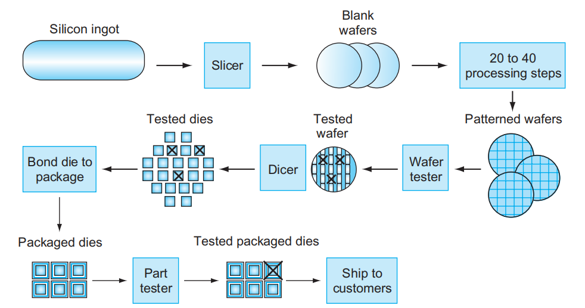
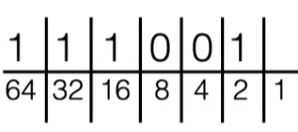
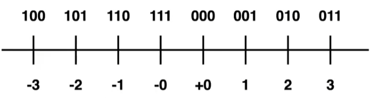

- (introduction)
	- different computers
	  collapsed:: true
		- personal computers
		- servers
		  collapsed:: true
			- usually accessed through network
			- designed to manage large-scale problems
		- embedded computers
			- widest used computers
			- small scale ad limited functions,
			- used in special occasions,
	- basic ideas
	  collapsed:: true
		- moore's law
		  collapsed:: true
			- single thread's ability is growing slower, while the enhancement nowaday is mostly due to multi threads,
			- computer architects must anticipate(foresee) where the technology *will be* when the design finishes, instead of where it *starts*.
		- abstraction
		  collapsed:: true
			- hidden lower-level details, and *encapsulate* to a simpler *model* for higher levels' design,
		- make the common case fast
		  collapsed:: true
			- common case is often simpler than the rare case, so that it is usually easier to enhance.
			- while it is important to figure out what the common case is,
		- parallelism computation
		  collapsed:: true
			- amdahl's law
		- pipelining
		  collapsed:: true
			- a particular pattern of parallelism,
			- which means separate big task into a *sequence* of tasks, and distribute each task to one processor,
		- prediction
		  collapsed:: true
			- make a relatively accurate prediction and start working, instead of waiting until precise analysis,
			- recover from a misprediction is always not too expensive,
		- memory hierarchy
		  collapsed:: true
			- memory cannot be fast, large, as well as cheap,
			- putting the fastest, smallest, and the most expensive memory per bit at the top of the hierarchy and the slowest, largest, and cheapest per bit at the bottom gives a balance,
		- dependablity(durability)
		  collapsed:: true
			- Since any physical device can fail, we make systems dependable by including redundant components that can take over when a failure occurs and to help detect failures.
	- software
	  collapsed:: true
		- operating system
		  collapsed:: true
			- interface between applications and hardware,
			- provide common services for applications to use,
				- basic input and output,
				- allocating memory,
				- allocating CPU resources to running different applications simultaneously,
		- compiler
		  collapsed:: true
			- usage
			  collapsed:: true
				- translation of a program written in a high-level language, such as C, C++, Java into instructions that the hardware can execute,
				  id:: 63341b9a-dc4f-4098-be18-e223a71152db
			- assembler
			  collapsed:: true
				- translates a "symbolic" version(assembly language) of an instruction into the binary version(machine language),
				- *both* instructions and data are interpreted by (binary) numbers,
				- assembly language is written in "Declarative Paradigm", such as `add A, B`,
	- hardware
	  collapsed:: true
		- architecture
		  collapsed:: true
			- every computer performs *four functions* : inputting data, outputting data, processing data, and storing data,
			- computer requires *four components* to achieve these functions : input, output, processor(datapath and control), memory; this organization is independent of hardware technology,
		- I/O device
		  collapsed:: true
			- display
				- liquid crystal displays (LCDs),
				  collapsed:: true
					- LCD is not the source of light; instead, it controls the transmission of light.
					- LCD use an "active matrix" that has a tiny transistor switch at each pixel to control light source,
				- bit map
				  collapsed:: true
					- the "display image" is actually a matrix of pixels, and each pixel can display one selected color, this image always called "bit map".
					- A color display might use 8 bits for each of the three colors (red, blue, and green), for 24 bits per pixel,
					- the display matrices' range is the "resolution" of the screen, such as 1024 × 768, or 2048 × 1536,
				- refresh rate
		- integrated circuits(chips)
		  collapsed:: true
			- silicon
			  collapsed:: true
				- silicon does not conduct electricity well,
				- With a special chemical process, silicon can be transformed to three different devices:
					- conductors of electricity(add copper),
					- insulators from electricity
					- semi-conductor,
			- (silicon manufacturing)
			  collapsed:: true
				- {:height 212, :width 387}
			- transistor
			  collapsed:: true
				- an on/off switch controlled by electricity,
				- *integrated* circuit combined dozens to hundreds of transistors into a single chip,
				  id:: 634294dd-dad4-4805-9db3-1073795e5974
			- processor
			  collapsed:: true
				- concepts
				  collapsed:: true
					- comprises two main components: datapath(performs arithmetic operations) and control,
				- cache(memory)
				  collapsed:: true
					- a small, fast memory bulit in the processor, acting as a buffer for the DRAM,
					- Cache is SRAM(static random access memory), which is faster but less dense, and hence more expensive than DRAM,
				- instruction set architecture
				  collapsed:: true
					- the interface between the hardware and the *lowest-level*  software,
					- these statements always be encapsulated by operating systems and provided as ABI(application *binary* interface), so that programmers don't need to konw the details,
			- DRAM(dynamic random access memory)
			  collapsed:: true
				- In contrast to sequential access memories, such as magnetic tapes; "random" means each portion of the memory can be accessed at the same time, 
				  id:: 63428f04-7bbf-484a-920a-7138e4f1df04
		- storage(nonvolatile memory)
		- networks
		  collapsed:: true
			- LAN(local area network) and WAN(Wide area networks),
	- program performance
	  collapsed:: true
		- overall
		  collapsed:: true
			- performance of a program depends on many different aspects, including software and hardware,
			- every components' combination decides the overall performance,
		- software
		  collapsed:: true
			- algorithm
			- programming language
			  collapsed:: true
				- the difference between computer language and programming language,
		- hardware
		  collapsed:: true
			- processor
			- memory
			- I/O system
		- assessment
		  collapsed:: true
			- response time(execution time)
			  collapsed:: true
				- the time between the start and completion of a task,
				- usually used in personal computers,
				- "increase performance" means "decrease execution time",
			- bandwidth(throughput)
			  collapsed:: true
				- the amount of work done in a given time,
				- usually used in big Data centers,
			- comparison
			  collapsed:: true
				- an increase in response time may increase bandwidth,
				- while the increase of bandwidth could achieve through parallel computing, and doesn't increase response time,
				- most times, these two values will affect each other, so response time is more commonly used,
			- wall clock time
			  collapsed:: true
				- CPU execution time
				  collapsed:: true
					- a processor may work on several programs simultaneously,
					- CPU time is the time that CPU spends computing for specific task and does not include time spent waiting for I/O or running other programs; instead of the total execution time,
				- user CPU time
				  collapsed:: true
					- every software need to running with the interaction between operating systems,
					- user CPU time means the CPU time spent in the program,
					- however, differentiating between system and user CPU time is difficult to do accurately,
				- in conclusion, *system performance* refer to elapsed time on an unloaded system, *CPU performance* refer to user CPU time,
			- CPU performance
			  collapsed:: true
				- clock cycles
				  collapsed:: true
					- processors are constructed using a clock that determines when events take place in the hardware,
				- clock cycles per instruction(CPI)
				  collapsed:: true
					- the average number of clock cycles each instruction takes to execute,
				- Instruction count
				  collapsed:: true
					- Instructions executed for the program
	- power wall
	  collapsed:: true
		- general
		  collapsed:: true
			- both clock rate and power increased rapidly for 
			  decades, but then flattened off recently,
			- performance and power are correlated,
		- CMOS
		  collapsed:: true
			- CMOS, short for complementary metal oxide semiconductor, is the dominant technology for integrated circuits,
			- "dynamic" energy
				- the energy cost by CMOS is mainly from the switching(0 to 1) of transistors,
				- for each transistor, the energy E ∝ C \cdot V^{2},
					- C means capacitive loading of each transistor; is a function of both the number of transistors connected to an output (fanout) and the manufacturing technology,
					- V means the voltage applied;  voltage could be reduced by the evolution of technology(about 15% per generation), but  lowering of the voltage appears to make the 
					  transistors too "leaky", like water faucets that cannot be completely shut off,
				- so that the overall energy P ∝ C \cdot V^{2} \cdot F,
				  collapsed:: true
					- F means Frequency switched, is a function of the clock rate,
			- static energy
				- with the decrease of voltage, the transistor will become unstable, and might leak energy even it turned off,
				- with the increase of transistors, the total leakage is increase as well,
				- In servers, leakage is typically responsible for 40% of the energy consumption, although still less than dynamic energy, the impact of it cannot be neglected,
	- multiple processors
	  collapsed:: true
		- cores
			- because the power wall, companies began to divide one processor into multiple "micro"processor, instead of increasing the ability of one processor,
			- these micro processors are usually named as "cores",
		- change
			- multicore processors is benifit more on the throughput than on response time,
			- which means the same program's response time can't full use this enhancement of processor,
			- sothat programmers need to change their code to take advantage of this change,
		- parallelism
		  collapsed:: true
			- pipelining
				- "pipeline" is an instruction-level parallelism,
				- which means the hardware are designed as if it were executing instructions sequentially,
				- it is implemented by "overlapping" the execution of the instructions,
			- challenge
				- the instructions are in fact sequentially, sothat it will be hard to rewrite it in a parallelism way,
				- it is hard to give each core same amount of works, and  the coordination of cores might waste time,
	- Amdahl's Law
	  collapsed:: true
		- the enhancement possible with a given improvement(hardware or software), is limited by the amount of operations that *can benifit from* the improvement,
		-
- (intro to C)
  collapsed:: true
	- basic characteristics
	  collapsed:: true
		- C is very close to how computer work, so it is perfect to use in teaching computer science,
		- but C is unsafe, so Go(or Java) or Rust is more recommended,
	- compile
	  collapsed:: true
		- disadvantages : compile file are architecture - specific, depending on processor type(x86, ARM) and operating system,
		  collapsed:: true
			- gcc creates machine language code,
			- javac creates 'bytecode' used in jvm(java virtual machine), which is closer to machine code but not same,
		- Pre-processor
			- `#include`statements just *copy* the file, but not *execute* the code,
	- data types
	  collapsed:: true
		- numerical types
		- const variable
		- enumerator types
	- struct and typedef
	- functions
	- pointer
	- "undefined behavior"
	  collapsed:: true
		- these codes might not crash every time, but may crash randomly,
- data representation
  collapsed:: true
	- numbers
	  collapsed:: true
		- number base
		  collapsed:: true
			- binary
			  collapsed:: true
				- always present by prefix `0b`,
				- transistor could only present two values,
				- most significant bit(msb) and least significant bit(lsb)
			- translation between binary and decimal,
			  collapsed:: true
				- a basic tip {:height 100, :width 220},
			- binary arithmetic
			  collapsed:: true
				- addtion, carry bit and overflow,
			- hexadecimal
			  collapsed:: true
				- always present by prefix `0x`,
				- group of four from right to left,
		- signed numbers
		  collapsed:: true
			- sign and magnitude
			  collapsed:: true
				- use first bit to represent the sign(negative`-` or positive`+`),
				- will make two zeros,
			- (one's complement)
			  collapsed:: true
				- reverse the bit of positive numbers,
				- {:height 85, :width 289},
				- still have two zeros,
			- two's complement
			  collapsed:: true
				- common used,
				- $\begin{array}{c|c|c|c|c|c|c|c}  \hline  000 & 001 & 010 & 011 & 100 & 101 & 110 & 111 \\ \hline 0 & 1 & 2 & 3 & -4 & -3 & -2 & -1 \\ 0 & 1 & 2 & 3 & 4 & 5 & 6 & 7 \\\hline \end{array}$，
				- first bit still represent the sign(1 is negative),
		- (bias encoding)
		  collapsed:: true
			- like $\begin{array}{c|c|c|c|c|c|c|c}  \hline  000 & 001 & 010 & 011 & 100 & 101 & 110 & 111 \\ \hline 0 & 1 & 2 & 3 & -4 & -3 & -2 & -1 \\ 3 & 4 & 5 & 6 & -1 & 0 & 1 & 2 \\\hline \end{array}$，
			- the representing range shift from [-4, 3] to [0, 6],
		- (IEC notation for powers of two)
	- arithmetic operation
- components of a computer
  collapsed:: true
	- processor
		- control
		- ALU
		- registers
	- memory
		- input and output,
- memory
- processor
  collapsed:: true
	- instruction set
	- CPU
- bus
- I/O stream
-
- [[Science]]