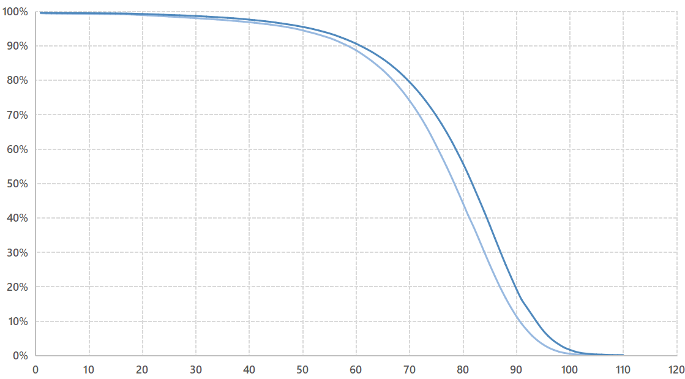

- 综述
  collapsed:: true
	- 以下的一切，都来源于对死亡的未知以及恐惧；虽然我努力试着给出自己一个解释，但是从唯物主义的角度上，人类目前还没能够得到一个合理的答案，
	- 我所做的一切努力，都是基于对未来的期待；也就是通过人类已有的知识，来尝试降低部分威胁生命的随机事件的发生概率，
	- 然而作为人类，我们的能力也就到此为止了，或者说，存在着很多我们不能改变的命运，
	- 我希望自己能够正视自己的命运，不仅是因为我已经在努力降低随机性，也因为对命运的恐惧想法本身也会威胁生命，
	- “世界上只有一种英雄主义，就是认识世界的本来面目后，仍然爱着世界”，
- 人生观
  collapsed:: true
	- {:height 300, :width 530}，
	- （Number of Survivors by Age from the Period Life Tables, England and Wales, Males, 2010）
	- {:height 330, :width 530}
	- {:height 210, :width 530}
	- 生命
	  collapsed:: true
		- 综述
		  collapsed:: true
			- 所谓的“意义”基本可以分为两类问题；第一类是生命是怎么设计的，第二类是生命为什么是这么设计的，
			- 幸福，存在的价值，生命的意义；这些被探讨了很久的哲学问题，实际上也可以大概的分为这两大类问题，
			- 随着神经科学，进化科学，物理学的逐步发展，我们对第一类问题有了一定的理解，
			- 然而，对于第二类问题，我们几乎还是没有任何思路，
			- 只是随着科学的不断发展，我们对第二类问题的答案的“猜想”越来越丰富了，
		- 死亡
		  collapsed:: true
			- 随着科学的发展，我们对死亡的认识也在逐步增加，
			- 我们知道为什么我们恐惧死亡，
			  collapsed:: true
				- 死亡限制了我们对未来的期待，而人类可以通过对未来的期待获得“幸福感”，
				- 死亡是我们无法理解的事物，而不理解的事物会引起我们的危机感，并进一步促使我们做出行动，
					- 或者说死亡的“无限性”，“永恒性”是我们不能理解的——事实上，我们“理解”死亡意味着什么，它意味着我们不能再接收外界信息，也不能再产生对外界信息的反应，就跟熟睡的感觉差不多，
					- 然而，作为有限的生物，我们能理解睡眠的有限性，但不能理解死亡的无限性，
			- 同理，我们也知道为什么我们不会恐惧死亡，
			  collapsed:: true
				- “恐惧”行为是大脑的一种功能；“死亡”也只是我们形成的一种认识，
				- 如果大脑疲劳了，那么我们会“累的”不能恐惧，或者“累的”忘了死亡的概念，
				- 我们随时都在与外界交互，会有新的认识替代“死亡”这种认识占据思想的主要位置，从而使得我们调低了死亡的优先级，并专注于处理新的认识，
				  collapsed:: true
					- 这种新的认识的具体内容因人而异，
				- 死亡不可解释的部分给想象力留下了空间，从而产生了“来世”，“轮回”等宗教的解释，这些解释可以缓解我们的危机感，从而减轻我们的恐惧，
					- 可以看出，部分宗教理论可以（部分）解释第二类问题，
					- 由于科学不能证伪这些结论；所以，或许一些人可以通过相信这些解释来消除危机感，
					- 然而，由于科学也没能证实这些结论，因此这些解释或许并不能缓解一些人的危机感，
			- 可是，这些言论从神经科学的角度解释了“死亡”和“恐惧”是怎么样的，但没有解释“死亡”为什么是这样，
			- 或许，试图通过意识去了解意识自身不存在的情况，本身就是不可能的，
	- 人生
	  collapsed:: true
		- 死亡的无穷性
		  collapsed:: true
			- 作为有限的生物，我们不能理解死亡为什么是无穷的，也不能理解无穷本身，
		- 意识的物质性
		  collapsed:: true
			- “恐惧”行为是大脑的一种功能；“死亡”也只是我们形成的一种认识，
			- 我们可以改变对死亡的认识，也可以不恐惧死亡；但这终究只是意识内部的行为，不会改变死亡的客观性，
		- 意识的时效性
		  collapsed:: true
			- 人类的行为局限于当下的时间，
			- 而且近期的时间对当下的影响更明显，远期的时间的影响较少，
		- 科学的发展
		  collapsed:: true
			- 科学仍然没有给这些问题一个“完美”的解释，
			- 但是科学的进步让我们的寿命更长，思想也更加开放，
			- 相比之下，局限于自己的意识的哲学思辨则更难以解决这些问题，
		- 必然是自由的限度
		  collapsed:: true
			- 生物的必然性
			  collapsed:: true
				- 作为生物，我们不能改变自己的生物本质，即人类寿命的生物学限制，
				- 作为一个整体，人类不能否认认识的长期性与曲折性——我很希望人类有一天能够对世界、对科学有充分的、完全的了解，从而可以让人类超越生物学限制，我并非想否认这一天绝对不可能到来，但是即使有这样一天，从现在到那一天之间也一定有着长期的，曲折的认识历程。
				- 人类史，科学史，甚至新中国的发展史都证明了，人类对世界的认识是可能的，至少是部分可能的。例如，就在仅仅几十年前的1981年，中国人均寿命只有68岁，现在的2020年，中国人均寿命已经达到了77岁——对于习惯了夸张的统计数字的现在人而言，这一不到十年的增长可能“不值一提”，或者更夸张一点，再长也没有达到地球、太阳等恒星的生命周期；但是，对于我们身边常见的任何预期寿命只有几十年或十几年的哺乳动物而言，这十年几乎就是一辈子，
				- 这种困扰的根本原因在于，我们对世界的认识能力要远远落后于我们跳跃的思维能力，我不想纯粹的批判人类丰富的想象力，只是我们所拥有的任何强大武器都是双刃剑，想象力也是一样；它帮助人类创造出了许多自然界不存在的事物，但是也给了我们太多“不切实际”的欲望，
			- 自由的限度
			  collapsed:: true
				- 我们不能改变我们的生物本质，也不能改变认识的长期性，这是我们的必然性限制，
				- 如果认识不到这种限制，那么我们难免会自暴自弃，因为我们总会发现，现实世界的进展如此的慢，即使我十年如一日的坚持“良好作息”，我可能也看不到自己到底有多“健康”；或者更直白的说，看不到对死亡终会到来的命运有任何改变，
				- 然而，问题并非在于我们无法跨越死亡，而是我们跳跃的想象力带来的欲望本身就是“错误”的，不切实际的，
				- 在认清了人类的生物必然性后，科学已经在寿命方面给予了我们充足的自由，正如近几十年中国的例子，
			- 科学的局限性
			  collapsed:: true
				- 应该了解什么是可以改变的，什么是可以理解但不可以改变的，
				- 作为社会生物，与外界的持续的信息交换是不可避免的，对外界信息做出的反应也可能只有部分可以改变，
				- 科学并没有完全解释大脑的运行逻辑，很多科普书籍可能只从某一“具体”方面解释了脑科学，但附加了更多的冗余信息。应该从更“抽象”的角度思考、反思自己的行为的机制，不应过多关注这些科普书籍，
		- 长期性
		  collapsed:: true
			- 我现在身体比较健康，考虑到人生历程的复杂性与多样性，这一矛盾在不同时期可能会让位给不同的，更突出的矛盾，
			- 可以在“一定程度”上暂时放弃这一矛盾，即可以不十分严格的遵循制定的生活习惯，但应该保持一定的“底线”，例如不能“长期”摄入过多的不健康食品，不能“长期”熬夜，不能接触烟酒等有明确健康危害的物质，
	- 世界
	  collapsed:: true
		- 过去
		  collapsed:: true
			- 我不止一次思考过死亡，也对应的得到了很多的答案，
			- 现在看来，这些答案一部分是基于对未来的期望，例如未来人类会开发出一些科技，让我能够继续活下去；另一部分是由于意识的时效性，一些其它的事情压制了死亡带来的恐惧，所以大脑转而思考那些事情，
			- 实事求是的说， 这两类答案都是不可持续的；
				- 首先，即使我对未来的期望是可行的，人类的科技真的能够发展，这个解释也不能应对随时可能发生的意外事件；当面对多种多样的死亡情景时，我就会明白死亡并不是那么遥远的事情，也不是凭借对未来的一个期待就可以避免的事情，
				- 其次，对于意识的时效性， 这实际上没有解决问题，只是暂时忽略了问题，
		- 随机理论
		  collapsed:: true
			- 随机理论，是我从哲学层面思考得到的一个民科的结论，
			- 我认为，世界本没有“物”，也就没有所谓更高一级的“造物”者；一切都是“随机”出现的，
			- 基本粒子可以出现，也可以不出现；粒子可以组成物质，也可以不组成物质，
			- 只是大量的随机性实验之后，物质“偶然”的出现了；就像大量随机分布的联合分布会收敛于正态分布一样，物质积攒了大量的随机性，因此拥有了一定的必然性， 这些必然性让物质更加稳定，从而得以继续“存在”下去，
			- 生命也是一样，可以出现也可以不出现，只是大量的星球的实验之下，生命偶然的出现在地球上，生命的形式带有一定的必然性，从而可以稳定的存在下去，
			- 在进一步的，大量的随机试验的条件下，人类这样的复杂生命出现了，
			- 人类所拥有的“意识”的本质，就是人类可以“随机”的创造自己的未来，而不是像其他生命一样被动的对外界做出反应，
			- 然而，“不幸”的是，人类本身也是一种稳定的生物，如果随机是世界的规律的话，那么我们实际上违背了自然界的随机性，因此注定会走向死亡，
			- 当然，我们消散成的细胞，化学物质，元素，相比于基本粒子，也算是一种稳定的存在；或许只是它们结构简单，因此稳定性更强，更不容易“死亡”，
			- 人类同样明白，稳定代表着僵化不变，而随机则代表着创新，只是站在自己的意识的立场上，我怎么也无法说服自己，创新的代价是我的死亡这个事实，
		- 积极性
		  collapsed:: true
			- 事实上，随机理论本身并不是一个积极性的理论， 因为它并没有承诺一个更“光明”的未来；但是，反过来说，它也没有给出一个人类必然会灭亡，物质一定都会湮灭的悲观结局。它只是给出了一个很不确定的，“随机”的未来，
			- 然而，还是从中可以找到一定的积极性——那就是人类的“存在”这个事实本身。这有些类似“人择原理”，但是那是站在人类的，“意识”的角度来看；对于所有存在的物质而言，大量的随机性中，的确出现了一定的确定性和多样性，
		- 时间
		  collapsed:: true
			- 然而，作为民科理论，我的观点有着很多的不足，
			- 最大的不足就是它无法解释时间的地位——如果一切都只是在随机的运动，那么为什么时间只有一个方向呢？
			- 我认为，“时间”不只是我们创造的名词，也是客观存在的一维性；或者说，真的不需要时间这个概念，物质和运动就可以解释现有的世界，
		- 未来
		  collapsed:: true
			- 既然将一切都归结为随机试验，我的民科理论同样不能描述未来，或者说及其遥远的未来，
			- “世界”会变得更丰富吗？会有更优秀的“生物”存在吗？时间会不会消失？虽然按照已有的世界的样子，我们可以给出一个乐观的预期，然而“无限”是个永远不能解释的问题，
		- 期待
		  collapsed:: true
			- 我很希望自己能够做到更多，能够活得更久，
			- 然而，作为一个有限的个体，面对一个如此庞大而复杂的世界，我无法利用希望这样主观的观点来说服自己，
			- 因此，我将一切的期待放在随机性上，而不是我的主观想象；我仍然会暗中期待自己会有一个更好的命运， 也会试着通过个人的努力将部分随机性转化为一定的确定性，然而我希望自己能明白，更多的事情都只是随机的，偶然的发生的，
	- 命运
	  collapsed:: true
		- 我现在一人在家，没有社会关系，情绪抑郁，对未来没有希望，面临的挑战艰巨；所以我经常会恐惧，恐惧自己或许已经没有未来了，
		- 然而，考虑到我的过去——十五年自慰史，头发变白，不爱运动，身体超重，爱吃零食，情绪容易激动，经常感冒；能活到现在，已经是随机性对我最好的照顾了，
		- 即使这样，我也明白，死亡才是命运给我的结局——在发达地区，大约有3%的人会在50岁以前去世，我知道，我的命运就是这3%，
		- 我听说过置之死地而后生的典故，可是大部分被置之死地的人，都是没能“后生”的；我就是那个被命运置之死地的人，虽然我现在还侥幸活着，可是我知道，从过去的角度来说，等着我的只可能是下一次置之死地，而不可能是后生，
		- 随机性的一粒尘，落到每个人身上都是一座山，
	- 选择
	  collapsed:: true
		- 所以，我为什么不选择直接回到社会？
		- 我又给了自己一个“解释”，希望这个解释可以帮助我努力前进，努力去避免死亡，同时也甘愿接受随机性带来的命运，
- 神经科学综述
  collapsed:: true
	- 生物水平：细胞生物学与生物化学；如神经细胞，神经电位，神经递质等，
	- 组织层面：神经科学与脑科学；如额叶皮层，边缘系统，交感神经等，
	- 行为层面：生物心理学与神经经济学；如记忆，情绪反应，做出选择等，
		- 简单神经行为
		  collapsed:: true
			- 视觉，嗅觉等感觉，
		- 复杂神经行为
		  collapsed:: true
			- 认知行为
				- 基本认知：信息组织，信息加工，
				- 复杂认知：问题解决，语言，
- 神经科学的意义
  collapsed:: true
	- “三元论”
	  collapsed:: true
		- 综合我的个人经验和了解到的一些神经科学知识，我认为人类是一种“三元论”的生物，即主观意识，被动意识和行动，三者并不能完全等同。
		- 简言之，我们的“被动意识”（如思考的事情，产生的想法）和“行动”（做出的行为），虽然表面上都是在“主观意识”的觉察和管理之下进行的，但是主观意识并*不能对前两者做出决定性的影响*，即前两者拥有很大的独立性与自主性，
		- 落实到实践上，就是我们并不能做到我们“想要”做到的事情。
		- 这不仅是因为我们的主观意识过于丰富，或者说我们的想象能力远远超过了我们的实践能力；即使对于在我们的实践能力内的那些想法，主观意识也不能彻底的控制我们的行为，
	- 神经的科学机制
	  collapsed:: true
		- 具体的，物质性的生物生理学基础，可以帮助我了解我应该*如何*通过做出具体的“想法”（主观意识）来调动“想法”（被动意识），并最终做出行为，
		- 我认为，只有神经科学这种有生物基础的理论，才能做出更广泛，适用性更强的指导，
		- 相比之下，“畅销”的心理学书籍就像畅销的理财书籍一样，只是面对部分强者的，不能广泛的对大部分人的生活做出指导，
	- 神经科学的限制
	  collapsed:: true
		- 根据我个人的经验，不仅是身体素质和智商等可观测的精神素质存在着人际差异，基本的“想法”之间也存在着人际差异，
		- 换言之，我以为自己的思维能力是“主观”的，“能动”的，但它们实际上有着客观的物质基础，也有着对应的局限性，
		- 而且，这些先天的差异*不能*通过后天的思维锻炼*彻底*改变；就像身体素质和智商一样，后天的练习可以增强我们的身体素质，也可以让我们学到更多的东西，但不能让我们成为运动员或是教授，
		- 或许我的“主观意识”是“自由”的，但是我的被动意识和行动从来都不是自由的，也不可能完全按照我的主观意识所“想”的那样做出反应，
		- 我需要神经科学的知识的指导，需要一个长期的，缓慢的过程来尝试着做到我的主观意识所希望做到的那些改变；然而，很多“想法”可能最终仍然无法实现，
- [[认识与实践]]
- [[生活规划]]
- [[神经生物学]]
- [[行为神经科学]]
- [[认知神经科学]]
- [[社会神经科学]]
- Others
  collapsed:: true
	- 大脑的老化
	  collapsed:: true
		- 丰富的环境已被证明可以增加树突分支、树突棘的大小和数量、突触的大小、成人神经发生的速度以及各种神经营养因子的水平；其对健康的宏观作用也在癫痫、亨廷顿氏病、阿尔茨海默氏病、帕金森氏病、唐氏综合征病、脑肿瘤以及各种形式的中风和创伤性脑损伤的动物模型中得到证明；此外，规律的体育锻炼也被证明对啮齿类动物的大脑有多种有益的影响，
		- 研究显示，与年龄相关的大脑缺陷是从右向左依次出现的，这意味着右脑要先于左脑丧失功能。右脑掌控空间感和处理新奇事物的信息，左脑负责语言和日常行为。某些右脑缺陷的症状表现为视觉空间感和学习能力下降，
		- 多伦多大学的研究显示，年龄为14—30岁的人在从事认知活动时倾向于强化使用颞叶。受教育程度越高，人们就会越多地使用大脑的这一区域。而65岁以上的人接到同样的认知任务时，他们倾向于使用额叶。受教育程度越高，他们就会越多地使用额叶。
		- 认知储备（部分等同于受教育程度）被认为在脑损伤后观察到的改善中起作用——然而，这并不是因为“认知储备”可以帮助患者的大脑修复损伤组织，而是因为患者的认知储备允许他们以替代的方式完成任务，
		- 研究者曾经试图在受损区域附近植入干细胞来修复受损中枢神经系统组织，但成效甚微，已有的部分结果也仅停留在动物实验中；然而，研究显示，进行适当的康复训练可以帮助患者恢复得更好，
		- 认知和身体活跃的人更不容易患神经疾病，且他们的恢复会更好；然而，这类研究中总是存在因果解释的问题，
	- 心理行为的遗传机制
	  collapsed:: true
		- 行为遗传学分支主要关注心理行为个体差异的来源是先天的还是后天的，然而，考虑到人的生活背景和生活周期的复杂性，这一方面的研究比较难以开展，
		- 认知心理学
		  collapsed:: true
			- 方差分析模型显示，遗传因素对一般认知能力的贡献至少可达50%，另外50%的贡献则来自于环境因素，其中25%来源于共享环境因素，25%来源于其它环境因素，
		- 精神病理学
		  collapsed:: true
			- 研究显示，不同的精神疾病受遗传的影响不同，但可以确认遗传和环境都发挥了一定的作用；一些研究者认为，遗传因素（即父母的疾病情况）只是改变了后代的环境敏感性，并不是神经组织上的纯负面的影响，
			- 然而，后代的生活环境与父母也有着密切的联系，例如物质成瘾者的孩子可能会继承到一些物质成瘾相关基因，同时也被动地暴露于父母创造的毒品环境中，
	- 心流
	  collapsed:: true
		- 产生条件：任务需要高度集中与投入，任务目标明确，任务能够很快给予回报，任务与我们的能力恰好匹配，
		- 机制：左前额皮层和基底神经节被激活，前额叶皮层中负责自我批评的区域和杏仁核被关闭，人会表现得更有自信，而更不容易畏缩，
	- [[神经递质概述]]
	- [[认知心理学笔记]]
	- [[智力测验的不足]]
-
- [[blank]]