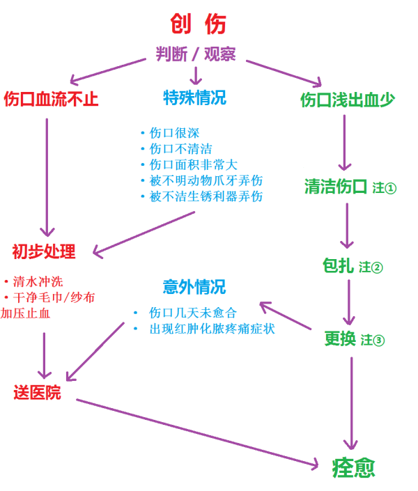
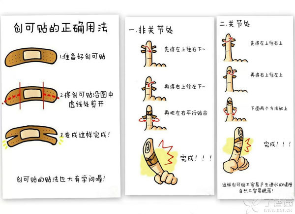

- 
- 注 1：清洁伤口
	- 遇到小型的摔伤擦伤，不建议用酒精消毒，一是因为酒精有刺激性，会使伤口很痛；二是不利于伤口的恢复；
	- 通常推荐用清水或者生理盐水洗掉伤口上的污渍；
	- 如果伤口有出血可以用棉签蘸碘伏去擦，现在还有一次性密封装的碘伏棉签。
	- 特别强调不推荐使用红药水、紫药水和碘酒
		- 红药水里面含有红汞，汞是有毒性的，它可以通过破的伤口被人体吸收；
		- 紫药水的成分是龙胆紫，它的杀菌作用比较弱，还会在伤口上面留下斑点；
	- 碘酒（不是碘伏）含酒精，擦伤口还是会疼；
- 注 2：包扎
	- 如果伤口小可以用创可贴；
	- 如果伤口大可以用大一点的创可贴；
	- 如果伤口比大一点的创可贴还大，那就用干净的纱布了。
- 注 3：更换
	- 创可贴和纱布按时更换，如果粘在伤口上，可以用生理盐水沾湿，轻轻揭下。假如被打湿、弄脏了，要及时换新。
	- 家中常备一些外伤处理药材，比如碘伏、创可贴是很有必要的
	- 不要用木屑、草灰、爽身粉、食盐或者阿莫西林片碾成的粉等粉状物来涂抹伤口。这些东西无法吸收，会加剧伤口炎性反应，给医生清理创口带来难度，还会使得伤口会发展成不规则、质硬的结节或斑块，也可能导致溃烂创面或形成脓肿。
- 
- [[Medicine]]
-