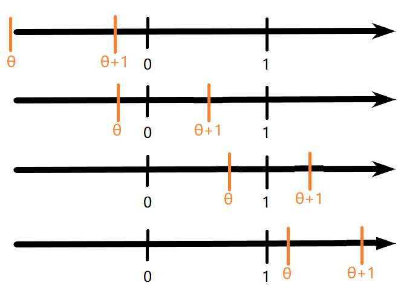

- 假设与参数空间
  collapsed:: true
	- 假设
	  collapsed:: true
		- 称关于总体参数的一个命题为假设，
		- 原假设（H_{0}）
		- 备择假设（H_{1}）
		- 原假设与备择假设互补，
	- 参数空间
	  collapsed:: true
		- 原假设与备择假设定义的空间的并集，有时不是参数θ的自然取值范围，
	- 假设的形式
	  collapsed:: true
		- 简单假设：原假设的参数空间\Theta_{0}或备择假设的参数空间\Theta_{1}为一个点（一个值），
		- 复合假设：不是简单假设的其它假设，
	- 复合检验
	  collapsed:: true
		- （并 - ）交检验
		  collapsed:: true
			- 假设
			  collapsed:: true
				- 指原假设可以被表示为一个交集的情况，
				- 如H_{0}：$\mu \le \mu_{0} \cap \mu \ge \mu_{0}$（即\mu = \mu_{0}），
				- 此处的假设也可以涉及多个参数，
			- 拒绝域
			  collapsed:: true
				- 拒绝域可以用每个假设的拒绝域的并集来表示，
				- 如H_{0}：$\mu \le \mu_{0}$的拒绝域为$\dfrac{\bar{X} - \mu_{0}}{S / \sqrt{n}} \ge t_{1}$，而H_{0}：$\mu \ge \mu_{0}$的拒绝域为$\dfrac{\bar{X} - \mu_{0}}{S / \sqrt{n}} \le t_{2}$，
				- 所以H_{0}：$\mu \le \mu_{0} \cap \mu \ge \mu_{0}$的拒绝域为{$\dfrac{\bar{X} - \mu_{0}}{S / \sqrt{n}} \ge t_{1} \cup \dfrac{\bar{X} - \mu_{0}}{S / \sqrt{n}} \le t_{2}$}，
			- 显著性水平
			  collapsed:: true
				- 交检验的功效函数小于每个单独检验的功效函数，
		- （交 - ）并检验
		  collapsed:: true
			- 假设
			  collapsed:: true
				- 指原假设可以被表示为一个并集的情况，
				- 如$H_{0}：\mu \le \mu_{1} \cup \mu \ge \mu_{2} \leftrightarrow H_{1}： \mu_{1} < \mu < \mu_{2}$，
				- 此处的假设也可以涉及多个参数，
			- 拒绝域
			  collapsed:: true
				- 拒绝域可以用每个假设的拒绝域的交集来表示，
				- 如H_{0}：$\mu \le \mu_{1}$的拒绝域为$\dfrac{\bar{X} - \mu_{1}}{S / \sqrt{n}} \ge t_{1}$，而H_{0}：$\mu \ge \mu_{2}$的拒绝域为$\dfrac{\bar{X} - \mu_{2}}{S / \sqrt{n}} \le t_{2}$，
				- 所以H_{0}：$\mu \le \mu_{1} \cup \mu \ge \mu_{2}$的拒绝域为{$t_{1} \le \dfrac{\bar{X} - \mu_{0}}{S / \sqrt{n}} \le t_{2}$}，
			- 显著性水平
			  collapsed:: true
				- 并检验的真实水平为每个单独检验的真实水平的最大值，
- 检验统计量（拒绝域的形式）
	- （直观检验统计量）
	  collapsed:: true
		- 对于部分参数分布，其参数与数字特征有着较直接的联系——如正态分布的参数就是其均值和方差，
		- 因此关于这些分布的参数检验，直观上可以直接使用对应的样本的数字特征，
		- 然而一般情况下，检验的参数可能难以找到直观的对应统计量；或者难以判断找到的检验的优良性，
		- 此时就需要似然比检验和最优检验的理论辅助，
	- 样本空间
	  collapsed:: true
		- 拒绝域与接受域
		  collapsed:: true
			- 类似参数空间，将样本空间划分为互补的两部分；一般称拒绝域为D，则接受域为$\bar{D}$，
			- 在样本落入拒绝域时拒绝H_{0}，
			- 一般情况下，拒绝域由基于样本的统计量给出，
		- 检验函数
			- 定义
			  collapsed:: true
				- 为了便于数学处理，引入检验函数的概念，
				- 设$\vec{X}$为样本，D为拒绝域，
				- 称关于样本的函数\phi(X)为检验函数，表示拒绝H_{0}的*概率*，即\phi(X) \in [0, 1]；
			- 非随机化检验
			  collapsed:: true
				- 一般φ(X)只取离散的两个值，即$\phi(\vec{X}) = \begin{cases}  1 & \vec{X} \in D \\ 0 & \vec{X} \in \bar{D} \end{cases}$，
				- 称这样的检验为非随机化检验，
			- 随机化检验
			  collapsed:: true
				- φ(X)也可取其它的值，如$\phi(\vec{X}) = \begin{cases}  1 & \vec{X} \in D_{1} \\ r & \vec{X} \in D_{2} \\ 0 & \vec{X} \in D_{3} \end{cases}$，
				- 称这样的检验为随机化检验，称D_{2}为“临界值”，
				- 部分实际情况中，样本可能处于临界值区域；此时拒绝或接受H_{0}都有一定的合理性，
				- 一种解决方式为，在临界值时做一次成功概率为r的实验，若实验成功则拒绝H_{0}，
	- （正态分布的检验）
	  collapsed:: true
		- 单样本
			- 均值检验
			  collapsed:: true
				- 方差已知：U检验，
				- 方差未知：t检验，
				- 
			- 方差检验
			  collapsed:: true
				- 均值已知（未知）：均为\chi^{2}检验，只是样本方差的分布不同，
				- 
		- 双样本
			- 均值（差）检验
			  collapsed:: true
				- 方差已知：U检验
				- 方差未知（方差相等）：双样本t检验
				- 
				- 方差未知（样本数成比例）
				- 方差未知（Behrens-Fisher问题）
				  collapsed:: true
					- 大样本方法（U检验）
					  collapsed:: true
						- 
					- Welch t检验
					  collapsed:: true
						- 
			- 方差（比）检验
			  collapsed:: true
				- 均值已知（未知）：均为F检验，只是样本方差的分布不同，
				- 
	- 似然比检验
	  collapsed:: true
		- 假设：$H_{0}: \theta \in \Theta_0 \leftrightarrow H_{1}: \theta \in \Theta_1$，$\Theta = \Theta_{0} \cup \Theta_{1}$，
		- 检验思路
		  collapsed:: true
			- 似然函数定理：似然函数L在参数θ的真值处渐近取得极大值，
			- 可以定义似然比统计量$\Lambda = \dfrac {\sup L(\Theta_0)} {\sup L(\Theta)}$，L为样本的联合分布函数（pdf），
			  collapsed:: true
				- 对于部分假设（主要为单点假设$H_{0}：\theta = \theta_{0} \leftrightarrow H_{1}：\theta = \theta_{1}$），
				- 似然比统计量为$\Lambda = \dfrac {L(\theta_{0})} {L(\theta_{1})}$，
			- 若原假设H0成立，则\Lambda应接近于1；反之，若\Lambda的取值较小，则可以说明原假设不成立，
			- 因此，基础拒绝域为{D：\Lambda ≤ c}，
			- 似然比检验也可用于分布检验，关键在于不同假设时样本的联合分布函数（pdf），
		- 求解技巧
		  collapsed:: true
			- 参数
			  collapsed:: true
				- 检验
				  collapsed:: true
					- 对于单点假设\Theta_{0} = \theta_{0}，一般可直接写出L的形式，
					- 对于复合假设，理论上应分析L在\Theta上的*单调性*，并求解L的极大值对应的\theta取值；并根据*样本*的可能取值*分类讨论*，
					  collapsed:: true
						- 由于mle的性质，一般认为\theta = mle时L(\Theta)取得极大值；因此，部分复合假设的L(\Theta) = L(mle \theta)，
						- （存在似然比检验难以检验的部分假设，如双侧检验H1：a ≤ θ ≤ b，或mle没有闭形式的分布）
				- 冗余参数
				  collapsed:: true
					- 一般使用mle估计未知的冗余参数，
					- 应注意在H_{0}和H_{1}时，冗余参数的mle*可能不同*，
					- 如对于正态检验H_{0}：\mu = \mu_{0}，
					- H_{0}时${\sigma}^{2} = \dfrac{1}{n}\sum \limits _{i= 1}^{n}{({X}_{i} - \mu_{0})}^{2}$，而H_{1}时${\sigma}^{2} = \dfrac{1}{n}\sum \limits _{i= 1}^{n}{({X}_{i} - \overline {X})}^{2}$，
				- 多参数检验
				  collapsed:: true
					- 多参数检验时构造\Lambda的方式一般相同，但最后简化得到的统计量的分布会有区别，
			- 似然函数
			  collapsed:: true
				- 一般为样本的*联合分布*，但也可能为其它情况，
				- n个独立同分布样本（一般情况）
				  collapsed:: true
					- 由独立同分布随机变量的性质，可知，
					- 样本联合分布$f_{\vec{X}}(x_{1}, x_{2},..., x_{n}; {\theta}_{1}, {\theta}_{2},..., {\theta}_{m}) = \prod \limits _{i = 1}^{n} f_{X_{i}}(x_{i}; {\theta}_{1}, {\theta}_{2},..., {\theta}_{m})$，
				- 样本之间不独立
				  collapsed:: true
					- 应根据其他信息，求解联合分布$f_{\vec{X}}(x_{1}, x_{2},..., x_{n}; {\theta}_{1}, {\theta}_{2},..., {\theta}_{m})$，
				- 样本来自不同分布的总体
				  collapsed:: true
					- 应根据总体的不同情况，分别写出对应的样本联合分布，
					- 例如，若总体$X \sim \begin{cases}  f_{X}(x) & case1 \\ g_{X}(x) & case2 \end{cases}$，样本为独立同分布，
					- 则样本联合分布需要对应写为$\vec{X} \sim \begin{cases}  f_{\vec{X}}(\vec{x}) = \prod f_{X}(x) & case1 \\ g_{\vec{X}}(\vec{x}) = \prod g_{X}(x) & case2 \end{cases}$，
					- 然后，依据样本的取值可能，对似然函数分段讨论，
				- 只有几个样本
				  collapsed:: true
					- 应寻找剩余样本的信息，并以概率的形式写入似然函数，
					- 例如，若观测到$X_{1}, X_{2},..., X_{m}$和部分剩余样本信息$X_{m + i} \geq t$，
					- 则似然函数应写为$f_{\vec{X}}(\vec{x}) = \prod \limits _{i = 1}^{m}f_{X_{i}}(x) \cdot \prod \limits _{j = m + 1}^{n}[P(X_{j} \geq t)] = {[f_{X}(x)]}^{m} \cdot {[1 - F_{X}{(t)}]}^{n - m}$，
				- 对于参数和样本都有一定范围的分布（如均匀分布），应分段讨论不同的可能性，可以利用数轴辅助分析，
			- 拒绝域的求解
			  collapsed:: true
				- 基础拒绝域{D：\Lambda ≤ c}，
				- 参数空间
				  collapsed:: true
					- 对于支集依赖于θ的分布，应注意统计量的支集，
					- 对于参数和样本都有一定范围的分布（如均匀分布），应分段讨论不同的可能性，可以利用数轴辅助分析，
					- 分析时应注意题目是否限制了mle值域，
				- 拒绝域的化简
				  collapsed:: true
					- 充分性原理：\Lambda可以化简为仅依赖于充分统计量T的统计量，
					- 可以考虑对数似然比统计量$-2\ln\Lambda = -2[l(H_0)-l(H_1)]$，
					- 似然比统计量可能并非为样本的连续函数（如对于均匀分布），但仍可以分析其单调性，
					- 单调性不明显时，可以利用微积分方法分析，
					- 并非总能得到基于充分统计量T的形式简单的拒绝域，可能只能得到基于T的函数H的拒绝域；
					- H的形式可能较复杂，且分布可能并非常见分布；应尝试寻找给定分布与常见分布（如指数分布，正态分布等）的关系，
					- 在检验统计量具有复合分布时，可以考虑利用条件概率计算拒绝域，
			- 大样本方法
			  collapsed:: true
				- 若\Lambda的形式非常复杂，也可以考虑利用渐近分布求解，
- 检验的评价（拒绝域的取值）
	- 两类错误
	  collapsed:: true
		- 错误I：H0成立时，样本落入拒绝域的概率；即$P_{H_{0}}(\vec{X} \in D)$，
		- 错误II：H1成立时，样本落入接受域的概率（按样本空间的定义，一般为 1 - 样本落入拒绝域的概率）；即$P_{H_{1}}(\vec{X} \in \bar{D}) = 1 - P_{H_{1}}(\vec{X} \in D)$，
		- 由于两类错误分别对应两种假设成立的情况，因此检验只可能犯其中的一个错误，
	- 显著性水平（\alpha值）
	  collapsed:: true
		- 定义
			- 确定拒绝域的基本思想为，*先保证错误I*的概率尽可能小，然后在此基础上尽量减小错误II的概率，
			- 因此定义检验犯错误I的概率的可能性为显著性水平，
			  collapsed:: true
				- （一般称显著性水平的最小值为“真实”水平），
			- 即对于给定的拒绝域和H_{0}成立的条件下，
			- $P_{H_{0}}(\vec{X} \in D) = \alpha$；一般 \alpha 为0.05，0.01等，
		- 计算
		  collapsed:: true
			- 一般为根据拒绝域的形式（统计量），由*显著性水平*求解样本 $\vec{x}$ 的取值，
			- 分布的上侧α分位数
		- （随机化检验）
		  collapsed:: true
			- 对于离散分布，由于样本为离散的值，因此可能难以找到使水平\alpha恰好为0.05的拒绝域，
			- 可能对于拒绝域A，B，有$P_{H_{0}}(X \in A) > 0.05$，而$P_{H_{0}}(X \in B) < 0.05$，
			- 一种解决方法为，引入一个（独立）随机变量$W \sim b(1, p)$，
			- 将拒绝域取为B或A且W = 1时，拒绝H_{0}，
			- 则由加法公式，拒绝域对应的水平\alpha为P(B) + P(A)p，
			- 因此，可根据具体的P(B)，P(A)计算W的参数p，使P(B) + P(A)p = 0.05，
	- 推广（不同样本）：P值
	  collapsed:: true
		- 定义
		  collapsed:: true
			- 称H_{0}成立的情况下，具体的样本落入设定的拒绝域的概率为p值，为样本$\vec{X}$的函数，
			- 即$p = P_{H_{0}}(\vec{X} \in D[\vec{x}_{0}])$，
		- 计算
		  collapsed:: true
			- 一般为根据拒绝域的形式（统计量），代入具体的*样本值* $\vec{x}_{0}$；再反过来求解对应的水平，
			- 即p = 0.05时，样本值 $\vec{x}_{0}$应等同于根据\alpha = 0.05算出的拒绝域$\vec{x}_{\alpha}$，
			- 示例
				- 单样本U检验
					- H_{0}：μ \le μ_{0}，
					- 拒绝域应该为{$D：\bar{X} > d$}，
					- 若具体的样本值为$\vec{x}_{0}$，
					- 则p值 = $P_{H_{0}}(\bar{X} > x_{0}) = P_{H_{0}}[(\bar{X} - \mu_{0})\dfrac{\sqrt{n}}{\sigma} > (x_{0} - \mu_{0})\dfrac{\sqrt{n}}{\sigma}] = P_{H_{0}}(U > (x_{0} - \mu_{0})\dfrac{\sqrt{n}}{\sigma})$，
				- 二项分布检验
					- H_{0}：p \le p_{0}，
					- 拒绝域一般写为{$D：\bar{X} \ge d$}，
					- 若具体的样本值为$\vec{x}_{0}$，
					- 则p值 = $P_{H_{0}}(\bar{X} \ge x_{0}) = \sum \limits _{i = x_{0}}^{n}{n \choose i}{p^{i}}{(1-p)^{n - i}}$，
		- 性质
		  collapsed:: true
			- p值可以理解为不同的样本犯第一类错误的概率；因此理论上更小的p值倾向于接受H_{0}，
			- p值为样本$\vec{X}$的函数，因此也可看作统计量，其支集为[0, 1]，
	- 推广（不同参数）：功效函数
	  collapsed:: true
		- 定义
		  collapsed:: true
			- 参数\theta的不同取值下，（同一）样本落入拒绝域的概率，
			- 即$\beta(\theta) = P_{\theta}(\vec{X} \in D)(= E[\phi(\vec{X})])$，为关于参数θ的函数，
			- 不同样本量时，样本的联合分布一般不同，所以功效函数一般也会受样本量n影响，
		- 示例
		  collapsed:: true
			- {:height 212, :width 248}，
			- 理想情况下，希望犯两类错误的概率都尽可能低，
			- 即\beta(\theta)在\theta \in \Theta{0}时应尽可能的小，而\theta \in \Theta_{1}时应尽可能的大，
			- 然而对于一般的连续函数，可知这一点是无法做到的，
		- 求解技巧
		  collapsed:: true
			- 求解时应注意功效函数为参数\theta的函数；因此，一般应依据\theta的不同取值分段讨论，
			- 讨论的基础一般为*原假设成立*时的情况，
			- 对于均匀分布等支集依赖于\theta的分布，仍应以\theta为核心；然后在每个确定的\theta的分段内，分析统计量（随机变量）的具体支集；然后分析事件，并求解概率，
			- 示例
			  collapsed:: true
				- 对于总体$X \sim U(\theta, \theta + 1)$和假设$H_{0}: \theta \leq 0 \leftrightarrow H_{1}:\theta > 0$；可知$\theta \in R$，
				- 应根据原假设H_{0}：\theta = 0的情况讨论，
				- 因此，一般可分为四段 {:height 250, :width 330}，
- （一致）最优检验
	- 定义
	  collapsed:: true
		- 在所有错误I的概率不超过\alpha的拒绝域中，若拒绝域R的错误II的概率最小，则称R为（一致）最优拒绝域（UMP），
		- 即\theta \in H_{1}时，总有$\beta_{R}(\theta) \ge \beta_{R'}(\theta)$，
		- 对于简单假设，即\Theta_{0}，\Theta_{1}均为一个点时，一般UMP存在，
		- 然而，在\Theta_{1}不止为一个点时，一般“一致”最优的条件是难以达到的，
	- 充分性原理
	  collapsed:: true
		- 若（一致）最优拒绝域存在，则总可以找到基于充分统计量的（一致）最优拒绝域，
	- 简单假设
	  collapsed:: true
		- Neyman - Pearson（充要条件）
			- 简单假设的UMP存在，且等同于似然比检验，
			- 即基本拒绝域为$\Lambda = \dfrac {L(\theta_{1})} {L(\theta_{0})} > k$，
			- 显著性水平为$P_{H_{0}}(\Lambda > k) = \alpha$，
	- （单侧）复合假设
	  collapsed:: true
		- 单调似然比MLR
		  collapsed:: true
			- 若\forall $\theta_{2} > \theta_{1}$，似然比$\Lambda(X; \theta_{1}, \theta_{2}) = \dfrac{f(x; \theta_{2})}{f(x; \theta_{1})}$都是 X 的单调函数，则称X的分布族具有MLR，
			- 对于均匀分布$X \sim U(0 ,\theta)$，X关于最大次序统计量Y_{n}有MLR，
		- Karlin - Rubin
		  collapsed:: true
			- 对于关于参数\theta的单侧复合假设，若T为\theta的充分统计量，且T关于\theta有MLR，
			- 则基于统计量T的拒绝域R为UMP拒绝域，
			- 对于$H_{0} : \theta \leq \theta_{0} \leftrightarrow H_{1} : \theta > \theta_{0}$，R的形式为{T > t_{0}}，
			- 对于$H_{0} : \theta \geq \theta_{0} \leftrightarrow H_{1} : \theta < \theta_{0}$，R的形式为{T < t_{0}}，
	- （双侧）复合假设
	  collapsed:: true
		- 无偏检验
		  collapsed:: true
			- H1时\theta落入拒绝域的概率总是高于H0时\theta落入拒绝域的概率，即总有$\beta(\theta_{H_0}) \le \beta(\theta_{H_1})$，
		- 功效函数
		  collapsed:: true
			- （一致）最优检验由功效函数定义，因此应从一般检验的功效函数入手分析，
		- 广义N-P引理
		  collapsed:: true
			- 对于单参数指数族分布$f(x) = {e}^{p(\theta)K(x) + H(x) + q(\theta)}$，存在基于统计量K(x)的一致最优（无偏）拒绝域，
			- 具体应用一般基于样本的联合分布$L(x) = {e}^{\Sigma p(\theta)K(x) + \Sigma H(x) + nq(\theta)}$，
	- （反证UMP检验不存在）
-
- 非参数检验
	- 概述
	  collapsed:: true
		- “非参数”检验仍然为一种假设检验，即具有假设检验的*基本设定*：原假设，备择假设，检验统计量等，
		- 其主要区别在于，总体的具体分布（数学形式）未知，因此检验*统计量的分布*也就难以求得，
		- 非参数方法受模型的影响较小，因此有一定的稳健性，且适用性较强，
		- 然而非参数方法的针对性和精度较差，且由于缺少分布族信息，因此比较依赖大样本时的渐近分布，
	- 符号检验与秩和检验
	  collapsed:: true
		- 概述
		  collapsed:: true
			- 主要基于样本的“大小”来对原假设进行推断，
			- 符号检验将“大小”简化为正负，利用正负的数量来分析，
			- 秩检验则更充分的利用了“大小”的程度（此处的“秩”可以理解为顺序），
		- 假设
		  collapsed:: true
			- 常用于检验具体的两种“情况”是否有（显著）差异，
			- 有时也用于检验分位数是否符合预设值——若分位数符合预设值，则大于该预设值的数据(+)和小于该预设值的数据(-)的*个数*应差异不大，
		- 符号检验
		  collapsed:: true
			- 总体，样本，统计量
			  collapsed:: true
				- 一般先根据具体的假设，将N个总体数据X_{i}处理为N个符号数据（+，-），
				- 记+的个数为n_{+}，-的个数为n_{-}，总和为n，
				- 符号检验一般基于n_{+}，n_{-}，n三个*统计量*进行，
			- 检验模型，检验统计量，拒绝域
			  collapsed:: true
				- 小样本
				  collapsed:: true
					- 可以转化为*二项分布模型*，
					- 即定义“成功”为X_{i} = +，则每个数据X_{i}都为二项分布b(1, \theta)，而统计量n_{+}的分布则为b(N, \theta)，
					- 原假设一般可转化为关于\theta的形式；如H_{0}：两者没有差异，即应有P(+) = P(-)，则可理解为H_{0}：\theta = 1/2，
					  collapsed:: true
						- 对于其它形式的假设，如前者更好，即应有P(+) > P(-)，也可理解为H_{0}：\theta > 1/2，
					- 拒绝域的形式一般为{n_{+} \ge c或n_{+} \le d}，可进一步由显著性水平\alpha计算c，d的值，
				- 大样本
				  collapsed:: true
					- 同样基于二项分布模型，
					- 但在大样本条件下，n_{+}有渐近分布$N(N\theta, {N\theta(1 - \theta)})$，
					- 因此一般取检验统计量为$U = \dfrac{n_{+} - N\theta}{\sqrt{N\theta(1 - \theta)}} \sim N(0, 1)$，
		- 符号秩和检验
		  collapsed:: true
			- 区别
			  collapsed:: true
				- 符号检验将数据简化为+，-两类，虽然易于处理，但丢失的信息较多，
				- 秩和检验将符号与符号的“程度”（即取值与0的差异）综合起来考虑，
			- 样本与统计量
			  collapsed:: true
				- 秩统计量
				  collapsed:: true
					- 将样本X_{i}从小到大排列，称X_{i}在排列后的位置R_{i}为秩统计量，
					- 如对于样本X_{1} = 7，X_{2} = 9，X_{3} = 8；其对应的秩统计量为R_{1} = 1，R_{2} = 3，R_{3} = 2，
					- 一般样本值恰好相同的可能性不高，如果样本相同，可以取其位置值的平均作为它们的秩统计量，
				- 秩和统计量
				  collapsed:: true
					- 定义Wilcoxon符号秩和统计量为$W^{+} = \sum\limits_{i = 1}^{n}R_{i}^{+}$，即只计算符号为+的样本的秩的和，
			- 检验模型，检验统计量，拒绝域
			  collapsed:: true
				- 小样本
				  collapsed:: true
					- 拒绝域的形式一般为{W_{+} \ge c或W_{+} \le d}，可进一步由显著性水平\alpha计算c，d的值，
					- H_{0}时W_{+}的精确分布较复杂，因此具体的取值一般需要查表获得，
				- 大样本
				  collapsed:: true
					- 大样本条件下，W_{+}有渐近分布$N(\dfrac{n(n + 1)}{4},  \dfrac{n(n + 1)(2n + 1)}{24})$，
					- 因此一般取检验统计量为$U = \dfrac{n_{+} - \dfrac{n(n + 1)}{4}}{\sqrt{\dfrac{n(n + 1)(2n + 1)}{24}}} \sim N(0, 1)$，
		- 双样本秩和检验
		  collapsed:: true
			- 假设
			  collapsed:: true
				- 设X_{i}为来自总体F_{1}的样本，Y_{j}为来自总体F_{2}的样本；F_{1}，F_{2}均没有准确的数学形式，
				- 希望检验F_{1}和F_{2}之间是否有差异，即H_{0}：F_{1} = F_{2}，
				- 此处的双样本秩和检验一般用于F_{1}和F_{2}有一定关系的情况，如两者之间差一个位置参数，即F_{2} = F_{1}(x - \theta)，
				- 此时假设也可以写为H_{0}：\theta = 0，
			- 检验模型，检验统计量，拒绝域
			  collapsed:: true
				- 秩统计量
				  collapsed:: true
					- 将样本X_{i}，Y_{j}从小到大排列，称X_{i}，Y_{j}在排列后的位置R_{i}为秩统计量，
					- 定义Wilcoxon符号两样本秩和统计量为$W^{+} = \sum\limits_{i = 1}^{n}R_{i}^{Y}$，即只计算样本Y_{j}的秩的和，
				- 小样本
				  collapsed:: true
					- 拒绝域的形式一般为{W_{+} \ge c或W_{+} \le d}，可进一步由显著性水平\alpha计算c，d的值，
					- H_{0}时W_{+}的精确分布较复杂，因此具体的取值一般需要查表获得，
				- 大样本
				  collapsed:: true
					- 大样本条件下，W_{+}有渐近分布$N(\dfrac{n(n + m + 1)}{2},  \dfrac{mn(n + m + 1)}{12})$，
					- 因此一般取检验统计量为$U = \dfrac{n_{+} - \dfrac{n(n + m + 1)}{2}}{\sqrt{\dfrac{mn(n + m + 1)}{12}}} \sim N(0, 1)$，
	- χ2检验（多项分布）
	  collapsed:: true
		- 拟合优度检验
		  collapsed:: true
			- 假设
				- 一般的检验问题为：总体 X 具有一个具体形式未知的分布F；X_{i}为样本，希望检验X的分布是否为假设的分布，
				- 即H_{0}：X \sim F，
			- 拟合优度统计量
			  collapsed:: true
				- 设统计量D(X_{1}, X_{2},…X_{n})表述样本与实际分布F的偏差，
				- 称条件概率P(d_{0}) = P(D \ge d_{0}|H_{0})为基于D的基础下，样本与理论分布的“拟合优度”，
			- 离散可数情况
				- 总体
				  collapsed:: true
					- 此处总体X的所有可能取值（不一定为数值）a_{i}和对应的概率p_{i}已知，即可以写出分布列（但可能难以用参数分布族描述），
					- $F：\begin{pmatrix}a_1 & a_2 & ... & a_r\\ p_1 & p_2 & ... & p_r \end{pmatrix}$，
				- 检验统计量
				  collapsed:: true
					- 设n个样本中，值为a_{i}的X_{i}的个数为v_{i}，
					- 定义\chi^{2}统计量$K_{n} = \sum\limits_{i = 1}^{r}\dfrac{(v_{i} - np_{i})^{2}}{np_{i}}$，
					- Pearson证明，H_{0}成立时，上述统计量$K_{n} \stackrel{D}{\to} \chi^{2}_{r - 1}$，
				- 拒绝域
				  collapsed:: true
					- 拒绝域的形式一般为{K_{n} \ge \chi^{2}_{r-1}(\alpha)}，
					- 也可计算拟合优度$P(k_{0}) \approx P(\chi^{2}_{r-1} \ge k_{0})$，
			- 其它情况
				- 总体
				  collapsed:: true
					- 此处总体X可能取离散不可数个值，或为连续型分布，
					- 一种思路为将X的支集划分为离散可数个子区间，计算X落在每个子区间内的概率并记为p_{i}，从而将问题转化为上一种情况，
						- 具体的划分方法没有严格限制，但应保证每个区间内都有一定数量的样本落入，
					- 同样可以定义\chi^{2}统计量$K_{n} = \sum\limits_{i = 1}^{r}\dfrac{(v_{i} - np_{i})^{2}}{np_{i}}$，
			- 参数分布族情况
				- 总体
					- 此处假设总体X可能具有某个参数族分布，
					- 希望检验总体是否为给定的分布，以及分布的参数取值，
				- 检验统计量
				  collapsed:: true
					- 首先，同样可以将X的支集划分为离散可数个子区间，并计算X落在每个子区间内的概率，
					  collapsed:: true
						- 具体的划分方法没有严格限制，但应保证每个区间内都有一定数量的样本落入，
					- 此处希望检验总体是否为参数族分布，因此希望p_{i}由预设的参数分布算出——然而，由于分布的参数未知，p_{i}实际上无法计算，
					- 一般方法为，利用样本值估计参数，再利用估计的参数计算p_{i}的取值，
					  collapsed:: true
						- 理论上，应该利用v_{i}的取值，通过多项分布来估计具体的参数；然而计算会较为繁琐，
						- 一般方法为直接利用预设的参数分布族和样本X_{i}估计参数的mle并用于计算，
						- 但计算表明，此时统计量的渐近分布与\chi^{2}_{r - 1 - s}有一定差异，
					- 即有\chi^{2}统计量$K_{n} = \sum\limits_{i = 1}^{r}\dfrac{(v_{i} - n\hat{p_{i}})^{2}}{n\hat{p_{i}}}$，
					- Fisher证明，若需要估计的参数的数量为s个，则H_{0}成立时，$K_{n} \stackrel{D}{\to} \chi^{2}_{r - 1 - s}$，
		- 独立性检验
		  collapsed:: true
			- 假设
			  collapsed:: true
				- 设总体X可以根据两种不同的属性分类，希望考察这两种属性之间是否会相互影响，
				- 即可将假设写为H_{0}：属性A与属性B独立，
				- 一般称属性的不同属性值为“水平”，
				- 两者属性各有两种水平为最简单的情况，即2 X 2列联表，
				- ，
				- 理论上水平可以有多种，属性也可以超过两种，其检验的基本逻辑类似，但计算会更加复杂，
			- 检验模型
			  collapsed:: true
				- 类似于检验一般的离散随机变量是否独立，$\begin{array}{c|c} \hline  & B_{1} & B_{2}& \sum A \\ \hline A_{1} &  P(A_{1}B_{1}) &  P(A_{1}B_{2}) &  P(A_{1})     \\ A_{2} & P(A_{2}B_{1})& P(A_{2}B_{2})& P(A_{2})  \\ \sum B & P(B_{1})   & P(B_{2})   & 1   \\ \hline \end{array}$，
				- 如果\forall i, j，P(A_{i}B_{j}) = P(A_{i})P(B_{j})，则可以说明两个随机变量独立，
				- 具体到独立性检验的问题，此处P(A_{i}B_{j})是给定的数据，而P(A_{i})，P(B_{j})则是未知的参数，
				- 一般的方式为用P(A_{i}B_{j})的数据来估计P(A_{i})，P(B_{j})，
			- 检验统计量
			  collapsed:: true
				- \chi^{2}统计量的构造基本类似离散可数情况，即$K_{n} = \sum\limits_{i = 1}^{r}\sum\limits_{j = 1}^{s}\dfrac{(n_{ij} - np_{i·}p_{·j})^{2}}{np_{i·}p_{·j}}$，
				- 此处p_{i·}一般为列的水平，p_{·j}一般为行的水平；可使用$\dfrac{\sum n_{i·}}{n}$和$\dfrac{\sum n_{·j}}{n}$作为其估计值，
				- 统计量可化简为$K_{n} = n \sum\limits_{i = 1}^{r}\sum\limits_{j = 1}^{s}\dfrac{(n_{ij} - n_{i·}n_{·j} / n)^{2}}{n_{i·}n_{·j}}$，
			- 拒绝域
			  collapsed:: true
				- 则H_{0}成立时，$K_{n} \stackrel{D}{\to} \chi^{2}_{rs - 1 - (r + s - 2)} = \chi^{2}_{(r - 1)(s - 1)}$，
				- 拒绝域的形式一般为{K_{n} \ge \chi^{2}_{(r - 1)(s - 1)}(\alpha)}，
		- 方差齐性检验
		  collapsed:: true
			- 假设
			  collapsed:: true
				- 假设共有r个总体，每个总体的支集都相同；希望判断这r个总体的具体分布是否相同（即P(甲 = 1) = P(乙 = 1)  = P(丙 = 1)），
				- 实验数据也可以由列联表表示如下，
				- ，
			- 检验模型
			  collapsed:: true
				- $\begin{array}{c|c} \hline  & k_{1} & k_{2}& \sum A \\ \hline A_{1} &  P(A_{1} = k_{1}) &  P(A_{1} = k_{2}) &  n(A_{1})     \\ A_{2} & P(A_{2} = k_{1})& P(A_{2} = k_{2})& n(A_{2})  \\ P(A) & P(A = k_{1})   & P(A = k_{2})   & 1   \\ \hline \end{array}$，
				- 此处P(A = k_{i})是未知的参数，且n_{A1}和n_{A2}可以不同，
				- 同样，一般用P(A_{i} = k_{j})的数据来估计P(A = k_{i})，
			- 检验统计量
			  collapsed:: true
				- \chi^{2}统计量$K_{n} = \sum\limits_{i = 1}^{r}\sum\limits_{j = 1}^{s}\dfrac{(n_{ij} - n_{i·}p_{j})^{2}}{n_{i·}p_{j}}$，
				- 一般使用$\dfrac{\sum n_{·j}}{n}$作为p_{j}的估计值，
				- 最终统计量的形式同样为$K_{n} = n \sum\limits_{i = 1}^{r}\sum\limits_{j = 1}^{s}\dfrac{(n_{ij} - n_{i·}n_{·j} / n)^{2}}{n_{i·}n_{·j}}$，
			- 拒绝域
			  collapsed:: true
				- 理论上，此处的n_{A1}和n_{A2}都为事先规定的常数，不是随机变量；所以K_{n}的分布也应有区别，
				- 但计算证明，H_{0}成立时，仍有$K_{n} \stackrel{D}{\to} \chi^{2}_{(r - 1)(s - 1)}$，
				- 因此拒绝域的形式仍为{K_{n} \ge \chi^{2}_{(r - 1)(s - 1)}(\alpha)}，
	- 柯尔莫哥洛夫检验
	  collapsed:: true
		- 假设
		  collapsed:: true
			- 常用于检验一维连续总体X是否有给定的分布F_{0}(x)，即H_{0}：F_{X}(x) = F_{0}(x)，
			- 对于多维总体，或给定分布F_{0}有未知参数时，柯尔莫哥洛夫检验较难应用，
			- 因此其泛用性不如拟合优度检验，
		- 检验统计量
		  collapsed:: true
			- 设统计量D_{n} = sup |F_{n}(x) - F_{0}(x)|，称为柯氏距离，其中F_{n}(x)为经验分布函数，
			- {:height 143, :width 429}，
		- 拒绝域
		  collapsed:: true
			- 直观认为，D_{n}越小，说明X的分布更接近于给定的分布，
			- 柯尔莫哥洛夫求得了D_{n}的极限分布，即可使用拒绝域{D_{n} \ge D_{n，\alpha}}，
		- 推广：斯米尔诺夫检验
		  collapsed:: true
			- 常用于检验两个一维连续总体X的分布是否相同，即H_{0}：F_{1}(x) = F_{2}(x)，
			- 其基本思路类似于柯尔莫哥洛夫检验，即使用柯氏距离D_{n} = sup |F_{1}(x) - F_{2}(x)|作为检验统计量，
- 其它
	- 正态分布的方差齐性检验
	  collapsed:: true
		- 样本$X_{i} \sim N(0, \frac{{\sigma}^{2}}{w}), X_{j} \sim N(0, {\sigma}^{2}), j \neq i$，
		- 假设$H_{0} : w = 1 {\leftrightarrow} H_{1} : w \neq 1$，
	- （二元）正态分布的独立性检验（相关系数ρ）
	  collapsed:: true
		- 总体$(X, Y) \sim N(\mu_1, \mu_2, \sigma_1^2, \sigma_2^2, \rho)$，
		- 假设$H_{0} : \rho = 0 {\leftrightarrow} H_{1} : \rho \neq 0$，
	- 序贯概率比检验
	- 成对检验与成组检验
- [[数理统计]]
-