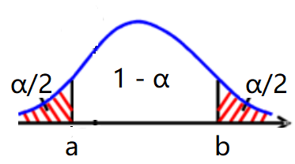

- 置信区间（interval）
	- 定义
	  collapsed:: true
		- 利用（一个或两个）统计量来描述参数的取值范围，
		- 双侧区间估计：一般为[L(X), U(X)]，
		- 单侧区间估计：一般为[L(X), +∞] / [-∞, U(X)]，但实际计算时应考虑参数的可能取值范围，
	- 置信系数
	  collapsed:: true
		- 称随机区间[L(X), U(X)]覆盖*真实参数*\theta的概率为区间估计的置信水平，记为$P_{\theta} (\theta \in [L(X), U(X)])$，
			- 由于认为参数为常数，也有课本定义为——多次抽样得到的*多个*置信区间内，包含真实值的*区间*占95%，
		- 称覆盖概率的*下确界*为区间估计的置信系数；常用1 - α描述，其中α为0.05，
		  collapsed:: true
			- 即应有$P_{\theta} (\theta \in [L(X), U(X)]) \geq 1 -  \alpha$，
		- 注释
			- 一般认为参数为常数，所以所求的概率应该是$P_\theta (X \in [U^{-1}(\theta), L^{-1}(\theta)])$，
			- 应使最终算出的$P_{\theta}$为θ的常函数，即不同的θ值不改变区间的可信程度，
			- 若L(X)为参数θ的水平为1 - α_{1}的单侧置信下限，U(X)为参数θ的水平为1 - α_{2}的单侧置信上限；则[L(X), U(X)]为参数θ的水平为1 - (α_{1} + α_{2})的置信区间（Bonferroni不等式），
	- 精度
	  collapsed:: true
		- 一般称随机区间的平均长度为区间估计的精度，
- 区间估计的形式（统计量）
	- （直观置信区间）
		- 枢轴变量法是应用较广泛的区间估计方法，
		- 这一方法建立在点估计的基础上，利用点估计量分析枢轴变量，再建立置信区间，
		- 对一些常见分布族，可以尝试根据数字特征与统计量的关系，寻找一些直观的枢轴量，
	- 枢轴量
		- 定义
		  collapsed:: true
			- 分布不依赖于给定参数的随机变量，
			- 表达式中一般含有参数，所以不是统计量，
			- 枢轴量的分布可能并非常见分布，
		- 求解
			- 基于mle和θ的充分统计量
			  collapsed:: true
				- 构造枢轴量时需要注意提供的样本的形式，
				- 有时统计量T与参数难以分离，可能需要建立（二次）方程求解θ，
				- 对于单侧置信区间，应注意统计量的支集的限制（尤其对于均匀分布等支集依赖于参数的分布），
			- 位置-尺度枢轴
			- 累积分布函数（概率积分变换）
				- 概率积分变换定理
				  collapsed:: true
					- 对于随机变量X和其分布函数Fx，统计量$T = T(X) = F_{X}(X) \sim U(0, 1)$；
					  collapsed:: true
						- 如对于指数分布F_{X}(x) = 1 - e^{-x}，
						- 统计量T = T(X) = 1 - e^{-X} \sim U(0, 1)，
					- 可知$P_\theta (\alpha_1 < F_{X}(X; \theta) < 1 - \alpha_2) = \int _{\alpha_1}^{1-\alpha_2}f(t) dt = 1 - (\alpha_{2} + \alpha_{1})$，
					- 取$\alpha_{2} + \alpha_{1} = \alpha = 0.05$，再进行恒等变形，
					- 可得区间$P_\theta (F_{X}^{-1}(X,1-\alpha_2) <\theta <F_{X}^{-1}(X, \alpha_1)) = 1-\alpha$，
				- 计算方法
				  collapsed:: true
					- 具体计算时，一般采用参数的*充分统计量*的分布函数作为枢轴，
					- 写出枢轴量$T = T(X;\theta)= F_{X}(X;\theta)$，
					- 判断分布函数*关于参数*\theta的单调性，
					  collapsed:: true
						- 应保证区间下界统计量小于上界统计量，
						- 若F关于\theta 单调增，则区间为$P_\theta (1- \alpha_2 < F_{X}(X; \theta) < \alpha_1)$，
						- 若F关于\theta 单调减，则区间为$P_\theta (\alpha_1 < F_{X}(X; \theta) < 1 - \alpha_2)$，
					- 判断水平\alpha的取值，双侧区间一般取α1 = α2 = α/2，
					- 写出覆盖概率的表达式$P_\theta (\alpha_1 < F_{X}(X; \theta) < 1 - \alpha_2)$，
					- 恒等变形，得到区间$P_\theta (F_{X}^{-1}(X,1-\alpha_2) <\theta <F_{X}^{-1}(X, \alpha_1))$，
				- 离散分布的置信区间
					- 离散分布的*cdf一般较为复杂*，即难以将$P_\theta (\alpha_1 < F_x(X; \theta) < \alpha_2)$*直接恒等变形*为统计量置信区间的形式$P_\theta ([L(X) <\theta < U(X)])$；
					- 应分别求解上界，下界置信区间的统计量，
					- 求解
					  collapsed:: true
						- 若F关于 \theta 单调增，则区间估计为，
						- $\alpha_2 = F_t(T \le t_{0}; \theta) \rightarrow \theta =L(t_{0}, \alpha_2)$，
						  id:: 6396e016-1f71-41b8-ba32-0578c34f1c81
						- $\alpha_1 = F_t(T \ge t_{0}; \theta) \rightarrow \theta =U(t_{0}, \alpha_1)$，
						- 若F关于 \theta 单调减，则应互换L，U的位置，
						- 综合应用离散cdf的等式和特定分布（\chi^{2}，F）的分位数（即并非通过恒等变形，直接解出θ的形式），
					- 示例
						- 设总体X \sim P(\lambda)，X_{i}为样本，
						- 枢轴量
							- 充分统计量$Y \sim P(n{\lambda})$，
							- Y的分布函数为$F_{Y}(y) = P(Y \leq y) =\sum \limits _{i = 0}^{y}\dfrac{{(n\lambda)}^{i}}{i!}{e}^{-n\lambda}$，
							- 设枢轴量$T = T(Y) = F_{Y}(Y)$，即$T = \sum \limits _{i = 0}^{Y}\dfrac{{(n\lambda)}^{i}}{i!}{e}^{-n\lambda}$，
							- 由概率积分变换定理，可知$T \sim U(0, 1)$，
						- 区间
							- 设P(a < T < b) = 1 - \alpha，
							- 则根据T的分布，可取$a = \dfrac{\alpha}{2}，b = 1- \dfrac{\alpha}{2}$，
							- 即$P(\dfrac{\alpha}{2} < T < 1 - \dfrac{\alpha}{2}) = 1 - \alpha$（此处\alpha为常数），
						- 求解取值
							- 分开求解
							  collapsed:: true
								- 由$T = \sum \limits _{i = 0}^{Y}\dfrac{{(n\lambda)}^{i}}{i!}{e}^{-n\lambda}$，
								- 可得$T = \dfrac{\alpha}{2} \to \sum \limits _{i = 0}^{Y}\dfrac{{(n\lambda)}^{i}}{i!}{e}^{-n\lambda} = \dfrac{\alpha}{2}$，
								- 即$P(Y \ge y_{0}) = \dfrac{\alpha}{2}$，
							- 上下界
							  collapsed:: true
								- 此处F关于 \theta 单调减，
								- 下界：$\dfrac{\alpha}{2} = P(Y \ge y_{0}) = \sum \limits _{i = y_{0}}^{\infty}\dfrac{{(n\lambda)}^{i}}{i!}{e}^{-n\lambda}$，
								- 上界：$\dfrac{\alpha}{2} = P(Y \leq y_{0}) = \sum \limits _{i = 0}^{y_{0}}\dfrac{{(n\lambda)}^{i}}{i!}{e}^{-n\lambda}$，
							- 分布间的关系
							  collapsed:: true
								- $P(Y \ge y_{0}) =  1 - P(Y < Y_{0}) = 1 - P(Y \le Y_{0} - 1) = 1 - P(W \geq n{\lambda}) =  \frac{\alpha}{2}$，
								  collapsed:: true
									- $Y \sim P(n{\lambda})，W \sim Ga(y_{0}, 1)$，
								- $P(Y \le y_{0}) = P(W \ge n{\lambda}) = \frac{\alpha}{2}$，
								  collapsed:: true
									- $Y \sim P(n{\lambda})，W \sim Ga(y_{0} + 1, 1)$，
							- 卡方分布
							  collapsed:: true
								- $P(W \geq n{\lambda}) = P({\chi}^{2} \geq 2n{\lambda}) =  \frac{\alpha}{2}$，其中${\chi}^{2} \sim {\chi}^{2}(2y_{0} + 2)$，
								- 由卡方分布的*分位数*，可知$2n{\lambda} = {\chi}^{2}_{\frac{\alpha}{2}}(2y_{0} + 2)$，
								  collapsed:: true
									- 若$P(X > x_{\alpha}) = \alpha$，则称$x_{\alpha}$为随机变量X的上\alpha分位数，
						- 下界：$L(Y) = \frac{1}{2n}{\chi}^{2}_{1 - \frac{\alpha}{2}}(2Y)$，上界：$U(Y) = \frac{1}{2n}{\chi}^{2}_{\frac{\alpha}{2}}(2Y + 2)$，
				- 若分布函数的形式较复杂（或没有闭形式，如正态分布），则此方法较难使用，可能需要数值方法求解，
			- （pdf的形式）
			  collapsed:: true
				- 引理：若T的密度函数$f_{T}(t, \theta)$可写为$g[Q(t, \theta)]\cdot |\dfrac{\partial{Q(t, \theta)}}{\partial{t}}|$，且Q为\theta的单调函数，则Q(t, \theta)为一个枢轴量，
			- 同一分布（族）可能具有多个枢轴量；一般先选择含参数较多，统计量较少的枢轴量，
		- 参数的函数
		  collapsed:: true
			- 若θ有置信区间$P_\theta ([L(X) <\theta < U(X)]) = 1 - \alpha$ ，
			- 则对于参数的函数g(θ)，可直接考虑置信区间$P_\theta [(g[L(X)]< g(\theta) <g[U(X)])]$，
	- 联合置信区间
	  collapsed:: true
		- 对于多个参数，可以使用Bonferroni不等式得到一个近似区间，
		- 两个参数的联合置信区间
		  collapsed:: true
			- 设$A_1 :[L_1(X) <\theta_1 < U_1(X)]) , A_2 :[L_2(X) <\theta_2 < U_2(X)])$ ，
			- 若取$P(A_1) = P(A_2) = 1 - \frac{\alpha}{2}$，
			- 则由Bonferroni不等式$P(A_1∩A_2) \ge P(A_1) + P(A_2) -1$，可知$P(A_1∩A_2) \ge 1 -\alpha$，
			- 因此，将单个参数的置信度增加到$1 - \frac{\alpha}{2}$，可以保证两个参数的联合置信区间的置信度（至少）为1 - α，
		- 多个参数的联合置信区间
		  collapsed:: true
			- 理论上，可以用推广的Bonferroni不等式$P(\mathop{\cap}\limits_{i =1}^{n}A_i ) \geq \sum\limits_{i =1}^{n} P(A_i) - (n - 1)$得到多个参数的联合置信区间，
			- 即将单个参数的置信度增加$1 - \frac{\alpha}{n}$，可以保证n个参数的联合置信区间的置信度（至少）为1 - α，
	- 反转检验统计量
	  collapsed:: true
		- 设H0为关于θ的假设，对应的拒绝域为D；可反转D得到“接受域”A，将A恒等变形后即可得到置信区间，
		- H0/H1的提法
		  collapsed:: true
			- 不同的提法会导致不同的拒绝域，从而反转检验得到的接受域也不同，
			- 一般反转单侧检验会得到单侧接受域（置信区间），反转双侧检验会得到双侧接受域（置信区间），
		- 检验的构造（反转似然比统计量）
		  collapsed:: true
			- 一般反转检验统计量的求解方式会比较繁琐，
			- 然而，对于某些不常见的分布，可能难以找到很好的枢轴量，
			- 由于似然比统计量一般可以求得，所以它给出了一个较通用的求解方法，
- 区间估计的评价（置信系数与精度）
	- 等分水平α
	  collapsed:: true
		- 易于计算，平时求解时使用较多，
		- 即对于$P(a < T(X; \theta) < b) = 1 - \alpha$，
		- 一般取$P(T(X; \theta) < a)  = F_{T}(a) = \frac{\alpha}{2}$和$P(T(X; \theta) < b) = F_{T}(b) = 1 - \frac{\alpha}{2}$，
		- 即 {:height 147, :width 250}，
	- 枢轴量
	  collapsed:: true
		- 区间的长度
		  collapsed:: true
			- 对于枢轴量，置信区间基本形式为$P(a < T(X; \theta) < b) = 1 - \alpha$，
			- 恒等变形，可得$P[g_{1}(a, X) < \theta < g_{2}(b, X)] = 1 - \alpha$，
			- 则长度$H(X) = g_{2}(a, X) - g_{1}(b, X)$，一般为随机变量，
			  id:: 62b51a09-151e-4aff-9653-fde61618b565
		- 特例
		  collapsed:: true
			- pdf为单峰函数，长度$H(a, b) = b - a$时，使f(a) = f(b)的a，b区间最短，
				- 若pdf为单峰对称函数，则此时有$f(a) = f(b) = \frac{\alpha}{2}$，
			- pdf为单调函数时，对于固定的下界a = k，使$\int _{k}^{b}f_{T}(t) dt = 1-\alpha$的b的取值使区间最短，
		- 微积分运算
		  collapsed:: true
			- 若H*可写为*参数a, b的函数H(a, b)，
			- 则求最优区间可以表述为在$\int _{a}^{b}f_{T}(t) dt = 1-\alpha$的条件下，求长度$H(a, b)$的条件极值，
			- 设$b = b(a)$，则$h(a, b) = h(a, b(a)) = h_{1}(a)$,
			- 对h_{1}(a)求导并令其为0，可得a, b, b'的关系式，
			- 对限制条件$\int _{a}^{b}f_{T}(t) dt = 1-\alpha$求导，可得$f(b)b'(a) - f(a) = 0$，
			- 将a, b, b'的关系式带入，即可得a, b的关系式，
	- 反转检验
	  collapsed:: true
		- 一致最精确置信区间（UMA）
		  collapsed:: true
			- 在所有置信水平为1 - \alpha的置信区间中，称覆盖参数\theta的假值的概率最小的区间[L'(X), U'(X)]为UMA置信区间，
			- 即对于\theta' \ne \theta，总有$P_{\theta} (\theta' \in [L'(X), U'(X)]) \le P_{\theta} (\theta' \in [L(X), U(X)])$，
			- 定理：反转UMP检验得到的置信区间为UMA区间，即其假值覆盖概率最小（但并非使区间的长度最短），
		- 无偏区间
		  collapsed:: true
			- 若对于\theta' \ne \theta，总有$P_{\theta} (\theta' \in [L(X), U(X)]) \le 1 - \alpha$，则称[L(X), U(X)]为置信系数为1 - \alpha的无偏区间，
			- 反转无偏检验得到的置信区间为无偏区间，
		- Pratt定理：置信区间长度与假值覆盖概率成正比，
- 分位数置信区间
  collapsed:: true
	- 概念
	  collapsed:: true
		- 基于样本次序统计量，估计总体分位数，
		- 设连续随机变量X为总体，$Y_{1}, Y_{2},..., Y_{n}$为次序统计量，x_{p}为总体的p分位数，
	- 点估计：$\hat{x}_{p} = Y_{[(n + 1)p]}$，
	- 区间估计
		- 用两个次序统计量Y_{i}，Y_{j}估计总体分位数x_{p}，
		- 区间估计的置信系数
			- 分布的建模
			  collapsed:: true
				- 将取一个次序统计量看成独立重复实验，
				- 设随机变量$T \sim b(n, p)$，
				- 定义成功概率$p = P(X < x_{p})$，n为样本的总数，
				- 可知，$P(T = t) = {n \choose t} p^{t}(1-p)^{n-t}$代表事件{t个次序统计量小于x_{p}}，即P(Y_{t} \le x_{p})，
			- 计算置信系数
			  collapsed:: true
				- 需要求解的为次序统计量的 i 和 j 的值，
				- 给定分位数p后，可以算出$p_{T} = P(X < x_{p})$；然后结合样本总数n得到T的分布，
				- 双侧置信区间为[Y_{i} \le x_{p} \le Y_{j}]，
				- 一般取$P(Y_{i} \leq x_{p}) = P(T = i) =   1 - \frac{\alpha}{2}$和$P(Y_{j} \leq x_{p}) = P(T =j) = \frac{\alpha}{2}$，
				- 再根据二项分布的分位数，求解具体的i和j，
				- （由于二项分布为离散分布，因此一般无法准确取到任意给定的\alpha值），
- Fisher信仰推断（fiducial）
- @容忍区间（tolerance）
  collapsed:: true
	- 定义
	  collapsed:: true
		- 可以看成置信区间的推广，
		- 置信区间给出了对分布的参数的估计，而容忍区间则希望求解在给定参数后，估计随机变量X的“置信区间”，
		- 即$P_{\theta}(L(\vec{X}) < X < U(\vec{X})) \ge 1- \beta$，
		- 由于L(X)，X，U(X)均为随机变量，因此概率（事件）$P_{\theta}(L(\vec{X}) < X < U(\vec{X}))$也是随机变量，并没有一个准确的值，
		- 所以实际求解的区间为$P[P_{\theta}(L(\vec{X}) < X < U(\vec{X})) \ge 1- \beta]\ge 1- \gamma$，
	- 求解
	  collapsed:: true
		- 一种求解思路为将容忍区间转化为置信区间，
		- 设$\xi_{\beta}$为X的分布的分位数，则$\xi_{\beta}$为参数\theta的函数，
		- 且$P(\xi_{\beta} < X) = 1- \beta$，
		- 因此可以求解$\xi_{\beta}$的置信区间，再将其转化为容忍区间，
- [[数理统计]]