- [[微积分]]
- [[映射与函数]]
- 函数极限
  collapsed:: true
	- 函数极限定义
	  collapsed:: true
		- （单侧）无穷极限（类比数列）
		  collapsed:: true
			- 设f(x)在[a, + \infty]有定义，l为常数，
			- 若\forall \epsilon > 0, \exist X > 0; \forall x > X，有|f(x) - l| < \epsilon，
			  collapsed:: true
				- （此处的目的为说明\epsilon“任意小”，但“任意小”并非数学语言，所以取的是\forall \epsilon > 0），
			- 则称常数l为函数f(x)的*极限*，记为$\lim\limits_{x \to + \infty} f(x) = l$，
			- 若不存在常数l，则称函数在正无穷处发散，
			- 同理，可定义负无穷处的极限，
		- 无穷极限
		  collapsed:: true
			- 由于函数的定义域可以取正数或负数，因此上述定义实际上为单侧极限的定义，
			- 定理：$\lim\limits_{x \to + \infty} f(x) = \lim\limits_{x \to - \infty} f(x) = l \leftrightarrow \lim\limits_{x \to \infty} f(x) = l$，
		- 邻域/去心邻域
		  collapsed:: true
			- 定义：设常数\delta，x_{0} \in R，\delta > 0；
			- 称(x_{0} - \delta, x_{0} + \delta)开区间为x_{0}的一个（开）邻域,
			- 邻域一般也可用绝对值写为0 < |x - x_{0}| < \delta，
			- 称两个开区间之并(x_{0} - \delta, x_{0}) \cup (x_{0}, x_{0} + \delta)为x_{0}的一个去心（开）邻域，
		- 单点极限
		  id:: 62ccd15b-43a0-45ba-be2c-20f7b4a8450a
		  collapsed:: true
			- 设f(x)在x_{0}的一个*去心*邻域有定义，l为常数，
				- f(x)在x_{0}处可以有或没有定义，
			- 若\forall \epsilon > 0, \exist \delta > 0; \forall 0 < |x - x_{0}| < \delta，有|f(x) - l| < \epsilon，
			  collapsed:: true
				- （此处的目的为说明\epsilon“任意小”，但“任意小”并非数学语言，所以取的是\forall \epsilon > 0），
			- 则称常数l为函数f(x)在点x_{0}的*极限*，记为$\lim\limits_{x \to x_{0}} f(x) = l$，
		- （单侧）单点极限
		  collapsed:: true
			- 可以通过拆开绝对值符号0 < |x - x_{0}| < \delta，定义单侧的单点极限，
			- 单侧极限一般记为$\lim\limits_{x \to x_{0}^{+}} f(x), \lim\limits_{x \to x_{0}^{-}} f(x)$，
			- 一般也记为$\lim\limits_{x \to x_{0}^{+}} f(x) = f(x_{0} + 0), \lim\limits_{x \to x_{0}^{-}} f(x)= f(x_{0} - 0)$，
	- 函数的左极限和右极限
	  collapsed:: true
		- 极限存在与左右极限的关系：f在x_{0}处有极限 \Leftrightarrow f在x_{0}的左极限和右极限都存在*且相等*，
		- 具体情况
		  collapsed:: true
			- 分段函数，$e ^ {\pm \infty}，\arctan {\pm \infty}，|x| (\sqrt {x^2})$,
			- 一般认为x→∞时，需要分别考虑±∞，
			- 但对于$e ^ {nx} (n \to \infty)$，一般只考虑+∞（n一般表示正整数），
		- 进行极限运算$\lim\limits_{x \to x_0} f(x)$时，应分清常量与变量，
		  collapsed:: true
			- f(x0)为常数，即没有“左右”函数值，
			- f(x)和x为变量，存在左右极限，
	- 函数极限的性质（常数极限）
	  collapsed:: true
		- 唯一性
		- （局部）有界性
		  collapsed:: true
			- 若$\lim\limits_{x \to x_{0}} f(x) = l$，则f(x)在x_{0}的去心邻域有界，
			- 即a < l < b时，*存在*x_{0}的某个去心邻域，使得a < f(x) < b，
		- （局部）保号性
		  collapsed:: true
			- 若$\lim\limits_{x \to x_{0}} f(x) = l$，且l > 0(l < 0)，则一定*存在*x_{0}的某个去心邻域，使得f(x) > 0(f(x) < 0)，
			- 推论：若$\lim\limits_{x \to x_{0}} f(x) = l$，则一定*存在*x_{0}的某个去心邻域，使得$|f(x)| > \frac{|l|}{2}$，
			- 推论：若$\lim\limits_{x \to x_{0}} f(x) = l$，则$\lim\limits_{x \to x_{0}} |f(x)| = |l|$，
		- （局部）保序性
		  collapsed:: true
			- 若x_{0}的某个去心邻域内总有$f(x) \geq g(x)$；则$\lim\limits_{x \to x_{0}} f(x)  \geq \lim\limits_{x \to x_{0}} g(x)$，
			  collapsed:: true
				- 注意此处为*f(x) ≥ g(x)*，不能推广至*f(x) > g(x)*；
				- 可设f(x) = x^{2}，g(x) \equiv 0；则在x_{0} = 0的去心邻域内，总有f(x) > g(x)；但$\lim\limits_{x \to 0} f(x) = \lim\limits_{x \to 0} g(x) = 0$，
			- 若$\lim\limits_{x \to x_{0}} f(x)  > \lim\limits_{x \to x_{0}} g(x)$，则*存在*x_{0}的某个去心邻域使得$f(x) > g(x)$，
		- 极限与函数值
		  collapsed:: true
			- 一般情况下，极限式只能说明极限值，不能说明函数值，
			  collapsed:: true
				- 如$\lim\limits_{x \to 0} \dfrac{f(x)}{x}$存在，只能说明$\lim\limits_{x \to 0}{f(x)} = 0$，不能说明f(0) = 0，
			- 邻域内的*有限*个函数值不能说明极限值，
			- 极限值只能说明*去心邻域*内的函数值，
	- 函数极限的求解
	  collapsed:: true
		- 与数列极限的关系（Heine）
		  collapsed:: true
			- 设x_{0} \in R，f(x)在x_{0}的去心邻域内有定义，
			- 则$\lim\limits_{n \to \infty} a_n = x_{0}(a_n \not \equiv x_{0})， \lim\limits_{n \to \infty}f(a_n) = A \leftrightarrow \lim\limits_{x \to x_{0}} f(x) = A$，
			- 应用
				- 定理为充分必要条件，因此可以用于将函数极限转化为收敛数列的极限，
				- 主要用于三角函数等周期函数，
				- 如$\sin \dfrac{1}{x}$，可取收敛数列$x_{n} = \frac{1}{n\pi}$和$y_{n} = \frac{1}{2n\pi + \frac{\pi}{2}}$；可知$\lim\limits_{n \to \infty} f(x_{n}) = 0，\lim\limits_{n \to \infty} f(y_{n}) = 1$，因此原函数不收敛（即极限不存在），
				- 也可以用于将数列极限转化为函数极限，
		- 夹逼定理的函数形式
		  collapsed:: true
			- 设x_{0} \in R，f(x), h(x), g(x)在x_{0}的去心邻域内有定义，
			- 若x_{0}的去心邻域内有$h(x) \leq f(x) \leq g(x)$，且$\lim\limits_{x \to x_{0}} h(x) = \lim\limits_{x \to x_{0}} g(x) = l$,
			- 则有$\lim\limits_{x \to x_{0}} f(x) = l$，
		- 单调有界定理的函数形式
		  collapsed:: true
			- 如果f(x)在x_{0}的去心左（右）邻域内单调递增且有上界，或单调递减且有下界，
			- 则f(x)在x_{0}的左（右）极限存在，
			- 同数列极限，单调有界准则为*充分条件*，即不单调的函数也可能收敛，
		- （Cauchy收敛定理的函数形式）
		  collapsed:: true
			- 设x_{1}, x_{2} \in R，f(x)在x_{1}, x_{2}的去心邻域内有定义，
			- f(x)在x_{0}的去心邻域内收敛 \Leftrightarrow \forall \epsilon > 0, \exist \delta > 0；使得在x_{1}, x_{2}的\delta去心邻域内，总有|f(x_{1}) - f(x_{2})| < \epsilon，
			- 同数列极限，Cauchy收敛定理不需要具体的极限值就可以判断收敛，
	- 极限的运算
	  collapsed:: true
		- 四则运算
			- 若$\lim\limits_{x \to x_{0}} f(x) = a，\lim\limits_{x \to x_{0}} g(x) = b$，
			- 则$\lim\limits_{x \to x_{0}} f(x) \pm g(x) = a \pm b$，
			- $\lim\limits_{x \to x_{0}} f(x) \cdot g(x) = a \cdot b$，
			- $\lim\limits_{x \to x_{0}} \dfrac{f(x)}{g(x)} = \dfrac{a}{b}, b \neq 0$，
		- 复合函数
			- 设x_{0}，t_{0} \in R，f(x)在x_{0}的去心邻域内有定义，g(t)在t_{0}的去心邻域内有定义；且存在t_{0}的去心邻域使*g(t) ≠ x_{0}*，
			  collapsed:: true
				- 问题在于$\lim\limits_{x \to x_{0}} f(x) = a$，而并非f(x_{0}) = a——若f(x_{0}) ≠ a，则显然g(t) = x_{0}时下式不能成立，
			- 则$\lim\limits_{x \to x_{0}} f(x) = a，\lim\limits_{t \to t_{0}} g(t) = x_{0}$时，有$\lim\limits_{t \to t_{0}} f[g(t)] = a$，
	- 无穷小量和无穷大量（非常数极限）
	  collapsed:: true
		- 定义（极限定义）
		  collapsed:: true
			- 若$\lim\limits_{x \to x_0} f(x) = 0$，则称f(x_{0})为无穷小量，
			  collapsed:: true
				- 无穷小为*极限*而不是常数，所以理论上不能用任意小的数字说明，
				- 但应用时一般可以用0表述，
			- 同理，若$\lim\limits_{x \to x_0} f(x) = \infty$，则称f(x_{0})为无穷大量，
			- 注意事项
			  collapsed:: true
				- 应注意自变量的变化范围，无穷小、无穷大为局部特性，即x→x0时的无穷小，
				- 也应注意特定的具体函数，
		- 无穷小量的比较（极限的求解）
		  collapsed:: true
			- 高（低）阶无穷小：$\lim\limits_{x \to x_0} \dfrac{f(x)}{g(x)} = 0 (\infty)$，称f在x \to x_{0}时为g的高（低）阶无穷小，记为$f(x) = o(g(x))$，
			- 同阶无穷小：$\lim\limits_{x \to x_0} \dfrac{f(x)}{g(x)} = k,  k \in R$，
			- 等价无穷小：$\lim\limits_{x \to x_0} \dfrac{f(x)}{g(x)} = 1$，记为$f(x) \sim g(x)$，
		- 与有界性的关系
		  collapsed:: true
			- 无界由存在性定义，而无穷大由总是存在定义，因此两者不相同，
			- 有界和无穷小都由总是存在定义，但有界可以为任意常数，而无穷小必须为0，
			- 因此，求解极限的过程中有时可以忽略有界量，但无穷小量一般不能忽略，
		- 运算
		  collapsed:: true
			- 定理：x \to x_{0}时，$\lim\limits_{x \to x_{0}} f(x) = A \leftrightarrow f(x) = A + α$，其中α为x \to x_{0}时的无穷小 o(f(x))，
			- 定理：在自变量的同一变化过程中，若f(x)为无穷大，则1/f(x)为无穷小；
			- 反之，若f(x)为无穷小且f(x)≠0（不恒为0），则1/f(x)为无穷大，
	- *两个重要极限*
	  collapsed:: true
		- $\lim\limits_{x \to 0} \dfrac {\sin x}{x} = 1$
		  collapsed:: true
			- 夹逼定理，
			- $\sin x < x < \tan x$，
			- $\to \dfrac{\sin x}{x} < 1，\cos x < \dfrac{\sin x}{x}，x \in (0, \frac{\pi}{2})$，
			- 由sin x的奇偶性，可得$\lim\limits_{x \to 0^{+}} \dfrac {\sin x}{x} = \lim\limits_{x \to 0^{-}} \dfrac {\sin x}{x} = 1$，
		- $\lim\limits_{x \to \infty} {(1 + \dfrac {1} {x})}^x = e$
			- 单调有界定理，
			- 对于+ \infty，可以利用取整函数[x]，将函数极限转化为数列极限，
			- 对于- \infty，可以换元y = - x后通分，转化为+ \infty的极限，
	- 其它常用极限取值
	  collapsed:: true
		- 幂指函数
		  collapsed:: true
			- $\lim\limits_{x \to 0^{+}} \dfrac {\ln x}{x} = - \infty$
			- $\lim\limits_{x \to {+\infty}} \dfrac {\ln x}{x} = 0$
			- $\lim\limits_{x \to 0^{+}} x^x = \lim\limits_{x \to 0^{+}} e^{x \ln x} = 1$
			- $\lim\limits_{x \to 0^{+}} x ^ {\frac {1}{x}} = \lim\limits_{x \to 0^{+}} e^{\frac {\ln x}{x}} = 0$
			- $\lim\limits_{x \to {+ \infty}} x ^ {\frac {1}{x}} = \lim\limits_{x \to {+ \infty}} e^{\frac {\ln x}{x}} = e^0 = 1$，
			- $\lim\limits_{n \to \infty} \sqrt[n] {(x_1 + x_2 + ... + x_n)} = \max (\sqrt[n] {x_1}, \sqrt[n] {x_2}, ..., \sqrt[n] {x_n})$，
			- $\lim\limits_{p \to +\infty} {(\sum\limits_{i=1}^n {|x_i|}^p)}^{1/p} = \max |x_i|$，
		- 三角函数
		  collapsed:: true
			- $\lim\limits_{x \to 0} \sin\dfrac{1}{x}$不存在，
			- $\lim\limits_{x \to 0} x\sin\dfrac{1}{x} = 0$，
		- 极限推论
		  collapsed:: true
			- 若limA →0，且limAB → 0，则lim(1 + A)^{B} - 1 →AB，
			- 若limAB = k，且limB = \infty，则应有lim A = 0，
		- 含参数的函数的极限
		  collapsed:: true
			- $\lim\limits_{n \to \infty} e^{nx} = \begin{cases}  0 & x < 0 \\ 1 & x = 0  \\ \infty & x > 0 \end{cases}$,
			- $\lim\limits_{n \to \infty} x^{n} = \begin{cases}  0 & |x| < 1 \\ \infty & |x| > 1  \\ 1 & x = 1 \\ 不存在 & x = -1 \end{cases}$,
	- 极限求解综合
	  collapsed:: true
		- 极限的判断
		  collapsed:: true
			- 定理：初等函数在其定义域内连续
			  collapsed:: true
				- 应首先判断是否需要求极限，再分析极限的类型，然后再进行求解，
			- 不定式的分析
			  collapsed:: true
				- 无穷大极限
				  collapsed:: true
					- 一般考虑将其转换为无穷小，如倒代换，恒等变形等，
					- 定理：在自变量的同一变化过程中，若f(x)为无穷大，则1/f(x)为无穷小，
			- 非零点极限
			  collapsed:: true
				- 换元为零点极限
				- 利用洛必达法则，
				- 结合极限的定义、等价无穷小计算，
		- （定义求解）
		  collapsed:: true
			- 类似数列极限，因为定义为对*任意*\epsilon > 0, *存在*\delta > 0，
			- 所以应先写出定义式|f(x_{0}) - l| < \epsilon，再根据\epsilon选择适当的\delta，使定义式成立，
		- 极限的四则运算
		  collapsed:: true
			- 极限的含义为“很接近”的值，而不是准确的取值；
			  collapsed:: true
				- 表现为$\lim\limits_{x \to 0}\dfrac{0}{x} = 0$——此处分子为0（常数），而分母x只是“接近”0，
				- 所以该极限不是未定式，而是取值为0，
			- 非零因子先求解
			  collapsed:: true
				- 非零常数项不影响不定式的判断，所以可以先求出，
				- 求解极限的过程中有时可以忽略*有界量*，但应注意不能忽略*无穷小量*，
			- 提取公因式
			- 极限的有界性，保序性，
		- 特殊函数
		  collapsed:: true
			- 分式
			  collapsed:: true
				- 倒带换时应注意$e^{\frac{1}{t}} = e^{{t}^{-1}} \not \equiv e^{-t} = \frac{1}{e^t}$，
				- 分式应尝试用$\dfrac{1}{1 + x} = (1 + x)^{-1} \approx 1 - x + {{x}^{2}}$替换，直接通分可能会导致丢掉高阶的项，
			- 根式
			  collapsed:: true
				- 可以尝试用${{(1+x)}^{m}} \approx  1+ mx +\frac{m(m-1)}{2!}{{x}^{2}}$替换，
			- 三角函数
			  collapsed:: true
				- 取x = kπ/(k+1)π转化三角函数极限，并结合夹逼准则求具体值，
			- 积分极限
			  collapsed:: true
				- 极限式中的积分/二重积分可以不求出原函数，而是通过洛必达法则或中值定理求解，求解时应注意积分限，
		- 等价无穷小的替换
		  collapsed:: true
			- 定理
			  collapsed:: true
				- 若$\lim\limits_{x \to x_0} \dfrac{f_{1}(x)}{g_{1}(x)} = A$，且$f_{1}(x) \sim f_{2}(x)$，$g_{1}(x) \sim g_{2}(x)$，
				- 则有$\lim\limits_{x \to x_0} \dfrac{f_{2}(x)}{g_{2}(x)} = A$，
				- 无穷区间的等价无穷小也可使用该替换，
			- 引理
			  collapsed:: true
				- 对于复合函数f_{1}[h(x)]，若h(x) \to 0且$h(x)\not \equiv 0$，则可以用等价无穷小替换为f_{2}[h(x)]，
				- 有时需要考虑左，右极限，
			- （有时可以考虑无穷小的反向替换，）
		- 泰勒公式展开
		  collapsed:: true
			- 应注意复杂函数经运算后，高阶展开项中可能产生低幂次项，
		- 夹逼定理
		  collapsed:: true
			- 函数的有界性
			  collapsed:: true
				- 对于具体函数，放缩时应注意函数的值域，
				- 主要为非零界限，无穷小也为有界，但无穷小因子有时不能忽略，
			- 函数的特殊值，单调性，
			- 基本不等式放缩
		- 洛必达法则求不定式极限
		  collapsed:: true
			- 充分条件，无法求出极限时不能说明极限不存在，
			- 应注意可导、连续的条件，
			- 求无穷小时，应注意求导后无穷小的阶数-1，
- 函数的连续性
  collapsed:: true
	- 函数连续的概念
	  collapsed:: true
		- 定义（一点连续）
		  collapsed:: true
			- 设f(x)在x_{0}的一个*邻域*有定义，
			  collapsed:: true
				- f(x)在x_{0}处也需要有定义，
			- 若$\lim\limits_{x \to x_{0}} f(x) = f(x_{0})$，则称f(x)在x_{0}处连续，
			  collapsed:: true
				- 可以用极限语言表述为\forall \epsilon > 0, \exist \delta > 0; \forall 0 < |x - x_{0}| < \delta，有|f(x) - f(x_{0})| < \epsilon，
				- 推广：可以用集合语言表述为$f[(x_{0} - \delta, x_{0} + \delta)] \subset (f(x_{0}) - \varepsilon, f(x_{0}) + \varepsilon)$，
		- 推广（区间连续）
		  collapsed:: true
			- 若f(x)在I上有定义，且\forall x_{0} \in I，f(x)都连续，则称f(x)在I上连续，
		- （性质：可由极限的局部有界性，推出连续点的局部有界性），
	- 左连续与右连续
	  collapsed:: true
		- 可类比连续的定义，定义函数的左（右）连续，
		- 定理：函数在x0连续 \Leftrightarrow 函数在x0左连续且右连续（此处左右极限一定相等），
	- 函数的间断点
	  collapsed:: true
		- 前提：f(x)在x0的去心邻域内有定义，
		- 第一类（极限存在）
			- 跳跃间断点：左右极限都存在，但两者不相等（可以等于函数值，也可以不等于），
			- 可去间断点：左右极限都存在且相等，但不等于函数值，
		- 第二类（极限不存在）
			- f(x)在x0处至少有一侧极限不存在，
	- 间断点与单调性
	  collapsed:: true
		- 单调函数在定义域内部的间断点，一定为跳跃间断点，
		- 单调函数在单调区间内的间断点至多只有可数多个，
	- 连续的运算
	  collapsed:: true
		- 若f(x)，g(x)在x_{0}处连续，
		- 则af(x)+bg(x)，f(x)g(x)在x_{0}处连续，
		- 在g(x_{0}) \neq 0时，$\dfrac{f(x)}{g(x)}$在x_{0}处连续，
		- 复合函数
		  collapsed:: true
			- 若f(x)在x_{0}处连续，g(t)在t_{0}处连续，且$\lim\limits_{t \to t_{0}} g(t) = x_{0}$，则复合函数f[g(t)]在t_{0}处连续，
			  collapsed:: true
				- 若f(x)在x_{0}处连续，$\lim\limits_{t \to t_{0}} g(t) = x_{0}$，
				- 则$\lim\limits_{t \to t_{0}} f[g(t)] = f(\lim\limits_{t \to t_{0}} g(t)) = f(x_{0})$，
		- 反函数：区间 I 上的连续函数的反函数同样为连续函数，
		- 若f为连续函数, 则 |f| 也是连续函数，
		  collapsed:: true
			- 推论：min{f, g}和max{f, g}也是连续函数，
		- 若f^{2}为连续函数, 则 |f| 也是连续函数，
	- 连续的求解
	  collapsed:: true
		- 应首先分析函数的（自然）定义域和分段函数，
		- 定理：初等函数在其*定义域*内连续，
		  collapsed:: true
			- （需要对五类初等函数分别进行证明），
		- 根据极限的运算性质，分析函数可能的间断点，
		- 判断是否需要分左、右极限，
		- 极限的求解，
	- *闭区间*上连续函数的性质
	  collapsed:: true
		- 有界性
		  collapsed:: true
			- （反证法，Bolzano定理，连续定义）
		- 最大值和最小值定理
		  collapsed:: true
			- 最大值和最小值可以相等，此时函数f恒为常数，
			- 推论：f在[a, b]上的值域为[m, M]，
		- 零点定理
		  collapsed:: true
			- 若区间端点的函数值f(a) \cdot f(b) < 0，则一定存在\xi \in (a, b)使得f(\xi) = 0，
			- （证明：闭区间套定理）
		- 介值定理
		  collapsed:: true
			- 若\mu \in (f(a), f(b))，则一定存在\xi \in (a, b)使得f(\xi) = \mu，
			- （当f(a) > f(b)时区间为 (f(b), f(a))），
			- 零点定理的推广，
		- （极限的保号性）
		  collapsed:: true
			- 若f(x)在[a, b]上连续，则一定*存在*x_{0}的某个去心邻域，使得$|f(x)| > \frac{|f(x_{0})|}{2}$，
	- （一致连续性）
	  collapsed:: true
		- 定义
		  collapsed:: true
			- 设f(x)在区间I内有定义，x_{1}, x_{2} \in I，
			- 若\forall \epsilon > 0, \exist \delta > 0; \forall |x_{1} - x_{2}| < \delta，有|f(x_{1}) - f(x_{2})| < \epsilon，则称f在I上一致连续，
			- 此处的区别为，将连续定义中的特定点x_{0}变为了任意的两点x_{1}, x_{2}，
			- 因此，“连续”是对函数在*每个点*的连续性的描述，而一致连续则加强为对函数在*区间*上的性质的描述，
		- 逆命题
		  collapsed:: true
			- 若\exist \epsilon > 0, \forall \delta > 0; \exist |x_{1} - x_{2}| < \delta，有|f(x_{1}) - f(x_{2})| ≥ \epsilon，则f在I上不一致连续，
			- 利用Heine定理，也可以表述为存在数列{a_{n}}, {b_{n}} \in I，使得a_{n} - b_{n} \to 0(n \to \infty)时，总\exist \epsilon > 0，使|f(a_{n}) - f(b_{n})| ≥ \epsilon，
			- 示例
			  collapsed:: true
				- 函数$f(x) = \frac{1}{x}$在区间(0, 1]上是连续函数（初等函数的性质），
				- 设$a_{n} = \frac{1}{n}, b_{n} = \frac{1}{n + 1}$，可知$\lim\limits_{n \to \infty}a_{n} - b_{n} = 0$，但总有$|f(a_{n}) - f(b_{n})| = |n - (n + 1)| = 1$，因此其不是一致连续，
				- 然而，函数$f(x) = \frac{1}{x}$在任意\eta > 0 的闭区间[\eta,  1]上都是一致连续函数，
				- 此时，$|f(a_{n}) - f(b_{n})| = |\frac{1}{a_{n}} - \frac{1}{b_{n}}| =  |\frac{a_{n} - b_{n}}{a_{n}b_{n}}| \leq |\frac{a_{n} - b_{n}}{\eta^{2}}|$，
				- 只要取\delta = \eta^{2}\epsilon > 0，即可说明一致连续，
		- 性质
		  collapsed:: true
			- 设f，g均为区间I上的一致连续函数，
			  collapsed:: true
				- af(x) + bg(x)也为区间I上的一致连续函数，
				- 若f，g均有界，则f(x)g(x)为区间I上的一致连续函数，
				- 若f有界，g总大于0，则f(x)/ g(x)为区间I上的一致连续函数，
			- 一致连续函数的复合函数也为一直连续函数，
			- 定理：*闭区间*上的连续函数为一致连续函数，
			- R上连续的周期函数为一致连续函数，
	- （Lipschitz连续性）
	  collapsed:: true
		- 定义
		  collapsed:: true
			- 设函数f(x)在区间I上有定义，
			- 若存在\alpha \in (0, 1], K \in R，都有$|f(a) - f(b)| \leq K|a-b|^{\alpha}$，
			- 则称函数为区间I内的Holder函数，当\alpha = 1时称为Lipschitz函数，
		- 性质
		  collapsed:: true
			- Holder函数一定为一致连续函数，
			- 其几何意义为，函数在区间D内任意两点的割线的斜率的绝对值$|\dfrac{f(x) -f(x_0)} {x-x_0}|$均不大于K，
			- 若区间I上有|f'(x)| \le M，则\forall x_{1}, x_{2} \in I, |f(x_{2}) - f(x_{1})| \le M|x_{2} - x_{1}|；反之不一定成立，
			  collapsed:: true
				- 若f'(x)在*闭区间*I上连续，则f'(x)在闭区间I上有界，即闭区间I上连续的函数一定为Lipschitz连续，
		- （示例）
		  collapsed:: true
			- Lipschitz函数在区间I内的*变化速度不超过线性*，可以用于保证算法的稳定性，
			- $\sqrt x$为李普希茨连续，而$x^2$则不是李普希茨连续，
- （Cauchy函数方程）
  collapsed:: true
	- 形如$f: \mathbb{R} \to \mathbb{R}$，且满足$f(x + y) = f(x) + f(y)；x, y \in \mathbb{R}$的方程称为（加性）Cauchy函数方程，
	- 若附加连续；单调；有界三个条件之一，则函数 f 的表达式一定为 f = kx，
	  collapsed:: true
		- 连续：可由有理数数列逼近无理数，再利用Heine定理和连续的性质求解，
	- 其他形式的Cauchy方程均可以通过初等函数代换，转化为加性Cauchy方程，
	  collapsed:: true
		- 若$f(x + y) = f(x) \cdot f(y)；x, y \in \mathbb{R}$，则函数f的表达式一定为f = a^{x}，
		- 若$f(xy) = f(x) + f(y)；x, y \in \mathbb{R}$，则函数f的表达式一定为f = log_{a}(x)，
	- Cauchy方法
	  collapsed:: true
		- 对于这类分析问题，应*逐步推广到实数*的情形，
		- 即由x，y均为正整数，推至整数，有理数；最后分析实数，
		- 而对于每种情况，应从*特殊值*（如x = 0，x = y，x = - y等）开始，推出一些条件，
		- 再逐步推广至所有值，
- 微分学
	- 导数的定义
	  collapsed:: true
		- 定义
			- 导数的定义式
			  collapsed:: true
				- 函数（因变量y）的变化量与自变量x的变化量的比值，
				- $f'(x_{0}) = \lim\limits_{x \to x_{0}} \frac{f(x) - f(x_{0})}{x - x_{0}} = \lim\limits_{\Delta x \to 0} \frac{f(x_{0} + \Delta x) - f(x_{0})}{\Delta x} = \lim\limits_{x \to 0} \frac{f(x + x_{0}) - f(x_{0})}{x}$，
				- 实质为极限的求解，应综合极限与无穷小的关系，极限的性质分析，
				- 求一点导数可以直接由导数定义求解，不需要求出导函数，
			- 可导性与连续性
			  collapsed:: true
				- 应注意定义→连续→可导的判断顺序，
				- 表现为定义式为 f(x) - f(x_{0}) ，即x_{0}处的函数值，而不是极限值，
				- 可以通过补充定义（设辅助函数），利用中值定理等方式求解，
			- 左导数与右导数
			  collapsed:: true
				- 定义
				  collapsed:: true
					- 左导数：${{{f}'}_{-}}({{x}_{0}})=\underset{\Delta x\to {{0}^{-}}}{\mathop{\lim }}\,\frac{f({{x}_{0}}+\Delta x)-f({{x}_{0}})}{\Delta x}=\underset{x\to x_{0}^{-}}{\mathop{\lim }}\,\frac{f(x)-f({{x}_{0}})}{x-{{x}_{0}}},(x={{x}_{0}}+\Delta x)$
					- 右导数：${{{f}'}_{+}}({{x}_{0}})=\underset{\Delta x\to {{0}^{+}}}{\mathop{\lim }}\,\frac{f({{x}_{0}}+\Delta x)-f({{x}_{0}})}{\Delta x}=\underset{x\to x_{0}^{+}}{\mathop{\lim }}\,\frac{f(x)-f({{x}_{0}})}{x-{{x}_{0}}}$
				- 同极限一样，f(x0)为固定数值，没有“左右”函数值，
				- x0点左右导数都存在且相等 \Leftrightarrow x0点导数存在，
				  collapsed:: true
					- 表现为定义式中Δx用φ(x)代替时，需要φ(x)$\not \equiv 0$，且φ(x)可正可负，
				- 左导数可以说明左连续，右导数可以说明右连续；左右导数都存在即可说明连续，
		- 导函数
			- 导函数的连续性
			  collapsed:: true
				- 定义
				  collapsed:: true
					- $\lim\limits_{x \to x_0} f'(x) = f'(x_0)$，
					- 右侧为由导数定义计算的x0点的导数值，
					- 左侧为可导函数 f 的导函数表达式，
						- 导函数也为函数，存在不连续和间断点；
				- 引理：设函数f(x)在x_{0}的邻域内连续，
				  collapsed:: true
					- 若其导函数f'(x) 在x_{0}点连续，则f(x)在x_{0}的导数存在，且为该点导函数的值，
					- 若其导函数f'(x) 在x_{0}点的左右极限存在，则f(x)在x_{0}的左右导数存在（但不一定相等），且为该点导函数的左右极限值，
					- （证明：Lagrange中值定理，x \to x_{0}时也有\xi \to x_{0}）
				- 引理：若函数f(x)为连续且可导的函数，则其导函数可能连续，也可能有*第二类间断点*，
				  collapsed:: true
					- 若导函数有第一类间断点，则原函数在该点不可导，与f(x)连续可导矛盾，
					- 即一点的导数存在时，导函数的极限可能不存在，如$f(x) = x^{2}\sin\dfrac{1}{x}$，
		- 差分公式
		  collapsed:: true
			- 单侧差分公式$f'(x) \approx \dfrac{f(x + \Delta x)} {\Delta x}$，\Delta x为接近于0的数，
			- 中心差分公式$f'(x) \approx \dfrac{f(x + \Delta x)-f(x - \Delta x)} {2 \Delta x}$，\Delta x为接近于0的正数，
	- 微分的定义
	  collapsed:: true
		- 定义
		  collapsed:: true
			- 设函数f(x)在x_{0}的邻域内有定义，
			- 若存在常数A，使得x \to x_{0}时，有f(x) = f(x_{0}) + A(x - x_{0}) + o(x - x_{0})，
			- 则称f(x)在x_{0}处可微，称df(x) = Ax为f(x)在x_{0}处的微分，
			- 其含义为，f(x)在x_{0}的邻域内，可以用直线Ax近似，精度（误差）为o(x - x_{0})，
		- 求解
		  collapsed:: true
			- 一阶微分的值就是导数值，即A = f'(x_{0})，
			- 所以有f(x) = f(x_{0}) + f'(x_{0})(x - x_{0}) + o(x - x_{0})，
			- 或f(x + \Delta x) = f(x) + f'(x)\Delta x + o(\Delta x)，
		- 微分的不变性
		  collapsed:: true
			- （一阶）微分形式的不变性：对于复合函数f(g(x))，若将g = g(x)看成中间变量，则有df = f'(g(x))g'(x)dx = f'(g)dg，
		- 应用
		  collapsed:: true
			- 利用直线替代曲线，
			- 单变量时导数应用更多，微分不常用，
			- 而对于多变量，全微分应用较多，
	- 导数/导函数的计算
	  collapsed:: true
		- 导数和微分的四则运算
		  collapsed:: true
			- 公式
				- $(u\pm v{)}'={u}'\pm {v}'$；$d(u\pm v)=du\pm dv$，
				- $(uv{)}'=u{v}'+v{u}'$；$d(uv)=udv+vdu$，
				- $(\frac{u}{v}{)}'=\frac{v{u}'-u{v}'}{{{v}^{2}}}(v\ne 0)$；$d(\frac{u}{v})=\frac{vdu-udv}{{{v}^{2}}}$，
			- 推导：导数的定义，极限与无穷小的运算，
		- 复合函数与反函数的求导
		  collapsed:: true
			- 复合函数
				- 充分条件：若x_{0}处f' (g_{0})、g'(x_{0})都存在，则f'(x_{0})=f'(g_{0}) \cdot g'(x_{0})，
				  collapsed:: true
					- 每个函数导数不存在，不能说明复合函数的导数不存在；
					- 反之，复合函数的导数存在，也不能说明每个函数的导数都一定存在，
					- 应根据定义式求解，对于抽象函数，也应利用定义式辅助判断，
				- 若函数处处可导，则复合函数f(g(x))的导函数为f'[g(x)] \cdot g'(x)，
				- 应注意$[f(-x)]' = -f'(-x) ≠ -f'(x)$，即负号不能忽略，应进一步寻找f(-x)与f(x)之间的关系，
			- 反函数
				- 设$y = f(x), x = f^{-1}(y) = g(y)$，
				- 自变量为x的函数
				  collapsed:: true
					- 一阶
					  collapsed:: true
						- $g'(y_0) = \dfrac{1} {f'(x_0)} \neq \dfrac{1} {f'(y_0)}，(f'(x_0) \neq 0)$，
						- 示例
						  collapsed:: true
							- 设$y = \sin x，x = \arcsin y$，
							- 则$y' = \cos x = \dfrac{1}{x'}$，
							- 因此$x' = \dfrac{1}{\cos x} = \dfrac{1}{\sqrt{1 - \sin ^{2}x}}$，
							- 由$x = \arcsin y$，可知$(\arcsin y)' =  \dfrac{1}{\sqrt{1 - {(\sin(\arcsin y))}^{2}}} = \dfrac{1}{\sqrt{1 - y^{2}}}$，
					- 二阶
					  collapsed:: true
						- $g ''(y) = (g '(y))' = (\frac{1} {f'(x)})' = - \frac {f''(x)} {{f'(x)}^{2}} \cdot x'$
						- 由于$x = g(y)$，根据复合函数求导，$x' = g'(y) = \frac{1} {f'(x)}$，
						- 原式$= - \frac {f''(x)} {{f'(x)}^{3}}，(f'(x) \neq 0)$；
				- 自变量为y的函数
				  collapsed:: true
					- 由$y = f(x), x = f^{-1}(y) = g(y)$，可知$y = f[g(y)]$，
					- 因此，由复合函数求导，可知$y' = f'[g(y)] \cdot g'(y)$，
				- 性质
				  collapsed:: true
					- 应注意x_{0}/y_{0}的对应关系，
					- f(x)在区间I上可逆且可导，其反函数在区间I上不一定处处可导；
					  collapsed:: true
						- 如f(x) = x^{3}在R上有反函数且处处可导，
						- 但其反函数f^{-1}(x) = x^{1/3}在 x = 0处不可导，
			- 求导方法
				- 幂指函数求导：一般应先写为${f(x)}^{g(x)} = e^{g(x)lnf(x)}$再求导，即e^{g(x)ln f(x)} \cdot [g(x)ln f(x)]'，
				- 倒数求导法
				- 对数求导法：一般用于多项乘积；应注意对数定义域非负，所以需要考虑求导函数的值域和定义域，
		- 分段函数的求导
		  collapsed:: true
			- 分段函数在分段点的导数，应根据导数定义分别求解左、右导数，
		- 隐函数的求导
		  collapsed:: true
			- 隐函数存在定理：设F(x, y)有连续的一阶（偏）导数；若存在区域D，使F'y ≠ 0 ，则方程F(x, y) = 0可确定一个隐函数y = y(x)，且$y'(x) = \dfrac{dy} {dx} = -\dfrac{F'_{x}} {F'_{y}}$，
			- 隐函数的导数不一定只为自变量x的函数，也可能同时含有x，y；关键在于，可以通过固定点的取值(x_{0}, y_{0})求得对应点的导数值，
		- 参数方程的求导
		  collapsed:: true
			- （向量）
			  collapsed:: true
				- 向量的参数方程定义
				  collapsed:: true
					- 定义（二维）向量r为$\vec{r}(t) = (x, y) = (\phi(t), \psi(t))$，
					- $\lim\limits_{t \to t_0}(\vec{r}(t)) = (\lim\limits_{t \to t_0}\phi(t), \lim\limits_{t \to t_0}\psi(t))$，
				- 向量的极限
				  collapsed:: true
					- 设$\vec{r}(t)$在t_{0}的一个*去心*邻域有定义，l为常数，
					- 若\forall \epsilon > 0, \exist \delta > 0; \forall 0 < |t - t_{0}| < \delta，有$|\vec{r}(t) - \vec{a}| < \varepsilon$，
					  collapsed:: true
						- （此处的目的为说明\epsilon“任意小”，但“任意小”并非数学语言，所以取的是\forall \epsilon > 0），
					- 则称向量a为向量$\vec{r}(t)$在点t_{0}的*极限*，记为$\lim\limits_{t \to t_{0}} \vec{r}(t) = \vec{a}$，
				- 向量的连续
				  collapsed:: true
					- 若$\lim\limits_{t \to t_{0}} \vec{r}(t) = \vec{a} = \vec{r}(t_{0})$，
					- 则称向量$\vec{r}(t)$在点t_{0}连续，
				- 方向导数（*参数t*的二元函数）
				  collapsed:: true
					- 定义极限$\lim\limits_{\Delta t \to 0} \dfrac{\vec{r}(t + \Delta t) - \vec{r}(t)}{\Delta t}$为向量r的方向导数，记为$\vec{r}'(t_{0})$，
					- 根据参数方程表示$\vec{r}(t) = (x, y) = (\phi(t), \psi(t))$，有$\vec{r}'(t) = (\phi'(t), \psi'(t))$，
				- 方向导数的长度（*参数t*的一元函数）
				  collapsed:: true
					- $|\vec{r}'(t)| = \sqrt{{\phi'(t)}^{2} + {\psi'(t)}^{2}}$，
			- 参数方程求导
			  collapsed:: true
				- 设$r(t) = \begin{cases}  x = g(t) \\y =  h(t) \end{cases}$，
				- 一阶导数（*参数t*的函数）
					- $\dfrac{dy}{dx} = \dfrac{dy}{dt} \cdot \dfrac{dt}{dx} = \dfrac{dy}{dt} \cdot (\dfrac{dx}{dt})^{-1}$
					- 即$\dfrac{dy}{dx} = \dfrac{h'(t)}{g'(t)}$，
				- 二阶导数（*参数t*的函数）
					- $\dfrac{d^{2}y}{d{x}^{2}} = \dfrac{d}{dx}(\dfrac{dy}{dx}) = \dfrac{d}{dx}(\dfrac{h'(t)}{g'(t)}) = \dfrac{d}{dt}(\dfrac{h'(t)}{g'(t)}) \cdot (\dfrac{dx}{dt})^{-1}$，
					- 根据商的导数公式，
					- 可得原式$=\dfrac{h''(t)g'(t) - h'(t)g''(t)}{[g'(t)]^2} \cdot {[g'(t)]}^{-1} = \dfrac{h''(t)g'(t) - h'(t)g''(t)}{[g'(t)]^{3}}$，
					- 应注意，$\dfrac{d^{2}y}{d{x}^{2}} \neq \dfrac{d^{2}y}{dt^{2}} \cdot (\dfrac{d^{2}x}{dt^{2}})^{-1} = \dfrac{h''(t)}{g''(t)}$，
		- 高阶导数
		  collapsed:: true
			- 定义
			  collapsed:: true
				- 如果区间上的可导函数f(x)的导函数f'(x) = g(x)在区间上仍然可导（即g'(x)存在），
				- 则称函数f''(x) = g'(x)为f(x)的高阶导数，
				- 如果 f 在 I 中 n 阶可导，即存在$f^{(n)}(x)$，且 n 阶*导函数连续*，则称 f 在 I 上 n 阶连续可导，记为$f \in C^{(n)}(I)$，
				- 如果 f 在 I 中存在*任意阶*导数, 则称 f 是*光滑*的，记为$f \in C^{\infty}(I)$，
				- 连续函数的导函数不一定也为连续函数，
			- （高阶导数的莱布尼兹公式）
			  collapsed:: true
				- 若$u(x)，v(x)$均$n$阶可导，则${{(uv)}^{(n)}}=\sum\limits_{i={0}}^{n}{C_{n}^{i}{{u}^{(i)}}{{v}^{(n-i)}}}$，其中${{u}^{({0})}}=u$，${{v}^{({0})}}=v$，
				- 一般用于${{u}^{(k)}}= 0$或${{v}^{(k)}}= 0$的情况，如$u(x) = x^{k}$，
			- 部分高阶导数公式
			  collapsed:: true
				- $({{a}^{x}}){{\,}^{(n)}}={{a}^{x}}{{\ln }^{n}}a，(a>{0})；({{{e}}^{x}}){{\,}^{(n)}}={e}{{\,}^{x}}$
				- $(\sin kx{)}{{\,}^{(n)}}={{k}^{n}}\sin (kx+\frac{n\pi }{{2}})$
				- $(\cos kx{)}{{\,}^{(n)}}={{k}^{n}}\cos (kx+\frac{n\pi }{{2}})$
				- $({{x}^{m}}){{\,}^{(n)}}=m(m-1)\cdots (m-n+1){{x}^{m-n}}$
				- $(\ln x){{\,}^{(n)}}={{(-{1})}^{(n-{1})}}\frac{(n-{1})!}{{{x}^{n}}}$
			- 技巧
			  collapsed:: true
				- 应注意题目中隐含的高阶可导的信息，如给出函数表达式，
				- 可以通过先求出前几阶导数寻找规律，
				- 部分有规律的高阶导数，也可尝试使用数学归纳法求高阶导数，
				- 可以尝试利用反函数求导，求复杂函数的高阶导数，
				  collapsed:: true
					- 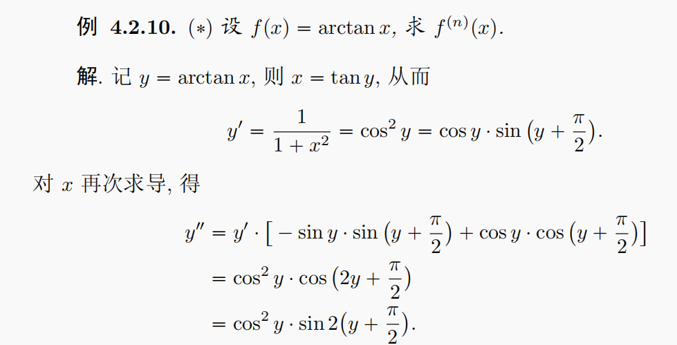{:height 190, :width 350}
				- 可以尝试转化为F(x, y) = C的形式，再利用莱布尼兹公式求解，
				  collapsed:: true
					- $f(x) = \arctan(x)，f'(x) = \frac{1}{1 + x^{2}}$，
					- 恒等变形，即$f'(x) \cdot (1 + x^{2}) = 1$，
					- 两侧求 n 阶导，
					- 左侧使用莱布尼兹公式，可得$\sum\limits_{i={0}}^{n}{C_{n}^{i}{{u}^{(i)}}{{v}^{(n-i)}}} = C_{n}^{0} \cdot f^{(n + 1)}(x) \cdot (1 + x^{2}) + C_{n}^{1} \cdot f^{(n)}(x) \cdot 2x + C_{n}^{2} \cdot f^{(n - 1)}(x) \cdot 2 + C_{n}^{3} \cdot f^{(n - 2)}(x) \cdot 0…$
					- $= C_{n}^{0} \cdot f^{(n + 1)}(x) \cdot (1 + x^{2}) + C_{n}^{1} \cdot f^{(n)}(x) \cdot 2x + C_{n}^{2} \cdot f^{(n - 1)}(x) \cdot 2$，
					- 右侧求导为0，
					- 因此，x = 0时，可得$C_{n}^{0} \cdot f^{(n + 1)}(0) + C_{n}^{2} \cdot f^{(n - 1)}(0) \cdot 2 = 0$，
					- 即关于$\arctan(x)$的n阶导数的*递推公式*，
			- 泰勒公式求高阶导数
			  collapsed:: true
				- 若函数f(x)可以展开为$\sum\limits_{i = 1}^{n}k_{n}(x - x_{0})^{n}$，
				- 则对比f(x)的Taylor展开式$\frac{{{f}^{(n)}}({{x}_{0}})}{n!}{{(x-{{x}_{0}})}^{n}}$，
				- 由Taylor展开式的唯一性，可知$k_{n} = \frac{{{f}^{(n)}}({{x}_{0}})}{n!}$，即${f}^{(n)}({x}_{0}) = k_{n} \cdot n!$，
				- 关键在于x的幂次需要对应上，
		- 绝对值
		  collapsed:: true
			- 函数带有绝对值并非可导的充分或必要条件，应根据具体函数和导数定义具体分析（计算极限），
			- 一般而言，绝对值函数不可导的原因为左右导数不相等（并非不连续），即虽然函数值相同，但函数的表达式不相同，使得导数不相同，如$\lim\limits_{x \to 0^+} |x| = x，\lim\limits_{x \to 0^-} |x| = -x$，
			- 绝对值的求导公式
			  collapsed:: true
				- $(|x|)' = sgn(x) = \begin{cases}  1 & x \geq 0 \\ -1 & x \leq 0 \end{cases}$,
				- $(sgn(x))' = 0$,
				- 也可写为分段函数$|x| = \begin{cases}  x & x \geq 0 \\ -x & x \leq 0 \end{cases}$，然后用导数定义求解（求极限），
	- 基本初等函数的导数
	  collapsed:: true
		- （推导）
		  collapsed:: true
			- 夹逼定理，单调有界定理，
			- 基本极限1：$\lim\limits_{x \to 0} \dfrac {\sin x} {x} = 1$（夹逼定理），
			  collapsed:: true
				- 三角函数：三角函数（和差化积），
			- 基本极限2：$\lim\limits_{x \to \infty} {(1 + \dfrac {1} {x})}^x = e$（单调有界定理），
			  collapsed:: true
				- 推论：$\lim\limits_{x \to 0} \dfrac {\ln (1+x)} {x} = 1$，$\lim\limits_{x \to 0} \dfrac {e^x -1} {x} = 1$，$\lim\limits_{x \to 0} \dfrac {{(1+x)} ^a -1} {x} = a$，
				- 幂函数：正整数幂（二项式展开），实数幂（推论3），
				- 对数函数：推论1，
				- 指数函数：推论2，
			- 反三角函数：反函数求导，
		- 导数公式
		  collapsed:: true
			- 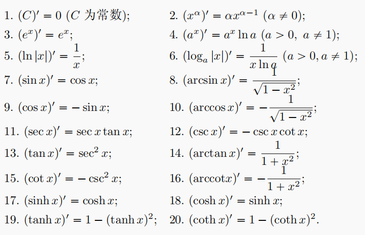{:height 280, :width 420}
		- 性质
		  collapsed:: true
			- 初等函数在定义域内可导，且导函数仍为初等函数，
			- 初等函数存在高阶导数，但不一定为任意阶可导，
	- 导数的几何意义
	  collapsed:: true
		- 平面曲线（在点(x_{0}, f(x_{0}))处）的切线和法线
		  collapsed:: true
			- 切线：$y-y_0 = f'(x_0) \cdot (x - x_0)$，
			  collapsed:: true
				- 切线的斜率$k = f'(x_0)$，
				- 切线与x轴形成的切角\alpha满足$\dfrac{y - y_{0}}{x - x_{0}}  = \tan \alpha$，
				- 切线过点(x_{0}, y_{0})，
			- 法线：$y-y_0 = -\dfrac {1} {f'(x_0)} \cdot (x - x_0)$，
			  collapsed:: true
				- 切线和法线垂直，即斜率乘积为-1，
		- 割线（经过点(a, f(a))，(b, f(b))）
		  collapsed:: true
			- 割线：$y- f(a) = \dfrac{f(b) - f(a)} {b-a} \cdot (x -a)$，或$y - f(b) = - \dfrac{f(b) - f(a)} {b-a} \cdot (b - x)$，
			- 可能与曲线相交或不相交，
			- 一般区间内函数*凹凸性*不改变时，割线与曲线不相交（恒在曲线上方或下方），
		- 函数的渐近线
		  collapsed:: true
			- 垂直渐近线（定义域）：$\lim\limits_{x \to x_0}f(x) = \infty$，可以有无数条，
			- 水平渐近线（值域）：$\lim\limits_{x \to +\infty / -\infty}f(x) = A$，最多两条，
			- 斜渐近线：$\lim\limits_{x \to +\infty / -\infty} \dfrac {f(x)} x = A$，且$\lim\limits_{x \to +\infty / -\infty}f(x) - Ax = b$，最多两条，
			  collapsed:: true
				- 理论上，也可直接求解$\lim\limits_{x \to \infty}f(x) - (Ax + b) = 0$，
				- 同一侧最多只能有一条水平渐近线或斜渐近线，
	- 《《导数的物理意义
	- （闭区间）连续函数的中值定理
	  collapsed:: true
		- 区间内的点的参数表示
		  collapsed:: true
			- 设参数0 \le \theta \le 1，
			- 则区间[x_{1}，x_{2}]内的任意一点 x ，可以写为x_{1} + \theta(x_{2} - x_{1}) = \theta x_{2} + (1 - \theta)x_{1}，
			- 即将 x 写为增量(\Delta = x_{2} - x_{1})的形式，
		- 连续函数的性质
		  collapsed:: true
			- Fermat引理
			  collapsed:: true
				- 函数f(x)在x_{0}的某*邻域*内有定义，并且在此邻域内恒有f(x) \le f(x_{0})，或f(x)\ge f(x_{0})（即x_{0}为*极值*点），
				- 若 f(x) 在x_{0}处*可导*，则必有f'(x_{0}) = 0；称点x_{0}为驻点，
			- 条件：闭区间上连续可导，
			  collapsed:: true
				- 函数f(x)在闭区间 [a, b] 上连续，在开区间 (a, b)内可导；
			- Darboux定理（导函数的介值定理）
			  collapsed:: true
				- 则\forall \mu \in (f'(a), f'(b))，则\exist \xi \in [a, b]使得 f'(\xi) = \mu，
				  collapsed:: true
					- 推论：区间可以推广到$f'_{+}(a)$和$f'_{-}(b)$之间，
				- （当f'(a) > f'(b)时区间为 (f'(b), f'(a))），
				- （证明：设辅助函数f(x) - kx，其中k \in (f'(a), f'(b))），
			- （引理：导函数的零点定理）
			  collapsed:: true
				- 若可导函数 f(x) 在区间端点的导函数值f'(a) \cdot f'(b) < 0，则一定存在\xi \in (a, b)使得f'(\xi) = 0，
				- 反之，若可导函数 f(x)在区间上的导函数值f'(x) \ne 0，则必有f'(x) > 0或f'(x) < 0，即f(x) 为单调函数，
			- Rolle定理
			  collapsed:: true
				- 若 f(a) = f(b)，则存在\xi \in (a, b)，使f'(\xi)=0，
			- Lagrange中值定理
			  collapsed:: true
				- 存在\xi \in (a, b)，使$\dfrac{f(b)-f(a)}{b-a}={f}'(\xi)$，
				- Taylor公式形式
				  collapsed:: true
					- 取x_{1} < x_{2}, 0 < \theta < 1，
					- 设\Delta x = x_{2} - x_{1}，
					- 则有f(x_{2}) = f(x_{1}) + f'(x_{1} + \theta(\Delta x))\Delta x，
					- 或f(x + \Delta x) - f(x) = f'(x + \theta(\Delta x))\Delta x，
			- （ Lagrange 插值多项式）
			- Cauchy中值定理
			  collapsed:: true
				- 存在\xi \in (a, b)，使  $\dfrac{f(b)-f(a)}{g(b)-g(a)}=\dfrac{{f}'(\xi )}{{g}'(\xi )}$，
				- （基于反函数的证明）
				  collapsed:: true
					- 由g'(x)\ne 0和导函数的零点定理，可知g(x) 为单调函数，即g = g(x) 有反函数，
					- 设x = g^{-1}(g)，则f(x) = f[g^{-1}(g)]，
					- 由复合函数的可导性，可知f[g^{-1}(g)]可导，
					- 左侧
					  collapsed:: true
						- 设g_{2} = g(b), g_{1} = g(a)，则b = g^{-1}(g_{2}), a = g^{-1}(g_{1}),
						- 由导数的定义，$\dfrac{f(b)-f(a)}{g(b)-g(a)} = \dfrac{f[g^{-1}(g_{2})] - f[g^{-1}(g_{1})]}{g_{2} - g_{1}} = (f[g^{-1}(g)])'$，
					- 右侧
					  collapsed:: true
						- 由Lagrange中值定理，
						- 存在\xi \in (g_{1}, g_{2})，使导函数的值为f'[g^{-1}(\xi)] \cdot [g^{-1}(\xi)]'，
						- 由反函数的导数的求解，存在\lambda \in (a, b)，使$\lambda = g^{-1}(\xi)， [g^{-1}(\xi)]' = \frac{1}{g'(\lambda)}$，
						- 即右侧为$\dfrac{{f}'(\lambda)}{{g}'(\lambda)}$，
			- L'Hopital法则
			  collapsed:: true
				- 若$\lim\limits_{x \to x_{0}} f(x) = \lim\limits_{x \to x_{0}} g(x) = 0$，或$\lim\limits_{x \to x_{0}} f(x) = \lim\limits_{x \to x_{0}} g(x) = \infty$，
				- 则$\lim\limits_{x \to x_{0}} \dfrac{{f}(x)}{{g}(x)} = \lim\limits_{x \to x_{0}} \dfrac{{f}'(x)}{{g}'(x)}$，
				- 无穷区间也有类似结论，即$\lim\limits_{x \to \infty} \dfrac{{f}(x)}{{g}(x)} = \lim\limits_{x \to \infty} \dfrac{{f}'(x)}{{g}'(x)}$，
			- Taylor定理
			  collapsed:: true
				- （推导）
				  collapsed:: true
					- 假设在x_{0}点的附近存在多项式，使得f(x) = a_{0} + a_{1}(x - x_{0}) + a_{2}(x - x_{0})^{2} + o{(x - x_{0})^{2}}，
					- 取x = x_{0}，可得a_{0} = x_{0}，
					- 两侧除(x- x_{0})，取极限x \to x_{0}，由导数定义，可得a_{1} = f'(x_{0})，
					- 再次两侧除(x- x_{0})，取极限x \to x_{0}，利用洛必达法则，可得a_{2} = f''(x_{0}) / 2，
					- 通过数学归纳法，可证明带 Peano 余项的Taylor定理，
				- （Taylor公式的分部积分推导）
				  collapsed:: true
					- 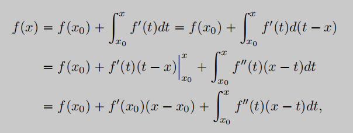{:height 135, :width 340}，
					-
				- 设函数f(x)在点x_{0}处的某邻域内的n + 1阶*导数存在*，则对该*邻域内*异于x_{0}的任意点x，\exist \xi \in [x, x_{0}]，
				- 使$f(x)=f({{x}_{0}})+{f}'({{x}_{0}})(x-{{x}_{0}})+\frac{1}{2!}{f}''({{x}_{0}}){{(x-{{x}_{0}})}^{2}}+\cdots +\frac{{{f}^{(n)}}({{x}_{0}})}{n!}{{(x-{{x}_{0}})}^{n}}+{{R}_{n}}(x)$，
				- 前n项的*导数值*为给定的函数值x_{0}，
				- 余项的*导数值*为不确定项ξ，
				- （余项的求解）
				  collapsed:: true
					- 核心为构造*辅助函数*，和*中值定理*的应用，
					- 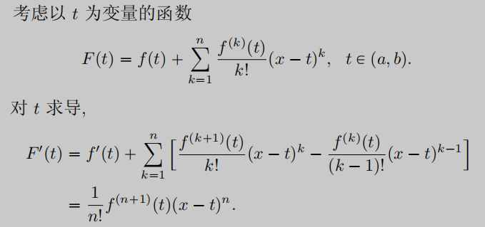{:height 170, :width 340}，
					- 由Lagrange中值定理，可得 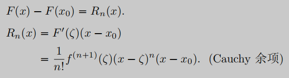{:height 90, :width 320}，
					- 由 Cauchy 微分中值定理，和辅助函数G(t) = -(x - t)^{n + 1}，可得 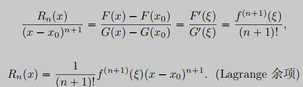{:height 110, :width 320}，
					- 将误差项*写为积分形式*，再由积分中值定理，可得 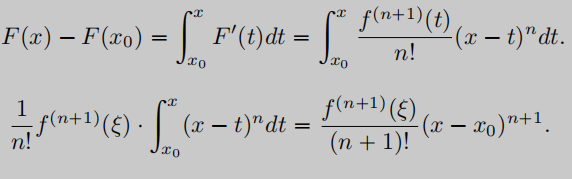{:height 110, :width 320}，
				- 称 x_{0} = 0 时的 n 阶泰勒公式为麦克劳林公式，$f(x)=f(0)+{f}'(0)x+\frac{1}{2!}{f}''(0){{x}^{2}}+\cdots +\frac{{{f}^{(n)}}(0)}{n!}{{x}^{n}}+{{R}_{n}}(x)$，
				  collapsed:: true
					- 即f(x)在 0 点附近的展开式，
				- 级数定义的函数
			- [[级数]]
	- ==解题策略==
	  collapsed:: true
		- 不应在分析上花费过多时间，
		- （图形）
		  collapsed:: true
			- 应注意对信息的准确表述，
			- 图形有时难以得到结论，不应在画图上花费过多时间，
		- 函数表达式
		  collapsed:: true
			- 分析类型：局部（一点），整体（函数），
			- 表达式变换：代数运算（合并同类项）、微积分运算、抽象函数与具体函数运算，
		- *特殊点*
		  collapsed:: true
			- 给定的特殊点
			- 极值/最值点（导数的信息）
			- 区间的中点、端点
			- （特殊值点）：自变量的特殊值（0，1等），函数的特殊值，
		- *辅助函数*
		  collapsed:: true
			- 结合题目所给函数；
			- 积分可以考虑将常量变量化，构造积分上限函数，
			- 常数不影响导数的取值，可以尝试在辅助函数中加入适当的常数以符合条件，
			- 常见函数：f(x)f'(x)，e^{x}f(x)，e^{-x}[f(x) + f'(x)]，
		- *微积分间的转换*
		  collapsed:: true
			- $xf(x) = \int_{0}^{x}f(x) 1 dt$
			- $f(x) = \begin{cases}  f'(t)(x - a) + f(a) &微分中值定理\\ \int_{a}^{x}f'(t)dt \quad+ f(a)&原函数 \\ (\int_{a}^{x}f(t)dt)' &积分上限函数 \end{cases}$
			- $\int_{a}^{b}f^{(n)}(x)dx = f^{(n-1)}(b) - f^{(n-1)}(a)$，
			- $f(x)\int_{0}^{x} f(t)dt = f(x)F(x) = \frac{1}{2} ([F(x)]^{2})'$
		- *泰勒公式展开*
		  collapsed:: true
			- 对于高阶导数问题，应尝试使用泰勒公式的展开式分析，
			- 一般只展开到两阶，即$f(x) = f(x_{0}) + f'(x_{0})(x - x_{0}) + \frac{f''(\xi)}{2}(x - x_{0})^{2}$，
			- *展开点 x_{0}* 可以为区间端点，极值点，问题求得的点等，
			- 有时需要选择对应的*x 的值* 带入展开式，并进一步化简，
			- 有时需要在多个点展开函数，并综合多个函数式算得结果，
		- （微分方程解题）
		  collapsed:: true
			- 
		- 技巧
		  collapsed:: true
			- 极限的保号性（邻域）
			  collapsed:: true
				- 对于连续函数的端点，应尝试用邻域的观点思考函数性质，
				- 若f(x_{0})为∞或为开区间，可以应用$\lim\limits_{x \to x_0^+ / x_0^-} f(x)$来替代端点，
				- 若f(x_{0}) = c，则存在x_{0}的某个（去心）邻域，使得$|f(x)| > \frac{|c|}{2}$，
				- 若f(x_{0}) = 0，则存在x_{0}的某个（去心）邻域，使得$|f(x)| < \frac{1}{2}$，
			- 绝对值的应用可以降低难度，即避免对正、负情况的分别处理，
			- 中值定理中的不定点\xi可以用极限值逼近，即x_{0} < \xi < x时，若有x \to x_{0}，则也有\xi \to x_{0}，
			- 利用特殊函数/渐近线kx + b 分段讨论，
			- 判断函数在区间上横等于常数，
			- 对于两点问题，可以结合题目信息，在辅助函数中设出其中一点；也可考虑合并同类项的方法，
			- 求得的特殊点的信息可以用于直接构造条件，也可能需要作为中介进一步推出其他条件，应开拓思路，
	- 函数的性质
	  collapsed:: true
		- 函数的单调性
			- 单调性的判断（区间）
			  collapsed:: true
				- 若可导函数 f(x)在区间上的导函数值不变号（即总有f'(x) > 0或f'(x) < 0），则f(x)为单调函数，
				- 拉格朗日中值定理，
		- 函数的凹凸性
			- （凹凸性的西方定义）
			  collapsed:: true
				- 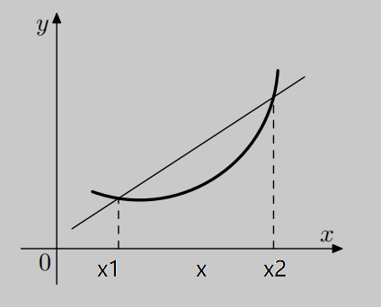{:height 210, :width 250}
				- 西方定义的凹凸性与国内教材相反，
				- 割线定义
				  collapsed:: true
					- 设x_{1}，x_{2} \in I , l 为通过两点x_{1}，x_{2}的割线，
					- 可知l的方程为$l(x) = \dfrac{f(x_{2}) - f(x_{1})} {x_{2} - x_{1}} \cdot (x - x_{1}) + f(x_{1})$，
					- 若函数值 f(x) 总小于割线值 l(x)，则称f(x)为区间I上的*凸函数*，反之则为凹函数，
					- （严格凸函数）
					  collapsed:: true
						- 有时也称严格小于时为严格凸函数，
						- 然而函数值等于割线值时，函数只可能为直线（常数或一次函数），所以可以不过多考虑，
				- 区间定义
				  collapsed:: true
					- 设x_{1}，x_{2} \in I ,
					- 设0 \le \theta \le 1，则区间[x_{1}，x_{2}]内的任意一点 x *可以写为*x_{2} - \theta(x_{2} - x_{1}) = \theta x_{1} + (1 - \theta)x_{2}，
					- 而f(x) \le l(x)可以写为
					- $f(\theta x_{1} + (1 - \theta)x_{2}) \le  \dfrac{f(x_{2}) - f(x_{1})} {x_{2} - x_{1}} \cdot (\theta x_{1} + (1 - \theta)x_{2} - x_{1}) + f(x_{1}) = \theta f(x_{1}) + (1 - \theta)f(x_{2})$，
					- 最后可得等价定义f(\theta x_{1} + (1 - \theta)x_{2}) \le \theta f(x_{1}) + (1 - \theta)f(x_{2})，
					- $\theta =  \frac{1}{2}$时，表达式变为国内教科书上的$f(\frac{x_1 + x_2}{2}) \leq \frac{f(x_1) + f(x_{2})}{2}$，
			- 凹凸性的定义
			  collapsed:: true
				- {:height 210, :width 250}
				- 大纲定义：若区间I上总有$f''(x) > 0$（没有等于号），则称f(x)在I上的图形为凹的（*凹函数*），（> 则为凸函数），
				- 端点函数值：若区间I上总有$f (\dfrac{x_1 + x_2} 2) < \dfrac{f(x_1) + f(x_2)} 2$（没有等于号），则称f(x)在I上的图形为凹的（*凹函数*），（> 则为凸函数），
			- 凹凸性的性质
			  collapsed:: true
				- 推广：Jensen不等式
				  collapsed:: true
					- 设0 \le a_{i} \le 1为常数，且$\sum \limits _{i= 1}^{m} a_{i} = 1$；
					- 对于凸函数f(x)定义域内的任意m个点x_{1}, x_{2}, ..., x_{m}，
					- 有$f(a_1 x_1 + a_2 x_2 + ...+a_m x_m) \leq a_1 f(x_1) + a_2 f(x_2) +... + a_m f(x_m)$，
					- 特例
					  collapsed:: true
						- 取凸函数e^{x}，可由Jensen不等式得到Young不等式，
						- 取凸函数- ln x，可由Jensen不等式得到算术 – 几何平均值不等式，
				- Lipschitz连续性
				  collapsed:: true
					- 设f为区间I上的凸函数，则函数在区间内部一定为连续函数，
					- 且对于区间I内不含I的端点的区间[a, b]，f在[a, b]上为Lipschitz函数，
				- 函数等于常数
				  collapsed:: true
					- 设 f 为区间 I 中的凸函数, 如果 f 在 I 的内部达到最大值, 则 f 是常值函数，
					- （证明）
					  collapsed:: true
						- 设区间[a, b] \subset I, x_{0} \in [a, b]为极值点，即f(x_{0}) = max f，
						- 设0 \le \theta \le 1，则区间[a, b]内的任意一点 x 可以写为\theta a + (1 - \theta)b，
						- 由于x_{0} \in [a, b]，则由凸函数的定义，应有max f = f(x_{0}) \le \theta f(a) + (1 - \theta)f(b)，
						- 由最大值的定义，应有 f(a) \le max f，f(b) \le max f，
						- 即\theta f(a) + (1 - \theta)f(b) \le max f，
						- 由夹逼定理，可得必有\theta f(a) + (1 - \theta)f(b) = max f，
						- 由于\theta f(a) + (1 - \theta)f(b) = f(b)  - \theta(f(b) - f(a))，因此可知区间内任意一点的函数值都为max f，
				- 一阶导数性质
				  collapsed:: true
					- 设 f 为区间 I 中的凸函数，
					- 若x_{0}为 I 的内点，则 f 在 x 处的左导数和右导数均存在，且f'-(x) \le f'+(x)，
					- 由不等号可知，f 不一定处处可导（如|x|），但其不可导点只有至多可数个，
			- 凹凸性的判断
			  collapsed:: true
				- （定义）
				- （切线斜率）
				  collapsed:: true
					- f 为区间 I 上的凹函数 \Leftrightarrow \forall x，x_{1}，x_{2} \in I , x \in [x_{1}，x_{2}]，$\frac{f(x_{1}) - f(x)} {x_{1} - x} \le \frac{f(x_{2}) - f(x_{1})} {x_{2} - x_{1}} \le \frac{f(x_{2}) - f(x)} {x_{2} - x}$，
					- 可由割线的两种不同表示方式，和凸函数的定义得到，
				- 一阶导数：若 f 的一阶导函数存在，则区间上f'(x)严格单调增时 f 为凹函数（充要条件），
				  collapsed:: true
					- 割线形式：若\forall x, x_{0} \in L；f(x) - f(x_{0}) \ge f'(x_{0})(x  - x_{0})，则f(x)为凹函数，
					  collapsed:: true
						- 写为切线斜率形式$\dfrac{f(x) - f(x_{0})} {x - x_{0}}$，
						- 任取x_{1} < x，x_{2} > x，则可得$\frac{f(x_{1}) - f(x)} {x_{1} - x} \le \frac{f(x_{2}) - f(x_{1})} {x_{2} - x_{1}} \le \frac{f(x_{2}) - f(x)} {x_{2} - x}$，
					- 此处也可省略“严格”，因为不单调增的点处函数一定为直线，
				- 二阶导数：若 f 的二阶导函数存在，则区间上f'' (x) < 0 时为凸函数，f'' (x) > 0 时为凹函数（充要条件），
					- 若f'' (x) \equiv 0，则函数一定为直线，
			- 函数的拐点
			  collapsed:: true
				- 定义：称两侧函数的凹凸性相反的点x_{0}为函数的拐点，
				- 判断
					- 二阶导函数存在
					  collapsed:: true
						- f'' (x) 变号为拐点，不变号则不是，
					- （x_{0}点）二阶和以上导数存在
					  collapsed:: true
						- 必要条件：拐点有$f'' (x_0) = 0$，
						- 充分条件
							- $f''' (x_{0}) ≠0$， 结合导数定义，
							- $f^{(n)} (x_{0}) ≠0 (n=2k+1)$，
		- 函数的（平均）曲率
		  collapsed:: true
			- 引入
			  collapsed:: true
				- 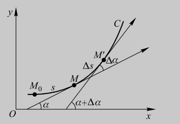{:height 200, :width 280}
			- 弧长的微分
			  collapsed:: true
				- $\Delta s \approx \sqrt{{\Delta x}^{2} + (f(x + \Delta x) - f(x))^{2}} = {\Delta x}\sqrt{1 + \dfrac{f(x + \Delta x) - f(x))^{2}}{{\Delta x}^{2}}}$，
				- 取极限，可得$\lim\limits_{\Delta x \to 0} \dfrac{\Delta s}{\Delta x} = \sqrt{1 + {f'(x)}^{2}}$，
				- 即$ds = \sqrt{1 + {f'(x)}^{2}}dx$，
			- 角度的微分
			  collapsed:: true
				- $\tan \alpha = f'(x)$，$\alpha = \arctan f'(x)$，
				- $\tan \beta = \tan (\alpha + \Delta \alpha) = f'(x + \Delta x)$，$\alpha + \Delta \alpha = \arctan f'(x + \Delta x)$
				- 即$\Delta \alpha = \arctan f'(x + \Delta x) - \arctan f'(x)$，
				- 两侧同时除以$\Delta x$，并取极限，可得$\lim\limits_{\Delta x \to 0} \dfrac{\arctan f'(x + \Delta x) - \arctan f'(x)}{\Delta x} = \dfrac{1}{1 + f'(x)^{2}} \cdot f''(x)$，
			- 曲率
			  collapsed:: true
				- 定义（光滑）曲线上的*一点*x_{0}的曲率$\kappa(A) = \lim\limits_{\Delta s \to 0} \dfrac{\Delta \alpha}{\Delta s} = \dfrac{|f''(x)|}{{(1 + {[f'(x)]^{2}})^{\frac{3}{2}}}}$，
				- 曲率由一阶导数的*平方*和二阶导数的*绝对值*计算得到，因此曲率相同不能说明这两阶导数一定相同，
				- 计算
				  collapsed:: true
					- $\kappa(A) = \lim\limits_{\Delta s \to 0} \dfrac{\Delta \alpha}{\Delta s} = \lim\limits_{\Delta x \to 0} \dfrac{\dfrac{\Delta \alpha}{\Delta x}}{\dfrac{\Delta s}{\Delta x}}$，
					- $= \dfrac{\dfrac{1}{1 + f'(x)^{2}} \cdot f''(x)}{\sqrt{1 + {f'(x)}^{2}}} = \dfrac{f''(x)}{{(1 + {[f'(x)]^{2}})^{\frac{3}{2}}}}$，
				- 参数方程求解
				  collapsed:: true
					- 可以将参数方程的求导方式带入曲率公式求得，
					- $\kappa(A) = \dfrac{h''(t)g'(t) - h'(t)g''(t)}{{([g'(t)]^{2} + [h'(t)]^{2})^{\frac{3}{2}}}}$
			- 《曲率圆
			  collapsed:: true
				- 曲率半径
		- 单调性、凹凸性和正负值之间没有必然联系，分析函数时应注意区分，
	- 函数的极值
	  collapsed:: true
		- 函数的（局部）极值
		  collapsed:: true
			- 定义：设函数f(x)在${{x}_{0}}$的某*邻域*内有定义，且在此邻域内恒有$f(x)\le f({{x}_{0}})$或$f(x)\ge f({{x}_{0}})$，
			- 判断
				- 导函数存在
					- f'(x)变号有极值，不变号则没有极值，
				- (x_{0}点)导数*存在*时
					- 必要条件（费马引理）：极值点必有f'(x0) = 0（驻点），
						- 若二阶导为0且三阶导大于0，则不是极值点（称为鞍点），
					- 充分条件
						- $f'' (x_0) ≠0$，结合泰勒公式，极限（导数定义/极值定义/极限的保号性），
						- $f^{(n)} (x_0) ≠0，(n = 2k)$，结合泰勒公式，
			- 求解技巧
				- 对数求导：由于lnX为单调函数，所以f(x)与ln[f(x)]在相同点取得极值，因此对于复杂（幂指）函数，可以考虑转化为求ln[f(x)]的极值点；但应注意lnX定义域非负，
				- 分式求解时，可以直接求导并使分子为0；也可以先化简分式再进行求导，应根据分式的复杂程度具体分析，
		- 函数的最大值与最小值
		  collapsed:: true
			- 定义：设函数f(x)在*区间I*上有定义，在区间I上内，恒有$f(x)\le f({{x}_{0}})$或$f(x)\ge f({{x}_{0}})$，
			- 求最值时应注意分段函数的不连续点处，
			- 极值为局部特性，最值为整体特性，所以极值与最值不一定相同，如分段函数、sec(x)等，
		- 最值的判断
		  collapsed:: true
			- 定理（值域）
			  collapsed:: true
				- 若f(x)为R上的连续函数，且$\lim\limits_{x \to +\infty}f(x) = \lim\limits_{x \to -\infty}f(x) = +\infty (-\infty)$，
				- 则f(x)在R上一定有最小（大）值，
				- 命题可以推广到其它非闭区间的情形，如(a, +\infty)，
			- 定理（二阶导数）
			  collapsed:: true
				- 若函数 f 在R上连续可导，且二阶导数f"(x)恒大于（小于）0，则函数有极值点时，极值点就是唯一的最值点，
				- 严格凸函数可能没有极值点，如ln x，
				- 反证法
					- 设函数有两个极值点，由于函数连续可导，根据Fermat引理，两点必有f'(x_{1}) = f'(x_{2}) = 0，
					- 然而，由Lagrange定理，两点间必有一点 f''(\xi) = 0，与二阶导恒不为0矛盾，
				- （Taylor展开式）
					- 由函数的Taylor展开式f(x) = f(a) + f'(a)(x - a) +1/2 f''(\xi) (x - a)^{2}，
					- 设二阶导恒大于0，则第三项1/2 f''(\xi) (x - a)^{2}恒大于0，
		- 判断函数等于常数
			- 函数值
				- 最大值等于最小值，（最大值最小值定理，介值定理）
				- f(x) ≤ C且f(x) ≥ C，（夹逼准则）
				- 对所有a，b都有f(a) = f(b)，
			- 导数
				- f(b) = f(a) = C，且有f'(x)≤0 / f'(x)≥0，
				- f'(x)≡0，（定积分）
				- η(b) = η(a) = 0，且对任意η(x)都有$\int _{a}^{b} f(x)η(x) dx = 0$，
			- 可利用特殊值法等方式进一步求出C的具体值，
	- 函数图形的描绘
	  collapsed:: true
		- 函数表达式：定义域（间断点/垂直渐近线）、奇偶性/周期性，
		- 一阶导数：单调性/极值、值域（最值），
		- 二阶导数：凹凸性/拐点，
- 积分学
	- 不定积分
		- 原函数
		  collapsed:: true
			- 定义
			  collapsed:: true
				- 原函数由F'(x) ≡ f(x)定义，
				- 如果原函数存在，则原函数一定连续，可导，
			- 待定常数
			  collapsed:: true
				- 引理：若函数f(x)在区间I上可导，则I上f'(x) = 0  \Leftrightarrow f(x) = C，
				- 即带任意常数项的函数F(x) + C也为原函数；因此，若原函数存在，则一定有无限多个，
				- 对于分段函数，应注意f(x)在分段点连续时，F(x)也必定在分段点连续，应注意分段处待定常数C的取值，
			- 存在性
			  collapsed:: true
				- 定理：*连续*函数一定有原函数，且其积分上限函数$\int_{a}^{x} f(t)dt$就是函数f(x)的一个原函数，
				  collapsed:: true
					- 反之，原函数存在不能说明f(x)连续，如f(x)存在震荡间断点（sin(1/x)），
				- 初等函数在其定义域上都连续，即初等函数一定存在原函数，但其原函数不一定为初等函数（即不一定有闭形式）；如$e^{-x^2}, \dfrac{\sin x} {x}, \dfrac{1} {\ln x}$等，
		- 不定积分的定义
		  collapsed:: true
			- 称带任意常数项的原函数F(x) + C为函数 f(x) 的不定积分，记为$\int f(x) dx = F(x) + C$，
		- 不定积分的性质
		  collapsed:: true
			- 四则运算性质
			- （不定）积分与微分
			  collapsed:: true
				- $\int f(x)dx = F(x) + C$，
				- $\int f'(x) dx = \int df(x) = f(x) + C$
				- $(\int f(x)dx)' = f(x)$，
		- #《《基本初等函数的积分公式
		  collapsed:: true
			- （不定）积分运算与微分运算互为逆运算，因此可以从导数公式得到对应的积分公式，
			- 幂函数和指数函数
			  collapsed:: true
				- {:height 236, :width 320}
				- {:height 117, :width 320}
			- 三角函数
			  collapsed:: true
				- 
				- $\int \csc x dx = \ln|\tan \frac{x}{2}| +C = \ln|\csc x - \cot x| + C$，
				  collapsed:: true
					- $\int \csc x dx = \int \dfrac{1}{\sin x}dx = \int \dfrac{1}{2\sin \frac{x}{2} \cos \frac{x}{2}} dx = \int \dfrac{1}{2\frac{\sin \frac{x}{2}}{\cos \frac{x}{2}}{(\cos \frac{x}{2})}^{2}}dx = \int\dfrac{1}{2{\tan \frac{x}{2}}}\sec^{2}\frac{x}{2}dx = \int\dfrac{1}{{\tan \frac{x}{2}}}d(\tan \frac{x}{2}) = \ln|\tan \frac{x}{2}| +C$，
				- $\int \sec x dx = \ln|\tan (\frac{x}{2} + \frac{\pi}{4})| +C =\ln|\sec x +\tan x| + C$，
				- $\int \tan^{2} x dx = \tan x - x+ C$，
				- $\int \cot^{2} x dx = -\cot x - x+ C$，
				- $\int \sec x\tan x dx = \sec x+ C$，
				- $\int \csc x\cot x dx = -\csc x+ C$，
				- $\int \sec^{3} \theta d\theta = \frac{1}{2}(\tan\theta\sec\theta + \ln|\tan\theta + \sec\theta|) + C$，
					- 分部积分：$\int \sec^{3} \theta d\theta = \int \sec\theta \text{d} \tan\theta$，
					- $= \tan\theta\sec\theta + \int \tan^{2}\theta\sec\theta \text{d} \theta$，
					- 恒等式：$= \tan\theta\sec\theta + \int (\sec^{2}\theta - 1)\sec\theta \text{d} \theta$，
					- 再进行化简可得结果，
				- #三角函数
			- 根式积分
			  collapsed:: true
				- 根式整体代换
				- 三角函数代换
				- 
			- 分式积分
			  collapsed:: true
				- $\int \dfrac{1}{{x^{2} + a^{2}}}dx = \frac{1}{a}\arctan \frac{x}{a} + C$，
				- $\int \dfrac{1}{{x^{2} - a^{2}}}dx = \begin{cases}  \frac{1}{2a}\ln \frac{x - a}{x + a} + C & |x| > |a| \\ \frac{1}{2a}\ln \frac{a + x}{a - x} + C & |x| < |a| \end{cases}$，
				- $\int \dfrac{1}{\sqrt{x^{2} + a^{2}}}dx = \ln (x + \sqrt{x^{2} + a^{2}}) + C$，
				- $\int \dfrac{1}{\sqrt{x^{2} - a^{2}}}dx = \begin{cases}  \ln |x + \sqrt{x^{2} - a^{2}}| + C & |x| > |a| \\ \arcsin \frac{x}{a} + C & |x| < |a| \end{cases}$，
				  id:: 6348c7bf-7e8f-4873-848a-1ce3193b7980
				- $\int \dfrac{1}{\sqrt{(x - a)(b - x)}}dx =  2\arcsin \sqrt{\dfrac{x - a}{b - a}} + C$（配方法），
		- 不定积分的计算
		  collapsed:: true
			- 求不定积分时应注意待定常数C，
			- 换元积分法
				- 对不定积分进行换元时，应注意最后得到的原函数需要将换元函数带回，
				- 第一类：设函数g(x)，
				  collapsed:: true
					- $\int f(x) dx = \int h[g(x)] \cdot g'(x)dx$
					- $= \int h[g(x)] dg(x) = F[g(x)] + C$，
					- 示例：$\int xe^{x^{2}}dx$，可设g(x) = x^{2}，
				- 第二类：设自变量x = u(t)，
				  collapsed:: true
					- $\int f(x) dx = \int f[u(t)]du'(t)$
					- $= \int f[u(t)]u'(t)dt = F(t) + C = F[u^{-1}(x)] + C$，
					- 应注意计算dx = du'(t)，
					- 示例：$\int \sqrt{a^{2} - x^{2}}dx$，可设x = asin t，
				- （辅助三角形）
				  collapsed:: true
					- 三角函数换元后将角度t转换回x，不用于积分过程，
					- 例如，设x = asin t时，cos t ≠ cos(arcsin(t))， 应由辅助三角形算得 $\cos t = \dfrac {\sqrt{a^{2} - x^{2}}} a$,
			- 分部积分法
				- 由函数乘积求导的公式推导而来，
				- $\int u dv = uv - \int vdu$，
				- 示例：$\int \ln xdx = \ln x \cdot x - \int x d(\ln x) = x\ln x - x + C$，
			- 分式积分时，应注意$\int \frac{1}{x} dx = \ln |x| + C$，
	- 定积分
		- 定积分（Riemann积分）的定义
		  collapsed:: true
			- 引入
			  collapsed:: true
				- 以直代曲
				  collapsed:: true
					- 希望求解曲线与坐标轴围成的图形的面积，
					- 由于直线与坐标轴围成的图形的面积，可以直接由梯形公式求得，
					- 所以希望用直线逼近曲线，以使得每一个小区间都为线性函数，
					- 由线性函数推出的“面积”的基本性质也对分段线性函数成立，
				- 积分（平均值角度）
				  collapsed:: true
					- $\int _{a}^{b}f (x) dx = \lim\limits_{n \to \infty} \dfrac{1}{n}\sum\limits_{i=1}^{n}f[a + \frac{b - a}{n}(i)]\cdot (b - a)$，
					- 此处$\lim\limits_{n \to \infty} \dfrac{1}{n}\sum\limits_{i=1}^{n}f[a + \frac{b - a}{n}(i)]$为函数f(x)在区间(a, b)上的平均值，
					- 所以由平面图形的面积公式（底乘高）可得定积分的取值，
					- 示例
					  collapsed:: true
						- $\int _{0}^{1}a^{x} dx = \lim\limits_{n \to \infty} \dfrac{1}{n} \sum\limits_{i=1}^{n}a^{(0 + \frac{i}{n}(1 - 0))}(1 - 0) = \lim\limits_{n \to \infty} \dfrac{1}{n} \sum\limits_{i=1}^{n}a^{\frac{i}{n}}$，
						- 由等比数列的求和公式，可得$\lim\limits_{n \to \infty} \dfrac{1}{n} \sum\limits_{i=1}^{n}a^{\frac{i}{n}} = \lim\limits_{n \to \infty} \dfrac{1}{n} a^{\frac{1}{n}}\dfrac{a - 1}{a^{\frac{1}{n}} - 1}$
						- 换元，设t =  1/n，则$=\lim\limits_{t \to 0^{+}}(a - 1)\dfrac{ta^{t}}{a^{t} - 1} = \dfrac{a - 1}{\ln a}$，
				- 推广：区间内的任意值
				  collapsed:: true
					- $\int _{a}^{b}f(x)dx = \lim\limits_{n \to \infty}\sum\limits_{i=1}^n \dfrac{b - a}{n} \cdot f(\xi _i)，\xi_{i} \in [a + \frac{b - a}{n}(i - 1), a + \frac{b - a}{n}(i)]$，
					- 此处将区间b - a划分为 n 个等长区间，即每个小区间长度为$\frac{b - a}{n}$，
					- 但函数值f(\xi_{i})可以为每个对应小区间内的任意一点的值，而不一定为区间端点，
					- 连续函数在闭区间的一致连续性，
					- 示例
					  collapsed:: true
						- $\int _{a}^{b} \dfrac{1}{x^{2}}dx = \lim\limits_{n \to \infty}  \dfrac{b - a}{n}  \sum\limits_{i=1}^n \dfrac{1}{{\xi_{i}}^{2}}$，
						- 设$\xi_{i} = \sqrt{x_{i - 1}x_{i}}$，可由不等式得知$\xi_{i} \in [x_{i - 1}, x_{i}]$，
						- 区间$\dfrac{b - a}{n} = x_{i} - x_{i - 1}$，
						- 所以$\lim\limits_{n \to \infty}  \dfrac{b - a}{n}  \sum\limits_{i=1}^n \dfrac{1}{{\xi_{i}}^{2}} = \lim\limits_{n \to \infty}  (x_{i} - x_{i - 1}) \sum\limits_{i=1}^n \dfrac{1}{x_{i - 1}x_{i}} = \lim\limits_{n \to \infty} \sum\limits_{i=1}^n(\dfrac{1}{x_{i - 1}} - \dfrac{1}{x_{i}})$
						- $\lim\limits_{n \to \infty} \sum\limits_{i=1}^n(\dfrac{1}{x_{i - 1}} - \dfrac{1}{x_{i}}) = \lim\limits_{n \to \infty}(\dfrac{1}{x_{0}} - \dfrac{1}{x_{n}}) = \dfrac{1}{a} - \dfrac{1}{b}$，
				- 推广：任意长度区间
				  collapsed:: true
					- $\int _{a}^{b}f(x)dx = \lim\limits_{\Delta x_{i} \to 0} \sum\limits_{i = 1}^{n} f(\xi _i) \cdot (x_{i} - x_{i - 1})，\xi_{i} \in [x_{i - 1}, x_{i}]$，
					- 此处取的是区间[a, b]的任意一个分割，不再是等长区间，也可得到收敛的极限；
					- 示例：一般可根据具体函数划分区间，
					  collapsed:: true
						- 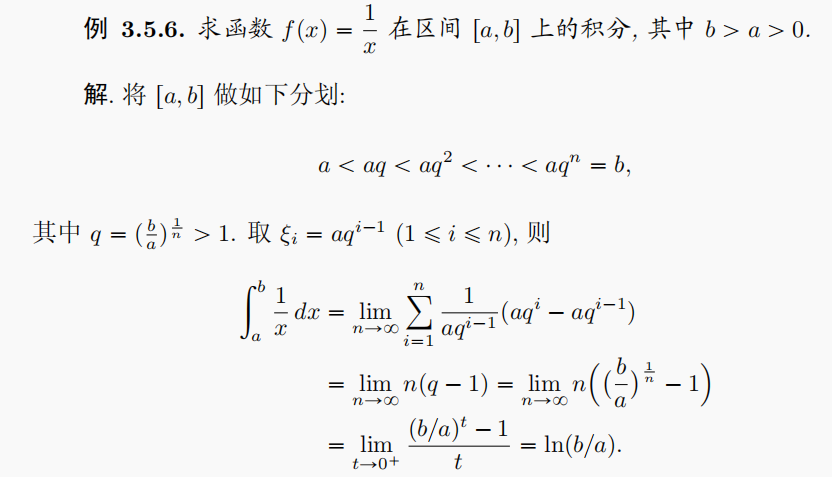{:height 190, :width 310}
						- 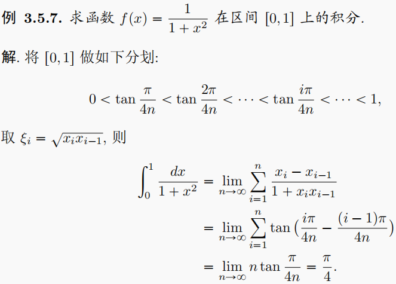{:height 230, :width 310}
					- 连续函数在闭区间的一致连续性，
				- 连续函数积分
			- 定义
			  collapsed:: true
				- 和式极限
				  collapsed:: true
					- {:height 157, :width 268}
					- $\int_{0}^{1}f(x)dx = \lim\limits_{n \to +\infty} \sum\limits_{n = 1}^{+\infty}S(n) = \lim\limits_{n \to +\infty}\sum\limits_{n = 1}^{+\infty}\dfrac{1}{n}f(\xi_{i})$，
					- 其中$\dfrac{1}{n}$为每个小区间（长方形）的底，f(\xi_{i})为每个小区间内（任意）一点的函数值，即该小区间（长方形）的高，
					- 一般划分为等长区间（便于理解），但理论上区间可以不等长，
				- 严格定义
				  collapsed:: true
					- 设函数 f(x) 在区间[a, b]上有定义（但不一定为连续函数），
					- 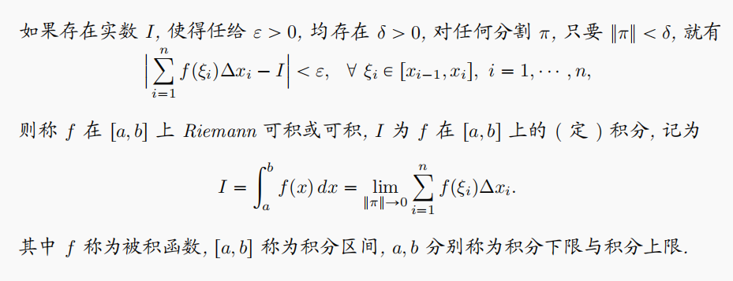{:height 150, :width 370}，
			- 应用
			  collapsed:: true
				- 将n项和写为积分
				  collapsed:: true
					- 主要有两方面，即区间和函数，
						- 表达方法可能不唯一，且最后的定积分表达式可能不同，但应该可以通过换元相互转换，
						- 应注意区间上下限，小区间长度，函数值一般是相互影响的；分析时应考虑全面，
						- 示例
							- 区间为[0, 1]，小区间长度为1 / n，$\lim\limits_{n \to +\infty}\sum\limits_{n = 1}^{+\infty}\dfrac{1}{n}\sin(\dfrac{i}{n}\pi) = \int_{0}^{1}\sin(\pi x)dx$
							- 区间为[0, \pi]，小区间长度为\pi / n，$\lim\limits_{n \to +\infty}\sum\limits_{n = 1}^{+\infty}\dfrac{1}{\pi}\cdot \dfrac{\pi}{n}\sin(\dfrac{i\pi}{n}) =\dfrac{1}{\pi} \int_{0}^{\pi}\sin xdx$，
					- 区间和分段
					  collapsed:: true
						- 一般划分为n个等长区间，则区间总长为b - a时，每个区间长度为(b - a)/n；
						- 根据具体的函数，也可考虑划分不等长的区间，便于极限的计算，
					- 函数和函数值
					  collapsed:: true
						- 将函数f(x)的表达式转换为小区间内的函数值，
					- 一般用于求n项和的极限，求极限问题也应考虑综合应用放缩，变量代换等方法，
				- 将积分拆分为n项和
				  collapsed:: true
					- 主要用于分析较复杂的积分，
					- 区间划分
					  collapsed:: true
						- 一般取n个区间a = x_{0} < x_{1} < x_{2} <… x_{n} = b，
						- 将积分$\int _{a}^{b} f(x)g(x) dx$写为$\sum\limits_{i=1}^{n}\int _{x_{i - 1}}^{x_{i}} f(x)g(x) dx$，
						- 一种拆分方式为$\sum\limits_{i=1}^{n}\int _{x_{i - 1}}^{x_{i}} f(x)g(x) dx = \sum\limits_{i=1}^{n}\int _{x_{i - 1}}^{x_{i}} [f(x) - f(x_{i - 1}) + f(x_{i - 1})]g(x) dx$，
						- $= \sum\limits_{i=1}^{n}\int _{x_{i - 1}}^{x_{i}} [f(x) - f(x_{i - 1})]g(x) dx + \sum\limits_{i=1}^{n}\int _{x_{i - 1}}^{x_{i}} f(x_{i - 1})g(x) dx$，
					- 综合其它函数性质
					  collapsed:: true
						- $\int _{x_{i - 1}}^{x_{i}} [f(x) - f(x_{i - 1})]dx = \Delta f(x) \cdot \Delta x$，即f(x)可积时有$\sum\limits_{i=1}^{n}\Delta f(x) \cdot \Delta x < \varepsilon$，\epsilon为任意大于0的常数，
						- 积分中值定理
						- 函数的有界性
						- 特殊函数（sin x等）的值域
			- （几何意义）
			  collapsed:: true
				- 定积分并非完全等同于面积，
		- Riemann可积性
		  collapsed:: true
			- 充分条件：若f(x)在闭区间[a, b]上连续，则f(x)在闭区间[a, b]上可积，
			- @推论
			  collapsed:: true
				- 若f(x)在闭区间[a, b]上只有有限个间断点（不一定单调），则f(x)在闭区间[a, b]上可积，
				- 若f(x)在闭区间[a, b]上为单调函数，则f(x)在闭区间[a, b]上可积，
				  collapsed:: true
					- 此处f(x)可能有*无限（可数）个*间断点，如Riemann函数；
					- 即按照定义，Riemann函数是可积的，且其积分为0，
				- （Lebsegue）若f(x)在闭区间[a, b]上的间断点的集合E为一个零测集，则f(x)在闭区间[a, b]上可积，
				  collapsed:: true
					- 零测集的定义
					  collapsed:: true
						- 对于直线上的集合E，若\forall \epsilon > 0, 存在可数个开区间I_{n}，使得E \subset \cup I_{n}，且\Sigma |I_{n}| < \epsilon，
						- 则称E为一个直线上的零测集（|I_{n}|可以看成区间的长度），
					- 性质
					  collapsed:: true
						- 有限集和（至多）可数集都是零测集，即整数集Z和有理数集Q都是零测集，
						  collapsed:: true
							- 因此按Lebsegue定理，Riemann函数是可积的，
						- 零测集的子集仍为零测集；
						- 可数个零测集的并集仍为零测集，
			- 必要条件：在闭区间[a, b]上可积的函数f(x)，必定在闭区间[a, b]上有界，
			  collapsed:: true
				- 即对于标准Riemann积分，无界函数是不可积的，
			- 可积性的四则运算
			  collapsed:: true
				- 如果f(x)在闭区间[a, b]上可积，且f(x)在闭区间[a, b]上恒不等于0；则1 / f(x)则在闭区间[a, b]上也可积，
				- 如果 f, g 在闭区间[a, b]上可积，
				  collapsed:: true
					- f \pm g 在闭区间[a, b]上可积，
					- f \cdot g 在闭区间[a, b]上可积，
					- 推论：max 及 min在闭区间[a, b]上也可积，
					- 然而 f，g 的复合函数*不一定*可积，
				- 若f^{2}在闭区间[a, b]上可积, 则 |f| 在闭区间[a, b]上也可积，
			- @（Darboux 上和与Darboux 下和）
			  collapsed:: true
				- 类似通过上极限和下极限判断数列的收敛性，也可将上下极限引入定积分，
				- 此处讨论的为标准Riemann积分，所以限定了被积函数f(x)为有界函数，
				- 设\pi为区间[a, b]的一个分割，||\pi||为最长的小区间的长度；小区间内的函数值为f(\xi_{i})，
				- 由于函数有界，因此有$m_{i} \le f(\xi_{i}) \le M_{i}$，
				- 称$S(\pi) = \sum\limits_{i = 1}^{n} m_{i}(x_{i} - x_{i - 1})$为Darboux 上和，$s(\pi) = \sum\limits_{i = 1}^{n} M_{i}(x_{i} - x_{i - 1})$为Darboux 下和，
				- 称 inf S(\pi)（下确界）为 f 在区间[a, b]上的上积分，sup s(\pi)（上确界）为 f 在区间[a, b]上的下积分，
				- （充要条件）f(x)为Riemann可积函数 \Leftrightarrow  f 在区间[a, b]上的上，下积分相等，
				- （充要条件）f(x)为Riemann可积函数 \Leftrightarrow $\lim\limits_{n \to \infty}\sum\limits_{i=1}^{n}\Delta f(\xi _i) \cdot \Delta x \to 0，\xi_{i} \in [x_{i - 1}, x_{i}]$，
				  collapsed:: true
					- 一般称\Delta f(\xi_{i})为“振幅”，记为\omega，
					- 可以近似理解为，当小区间划分的很小时，每个小区间内函数f(x)的取值的变化也很小，
					- 即 $\lim\limits_{n \to \infty}\sum\limits_{i=1}^{n}\Delta f(x) \cdot \Delta x \to 0$ ，从而保证了 $\lim\limits_{n \to \infty}\sum\limits_{i=1}^{n}f(x_{i}) \cdot \Delta x$ 收敛到确定的积分 $\int _{a}^{b} f(x) dx$ ，
					- 反之，对于Dirichlet函数，区间取得再小，函数值也在0，1之间来回变化，因此其不可积，
		- 定积分的性质
		  collapsed:: true
			- 定义：$\int _{a}^{b} f(x) dx = -\int _{b}^{a} f(x) dx, (a \le b)$，
			  collapsed:: true
				- 定义中的小区间长度$\Delta x = x_i - x_{i-1}$，
				- a = b时，定义$\int _{a}^{a} f(x) dx = 0$，
			- 区间的可加性
			  collapsed:: true
				- $\int _{a}^{b} f(x) dx = \int _{a}^{c} f(x) dx + \int _{c}^{b} f(x) dx，(a < c < b)$，
				- 反之，若$\int _{a}^{b} f(x) dx$存在，则对任意c < b，$\int _{a}^{c} f(x) dx$也存在，
			- 代数运算性质（数乘，加减）
			- 有限点的积分
			  collapsed:: true
				- 若f(x)在闭区间[a, b]上可积，则改变f(x)在*有限个点*的取值后得到的函数f_{1}(x)仍然可积，且其积分值不变，
			- 定积分不等式
			  collapsed:: true
				- 非负性
				  collapsed:: true
					- 若f(x)在区间[a, b]上连续，且f(x) \ge 0，则有$\int _{a}^{b} f(x) dx \geq 0$；
					- 且$\int _{a}^{b} f(x)dx = 0 \to f(x) \equiv 0$，
				- 保序性
				  collapsed:: true
					- 若f(x)，g(x)在区间[a, b]上连续，且f(x) \ge g(x)，
					- 则有$\int _{b}^{a} f(x) dx \geq \int _{b}^{a} g(x) dx$，
				- 绝对值：$|\int _{a}^{b}f(x) dx| \leq \int _{a}^{b} |f(x)| dx$，
				- 其它
				  collapsed:: true
					- ${(\int _{a}^{b} f(x)g(x)dx)}^{2} \leq \int _{a}^{b} {f(x)}^{2} dx \cdot \int _{a}^{b} {g(x)}^{2} dx$，
					  collapsed:: true
						- 证明：${(f(x) + \lambda g(x))}^{2}$的判别式，
					- $\int _{a}^{b}f(x) dx \cdot  \int _{a}^{b} \frac {dx} {f(x)} dx \geq {(b -a)^2}$
			- 介值性
			  collapsed:: true
				- 设f(x)在闭区间[a, b]上连续；m，M分别为 f(x) 在区间(a, b)上的最小值和最大值，
				- 则$m(b-a)\leq \int _{a}^{b} f(x) dx \leq M(b-a)$，
			- 定积分中值定理
			  collapsed:: true
				- 设f(x)在闭区间[a, b]上连续，
				- 中值定理：$\int _{a}^{b} f(x) dx = f(\xi) \cdot (b-a), \xi ∈ (a, b)$,
				  collapsed:: true
					- 也可由牛顿-莱布尼茨公式证明，
				- 推论
				  collapsed:: true
					- 若f'(x)在R上恒大于0，则f(x)在R上无界，
					  collapsed:: true
						- $\int_{a}^{+\infty}f'(x)dx = \lim\limits_{x \to +\infty}f(x) - f(a) = f'(\xi)(+\infty - a) \to +\infty$，
					- 若f'(x)在[a, b]上有界，则f(x)在[a, b]上有界，
					  collapsed:: true
						- $\int_{a}^{x}f'(t)dt = f(x) - f(a) \le \int_{a}^{x}Mdt$，
			- 第一中值定理
			  collapsed:: true
				- 设f(x)在闭区间[a, b]上连续，
				- 则\exist \xi \in [a, b]，使得$\int _{a}^{b} f(x)g(x) dx = f(\xi) \cdot \int _{a}^{b} g(x) dx$,
			- 第二中值定理
			  collapsed:: true
				- 设f(x)在闭区间[a, b]上连续，g(x) 为单调函数，
				- 则\exist t \in [a, b]，使得$\int _{a}^{b} f(x)g(x) dx = g(b)\int _{t}^{b} f(x) dx + g(a)\int _{a}^{t} f(x) dx$，
				  collapsed:: true
					- 证明（分部积分）
					  collapsed:: true
						- 辅助函数：$F(x) = \int_{a}^{x} f(t)dt$，
						- *分部积分*：$\int _{a}^{b} f(x)g(x) dx = \int_{a}^{b}g(x) dF(x) = F(x)g(x)|_{a}^{b} - \int_{a}^{b}F(x)dg(x)$，
						- 化简
						  collapsed:: true
							- $F(x)g(x)|_{a}^{b} = F(b)g(b) - F(a)g(a) = F(b)g(b)$，
							- $\int_{a}^{b}F(x)dg(x) = \int_{a}^{b}F(x)g'(x)dx = F(t)\int_{a}^{b}g'(x)dx = F(t)[g(b) - g(a)] = F(t)g(b) - F(t)g(a)$，
						- 所以，原式$= F(b)g(b) - F(t)g(b) + F(t)g(a) = g(b)[F(b) - F(t)] + g(a)F(t)$，
						- 由辅助函数的设置，可得$\int _{a}^{b} f(x)g(x) dx = g(b)\int _{t}^{b} f(x) dx + g(a)\int _{a}^{t} f(x) dx$，
				- （推论）
				  collapsed:: true
					- 若区间[a, b]上，g(x) 单调递减且g(x) \ge 0，
					  collapsed:: true
						- 则\exist \xi \in [a, b]，使得$\int _{a}^{b} f(x)g(x) dx = g(a)F(\xi) = g(a) \cdot \int _{a}^{\xi} f(x) dx$，
					- 若区间[a, b]上，g(x) 单调递增且g(x) \ge 0，
					  collapsed:: true
						- 则\exist \eta \in [a, b]，使得$\int _{a}^{b} f(x)g(x) dx = g(b)F(\eta) = g(b) \cdot \int _{\eta}^{b} f(x) dx$，
					- （@证明P228）
					  collapsed:: true
						- 求和的 Abel 变换
						- 介值定理
		- 定积分的计算
		  collapsed:: true
			- Newton-Leibniz公式
			  collapsed:: true
				- 在闭区间[a, b]上*连续*的函数f(x)一定有原函数，且其积分上限函数$\int_{a}^{x} f(t)dt$就是函数f(x)的一个原函数，
				  collapsed:: true
					- （证明）
					  collapsed:: true
						- 设f(x)为闭区间[a, b]上的连续函数，
						- 则由*连续函数*的*最大值最小值*定理，可得m \le f(x) \le M，
						- 不等号两侧同时取区间[a, b]上的定积分，可得$\int _{a}^{b} m dx \le \int _{a}^{b} f(x) dx \le \int _{a}^{b} M dx$，
						- 根据定积分的定义，可得定积分的*介值性*，即$m(b-a)\leq \int _{a}^{b} f(x) dx \leq M(b-a)$，
						- 两侧同时除以b - a，可得*积分中值定理*：$\int _{a}^{b} f(x) dx = f(\xi) \cdot (b-a), \xi ∈ (a, b)$,
						- 设原函数$F(x) = \int_{a}^{x} f(t)dt$，
						- 则原函数的导数$F'(x_{0}) = \lim\limits_{x \to x_{0}} \dfrac{F(x) - F(x_{0})}{x - x_{0}} = \lim\limits_{x \to x_{0}} \dfrac{\int_{a}^{x} f(t)dt - \int_{a}^{x_{0}} f(t)dt}{x - x_{0}}$，
						- 由*区间的可加性*，可得$F'(x_{0}) = \lim\limits_{x \to x_{0}} \dfrac{\int_{x_{0}}^{x} f(t)dt}{x - x_{0}}$，
						- 由积分中值定理，可得$F'(x_{0}) = \lim\limits_{x \to x_{0}} f(\xi), \xi \in (x_{0}, x)$，
						- 所以，有$F'(x_{0}) = f(x_{0})$，
					- 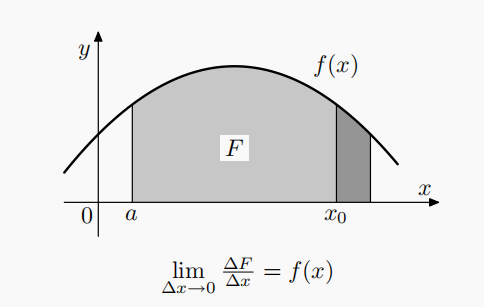{:height 153, :width 231}
				- 若将原函数记为$F(x) = \int_{a}^{x} f(t)dt + C$，则有$\int _{a}^{b} f(x) dx = F(b) - F(a)$，
				- 推广：若函数f(x)在闭区间[a, b]上可积，且函数f(x)的原函数存在，则牛顿-莱布尼茨公式仍然成立，
				  collapsed:: true
					- （证明：定积分的定义）
			- 换元积分法
			  collapsed:: true
				- 定积分换元时，积分区间、被积函数、微分变量都要变化，
					- 但定积分的目的为求解数值，因此换元后一般不将原函数带回，
				- 积分区间换元
					- 若积分区间较为复杂，可以尝试先通过换元简化积分区间，再进行积分，
					- 示例
						- {:height 96, :width 332}
				- 函数整体代换
					- 应注意常见函数的导数，或题目函数的一部分的导数/原函数，
				- 其它（倒代换，指数、对数代换）
			- 分部积分法
			  collapsed:: true
				- 定义
				  collapsed:: true
					- 分部积分时积分限不变，
				- 技巧
					- 常用函数
					  collapsed:: true
						- 对于分部积分$\int u d v$，一般 v 应选择容易积分的函数，如sin x, cos x和e^{x}，
						- 若同时有sin x和e^{x}，则两者都可以选择，
					- 反三角函数
					  collapsed:: true
						- 对于$\int u d \arctan x, \int u d \arcsin x$，若du形式易积分，则可利用分部积分运算，
						- 也可考虑换元x = tan t来转化u，
					- 复杂函数整体代换
					  collapsed:: true
						- 对较复杂的被积函数，应尝试分析函数中是否有可求导的部分，如$\int f dx = \int f_{1}(f_{1})' dx = \int f_{1}d(f_{1})$，
						- 也可尝试将被积函数作为整体进行分部积分，如$\int f dx = xf - \int x df$，
			- 分式（有理函数）积分
			  collapsed:: true
				- 对于分式积分，一般应先考虑是否能化简分式，
				- 有理函数一般总可以拆分为$(ax^2+bx+c),\dfrac{B}{{(x-a)}^{k}},\dfrac{Cx + D}{x^2+px+q}$，
				  collapsed:: true
					- 原理：代数基本定理，n阶多项式总可分解为(x-a_{1})(x-a_{2})…(x-a_{n})，
					- 设a_{1}到a_{k}为实根，则a_{k+1}到a_{n}为复根，
					- 由于复根一定为共轭出现，因此复根一定为偶数个，
					- 且可以将两个复根(x-a_{k})(x-a_{l})写为x^{2}+px+q；其中p，q为实数，且判别式p^{2} - 4q < 0，
				- 计算系数方程
				  collapsed:: true
					- ，
				- 对于难以拆分的分式，可以尝试增加常数倍数的方式，
				  collapsed:: true
					- 如$\dfrac{1}{(x-1)(x^2+x+1)}$难以直接拆分，系数方程计算得到$D = 0, A = -\frac{D}{2}, C = \frac{D}{2}$，
					- 但改变为$\dfrac{k}{(x-1)(x^2+x+1)}$后，可以算得$D = 1 - k$，此时分式就可以拆分，
				- 应综合考虑配方法和分式整体代换的方法，
			- 三角函数积分
			  collapsed:: true
				- 三角函数公式
				  collapsed:: true
					- #三角函数
					- 诱导公式（x \pm kπ），基本等式，
					- 倍角公式（半角公式、降幂公式）
					- 加法公式（sinα \pm cosα较常用），
				- 高阶幂次（Wallis公式）
				  collapsed:: true
					- $\int^{\frac{\pi}{2}}_{0} {\sin}^{n}xdx = \int^{\frac{\pi}{2}}_{0} {\cos}^{n}xdx = \dfrac{\sqrt{\pi}}{2}\dfrac{\Gamma(\frac{n+1}{2})}{\Gamma(\frac{n+2}{2})}；\Gamma(\frac{1}{2}) = \sqrt{\pi}$，
					  collapsed:: true
						- $I_{m} =  \begin{cases}  \frac{2k - 1}{2k} \cdot \frac{2k - 3}{2k - 2} \cdots \frac{3}{4} \cdot \frac{1}{2} \cdot \frac{\pi}{2} & m = 2k \\ \frac{2k}{2k + 1} \cdot \frac{2k - 2}{2k - 1} \cdots \frac{6}{7} \cdot \frac{4}{5} \cdot \frac{2}{3} & m = 2k + 1 \end{cases}$，
					- $\int^{{\pi}}_{0}{\sin}^{m}xdx = 2\int^{\frac{\pi}{2}}_{0} {\sin}^{m}xdx$，
					- $\int^{{\pi}}_{0}{\cos}^{m} xdx = \begin{cases}  2\int^{\frac{\pi}{2}}_{0} {\cos}^{m} xdx & m = 2k \\ 0 & m = 2k + 1 \end{cases}$，
					- 推论
					  collapsed:: true
						- 由于$x \in (0, \frac{\pi}{2})$时，${\sin}^{2k + 1} (x) \le {\sin}^{2k} (x) \le {\sin}^{2k - 1} (x)$，
						- 所以，可得$\frac{(2k)!!}{(2k + 1)!!} \le \frac{(2k - 1)!!}{(2k)!!}\frac{\pi}{2} \le \frac{(2k - 2)!!}{(2k - 1)!!}$，
						- 恒等变形，可得$\frac{1}{2k + 1}[\frac{(2k)!!}{(2k - 1)!!}]^{2} \le \frac{\pi}{2} \le \frac{1}{2k}[\frac{(2k)!!}{(2k - 1)!!}]^{2}$，
						- 由夹逼定理，可得\pi的另一个近似公式，即$\frac{\pi}{2} = \lim\limits_{k \to \infty} \frac{1}{2k + 1}[\frac{(2k)!!}{(2k - 1)!!}]^{2}$，
						- 无穷乘积形式：$\dfrac{\pi}{2} = \prod\limits_{n = 1}^{\infty} (\dfrac{2n}{2n - 1} \cdot \dfrac{2n}{2n + 1})$，
				- 反三角函数代换
				- （万能代换）
				  collapsed:: true
					- 可将三角函数分式积分换为多项式分式的积分，
					- 设$t = \tan \frac{x}{2}$，
					- 则$x = 2\arctan t, dx = \frac{2}{1 + t^{2}} dt$，
					- $\sin x = \frac{2t}{1 + t^{2}}$，$\cos x = \frac{1 - t^{2}}{1 + t^{2}}$，
					- 万能代换并非所有时候都是最优解，
					- 
			- 无理函数（根式）积分
			  collapsed:: true
				- 分式通分，整体代换，
				- 对于圆曲线函数，可以根据其几何意义直接算出积分，
				- 也可利用三角函数公式代换，一般$\sqrt{a^{2} - x^{2}}$取x = asin t，$\sqrt{x^{2} - a^{2}}$取x = asec t，$\sqrt{a^{2} + x^{2}}$取x = atan t，
					- 1 + tan^{2}x = sec^{2}x，
					- sin^{2}x + cos^{2}x = 1，
		- ==定积分的计算技巧==
		  collapsed:: true
			- 其它积分公式
			  collapsed:: true
				- 简化积分时，应从被积函数、积分限两方面入手；虽然两者一般会同时变化，
				- 简化积分的基本思想为换元积分和分部积分，
				- 改变函数
				  collapsed:: true
					- $\int _{a}^{b} f(x) dx = \int _{a}^{b}f(a + b - x) dx$
					- $\int f(x)dx = xf(x) - \int xf'(x)dx$
					- $\int _{0}^{a} f(x)g(x) dx = \int _{0}^{a}f(x) dG(x)$
				- 改变积分限
				  collapsed:: true
					- $\int _{0}^{a} f(x) dx = a\int _{0}^{1}f(ax) dx$
					- $\int _{a}^{-a}f(x) dx = \int _{0}^{a}f(x) + f(-x) dx$
					- $\int _{a}^{a + T} f(x) dx = \int _{0}^{T} f(x) dx$（周期性）
					- $\int _{0}^{a} g(y) dy = \int _{0}^{g(a)} x df(x)$，x = g(y)（反函数）
				- 三角函数积分公式
				  collapsed:: true
					- $\int _{0}^{\frac{\pi}{2}} f(\sin x) dx = \int _{0}^{\frac{\pi}{2}} f(\cos x) dx$，
					- $\int _{0}^{\pi} xf(\sin x) dx = \frac{\pi}{2}\int _{0}^{\pi} f(\sin x) dx$，
					- $\int _{0}^{n\pi} x|\sin x| dx = n^{2}{\pi}$，换元x = n\pi - t，
			- 复杂定积分的分析
			  collapsed:: true
				- 可以先尝试通过换元化简，再进行求解，
				- 不同于不定积分，定积分可以不算出原函数，
			- 含参数定积分
			  collapsed:: true
				- 积分函数的自变量中含参数时*不能直接计算*，
				- 应首先分析参数和自变量的取值范围，
				  collapsed:: true
					- 一般先划分自变量的定义域，再在每个区间内分析参数的不同取值，
				- 一般通过换元法转换函数，
				- 也可考虑积分中值定理，积分等价无穷小，转换为二重积分等方式，
				- 可以尝试构造递推公式，
			- 绝对值的拆分
			  collapsed:: true
				- $f(x) = \int_{0}^{1}|x - t|dt，x \in (0, 1)$
				- $= \int_{0}^{x}(x - t)dt + \int_{x}^{1}(t - x)dt$
			- 不等式放缩
			- 积分函数的性质
			  collapsed:: true
				- 应注意积分函数的奇偶性、对称性、周期性等性质以及积分区间的形式简化计算，
				- 有时函数的奇偶性、对称性不明显，可以对函数进行恒等变形或换元以寻找规律，
			- 转化为二重积分
			  collapsed:: true
				- 构造累次积分
				  collapsed:: true
					- 如求解$\int _{a}^{b}e^{-x^{2}} dx$,
					- 可转化为$\int _{a}^{b}e^{-x^{2}} dx \cdot \int _{a}^{b}e^{-y^{2}} dy = \iint_{D}e^{-x^{2}-y^{2}}d\sigma$，
					- 再利用二重积分的换元法等计算，
				- 引入参数
				  collapsed:: true
					- 如求解$\int _{0}^{1}\dfrac{x^{b} -  x^{a}}{\ln x}dx$，
					  collapsed:: true
						- 设$x^{b} -  x^{a} =  G(y, x)|_{a}^{b}$，即可写为积分形式$\int_{a}^{b} g(y, x)dy$，
						- 则由$G(y, x)|_{a}^{b} = x^{b} -  x^{a}$，可得$G(y, x) = x^{y}$，
						- 对y求偏导数，即可算得$g(y, x) = \dfrac{\partial G}{\partial y} = x^{y}\ln x$，
						- 所以原积分可写为二重积分，$\int _{0}^{1}\dfrac{x^{b} -  x^{a}}{\ln x}dx = \int_{0}^{1}dx\int_{a}^{b}x^{y}dy$，
						- 交换积分次序，即可算得原定积分，
					- （引入变量t，求导得到变量的函数g'(t)，再积分得到g(t)，带入数值求得原积分）
					  collapsed:: true
						- 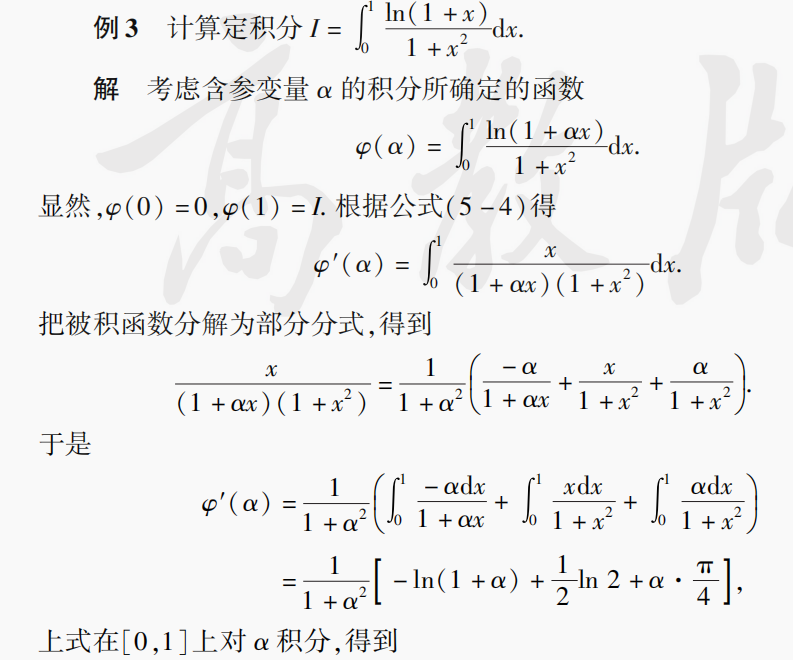
						- 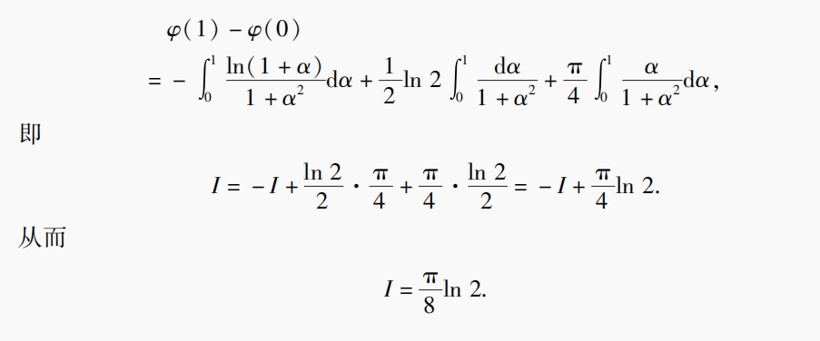
					- $\dfrac{1}{x} = \int_{0}^{+\infty} e^{-xt}dt$，
					  collapsed:: true
						- 类似Laplace变换，
						- 设f(t)为关于t的函数，称由含参数积分定义的关于s的函数$F(s) = \int_{0}^{+\infty} e^{-st}f(t)dt$为对函数f(t)的Laplace变换，记为$\mathscr{L}$，
			- 转化为无穷级数
			  collapsed:: true
				- 对于较复杂的被积函数，可能难以求出解的闭形式，
				- 可以考虑将被积函数写为无穷级数的形式并求解得到近似值，
				- 求解时应注意级数的收敛域，可以通过换元的方式改变积分限，
				- 示例
					- Gauss积分
					  collapsed:: true
						- $\int_{0}^{x}e^{-t^{2}}dt = \int_{0}^{x}(1 + \frac{-t^{2}}{1} + \frac{(-t^{2})^{2}}{2!} + \cdots) dt$
						- $= x - \frac{x^{3}}{3} + \frac{x^{5}}{10} + \cdots$，
						- 收敛域为R，
					- 正弦积分（Dirichlet积分）
					  collapsed:: true
						- $\int_{0}^{x}\frac{\sin t}{t}dt = \int_{0}^{x}(1 + \frac{-t^{3}}{3!t} + \frac{t^{5}}{5!t} + \cdots) dt =  \int_{0}^{x}(1 - \frac{t^{2}}{6} + \frac{t^{4}}{120} + \cdots) dt$
						- $= x - \frac{x^{3}}{18} + \frac{x^{5}}{600} + \cdots$，
						- 由$\int _{0}^{+\infty} \frac{\sin x}{x}dx = \frac{\pi}{2}$，也可算出$\int_{x}^{+\infty}\frac{\sin t}{t}dt = \frac{\pi}{2} - \int_{0}^{x}\frac{\sin t}{t}dt$，
		- （@定积分的近似）
		  collapsed:: true
			- （阶梯逼近）
			  collapsed:: true
				- 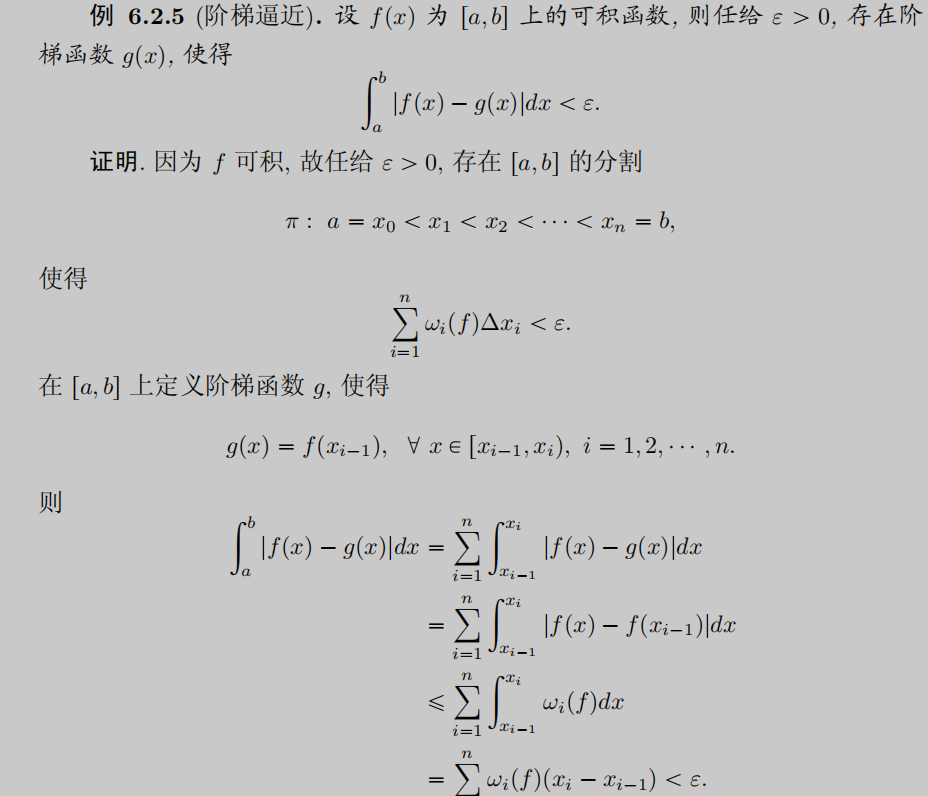{:height 310, :width 350}
			- 定积分的基本思想为以直代曲，
			- 所以定积分的近似计算的基本思想同样为以直代曲，只是“近似”时选取的*分点较少*，
			- 例如用矩形，梯形等*直线图形*近似不规则形状；或用*多项式*（泰勒公式）来近似不规则函数f，
			- 其*误差*一般由*导数*的取值和区间长度得出，一般为一阶导数或二阶导数，
			- Simpson 公式
			  collapsed:: true
				- 用*抛物线*逼近函数，
				- 其误差可由*（二阶）插值多项式*的余项公式估计，同样与导数的取值和区间长度有关，
			- Newton-Cotes 公式
			  collapsed:: true
				- 用高阶插值多项式（Lagrange 插值多项式）来逼近函数f，
		- 积分上限函数
		  collapsed:: true
			- 定义
			  collapsed:: true
				- 若f(x)在区间[a, b]上可积，则可定义*关于x*的积分上限函数$\int_{a}^{x} f(t)dt$，
				- 其中x为自变量，t为积分变量（参数），
			- 原函数
			  collapsed:: true
				- 定理：若f(x)在闭区间[a, b]上连续，则积分上限函数$\Phi(x) = \int _{a}^{x} f(t) dt$就是f(x)在[a, b]上的一个原函数，
				- （原函数存在不能说明f(x)可积），
			- 连续性
			  collapsed:: true
				- 在闭区间[a, b]上，积分上限函数一般存在，但不一定为f(x)的原函数（积分上限函数的导数不连续），
				- 若f(x)在闭区间[a, b]上可积（不一定连续），则积分上限函数连续，
			- 可导性
			  collapsed:: true
				- 变限积分求导
				  collapsed:: true
					- 设f(t)为关于t的单变量函数，
					- 则可定义关于 x 的积分上限函数$\int_{v(x)}^{u(x)} f(t)dt$，
					- 若u(x)，v(x)均可导，则可以对自变量 x 求导，
					- 且$\dfrac{\text d}{\text dx}\int_{v(x)}^{u(x)} f(t)dt = f[u(x)]u'(x) - f[v(x)]v'(x)$，
				- 性质
				  collapsed:: true
					- 若f(x)在闭区间[a, b]上可积，且无跳跃间断点，则关于 x 的积分上限函数可导，且$\dfrac{\text d}{\text dx}\int_{a}^{x} f(t)dt|_{x = x_{0}} = f(x_{0})$，
					- 若f(x)在闭区间[a, b]上存在可去间断点，则积分上限函数可导，但其导函数不一定连续，
				- 求解技巧
				  collapsed:: true
					- 应注意$\int _{a}^{-x} f(t) dt$的导数为-f(-x)，负号不能忽略；可以利用变量代换等方式寻找f(x)与f(-x)的关系，
					- 复杂的积分上限函数可以考虑整体代换，并综合应用分部积分，
					- 若难以得到原函数的闭形式（如难以求解的微分方程，或较复杂的积分），可以将原函数写为积分上限函数的形式，便于进一步的分析处理，
		- （含参数的定积分）
		  collapsed:: true
			- 定义
			  collapsed:: true
				- 设f(x, y)为关于 x, y 的*二元*函数，在有界区域[a, b] \times [c, d]内有定义，则可定义关于x的函数$u(x) = \int_{a}^{b}f(x, y)dy$，
				- 其中x为自变量，y为积分变量（参数），
			- 性质
			  collapsed:: true
				- u(x)在定义域上连续，
				- u(x)在定义域上可积，且$\int_{c}^{d}u(x)dx = \iint_{[a, b] \times [c, d]}f(x, y)dxdy$，
			- 积分上限函数
			  collapsed:: true
				- 定义
				  collapsed:: true
					- 含参数的定积分也可定义积分上限函数$u(x) = \int_{v(x)}^{u(x)} f(x, y){\text dy}$；
					- 其中x为自变量，y为积分变量（参数），
				- 性质
				  collapsed:: true
					- u(x)在定义域上连续，
				- 可导性
				  collapsed:: true
					- 根据积分法则，可知该函数仍为关于x的一元函数，但*不能*直接求导，
					- Leibniz法则
					  collapsed:: true
						- 条件：函数f(x, y)在*有界*区域内连续且存在一阶偏导数f'_{X}(x, y)；u(x)，v(x)同样在*有界*区域内连续可导，
						  collapsed:: true
							- 即积分必须为定积分，不能为反常积分，
							- 理论上反常积分也有类似结果，但证明涉及积分与求导的可交换性，涉及Lebesgue控制收敛定理，
						- 则$\dfrac{\text d}{\text dx}\int_{v(x)}^{u(x)} f(x, y){\text dy} = f[x, u(x)]u'(x) - f[x, v(x)]v'(x) + \int_{v(x)}^{u(x)} f'_{X}(x, y){\text dy}$，
						- 特例：u(x)，v(x)为常数时，$\dfrac{\text d}{\text dx}\int_{v}^{u} f(x, y){\text dy} = \int_{v}^{u} \dfrac{\partial f(x, y)}{\partial x}{\text dy}$，
			- 应用：积分定义的函数
			  collapsed:: true
				- 概念
				  collapsed:: true
					- 不同于四则运算得到的初等函数，积分给出了定义新函数的一种手段，
					- 积分定义的函数可能无法写为初等函数，但是可以通过积分的性质和被积函数的性质分析，
				- 对数函数（积分上限函数定义）
				  collapsed:: true
					- 设$\phi(x) = \int_{1}^{x}\dfrac{1}{t}dt = (\ln x)$，
					- 定义域：x > 0（1/t在x = 0没有定义），
					- 在定义域内连续，可导，
					- 函数等式\phi(xy) = \phi(x) + \phi(y)，
					  collapsed:: true
						- 可用定积分区间的可加性和换元法证明，
						- 可进一步推出$\phi(x^{\alpha}) =\alpha \phi(x), \alpha \in R$，
					- 特殊函数值
					  collapsed:: true
						- $\phi(1) = 0$，
						- $\phi(e) = 1$，
						  collapsed:: true
							- $\phi(e) = \phi(\lim\limits_{n \to \infty}(1 + \frac{1}{n})^{n}) = \lim\limits_{n \to \infty} \phi((1 + \frac{1}{n})^{n})$（e的定义与连续性）
							- $= \lim\limits_{n \to \infty} n\phi(1 + \frac{1}{n})$（函数的性质）
							- $= \lim\limits_{n \to \infty} n(\phi(1 + \frac{1}{n}) - \phi(1)) = \lim\limits_{n \to \infty} n(\phi'(\xi_{n})\frac{1}{n}) ,\xi_{n} \in (1, 1 + \frac{1}{n})$（微分中值定理）
							- $= \lim\limits_{n \to \infty}\frac{1}{\xi_{n}} = 1$
				- \Gamma函数
				  collapsed:: true
					- 由反常积分$\int _{0}^{+\infty}{t}^{n - 1}{e}^{-t}dt$定义的*关于n*的函数\Gamma(n)为\Gamma函数；
					  collapsed:: true
						- 注意定义中t的指数项为n - 1，
						- 定义域为$n \in (0, + \infty)$，
					- 性质
					  collapsed:: true
						- {:height 216, :width 211}
						- 连续性
						- 单调性
						- 函数值
						  collapsed:: true
							- 递推公式：$\Gamma(n) = (n-1)\Gamma(n-1), n\in (1, + \infty)$,
							- 阶乘公式：$\Gamma(n) = (n-1)!$，$(n\in N^{+})$
							- 所以\Gamma函数可以看成实数集R上的阶乘函数，
					- 常用函数值
					  collapsed:: true
						- $\Gamma(2) = \Gamma(1) = 1$,
						  collapsed:: true
							- $\Gamma(2) = \int _{0}^{+\infty}{t}{e}^{-t}dt$，
							- $\Gamma(1) = \int _{0}^{+\infty}{e}^{-t}dt$，
						- $\Gamma(\frac{1}{2}) = \sqrt{\pi}$,
						- $\Gamma(\frac{2n+1}{2}) = \frac{(2n-1)!!}{2^{n}}\Gamma(\frac{1}{2}) = \frac{(2n-1)!!}{2^{n}}{\sqrt{\pi}}$，
						  collapsed:: true
							- 应注意不能写为正整数的单阶乘的形式，
				- \Beta函数
				  collapsed:: true
					- 性质
					  collapsed:: true
						- 换元x = sin^{2}(t)，可得$\int_{0}^{\frac{\pi}{2}}\sin^{a - 1}t \cos^{b - 1}tdt = \dfrac{1}{2}\dfrac{\Gamma(\frac{a}{2})\Gamma(\frac{b}{2})}{\Gamma(\frac{a + b}{2})}$，
						- b = 1时可得Wallis公式$\int_{0}^{\frac{\pi}{2}}\sin^{a}tdt = \dfrac{\sqrt{\pi}}{2}\dfrac{\Gamma(\frac{a + 1}{2})}{\Gamma(\frac{a + 2}{2})}$，
				- Stirling公式
				  collapsed:: true
					- $n! = \sqrt{2n \pi}(\frac{n}{e})^{n}e^{\frac{\theta_{n}}{12n}}$ ，\theta_{n} \in (0, 1)，
					- 一般用于计算 n! 的近似值，
					- 此外，幂级数的形式也易于进行数学分析，
	- 反常（广义）积分
		- 积分的推广
		  collapsed:: true
			- 无穷区间[a, +\infty]
			  collapsed:: true
				- 函数 f 在区间[a, +\infty]上有定义，
				- 可以设点b < +\infty，
				- 因此可取$\int _{a}^{b} f(x) dx = L$，
				- 再求b \to +\infty时，上述积分的极限，即$\lim\limits_{b \to \infty}\int _{a}^{b} f(x) dx = \lim\limits_{b \to \infty}\phi(b)$，
				- 若关于b的函数的极限存在，则称其为无穷区间[a, +\infty]上的反常积分，
			- 无界函数(a, b]
			  collapsed:: true
				- 函数 f 在区间(a, b]上有定义，且$\lim\limits_{x \to a^{+}}f(x) = \infty$，
				- 称点a为函数 f 的瑕点，
				- 可以设\epsilon > 0，
				- 因此可取$\int _{a + \varepsilon}^{b} f(x) dx = L$，
				- 再求\epsilon \to 0时，上述积分的极限，即$\lim\limits_{\varepsilon \to 0^{+}}\int _{a + \varepsilon}^{b} f(x) dx = \lim\limits_{\varepsilon \to 0}\phi(\varepsilon)$，
				- 若关于\epsilon的函数的极限存在，则称其为无界函数 f 在区间[a, b]上的反常积分，
				- （对于b为函数的瑕点的讨论同理），
		- 反常积分的审敛
		  collapsed:: true
			- 函数的化简
			  collapsed:: true
				- （标准型[f(x)]^{p}）
				- （参数取值的分析）
			- 判断反常积分类型
			  collapsed:: true
				- 无穷区间
				- 无界函数（确定无界点）
				- 两者均有（分拆区间）
				- 不确定（分析参数取值）
			- 判别方法
			  collapsed:: true
				- 定义
				  collapsed:: true
					- 对于\pm \infty区间，定义为*两侧积分均收敛*时，反常积分收敛，
					  collapsed:: true
						- （推广：对于对称图形，定义$v.p\int _{-\infty}^{+\infty} x dx = \lim\limits_{b \to \infty}\int _{-b}^{b} x dx = 0$，记为Cauchy主值收敛，）
					- 对于区间内部存在无界点（瑕点）的积分，定义为瑕点*两侧积分均收敛*时，反常积分收敛，
				- 无穷区间积分
				  collapsed:: true
					- 无界函数的判别类似，但求极限时应改为求无界点的极限，
				- 比较判别法
				  collapsed:: true
					- 设0 \le f(x) \le Mg(x), M > 0，
					  collapsed:: true
						- $\int _{a}^{+\infty} g(x)dx$收敛时，$\int _{a}^{+\infty} f(x)dx$也收敛，
						- $\int _{a}^{+\infty} f(x)dx$发散时，$\int _{a}^{+\infty} g(x)dx$也发散，
					- 一般取函数g(x)为P积分，
				- 比较法极限形式
				  collapsed:: true
					- 将反常积分的审敛问题转化为极限的求解问题，
					- 应注意一般的反常积分为*分式函数*，即$\dfrac{1} {x^p}$，而不是$x^p$，
					- 若函数f(x)，g(x)为同阶无穷小（即$\lim\limits_{x \to +\infty} \dfrac{f(x)}{g(x)} = k$），则$\int _{a}^{+\infty} g(x)dx$和$\int _{a}^{+\infty} f(x)dx$同敛散，
					- 若函数f(x)为g(x)的高阶无穷小（即$\lim\limits_{x \to +\infty} \dfrac{f(x)}{g(x)} = 0$），则$\int _{a}^{+\infty} g(x)dx$收敛时，$\int _{a}^{+\infty} f(x)dx$也收敛，
					- 若函数f(x)为g(x)的低阶无穷小（即$\lim\limits_{x \to +\infty} \dfrac{f(x)}{g(x)} = \infty$），则$\int _{a}^{+\infty} g(x)dx$发散时，$\int _{a}^{+\infty} f(x)dx$也发散，
				- Cauchy判别法
				  collapsed:: true
					- 若极限$\lim\limits_{x \to +\infty} x^{p}{f(x)} = k$存在，
					  collapsed:: true
						- 即取函数g(x)为p积分$\dfrac{1} {x^p}$，
						- 求与f(x)*同阶的x^{p}*中p的取值，再根据p积分的敛散性判断，
					- 则$\begin{cases}   p > 1 & \int _{a}^{+\infty} f(x)dx收敛 \\p \le 1  & \int _{a}^{+\infty} f(x)dx发散\end{cases}$，
				- 其它判别法
				  collapsed:: true
					- 反常积分的Cauchy收敛准则
					  collapsed:: true
						- 若对于“任意大”的b(\epsilon)，c(\epsilon)（c > b），和“任意小”的\epsilon，
						- 总有$\int _{b}^{c} f(x) dx = F(c) - F(b) < \varepsilon$，则反常积分收敛，
					- Dirichlet判别法
					  collapsed:: true
						- 设函数f(x)在[a, +\infty]单调，且$\lim\limits_{x \to +\infty} {f(x)} = 0$，
						- 若关于g(x)的反常积分$\int _{a}^{+\infty} g(x)dx$*有界*（不一定收敛），
						  collapsed:: true
							- 如$\int _{a}^{+\infty} \sin(x)dx$不收敛，但为有界量，
						- 则反常积分$\int _{a}^{+\infty} f(x)g(x)dx$收敛，
						- 示例
						  collapsed:: true
							- $\int _{1}^{+\infty} \dfrac{\sin(x)}{x^{p}}dx$，p > 0，
							- 由于p > 0时，$\dfrac{1}{x^{p}}$在[a, +\infty]单调，且$\lim\limits_{x \to +\infty} \dfrac{1}{x^{p}} = 0$，
							- 反常积分$\int _{1}^{+\infty} \sin(x)dx$有界，
							- 所以$\int _{1}^{+\infty} \dfrac{\sin(x)}{x^{p}}dx$收敛，
							- （0 < p \le 1时，该积分条件收敛，而p > 1时积分绝对收敛），
					- Abel判别法
					  collapsed:: true
						- 设函数f(x)在[a, +\infty]单调，有界，
						- 若关于g(x)的反常积分$\int _{a}^{+\infty} g(x)dx$收敛，
						- 则反常积分$\int _{a}^{+\infty} f(x)g(x)dx$收敛，
				- 常见函数可以直接求积分，如$\dfrac{1}{x\ln x}，e^{-x}，\arctan x$等，
				- 可以综合常见不等式的放缩的方法，
			- 推广
			  collapsed:: true
				- 不同于级数，反常积分的收敛没有必要条件，
				  collapsed:: true
					- 反常积分收敛不能推出$\lim\limits_{x \to \infty} f(x) \to 0$，
					  collapsed:: true
						- 示例：$\int _{1}^{+\infty} \cos(x^{2}) dx = \frac{1}{2}\int _{1}^{+\infty} \dfrac{\cos t}{\sqrt{t}} dt$，
						- 利用分步积分和Cauchy准则，$= \int_{b}^{c}\dfrac{1}{\sqrt{t}}d(\sin t) = \dfrac{\sin t}{\sqrt{t}}|_{b}^{c} + \dfrac{1}{2}\int_{b}^{c}\dfrac{\sin t}{{t}^{-\frac{3}{2}}}dt$，
						- 由sin的有界性，可知上式$< \dfrac{1}{\sqrt{c}} + \dfrac{1}{\sqrt{b}} + \dfrac{1}{2}\int_{b}^{c}\dfrac{1}{{t}^{-\frac{3}{2}}}dt = \dfrac{2}{\sqrt{c}} \to 0$，
						- 可知原积分收敛，但并没有$\lim\limits_{x \to \infty} f(x) \to 0$，
					- 反常积分收敛也不能推出f(x)有界，
				- 反常积分的绝对收敛和条件收敛
				  collapsed:: true
					- 理论上，类比正项级数，应用比较法时也应有区间内*恒有*f(x), g(x) > 0，
					- 上述判别方法默认了条件成立，
					- 对于其他函数，类似级数的敛散性；
					- 定义区间上 |f| 的积分收敛时，f *绝对收敛*，而 f 的积分收敛，但 |f| 的积分发散时，f 的积分*条件收敛*，
				- 数值方法
				  collapsed:: true
					- 很多没有原函数的反常积分的准确取值计算起来较为困难（如$\int _{0}^{+\infty} \dfrac{\sin x}{x}dx$），或者*难以计算*得到准确值，
					- 这些积分一般需要数值方式求解，一种方法为Gauss-Legendre公式，
					- 或者也可以取“足够大”（或“足够小”）的数A，将积分转化为常值积分，再进行计算，
			- 技巧
			  collapsed:: true
				- 对于无穷区间和无界函数，具体的极限求解也不相同，应具体分析，
				- 可以结合积分的比较定理，对积分函数进行适当放缩，
				- p级数的形式为$\dfrac{1} {x^p}，\dfrac{1} {(x-a)^p}$，而不是$x^p$，比较时应注意，
				- 极限求解时非零因子可以先求出，但零/极限为零的因子不能忽略，
				- 对于较复杂的积分，可以先应用换元积分法和分部积分法转换积分的形式，再分析积分的敛散性，
		- 《《常见反常积分的敛散性
		  collapsed:: true
			- P积分的敛散性
			  collapsed:: true
				- 无穷积分
				  collapsed:: true
					- $\int _{1}^{+\infty} \dfrac{1}{x^{p}}dx  = \begin{cases}  收敛 & p > 1 \\发散 & p \le 1 \end{cases}$，
				- 无界函数
				  collapsed:: true
					- $\int _{0}^{1} \dfrac{1}{x^{p}}dx  = \begin{cases} 收敛 & p < 1  \\ 发散  & p \ge 1\end{cases}$，
					  id:: 62f45fd0-4195-484e-a422-3969408d45dc
					- 其他无界点同理，
					- 如$\int _{a}^{b} \dfrac{1}{(x - a)^{p}}dx，\int _{a}^{b} \dfrac{1}{(b - x)^{p}}dx  \to \begin{cases} 收敛 & p < 1  \\ 发散  & p \ge 1 \end{cases}$，
			- $\int _{0}^{+\infty} \dfrac{\sin x}{x}dx = \dfrac{\pi}{2}$，$\int _{0}^{+\infty} \dfrac{|\sin x|}{x}dx$发散，
			  collapsed:: true
				- 二重积分法
				- *代换1*：$\dfrac{1}{x} = \int_{0}^{+\infty} e^{-xt}dt$，
				- 原式$= \int _{0}^{+\infty}(\int_{0}^{+\infty} e^{-xt}dt) {\sin x}dx = \int _{0}^{+\infty}(\int_{0}^{+\infty} e^{-xt}{\sin x} dx)dt$，
				- *代换2*：$\int_{0}^{+\infty} e^{-xt}{\sin x} dx = \dfrac{1}{1 + t^{2}}$，
				  collapsed:: true
					- 可由分部积分求得，
				- 原式$= \int _{0}^{+\infty} \dfrac{1}{1 + t^{2}}dt = \dfrac{\pi}{2}$，
			- 具体函数
			  collapsed:: true
				- $\int _{1}^{k} \dfrac{1}{\ln x}dx$发散，
				- $\int _{0}^{1} \dfrac{\ln x}{x}dx$发散，
				-
				- $\int _{2}^{+\infty} \dfrac{\ln^{a} x}{x^{b}}dx$收敛（b > 0），
				- $\int _{2}^{+\infty} \dfrac{x^{b}}{e^{x}}dx$收敛（b > 0），
				- $\int _{2}^{+\infty} \dfrac{1}{x\ln^{b} x}dx = \begin{cases} 发散 & b \le 1 \\ 收敛 & b > 1 \end{cases}$，
			- 抽象函数
			  collapsed:: true
				- $\int _{1}^{+\infty}f(x)dx$收敛时，$\int _{1}^{+\infty}[f(x)]^{2}dx$不一定收敛，
				- $\int _{1}^{+\infty}|f(x)|dx$收敛时，$\int _{1}^{+\infty}[f(x)]^{2}dx$收敛，
				- $\int _{1}^{+\infty}[f(x)]^{2}dx$收敛时，$\int _{1}^{+\infty} \dfrac{f(x)}{x}dx$收敛，
		- 反常积分的计算
		  collapsed:: true
			- 若反常积分收敛，且被积函数存在原函数，则可以利用牛顿-莱布尼茨公式计算反常积分的值，
			  collapsed:: true
				- 无穷区间
				  collapsed:: true
					- $\int _{a}^{+\infty} f(x) dx = \lim\limits_{b \to \infty}\int _{a}^{b} f(x) dx = \lim\limits_{b \to \infty}[F(b) - F(a)] = \lim\limits_{b \to \infty}F(b) - F(a)$，
			- 反常积分也可应用换元积分法和分部积分法，
			  collapsed:: true
				- 对于有理分式积分，应注意倒代换的应用，
			- 计算时应注意极限项，
			  collapsed:: true
				- 对于单个函数，$\int ^{+\infty} _a f(x)dx =\lim\limits_{x \to +\infty} F(x) - F(a)$，
				- 对于多个函数，$\lim\limits_{x \to +\infty} F(x)$可能不存在，但$\lim\limits_ {x \to +\infty} [F(x)-G(x)]$存在，此时$\int ^{+\infty} _a f(x)- g(x)dx = \lim\limits_ {x \to +\infty} [F(x)-G(x)] - [F(a)-G(a)]$，
				- 无界函数同理，无界函数计算时还应根据无界点考虑左、右极限$\lim\limits_{x \to a^+} F(x)$或$\lim\limits_{x \to b^-} F(x)$，
			- 计算无穷限积分时，应注意“无穷”的不同程度，
			  collapsed:: true
				- 即$x \rightarrow e^{\infty}, x \rightarrow {\infty}, x \rightarrow \ln{\infty}$所表示的无穷不能等同，
		- [[级数]]
	- 定积分的应用
		- 原则
		  collapsed:: true
			- 对于实际问题，应注意面积、体积的非负性；可能需要拆分计算，或取绝对值；
			- 应利用图像分析应用题的具体情景，并综合考虑函数的定义域和值域，不应直接套用公式，
			- 分析时应从积分的角度分析，而不是传统的划分几何图像的角度，
			- 求解时应注意公式中的常数项π（2π），
			- 对于直线x = k / y = k，应根据具体图像分析，一般可以考虑平移自变量（x - k），
		- 微元法
		  collapsed:: true
			- 自变量 x ，变化区间[a, b]，
			- 小区间的部分量\Delta U，
			- U的元素 du = h(x) \cdot dx，
			- 利用积分求和，即$U= \int dU = \int_{a}^{b}h(x)dx$，
		- 弧长
		  collapsed:: true
			- 弧长的微分
			  collapsed:: true
				- $\Delta s \approx \sqrt{{\Delta x}^{2} + (f(x + \Delta x) - f(x))^{2}} = {\Delta x}\sqrt{1 + \dfrac{f(x + \Delta x) - f(x))^{2}}{{\Delta x}^{2}}}$，
				- 取极限，可得$\lim\limits_{\Delta x \to 0} \dfrac{\Delta s}{\Delta x} = \sqrt{1 + {f'(x)}^{2}}$，
				- 即$ds = \sqrt{1 + {f'(x)}^{2}}dx$，
			- （平面）曲线f(x)在区间[a, b]内的弧长$s = \int _{a}^{b} \sqrt{1 + {f'(x)}^2} dx$，
			- 参数方程形式
			  collapsed:: true
				- 公式
					- 根据参数方程公式$x = g(t)，\dfrac{dy}{dx} = \dfrac{h'(t)}{g'(t)}$，
					- 由直角坐标换元可得$s = \int _{a}^{b} \sqrt{1 + {[\dfrac{h'(t)}{g'(t)}]}^2} d[g(t)] = \int _{\alpha}^{\beta} \sqrt{[g'(t)]^2 + [h'(t)]^2} dt$，
					- （也可由参数方程的微元直接求得），
				- 示例
				  collapsed:: true
					- 求椭圆在第一象限的弧长，
					- 由于椭圆的参数方程为$r(t) = \begin{cases}  x = a\cos(t) \\y =  b \sin(t) \end{cases}$，
					- 所以$s = \int _{0}^{\frac{\pi}{2}} \sqrt{[-a\sin(t)]^2 + [b\cos(t)]^2} dt = \int _{0}^{\frac{\pi}{2}} \sqrt{a^{2}{\sin}^2(t) + b^{2}{\cos}^2(t)} dt$，
					- （设u = cos t，可换元得到椭圆函数），
			- 极坐标形式
			  collapsed:: true
				- $s = \int _{\alpha}^{\beta} \sqrt{[\rho(\theta)]^2 + [\rho'(\theta)]^2} d\theta$，
		- 平面图形的面积
		  collapsed:: true
			- 直角坐标
			  collapsed:: true
				- 由曲线f_{1}(x)以及x = a，x = b围成的图形的面积为$S = \int _{a}^{b}|f_{1}(x)| dx$，
				- 由曲线f_{2}(x)，f_{1}(x)以及x = a，x = b围成的图形的面积为$S = \int _{a}^{b}|f_{2}(x) - f_{1}(x)| dx$，
				  collapsed:: true
					- 此处*先求函数值的差*再求绝对值，即并非为$\int _{a}^{b}|f_{2}(x)| - |f_{1}(x)| dx$，
				- 定积分并非完全等同于面积，因此有时需要取绝对值，
				- 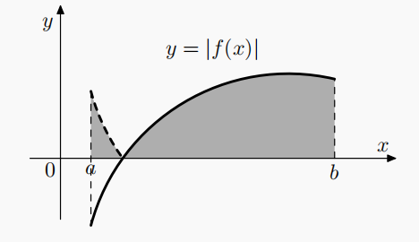{:height 150, :width 250}
			- 参数方程
			  collapsed:: true
				- 由参数方程确定的函数$r(t) = \begin{cases}  x = g(t) \\y =  h(t) \end{cases}$，t \in [\alpha, \beta]围成的图形的面积为$S = \int _{\alpha}^{\beta}h(t)g'(t) dt$，
				- 推广： σ “围成”的图形的面积为$S = \frac{1}{2}\int _{\alpha}^{\beta}|h(t)g'(t) - h'(t)g(t)| dt$，
				  id:: 62f31ab9-15b3-49b5-807a-1909e1b16c3a
				- {:height 130, :width 300}
			- 极坐标
			  collapsed:: true
				- 由曲线\rho(\theta)，\theta \in [\alpha, \beta]围成的图形的面积为$S = \int _{\alpha}^{\beta}\frac{1}{2}[\rho(\theta)]^{2} d\theta$，\beta - \alpha \le 2\pi，
					- 根据极坐标与直角坐标的参数方程转换，$\rho(\theta) = \begin{cases}  x = \rho \sin(\theta) \\y =  \rho \cos(\theta) \end{cases}$，
					- 可得$S = \frac{1}{2}\int _{\alpha}^{\beta}|h(t)g'(t) - h'(t)g(t)| dt = \frac{1}{2}\int _{\alpha}^{\beta}|\rho \cos(\theta) \rho \cos(\theta) - [-\rho \sin(\theta)\rho \sin(\theta)]| d\theta = \frac{1}{2}[\rho(\theta)]^{2} d\theta$，
				- 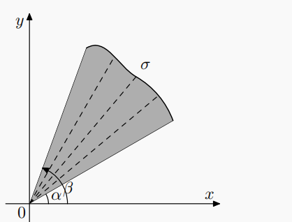{:height 190, :width 250}
			- 示例
			  collapsed:: true
				- 求椭圆在第一象限的面积，
				- 由于椭圆的参数方程为$r(t) = \begin{cases}  x = a\cos(t) \\y =  b\sin(t) \end{cases}$，
				- 所以面积为$S = \int _{\alpha}^{\beta}h(t)g'(t) dt = \int _{0}^{\frac{\pi}{2}}b \sin(t)[-a \sin(t)] dt = -ab\int _{0}^{\frac{\pi}{2}}{\sin}^{2}(t) dt = \dfrac{\pi ab}{4}$，
			- （二重积分）
			  collapsed:: true
				- $S = \iint_{D}1 d\sigma = \int _{a}^{b}dx \int_{f_{1}(x)}^{f_{2}(x)}1dy =  \int _{a}^{b}[f_{2}(x) - f_{1}(x)]dx$，
				- $S = \iint_{D}1 d\sigma = \int _{\alpha}^{\beta}d\theta \int_{\rho_{1}(\theta)}^{\rho_{2}(\theta)} 1 \rho d\rho =  \int _{a}^{b}\frac{1}{2}([\rho_{2}(\theta)]^{2} - [\rho_{1}(\theta)]^{2})d\theta$，
		- 旋转体的体积
		  collapsed:: true
			- 绕 x 轴旋转的旋转体
			  collapsed:: true
				- 直角坐标
				  collapsed:: true
					- 体积元素
					  collapsed:: true
						- 圆柱的体积$V = Sh$，
						- $dV = \pi[f(x)]^{2} dx$，
						  collapsed:: true
							- S = \pi r^{2} = \pi [f(x)]^{2}
							- h = dx
						- {:height 194, :width 246}
					- $V = \pi \int_{a}^{b} [f(x)]^{2} dx$，
				- 参数方程
				  collapsed:: true
					- 由参数方程确定的函数$r(t) = \begin{cases}  x = x(t) \\y = y(t) \end{cases}$，t \in [\alpha, \beta]，
					- 绕 x 轴旋转的旋转体的体积为$S = \int _{\alpha}^{\beta}2\pi y(t)\sqrt{(x'(t))^{2} + (y'(t))^{2}}dt$，
			- 绕 y 轴旋转的旋转体
			  collapsed:: true
				- 直角坐标
					- $dV = 2\pi x f(x) dx$，
					  collapsed:: true
						- 
						- S = f(x) dx
						- h = 2\pi x
					- $V = 2\pi\int_{a}^{b}x f(x) dx$，
			- （绕任意直线旋转）
			  collapsed:: true
				- 直角坐标二重积分
				  collapsed:: true
					- 设旋转区域为D，旋转轴为L：ax + by + c = 0，
					- 设$r(x, y) = \dfrac{|ax + by + c|}{\sqrt{a^{2} + b^{2}}}$，
					  collapsed:: true
						- 绝对值为 r 点处L(x, y)的正负，即区域在直线上方还是下方，
						- 直线不应穿过区域，穿过时应分段讨论，
					- 则$V = 2\pi \iint_{D}r(x, y)d\sigma$，
			- 技巧
			  collapsed:: true
				- 多条曲线时，$V = \pi \int_{a}^{b} [f(x)]^{2} - [g(x)]^{2} dx  \ne \pi \int_{a}^{b}([f(x)] - [g(x)]) ^{2} dx$，
				- 对于较复杂的区域，可以尝试改变积分函数，
					- ，
		- 平行截面已知的立体体积
		  collapsed:: true
			- $V = \int_{a}^{b}A(x) dx$，
		- 常用体积公式
		  collapsed:: true
			- 
		- 旋转体的侧面积
		  collapsed:: true
			- 绕 x 轴旋转的旋转体
				- 面积元素
				  collapsed:: true
					- 圆柱的侧面积$S = 2 \pi r h$，
					- $dS = 2\pi \cdot f(x) \cdot  ds$，
					  collapsed:: true
						- 半径r 为函数值f(x)，
						- 高度h 为弧长$ds = \sqrt{1 + {f'(x)}^{2}}dx$，
				- $S = 2\pi \int_{a}^{b}|f(x)| \sqrt{1 + [f'(x)]^{2}}dx$，
			- 圆锥的侧面积$S = \pi r \sqrt{r^{2} + h^{2}}$，
		- 函数的平均值
	- 《《定积分的物理应用
	  collapsed:: true
		- 功
		- 引力，压力，
		- 质心，形心，
	- （蒙特卡洛积分）
	  collapsed:: true
		- 目的
		  collapsed:: true
			- 求解定积分$\int_{a}^{b} g(x)dx$，
			- g(x)的形式较复杂，难以解出闭形式，
		- 构造随机变量
		  collapsed:: true
			- 设随机变量$X \sim U(a, b)$，则$f_{X}(x) = \frac{1}{b - a}$，
			- 将积分写为$\int_{a}^{b} g(x)dx = (b - a)\int_{a}^{b} g(x) \frac{1}{b - a}dx = (b - a)\int_{a}^{b}g(X)f_{X}(x)dx = (b - a)E[g(X)]$，
			- 因此，可设*随机变量Y* $= (b - a)g(X)$，
			- 则有$EY = (b - a)E[g(X)] = \int_{a}^{b} g(x)dx$，
		- 大数定律
		  collapsed:: true
			- 由大数定律，可知$\overline {Y} \stackrel{P} {\rightarrow} EY$，
		- 计算
		  collapsed:: true
			- 因此，可生成X_{i}的随机数，再计算对应的Y_{i}，
			- 然后利用多个Y_{i}计算均值$\overline {Y}$来估计积分，
- [[常微分方程]]
- [[多变量微积分]]
- [[数学分析]]