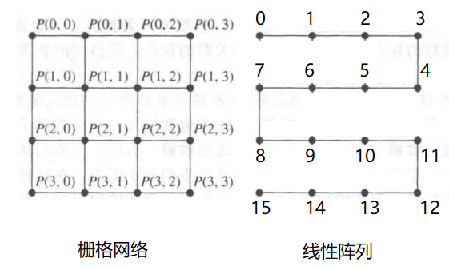
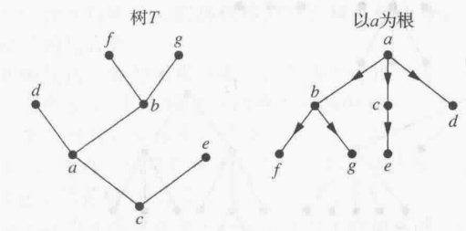

- 图的基本概念
  collapsed:: true
	- 定义
	  collapsed:: true
		- 由顶点（或结点）的非空集合V和边的集合E构成的几何图形，一般记为图(V，E)，
		- 每条边一般都有两个顶点与其相连，
		  collapsed:: true
			- 只有环边只连接一个顶点，
			- 一般不存在“射线”边，
		- 一般的图中的所有顶点都有相连的边，但理论上也*可以*有没有边相连的顶点（孤立点），
			- 示例 {:height 100, :width 150}也是一个图，
		- 连接端点与自身的边称为环，
	- 度
	  collapsed:: true
		- 定义
		  collapsed:: true
			- 设v_{i}, v_{j}为顶点，称与顶点v_{i}相关联的边的数目为顶点的度；
			- 无向图
			  collapsed:: true
				- 称与顶点v_{i}相关联的边的数目为顶点的度，记为deg(v_{i})；若顶点有环边，则记环边的度为2，
					- 称度为0的点为孤立点，
					- 称度为1的点为悬挂点，
			- 有向图
			  collapsed:: true
				- 以v_{i}为起点的边数称为v_{i}的出度，记为deg+(v_{i})；
				- 以v_{i}为终点的边数称为v_{i}的入度，记为deg-(v_{i})；
				- 若顶点有环边，则环边的入度和出度都为1，
			- 多重图
			  collapsed:: true
				- 若顶点v_{i}, v_{j}间有m条边，则称(v_{i}, v_{j})是一条多重度为m的边，
		- 度序列
		  collapsed:: true
			- 图的各个顶点的度按照单调不减的顺序排列成的数列；有向图可进一步分为入度列和出度列，
			- 一般将无向图G的最大度记为\Delta，最小度记为\delta；对于有向图，一般记最大出度为\Delta+，最大入度为\Delta-；最小出度为\delta+，最小入度为\delta-，
			- 若一个单调不减的数列可以作为图的度序列，则称该序列为*成图*的，
			- 定理：若某个单调不减的数列的序列和为偶数，则数列一定可以作为伪图的度序列，
			  collapsed:: true
				- 由于图的顶点之间可以不相连，因此可以通过给每个顶点添加尽可能多的环来构造一个图，
		- 正则性
		  collapsed:: true
			- 若简单图中每个顶点的度都为n，则称这个图为n正则的，
			- 可知，完全图为正则图，
	- 图的基本分类
	  collapsed:: true
		- 边的方向
		  collapsed:: true
			- 无向图
			  collapsed:: true
				- 设v_{i}, v_{j}为顶点集合V中的元素，若v_{i}，v_{j}之间有边e_{i}连接，则称顶点v_{i}，v_{j}相邻，称边e_{i}关联顶点v_{i}，v_{j}，
				- 称顶点v_{i}的所有相邻顶点的集合为v_{i}的邻居，记为N(v_{i})，
				  collapsed:: true
					- 对于顶点集合V的子集A，记$N(A) = \mathop{\cup}\limits_{v_{i} \in A} N(v_{i})$，
			- 有向图
			  collapsed:: true
				- 设v_{i}, v_{j}为顶点集合V中的元素（顶点），一般用有序对(v_{i}, v_{j})表示从v_{i}到v_{j}的有向边；称v_{i}为边的起点，v_{j}为边的终点，
				- （i，j可以相同，此时的边为环），
			- 混合图：图中的边部分有方向，部分没有方向，
		- 连接顶点的边数
		  collapsed:: true
			- 简单图：每条边都连接两个不同的顶点，且没有两条不同的边连接一对相同顶点的图，
			- 多重图：同一对顶点之间，可能有多条相互连接的边，
			- 伪图：同一对顶点之间存在多重边，而且允许有环存在的图，
		- 顶点数量
		  collapsed:: true
			- 无限图：顶点集为无限集，或有无限条边的图称为无限图，
			- 有限图：顶点集和边集为有限集的图称为有限图，一般比较常见，
		- 集合数量
		  collapsed:: true
			- 交图：用来描述集合$(V_{1}, V_{2},...,V_{n})$之间的关系的图，此处的*顶点*指代的为*集合V_{i}*（不再是集合中的元素）；若集合V_{i}，V_{j}之间有非空交集，则用边连接这两个集合，
	- 二分图（二部图）
	  collapsed:: true
		- 定义
		  collapsed:: true
			- 设集合(V，E)为一个简单图，
			- 若顶点集合V可以分为两个互斥的子集V_{1}，V_{2}；且两个集合内的顶点没有边连接，
			- 则称V为一个二分图，称(V_{1}，V_{2})为V的一个二部划分，
			- 示例 {:height 135, :width 300}
		- 完全二分图
		  collapsed:: true
			- 设(V_{1}，V_{2})为一个二分图，其顶点（元素）个数分别为m，n；
			- 若V_{1}中的*每个*顶点与*所有*V_{2}中的顶点都有边连接，*而且*V_{2}中的*每个*顶点与*所有*V_{1}中的顶点都有边连接，
			- 则称(V_{1}，V_{2})为完全二分图，记为K_{m, n}，
		- 判定
		  collapsed:: true
			- 定理（充要条件）
				- 设图G = (V，E)为一个简单图；
				- 分别对图中的每个顶点赋予两种不同的颜色，若可以使所有相邻（有边连接）的顶点的颜色都不相同，则V为一个二分图，
			- 定理
				- 无向图G = (V，E)为二分图 \Leftrightarrow G中无奇数长度的回路，
		- 匹配
		  collapsed:: true
			- 定义
			  collapsed:: true
				- 设集合(V，E)为一个简单图，
				- 定义匹配集合M为边集合E的一个子集，该子集中没有两条边关联相同的顶点，
				- 存在于匹配集合M中的边的端点称为*被匹配*的端点，
					- 并非所有端点都一定会被匹配，例如圈图C_{3}和C_{5}就一定有一个端点不能匹配，
				- 称包含边数最多的一个匹配为*最大匹配*，
					- 同一个简单图可以有多个匹配，例如完全图K_{4}有3个匹配（集合），圈图C_{4}有2个匹配，
				- 对于二分图(V_{1}，V_{2})，若V_{1}中的每个顶点都有边连接到V_{2}，则称对应的匹配集合M为从V_{1}到V_{2}的完全匹配，
				- 示例 {:height 135, :width 260}，
			- 性质
			  collapsed:: true
				- 霍尔定理
					- 设G = (V_{1}，V_{2}，E)为一个二分图，
					- 存在从V_{1}到V_{2}的完全匹配的充要条件为，对V_{1}的所有子集A，都有$|N(A)| \geq |A|$，
						- （N(A)为A中所有顶点的相邻顶点的集合的并集，|A|指集合A的基数），
				- t条件
					- 设G = (V_{1}，V_{2}，E)为一个二分图，且|V_{1}| ≤|V_{2}|，
					- 若\exist t \in N+，使V_{1}中的每个顶点至少关联t条边，且V_{2}中的每个顶点至多关联t条边，则G中存在V_{1}到V_{2}的完全匹配，
					-
	- 基本图
	  collapsed:: true
		- 完全图
		  collapsed:: true
			- 若图的每对不同顶点之间都有且只有一条边，则称图为完全图；一般记为K_{n}，其中n为图的顶点数，
			- 其边数为${n \choose 2} = \frac{(n-1)n}{2}$条，
			  collapsed:: true
				- （由简单图的定义，可知简单图的边的上限就是$\frac{{n}^{2} - {n}}{2}$条），
			- 若至少有一对不同的顶点不存在边相连，则称图为非完全图，
			- 示例 {:height 130, :width 300}，
			- （有向完全图）
			  collapsed:: true
				- 图的每对不同顶点之间都有且只有方向相反的两条边，
				- 示例 {:height 130, :width 170}
		- 星形拓扑图
		  collapsed:: true
			- 若图的所有n - 1个顶点都只与剩下的一个顶点由一条边相连，则称图为星型拓扑图；
			- 可知，星形拓扑图为一个完全二分图，一般记为K_{1，n}，
			- 其边数为n - 1条，
			- 示例 {:height 92, :width 96}
		- 圈图（环形拓扑）
		  collapsed:: true
			- 若图只在顶点v_{i}和v_{i+1}之间有边连接，则称图为圈图；一般记为C_{n}，其中n为图的顶点数，
			- 其边数为n条，
			- 示例 {:height 130, :width 300}，
			- （有向圈图）
				- 图只在顶点v_{i}和v_{i+1}之间有边连接，且方向为v_{i} \to v_{i+1}，
				- 示例 {:height 100, :width 290}，
		- 轮图（混合拓扑）
		  collapsed:: true
			- 在圈图C_{n}（n>3)中加入新的顶点，且新的顶点与*所有*原有顶点都有边连接，称新的图为轮图；一般记为W_{n}，其中n为图的顶点数，
			- 其边数为(n + n = )2n条，
			- 示例 {:height 130, :width 300}
		- n立方体图
		  collapsed:: true
			- 用顶点表示2^{n}个*长度为n*的比特串的图，若两个比特串*有且只有1位*不同（不考虑顺序），则两个顶点之间有边相连；一般记为Q_{n}，其中n为图的顶点数，
			- 示例 {:height 130, :width 300}
			- 由于4维以上的立方体难以画出，所以另一种画图方式为 {:height 80, :width 380}
-
- 图的其它表示方法
  collapsed:: true
	- 关联矩阵
	  collapsed:: true
		- 定义
			- 设图G = (V，E)为无向图，其顶点为$v_{1}, v_{2},..., v_{n}$，边为$e_{1}, e_{2},..., e_{m}$，
			- 称n*m矩阵M为图G的关联矩阵（顶点为行，边为列），
			- 其元素$m_{ij} = \begin{cases}  1 & 边e_{j}与顶点v_{i}连接 \\ 0 & 否则 \end{cases}$，
		- 性质
			- 由于关联矩阵将所有的边都逐一列出，因此可以用于表示带有多重边和环的伪图，
			- 理论上，关联矩阵的顶点和边也是无序的，因此若不定义顶点和边的顺序，则同一个图的关联矩阵可以有m！n！种，
			- 示例 {:height 130, :width 280}，
	- 邻接表
	  collapsed:: true
		- 简单图可以用顶点和其相邻顶点的表格来描述，
		- 有向图和无向图都可以用邻接表表示，
		- 邻接表简单易懂，但不易于执行算法，
	- 邻接矩阵
	  collapsed:: true
		- 定义
		  collapsed:: true
			- 设图(V，E)为简单图，|V| = n（即顶点数为n），
			- 对于顶点V的一个（任意）排序$v_{1}, v_{2},...,v_{n}$，称n阶0-1*方阵*A_{G}为G的邻接矩阵，
			- 其元素$a_{ij} = \begin{cases}  1 & (v_{i}, v_{j})是E中的边 \\ 0 & 否则 \end{cases}$，
		- 性质
		  collapsed:: true
			- 理论上顶点是无序的，因此含有n的顶点的图(V，E)有n！个不同的邻接矩阵，
			- （无向图的）邻接矩阵为对称矩阵，
			- 由于简单图不允许环边，因此邻接矩阵的对角元素a_{ii}都为0，
		- 推广
			- 有向图
				- 有向简单图(V，E)也可以用0-1矩阵描述，
				- 此时其元素a_{ij}同样为$\begin{cases}  1 & (v_{i}, v_{j})是E中的边 \\ 0 & 否则 \end{cases}$，
				- 有向图的邻接矩阵可能不是对称矩阵，
			- 多重图
			  collapsed:: true
				- 若不限制邻接矩阵为0-1方阵，则可用邻接矩阵表示无向的多重图和伪图，
				- 其元素a_{ij}为与(v_{i}, v_{j})相关联的边数，
				- 例如 {:height 140, :width 200}，
			- 加权图
			  collapsed:: true
				- 若不限制邻接矩阵为0-1方阵，则可用邻接矩阵表示带有加权边的简单图，
				- 其元素a_{ij}为边(v_{i}, v_{j})的权数，
				-
		- 与邻接表的对比
		  collapsed:: true
			- 若图所包含的边较少（即“稀疏”），则用邻接表表述较为适合；然而，已经开出了许多关于稀疏矩阵的算法，
			- 若图包含较多的边，则用邻接矩阵较为适合，
	- （可达矩阵）
	  collapsed:: true
		- 设G为有向图(V，E)，令元素$a_{ij} = \begin{cases}  1 & v_{i}可达v_{j} \\ 0 & 否则 \end{cases} (1 \leq i, j \leq n)$，
		- 称得到的矩阵A(a_{ij})为G的可达矩阵，
	- 加权度矩阵
- 图的性质
  collapsed:: true
	- 握手定理
	  collapsed:: true
		- 有向图
		  collapsed:: true
			- 设图（V，E）为有m条边的有向图，集合V中的元素v_{i}为顶点，deg(v_{i})为顶点的度，
			- 则有$\sum\limits_{v_{i} \in V} deg^{+}(v_{i}) = \sum\limits_{v_{i} \in V} deg^{-}(v_{i}) = m$，
		- 无向图
			- 设图（V，E）为有m条边的无向图，集合V中的元素v_{i}为顶点，deg(v_{i})为顶点的度，
			- 则有$2m = \sum\limits_{v_{i} \in V} deg(v_{i})$（即所有顶点的度的总和一定为*偶数*），
		- 定理在有*多重边*和*环*的情况下*同样*成立，
		- 推论
		  collapsed:: true
			- 无向图中的顶点的度之和一定为偶数，
			- 无向图有偶数个度为奇数的顶点，
	- 基本无向图
	  collapsed:: true
		- 有向图的一些性质不依赖于边的方向，因此忽略边的方向有时可以简化计算，
		- 称忽略边的方向后的有向图为基本无向图；可知两者的边数相同，
- 图的运算
  collapsed:: true
	- 子图
	  collapsed:: true
		- 设集合(V，E)为简单图G，集合V' \subset V，E' \subset E；称图G'(V'，E')为图G的子图，
		- 若G' \neq G，则称G'为G的真子图，
		- 若顶点集合V' = V，则称G'为G的生成子图，
		- 设顶点集合V' \subset V，若边集合E'只包括两个端点都在V'中的边，则称G'为G的导出子图，
		- 同理，设边集合E' \subset E，若顶点集合V'只包括与E'中的边相关联的顶点，也称G'为G的导出子图，
		- 示例 {:height 170, :width 340}，
	- 并图
	  collapsed:: true
		- 设集合(V_{1}，E_{1})为简单图G_{1}，集合(V_{2}，E_{2})为简单图G_{2}，
		- 称集合(V_{1} \cup V_{2}，E_{1} \cup E_{2})为G_{1}和G_{2}的并图，记为G_{1} \cup G_{2}，
	- 补图
	  collapsed:: true
		- 设集合(V，E)为简单图G，称图$\overline {G} = (V，\overline {E})$为图G的补图，
			- 若两个顶点在边集E中相邻，则在补图的边集合$\overline {E}$中不相邻；
			- 若两个顶点在边集E中不相邻，则在补图的边集合$\overline {E}$中相邻，
		- 定理：若G为n个顶点的简单图，则$G \cup \overline {G} = K_{n}$，
		  collapsed:: true
			- 推论
			- 若G有n个顶点和k条边，则$\overline {G}$有n个顶点和$\frac{(n - 1)n}{2} - k$条边，
			- 若G有n个顶点，且其度序列为$d_{1}, d_{2},...,d_{n}$，则$\overline {G}$的度序列为$n - d_{n}, n - d_{n-1},..., n - d_{1}$，
	- 逆图（有向图）
	  collapsed:: true
		- 设集合(V，E)为*有向图*G，称图G^{-1} = (V，E^{-1})为图G的逆图，其中E^{-1}的边的方向与E的边的方向相反，
	- 元素运算
	  collapsed:: true
		- 一般用小写字母表示边和顶点，用集合运算符号表示边，端点和集合的运算，
		- 增减边
		  collapsed:: true
			- 若称某条边为{k}，则从子图G中删除边k可以记为(V, E - {k})；
			- 同理，加上新的边{k}则记为(V, E \cup {k})，
			- 一般情况下，边的增减不会影响顶点集合V，
		- 增减顶点
		  collapsed:: true
			- 若称某个顶点为{k}，则从子图G中删除顶点k可以记为(V - {k}, E')；
			- 删除顶点同时也要删除所有与该顶点相关联的边，因此边集合E一般也会改变，
		- 收缩
		  collapsed:: true
			- 删除一条边，并将边的两个顶点变为一个顶点，
			- 再将连接到两个原顶点的所有边都连接到新顶点上，
			- 可知此时得到的图(V', E')一般不是G的子图，
			- 示例 {:height 110, :width 260}
		-
- 图的连通
  collapsed:: true
	- 通路
	  collapsed:: true
		- 设G为无向图，n为非负整数，v_{i}，v_{j}为G的顶点；定义从v_{i}开始到v_{j}的边的序列为通路，
		- 称不包含重复的边的通路为简单通路，
		- 称在相同的顶点开始和结束的通路为回路，
		- 若顶点v_{i}，v_{j}之间存在通路，则称v_{i}可达v_{j}，
		  collapsed:: true
			- 对于有向图，若v_{i}可达v_{j}，且v_{j}也可达v_{i}，则称v_{i}，v_{j}是相互可达的，
	- 描述
	  collapsed:: true
		- 对于简单图（即没有多重边），顶点序列$v_{1}, v_{2},..., v_{n}$唯一对应了边的序列$e_{1}, e_{2},..., e_{n}$，此时可以用顶点序列描述通路，
		- 有向图中的通路可以表示为顶点的关系序列$(x_{1}, x_{2}), (x_{2}, x_{3}),..., (x_{n - 1}, x_{n})$，简单有向图的通路也可用顶点序列描述，
	- 连通性
	  collapsed:: true
		- 定义
		  collapsed:: true
			- 无向图
			  collapsed:: true
				- 若无向图中*每一对*不同的顶点之间都有通路，则称图为连通的，
				- 反之，若*存在一对*没有通路相连的顶点，则称图为不连通的，
				- （若连通图的删除顶点或边的子图为不连通图，则称将图变为不连通的），
				- 称图G的极大连通子图为G的连通分支，
			- 有向图
				- 设G为有向图，n为非负整数，v_{i}，v_{j}为G的顶点，
				- 若对任意顶点v_{i}，v_{j}；都有v_{i}到v_{j}的*双方向*通路，则称图G为强连通的，
				- 若有向图G的基本无向图为连通图，则称图G为弱连通的，
				- 称有向图G的极大强连通子图为G的强连通分支，
					- （有向图的任意两个顶点的强连通分支只可能相同或互斥），
				- 示例 {:height 160, :width 250}
		- 定理
		  collapsed:: true
			- 不连通图G至少具有两个连通子图，且G是这些连通子图的并，
			- 连通无向图的每一对不同顶点之间都存在*简单通路*，
			- 对于n个顶点的连通图，任意两个顶点之间的通路*长度≤n - 1*，
			  collapsed:: true
				- 连通图的任意两个顶点之间一定有通路，
				- 不包括起点，通路最多经过n - 1个*不重复的顶点*，
				- 如果需要经过重复顶点，则删除重复顶点间的边后，剩余的路径一定也能连通，
				- 由于*顶点与边相连*，因此n - 1个顶点最多对应n - 1条边，
		- 邻接矩阵
		  collapsed:: true
			- 设A为图G的邻接矩阵，其顶点顺序为$v_{1}, v_{2},..., v_{n}$，
			- 定理：从顶点v_{i}到v_{j}的长度为r的不同通路的数目等于矩阵A^{r}的第(i, j)项，r为正整数，
			  collapsed:: true
				- 定理对带有多重边和环的邻接矩阵同样适用，
				- 定理中的通路不一定为简单通路，
			- 引理：对于有n个顶点的图G，当且仅当G的邻接矩阵A的多项式A + A^{2} + A^{3} +…+A^{n - 1}的对角线外元素都是正数时，A为连通图，
			  collapsed:: true
				- 若邻接矩阵A中有方阵分块（否则分块矩阵无法相乘）的零矩阵，即$\begin{pmatrix} A_{\frac{n}{2}*\frac{n}{2}} & B_{\frac{n}{2}*\frac{n}{2}} \\ 0_{\frac{n}{2}*\frac{n}{2}} & C_{\frac{n}{2}*\frac{n}{2}} \\ \end{pmatrix}$，
				- 则由分块矩阵乘法可知，0矩阵处将一直为0矩阵，因此G不是连通图，
	- 连通图的运算
	  collapsed:: true
		- 割点与割边
		  collapsed:: true
			- 设集合G_{1} = (V, E)为图，若删掉顶点v_{i}和与其相连的边后，得到的子图G_{2}具有更多的连通分支，则称顶点v_{i}为割点（关节点），
			- 称不含割点的图为不可分割图，圈图C_{n}和完全图K_{n}都是不可分割图，
			- 同理，若删掉边e_{i}（顶点不变）后，得到的子图G_{2}具有更多的连通分支，则称边e_{i}为割边（桥），
			- 可知，割点和割边在保证图的连通性中具有更重要的地位，
			- 示例
			  collapsed:: true
				- {:height 120, :width 200}，
				- {:height 130, :width 380}
		- 点割集
		  collapsed:: true
			- 设G = (V, E)为图，V'为顶点集合V的子集，若G' = (V - V', E)为不连通图，则称*顶点集合*V'为点割集，
			- 点割集不唯一，
			- 割点组成的集合一定为点割集，但点割集中的点不一定为割点，
			- 例如，部分图没有割点（即删除任意*一个*点都不会使整个图变为不连通的，如圈图C_{n}），但一般都有点割集，
		- 点连通性
		  collapsed:: true
			- 定义
				- 称图G的最小点割集所含的顶点数为点连通度，记为\kappa(G)，
				- 称$\kappa(G) \geq k$的图为k连通的，
			- 性质
				- 若G有n个顶点，则$0 \leq \kappa(G) \leq n - 1$，
				- 当G为不连通图或只有一个顶点时\kappa(G) = 0，
				- 当且仅当G为完全图时，\kappa(G) = n - 1，
					- 删除任意顶点后的完全图K_{n}(n > 3)变为完全图K_{n-1}，仍为连通图，
		- 边割集
		  collapsed:: true
			- 同理，设E'为边集合E的子集，若G' = (V, E - E')为不连通图，则称*边集合*E'为边割集，
		- 边连通度
		  collapsed:: true
			- 称图G的*最小*边割集所含的边数为边连通度，记为\lambda(G)，
			- 若G有n个*顶点*，则$0 \leq \lambda(G) \leq n - 1$，
			- 当G为不连通图或只有一个顶点时\lambda(G) = 0，
			- 当且仅当G为完全图时，\lambda(G) = n - 1，
				- 对于完全图K_{n}，只需要删除与一个顶点所连接的所有边，就可以使其变为不连通图，
				- 因此有\lambda(G) = n - 1，
		- 关系
		  collapsed:: true
			- 对于任意图G，总有$\kappa(G) \leq \lambda(G) \leq \min deg(v)$，
			- 对于完全图K_{n}，$\kappa(K_{n}) = \lambda(K_{n}) = \min deg(v) = n - 1$，
	- 欧拉通路
	  collapsed:: true
		- 定义
		  collapsed:: true
			- 称包含图G的*每一条边*的*简单*通路为欧拉通路，
			- 同理，称包含图G的*每一条边*的*简单*回路为欧拉回路；可知，欧拉回路比欧拉通路的要求更为严格，
			- 定义也适用于有向图，由于有向图限制了边的方向，因此更不易找到欧拉通路或回路，
		- 定理
		  collapsed:: true
			- 无向图
			  collapsed:: true
				- 连通图G具有欧拉回路的充要条件为G的每个顶点的度都为偶数，
					- 定理也适用于多重图，
					- 充分性易于理解，若图具有欧拉回路，按回路的定义，每个顶点必会被“经过”一定次，
					- 必要性可以由归纳法逐步说明，
				- 连通图G具有欧拉通路，但没有欧拉回路的充要条件为G有且只有两个顶点的度为奇数，
					- 度为奇数的两个顶点分别为起点和终点，
			- 有向图
			  collapsed:: true
				- 弱连通图G具有欧拉回路的充要条件为G的每个顶点的入度和出度都相等，
				- 弱连通图G具有欧拉通路，但没有欧拉回路的充要条件为G有且只有两个特殊顶点，其中一个入度比出度大1，另一个出度比入度大1；其余顶点的入度和出度都相等，
		- 构造算法
		  collapsed:: true
			- （判断图是否为连通图）
			- （判断图是否具有欧拉回路）
			- 任选一个顶点a，
			- 从a开始构造一个简单的欧拉回路，
			- 从图中删除上述欧拉回路（只删除边，不删除顶点），
			- 设删除的图与剩余的图*相连接的顶点*为新的顶点a，
			- 重复上述步骤，直至图G中没有不在回路中的边，
			- 返回汇总后的欧拉回路，
			- 示例
			  collapsed:: true
				- 对于图 {:height 130, :width 210}，
				- 以a为初始顶点，最初的欧拉回路为a,e,b,a，
				- 删除回路，两个图相连接的顶点为b，
				- b的欧拉回路为b,d,c,b，
				- 以此递推，可依次构造出d,f,g,d；g,h,k,g；h,j,i,h；i,e,f,i，
				- 最后将所有回路汇总，即可得到最终的欧拉回路a,e,b,d,f,g,h,j,i,e,f,i,h,k,g,d,c,b,a {:height 130, :width 210}，
	- 哈密顿通路
	  collapsed:: true
		- 定义
		  collapsed:: true
			- 称经过图G的*每一个顶点*恰好*一次*的*简单*通路为哈密顿通路，
			- 同理，称包含图G的*每一个顶点*恰好*一次*的*简单*回路为哈密顿回路，
			- 定义也适用于有向图，
			- 由通路的定义，可知哈密顿通路不需要经过所有的边，
		- 定理
		  collapsed:: true
			- 欧尔定理（充分条件）
				- 若G为有n个顶点的简单图（$n \geq 3$），且对每一对不相邻的顶点v，u；都有$deg(u) + deg(v) \geq n$，则G有哈密顿回路，
			- （推论）狄拉克定理（充分条件）
				- 若G为有n个顶点的简单图（$n \geq 3$），且每个顶点的度都$\geq \frac{n}{2}$，则G有哈密顿回路，
		- 应用
		  collapsed:: true
			- 旅行商问题
			  collapsed:: true
				- 旅行商问题求解的为访问一组城市所应当选取的最短路线，
				- 若将城市看作图中的顶点，则旅行商问题可以看作求哈密顿通路的问题，
			- （格雷码）
			  collapsed:: true
				- 格雷码是对圆弧的一种标记，其特殊之处在于，它可以使相邻的任意两组数据之间的差异尽可能的小，
				- 示例 {:height 200, :width 300}，
				- 问题可以理解为，在n立方体图（即任意两个只差一位的顶点间都有边连接）中，寻找一条通过所有顶点的哈密顿回路，
				- 定理：n > 1时，n立方体图总有哈密顿回路（数学归纳法），
	- 最短通路问题
	  collapsed:: true
		- 加权图
		  collapsed:: true
			- 称给每个边赋一个数值的图为加权图，
				- 实际应用中，加权项可以为距离，时间，价格等数值，
			- 称通路上各条边的权的总和为通路的长度，
		- Dijkstra算法
		  collapsed:: true
			- 基本逻辑
			  collapsed:: true
				- 其基本思路为，先寻找与初始顶点a最近的顶点b，再寻找与{a，b}最近的顶点c，
				- 以此类推，直至纳入最终顶点z，
			- 实现步骤
			  collapsed:: true
				- 设G为无向图，$v_{1}, v_{2},..., v_{n}$为顶点，且边(v_{i}, v_{j})的权为w_{i}，
				- 初始化
				  collapsed:: true
					- 设最初的顶点为点a，其它的顶点（包括终点）为∞，设终点为点z，
					- 设顶点集合S为{a}，
				- 求最短距离
				  collapsed:: true
					- 将与a之间*有边直接连接*的顶点分别设为v_{1}，v_{2}，…v_{k}，
					- 求a与相连的各个顶点的权值w(a, v_{i})，
					- 将权值最短的顶点v_{a}加入顶点集合S，
						- 若有多个则都加入顶点集合，
					- 将顶点v_{a}的通路设为v_{a}→a，即*经过v_{a}*到a的最短通路，
				- 递归求解
				  collapsed:: true
					- 将与顶点集合{a，v_{a}}的*每个顶点*之间*有边直接连接*的顶点分别设为v_{1}，v_{2}，…v_{k}，
					- 求与{a，v_{a}}相连的各个顶点（只经过S中的顶点）*到a的通路*的权值，
						- 由于已知经过v_{a}到a的最短通路一定为v_{a}→a，因此不需要穷举其它的通路，
					- 将权值最短的顶点v_{j}（可能有多个）加入顶点集合S，
					- 对集合S中的每个顶点v_{j}，计算*经过v_{j}*到a的最短通路，
				- 直到顶点集合包含最终顶点z时，算法结束，
				- 返回最终通路z→…v_{b}→v_{a}→a，
			- 收敛性
			  collapsed:: true
				- 定理：Dijkstra算法可以找到连接简单加权无向图中两个顶点之间最短的通路，
			- 复杂度
				- 定理：Dijkstra算法使用$O(n^2)$次（加法和比较）运算，来求出含有n个顶点的简单加权无向图中两个顶点之间最短的通路，
				- 相比之下，如果穷举出所有的通路，则有n个顶点的简单加权无向图对应的复杂度为$O((n - 1)!)$，
		- 近似求解
		  collapsed:: true
			- 由于$O((n - 1)!)$增长极快，几十个顶点时就已经不可能用穷举的方式求解最短路程，
			- 目前仍未找到可以*精确*求解旅行商问题，且复杂度为多项式的算法，
			- 然而，已经开发出了近似算法，可以用较短的时间求出有较小误差的通路，
- 图的应用
  collapsed:: true
	- 同构（isomorphism）
	  collapsed:: true
		- 定义
		  collapsed:: true
			- 设集合(V_{1}，E_{1})为简单图G_{1}，集合(V_{2}，E_{2})为简单图G_{2}，
			- 若存在一一对应函数f，对V_{1}中所有的点v_{i}，v_{j}；v_{i}，v_{j}在G_{1}中相邻当且仅当f(v_{i})，f(v_{j})在G_{2}中相邻，
			- 则称为图G_{1}，G_{2}同构，
			- 简单来说，若两个图的顶点和连接顶点的边都为“一一对应”，则称两个图同构，
			- 同构关系满足自反，对称和传递性，
			- 示例 {:height 140, :width 300}，
		- 性质（同构不变量）
		  collapsed:: true
			- 两个同构的图的顶点数与边数相同，
			- 两个同构的图的度序列相同，但度对应的顶点的顺序可能有差异，
			- 两个同构的图具有相同长度和相同数量的简单*回路*，
			- 若两个图同构，则顶点和其相邻顶点的度序列应该相同，
			- 若两个图同构，则度为k的顶点和连接它们的边所组成的两个图的子图应该是同构，
		- 证明
		  collapsed:: true
			- 目前尚未找到较优的判断同构的算法，
			- 穷举法，寻找两个图的顶点间的所有可能的一一对应方式，
			  collapsed:: true
				- （由于对于n个顶点的图，总共对应方式有n！种，因此实际上一般不可行），
			- 若两个图同构，则原图的顶点v_{i}和给定的一一对应函数下的顶点f(v_{i})的邻接矩阵应当相同，
	- 平面图
	  collapsed:: true
		- 定义
		  collapsed:: true
			- 若对于无向图G，*存在*一种平面内的画法，可以使所有的边没有任何交叉，则称图G为平面图，称这种画法为图G的平面表示，
			- 示例 {:height 130, :width 230}，
			- 平面图会将全平面按照图的边划分为几个封闭区域，称这些封闭区域为面，
			- 示例 {:height 110, :width 200}，
			- 图外的整个区域（即全平面）也算作一个面，称为外部面，即图中的R_{6}（有时也记作R_{0}）；其它区域称为内部面，
			- 称包含一个面的所有边构成的*回路*为该面的边界，即此处的回路*可能有重复*的边，称回路的边数为面的度（次数），一般也记作deg(R_{i})，
		- 性质
		  collapsed:: true
			- 同一个平面图G可能有多个平面表示，这些平面表示与G同构，
			- 定理
			  collapsed:: true
				- 平面图的所有面的度的和为边数的两倍，
				- 示例 {:height 140, :width 220}，
				- 图G的边数为9，
				- R1的度为3(abda)，R2的度为3(bdcb)，R3的度为3(efge)，R0的度为9(dabcdefged)，
			- 欧拉公式
			  collapsed:: true
				- 设G为连通平面简单图，G的边数为e，顶点数为v，
				- 则G的平面表示将全平面划分出的封闭区域（面）的个数r = e - v + 2，
				- 此处的面包括外部面R_{0}，
			- 推论（必要条件）
			  collapsed:: true
				- 若G为连通平面简单图，且G有v个顶点（v≥3）；则G的边数e≤3v - 6，
				  collapsed:: true
					- 简单图的每个封闭面的度至少为3，且无界面的度也至少为3，
				- 若G为连通平面简单图，G有v个顶点（v≥3），且G中没有长度为3的回路；则G的边数e≤2v - 4，
				  collapsed:: true
					- 若G中没有长度为3的回路，则G的面的度至少为4，
				- 若G为连通平面简单图，则G中一定有度数不超过5的顶点，
				- 可以由以上推论证明，二分图K_{3, 3}和完全图K_{5}都不是平面图，
				- 此外，也可证明n≥5的完全图K_{n}都不是平面图，
		- 平面图的运算
		  collapsed:: true
			- 极大平面图
			  collapsed:: true
				- 设G为简单平面图，若在G的任意不相邻的顶点之间再加一条边得到的图为非平面图，则称G为极大平面图，
				- 性质
					- 极大平面图为连通图，
					- n个顶点的平面图G为极大平面图 \Leftrightarrow 图G的每个面的次数都为3，
			- 初等细分
			  collapsed:: true
				- 若G为平面图，则删除任意一条边(u ,v)，并添加一个新顶点w和两条边(u, w)，(w, v)后得到的图G'也是平面图，
				- 称这样的运算为初等细分，
				- 示例 {:height 80, :width 150}，
			- 同胚
				- 若图G_{i}可以由图G经过一系列初等细分运算得到，则称图G_{i}和图G是同胚的，
			- 性质
				- 库拉图斯基定理：图G是非平面图 \Leftrightarrow 图G包含一个同胚于K_{3, 3}或K_{5}的子图，
		- 应用
		  collapsed:: true
			- 电路设计：如果电路交叉，就需要用绝缘线来构造电路，从而增加成本，
			- 公路设计：如果公路交叉，就需要建造环路，地下通道，天桥等设施，
	- 图着色
	  collapsed:: true
		- 对偶图
		  collapsed:: true
			- 一般的地理地图与数学意义上的图有一定差异，例如地图都是紧密相连的区域，并没有“边”的概念，
			- 一种转换方式为，将地图中的区域（面）转化为顶点，若区域之间相连，则用边连接两个顶点，
			- 称这样的图为地图的对偶图，
			- 地图的对偶图一般都为平面图，
			- 示例 {:height 130, :width 250}，
		- 着色
		  collapsed:: true
			- 给地图的每个区域都指定一种颜色，使得没有两个相邻区域的颜色相同，
			- 转换为对偶图的语言，即给每个顶点都指定一种颜色，使得没有两个相邻顶点的颜色相同，
		- 着色数
		  collapsed:: true
			- 称着色图G所需要的最少颜色数为G的着色数，一般记为\chi(G)，
			- 完全图K_{n}的着色数为n，因为其中每两个顶点都相连，
			- 完全二分图K_{m, n}的着色数为2，因为可以将其分为两组，每组中的任意两个顶点都不相连，
			- 对于圈图C_{n}(n > 3)；若n为偶数，则C_{n}的着色数为2，若n为奇数，则C_{n}的着色数为3，
		- 四色定理
		  collapsed:: true
			- 着色*平面图*G最多需要四种颜色，
		- 图着色的应用
		  collapsed:: true
			- 图的着色数可以应用于调度和分配等现实场景，例如安排比赛的日程，考试的事件等，
			- 然而，对于任意的非平面图，并没有很优秀的求图的着色数的算法，
	- 并行计算图
	  collapsed:: true
		- 串行与并行
		  collapsed:: true
			- 串行算法指每次执行一步，逐步执行的算法，
			- 并行算法将问题分为可以并发解决的若干子问题，
			- 并行处理指给每个处理器分配自己的内存，从而使多个处理器可以共同运行，
		- 互联的必要性
		  collapsed:: true
			- 利用并行算法时，需要给不同的处理器分配任务，也需要将不同处理器得到的结果汇总后再进一步计算，
			- 可以利用图来表示处理器的连接方式，
		- 互联的方式
		  collapsed:: true
			- 完全图
			  collapsed:: true
				- 处理器个数 = n，连接数 =$\frac{(n-1)n}{2}$，
				- 优点：连接方式简单，便于连接任意两个处理器，
				- 缺点：处理器很多时，完全图的连接数也很多；这会增加连接成本，也会使连接效率下降，
			- 线性阵列
			  collapsed:: true
				- 处理器个数 = n，连接数 = n - 1，
					- 类似圈图，每个处理器都只与相邻处理器连接，但最后一个处理器与第一个不连接（即图不封闭）， {:height 42, :width 215}
				- 连接数量级：$O({n})$，
				- 优点：成本较低，易于建设，
				- 缺点：连接两个较远的处理器时耗时较长，一般需要重新建立连接，
			- 栅格网络
			  collapsed:: true
				- 处理器个数$n = {m}^{2}$，连接数 = 2m(m - 1)，
				  collapsed:: true
					- 处理器记为P(i, j)，每个处理器都与4个相邻的处理器相连（边界处的连接数为3个，4个角的连接数为2个），
				- 连接数量级：$O(\sqrt{n})$，
					- P_{i}先竖直移动找到P_{j}所在的行，再水平移动找到P_{j}，
				- 优点：相比于普通的线性阵列（${n}$数量级），栅格网络可以将连接两个较远的处理器所需要的连接数降到$\sqrt{n}$数量级，
				- 对比 {:height 200, :width 320}
			- 超立方体
			  collapsed:: true
				- 处理器个数$n = {2}^{m}$，连接数 = ${2}^{m - 1} {m}$，
				  collapsed:: true
					- 一般将处理器P_{i}的下标记为二进制，m为二进制数字的位数，
					  collapsed:: true
						- 例如2^{2}个处理器可以记为00，01；2^{3}个处理器可以记为000，001，010，011，100，101，110，111；
					- 实质为n立方体图，每个处理器都只与其它m个与自己的二进制编号*只差一位*的处理器有连接，
				- 连接数量级：$O({\log}_{2}{(n)})$，
					- 以二进制表示的n个处理器，其不同的位数最多为${\log}_{2}{(n)}$个，
					- 由于每个处理器都与只差一位的处理器有连接，因此只需要$O({\log}_{2}{(n)})$次就可以将任意两个处理器连接起来，
				- 优点：在每个处理器的直接连接数与保证处理器通信的中间连接数之间取得了较好的平衡，
				- 目前已经超立方体网络建立了许多计算机，并设计了对应的算法，
			- 完全二叉树
			  collapsed:: true
				- 处理器个数$n = {2}^{k} - 1$，连接数 = ${2}^{k} -2$，
				  collapsed:: true
					- 示例 {:height 110, :width 130}
				- 连接数量级：$O(2{\log}_{2}{(n)})$，
				  collapsed:: true
					- 以二进制表示的n个处理器，其不同的“层级”最多为${\log}_{2}{(n)}$个，
					- 任意一个处理器连接到最顶层处理器最多需要$O({\log}_{2}{(n)})$次；同理，从最顶层连接到任意一个处理器最多需要的也是$O({\log}_{2}{(n)})$次，
				- 优点：可以较快的进行“并行”计算，
				  collapsed:: true
					- 示例 {:height 160, :width 360}
	- 其它
	  collapsed:: true
		- 合作图
		- 呼叫图
		- 网络图
		- 引用图
		- 道路图
		- 优先图：此处的顶点为一条计算机语句S_{i}，若需要执行完S_{i}*之后*才能执行S_{j}，则这两个顶点之间有一条有向边(S_{i}，S_{j})，
-
- 树的基本概念
  collapsed:: true
	- 定义
	  collapsed:: true
		- 称没有简单回路的连通无向图为树，
		- 称多个树图组成的图为森林，
		  collapsed:: true
			- 森林没有简单回路，但一般不再是连通图，而是有多个连通分支（树），
	- 有根树
	  collapsed:: true
		- 称*指定*一个顶点为根，*每条边*（包括不与根顶点直接相连的边）的方向都离开根的连通有向图为有根树，
		  collapsed:: true
			- 可以理解为，从根顶点到任意顶点都有（有向）通路，但从其它顶点没有到根顶点的（有向）通路，
			- 理论上任意顶点都可以作为根顶点，即树图G的根是不唯一的，
			- 示例 {:height 130, :width 250}，
	- 有根树的顶点
	  collapsed:: true
		- 设T为有根树，v为T中的非根顶点，
		- 称与v相连且以v为终点的（唯一）顶点u为v的父节点，称v为u的*子节点*，
		- 与u相连的其它子节点（若存在）称为v的兄弟节点，
		- 称有子节点的顶点v为*内点*（包括根顶点），没有子节点的v为*树叶*，
	- 有根树的层数
	  collapsed:: true
		- 对于有根树，定义任意顶点到根（顶点）的通路的长度为该顶点的层数；定义根的层数为0，
		- 定义任意顶点（树叶）到根（顶点）的最长通路的长度为树的高度，
		- 定义顶点的离心度为从该顶点开始的，最长的简单通路的长度（即所含的边数）为顶点离心度，
			- 称离心度*最小*的顶点为中心（顶点），
	- 顶点的个数
	  collapsed:: true
		- m叉树（m元树）
			- 称每个内点的子节点都*不超过*m的有根树为m叉树，
			- 若每个内点都*有且只有*m个子节点，则称为满m叉树（正则m叉树），
		- 平衡m叉树
			- 若高度为h的m叉树的所有树叶都在*h层或h - 1层*，则称该树为平衡m叉树；
			- 若满m叉树的所有树叶都在同一层，则称树为*完全*m叉树，
	- 有根树的子树
	  collapsed:: true
		- 称内点v与其子节点构成的树（子图）为子树，
		- 对于二叉树，称父节点的第一个子节点为*左*节点，第二个子节点为*右*节点，
		- 同理，对于m叉树，称将子节点按一定顺序排序得到的子树为有序子树；一般在树图中从左到右逐个画出，
		- 示例 {:height 80, :width 310}，
		- 若子节点不是树叶，则称以左节点为根的子树为该顶点的左子树，以右节点为根的子树为该顶点的右子树，
-
- 树的性质
  collapsed:: true
	- 定理：无向图G为树的充要条件是G的每对顶点之间都存在*唯一的简单通路*，
	  collapsed:: true
		- 推论：在树G的任意两个不相邻顶点之间增加一条边得到的图G'有唯一一条回路，
		- 推论：删去任意一条边的树G不再为连通图，
	- 定理：n个顶点的（任意）树的边数为n - 1，
	  collapsed:: true
		- 推论：由握手定理，可知$\sum\limits_{v_{i} \in V} deg(v_{i}) = 2n - 2$，
	- 定理：n个顶点的满m叉树的内点数$i = \frac{n - 1}{m}$，树叶数$l = \frac{[(m - 1)n + 1]}{m}$（可知内点数 + 树叶数 = n），
	- 定理：高度为h的m叉树最多有m^{h}个树叶，
	  collapsed:: true
		- 推论：若高度为h的m叉树带有l个树叶，则$h \geq \lceil{\log}_{m}l\rceil$；当且仅当树为*平衡*满m叉树时，等号成立，
- 树的遍历（周游）
  collapsed:: true
	- 通用地址系统
	  collapsed:: true
		- 定义
		  collapsed:: true
			- 对于有序根树，标记根的取值为0，
			- 第1层的内点从左到右分别标记为1，2，…k，
			- 以此类推，按照有序列表顺序逐个标记第i层的内点，即$\underbrace{k_{1}.k_{2} \cdots .k_{i} }_{i位}$，
			- 示例 {:height 220, :width 240}，
		- 字典顺序
		  collapsed:: true
			- 定义根和第1层的顺序0，1，2，…k为基本顺序，
			- 如内点i有子节点，则将子节点按当层的顺序，插入*内点i和内点i + 1之间*；以此类推，
			- 示例 {:height 60, :width 300}，
	- 遍历算法
	  collapsed:: true
		- 定义
		  collapsed:: true
			- 对树的每个顶点都访问一次且只访问一次的行为称为遍历，
			- 此处的“遍历”为给出一个不重复的*顶点的顺序*，而并非一个不走重复顶点的“通路”；
			- 由树图的性质，可知一般树图不可能有欧拉通路（树图有多个度为1的树叶），
			- 思考遍历顺序时，也应从顶点的角度思考——如果按照“通路”的角度，许多顶点和边都会*走过*很多次，但是*不计入*遍历顺序，
		- 前序遍历
		  collapsed:: true
			- 从*树根*开始访问，按树根-左子树-右子树的顺序，
			- 前序遍历的顺序就是字典顺序，
		- 中序遍历
		  collapsed:: true
			- 从*最左侧的树叶*开始访问，按左子树-树根-右子树的顺序，
		- 后序遍历
		  collapsed:: true
			- 从*最左侧的树叶*开始访问，按左子树-右子树-树根的顺序，
		- 示例
		  collapsed:: true
			- {:height 130, :width 160}
			- 前序为*a*, (*b*, (d), (e, (h), (i))), (*c*, (f), (g));
			- 中序为d, b, h, e, i, a, f, c, g;
			- 后序为d, h, i, e, b, f, g, c, a;
	- 应用
	  collapsed:: true
		- 前序遍历适用于需要先访问内点，再访问树叶的应用，
		- 中序遍历适用于需要用内点连接左右树叶的信息的应用，
		- 后序遍历适用于需要先访问树叶，再访问内点的应用，
	- 表达式的记法
	  collapsed:: true
		- 引入
		  collapsed:: true
			- 可以用有序树来表示复杂的表达式；一般树叶为元素，其余顶点为运算符号，
			- 此处，不同的遍历方法会给出不同的表达式，但可以通过适当的定义得到同样的结果，
		- 示例
			- 示例 {:height 150, :width 160}；设x = 1，y = 8，
			- 中序遍历
			  collapsed:: true
				- 得到的表达式为1 + (8 / (1 + 3)) = 3，为一般形式，
			- 前序遍历
			  collapsed:: true
				- 得到的表达式为+1/8+13，称这种形式为波兰记法，
				- 定义运算从最右侧的第一个二元*运算符开始*，顺序为从右至左，
				- 每个二元运算符都对其*右侧*的*紧邻*的两个对象执行运算，
				- 将运算得到的结果记为新的对象，继续参与运算，
				- 即先+13（1 + 3 = 4），再/84(8 / 4 = 2)，最后+12(1 + 2 = 3)，
			- 后序遍历
			  collapsed:: true
				- 得到的表达式为1813+/+，称这种形式为逆波兰记法，
				- 定义运算从最左侧的第一个二元*运算符开始*，顺序为从左至右，
				- 每个二元运算符都对其*左侧*的*紧邻*的两个对象执行运算，
				- 即先13+（1 + 3 = 4），再84/(8 / 4 = 2)，最后12+(1 + 2 = 3)，
			- 引理：前序表达式和后序表达式都是无二义性的，因此不需要括号注记，
- 生成树
  collapsed:: true
	- 定义
	  collapsed:: true
		- 设G为连通*图*，称包含G的*每个*顶点的连通*子图*G'为G的生成树；
		- 称在G中但不在G'中的边为弦，称所有弦边组成的边集合的导出子图为G'的余树，
	- 性质
	  collapsed:: true
		- 定理：简单图G是连通图 \Leftrightarrow G具有生成树，
		- 推论：若简单图G是连通图，且G有n个顶点，则G的边数m≥n - 1，
		- 连通图G可能有多个不同的生成树，
	- 深度优先搜索DFS
	  collapsed:: true
		- 算法
		  collapsed:: true
			- 输入：给定的连通图G，
			- 初始化：选择G中的任意一个顶点（记为v_{1}）为根，
			- while 树T不包括所有的顶点
			- 从v_{1}开始，构造一条通路，直到与顶点v_{k}相连的所有顶点都在树T内时停止，
			- 返回上一个顶点v_{k - 1}，
				- if 与顶点v_{k - 1}相连的所有顶点都在树T内
					- 返回v_{k - 2}，
				- else
					- 从v_{k - 1}开始，构造一条通路，直到与顶点v_{j}相连的所有顶点都在树T内，
			- 返回：G的生成树T，
		- 注释
			- 称深度优先搜索所选择的边为“树边”，称G中没有被选择的边为“背边”，
			- 若不限制初始顶点v_{1}和初始搜索方向，则算法理论上可以给出多组不同的生成树T，
		- 复杂度
			- 对于有n个顶点和e条边的图G，深度优先搜索的复杂度为$O(n^2)$或$O(e)$，
			  id:: 62c00393-402b-46fc-9e02-0c974e69ee2d
				- 对于简单图G（即无多重边），其边数e的上限为$\frac{{n}^{2} - {n}}{2}$条，
		- 有向图的推广
			- 深度优先搜索也可用于有向图，
			- 只是此时生成的图可能为森林，而不再是单一的树，
	- 宽度（广度）优先搜索BFS
	  collapsed:: true
		- 算法
			- 输入：给定的连通图G，
			- 初始化：选择G中的任意一个顶点（记为v_{1}）为根，
			- while 树T不包括所有的顶点
				- 从v_{1}开始，
					- 将所有与v_{1}相连的顶点作为树的第一层，
					- 从第一层的第一个顶点v_{11}开始，将所有与v_{11}相连且不在T中的顶点加入T并作为第二层，
					- 直至第一层的最后一个顶点v_{1k}，
				- 从第二层的第一个顶点v_{21}开始，重复上述步骤，
			- 返回：G的生成树T，
		- 注释
		  collapsed:: true
			- 若不限制初始顶点v_{1}，则算法理论上可以给出多组不同的生成树T，
			- 但是不同于DFS，对于确定顶点，BFS给出的树是唯一的，
		- 复杂度
		  collapsed:: true
			- 对于有n个顶点和e条边的图G，宽度优先搜索的复杂度为$O(n^2)$或$O(e)$，
	- 对比
	  collapsed:: true
		- DFS可以较快的找到离根最远的顶点，而BFS则更易于分析不同的顶点与根的距离，
		- 应根据具体问题选择对应的搜索方法，
	- 最小生成树
	  collapsed:: true
		- 定义
		  collapsed:: true
			- 称连通*加权图*G的生成树中，树的所有边的权之和最小的生成树为G的最小生成树，
			- 可见，此处的生成树的*边*更重要，
			- 然而，仍然要保证得到的树包含G的每个顶点，以满足生成树的定义，
		- Prim算法
		  collapsed:: true
			- 输入：带n个顶点的连通加权无向图
			- 初始化
			  collapsed:: true
				- 设集合T为权最小的边和*与边相连的顶点*的集合，
				- 初始化T = {}，
			- 算法
			  collapsed:: true
				- 选择（任意一个）权最小的边e_{1}，加入集合T，
				- while T中的边数小于n - 1，
				- 对比所有与T中的*顶点*相连的边，
				- 选择一条权最小的边e_{i}，
				- if e_{i}添加到T内后，T中的边不形成回路，
					- T = T + e_{i}，
				- else 选择权第二小的边e_{i - 1}，检查条件，
			- 返回：G的最小生成树T，
			- 示例
			  collapsed:: true
				- {:height 185, :width 390}
			- 不唯一性
			  collapsed:: true
				- 对于Prim算法，最初可供选择的边可能有多条；此后的步骤中，可供选择的边也可能有多条，
				- 因此，Prim算法给出的最小生成树一般是不唯一的，
		- Kruskal算法
			- 输入：带n个顶点的连通加权无向图
			- 初始化
			  collapsed:: true
				- 设集合T为权最小的边和的集合，
				- 初始化T = {}，
			- 算法
			  collapsed:: true
				- 选择（任意一个）权最小的边e_{1}，加入集合T，
				- while T中的边数小于n - 1，
				- 选择另一条权最小的边e_{i}，
				- if e_{i}添加到T内后，T中的边不形成回路，
					- T = T + e_{i}，
				- else 选择权第二小的边e_{i - 1}，检查条件，
			- 返回：G的最小生成树T，
			- 区别
			  collapsed:: true
				- 相比于Prim算法，Kruskal算法更注重*边的权数*，而不是是否与T中已有的*顶点*相连，
		- 定理
		  collapsed:: true
			- Prim算法和Kruskal算法产生的树都是最小生成树，
			- 所有边的权都不相同的连通加权图的最小生成树是唯一的，
		- 复杂度
		  collapsed:: true
			- 对于具有n个顶点和m条边的连通无向图，
			- Prim算法的复杂度为$O(m\log n)$，而Kruskal算法的复杂度为$O(m\log m)$，
			- 因此，对于稀疏图（边的数量较小）而言，Kruskal算法一般更好；对于其他的图，两者的复杂度差异不大，
- 树的应用
  collapsed:: true
	- 前缀码（最优树）
	  collapsed:: true
		- 引入
		  collapsed:: true
			- 用比特串编码字母时，为了减少所用的比特串的总长度，可以用较短的比特串编码常见的字母，
			- 然而，由于比特串只有0，1两位，因此长的比特串往往会“包含”短的比特串，
			- 例如，如果用最简单的0或1编码字母e，则不管用01，10还是11编码字母a，比特串111都会产生歧义，
		- 类比
		  collapsed:: true
			- 由于树图的树叶到根部*有且只有一条*通路，因此可以用树图来类比字母编码，
			- 将0，1定义为边，*树叶*定义为字母；这样就可保证比特串不会有歧义，
			- 然而，仍需要合理安排边和解码方法，才能完成字母的编码，
		- Huffman编码
		  collapsed:: true
			- 输入
			  collapsed:: true
				- n个顶点构成的图F，每个顶点都有加权值，
				- 若将每个顶点开成一个没有边的树，则可将输入看成一个森林，
				- 对于字母编码，加权值一般为字母出现的频率；此时应有频率之和为1，但算法并不要求加权值之和为1，
			- 算法
			  collapsed:: true
				- while 图F不是树（即有孤立顶点）
				- 寻找F中权数最小的两个顶点v_{1}，v_{2}，
				- 以最小顶点v_{1}为左子节点，第二小的顶点v_{2}为右子节点，*添加*一个新的顶点v_{i1}，以构造一个树，
				- 新的顶点v_{i1}的权值为v_{1}，v_{2}的权值之和，
				- v_{i1}到v_{1}的边设置为0，v_{i1}到v_{2}的边设置为1，
				- 将F中的v_{1}，v_{2}替换为v_{i1}，继续上述步骤，
			- 输出：由给定的n个顶点组成的二叉树G，
			  collapsed:: true
				- 由Huffman编码得到的二叉树为总权值最小的二叉树，
			- 示例
			  collapsed:: true
				- 示例 {:height 460, :width 420}
		- 解码
			- 由于每个字母都*唯一*对应一个比特串，且只有树叶表示字母，因此比特串之间不会重复，
			- 因此可以从比特串的开始处进行寻找，直到找到对应字母；然后从下一个0-1字节处继续寻找，
			- 示例
				- 对于编码 {:height 140, :width 210}，和比特串0011110，
				- 从根部开始，沿着0-0边，可以找到字母F，
				- 继续从根部开始，沿着1-1-1边，可以找到字母A，
				- 继续从根部开始，沿着1-0边，可以找到字母E，
	- 二叉搜索树
	  collapsed:: true
		- 二叉*搜索*树的目的为在给定集合中搜索到给定的元素，
		  collapsed:: true
			- 如果按照通用地址系统定位，则二叉搜索树不能给出元素的一个准确的排序，
		- 树的构造算法
		  collapsed:: true
			- 输入：无序的n个元素（顶点），
			- 算法
			  collapsed:: true
				- 初始化
					- 设任意一个元素（一般取第一个元素v_{1}）为根节点，
					- 设任意节点v_{i}的左右子节点为v_{i} = (0, 0)，
				- for i in (2, n):
				- “比较”v_{i}与v_{1}，
					- if $v_{i} \preccurlyeq v_{1}$，
						- if v_{1}[0] \neq 0，
							- “比较”v_{i}与v_{1}[0]，
						- else
							- 将v_{i}设定为v_{1}的左节点；即v_{1}[0] = v_{i}，
					- if $v_{i} \succcurlyeq v_{1}$，
						- if v_{i}[1] \neq 0，
							- “比较”v_{i}与v_{1}[1]，
						- else
							- 将v_{i}设定为v_{1}的右节点；即v_{1}[1] = v_{i}，
			- 输出：n个元素的二叉搜索树，
		- 算法也可用于搜索特定元素，或添加新的元素，
		- 复杂度
		  collapsed:: true
			- 对于有n个*树叶*的*平衡*二叉树，可知其高度为$\lceil{\log}_{2}(n)\rceil$，
			- 因此，确定一个元素的位置或添加新元素的算法复杂度为$O({\log}_{2}(n))$，
			- 然而， 添加一定元素后的二叉树可能不再平衡，此时的复杂度会增加，
	- 二元排序树
	  collapsed:: true
		- 定理：对于*任意*基于*二元比较*的排序方法，排序n个元素所需要的比较次数的下限为$\lceil{\log}_{2}(n!)\rceil$，
			- 由于排序基于二元比较，因此可以用二元决策树（二叉树）来模拟比较过程，
			- n个元素的所有可能*排序结果*为n!，即二叉*决策树的树叶*个数一定为n!（并非所需的排序次数），
			- 因此，由树的性质，可知树的*高度*至少为$\lceil{\log}_{2}(n!)\rceil$，
		- 定理：基于二元比较的排序算法，排序n个元素所需要的平均比较次数为$\Omega(n{\log}_{2}(n))$，
	- 决策树
	  collapsed:: true
		- 定义
			- 树的根部为第一个步骤，
			- *边*为步骤导致的可能*结果*，*内点*则为不同结果对应的不同的下一*步骤*，
			- 以此类推，树叶为所有的最终结果，
		- 示例
		  collapsed:: true
			- {:height 220, :width 350}，
	- 博弈树
	  collapsed:: true
		- 定义
		  collapsed:: true
			- 类似决策树，树的根部为最初的状态，
			- 此处*边*为可能选择的*步骤*；*内点*为不同步骤对应的不同的下一步的*状态*，
			- 以此类推，树叶为所有的最终结果，
		- 示例
		  collapsed:: true
			- {:height 260, :width 220}
			  id:: 62bd6311-9e66-40df-bf65-72a18261d656
		- 定理
		  collapsed:: true
			- 对于有输赢的博弈，可以将树叶分为输，赢两类结果；称从根部到代表“赢”的树叶的通路为一个获胜策略，
			- 假设两个选手博弈，且两人依次行动，则可理解为*高度*为奇数的层代表了第一个选手的行动，而*高度*为偶数的层代表了第一个选手的行动，
			- 若记输为-1分，赢为1分，则可递归的为每个顶点赋值，
			- 定义偶数层（根部记为第0层）内点的值为该内点的子节点的最大值，奇数层内点的值为该内点的子节点的最小值，
			- 最小最大策略：称使第一个选手移动到值最大的子节点，且使第二个选手移动到值最小的子节点的策略为最小最大策略，
			- 定理：若两个选手都按照最小最大策略移动，则树的内点的值为第一个选手的得分，
	- 处理器的并行连接
	  collapsed:: true
		- 处理器的完全二叉树连接（并行计算图）
	- 其它
	  collapsed:: true
		- 化学分子式
		- 组织机构的职务
		- 计算机文件系统
-
- 其它
  collapsed:: true
	- 排序
	  collapsed:: true
		- 输入：无序的n个元素，
		- 初始化序列列表L = []，
		- for i in (2, n):
		- “比较”v_{1}与v_{i}，
		  collapsed:: true
			- if $v_{i} \preccurlyeq v_{1}$，
				- 逐个“比较”v_{i}与v_{1}左侧的每个元素，
				- 直到找到$v_{j} \preccurlyeq v_{i}$，将v_{i}排到v_{j}后侧，
				- 若找完v_{1}左侧的所有元素，则将v_{i}排到第一位，
			- else
				- “比较”v_{i}与v_{1}右侧的元素，
				- 直到找到$v_{j} \succcurlyeq v_{i}$，将v_{i}排到v_{j}前侧，
				- 若找完v_{1}右侧的所有元素，则将v_{i}排到最后一位，
-
- [[集合论]]
- [[离散数学]]
- [[数据结构]]