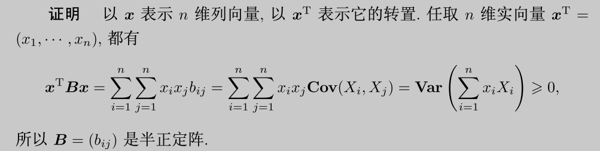

- ## 预备知识
  collapsed:: true
	- [[多变量微积分]]
	- [[矩阵论]]
	- [[概率论]]
	- [[数理统计]]
	- [[R]]
- ## 矩阵补充知识
	- ### 特殊矩阵
	- 1. 对称矩阵：$A = A^{T}$，
	- 性质
	  background-color:: #49767b
	- 不同特征值的特征向量相互正交（定义证明），
	- 相似对角化定理 $\to$ 谱分解定理，
	- 1.1 二次型：二次齐次函数（多项式），
	- 对称矩阵的性质
	  background-color:: #49767b
	- 规定二次型的矩阵为对称矩阵，所以具有对称矩阵的性质，
	- 二次型都可转化为标准型（正交对角化），且都有唯一的规范型，
	- 正定性
	  background-color:: #49767b
	- 非负定矩阵的特征值均非负，而正定矩阵的特征值均为正，
	- 正定矩阵的逆矩阵也是正定矩阵，
	- 正定矩阵的任意子阵都为正定矩阵，
	- 正定矩阵有唯一的楚列斯基分解，$A = LL^{T}$，
	-
	- 2. 投影矩阵（Projection）：$A = A^{T} = A^{2}$，
	- 性质
	  background-color:: #49767b
	- 若A为投影矩阵，则I - A也为投影矩阵，
	- 投影矩阵的特征值只可能为1或0，
		- 推导：|A|只可能为1或0；若rank(A) = r，则A有r个特征值为1，
	- 若A，B均为投影矩阵，则(A + B)为投影矩阵的充要条件为AB = 0，
	- 将A分块；若$\begin{pmatrix} A_{11} & A_{12} \\ A_{21} & A_{22}\end{pmatrix} \ge \square$且A_{22}可逆，则$A_{11.2} \ge \square$，
	-
	- 3. 高矩阵H：对于非方阵的普通矩阵，称*列*满秩的矩阵为“高矩阵”，
	- 性质
	  background-color:: #49767b
	- 若$X \ne \square$，则$HX \ne \square$，
	- 必存在高矩阵H2，使得(H, H2)为可逆矩阵，
	- 必存在高矩阵H2，使得$H_{2}^{T}H = I$，
	- 若A为正定阵，则$H^{T}AH$也为正定阵，但$HAH^{T}$则不一定，
	- 若A为非负定阵，则A必有分解$A = HH^{T}$，
	-
	- ### 运算
	- 1. 行列式与迹
	-
	- 2. 分块矩阵运算
	- 基本规则类似于普通矩阵，
	- 对于基本分块方式$\begin{pmatrix} A_{11} & A_{12} \\ A_{21} & A_{22}\end{pmatrix}$，
	- 逆矩阵
	  background-color:: #49767b
	- $\begin{pmatrix} A_{11} & A_{12} \\ A_{21} & A_{22}\end{pmatrix}^{-1} = \begin{pmatrix} A_{11}^{-1} & 0 \\ 0 & 0 \end{pmatrix} + \begin{pmatrix} A_{11}^{-1}A_{12}  \\ -I \end{pmatrix}A_{22.1}^{-1}\begin{pmatrix} A_{21}A_{11}^{-1} & -I \end{pmatrix}$，
	- $\begin{pmatrix} A_{11} & A_{12} \\ A_{21} & A_{22}\end{pmatrix}^{-1} = \begin{pmatrix} 0 & 0 \\ 0 & A_{22}^{-1} \end{pmatrix} + \begin{pmatrix} -I  \\  A_{22}^{-1}A_{21}\end{pmatrix}A_{11.2}^{-1}\begin{pmatrix} -I &  A_{12}A_{22}^{-1}\end{pmatrix}$，
	- $A_{11.2} = A_{11} - A_{12}A_{22}^{-1}A_{21}$，
	- $A_{22.1} = A_{22} - A_{21}A_{11}^{-1}A_{12}$，
	- @推导
	- 一般用于多元正态的协差阵的分解，
	- 行列式
	  background-color:: #49767b
	- $\begin{pmatrix} I & 0 \\ -A_{21}A_{11}^{-1} & I \end{pmatrix}\begin{pmatrix} A_{11} & A_{12} \\ A_{21} & A_{22}\end{pmatrix}\begin{pmatrix} I & -A_{11}^{-1}A_{12} \\0 & I \end{pmatrix} = \begin{pmatrix} A_{11} & 0 \\ 0 & A_{22.1}\end{pmatrix}$，
	- 若方阵A11可逆，则$|A| = |A_{11}|\cdot |A_{22.1}|$；
	- 类似，若方阵A22可逆，也可推得$|A| = |A_{22}|\cdot |A_{11.2}|$；
	-
	- 3. Kronecker积
	- 矩阵$A_{n*p}$，$B_{m*q}$；定义A，B的Kronecker积为一个mn行，pq阶矩阵，
	- 记为$A \otimes B = \begin{pmatrix} a_{11}B & a_{12}B & \cdots & a_{1p}B \\a_{21}B & a_{22}B &  \cdots & a_{2p}B \\ \vdots & \vdots & & \vdots \\ a_{n1}B & a_{n2}B & \cdots & a_{np}B \\ \end{pmatrix}$，
	- 性质
	  background-color:: #49767b
	- 分配律，没有交换律，
	- $(A \otimes B)^{T} = A^{T} \otimes B^{T}$，
	- $(A \otimes B)^{-1} = A^{-1} \otimes B^{-1}$，
	- $(A_{1} \otimes B_{1})(A_{2} \otimes B_{2}) = (A_{1}A_{2}) \otimes (B_{1}B_{2})$，
	- 若A为p阶方阵，B为q阶方阵，则$|A \otimes B| = |A|^{q}|B|^{p}$，
	-
	- 4. 拉直运算
	  按列（按行）将矩阵组合为一个向量，
	- 默认按列进行拉直运算，即$\text{Vec}(X) =  \begin{pmatrix} X_{11} & X_{21} & \cdots & X_{n1} & \cdots & X_{1p} & X_{2p} & \cdots & X_{np}\end{pmatrix}$，
	- 也可写为按行拉直的形式，即$\text{Vec}(X^{T}) =  \begin{pmatrix} X_{11} & X_{12} & \cdots & X_{1p} & \cdots & X_{n1} & X_{n2} & \cdots & X_{np}\end{pmatrix}$，
	-
	- 对称矩阵的拉直
	- 由于对称矩阵的上，下三角元素是重复（相关）的，所以一般只将*下三角*的元素写入拉直的向量，
	- 即对于$S = \begin{pmatrix} S_{11} &   \\S_{21} & S_{22} \\ \vdots & \vdots &  \\ S_{p1} & S_{p2} & \cdots & S_{pp} \\ \end{pmatrix}$，
	- $\text{SVec}(S) =  \begin{pmatrix} s_{11} & s_{21} & \cdots & s_{p1}  & s_{22}& \cdots & s_{p2} & \cdots & s_{pp}\end{pmatrix}$，
	-
	- ### 变换
	- 同时对角化定理
	  background-color:: #49767b
	- 设A，B均为n阶对称矩阵，且$\Lambda_{1} = P_{1}^{T}AP_{1}，\Lambda_{2} = P_{2}^{T}BP_{2}$，
	- 则有$P_{1} = P_{2} \leftrightarrow AB=BA$，
	-
	- ### 矩阵求导
	- 梯度
	- Hessian矩阵
	- @矩阵求导
	- 最优化
-
- ## 多维随机变量
  collapsed:: true
	- ### 随机向量与随机矩阵
	- 类似一元随机变量，
	- 称定义在*同一概率空间*上的p个随机变量为一个随机向量，一般表示为*列向量*的形式，
	- 即$\vec{X} = \begin{pmatrix} X_1 & X_2 & \cdots & X_n \end{pmatrix}$，
	- 称定义在同一概率空间上的p*n个随机变量（或n个随机向量）为一个随机矩阵，
	- 即$\mathbf{X} = \begin{pmatrix} X_{11} & X_{12} & \cdots & X_{1n} \\X_{21} & X_{22} & \cdots & X_{2n} \\ \vdots & \vdots & & \vdots \\ X_{p1} & X_{p2} & \cdots & X_{pn} \\ \end{pmatrix}$，
	- 一般将矩阵X拉直后再进行分析，即其分布为pn个随机变量组成的*pn维*分布，
	-
	-
	- ### 总体与样本
	- 1. 引入：一维总体
	- 对于单一总体X和多个样本x_{i}，
	- 可以直接列出所有样本$x_{1}，x_{2}…，x_{n}$，并利用每个样本（标量）进行计算，
	- 为了便于数学计算，也可以利用向量来表示多个样本，如$\vec{X} = \begin{pmatrix}x_1 & x_2 & ... & x_n \end{pmatrix} ^T$，
	-
	- 2. 多维总体
	- 总体
	  background-color:: #49767b
	- *p维*随机向量$\vec{X} = \begin{pmatrix} X_1 & X_2 & \cdots & X_p\end{pmatrix}^{T}  \sim N_{p}(\mu, \Sigma)$，
	- 样本
	  background-color:: #49767b
	- 一个*p维*随机样本：$\vec{X_{i}} = \begin{pmatrix} X_{i1} & X_{i2} & \cdots & X_{ip} \end{pmatrix}^{T}$，
	- 一般将所有*n组*样本写为矩阵的形式，
	- 即$\mathbf{X} = \begin{pmatrix} X_{1} & X_{2} & \cdots & X_{n} \end{pmatrix}_{n*p} = \begin{pmatrix} x_{11} & x_{21} & ... & x_{n1}  \\x_{12} & x_{22} & ... & x_{n2}  \\ \vdots & \vdots & \vdots & \vdots  \\ x_{1p} & x_{2p} & ... & x_{np} \\ \end{pmatrix}$，
	-
	- ### 多元数字特征
	- [[数字特征]]
	- collapsed:: true
	  1. 多元期望：对每个随机变量取期望，
	  $E \vec{X} = E\begin{pmatrix}X_1 & X_2 & … & X_n \end{pmatrix}^{T} = \begin{pmatrix}EX_1 & EX_2 & … & EX_n \end{pmatrix}^{T}$，
		- 期望是求解数字特征的基础，
		- 所以多元数字特征一般指对*每个分量*分别求数字特征，
	- 随机变量*函数*的期望$\mathbb{R}^{n} \rightarrow \mathbb{R}^{k}$
	  collapsed:: true
		- 示例：对于函数Z = g(X, Y)，$E[g(X, Y)] = \sum\limits_{x \in S_X} \sum\limits_{y \in S_Y} g(x, y) p_{X Y}(x, y) = EZ$（标量），
	- 期望的性质
	  background-color:: #49767b
	- 类似一元期望的性质，此处A，B都为常数矩阵，
	- $E(AXB) = A\cdot EX \cdot B$，
	- $E(X + Y) = EX + EY$，
	-
	- collapsed:: true
	  2. 自协方差阵：对于随机*向量*X，称Cov (X, X) = E[X - EX][X - EX]^{T}为X的自协方差阵，
		- 由于随机向量的各个分量之间可能存在交互作用，
		- 所以对于X的自方差-协方差阵，也使用协方差“Cov”的记号，而不使用“Var”，
		- 有时也使用D(X)表示，
	- 3. 互协方差阵：对于随机向量X，Y，称Cov (X, Y) = E[X - EX][Y - EY]^{T}为X，Y的互协方差阵，
	- 4. 标准差矩阵：*定义*随机向量X的标准差矩阵为*对角矩阵*$V^{1/2} = \text{diag}(\sqrt{\text{Var}X_{1}}, \sqrt{\text{Var}X_{2}}, \cdots, \sqrt{\text{Var}X_{n}})$，
	- 具体计算
	  background-color:: #49767b
	  collapsed:: true
		- $\text{Cov}[X, X] = E(\vec{X} - \vec{EX})_{n*1}(\vec{X} - \vec{EX})^{T}_{1 * n}$，
		- $= E\begin{pmatrix} (X_{1} - \mu_{1})^{2} & (X_{1} - \mu_{1})(X_{2} - \mu_{2}) & \cdots & (X_{1} - \mu_{1})(X_{n} - \mu_{n}) \\(X_{2} - \mu_{2})(X_{1} - \mu_{1}) & (X_{2} - \mu_{2})^{2} & \cdots & (X_{2} - \mu_{2})(X_{n} - \mu_{n}) \\ \vdots & \vdots & & \vdots \\ (X_{n} - \mu_{n})(X_{1} - \mu_{1}) & (X_{n} - \mu_{n})(X_{2} - \mu_{2}) & \cdots & (X_{n} - \mu_{n})^{2} \\ \end{pmatrix}$
		- 即$\begin{pmatrix} \operatorname{Cov}[X_1, X_1] & \operatorname{Cov}[X_1, X_2] & ... & \operatorname{Cov}[X_1, X_n] \\\operatorname{Cov}[X_2, X_1] & \operatorname{Cov}[X_2, X_2] & ... & \operatorname{Cov}[X_2, X_n] \\ \vdots & \vdots & & \vdots \\ \operatorname{Cov}[X_n, X_1] & \operatorname{Cov}[X_n, X_2] & ... & \operatorname{Cov}[X_n, X_n] \\ \end{pmatrix}$，
		- 由协方差的定义，其对角线元素实际上为方差$\operatorname{Var}[X_i]$，
	- 协差阵的矩阵性质
	  background-color:: #49767b
	- $\Sigma=\Sigma^T$，$\Sigma \geq \square$，
	  collapsed:: true
		- 
	- $\Sigma = L^{2}$，即$\Sigma$可以分解为非负定矩阵的平方，
	  collapsed:: true
		- 由于$\Sigma$为对称矩阵，所以一定存在正交矩阵$\Gamma$使得$\Sigma = \Gamma \Lambda \Gamma^{T}$，
		- 由于$\Sigma$为半正定矩阵，所以$\Lambda$可以拆分为其平方根的乘积，即$\Lambda = \Lambda^{1/2}\Lambda^{1/2}$，
		- 所以，有$\Sigma = \Gamma\Lambda^{1/2}\Gamma^{T} \cdot \Gamma\Lambda^{1/2}\Gamma^{T} = L^{2}$，
	- $\Sigma = AA^{T}$，对称方阵的Cholesky分解，
	  collapsed:: true
		- 同理，由于$\Sigma$为对称矩阵，所以一定存在正交矩阵$\Gamma$使得$\Sigma = \Gamma \Lambda \Gamma^{T}$，
		- 再将$\Lambda$拆分为其平方根的乘积，即$\Lambda = \Lambda^{1/2}\Lambda^{1/2}$，
		- 因此，有$\Sigma = \Gamma\Lambda^{1/2}(\Lambda^{1/2})^{T} \Gamma^{T} = \Gamma\Lambda^{1/2}({\Gamma\Lambda}^{1/2})^{T} = AA^{T}$，
	- 标准差矩阵V一定可逆（方差的非负性），
	- 协差阵的运算性质
	  background-color:: #49767b
	- $\text{Cov}[AX + B] = A \cdot \text{Cov}[X] \cdot A^{T}$，
	- $\text{Cov}[X, Y] = E[XY^{T}] - [EX][EY^{T}]$，
	- $\text{Cov}[AX, BY] = A \cdot \text{Cov}[X, Y] \cdot B^{T}$，
	- $\text{Cov}[aX + bY, cU + dV] = ad \cdot \text{Cov}[X, U] + ae \cdot \text{Cov}[X, V] + bd \cdot \text{Cov}[Y, U] + be \cdot \text{Cov}[Y, V]$，
	-
	- 5. 自相关系数矩阵：定义（标量）${\rho}_{ij} = \dfrac{\text{Cov}[X_{i}, X_{j}]}{\sqrt{\text{Var}X_{i}}\sqrt{\text{Var}X_{j}}}$，称R = (\rho_{ij})为X的自相关系数矩阵，
	- 性质
	  background-color:: #49767b
	- 相关系数矩阵为非负定（对称）矩阵，
	- $\text{Cov}[X, X] = V^{1/2}RV^{1/2}，R = V^{-1/2}\text{Cov}[X, X] V^{-1/2}$，
	-
	- 6. 多元特征函数
	- 矩阵形式的特征函数
	  background-color:: #49767b
	- 定义矩阵T为与n组样本同阶（p*n）的（实变量）矩阵，
	- 即$T = \begin{pmatrix} t_{11} & t_{12} & \cdots & t_{1n} \\t_{21} & t_{22} & \cdots & t_{2n} \\ \vdots & \vdots & & \vdots \\ t_{p1} & t_{p2} & \cdots & t_{pn} \\ \end{pmatrix}$，
	- 则pn维特征函数$\varphi(T) = E[\exp(i\sum\limits_{i =1}^{p}\sum\limits_{j=1}^{n}t_{ij}X_{ij})] = E[\exp(i \cdot \text{tr}(T^{T}X))]$，
	-
	- ### 联合分布与边缘分布
	-
	- ### 条件分布与独立性
	- 类似一元情况，设X，Y为随机向量，
	- 若X，Y独立，则有$\text{Cov}(X, Y) = \square$，
	- 同理，若$\text{Cov}(X, Y) = \square$，则称X，Y不相关；但不能说明X，Y一定独立，
-
- ## 正态性检验
  collapsed:: true
	- 基本思路是从*次序统计量*的角度进行分析，
	- ### 一元分布的评估
	- 1. 边缘分布
	- 多元正态分布的每个边缘分布都是正态分布，
	- 反之不能成立，所以一元检验主要用于反证，
	-
	- 2. W检验（小样本）与D检验（大样本）
	- 假设
	  background-color:: #49767b
	- 希望检验总体X是否为（一维）正态分布，此处分布的参数可以未知，
	- 即$H_{0}：X \sim N(\mu, \sigma^{2})$，
	- 检验模型
	  background-color:: #49767b
	- 计算标准正态分布N(0, 1)的次序统计量m_{i}，可知m_{i}与X的具体分布参数无关，
	  collapsed:: true
		- m_{i}的值需要根据*样本数*n来具体计算，
	- 如果X为正态分布，则根据正态分布的性质，样本X_{i}对应的次序统计量X_{(i)}应该与m_{i}为（近似）线性关系，即只相差一个误差项，
	- 可以写为$X_{(i)} = \mu + \sigma m_{i} + e_{i}$，
	- 检验统计量与拒绝域
	  background-color:: #49767b
	  collapsed:: true
		- 一般通过（线性）相关系数来判断两组数值是否为线性关系，
		- ，
		- ，
	- 拒绝域
	  background-color:: #49767b
	- H_{0}成立的条件下，两者应存在线性关系，即相关系数统计量应接近于1，
	- 所以拒绝域为{$W_{n} \le W_{\alpha}$}，
	-
	- 3. Q-Q图（分位数-分位数图）
	- 将样本数据*标准化*后，按大小依次排列，作为Y轴，
	- （根据样本量）选择标准正态分布N(0, 1)的分位数，作为X轴，
	  collapsed:: true
		- 连续性修正：计算标准正态的分位数时，一般选择$P(Z \le q_{(j)}) = \dfrac{j - \frac{1}{2}}{n}$，
	- 将两组数据列在图上，若图形近似于直线，则样本的分布近似于正态分布，
	- 检验统计量
	  collapsed:: true
		- 类似W检验，同样通过（线性）相关系数来判断两组数值是否为线性关系，
		- ，
	-
	- ### 二元分布的评估@
	- 检验模型
	  background-color:: #49767b
	- 大样本性质：若$\vec{X} \sim N_{p}(\mu, \Sigma)$，则$n(\bar{\mathbf{X}} - \mu)^{T}S^{-1}(\bar{\mathbf{X}} - \mu) \stackrel{P} {\rightarrow} \chi^{2}_{p}$，
	- 如果$\vec{X}$为正态分布，则统计量$n(\bar{\mathbf{X}} - \mu)^{T}S^{-1}(\bar{\mathbf{X}} - \mu)$应该近似为卡方分布，
	- 检验统计量
	  background-color:: #49767b
	- 称$d_{j}^{2} = (\vec{x_{j}} - \bar{\mathbf{X}})^{T}S^{-1}(\vec{x_{j}} - \bar{\mathbf{X}})，j = 1,2,\cdots, n$为一个广义距离，
	-
	- ### 正态性变换@
-
- 多元正态分布
  collapsed:: true
	- [[矩阵论]]
	- 定义
	  collapsed:: true
		- 标准多元正态$N(0, I)$
		  collapsed:: true
			- 标准n元正态可以拆分为n个标准正态分布的乘积，
			- 分布函数
			  collapsed:: true
				- $f(z_{1}, z_{2}, \ldots, z_{n})={(2 \pi)^{-\frac{n}{2}}} {e}^{-\frac{1}{2}{z}^{T}I^{-1}{z}}$，
				- 正则性：$\int_{R}…\int_{R} f(\vec{z}) dz_{1}…dz_{n} = \int_{{\mathbb{R}}^{n}}  f(\vec{z}) dz^{n} = \prod \int_{R}f(z_{i}) dz_{i} = 1$，
			- 数字特征
			  collapsed:: true
				- $E\vec{Z} = \vec{0}$，
				  collapsed:: true
					- $E{Z}_{i} = \int_{R}z_{i}f(z_{i}) dz_{i} = 0$，
				- $\operatorname{Var} \vec{Z} = I$，
				  collapsed:: true
					- $\operatorname{Var} \vec{X} = E(\vec{Z} - \vec{0})(\vec{Z} - \vec{0})^{T} = E[\vec{Z} \vec{Z}^{T}]$，
					- $=E\begin{pmatrix} z_{1}^{2} & z_{1}z_{2} & \cdots & z_{1}z_{n} \\z_{2}z_{1} & z_{2}^{2} & \cdots & z_{2}z_{n} \\ \vdots & \vdots & & \vdots \\ z_{n}z_{1} & z_{n}z_{2} & \cdots & z_{n}^{2} \\ \end{pmatrix} = I$ ，
					- $Ez_{i}z_{j} = Ez_{i} \cdot Ez_{j} = 0，Ez_{i}^{2} = \int_{R}z_{i}^{2}f(z_{i}) dz_{i} = 1$，
		- 多元正态分布$N(\mu, {\Sigma})$
		  collapsed:: true
			- 定理：若$\vec{Z} \sim N(0, I)$，则$\vec{X} = {\Sigma}^{\frac{1}{2}}\vec{Z} + \vec{\mu} \sim N(\vec{\mu}, \Sigma)$，其中|\Sigma| \ne 0，
			  collapsed:: true
				- 反之，若$\vec{X} \sim N(\vec{\mu}, \Sigma)$，则$Z = {\Sigma}^{-\frac{1}{2}}{(\vec{X} - \vec{\mu})} \sim N(0, I)$，
				- 类似一元正态分布，若$X \sim N(0, 1)，\sigma X + \mu \sim N(\mu, \sigma^{2})$；所以此处变换的矩阵为${\Sigma}^{\frac{1}{2}}$，
				- 也可写为$\vec{X} = A\vec{Z} + \vec{\mu} \sim N(\vec{\mu}, AA^{T})$，$AA^{T} = \Sigma$（对称方阵的Cholesky分解），
			- 分布函数
			  collapsed:: true
				- $f(x_{1}, x_{2}, \ldots, x_{n})={(2 \pi)^{-\frac{n}{2}}}|\Sigma|^{-\frac{1}{2}} \exp [-\frac{1}{2}(\vec{x}-\vec{\mu})^{T} \Sigma^{-1}(\vec{x} - \vec{\mu})]$，
				  collapsed:: true
					- $f(z_{1}, z_{2}, \ldots, z_{n})={(2 \pi)^{-\frac{n}{2}}} {e}^{-\frac{1}{2}{z}^{T}I^{-1}{z}}$，
					- $\vec{X} = {\Sigma}^{\frac{1}{2}}\vec{Z} + \vec{\mu} \to \vec{Z} = {\Sigma}^{-\frac{1}{2}}(\vec{X} - \vec{\mu})$，
					- 变换的Jacobian矩阵为$J_{Z \to X} = \dfrac{1}{J_{X \to Z}}$，而$J_{X \to Z}= |{\Sigma}|^{\frac{1}{2}}$，
					-
				- 支集：$\vec{X} \in \mathbb{R}^{n}$，其中$\vec{X} = \begin{pmatrix}X_1 & X_2 & ... & X_n \end{pmatrix} ^T$，
				- 参数
				  collapsed:: true
					- $\vec{\mu} \in \mathbb{R}^{n}$，其中$\vec{\mu} = \begin{pmatrix}\mu_{1} & \mu_{2} & ... & \mu_{n} \end{pmatrix} ^T$
					- \Sigma为方差-协方差矩阵，为半正定对称矩阵（应注意pdf中为\Sigma^{-1}），
					- |\Sigma|为方差-协方差矩阵的行列式（标量），（应注意pdf中为|\Sigma|^{-1/2}）
				- 特例
				  collapsed:: true
					- 所有分量独立同方差
					  collapsed:: true
						- 此时$\Sigma^{-1} =  \begin{pmatrix} \frac{1}{{\sigma}^{2}} & & \\ &\ddots & \\ & & \frac{1}{{\sigma}^{2}} \\ \end{pmatrix} = \dfrac{1}{{\sigma}^{2}}I$，
						- 分布函数为$f(\vec{x})={(2 \pi)^{-\frac{n}{2}}}{\sigma}^{-n} \exp [-\frac{1}{2{\sigma}^{2}}(\vec{x}-\vec{\mu})^{T} (\vec{x} - \vec{\mu})]$，
			- 数字特征
			  collapsed:: true
				- $E\vec{X} = \vec{\mu}$
				  collapsed:: true
					- $E\vec{X} = E({\Sigma}^{\frac{1}{2}}\vec{Z} + \vec{\mu}) = {\Sigma}^{\frac{1}{2}}E(\vec{Z}) + E(\vec{\mu}) = \vec{\mu}$，
				- $\operatorname{Var} \vec{X} = \Sigma$
				  collapsed:: true
					- $\operatorname{Var} \vec{X} = E(\vec{X} - \vec{\mu})(\vec{X} - \vec{\mu})^{T}$，
					- $= E({\Sigma}^{\frac{1}{2}}\vec{Z} + \vec{\mu} - \vec{\mu})({\Sigma}^{\frac{1}{2}}\vec{Z} + \vec{\mu} - \vec{\mu})^{T}$，
					- $= E({\Sigma}^{\frac{1}{2}}\vec{Z})({\Sigma}^{\frac{1}{2}}\vec{Z})^{T} = E({\Sigma}^{\frac{1}{2}}\vec{Z} \vec{Z}^{T}{{\Sigma}^{\frac{1}{2}}}^{T}) = \Sigma$，
			- 特例：二元正态分布
			  collapsed:: true
				- 均值向量$\vec{\mu} = \begin{pmatrix}\mu_{1} & \mu_{2}\end{pmatrix} ^T$
				- 相关系数${\rho} = \dfrac{\operatorname{Cov}[X, Y]}{\sqrt{\operatorname{Var}X}\sqrt{\operatorname{Var}Y}}$，
				- 方差-协方差矩阵$\Sigma = \begin{pmatrix} {\sigma}_{1}^{2} & \rho{\sigma}_{1}{\sigma}_{2} \\ \rho{\sigma}_{2}{\sigma}_{1} & {\sigma}_{2}^{2}  \\ \end{pmatrix}$，
				- 行列式$|\Sigma| = (1 - {\rho}^{2}) {\sigma}_{1}^{2}{\sigma}_{2}^{2}$，
				- 所以${\Sigma}^{-1} = \dfrac{1}{(1 - {\rho}^{2}){\sigma}_{1}^{2}{\sigma}_{2}^{2} }\begin{pmatrix} {\sigma}_{2}^{2} & -\rho{\sigma}_{1}{\sigma}_{2} \\ -\rho{\sigma}_{2}{\sigma}_{1} & {\sigma}_{1}^{2}  \\ \end{pmatrix}$，$|\Sigma|^{-\frac{1}{2}} = \dfrac{1}{\sqrt{1 - {\rho}^{2}} {\sigma}_{1}{\sigma}_{2}}$，
				- 密度等高椭圆曲线
					- 二元正态分布的指数部分为一个二次型；由于$\Sigma$正定，所以其图形为一个椭圆，
					- 具体函数为$-\dfrac{1}{2(1-\rho^{2})}[(\dfrac{x - \mu_{X}}{\sigma_{X}})^{2} - 2\rho(\dfrac{x - \mu_{X}}{\sigma_{X}})(\dfrac{y - \mu_{Y}}{\sigma_{Y}}) + (\dfrac{y - \mu_{Y}}{\sigma_{Y}})^{2}]$，
		- 特征函数
		  collapsed:: true
			- 概述
			  collapsed:: true
				- 多元情况下的分布函数较为复杂，难以分析，
				- 因此一般基于*特征函数*分析随机向量的性质，
				- 特征函数的关键在于*随机变量X*的形式，应*改变t*的形式以“凑”随机变量，
					- 对于$\varphi_{X}(t) = E[e^{itX}] = f(t)$，
					- 可尝试将随机变量Y写为：$tY = tg(X) = h(t)X$（理想情况，应根据具体函数，综合其它变换方法），
					- 则$\varphi_{Y}(t) = E[e^{itY}] = E[e^{ih(t)X}] = f[h(t)]$，
			- 标准多元正态：$\varphi_Z(\vec{t}) = e^{- \frac{1}{2} {\vec{t}}^{T}{\vec{t}}}$
			  collapsed:: true
				- $\varphi_Z(\vec{t}) = E[e^{i\vec{t}^{T}\vec{Z}}] = E[e^{\sum \limits _{j = 1}^{n}{it_{j}Z_{j}}}] = E[\prod \limits _{j = 1}^{n}e^{it_{j}Z_{j}}] = \prod \limits _{j = 1}^{n}E[e^{it_{j}Z_{j}}]$：Zi独立同分布，
				- $E[e^{it_{j}Z_{j}}] = e^{-\frac{1}{2}t_{j}^{2}}$：一维标准正态的特征函数，
				- $\varphi_Z(\vec{t}) = \prod \limits _{j = 1}^{n}e^{-\frac{1}{2}t_{j}^{2}} = e^{\sum \limits _{j = 1}^{n}{-\frac{1}{2}t_{j}^{2}}} = e^{- \frac{1}{2} {\vec{t}}^{T}{\vec{t}}}$：指数的性质，
			- 多元正态：$\varphi_X(\vec{t}) = e^{i{\vec{t}}^{T}\vec{\mu} - \frac{1}{2} {\vec{t}}^{T}{\Sigma}{\vec{t}}}$，$\Sigma \ge 0$，
			  collapsed:: true
				- $\varphi_X(\vec{t}) = E[e^{i\vec{t}^{T}\vec{X}}] = E[e^{i\vec{t}^{T}({\Sigma}^{\frac{1}{2}}\vec{Z} + \vec{\mu})}]$：多元正态的变换，
				- $= e^{i{\vec{t}}^{T}\vec{\mu}} \cdot E[e^{i\vec{t}^{T}({\Sigma}^{\frac{1}{2}}\vec{Z})}]$：均值向量为常量，
				- $= e^{i{\vec{t}}^{T}\vec{\mu}} \cdot E[e^{i(\vec{t}^{T}{\Sigma}^{\frac{1}{2}})\vec{Z}}]$：凑一元正态的形式，
				- $= e^{i{\vec{t}}^{T}\vec{\mu}} \cdot e^{-\frac{1}{2}(\vec{t}^{T}{\Sigma}^{\frac{1}{2}})(\vec{t}^{T}{\Sigma}^{\frac{1}{2}})^{T}}$，
				- $= e^{i{\vec{t}}^{T}\vec{\mu} - \frac{1}{2} {\vec{t}}^{T}{\Sigma}{\vec{t}}}$，
	- 多元正态分布的变换
		- 线性变换
		  collapsed:: true
			- 多元正态分布的线性变换也为多元正态分布，
			- 定理：若$\vec{X} \sim N(\vec{\mu}, {\Sigma})$，A为*n阶方阵*，则$\vec{Y}_{n*1} = A_{n*n}\vec{X}_{n*1} \sim N(A\vec{\mu} , A{\Sigma}{A}^{T})，(|A| \neq 0)$，
			  collapsed:: true
				- 由于变换为一一变换，因此可类比一元变换求证，
				- 可知$P(\vec{Y} < \vec{y}) = P(A\vec{X} < \vec{y}) = P(\vec{X} < A^{-1}\vec{y})$，
				- 变换的雅可比行列式为|A^{-1}|，
				- 带入X的分布函数$f(\vec{X})={(2 \pi)^{-\frac{n}{2}}}|\Sigma|^{-\frac{1}{2}} \exp (-\frac{1}{2}(x-\mu)^{T} \Sigma^{-1}(x-\mu))$，即可得到结果，
			- 特例：若$\vec{X} \sim N(\vec{\mu}, {\Sigma})，c \in \mathbb{R}$，则$\vec{Y}_{n*1} = c\vec{X}_{n*1} \sim N(c\vec{\mu} , c^{2}{\Sigma})$，
			- 定理：若$\vec{X} \sim N(\vec{\mu}, {\Sigma})$，则$\vec{Y} = \vec{X} + \vec{b} \sim N(\vec{\mu} + \vec{b} , {\Sigma})$，
			  collapsed:: true
				- 证明类似上个定理，
		- 分块矩阵
		  collapsed:: true
			- 定理：若$\vec{X} \sim N(\vec{\mu}, {\Sigma})$，其中$\vec{\mu} = (\vec{\mu}_{1},\vec{\mu}_{2})；\Sigma = {\begin{pmatrix} {\Sigma}_{11} & 0 \\ 0 & {\Sigma}_{22}  \\ \end{pmatrix}}$；则$\vec{X}_{i} \sim N(\vec{\mu}_{i}, {\Sigma}_{i})，(i = 1, 2)$，
			- 推广：$\Sigma = {\begin{pmatrix} {\Sigma}_{11} & {\Sigma}_{k} \\ {\Sigma}_{l} & {\Sigma}_{22}  \\ \end{pmatrix}}$时，上述结论仍成立，
		- 边缘分布
			- 多元正态分布的任一边缘分布都为正态分布，
			- 反之，每个分量X_{i}都为一维正态分布，不能说明随机向量X为m维正态分布，
			- 引理：设X为m维随机*向量*，则$X \sim N(\vec{\mu}, \Sigma) \leftrightarrow$对“任意”m维实向量s，都有随机*变量*$Y = s^{T}_{1 * m}X_{m * 1} \sim N(s^{T}\vec{\mu}, s^{T}\Sigma s)$，
			  collapsed:: true
				- （可由特征函数说明）
			- 即随机向量X的各个分量X_{i}的“任意”*线性组合*都为一维正态分布，
		- 退化正态分布
		  collapsed:: true
			- A为n阶方阵（|A| = 0）
			  collapsed:: true
				- 则对于$\vec{X} \sim N(\vec{\mu}, {\Sigma})$，$\vec{Y} = A\vec{X}$*仍为*正态分布$N(A\vec{\mu} , A{\Sigma}{A}^{T})$，
				- 但A的秩为m时，Y的分布退化为m维的正态分布，
				- （Y仍为n维向量，但其秩为m，即其部分分量之间线性相关），
			- A为m*n矩阵(m < n)，其秩为m，
			  collapsed:: true
				- 则对于$\vec{X}_{n} \sim N(\vec{\mu}, {\Sigma})$，$\vec{Y}_{m} = A\vec{X}$*仍为*正态分布，
				- 其分布为$N(A\vec{\mu} , A{\Sigma}{A}^{T})$，
			- （可由特征函数证明）
		- 独立性
			- 二元情况
			  collapsed:: true
				- 定理：多元正态分布的线性组合仍为正态分布，且协方差为0等价于独立，
				- 多个独立的正态分布具有可加性，且其线性组合仍为正态分布，且协方差为0等价于独立，
				- 不独立的正态分布没有可加性，且其联合分布不一定为正态分布，
			- 多元情况
			  collapsed:: true
				- 若$\vec{X}_{n} \sim N(\vec{\mu}, {\Sigma})$，则$X_{1}, X_{2},…, X_{n}$相互独立的充要条件为方差-协方差矩阵\Sigma为对角矩阵（即协方差项都为0），
				  collapsed:: true
					- 可由联合密度$f(x_{1}, x_{2}, \ldots, x_{n})={(2 \pi)^{-\frac{n}{2}}}|\Lambda|^{-\frac{1}{2}} \exp (-\frac{1}{2}(x-\mu)^{T} \Lambda^{-1}(x-\mu))$看出，
				- 推论：若$\vec{X}_{n} \sim N(\vec{\mu}, {\Sigma})$，则一定存在正交变换（矩阵）Q，使变换后的$\vec{Y} = Q\vec{X}$的各个分量相互独立，
				  collapsed:: true
					- 证明：由于\Sigma为实对称矩阵，因此必定存在正交矩阵Q，使$Q^{T}\Sigma Q = \Lambda$，
				- 推论：若$\vec{X}_{n} \sim N(\vec{\mu}, {\Sigma})$，且分量X_{i}独立*同方差*，则正交变换后的向量$\vec{Y} = Q\vec{X} \sim N(Q\vec{\mu}, {\Sigma})$，即Y_{i}仍独立同方差，
				  collapsed:: true
					- 实际上，X_{i}独立同方差时，方差-协方差矩阵$\Sigma =  \begin{pmatrix}{\sigma}^{2} & & \\ &\ddots & \\ & & {{\sigma}^{2}} \\ \end{pmatrix} = {{\sigma}^{2}}I$，
					- 因此，由正交矩阵的性质，可得$Q \Sigma Q^{T} = {{\sigma}^{2}}I$，
	- 多元正态变量的条件分布与独立性
	  collapsed:: true
		- 矩阵的分块
		  collapsed:: true
			- $\vec{X} = \begin{pmatrix} X^{(1)}_{r} \\  X^{(2)}_{p - r} \end{pmatrix}$，
			- $\vec{\mu} = \begin{pmatrix} \mu^{(1)} \\  \mu^{(2)} \end{pmatrix}$，$\Sigma = \begin{pmatrix}\Sigma_{11}{(r*r)} & \Sigma_{12} \\\Sigma_{21} & \Sigma_{22}{(p-r)*(p-r)} \\\end{pmatrix}_{p*p}$，
		- 定理（独立性）
		  collapsed:: true
			- 将p维正态分布向量X分块后，$X^{(1)}，X^{(2)}$相互独立$\leftrightarrow \Sigma_{12} = 0$，
			  collapsed:: true
				- 由于$\Sigma$为对称矩阵，所以$\Sigma_{21} = \Sigma_{12}^{T} = 0$，
			- 推论：将p维正态分布向量X分为k个部分后，$X^{(1)}, X^{(2)}, \cdots X^{(k)}$相互独立$\leftrightarrow \forall i \ne j，\Sigma_{ij} = 0$（即协方差矩阵为分块对角矩阵$\begin{pmatrix} \Sigma_{1} & & & \\ & \Sigma_{22} & & \\ & &\ddots & \\ & & &\Sigma_{kk} \\ \end{pmatrix}$），
		- 条件分布
		  collapsed:: true
			- 定理：给定X^{(2)}时，X^{(1)}的条件分布也为正态分布，其分布参数为$N_{r}(\mu^{(1)} +\Sigma_{12}\Sigma_{22}^{-1}(X^{(2)} - \mu^{(2)})，\Sigma_{11} - \Sigma_{12}\Sigma_{22}^{-1}\Sigma_{21})$，
			  collapsed:: true
				- 特例：(X, Y)为二元正态分布
				  collapsed:: true
					- $Y|X \sim N(\mu_{y} + \rho(\dfrac{\sigma_{Y}}{\sigma_{X}}(X - \mu_{x})), \sigma_{Y}^{2}(1 - \rho^{2}))$，
					- 此处$\Sigma_{12} = \Sigma_{21} = \rho\sigma_{X}\sigma_{Y}, \Sigma_{11} = \sigma_{X}^{2}，\Sigma_{22} = \sigma_{Y}^{2}$，
			- 分布的推导
			  collapsed:: true
				- 定义
				  collapsed:: true
					- $f_{1}(X^{(1)}|X^{(2)}) = \dfrac{f(X^{(1)}, X^{(2)})}{f_{2}(X^{(2)})}$，
				- 基本思路
				  collapsed:: true
					- 将X转换为两组*独立*的随机变量Z，然后将Z进行*拆分*，消去分母，
				- 构造线性变换
				  collapsed:: true
					- 设随机向量$Z = \begin{pmatrix}I_{r} & -\Sigma_{12}\Sigma_{22}^{-1} \\ 0 & I_{(p-r)} \\\end{pmatrix}\begin{pmatrix} X^{(1)}_{r} \\  X^{(2)}_{p - r} \end{pmatrix} = BX$，
					- 根据正态分布的变换，可知Z也为p维正态分布，
					- 且$Z \sim N(\begin{pmatrix} \mu^{(1)} +\Sigma_{12}\Sigma_{22}^{-1}\mu^{(2)} \\  \mu^{(2)} \end{pmatrix}, \begin{pmatrix}\Sigma_{11} - \Sigma_{12}\Sigma_{22}^{-1}\Sigma_{21}& 0 \\ 0 & \Sigma_{22} \\\end{pmatrix})$
					- 可知Z_{1}，Z_{2}独立，且Z_{2}等同于X_{2}，
					- 即$g(Z^{(1)}，Z^{(2)}) = g(Z^{(1)})f_{2}(X^{(2)})$，
				- 随机变量的变换
				  collapsed:: true
					- $f(X^{(1)}, X^{(2)}) = g(BX)|J_{Z \to X}| = g(X^{(1)} - \Sigma_{12}\Sigma_{22}^{-1}X^{(2)})f_{2}(X^{(2)})$，
					- 可算得Jacobian行列式|B| = 1，
			- 推论
			  collapsed:: true
				- 由Z的分布可知：$X^{(2)}，X^{(1)} - \Sigma_{12}\Sigma_{22}^{-1}X^{(2)}$独立，
		- 条件数字特征
		  collapsed:: true
			- 条件期望
			  collapsed:: true
				- 由$X^{(1)}|X^{(2)}$的分布可知， 条件期望$E[X^{(1)}|X^{(2)}] = \mu^{(1)} +\Sigma_{12}\Sigma_{22}^{-1}(x^{(2)} - \mu^{(2)})$，也记为$\mu_{1·2}$，
				- 称该条件期望为X^{(1)}对X^{(2)}的“回归”，称矩阵$B = \Sigma_{12}\Sigma_{22}^{-1}$为*回归系数*，
			- 条件协方差矩阵
			  collapsed:: true
				- 由$X^{(1)}|X^{(2)}$的分布可知， 条件协方差矩阵$\Sigma[X^{(1)}|X^{(2)}] = \Sigma_{11} - \Sigma_{12}\Sigma_{22}^{-1}\Sigma_{21}$，也记为$\Sigma_{11·2}$，
			- @偏相关系数
			  collapsed:: true
				- 称给定$X^{(2)}$时，$X_{i}, X_{j}$的偏相关系数为$\rho = \dfrac{\sigma_{ij}}{\sqrt{\sigma_{ii}}{\sqrt{\sigma_{jj}}}}$，
			- 全相关系数
			  collapsed:: true
				- 矩阵的分块
				  collapsed:: true
					- $\vec{X} = \begin{pmatrix} X_{p} \\  y_{1} \end{pmatrix}$，
					- $\vec{\mu} = \begin{pmatrix} \mu_{X} \\  \mu_{y} \end{pmatrix}$，$\Sigma = \begin{pmatrix}\Sigma_{XX}{(p*p)} & \Sigma_{Xy} \\\Sigma_{yX} & \sigma_{y} \\\end{pmatrix}_{(p+1)*(p+1)}$，
				- 对于上述分块，称$R = \sqrt{\dfrac{\Sigma_{yX}\Sigma_{XX}^{-1}\Sigma_{Xy}}{\sigma_{y}}}$为y与X的全相关系数，
			- 最佳预测
			  collapsed:: true
				- 将向量X分块为$\vec{X} = \begin{pmatrix} y_{1} \\  X_{p-1} \end{pmatrix}$，
				- 设$g(X) = E[y|X]$，则对任意函数，都有$E[(y - g(X))^{2}] \le E[(y - \varphi(X))^{2}]$，
				- 即在均方误差最小准则下，g(X)是y的最佳预测函数，
	- 随机矩阵的分布
	  collapsed:: true
		- 随机矩阵
		  collapsed:: true
			- 称$X = \begin{pmatrix} X_{11} & X_{12} & \cdots & X_{1n} \\X_{21} & X_{22} & \cdots & X_{2n} \\ \vdots & \vdots & & \vdots \\ X_{p1} & X_{p2} & \cdots & X_{pn} \\ \end{pmatrix} = \begin{pmatrix} X_1 & X_2 & \cdots & X_n\end{pmatrix}$为一个随机矩阵，
		- @矩阵正态分布
		  collapsed:: true
			- 设$X_{i} = \begin{pmatrix} X_{i1} & X_{i2} & \cdots & X_{ip} \end{pmatrix}^{T} \sim N_{p}(\mu, \Sigma)$为来自p元正态总体的随机样本，
			- 则所有样本可写为随机矩阵$X = \begin{pmatrix} X_1 & X_2 & \cdots & X_n \end{pmatrix}_{n*p}$，
			- 可算得$X \sim N_{np}(1_{n*1} \otimes \mu_{1*p}, I_{n*n} \otimes \Sigma_{p*p})$，
				- 其指数部分的形式为$\begin{pmatrix} X_{1} - \mu & X_{2} - \mu & \cdots & X_{n} - \mu \end{pmatrix}\begin{pmatrix} \Sigma_{1} & & & \\ & \Sigma_{2} & & \\ & &\ddots & \\ & & &\Sigma_{n} \\ \end{pmatrix}\begin{pmatrix} X_{1} - \mu \\X_{2} - \mu \\ \vdots  \\ X_{n} - \mu  \\ \end{pmatrix}$
		- 矩阵正态分布的性质
		  collapsed:: true
			- 设A，B，D为常数矩阵，
			- 则同样有$Z = AXB^{T} + D \sim N_{k*q}(AMB^{T} + D, (AA^{T}) \otimes (B\Sigma B^{T}))$，
- 多元正态分布的统计量
  collapsed:: true
	- 样本的数字特征
	  collapsed:: true
		- 均值向量
		  collapsed:: true
			- $\bar{X}_{p*1} = \dfrac{1}{n}\sum \limits _{i= 1}^{n}\vec{X_{i}} = \dfrac{1}{n}X_{p*n}^{T}\cdot 1_{n*1}$，
		- 样本离差阵
		  collapsed:: true
			- 引入：一元情况
			  collapsed:: true
				- 样本方差$(n - 1){S}^{2} = \sum \limits _{i= 1}^{n}{({X}_{i} - \overline {X})}^{2} = \sum \limits _{i= 1}^{n}{{X}_{i}}^{2} - n \overline {X}^{2}$；
			- $A_{p*p} = \sum \limits _{i= 1}^{n}(X_{i} - \bar{X})(X_{i} - \bar{X})^{T}$，
			  collapsed:: true
				- 可以化简为$A = X^{T}X - n\bar{X}\bar{X}^{T} = X^{T}[I_{n} - \dfrac{1}{n}1_{n}1_{n}^{T}]X$，
				- 设矩阵A的元素为a_{ij}，则$a_{ij} = \sum \limits _{i= 1}^{n}(x_{ai} - \bar{x}_{i})(x_{aj} - \bar{x}_{j})$，i = 1,2, …,p，j = 1,2, …,p ,
		- 样本协方差阵
		  collapsed:: true
			- 称$S = \dfrac{1}{n - 1}A_{p*p}$为样本协方差阵，
			- 设矩阵S的元素为s_{ij}，则其对角线元素$s_{ii} = \sum \limits _{i= 1}^{n}(x_{ai} - \bar{x}_{i})^{2}$，i = 1,2, …,p为变量X_{i}的样本方差，
		- 样本相关矩阵
		  collapsed:: true
			- 称$R = (r_{ij})_{p*p}$为样本相关矩阵，
			- 其元素$r_{ii} = \dfrac{s_{ij}}{\sqrt{s_{ii}}{\sqrt{s_{jj}}}}= \dfrac{a_{ij}}{\sqrt{a_{ii}}{\sqrt{a_{jj}}}}$，i = 1,2, …,p，j = 1,2, …,p，
	- 正态分布的统计量分布
		- 一元分布
			- 非中心χ2分布
			  collapsed:: true
				- 分量独立同方差的情况
				  collapsed:: true
					- 设X为n维向量，且X_{i}独立*同方差*（均值可能不同），则$X \sim N_{n}(\mu, \sigma^{2}I_{n})$，
					- $\mu_{i} = 0$
						- 统计量$\xi = \dfrac{1}{\sigma^{2}}X^{T}X \sim \chi^{2}(n)$，也可写为$X^{T}X \sim \sigma^{2}\chi^{2}(n)$，
						  collapsed:: true
							- 也可写为矩阵形式，即$\xi = X^{T}\Lambda_{{\sigma^{2}}}^{-1}X = X^{T}{\Sigma}^{-1}X \sim \chi^{2}(n)$，
						- 推广：设A为对称矩阵，$\xi = \dfrac{1}{\sigma^2}X^{T}AX \sim \chi^{2}(r) \leftrightarrow$ A为投影阵且rank(A) = r，
							- （证明）
								- 充分性
								  collapsed:: true
									- 矩阵运算
									  collapsed:: true
										- 由于A为对称矩阵，所以可将A对角化，
										- 即$X^{T}AX = X^{T}\Gamma \Lambda \Gamma^{T}X = Y^{T} \Lambda Y$
										- $= \sum\limits_{i=1}^{r}\lambda_{i}\dfrac{1}{\sigma^{2}}Y_{i}^{2}$；rank(A) = r，
									- 特征函数
									  collapsed:: true
										- $\varphi(\xi) = E(\exp[it \sum\limits_{i=1}^{r}\lambda_{i}\dfrac{1}{\sigma^{2}}Y_{i}^{2}]) = E(\prod\limits_{i=1}^{r}\exp[it \lambda_{i}Z_{i}])$，
										- $= \prod\limits_{i=1}^{r}\phi(t\lambda_{i}) = \prod\limits_{i=1}^{r}(1 - 2it\lambda_{i})^{-\frac{1}{2}}$，
										- 由于矩阵A为投影阵且rank(A) = r，所以有$\lambda_{i} = 1$，
										- 因此$\varphi(\xi) = \prod\limits_{i=1}^{r}(1 - 2it)^{-\frac{1}{2}} \sim \chi^{2}(r)$，
								- 必要性
					- $\mu_{i} \ne 0$
					  collapsed:: true
						- 非中心χ2分布
						  collapsed:: true
							- 设随机变量X_{i}之间独立*同方差*，即$\vec{X} \sim N(\vec{\mu_{i}}, I_{n})$，
							- 设统计量$Y = X^{T}X$，则 Y 的分布为自由度为n，非中心参数$\delta = \sqrt{\mu_{i}^{T}\mu_{i}}$的$\chi^{2}$分布，
						- 统计量$\xi = \frac{1}{\sigma^{2}}X^{T}X \sim \chi^{2}(n)$，也可写为$X^{T}X \sim \sigma^{2}\chi^{2}(n)$，
						- 推广：设A为对称矩阵，$\xi = \dfrac{1}{\sigma^2}X^{T}AX \sim \chi^{2}(r, \delta) \leftrightarrow$ A为投影阵且rank(A) = r，非中心参数$\delta = \dfrac{1}{\sigma^2}\mu^{T}A\mu$，
					- 独立性
					  collapsed:: true
						- 定理
						  collapsed:: true
							- 设A为n阶对称矩阵，B为m x n矩阵；
							- 设统计量$Y_{n} = X^{T}AX, Z_{m} = BX$，则BA = 0的充要条件为Y与Z独立，
							- （证明）
							  collapsed:: true
								- 定义
								- 矩阵运算
								  collapsed:: true
									- 对称矩阵的对角化
									- 分块矩阵的运算
									- 变量变换（中间变量）
						- 定理
						  collapsed:: true
							- 设A为n阶对称矩阵，B也为n阶对称矩阵；
							- 设统计量$Y_{n} = X^{T}AX, Z_{n} = X^{T}BX$，则AB = 0的充要条件为Y与Z独立，
				- 一般情况
				  collapsed:: true
					- 设X为n维向量，$X \sim N_{n}(\mu, \Sigma)，(\Sigma > 0)$，
					- 定理：统计量$\xi = X^{T}{\Sigma}^{-1}X \sim \chi^{2}(n, \delta)$，非中心参数$\delta = \mu^{T}{\Sigma}^{-1}\mu$，
					  collapsed:: true
						- （证明）
						  collapsed:: true
							- 矩阵运算
							  collapsed:: true
								- 协差阵的分解
								- 变量变换（消去协差阵）
					- 推广：设A为对称矩阵，统计量$\xi = (X - \mu)^{T}A(X - \mu) \sim \chi^{2}(r) \leftrightarrow \Sigma A\Sigma A\Sigma =\Sigma A\Sigma$，且rank(A) = r，
					  collapsed:: true
						- 特例：rank(A) = n时，条件可以简化为$A\Sigma = I$，即$A = \Sigma^{-1}$，
						- （证明）
						  collapsed:: true
							- 矩阵运算
							  collapsed:: true
								- 协差阵的分解
								- 变量变换
					- （也可以写为$A\Sigma A = A，\Sigma > 0$）
					- 独立性
					  collapsed:: true
						- 定理
						  collapsed:: true
							- 设A为n阶对称矩阵，B也为n阶对称矩阵；
							- 设统计量$Y_{n} = (X - \mu)^{T}A(X - \mu), Z_{n} = (X - \mu)^{T}B(X - \mu)$，则$\Sigma A\Sigma B\Sigma = 0$的充要条件为Y与Z独立，
							- （也可以写为$A\Sigma B = 0，\Sigma > 0$）
			- 非中心t分布
			  collapsed:: true
				- 定义
				  collapsed:: true
					- 设随机变量 Y 为独立的正态分布统计量（分布为N(\delta, 1)）与\chi^{2}分布统计量的比值，
					- 称 Y 的分布自由度为 n ，非中心参数为\delta的非中心 t 分布，
				- 性质
				  collapsed:: true
					- EY$= \delta(\frac{n}{2})^{\frac{1}{2}}\dfrac{\Gamma(\frac{n - 1}{2})}{\Gamma(\frac{n}{2})}(n \ge 2)$
					- VarY$= \dfrac{n(1 + \delta^{2})}{n - 2} - (EY)^{2}(n \ge 3)$
			- 非中心F分布
			  collapsed:: true
				- 定义
				  collapsed:: true
					- 设随机变量 F 为两个独立的\chi^{2}分布统计量的比值，分子为非中心\chi^{2}分布，分母为\chi^{2}分布，
					- 称 X 的分布为自由度为m，n，非中心参数为\delta的 F 分布，
					- 其中m，n分别为分子和分母的\chi^{2}变量自由度，\delta为*分子*的\chi^{2}分布统计量的非中心参数，
		- 多元分布
		  collapsed:: true
			- Wishart分布
			  collapsed:: true
				- 定义（非中心）
				  collapsed:: true
					- 设总体分布为$N_{p}(\mu, \Sigma)$，样本$X_{(i)}$独立同分布，n个样本组成的矩阵为$X_{n*p} = (X_{(1)}, X_{(2)}, \cdots, X_{(n)})^{T}$，
					- 称矩阵统计量$W_{p*p} = \sum\limits_{i=1}^{n}X_{(i)}X_{(i)}^{T} = X^{T}X$的分布为（非中心）Wishart分布，记为$W \sim W_{p}(n, \Sigma, \Delta)$，非中心参数$\Delta_{p*p} = M^{T}M = \mu_{p*1} 1_{1*n}^{T} 1_{n}\mu^{T}$，
					- 推广：样本$X_{(i)}$独立但均值不同，即$X_{i} \sim N_{p}(\mu_{i}, \Sigma)$时，非中心参数$\Delta_{p*p} = M^{T}M = \sum\limits_{i=1}^{n}\mu_{i} \mu_{i}^{T}$，
					- 特例：总体分布为$N_{p}(0, \Sigma)$时，非中心参数为0，此时也称为中心Wishart分布，
				- 性质
				  collapsed:: true
					- 设总体分布为$N_{p}(\mu, \Sigma)$，样本$X_{(i)}$独立同分布，
					- 定理：样本离差阵$A = \sum\limits_{i=1}^n(X_{i} - \bar{X})(X_{i} - \bar{X})^{T} \sim W_{p}(n - 1, \Sigma)$，
					- 定理（分块矩阵）
					  collapsed:: true
						- $X_{i} \sim N_{p}(\vec{\mu}, {\Sigma})$，将协差阵分块为${\begin{pmatrix} {\Sigma}_{11}(r*r) & {\Sigma}_{12} \\ {\Sigma}_{21} & {\Sigma}_{22}  \\ \end{pmatrix}}$；
						- 随机矩阵统计量$W = \sum\limits_{i=1}^{n}X_{(i)}X_{(i)}^{T} = {\begin{pmatrix} W_{11}(r*r) & W_{12} \\ W_{21} & W_{22}  \\ \end{pmatrix}} \sim W_{p}(n, \Sigma)$，
						- 则$W_{11} \sim W_{r}(n, \Sigma_{11}), W_{22} \sim W_{p-r}(n, \Sigma_{22})$，
						- $\Sigma_{12} = \square$时，W_{11}和W_{22}相互独立，
					- 定理（独立性）
					  collapsed:: true
						- 设$W_{22·1} = W_{22}-W_{21}W_{11}^{-1}W_{12}$，
						- 则$W_{22·1} \sim W_{p-r}(n, \Sigma_{22·1})$，其中$\Sigma_{22·1} = \Sigma_{22}-\Sigma_{21}\Sigma_{11}^{-1}\Sigma_{12}$，
						- W_{11}和W_{22·1}相互独立，
				- 变换
				  collapsed:: true
					- 可加性：若随机矩阵$W_{i} \sim W_{p}(n_{i}, \Sigma)$独立，则随机矩阵$\sum\limits_{i=1}^{k}W_{i} \sim W_{p}(\sum\limits_{i=1}^{k}n_{i}, \Sigma)$，
						- 可由定义说明，
					- 数乘：若随机矩阵$W \sim W_{p}(n, \Sigma, \Delta)$，C为m x p维常数矩阵；则随机矩阵$CWC^{T} \sim W_{m}(n, C\Sigma C^{T}, C\Delta)$,
					- 定理
					  collapsed:: true
						- $X \sim N_{n*p}(M, I_{n} \otimes \Sigma)$，A为n阶对称矩阵；则$X^{T}AX \sim W_{p}(r, \Sigma, \Delta)，\Delta = M^{T}AM \leftrightarrow$A为投影矩阵，且rank(A) = r，
						- $X \sim N_{n*p}(M, I_{n} \otimes \Sigma)$，A，B为n阶投影矩阵；则$X^{T}AX，X^{T}BX$独立$\leftrightarrow AB= 0$，
				- 数字特征
				  collapsed:: true
					- $E(W) = n\Sigma$，
			- Hotelling T2分布
			  collapsed:: true
				- 定义（非中心）
				  collapsed:: true
					- 设随机向量$X \sim N_{p}(\mu, \Sigma)，(\Sigma > \square)$；随机矩阵$U \sim W_{p}(n, \Sigma)，(n \ge p)$，W与U独立，
					- 称*一维*统计量$T^{2} = X^{T}(\dfrac{U}{n})^{-1}X$的分布为（非中心）Hotelling T2分布，记为$T^{2} \sim T^{2}(p, n, \mu)$，
					- 特例：总体分布为$N_{p}(0, \Sigma)$时，非中心参数为0，此时也称为中心Hotelling T2分布，
				- 性质
				  collapsed:: true
					- $\dfrac{n-p}{p}\dfrac{1}{n - 1}T^{2}$与$F_{p, n-p, \delta^{2}}$同分布，其中非中心参数$\delta^{2} = n\mu^{T}\Sigma^{-1}\mu$，
					- 线性变换不变性：对于线性变换后的*样本*$\mathbf{Y} = \mathbf{C}\mathbf{X} + d$，新的Hotelling T2统计量与原统计量同分布，
			- Wilks Λ分布
-
- 多元统计推断
  collapsed:: true
	- 多元参数估计
	  collapsed:: true
		- 矩估计
		  collapsed:: true
			- 类似一元情况，
			- 均值的估计$\hat{\mu} = \bar{X}$，为一阶（原点）矩，
			- 协差阵的估计$\hat{\Sigma} = \dfrac{1}{n}A$，为二阶（中心）矩，
		- 极大似然估计
		  collapsed:: true
			- 似然函数
			  collapsed:: true
				- $L(\mu, \Sigma) = \prod\limits _{i= 1}^{n}{(2 \pi)^{-\frac{n}{2}}}|\Sigma|^{-\frac{1}{2}} \exp [-\frac{1}{2}(\vec{x}_{i}-\vec{\mu})^{T} \Sigma^{-1}(\vec{x}_{i} - \vec{\mu})]$，
				- 可以化简为${(2 \pi)^{-\frac{np}{2}}}|\Sigma|^{-\frac{n}{2}} \exp (\text{tr}[-\frac{1}{2}\Sigma^{-1}\sum \limits _{i= 1}^{n}(\vec{x}_{i}-\vec{\mu})(\vec{x}_{i} - \vec{\mu})^{T}])$，
				- 对数似然函数为$\ln L = -\frac{np}{2}\ln(2\pi) - \frac{n}{2}\ln|\Sigma| - \frac{1}{2}\text{tr}[\Sigma^{-1}\sum \limits _{i= 1}^{n}(\vec{x}_{i}-\vec{\mu})(\vec{x}_{i} - \vec{\mu})^{T}]$，
				- 化简
				  collapsed:: true
					- $\ln L = -\frac{np}{2}\ln(2\pi) - \frac{n}{2}\ln|\Sigma| - \frac{1}{2}\text{tr}[\Sigma^{-1}(A + n(\bar{X} - \mu)(\bar{X} - \mu)^{T}]$，
					- $= C - \frac{1}{2}\text{tr}(\Sigma^{-1}A) - \frac{n}{2}\text{tr}[\Sigma^{-1}(\bar{X} - \mu)(\bar{X} - \mu)^{T}]$，
					- $= C - \frac{1}{2}\text{tr}(\Sigma^{-1}A) - \frac{n}{2}\text{tr}[(\bar{X} - \mu)^{T}\Sigma^{-1}(\bar{X} - \mu)]$，迹运算的可交换性，
					- $= C - \frac{1}{2}\text{tr}(\Sigma^{-1}A) - \frac{n}{2}[(\bar{X} - \mu)^{T}\Sigma^{-1}(\bar{X} - \mu)]$，求迹运算的矩阵为标量，
			- 似然函数的极值
			  collapsed:: true
				- 引理
				  collapsed:: true
					- 设B为p阶正定矩阵，则有$\text{tr}(B) - \ln(B) \ge p$，等号成立的充要条件为B = Ip，
				- 均值的估计
				  collapsed:: true
					- 由对数似然函数$\ln L = C - \frac{1}{2}\text{tr}(\Sigma^{-1}A) - \frac{n}{2}[(\bar{X} - \mu)^{T}\Sigma^{-1}(\bar{X} - \mu)]$，
					- 可知对确定的$\Sigma > 0$，$\bar{X} = \mu$时似然函数取得极大值，
				- 协差阵的估计
				  collapsed:: true
					- 当$\bar{X} = \mu$时，
					- 对数似然函数为$\ln L = -\frac{np}{2}\ln(2\pi) - \frac{n}{2}\ln|\Sigma| - \frac{1}{2}\text{tr}(\Sigma^{-1}A)$，
					- 化简
					  collapsed:: true
						- $\ln L = -\frac{np}{2}\ln(2\pi) - \frac{1}{2}\text{tr}(\Sigma^{-1}A) - \frac{n}{2}\ln|\Sigma|$，
						- 思路：希望让两组包含协差阵$\Sigma$的项的形式相同，且可以应用引理，
						- $= -\frac{np}{2}\ln(2\pi) - \frac{n}{2}[\text{tr}(\Sigma^{-1}\frac{A}{n}) - (\ln|\Sigma^{-1}\frac{A}{n}| - \ln|\frac{A}{n}|)]$；对数运算的性质，
						- $-\frac{np}{2}\ln(2\pi) - \frac{n}{2}[\text{tr}(\Sigma^{-\frac{1}{2}}\frac{A}{n}\Sigma^{-\frac{1}{2}}) - \ln|\Sigma^{-\frac{1}{2}}\frac{A}{n}\Sigma^{-\frac{1}{2}}| + \ln|\frac{A}{n}|]$；协差阵的拆分，行列式的性质，
						- $-\frac{np}{2}\ln(2\pi) - \frac{n}{2}[\text{tr}(\Sigma^{-\frac{1}{2}}\frac{A}{n}\Sigma^{-\frac{1}{2}}) - \ln|\Sigma^{-\frac{1}{2}}\frac{A}{n}\Sigma^{-\frac{1}{2}}|] - \frac{n}{2}\ln|\frac{A}{n}|$；
					- 由引理，可知$\text{tr}(\Sigma^{-\frac{1}{2}}\frac{A}{n}\Sigma^{-\frac{1}{2}}) - \ln|\Sigma^{-\frac{1}{2}}\frac{A}{n}\Sigma^{-\frac{1}{2}}| \ge p$，
					- 等号在$\Sigma^{-\frac{1}{2}}\frac{A}{n}\Sigma^{-\frac{1}{2}} = I$时成立，即$\Sigma = \dfrac{1}{n}A$，
				- 似然函数的极值
				  collapsed:: true
					- 当$\bar{X} = \mu，\Sigma = \dfrac{1}{n}A$时，
					- $\max L = (\dfrac{n}{2\pi e})^{\frac{np}{2}}|A|^{-\frac{n}{2}}$，
			- 充分统计量
			  collapsed:: true
				- 最大似然估计$\bar{X}，\dfrac{1}{n}A$为$\mu，\Sigma$的充分统计量，
		- 估计量的性质
		  collapsed:: true
			- 分布
			  collapsed:: true
				- $\bar{X} \sim N_{p}(\mu, \frac{1}{n}\Sigma)$，
				  id:: 63b6341c-9fa5-4b34-aa38-23baa4f6907b
				- A的分布与$\sum\limits_{i=1}^nZ_{i}Z_{i}^{T}$相同，其中$Z_{i} \sim N_{p}(0, \Sigma)$，
				- $\bar{X}$与A相互独立，
				- @证明
				  collapsed:: true
					- 类似一元情况，
					- 构造n阶正交矩阵Q，使Q的最后一行所有元素全为$\frac{1}{\sqrt{n}}$，其余元素*任意*，
					  collapsed:: true
						- 即$\begin{pmatrix}  a_{11} & \cdots & \cdots \\ a_{21} & \cdots & a_{2n}\\ \frac{1}{\sqrt{n}} & \cdots & \frac{1}{\sqrt{n}}\\\end{pmatrix}$，
					-
			- 无偏性
			  collapsed:: true
				- $E(\bar{X}) = \mu$，
				- $E(\hat{\Sigma}) = \dfrac{1}{n}E(A) = \dfrac{1}{n}[\sum\limits_{i=1}^{n - 1} D(Z_{t})] = \dfrac{1}{n}(n-1)\Sigma = \dfrac{n - 1}{n}\Sigma$，
			- 有效性
			  collapsed:: true
				- $\bar{X}，S$为$\mu，\Sigma$的有效估计，
			- 相合性
			  collapsed:: true
				- $n \to \infty$时，$\bar{X}，S$为$\mu，\Sigma$的强相合估计，
			- 渐近正态性
			- （正则性）
			  collapsed:: true
				- $P(A > 0) = 1 \leftrightarrow n > p$，
	- 多元假设检验
	  collapsed:: true
		- 单总体均值的检验
		  collapsed:: true
			- T2检验
			  collapsed:: true
				- 假设
				  collapsed:: true
					- $H_{0}: \vec{\mu} = \vec{\mu_{0}} \leftrightarrow H_{1}: \vec{\mu} \ne \vec{\mu_{0}}$
				- 检验统计量
				  collapsed:: true
					- $T^{2} = n(\bar{\mathbf{X}} - \vec{\mu})^{T}S^{-1}(\bar{\mathbf{X}} - \vec{\mu})$，
					- 有时也称该T2统计量为“广义平方距离”，
				- 拒绝域
				  collapsed:: true
					- 根据T2分布与F分布的关系，
					- H0成立的条件下，若$T^{2} > \dfrac{n-p}{p}\dfrac{1}{n - 1}F_{p, n-p}(\alpha)$，则拒绝原假设，
			- 似然比检验
			  collapsed:: true
				- 假设
				  collapsed:: true
					- $H_{0}: \vec{\mu} = \vec{\mu_{0}} \leftrightarrow H_{1}: \vec{\mu} \ne \vec{\mu_{0}}$，
				- 似然比统计量
				  collapsed:: true
					- $\Lambda = \dfrac{\max_{H_{0}} L(\vec{\mu}, \Sigma)}{\max L(\vec{\mu}, \Sigma)} = \dfrac{\max_{\Sigma} L(\vec{\mu}_{0}, \Sigma)}{\max L_{\mu, \Sigma}(\vec{\mu}, \Sigma)}$，
					- 统计量的化简
					  collapsed:: true
						- H0成立时
						  collapsed:: true
							- $\max_{\Sigma} L(\vec{\mu}_{0}, \Sigma) = {(2\pi)}^{-\frac{np}{2}}|\hat{\Sigma_{0}}|^{-\frac{n}{2}}e^{-{\frac{np}{2}}}$，
							- 其中$\hat{\Sigma_{0}} = \dfrac{1}{n}\sum\limits_{i=1}^{n}(\vec{X_{i}} - \vec{\mu_{0}})(\vec{X_{i}} - \vec{\mu_{0}})^{T}$，
						- H1成立时
						  collapsed:: true
							- ${\max L_{\mu, \Sigma}(\vec{\mu}, \Sigma)} = {(2\pi)}^{-\frac{np}{2}}|\hat{\Sigma}|^{-\frac{n}{2}}e^{-{\frac{np}{2}}}$，
							- 其中$\hat{\Sigma} = \dfrac{1}{n}\sum\limits_{i=1}^{n}(\vec{X_{i}} - \vec{X})(\vec{X_{i}} - \vec{X})^{T}$，
						- 所以有$\Lambda = (\dfrac{|\hat{\Sigma}|}{|\hat{\Sigma_{0}}|})^{\frac{n}{2}}$，
				- 统计量的分布
				  collapsed:: true
					- 在样本$\vec{X_{i}} \sim N_{p}(\mu, \Sigma)$时，$\Lambda^{\frac{2}{n}} = (1 + \dfrac{T^{2}}{n - 1})^{-1}$，
					- 即T2检验等价于双侧似然比检验，
		- @观测值缺失时的检验
		  collapsed:: true
			- 概述
			  collapsed:: true
				- 随机性缺失
				- 非随机性缺失
			- EM算法
			  collapsed:: true
				- 概念
				  collapsed:: true
					- expection maximum，即期望极大化，
					- 预测：给定未知参数的一个估计，预测缺失的观测值对似然函数（充分统计量）的影响，
					- 估计：利用预测出的似然函数（充分统计量）修正参数的估计，
		- 多总体均值的检验
		  collapsed:: true
			- 引入：一元成对比较
			  collapsed:: true
				- 假设
				  collapsed:: true
					- 希望检验两种处理方法是否有差异，
					- 重复进行j次实验，并记录*两组*数据$X_{j1}, X_{j2}$，
					- 计算两组数据之间的*差值*向量$D_{j} = X_{j1} - X_{j2}； j = 1, 2, \cdots, j$，
					- 假设Dj独立同分布，且$D \sim N(\delta, \sigma_{d}^{2})$，
					- 因此可建立假设$H_{0}: \delta = 0 \leftrightarrow H_{1}: \delta \ne 0$，
					  collapsed:: true
						- 理论上，也可将变量设定为$X_{1} \sim N(\mu_{1}, \sigma^{2}_{1})$，$X_{2} \sim N(\mu_{2}, \sigma^{2}_{2})$，
						- 对应的假设则是$H_{0}: \mu_{1} = \mu_{2}  \leftrightarrow H_{1}: \mu_{1} \ne \mu_{2}$，
				- t检验统计量
			- 成对比较
			  collapsed:: true
				- 假设
				  collapsed:: true
					- 同样，希望检验两种处理方法是否有差异，并重复进行j次实验，
					- 但此处的检验变量变为了p个，
					- 因此，两组数据之间的*差值*变为了矩阵$\mathbf{D_{ji}} = X_{1ji} - X_{2ji}； i = 1, 2, \cdots, p， j = 1, 2, \cdots, j$，每个向量Dj都是p维随机变量，
					- 假设Dji独立同分布，$D \sim N_{p}(\vec{\delta}, \Sigma_{d})$，
					- 同样，可建立假设$H_{0}: \vec{\delta} = 0 \leftrightarrow H_{1}: \vec{\delta} \ne 0$，
				- T2检验统计量
				  collapsed:: true
					- 其检验方法基本类似于单总体均值的检验，
					- D的方差的计算
					  collapsed:: true
						- 样本的分块
						  collapsed:: true
							- 将样本均值写为一个2p维的分块向量，即$\mathbf{X} = (\mathbf{X_{1}}, \mathbf{X_{2}})$，
							  collapsed:: true
								- $= \begin{pmatrix}\overline{X_{11}} & \overline{X_{12}} & \cdots & \overline{X_{1p}} & \overline{X_{21}} & \overline{X_{22}} & \cdots & \overline{X_{2p}} \end{pmatrix}$，
							- 将样本方差写为一个2p阶的分块矩阵，即$S = \begin{pmatrix}S_{11} & S_{12} \\S_{21} & S_{22} \\\end{pmatrix}$，
							  collapsed:: true
								- 根据定义，$S = \dfrac{1}{n - 1}\sum \limits _{i = 1}^{n}(X_{j} - \mathbf{X})(X_{j} - \mathbf{X})^{T}$，
								- 根据均值向量，将其分块为$= \dfrac{1}{n - 1}\sum \limits _{i = 1}^{n}\begin{pmatrix} X_{j1} - \mathbf{X}_{1} \\ X_{j2} - \mathbf{X}_{2} \end{pmatrix}\begin{pmatrix}X_{j1} - \mathbf{X}_{1} & X_{j2} - \mathbf{X}_{2} \end{pmatrix}$，
								- $= \begin{pmatrix}S_{11} & S_{12} \\S_{21} & S_{22} \\\end{pmatrix}$，
						- 计算方差
						  collapsed:: true
							- 
							- 可知$\mathbf{D} = C \cdot \mathbf{X}, S_{D} = CSC^{T}$，
							- 因此，$T^{2} = n (C\mathbf{X})^{T}(CSC^{T})^{-1}C\mathbf{X}$，
			- 重复测量设计
			  collapsed:: true
				- 假设
				  collapsed:: true
					- 对“同一个”个体，重复进行q种处理方式，
					  collapsed:: true
						- 这种实验方式比较特殊，需要结合具体的实验方式，
						- 由于实验对象为同一个个体，所以可以不考虑个体的组间差异，
					- 则第j次实验中，观测到的结果为一组向量$\vec{X}_{j} = \begin{pmatrix} X_{j1} \\ X_{j2} \\ \vdots \\ X_{jq} \end{pmatrix}$，
					- 假设每种处理方式的均值为μi，则总体可以看成$\vec{\mu} = \begin{pmatrix} \mu_{1} \\ \mu_{2} \\ \vdots \\ \mu_{q} \end{pmatrix}$，
					- 假设一般选择为$H_{0}: C\vec{\mu} = 0 \leftrightarrow H_{1}: C\vec{\mu} \ne 0$，
					  collapsed:: true
						- 此处C一般为一个(q-1)*q的比较矩阵，其目的为构造均值μi的（多个）线性组合，并进行比较，
						- 其行向量线性无关，称为“比较向量”，一般记为$\vec{c}$，
						- 例如，对于一种假设 {:height 72, :width 133}，
						- 可以构造矩阵 {:height 76, :width 182}，
				- 检验
				  collapsed:: true
					- 由于假设检验的参数为Cμ，
					- 所以，可将样本均值变换为$C\mathbf{X}$，样本协差阵变换为$(CSC^{T})^{-1}$，
					- 可构造统计量$T^{2} = n (C\mathbf{X})^{T}(CSC^{T})^{-1}C\mathbf{X}$，
					- H0成立的条件下，拒绝域为$T^{2} > \dfrac{(n - 1)(q-1)}{n-q+1}F_{q-1, n-q+1}(\alpha)$拒绝原假设，
					  collapsed:: true
						- 由于C为一个(q-1)*q的矩阵，所以样本均值和协差阵的维度也变为了q-1阶，
						- F分布的自由度也会因此变化，
				- 置信域
				  collapsed:: true
					- 反转检验的拒绝域，可得向量Cμ的置信域为$n (C\mathbf{X} - C\mu)^{T}(CSC^{T})^{-1}(C\mathbf{X} - C\mu) \le \dfrac{(n - 1)(q-1)}{n-q+1} F_{q-1, n-q+1}(\alpha)$，
				- 单个对比的置信区间
				  collapsed:: true
					- $\vec{c}^{T}\bar{X} - \sqrt{\dfrac{(n - 1)(q-1)}{n-q+1} F_{q-1, n-q+1}(\alpha)}\sqrt{\dfrac{\vec{c}^{T}S\vec{c}}{n}} \le \vec{c}^{T}\vec{\mu} \le \vec{c}^{T}\bar{X} + \sqrt{\dfrac{(n - 1)(q-1)}{n-q+1} F_{q-1, n-q+1}(\alpha)}\sqrt{\dfrac{\vec{c}^{T}S\vec{c}}{n}}$，
					- 此处的$\vec{c}$为某个比较向量，
			- 两个总体的均值向量比较
			  collapsed:: true
				- 协差阵相同的正态总体
				  collapsed:: true
					- 假设
					  collapsed:: true
						- 总体$X_{1} \sim N_{p}(\vec{\mu}_{1}, \Sigma_{1})$，$X_{2} \sim N_{p}(\vec{\mu}_{2}, \Sigma_{2})$，且有$\Sigma_{1} = \Sigma_{2} = \Sigma$，
						- 总体X1的样本量为n1，总体X2的样本量为n2；且样本之间相互独立，
						- 此处没有关于实验方式的更多假定，
						- $H_{0}: \vec{\mu}_{1} - \vec{\mu}_{2} = \vec{\delta}_{0} \leftrightarrow H_{1}:  \vec{\mu}_{1} - \vec{\mu}_{2} \ne \vec{\delta}_{0}$，
					- 检验统计量
					  collapsed:: true
						- 考虑平方距离，即$T^{2} = (\bar{\mathbf{X}}_{1} - \bar{\mathbf{X}}_{2} - \vec{\delta})^{T}[(\dfrac{1}{n_{1}} + \dfrac{1}{n_{2}})S_{p}]^{-1}(\bar{\mathbf{X}}_{1} - \bar{\mathbf{X}}_{2} - \vec{\delta})$，
						- 其中，样本联合协差阵$S_{p} = \dfrac{n_{1} - 1}{n_{1} + n_{2} - 2}S_{1} + \dfrac{n_{2} - 1}{n_{1} + n_{2} - 2}S_{2}$，
						  collapsed:: true
							- 可以从期望的角度考虑，
							- $E(S_{1}) = E(\dfrac{1}{n_{1} - 1}A_{1}) = {\Sigma}，E(S_{2}) = E(\dfrac{1}{n_{2} - 1}A_{2}) = {\Sigma}$，
							- 所以，$E(A_{1} + A_{2}) = (n_{1} + n_{2} - 2)\Sigma$，
							- 即$E(\dfrac{A_{1} + A_{2}}{n_{1} + n_{2} - 2}) = \Sigma$，所以可以将无偏估计$\dfrac{A_{1} + A_{2}}{n_{1} + n_{2} - 2}$作为一个联合协差阵统计量，
					- 拒绝域
					  collapsed:: true
						- 类似于单总体情况，可以说明T2统计量的分布为Hotelling T2分布，
						  collapsed:: true
							- 类似一元情况，应注意标准化系数$\dfrac{1}{n_{1} + n_{2} - 2}$和$\dfrac{1}{n_{1}} + \dfrac{1}{n_{2}}$的处理，
						- H0成立的情况下，$T^{2} > \dfrac{(n_{1} + n_{2} - 2)p}{n_{1}+n_{2} - p - 1}F_{p, n_{1}+n_{2} - p - 1}(\alpha)$时拒绝原假设，
					- 置信域
					  collapsed:: true
						- 反转假设检验的拒绝域，即可得到$\vec{\mu}_{1} - \vec{\mu}_{2}$的置信域，
				- 协差阵不同的正态总体
				  collapsed:: true
					- 当样本量使n1 - p，n2 - p都很大时，可以考虑大样本方法，
					- 类似单总体，拒绝域为H0成立的情况下，统计量$(\bar{\mathbf{X}}_{1} - \bar{\mathbf{X}}_{2} - \vec{\delta})^{T}[(\dfrac{S_{1}}{n_{1}} + \dfrac{S_{2}}{n_{2}})]^{-1}(\bar{\mathbf{X}}_{1} - \bar{\mathbf{X}}_{2} - \vec{\delta}) > \chi^{2}_{p}(\alpha)$，
					- 均值的线性组合的置信区间为$\vec{a}^{T}(\bar{\mathbf{X}}_{1} - \bar{\mathbf{X}}_{2}) - \sqrt{\chi^{2}_{p}(\alpha)}\sqrt{{\vec{a}^{T}(\dfrac{S_{1}}{n_{1}} + \dfrac{S_{2}}{n_{2}})\vec{a}}}，\vec{a}^{T}(\bar{\mathbf{X}}_{1} - \bar{\mathbf{X}}_{2}) + \sqrt{\chi^{2}_{p}(\alpha)}\sqrt{{\vec{a}^{T}(\dfrac{S_{1}}{n_{1}} + \dfrac{S_{2}}{n_{2}})\vec{a}}}$，
				- 协差阵不同的正态总体（近似情况）
				  collapsed:: true
					- 仍然取大样本统计量$T^{2} = (\bar{\mathbf{X}}_{1} - \bar{\mathbf{X}}_{2} - \vec{\delta})^{T}[(\dfrac{S_{1}}{n_{1}} + \dfrac{S_{2}}{n_{2}})]^{-1}(\bar{\mathbf{X}}_{1} - \bar{\mathbf{X}}_{2} - \vec{\delta}) > \chi^{2}_{p}(\alpha)$，
					- 但此处T2分布的自由度较复杂，
						- 
			- 多个总体的均值向量比较（MANOVA）
			  collapsed:: true
				- 引入：一元ANOVA
				  collapsed:: true
					- 假设
					  collapsed:: true
						- g个一元总体，每个总体有ni个样本（i = 1, 2,… ,g），样本之间相互独立，
						  collapsed:: true
							- 即$\begin{pmatrix} X_{11} & X_{21} & X_{31} & … & X_{g1} \\ X_{12} & X_{22} & X_{32} & … & X_{g2} \\ \cdots &  \\ X_{1n_{1}} & X_{2n_{2}} & X_{3n_{3}}  & … & X_{gn_{g}} \\\end{pmatrix}$
						- 基本假设为$H_{0}: {\mu}_{1} - {\mu} = {\mu}_{2} - {\mu} =…= {\mu}_{g} - {\mu} = {0} \leftrightarrow H_{1}:  其它$，
						- 可写为$H_{0}: \tau_{1} = \tau_{2} =…= \tau_{g} \leftrightarrow H_{1}:  其它$，
						- @约束条件
						- 根据假设，可以将X的分布写为${X_{l}} = \mu + \tau_{l} + e_{ij} \sim N(\mu + \tau_{l} + e_{ij}, \sigma^{2})，（l = 1, 2,… ,g）$，
						  collapsed:: true
							- 常量：称μ为总共的均值，$\tau_{l}$为“处理效应”，
							- 随机变量：称$e_{ij}$为“随机误差”，$e_{ij} \sim N(0, \sigma^{2})$，即将总体的随机性归结于eij的随机性，
					- 平方和分解
					  collapsed:: true
						- 根据Xl的*分布*$(\mu + \tau_{l} + e_{ij})$，可以将每个样本也分解为三部分，即$x_{lj} = \bar{x} + (\bar{x}_{l} - \bar{x}) + ({x}_{lj} - \bar{x})$，
							- l = 1, 2,… ,g；j = 1, 2,… ,nl，
						- 分解后，将每个样本的每个部分的平方和相加，可得$SS_{obs} = SS_{mean} + SS_{tr} + SS_{res}$，
						  collapsed:: true
							- $SS_{obs} = \sum\limits_{l=1}^{g}\sum\limits_{j=1}^{n_{l}}x_{ln_{l}}^{2}$，
							- $SS_{mean} = \sum\limits_{l=1}^{g}\sum\limits_{j=1}^{n_{l}}\bar{x}^{2} = \sum\limits_{l=1}^{g}n_{l}\bar{x}^{2}$，
							- $SS_{tr} = \sum\limits_{l=1}^{g}n_{l}(\bar{x_{l}}^{2} - \bar{x}^{2})$，
							- $SS_{res} = \sum\limits_{l=1}^{g}\sum\limits_{j=1}^{n_{l}}n_{l}({x_{lj}} - \bar{x}^{2})$，
						- @证明
					- 检验统计量
					  collapsed:: true
						- @可以证明，$F = \dfrac{SS_{tr} / (g - 1)}{SS_{res} / \sum\limits_{l=1}^{g}(n_{l} - g)} \sim F_{g-1, \sum\limits_{l=1}^{g}(n_{l} - g)}$，
					- 拒绝域
					  collapsed:: true
						- 在H0成立的情况下，若$F > F_{g-1, \sum\limits_{l=1}^{g}(n_{l} - g)}(\alpha)$，则在显著性水平α下拒绝H0，
				- 假设
				  collapsed:: true
					- g个p维总体，每个总体有ni个样本（i = 1, 2,… ,g），样本之间相互独立，
					  collapsed:: true
						- 总体为p维（列）向量，单个样本也为p维（列）向量，
						- 每个总体的所有样本维一个ni行p列的矩阵，
					- 基本假设为$H_{0}: \vec{\mu}_{1} - \vec{\mu} = \vec{\mu}_{2} - \vec{\mu} =…= \vec{\mu}_{g} - \vec{\mu} = {0} \leftrightarrow H_{1}:  其它$，
					- 即$H_{0}: \vec{\tau}_{1}  = \vec{\tau}_{2} =…= \vec{\tau}_{g}  \leftrightarrow H_{1}:  其它$，
					- 类似一元情况，p维总体$\mathbf{X_{l}} \sim N_{p}(\vec{\mu} + \vec{\tau}_{l} + \vec{e_{l}}, \Sigma)，（l = 1, 2,… ,g）$，
						- 此处假设所有总体的协差阵相同，
				- 平方和分解
				  collapsed:: true
					- 类似一元情况，
					- 有$\sum\limits_{l=1}^{g}\sum\limits_{j=1}^{n_{l}}(\vec{x_{lj}} - \bar{\mathbf{X}})(\vec{x_{lj}} - \bar{\mathbf{X}})^{T} = \sum\limits_{l=1}^{g}n_{l}(\vec{x_{l}} - \bar{\mathbf{X}})(\vec{x_{l}} - \bar{\mathbf{X}}) + \sum\limits_{l=1}^{g}\sum\limits_{j=1}^{n_{l}}(\vec{x_{lj}} - \bar{\mathbf{X}_{l}})(\vec{x_{lj}} - \bar{\mathbf{X}_{l}})^{T}$，
					- 即总平方和 = 组间平方和（B） + 组内平方和（W），
					- 组内平方和W也可写为$(n_{1} - 1)\mathbf{S}_{1} + (n_{2} - 1)\mathbf{S}_{2} +…+ (n_{g} - 1)\mathbf{S}_{g}$，其中S_{j}为样本残差阵，
				- 检验统计量
				  collapsed:: true
					- 此处的统计量都为矩阵， 所以并不能像一元一样直接相除，
					- 定义Wilks Λ统计量$\Lambda = \dfrac{|W|}{|W + B|}$，此处|W|代表矩阵W的行列式（标量），
					- 可以证明，Λ统计量经过变换可以得到F统计量，
					- 大样本情况下， {:height 79, :width 305}，
			- @多个总体的置信区间
			  collapsed:: true
				- 概述
				  collapsed:: true
					- MANOVA只能说明不同总体之间存在差异，但不能求出具体的总体，
					- 在H0被拒绝时，可以构造不同总体的均值的线性组合的置信区间，来判断各个总体之间的关系，
				- t检验置信区间
		- 协方差阵的检验
		- 独立性检验
	- 多元置信域
	  collapsed:: true
		- 置信域（多元情况）
		  collapsed:: true
			- 称由n维估计量 $\vec{X}$ 确定的n维参数向量 $\vec{\theta}$ 的置信集合为一个置信域（region），
			- 同样可定义置信系数$P_{\vec{\theta}} (\vec{\theta} \in [L(\vec{X)}, U(\vec{X})]) \ge 1 - \alpha$，
		- 均值的置信域
		  collapsed:: true
			- 枢轴变量法
			  collapsed:: true
				- 类似一元情况，可以选择T2统计量作为一个枢轴量，来构造均值向量的置信域，
				- 根据T2分布的性质，可知$T^{2} = n(\bar{\mathbf{X}} - \vec{\mu})^{T}S^{-1}(\bar{\mathbf{X}} - \vec{\mu}) \sim \dfrac{n-p}{p}\dfrac{1}{n - 1}F_{p, n-p}(\alpha)$，其分布与参数μ无关，
				- 因此，可构造基本置信域$\{T^{2} = n(\bar{\mathbf{X}} - \vec{\mu})^{T}S^{-1}(\bar{\mathbf{X}} - \vec{\mu}) \le c^{2}\}$，
		- 单个均值的区间
		  collapsed:: true
			- 概述
			  collapsed:: true
				- 虽然总的置信域的置信系数为1 - α，但对于每个均值参数μi，其置信系数可能不为1 - α，
				- 希望通过分析，为每个均值参数μi都构造一个置信系数较高的置信区间，
			- 一元角度
			  collapsed:: true
				- 概述
				  collapsed:: true
					- 由于多元正态的每个边缘分布都是正态分布，
					- 所以理论上可知直接根据每个分量的均值和样本方差，构造t分布置信区间，
					- 然而这种方式忽略了多元正态的每个分量之间的相互影响，
					- 而且多个均值的联合置信区间的置信系数一般要小于1 - α，
				- Bonferroni方法
				  collapsed:: true
					- 引入：不等式$P(\mathop{\cap}\limits_{i =1}^{n}A_i ) = 1 - P(\overline{\mathop{\cup}\limits_{i =1}^{n}A_i}) \ge 1 - \sum\limits_{i =1}^{n}P(A_{i})$，
					- 因此，为了得到一个总计（至少）为1 - α的区间，可以取$\sum\limits_{i =1}^{n}\alpha_{i} = \alpha$，
					- 为了便于计算，一般取每个$\alpha_{i} = \dfrac{\alpha}{n}$，
					- ，
					- 一般Bonferroni区间要略窄于T2区间，
			- 多元角度
			  collapsed:: true
				- 置信域的投影
				  collapsed:: true
					- 概述
					  collapsed:: true
						- 多维情况的置信域为一个以均值μi为变量的*二次型*，因此并不能像一维变量一样直接恒等变形求出区间，
						- 由于S为正定矩阵，所以置信域的形式为一个“椭球”，
						- 将椭球向每个均值方向做“投影”，即可得到单个均值的区间，
					- 特征值与特征向量
					  collapsed:: true
						- 设*协差阵*S的特征值为λi，对应的特征向量为ei，
						- 则置信椭球的主轴为$\pm \sqrt{\lambda_{i}}\dfrac{{c}}{\sqrt{n}}e_{i}$，轴的方向为特征向量ei的方向，
					- 图像描述
					  collapsed:: true
						- {:height 184, :width 230}
				- 构造变量变换
				  collapsed:: true
					- 线性组合：设常数向量$\vec{a} = (a_{1}, a_{2}, \cdots, a_{p})^{T}$，则随机*变量*$Z = a^{T}X = \sum\limits_{i=1}^{p}a_{i}X_{i}$为随机向量X的一个线性组合，
					- 由多元正态的性质，可知$Z \sim N(a^{T}\mu, a^{T}\Sigma a)$，
				- 固定的a：t分布置信区间
				  collapsed:: true
					- $\vec{a}^{T}\bar{X} - {t_{n-1}(\frac{\alpha}{2})}\sqrt{\dfrac{\vec{a}^{T}S\vec{a}}{n}} \le \vec{a}^{T}\vec{\mu} \le \vec{a}^{T}\bar{X} + {t_{n-1}(\frac{\alpha}{2})}\sqrt{\dfrac{\vec{a}^{T}S\vec{a}}{n}}$，
				- 任意的a：T2分布置信区间
				  collapsed:: true
					- 希望保证对任意的a，都有$P(t < c) = 1 - \alpha$，
					- 根据置信系数的*定义*，一种方式为保证对t的*极大值*，也有置信系数的*最小值*为1 - α，
					- 即$P(t < c) \ge 1 - \alpha$，
					- 由推广的Cauchy - Schwarz不等式，可证明$\forall \vec{a}, \max t^{2} = T^{2}$，
					- 因此可以转化为$P(t^{2} < c^{2})  = P(T^{2} < c^{2}) = 1 - \alpha$，
					- 所以，可根据Hotelling T2分布构造置信区间，
					- $\vec{a}^{T}\bar{X} - \sqrt{\dfrac{(n-1)p}{n - p}F_{p, n-p}(\alpha)}\sqrt{\dfrac{\vec{a}^{T}S\vec{a}}{n}} \le \vec{a}^{T}\vec{\mu} \le \vec{a}^{T}\bar{X} + \sqrt{\dfrac{(n-1)p}{n - p}F_{p, n-p}(\alpha)}\sqrt{\dfrac{\vec{a}^{T}S\vec{a}}{n}}$，
					- 然而，为了保证任意性，此处的T2区间一般较宽，
		- 置信域的误差
		  collapsed:: true
			- 由于构造多元置信域的方法较多，所以不同的置信域之间可能存在较大的差异，
			- 可能存在置信*椭球*不包含特定点，但为每个参数*单独*划分置信区间时，部分区间包含有特定的点的情况，
				- 
- 大样本推断
  collapsed:: true
	- 总体与样本
	  collapsed:: true
		- $\vec{X}$为p维总体，且均值为μ，方差阵Σ为正定矩阵，
		- 此处不再有正态性假定，
		- $\vec{X}_{i}$为独立同分布样本，$\bar{\mathbf{X}}$为样本均值，
	- 大数定律
	  collapsed:: true
		- 均值
			- 对于每个分量都有$\overline X_{i} \stackrel{P} {\rightarrow} \mu_{i}$，即$\bar{\mathbf{X}} \stackrel{P} {\rightarrow} {\mu}$，
		- 协差阵
			- 对于每个样本协方差都有$s_{ik} \stackrel{P} {\rightarrow} \sigma_{ik}$，即$S \stackrel{P} {\rightarrow} {\Sigma}$，
	- 中心极限定理
	  collapsed:: true
		- $\sqrt{n}(\bar{\mathbf{X}} - \mu) \stackrel{P} {\rightarrow} N_{p}(0, \Sigma)$，
		- 推论：$n(\bar{\mathbf{X}} - \mu)^{T}S^{-1}(\bar{\mathbf{X}} - \mu) \stackrel{P} {\rightarrow} \chi^{2}_{p}$，
	- 大样本假设检验
	  collapsed:: true
		- 由中心极限定理，可构造$\chi^{2}$检验，
		- 在n-p较大时，若H0成立的情况下，统计量$n(\bar{\mathbf{X}} - \mu_{0})^{T}S^{-1}(\bar{\mathbf{X}} - \mu_{0}) > \chi^{2}_{p}(\alpha)$，
		- 则可以在大约为α的水平下拒绝$H_{0}: \vec{\mu} = \vec{\mu_{0}}$，
	- 广义似然比检验
	  collapsed:: true
		- 
	- 大样本置信域
	  collapsed:: true
		- 反转假设检验拒绝域
		  collapsed:: true
			- $(\vec{a}^{T}\bar{X} - \sqrt{\chi^{2}_{p}(\alpha)}\sqrt{\dfrac{\vec{a}^{T}S\vec{a}}{n}}，\vec{a}^{T}\bar{X} + \sqrt{\chi^{2}_{p}(\alpha)}\sqrt{\dfrac{\vec{a}^{T}S\vec{a}}{n}})$，
		- 单个均值的置信区间
		  collapsed:: true
			- 在大样本条件下，可以认为每个变量近似为正态分布，
			- $\bar{X_{i}} - {z(\frac{\alpha}{2})}\sqrt{\dfrac{S_{ii}}{n}} \le {\mu_{i}} \le \bar{X_{i}} + {z(\frac{\alpha}{2})}\sqrt{\dfrac{S_{ii}}{n}}$，
		- 推广：Bonferroni方法
		  collapsed:: true
			- 为了保证所有均值参数的置信系数，根据Bonferroni不等式，适当的增加每个区间的置信度（即将区间变宽），
			- $\bar{X_{i}} - {z(\frac{\alpha}{2p})}\sqrt{\dfrac{S_{ii}}{n}} \le {\mu_{i}} \le \bar{X_{i}} + {z(\frac{\alpha}{2p})}\sqrt{\dfrac{S_{ii}}{n}}$，
-
- 多元分析方法
  collapsed:: true
	- 分类问题
	  collapsed:: true
		- 目的
		  collapsed:: true
			- 对所考察的变量按照相似程度进行分类，
		- 聚类
		- 判别
	- 降维问题
	  collapsed:: true
		- 目的
		  collapsed:: true
			- 简化复杂的数据结构，同时尽量减少信息的损失，
		- 主成分分析（PCA）
		- 因子分析
	- 相关性分析
-
- 多元回归模型
	- [[线性回归]]
-
-
- [[概率论]]
- [[随机变量及其分布]]
- [[数理统计]]
- [[Science]]