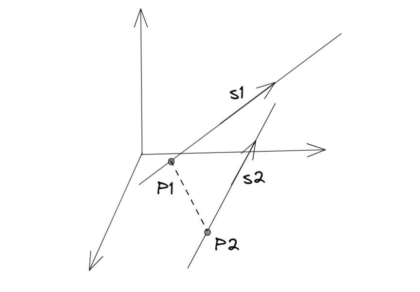

- [[微积分]]
- [[映射与函数]]
- 空间解析几何
  collapsed:: true
	- [[矩阵论]]
	- [[向量]]
	- 几何问题的代数化
	  collapsed:: true
		- 将几何的图像转换为数值表示，
		- 用数组构成的坐标来代替点，
		- 用函数来描述点的变化，
	- 向量（几何角度）
	  collapsed:: true
		- 定义
		  collapsed:: true
			- 有大小，有方向的量称为向量，
			- 一般用空间中的两点定义向量，即$\overrightarrow{AB}$，
			- 负向量：称$\overrightarrow{BA}$ = - $\overrightarrow{AB}$为负向量，即大小相同，方向相反，
			- 大小（模）：定义|$\overrightarrow{AB}$|为向量的大小，
			  collapsed:: true
				- 零向量：定义大小为0的向量为0向量，
				- 单位向量：定义大小为1的向量为单位向量，
			- 夹角：规定夹角$\theta(\vec{u}, \vec{v})$的取值范围为[0, \pi]，
			  collapsed:: true
				- 性质
				  collapsed:: true
					- $\theta(\vec{u}, \vec{v}) = \theta(\vec{v}, \vec{u})$
					- $\theta(k\vec{u}, \vec{v}) = \theta(\vec{u}, \vec{v})(k > 0)；\theta(k\vec{u}, \vec{v}) = \pi - \theta(\vec{u}, \vec{v})(k < 0)$
				- 称夹角为\pi / 2的两个向量垂直，
				- 称夹角为\pi或0的两个向量平行，也称共线，
		- 线性运算
		  collapsed:: true
			- 数乘：数乘后的向量大小变为\lambda倍；\lambda > 0时方向不变，\lambda < 0时方向相反，
			  collapsed:: true
				- 向量的单位向量表示：任何向量都可表示成$\overrightarrow{AB} = |\overrightarrow{AB}| \vec{i}$，
			- 加法，减法（三角形法则，平行四边形法则）
			  collapsed:: true
				- 模长不等式
				  collapsed:: true
					- |a + b| \le |a| + |b|，|a - b| \le |a| + |b|，
			- 性质（八条性质）
			  collapsed:: true
				- 交换律，加法结合律，
				- 乘法分配律，
				- 数乘分配律，数乘交换律，
				- 零元素：$\vec{u} + \vec{0} = \vec{u}$，
				- 相反元素：$\vec{u} + (-\vec{u}) = 0$，
		- 乘法运算
		  collapsed:: true
			- 数量积（内积）
			  collapsed:: true
				- 定义
				  collapsed:: true
					- $\vec{u} \cdot \vec{v} = ||u|| \cdot ||v|| \cdot \cos \theta$（数值），
					- $\vec{u} \cdot \vec{v} = 0$（即$\theta = \frac{\pi}{2}$）时，两个向量垂直（正交），
			- 向量积（外积）
			  collapsed:: true
				- 定义：$\vec{u} \times \vec{v} = \vec{t}$（向量）；其中向量$\vec{t}$的大小为$||u|| \cdot ||v|| \cdot \sin \theta$，方向与$\vec{u}$，$\vec{v}$呈右手系垂直，
				- 即向量积定义在三维空间中，二维平面的两个向量没有向量积，
			- 混合积
			  collapsed:: true
				- 定义：[u, v, t] = $(\vec{u} \times \vec{v}) \cdot \vec{t}$ （数值），
				- $[u, v, t] = 0$ ⇔ u, v, t 共面，
				- 乘法交换律（部分）：[u, v, t] = [v, t, u] = [t, u, v]，但[u, v, t] = -[v, u, t]，
		- 共线与共面
		  collapsed:: true
			- 定义
			  collapsed:: true
				- 共线：一组向量经过*平移后*可以移到一条直线上；此时称这组向量平行，
				- 共面：一组向量经过*平移后*可以移到一个平面上，
			- 线性相关与线性无关
			  collapsed:: true
				- 定义：若\exist a, b不全为0，使得$a\vec{u} + b\vec{v} = 0$，则称u，v线性相关，
				- 反之，若\forall a, b不全为0，总有$a\vec{u} + b\vec{v} \ne 0$，则称u，v线性无关，
				- （数字的“不全为0”可以表示为a^{2} + b^{2} \ne 0），
				- 可推广至多个向量，
			- 定理（几何的代数表示）
			  collapsed:: true
				- $\vec{u}, \vec{v}$共线 \Leftrightarrow u，v线性相关，
				- $\vec{u}, \vec{v}, \vec{t}$共面 \Leftrightarrow u，v，t线性相关，
				- 反之，$\vec{u}, \vec{v}, \vec{t}$不共面 \Leftrightarrow u，v，t线性无关，
	- 空间直角坐标系
	  collapsed:: true
		- 基
		  collapsed:: true
			- 定理：若$\vec{e_{1}}, \vec{e_{2}}, \vec{e_{3}}$不共面，则对任意一个三维向量$\overrightarrow{AB}$，都存在唯一的一组数(x, y, z)，使得$\overrightarrow{AB} = x\vec{e_{1}} + y\vec{e_{2}}+ z \vec{e_{3}}$，
			- 称这样的向量组$\vec{e_{1}}, \vec{e_{2}}, \vec{e_{3}}$为一组基，
			- 选定原点O后，称（O，$\vec{e_{1}}, \vec{e_{2}}, \vec{e_{3}}$）为仿射坐标系，
		- 直角坐标系（标准正交基）
		  collapsed:: true
			- 若$\vec{e_{1}}, \vec{e_{2}}, \vec{e_{3}}$两两正交，且均为单位向量，
			- 则按照右手系组成的三维坐标系为空间直角坐标系，
			- 右手坐标系（由x到y）
			  collapsed:: true
				- {:height 113, :width 194}
				- {:height 176, :width 235}
		- 坐标
		  collapsed:: true
			- 一般称x，y，z轴对应的单位向量为i，j，k；即 {:height 165, :width 245} ，
			- 由向量的单位向量表示和向量的加法运算，可知任意三维向量都可由*一组*单位向量$\vec{i}，\vec{j}，\vec{k}$表示；即$\overrightarrow{OA} = x\vec{i} + y\vec{j} + z\vec{k}$，
			- 称有序数x, y, z为向量OA的坐标，记作$\overrightarrow{OA} = (x, y, z)$，
			- 应注意坐标是用逗号分隔开的*数组*，而向量是一组不同方向的*单位向量*的和，
	- 向量的坐标运算（代数角度）
	  collapsed:: true
		- 给定直角坐标系的坐标之后，*向量*的运算就可以转化为*基于单位向量*的*数值*运算，
		- 线性运算
		  collapsed:: true
			- $\overrightarrow{AB} = \overrightarrow{AO} + \overrightarrow{OB} = \overrightarrow{OB} - \overrightarrow{OA}$（三角形法则），
			- $\overrightarrow{OB} - \overrightarrow{OA} = (x_{2}\vec{i} + y_{2}\vec{j} + z_{2}\vec{k}) - (x_{1}\vec{i} + y_{1}\vec{j} + z_{1}\vec{k}) = (x_{2} - x_{1})\vec{i} + (y_{2} - y_{1})\vec{j} + (z_{2} - z_{1})\vec{k}$，
			- $\lambda \overrightarrow{OA} = \lambda (x\vec{i} + y\vec{j} + z\vec{k}) =  (\lambda x)\vec{i} + (\lambda y)\vec{j} + (\lambda z)\vec{k}$，
		- 乘法运算
		  collapsed:: true
			- 单位向量的乘法运算
			  collapsed:: true
				- $\vec{i} \cdot \vec{i} = \vec{j} \cdot \vec{j} = \vec{k} \cdot \vec{k} = 1$，
				- $\vec{i} \cdot \vec{j} = \vec{j} \cdot \vec{k} = \vec{k} \cdot \vec{i} = 0$，
				- $\vec{i} \times \vec{j} = \vec{k}$，$\vec{j} \times \vec{k} = \vec{i}$，$\vec{k} \times \vec{i} = \vec{j}$，
				- 根据数量积和向量积的性质和向量的坐标系表示，可由此推得任意向量的乘法运算，
			- 模长与距离
			  collapsed:: true
				- $|\overrightarrow{OA}| = \sqrt{x^{2} + y^{2} + z^{2}}$，
				- 可以看成夹角为0的数量积，即cos 0 = 1，
				- 空间两点的距离|AB|也可以用向量AB的模长定义，
				- 即$|AB| = |\overrightarrow{AB}| = \sqrt{(x_{2} - x_{1})^{2} + (y_{2} - y_{1})^{2} + (z_{2} - z_{1})^{2}}$，
			- 数量积
			  collapsed:: true
				- 单位向量运算
				  collapsed:: true
					- $\vec{u} \cdot \vec{v} = (x_{2}\vec{i} + y_{2}\vec{j} + z_{2}\vec{k}) \cdot (x_{1}\vec{i} + y_{1}\vec{j} + z_{1}\vec{k})$，
					- $= x_{1}x_{2} + y_{1}y_{2} + z_{1}z_{2}$（数值），
				- 定义式
				  collapsed:: true
					- $\vec{u} \cdot \vec{v} = ||u|| \cdot ||v|| \cdot \cos \theta$（数值），
				- 几何意义
				  collapsed:: true
					- {:height 150, :width 270}
					- $\vec{u} \cdot \vec{v} = ||u|| \cdot ||v|| \cdot \cos \theta =  ||u|| \cdot  ||v|| \cdot \dfrac{\operatorname{Prj}_{v}(u)}{||u||}$，
					- $= ||v|| \cdot \operatorname{Prj}_{v}(u)$，
					- 即数量积为向量 v 的模长，和向量 u 在向量 v 的方向上的投影的乘积，
				- 性质
				  collapsed:: true
					- 乘法交换律，分配律，
					- 数乘的交换律，分配律，
			- 夹角
			  collapsed:: true
				- $\cos \theta = \dfrac{x_{1}x_{2} + y_{1}y_{2} + z_{1}z_{2}}{\sqrt{x_{1}^{2} + y_{1}^{2} + z_{1}^{2}} \cdot \sqrt{x_{2}^{2} + y_{2}^{2} + z_{2}^{2}}}$，
				- $x_{1}x_{2} + y_{1}y_{2} + z_{1}z_{2} = 0$时，cos \theta = 0，即两个向量*垂直*（\theta = \pi / 2），
				- $\dfrac{x_{1}}{x_{2}} = \dfrac{y_{1}}{y_{2}} = \dfrac{z_{1}}{z_{2}}$时，cos \theta = 1，即两个向量*平行*（\theta = 0或\pi），
				- 即(x_{1}, y_{1}, z_{1}) = k(x_{2}, y_{2}, z_{2})时，两个向量共线（线性相关），
				- 可以利用等式$\sin \theta = \sqrt{1 - {\cos}^{2}\theta}$计算，
				- 也可算出$\sin \theta = \dfrac{\sqrt{\begin{vmatrix}y_{1} & z_{1} \\y_{2} & z_{2} \\\end{vmatrix}^{2} + \begin{vmatrix}x_{1} & z_{1} \\x_{2} & z_{2} \\\end{vmatrix}^{2} + \begin{vmatrix}x_{1} & y_{1} \\x_{2} & y_{2} \\\end{vmatrix}^{2}}}{\sqrt{x_{1}^{2} + y_{1}^{2} + z_{1}^{2}} \cdot \sqrt{x_{2}^{2} + y_{2}^{2} + z_{2}^{2}}}$，
			- 向量积
			  collapsed:: true
				- 单位向量运算
				  collapsed:: true
					- $\overrightarrow{OB} \times \overrightarrow{OA} = (x_{2}\vec{i} + y_{2}\vec{j} + z_{2}\vec{k}) \times (x_{1}\vec{i} + y_{1}\vec{j} + z_{1}\vec{k})$，
					- $= \begin{vmatrix}y_{1} & z_{1} \\y_{2} & z_{2} \\\end{vmatrix} \vec{i} - \begin{vmatrix}x_{1} & z_{1} \\x_{2} & z_{2} \\\end{vmatrix} \vec{j} +\begin{vmatrix}x_{1} & y_{1} \\x_{2} & y_{2} \\\end{vmatrix} \vec{k}$（向量），
					- 也可记为三阶行列式$\begin{vmatrix}i & j & k \\x_{1} & y_{1} & z_{1} \\x_{2} & y_{2} & z_{2} \\\end{vmatrix}$，
					- 模长$= \sqrt{\begin{vmatrix}y_{1} & z_{1} \\y_{2} & z_{2} \\\end{vmatrix}^{2} + \begin{vmatrix}x_{1} & z_{1} \\x_{2} & z_{2} \\\end{vmatrix}^{2} + \begin{vmatrix}x_{1} & y_{1} \\x_{2} & y_{2} \\\end{vmatrix}^{2}}$，
				- 定义式
				  collapsed:: true
					- $\vec{u} \times \vec{v} = \vec{t}$；向量$\vec{t}$的模长为$||u|| \cdot ||v|| \cdot \sin \theta$，方向与$\vec{u}$，$\vec{v}$呈右手系垂直，
					- 模长
					  collapsed:: true
						- 由等式${\sin}^{2}\theta + {\cos}^{2}\theta = 1$，或向量积的模长公式，都可求出$\sin \theta$的取值，
						- 即$\sin \theta = \dfrac{\sqrt{\begin{vmatrix}y_{1} & z_{1} \\y_{2} & z_{2} \\\end{vmatrix}^{2} + \begin{vmatrix}x_{1} & z_{1} \\x_{2} & z_{2} \\\end{vmatrix}^{2} + \begin{vmatrix}x_{1} & y_{1} \\x_{2} & y_{2} \\\end{vmatrix}^{2}}}{\sqrt{x_{1}^{2} + y_{1}^{2} + z_{1}^{2}} \cdot \sqrt{x_{2}^{2} + y_{2}^{2} + z_{2}^{2}}}$，
						- 由于$\cos \theta$一般容易求，所以可以利用等式求出$\sin \theta = \sqrt{1 - {\cos}^{2}\theta}$，再计算向量积的模长，
					- 方向
					  collapsed:: true
						- 向量$\vec{t}$与不共线的向量$\vec{u}$，$\vec{v}$都垂直，
						  collapsed:: true
							- $\vec{u}$，$\vec{v}$共线时sin\theta = 0，所以向量积为0，
						- 即$\vec{t} \cdot \vec{u} = 0$且$\vec{t} \cdot \vec{v} = 0$，
						- 可得齐次方程组$\begin{cases}  x_{1}t_{1} + y_{1}t_{2} + z_{1}t_{3} = 0 \\   x_{2}t_{1} + y_{2}t_{2} + z_{2}t_{3} = 0 \end{cases}$，
						- 基础解系就是向量$\vec{t}$方向上的一族向量，
				- 几何意义
				  collapsed:: true
					- {:height 140, :width 330}
					- $||\vec{u} \times \vec{v}|| = ||u|| \cdot ||v|| \cdot \sin \theta =  ||u|| \cdot  ||v|| \cdot \dfrac{h}{||u||}$，
					- $= ||v|| \cdot h$，
					- 即向量积的*模长*为以向量u，v为边的平行四边形的面积，或以向量u，v为边的三角形的面积的2倍，
				- 性质
				  collapsed:: true
					- $\vec{u} \times \vec{u} = 0$
					- $\vec{u} \times \vec{v} = 0$ （即 $\theta = \pi$ ）时，两个向量平行，
					- 数乘的交换律，分配律，
					- 不满足乘法交换律： $\vec{u} \times \vec{v} = -\vec{v} \times \vec{u}$ ，
					- 乘法的分配律，
			- 混合积
			  collapsed:: true
				- 单位向量运算
				  collapsed:: true
					- $[u, v, t] = (\vec{u} \times \vec{v}) \cdot \vec{t} = \begin{vmatrix}x_{1} & x_{2} & x_{3} \\y_{1} & y_{2} & y_{3} \\z_{1} & z_{2} & z_{3} \\\end{vmatrix}$，
				- 几何意义
				  collapsed:: true
					- $[u, v, t] = ||\vec{u} \times \vec{v}|| \cdot ||\vec{t}|| \cdot \cos \theta = ||\vec{u} \times \vec{v}|| \cdot ||\vec{t}|| \cdot \dfrac{\operatorname{Prj}_{u \times v}(t)}{||t||}$，
					- $||\vec{u} \times \vec{v}|| \cdot \operatorname{Prj}_{u \times v}(t)= Sh = V$，
					- 混合积的*绝对值*为以u，v，t为棱的平行六面体的体积（体积一定为正数），
					- 若t的方向为u \to v的右手系，则混合积为正；反之为负，
					- {:height 240, :width 340}
		- 方向角与方向余弦
		  collapsed:: true
			- 定义
			  collapsed:: true
				- 称非零向量$\vec{u} = (x, y, z)$与三条坐标轴（标准向量$\vec{i}，\vec{j}，\vec{k}$）的夹角为向量的方向角，一般记为α, β, γ；
				- 称三个方向角的余弦值为方向余弦cosα, cosβ, cosγ，
				- 即 {:height 150, :width 250}，
				- 可知$\cos \alpha = \dfrac{\vec{u} \cdot \vec{i}}{|\vec{u}|\cdot|\vec{i}|} = \dfrac{(x, y, z)\cdot(1, 0, 0)}{|\vec{u}|} = \dfrac{x}{|\vec{u}|}$，
				- 同理，$\cos \beta = \dfrac{y}{|\vec{u}|}, \cos \gamma = \dfrac{z}{|\vec{u}|}$，
			- 性质
			  collapsed:: true
				- $(\cos \alpha, \cos \beta, \cos \gamma) = \dfrac{1}{|\vec{u}|}(x, y, z) = \vec{e}_{u}$，
				- 即方向余弦组成的向量为与向量$\vec{u}$*同方向*的模长为1的*单位向量*；
				- 反之，与向量$\vec{u}$同方向的单位向量的*每个分量*，也可以*理解为*该方向的各个方向余弦，
				- ${\cos}^{2} \alpha + {\cos}^{2}\beta + {\cos}^{2} \gamma = 1$，
		- 投影
		  collapsed:: true
			- 定义
			  collapsed:: true
				- 称向量$\vec{u}$在向量$\vec{v}$方向上的“分向量”为$\vec{u'}$，
				- 称$\vec{u'}$的*模长*为向量$\vec{u}$在$\vec{v}$上的投影，一般记为Prj_{v}(u)，
				- 可知，向量$\vec{u}$在坐标系Oxyz上的坐标的实质就是$\vec{u}$在三条坐标轴上的投影，
				- {:height 150, :width 270}
			- 计算
			  collapsed:: true
				- 投影只与$\vec{u}$的大小与$\vec{v}$的*方向*有关，而与$\vec{v}$的*大小*无关，
				- 向量$\vec{u'} = \dfrac{\vec{u} \cdot \vec{v}}{\vec{v} \cdot \vec{v}} \cdot \vec{v}$，
				- 模长Prj_{v}(u) = $||\vec{u'}|| = ||\vec{u}||\cos \theta = \dfrac{\vec{u} \cdot \vec{v}}{||\vec{v}||}$，
			- 性质（线性性）
			  collapsed:: true
				- Prj_{t}(u + v) = Prj_{t}(u) + Prj_{t}(v)，
				- Prj_{t}(\lambda u) = \lambda Prj_{t}(u)
	- @坐标变换
	  collapsed:: true
		- 概述
		  collapsed:: true
			- 设Oxyz为一个空间直角坐标系，其单位向量分别为$\vec{i}，\vec{j}，\vec{k}$，
			- 可以将对向量的变换看成对基的变换，
			- 用向量的坐标乘以新的基，即可得向量在新的基下的坐标，
		- 直角坐标系
		  collapsed:: true
			- 平移变换
			  collapsed:: true
				- 更换原点O的位置，坐标轴不变化；记新的坐标系为O'xyz，
				- 可知向量$\vec{u'} = \vec{u} + \overrightarrow{OO'}$，
				- 齐次坐标
				  collapsed:: true
					- 平移变换不是线性变换，所以不能用同阶的矩阵乘法表示，
					- 可以增加原向量的坐标维度，称新的坐标为原向量的齐次坐标，
					- 示例
					  collapsed:: true
						- 设向量$\vec{u} = (x, y, z)$，平移变换将其变为$\vec{u'} = (x + a, y + b, z + c)$，
						- 定义u的齐次坐标为$(x, y, z, 1)$，
						- 则有变换矩阵$\begin{pmatrix} 1 & 0 & 0 & a \\ 0 & 1 & 0 & b \\ 0 & 0 & 1 & c \\0 & 0 & 0 & 1 \\\end{pmatrix}\begin{pmatrix} x \\ y  \\ z \\ 1 \end{pmatrix} = \begin{pmatrix} x + a \\ y + b \\ z + c\\ 1 \end{pmatrix}$，
					- 对于其它线性变换的矩阵A，可以将其扩充为分块矩阵$\begin{pmatrix} A & 0  \\ 0 & 1 \end{pmatrix}$，并应用到齐次坐标上，
			- 旋转变换
			  collapsed:: true
				- 原点O的位置不动，坐标轴进行旋转，
				- 记新的坐标系为Ox'y'z'，
				- 旋转变换等同于对三个单位向量$\vec{i}，\vec{j}，\vec{k}$进行旋转，
				- 可以记变换矩阵为$\begin{pmatrix} \cos\alpha_{1} & \cos\beta_{1} & \cos\gamma_{1} \\ \cos\alpha_{2} & \cos\beta_{2} & \cos\gamma_{2} \\ \cos\alpha_{3} & \cos\beta_{3} & \cos\gamma_{3} \\\end{pmatrix}$，
				- 即有变换$\begin{pmatrix} \vec{i}' \\ \vec{j}'  \\ \vec{k}'  \end{pmatrix} = \begin{pmatrix} \cos\alpha_{1} & \cos\beta_{1} & \cos\gamma_{1} \\ \cos\alpha_{2} & \cos\beta_{2} & \cos\gamma_{2} \\ \cos\alpha_{3} & \cos\beta_{3} & \cos\gamma_{3} \\\end{pmatrix}\begin{pmatrix} \vec{i} \\ \vec{j}  \\ \vec{k}  \end{pmatrix}$，
			- 投影变换
			  collapsed:: true
				- 可以将三维的点按一定比例投影到二维的平面上，
				- {:height 210, :width 250}，
		- 极坐标
		  collapsed:: true
			- $\begin{cases}  x = \rho \cos\theta \\   y = \rho \sin\theta \end{cases}$，
			- 变换的行列式为$\begin{vmatrix}\dfrac{\partial x} {\partial \rho} & \dfrac{\partial x} {\partial \theta} \\\dfrac{\partial y} {\partial \rho} & \dfrac{\partial y} {\partial \theta} \\\end{vmatrix} = \begin{vmatrix}\cos \theta & -\rho \sin \theta \\\sin \theta & \rho \cos \theta \\\end{vmatrix} = \rho$，
		- 柱坐标与球坐标
	- 空间图形的方程（代数角度）
	  collapsed:: true
		- 基本思想
		  collapsed:: true
			- 在空间解析几何中，可以将任何曲面或曲线都看作*点的轨迹*，
			- 平面，曲面等几何图形都有一定的*几何性质*，
			- 如果点的运动轨迹满足这些几何性质，那么这个点的运动方程F(x, y, z) = 0就可以描述对应的几何图形，
			- 反之，不在曲面上的任一点的坐标则应该不符合方程F(x, y, z) = 0，
			- 称三元方程F(x, y, z) = 0为曲面的方程，称两个曲面的交线为空间曲线，
		- 平面与直线
		  collapsed:: true
			- 平面的方程
			  collapsed:: true
				- 平面的几何性质
				  collapsed:: true
					- 过空间中一点，有且只有一个平面垂直于已知直线；即*平面上的一点*和一条*垂直于平面的直线*可以*确定*一个平面，
					- 称垂直于平面的*非零向量*为平面的法向量，
					- 可知法向量有两个方向，即$\vec{n} = (A, B, C)$和$-\vec{n} = (-A, -B, -C)$都是平面的法向量，
				- 平面的点法式方程
				  collapsed:: true
					- 设M_{0}(x_{0}, y_{0}, z_{0})为平面上一点，$\vec{n} = (A, B, C)$为法向量，
					- 按照平面的性质，平面上的任意一点M(x, y, z)的轨迹，应当满足方程MM_{0} \cdot n = 0，
					- 即有过点M_{0}且以n为法向量的平面的方程A(x - x_{0}) + B(y - y_{0}) + C(z - z_{0}) = 0，
					- 反之，任给平面上两点M_{1}(x_{1}, y_{1}, z_{1})，M_{2}(x_{2}, y_{2}, z_{2})，也可算得法向量(A, B, C)一定满足方程M_{1}M_{2} \cdot n = 0，即A(x_{1} - x_{2}) + B(y_{1} - y_{2}) + C(z_{1} - z_{2}) = 0，
				- 平面的一般方程
				  collapsed:: true
					- 称Ax + By + Cz + D = 0为平面的一般方程，常数项$(A, B, C)$为平面对应的法向量；可由点法式方程直接推广得到，
					- D = 0时，平面过原点(0, 0, 0)；
					- A, B, C之一为0时，平面平行于坐标轴；如y = 2x平面包含了z轴，
					- A, B, C两个为0时，平面平行于两个坐标轴围成的平面；如z = 2平面平行于xOy平面，
				- 平面的截距式方程
				  collapsed:: true
					- 设平面与坐标轴分别相交于P(a, 0, 0)，Q(0, b, 0)，R(0, 0, c)；即P，Q，R三点都在平面上，
					- 由平面的一般方程，可解得方程$\dfrac{x}{a} + \dfrac{y}{b} + \dfrac{z}{c}  = 1$，
			- 平面之间的关系
			  collapsed:: true
				- 点到平面的距离
				  collapsed:: true
					- 设P_{0}为平面外一点，P_{1}为平面上任意一点，
					- 可知点P_{0}到平面的距离，为向量P_{1}P_{0}在法向量n上的投影的长度，
					- {:height 150, :width 220}，
					- 设P_{0}(x_{0}, y_{0}, z_{0})，平面的方程为Ax + By + Cz + D = 0，
					- 可算得距离$d = \dfrac{|Ax_{0} + By_{0} + Cz_{0} + D|}{\sqrt{A^{2} + B^{2} + C^{2}}}$，
					  collapsed:: true
						- 法向量为$\vec{n} = (A, B, C)$，
						- d = Prj_{n}(P_{1}P_{0}) = $\dfrac{P_{1}P_{0} \cdot n}{||n||}$，
						- 应注意距离为正数，所以最后应取绝对值，
				- 平面的夹角
				  collapsed:: true
					- 称两个平面的*法向量的夹角*为两个平面的夹角，
					- 设两个平面的方程分别为和A_{1}x + B_{1}y + C_{1}z + D_{1} = 0和A_{2}x + B_{2}y + C_{2}z + D_{2} = 0，
					- 则$\cos \theta = \dfrac{|A_{1}A_{2}+B_{1}B_{2}+C_{1}C_{2}|}{\sqrt{A_{1}^{2} + B_{1}^{2} + C_{1}^{2}}\sqrt{A_{2}^{2} + B_{2}^{2} + C_{2}^{2}}}$，
			- 直线的方程
			  collapsed:: true
				- 直线的几何性质
				  collapsed:: true
					- 过空间中一点，有且只有一条直线平行于已知直线；即*直线上的一点*和一条*平行于直线的直线*可以*确定*一条直线，
					- 称平行于直线的*非零向量*为平面的方向向量，
					- 方向向量也有两个方向，即$\vec{s} = (m, n, p)$和$-\vec{s} = (-m, -n, -p)$都是直线的方向向量，
					- （两点确定一条直线）
					  collapsed:: true
						- 设M_{1}(x_{1}, y_{1}, z_{1})，M_{2}(x_{2}, y_{2}, z_{2})为空间中两点，
						- 按照直线的性质，直线上的任意一点M(x, y, z)的轨迹，应当满足方程$a\overrightarrow{MM_{1}} + b\overrightarrow{M_{1}M_{2}} = 0$，即两个向量共线，
						- 可得到方程$\dfrac{x - x_{1}}{x_{1} - x_{2}} = \dfrac{y - y_{1}}{y_{1} - y_{2}} = \dfrac{z - z_{1}}{z_{1} - z_{2}}$，
						- 此处的向量$\overrightarrow{M_{1}M_{2}}$就是平面的方向向量，
				- 直线的点向式方程
				  collapsed:: true
					- 设M_{0}(x_{0}, y_{0}, z_{0})为直线上一点，$\vec{s} = (m, n, p)$为方向向量，
					- 按照直线的性质，直线上的任意一点M(x, y, z)的轨迹，应当满足方程$a\overrightarrow{MM_{0}} + b\vec{s} = 0$，即两个向量共线，
					- 可推出平面的点向式方程$\dfrac{x - x_{0}}{m} = \dfrac{y - y_{0}}{n} = \dfrac{z - z_{0}}{p}$，
					- 此处m, n, p可以一个或两个为0，但此时的点向式方程需要改写，
				- 直线的参数方程
				  collapsed:: true
					- $\begin{cases}  x = x_{0} + mt \\ y = y_{0} + nt \\ z = z_{0} + pt \\  \end{cases}$，可由点向式方程直接推得，
					- 可知m, n, p之一为0时，直线平行于坐标轴；两个为0时，直线平行于两个坐标轴围成的平面，
					- 根据直线的参数方程，直线上任意两点M1，M2对应的向量为
					- $\overrightarrow{M1M2} = \begin{cases}  x = (x_{0} + mt_{1}) - (x_{0} + mt_{2}) = mt_{3}\\ y = (y_{0} + nt_{1}) - (y_{0} + bt_{2}) = nt_{3} \\ z = (z_{0} + pt_{1}) - (xz_{0} + pt_{2}) = pt_{3} \\  \end{cases} = t_{3}\vec{s}$，
				- 直线的一般方程
				  collapsed:: true
					- 平面上的直线，对应的为空间中的一个平面，而不再是直线，
					- 同理，空间中的“直线”类似于平面上的“点”，因此需要两个平面才能确定，
					- 所以，可知直线的一般方程为$\begin{cases}  A_{1}x + B_{1}y + C_{1}z + D_{1} = 0 \\ A_{2}x + B_{2}y + C_{2}z + D_{2} = 0 \end{cases}$，
					  collapsed:: true
						- 此处A_{1}, A_{2}，B_{1}, B_{2}，C_{1}, C_{2}之间不成比例（否则平面平行，不会相交），
					- 齐次方程组$\begin{cases}  A_{1}x + B_{1}y + C_{1}z = 0 \\ A_{2}x + B_{2}y + C_{2}z = 0 \end{cases}$的通解就是直线的方向向量$\vec{s} = (m, n, p)$，
					- 非齐次方程组$\begin{cases}  A_{1}x + B_{1}y + C_{1}z  = - D_{1} \\ A_{2}x + B_{2}y + C_{2}z =  -D_{2} \end{cases}$的（一个）特解就是直线上的一点M_{0}(x_{0}, y_{0}, z_{0})，
					- 所以，按照方程组的理论，“直线”就是一个*非齐次通解*，
					- 即方向向量（齐次的通解）和一个直线上的点（非齐次特解）：$\vec{L} = \vec{L_{0}} + t\vec{s}$；这也是直线的参数方程形式，
				- 平面束
				  collapsed:: true
					- 两个平面就可以确定一条直线，反之，经过一条直线的平面可以有无数个，
					- 称通过直线L的所有平面为平面束，
					- 由直线的一般方程$\begin{cases}  A_{1}x + B_{1}y + C_{1}z + D_{1} = 0 \\ A_{2}x + B_{2}y + C_{2}z + D_{2} = 0 \end{cases}$，
					- 可得通过直线L的平面束的方程为$A_{1}x + B_{1}y + C_{1}z + D_{1} + \lambda(A_{2}x + B_{2}y + C_{2}z + D_{2}) = 0$，
			- 《直线之间的关系
			  collapsed:: true
				- 点到直线的距离
				  collapsed:: true
					- 设N为直线L外一点；M1，M2为直线上任意两点，Q为N到直线L的垂线，
					- 即 {:height 183, :width 359}
					- 可知向量NM1与M1M2围成的平行四边形的面积$S = ||\overrightarrow{NM1} \times \overrightarrow{M1M2}|| = ||d|| \cdot ||\overrightarrow{M1M2}||$，
					- 所以长度$||d|| = \dfrac{||\overrightarrow{NM1} \times \overrightarrow{M1M2}||}{||\overrightarrow{M1M2}||}$，
					- 根据直线的参数方程，直线上任意两点对应的向量为
					- $\overrightarrow{M1M2} = \begin{cases}  x = (x_{0} + mt_{1}) - (x_{0} + mt_{2}) = mt_{3}\\ y = (y_{0} + nt_{1}) - (y_{0} + bt_{2}) = nt_{3} \\ z = (z_{0} + pt_{1}) - (xz_{0} + pt_{2}) = pt_{3} \\  \end{cases} = t_{3}\vec{s}$，
					- 根据向量积的数乘性质，可得长度$||d|| = \dfrac{||\overrightarrow{NM1} \times \vec{s}||}{||\vec{s}||}$，
				- 直线与直线的夹角
				  collapsed:: true
					- 称两个直线的*方向向量的夹角*为两个平面的夹角，
					- 设两个直线的方向向量分别为$\vec{s}_{1} = (m_{1}, n_{1}, p_{1})$和$\vec{s}_{2} = (m_{2}, n_{2}, p_{2})$，
					- 则$\cos \theta = \dfrac{\vec{s}_{1} \cdot \vec{s}_{2}}{||\vec{s}_{1}|| \cdot ||\vec{s}_{2}||} = \dfrac{|m_{1}m_{2}+n_{1}n_{2}+p_{1}p_{2}|}{\sqrt{m_{1}^{2} + n_{1}^{2} + p_{1}^{2}}\sqrt{m_{2}^{2} + n_{2}^{2} + p_{2}^{2}}}$，
				- 直线的异面
				  collapsed:: true
					- 设两个直线L1，L2的方向向量分别为$\vec{s}_{1} = (m_{1}, n_{1}, p_{1})$和$\vec{s}_{2} = (m_{2}, n_{2}, p_{2})$，
					- P_{1}(x_{1}, y_{1}, z_{1})为L1上一点，P_{2}(x_{2}, y_{2}, z_{2})为L2上一点，
					- 则两个直线异面等价于三个向量P1P2，s1，s2不共面， 即混合积[P1P2，s1，s2] \ne 0，
					- 即行列式$\begin{vmatrix}x_{2} - x_{1} & y_{2} - y_{1} & z_{2} - z_{1} \\m_{1} & n_{1} & p_{1} \\m_{2} & n_{2} & p_{2} \\\end{vmatrix} \ne 0$，
					- {:height 230, :width 320}，
					-
				- 直线与平面的夹角
				  collapsed:: true
					- 直线与平面*垂直* \Leftrightarrow 方向向量与法向量*平行*，
					- 直线与平面*平行*  \Leftrightarrow 方向向量与法向量*垂直*，
					- 规定直线和它在平面上的投影直线的夹角（锐角）为直线与平面的夹角，
					- 由于直线与*法向量*的夹角$\phi = \dfrac{\pi}{2} - \theta$，
					- {:height 180, :width 280}
					- 所以，直线与*平面*的夹角$\sin \theta = \dfrac{|Am+Bn+Cp|}{\sqrt{A^{2} + B^{2} + C^{2}}\sqrt{m^{2} + n^{2} + p^{2}}}$，
		- 《曲面与曲线
		  collapsed:: true
			- 曲面的方程
			  collapsed:: true
				- 球面
				  collapsed:: true
					- 球面的几何性质
					  collapsed:: true
						- 到定点（球心）的距离等于定长，
						- 设M_{0}(x_{0}, y_{0}, z_{0})为球心，M(x, y, z)为任意一点，
						- 若M在球面上，则应有$||\overrightarrow{MM_{0}}|| = R$，即$\sqrt{(x - x_{0})^{2} + (y - y_{0})^{2} + (z - z_{0})^{2}} = R$，
						- 两侧平方，即有球面的方程$(x - x_{0})^{2} + (y - y_{0})^{2} + (z - z_{0}) = R^{2}$，
					- 球面的一般方程
					  collapsed:: true
						- 将球面的方程拆开括号，
						- 可得三元二次方程A^{2}x + A^{2}y + A^{2}z + Dx + Ey + Fz + G= 0，这就是球面的一般方程，
						- 此处平方项的系数相同，且没有二次项xy，yz，xz，
						- 方程可配方为球面方程，
				- 柱面
				  collapsed:: true
					- 定义与几何性质
					  collapsed:: true
						- 称一条直线沿着曲线平行移动形成的曲面为柱面，
						- 称直线为柱面的母线，曲线为准线，
					- 一般方程
					  collapsed:: true
						- 一般称方程组$\begin{cases}  F(x, y) = 0 \\z = 0 \end{cases}$描述的图形为一个柱面，
				- 旋转曲面
				  collapsed:: true
					- 定义与几何性质
					  collapsed:: true
						- 称一条平面曲线，绕其所在平面上的一条直线，旋转一周所成的曲面为旋转曲面，
						- 称旋转曲线为母线，直线为轴，
						- 可知，母线上的任意一点，到轴的距离都相等，
					- 单叶双曲面
					- 双叶双曲面
					- 二次锥面
					  collapsed:: true
						-
				- 二次曲面
				  collapsed:: true
					- 一般方程
					  collapsed:: true
						- 称三元二次方程所表示的曲面为二次曲面，
					- 《常用的二次曲面方程及其图形
				- @曲面的参数方程
				- 曲面的投影
			- 《曲线的方程
			  collapsed:: true
				- 曲线的参数方程
				- 曲线的一般房产
				- 曲线在坐标面上的投影曲线方程
			- 控制变量法
			  collapsed:: true
				- 对于三元方程组成的曲面，可以采用控制变量法来判断曲面的性质，
				- 示例：单叶双曲面$\dfrac{x^{2}}{a^{2}} + \dfrac{y^{2}}{b^{2}} - \dfrac{z^{2}}{c^{2}}  = -1$，
				- 取 z 的值不变，x，y的值变动，
				  collapsed:: true
					- 设z = 0，则有$\dfrac{x^{2}}{a^{2}} + \dfrac{y^{2}}{b^{2}}   = -1$，可知方程无解，所以单叶双曲面不经过原点，
					- 设z = c，则有$\dfrac{x^{2}}{a^{2}} + \dfrac{y^{2}}{b^{2}}   = 0$，可知单叶双曲面经过点(0, 0, c)，
					- 设z > c，则有$\dfrac{x^{2}}{a^{2}} + \dfrac{y^{2}}{b^{2}}   = \dfrac{z^{2} - c^{2}}{c^{2}}$，可知单叶双曲面在z > c时的横切面为椭圆；
					- 由于图形关于xOy面对称，所以图形为对称图形，
				- 同理，取 y 的值不变，x，z的值变动，
				  collapsed:: true
					- y取任意值时，有$\dfrac{x^{2}}{a^{2}} - \dfrac{z^{2}}{c^{2}} =  -\dfrac{y^{2}}{b^{2}} -1$，或$\dfrac{z^{2}}{c^{2}} - \dfrac{x^{2}}{a^{2}} = \dfrac{y^{2}}{b^{2}} + 1$，
					- 可知单叶双曲面的竖切面为关于x轴对称的双曲线，
				- 取一个变量的值不变时，函数的图形也可以看成函数在对应平面上的投影，
	- 空间图形的一般方程
	  collapsed:: true
		- 三维空间
		  collapsed:: true
			- 方程$F(x, y, z) = 0$，
			  collapsed:: true
				- 此时方程的自由度为2，
				- 若方程为一次方程，则称其描述的为一个平面，
				- 若方程为二次方程，则称其描述的为一个曲面，
				- 所有二次型所表达的函数，其几何意义都是三种圆锥曲线（椭圆，抛物线，双曲线）及其退化形式，
			- 方程组$\begin{cases}  F(x, y, z) = 0 \\ G(x, y, z) = 0 \end{cases}$，
			  collapsed:: true
				- 此时方程的自由度为1，
				- 若方程为一次方程组，则称其描述的为一条直线，
				- 若方程为二次方程组，则称其描述的为一条曲线，
				- 由方程组的解的结构，可知方程组通解为$\begin{cases}  x = x_{0} + x(t) \\ y = y_{0} + y(t)\\ z = z_{0} + z(t)\\  \end{cases}$，
			- 方程组$\begin{cases}  F(x, y, z) = 0 \\ G(x, y, z) = 0 \\ H(x, y, z) = 0 \end{cases}$，
			  collapsed:: true
				- 此时方程的自由度为0；因此若方程组有解，则其描述的为一个点，
		- 多元函数的“几何”意义
		  collapsed:: true
			- 更高维的情况不再有“线”和“面”等直观的几何含义，但是仍可以做一定的类比，
			- 类似三维空间的情况，m个n元函数构成的方程组（即隐函数方程组）实际上也可以确定“直线”和“平面”等概念，
			- 一般而言，对（隐函数）方程组$\begin{cases}  F_{1}(x_{1}, x_{2},\cdots,  x_{n}) = 0 \\ F_{2}(x_{1}, x_{2},\cdots,  x_{n}) = 0  \\ \vdots \\ F_{m}(x_{1}, x_{2},\cdots,  x_{n}) = 0\end{cases}$，
			- 若m = 1，即只有一个方程，则此时有n - 1个*自由变量*；称原方程组确定的“图形”为超平面（超曲面），
			  collapsed:: true
				- 超平面可直接由F_{1}(x_{1}, x_{2},…,  x_{n}) = 0表示，
				- 也可由剩余n - 1个自由变量组成的参数方程表示，
			- 若m = n - 1，此时只有1个*自由变量*；称原方程组确定的“图形”为直线（曲线），
			  collapsed:: true
				- 直线一般由剩余的1个自由变量的参数方程表示，
		- 应注意方程和方程组都可能无解，
	- 二元函数z = f(x, y)的等高线图像表示
	- [[射影几何]]
- 多元函数的控制变量法
  collapsed:: true
	- 多元函数的基本研究思想之一，是将多变量转化为单变量的情况，并利用单变量的结论分析，
	- 可以尝试控制变量或构造变量，转化为一元函数，
	- 应用
	  collapsed:: true
		- 分析空间图形的方程
		- 多元函数的偏导数
		- 多元函数的中值定理
		- 多重积分转化为累次积分
- 多元函数
  collapsed:: true
	- 线性空间
	- Euclid空间（距离）
	  collapsed:: true
		- 内积的概念
			- 性质
			  collapsed:: true
				- 设g为(R, R) \to R的一个映射，若g满足
					- 正定性：<x, x> \ge 0，且<x, x> = 0 \Leftrightarrow x = 0，
					- 对称性：<x, y> = <y, x> ，
					- 线性性：<\lambda x + \mu y, z> = \lambda<x, z> + \mu<y, z>，
				- 则称g为R上的一个内积，称定义了内积的线性空间为内积空间，
			- 定义
			  collapsed:: true
				- 在实数域R上，定义内积<x, y> = xy，
				- 在n维空间R^{n}上，定义内积<x, y> = \sum x_{i}y_{i}，
				- 定义$||x|| = \sqrt{\langle x, x \rangle}$为 x 的Euclid范数，
				- 若将矩阵看成R^{mn}中的一个“点”，则可由此定义矩阵的范数（Frobenius范数），即${||A||}_{F}=\sqrt{\sum\limits_{i=1}^{m} \sum\limits_{j=1}^{n} a_{i j}^{2}}$，
			- 定理
			  collapsed:: true
				- Schwarz 不等式：<x, y> \le ||x|| \cdot ||y||，等号成立当且仅当 x 与 y 线性相关.
			- 称引入了内积的线性空间为Euclid空间，
		- 度量的概念
			- 设\rho为(R, R) \to R的一个映射，若\rho满足
				- 正定性：\rho(x, y) \ge 0，且\rho(x, y) = 0 \Leftrightarrow x = y
				- 对称性：\rho(x, y) = \rho(y, x) ，
				- 三角不等式：\rho(x, z) \le \rho(x, y) + \rho(y, z)
			- 则称\rho为R上的一个度量（距离），称定义了度量的线性空间为度量空间，
		- 内积诱导的度量
		  collapsed:: true
			- 定义\rho = ||x - y||为距离，
	- 度量空间的点集
	  collapsed:: true
		- 内点，外点，边界点
		  collapsed:: true
			- 定义
			  collapsed:: true
				- 一般称内点为int A，边界点为\partial A，外点为int A^{c}（即A的补集的内点），
				- {:height 210, :width 220}，
				- 内点：存在一个以该点为中心的邻域（点集），这个邻域全部包括在集合A内，
				- 外点：存在一个以该点为中心的邻域（点集），这个邻域全部不在集合A内，
				- 边界点：存在一个以该点为中心的邻域（点集），这个邻域总有一部分点在集合A内，而另一部分不在集合A内，
			- 性质
			  collapsed:: true
				- 空间R = int A \cup \partial A \cup int A^{c}，
				- A的边界点集\partial A为闭集，
				- A的边界点*不一定*属于A，
			- 示例
			  collapsed:: true
				- 设点集A：{(x, y) : x^{2} + y^{2} < 4}，
					- 满足x^{2} + y^{2} < 4的(x, y)组合都是A的内点，
					- 满足x^{2} + y^{2} = 4的(x, y)组合则是A的边界点；此处A的边界点不属于A，
					- 满足x^{2} + y^{2} > 4的(x, y)组合是A的外点，
					- 所以点集A是开集，
				- 相比之下，点集A'：{(x, y) : x^{2} + y^{2} \le 4}则是闭集，
		- 孤立点，聚点
		  collapsed:: true
			- 孤立点：存在一个以该点为中心的邻域（点集），这个邻域*除了该点*以外，全部不在在集合A内；如点集A：{(x, y) : x^{2} + y^{2} < 4 \cup (3, 3)}，
			- 聚点：存在一个以该点为中心的邻域（点集），这个邻域总有一部分点在集合A内；内点一定是聚点，
		- 开集，闭集，闭包
		  collapsed:: true
			- 定义
			  collapsed:: true
				- （一般记$A^{c}$为A的补集，$\bar{A}$为A的闭包），
				- 开集：集合A中的点都为A的内点，类似一元点集中的开区间，
				- 闭集：若集合A^{c}为开集，则集合A为闭集，
				- 闭包：定义点集int A \cup \partial A为A的闭包，闭包一定为闭集，
				- 空集既是开集也是闭集，
				- 同样，也存在半开半闭的区间，
			- 性质
			  collapsed:: true
				- 有限范围内，开集，闭集对交，并运算封闭，
				- 集合A为开集 \Leftrightarrow A \cap \partial A = \emptyset，
				- 集合A为闭集 \Leftrightarrow \partial A \subset A \Leftrightarrow $A = \bar{A}$，
		- 邻域
		  collapsed:: true
			- n维空间中的邻域/去心邻域由直线变为区域，即空间点集，
		- 区域
		  collapsed:: true
			- 称道路连通的开集为区域，
			- 若区域E中的任意简单连续闭曲线围成的区域都属于E，则称区域E为单连通区域，
	- @度量空间的性质
	  collapsed:: true
		- 空间中的点列
		- 完备性
		  collapsed:: true
			- 实数域R是一个完备的度量空间，而有理数集Q不是完备的度量空间，
			- 闭球套原理
			- 压缩映像原理
		- 紧致性
		  collapsed:: true
			- 覆盖：设S为度量空间的子集，若一定数量的集合G的并集包含了S，则称这些集合为S的一个覆盖；即若S \subset \cup G_{n}，则{G_{n}}为S的一个覆盖，
			- 如果集合 S 的任何开覆盖都有有限子覆盖, 则称 S 为紧致集合，
			- 紧致集合必为有界闭集，
			- 有界点列必有收敛子列，
		- 连通集
		  collapsed:: true
			- 若对集合A的任意一个分割（A_{1}，A_{2}），集合A_{1}中总有A_{2}的聚点，则称集合A为连通集，
			- 道路连通：若集合A的任意两点（a_{1}，a_{2}），总有集合A内的连续曲线连接两点，则称集合A道路连通，
			- 道路连通的集合一定为连通集，但反之不然，
	- 多元函数的概念
	  collapsed:: true
		- 函数的定义域与值域
		- 多元函数的复合函数
		- 多元-多元函数（向量值函数）
	- 多元函数的性质
	  collapsed:: true
		- 有界性
		  collapsed:: true
			- 可由空间中的距离定义多元函数的有界性，
			- （直径：称空间点集中任意两点间的距离的上确界为该空间点集的直径），
- 重极限
  collapsed:: true
	- 二元函数极限
	  collapsed:: true
		- 定义
		  collapsed:: true
			- 二元极限*基本类似*一元极限；但二维空间的*距离*，*邻域*需要重新定义，即基于度量空间的定义，
			- 若\forall \epsilon > 0, \exist \delta > 0；使得0 < ||(x, y) - (x_{0}, y_{0})|| < \delta时，
			- 总有|f(x, y) - A| < \epsilon，
			- 则称常数A为函数f(x, y)在(x_{0}, y_{0})处的*极限*，记为$\lim\limits_{(x, y) \to (x_{0}, y_{0})} f(x, y) = A$，
		- 复合函数的极限
		  collapsed:: true
			- 设函数z = z(u, v)，u = u(x, y)，v = v(x, y)，
			- 若$\lim\limits_{(u, v) \to (u_{0}, v_{0})} z(u, v) = A$，
			- 且$\lim\limits_{(x, y) \to (x_{0}, y_{0})} u(x, y) = u_{0}$，$\lim\limits_{(x, y) \to (x_{0}, y_{0})} v(x, y) = v_{0}$，
			- 则$\lim\limits_{(x, y) \to (x_{0}, y_{0})} z[u(x, y), v(x, y)] = A$，
		- 累次极限
		  collapsed:: true
			- 若对任意的自变量y的取值，极限$\lim\limits_{x \to x_{0}} f(x, y) = \phi(y)$*存在*，则可定义累次极限$\lim\limits_{y \to y_{0}}\lim\limits_{x \to x_{0}} f(x, y) =\lim\limits_{y \to y_{0}} \phi(y)$，
			- 定理：若二元极限$\lim\limits_{(x, y) \to (x_{0}, y_{0})} f(x, y) = A$存在，且对任意y \ne y_{0}，$\lim\limits_{x \to x_{0}} f(x, y) = \phi(y)$存在；则$\lim\limits_{y \to y_{0}}[\lim\limits_{x \to x_{0}} f(x, y)] = \lim\limits_{y\to y_{0}} \phi(y) = A$，
		- “左，右”极限
		  collapsed:: true
			- 多元函数极限没有一元函数的左，右极限的区分，
			- 一般多元函数的方向极限用于反证极限不存在，
		- 多元无穷小/无穷大
		  collapsed:: true
			- 多元函数同样存在无穷小量和无穷大量，也存在无穷小量的阶数差异，
			- 多元函数的距离定义为$\rho = \sqrt{(x - x_{0})^{2}+(y - y_{0})^{2}}$，
			- 若$\lim\limits_{(x, y) \to (x_{0}, y_{0})}\dfrac{f(x, y)}{{\rho}^{k}} = A$，则称函数f(x, y)为(x, y)的k阶无穷小，
	- 重极限的求解
	  collapsed:: true
		- 定理：多元初等函数在其定义域内连续，
		  collapsed:: true
			- 同一元函数一样，应首先分析是否需要求极限；
			- 如果是不定式极限，应进一步分析不定式类型，
		- 定义：存在(x_{0}, y_{0})的邻域使得|f(x, y) - A| < \epsilon，
		- 可尝试思考对应一元函数极限，以寻找突破口，
		  collapsed:: true
			- （一元函数极限可用于寻找适当的\epsilon和\delta，并通过定义说明极限），
		- 极限的四则运算
		  collapsed:: true
			- 计算重极限时，也可以先求出非零因子，
		- 函数化简
		  collapsed:: true
			- 根式，分式的运算
			- （多个自变量时，不能直接使用洛必达法则）
		- 函数代换
		  collapsed:: true
			- 二元等价无穷小
			  collapsed:: true
				- 将f(x,y)看作整体，
				- 如sin (x^{2} + y^{2}) \sim (x^{2} + y^{2})，
				- ln(1 + x^{2} + y^{2}) \sim (x^{2} + y^{2})，
				- exp(x^{2} + y^{2}) - 1 \sim (x^{2} + y^{2})，
			- 换元法
			  collapsed:: true
				- 例如，反证分式的极限不存在，可以尝试通过换元转换x/y为同幂次推出矛盾，
		- 函数不等式运算（夹逼准则）
		  collapsed:: true
			- 基本不等式的应用，
			- 寻找有界量/有界函数（分析函数值域），
			- 由于极限由绝对值定义，因此求解时一般需要综合绝对值的运算与放缩，
			- 应注意有界量与无穷小量的区别，无穷小量也为有界量，但求极限（不定式）时不能忽略，
		- 常见的重极限
		  collapsed:: true
			- $\lim\limits_{x \to 0, y \to 0} \frac {|x|}{\sqrt {x^2 + y^2}}, \lim\limits_{x \to 0, y \to 0} \frac {x^2}{x^2 + y^2}, \lim\limits_{x \to 0, y \to 0} \frac {xy}{x^2 + y^2}$都不存在，但都为非零有界量，
			- 上述函数均为分式，且分子分母的x，y的幂次相等，
	- 多元分段函数的极限
- 二元函数连续
  collapsed:: true
	- 定义
	  collapsed:: true
		- 类似一元函数，即函数f(x, y)在点(x_{0}, y_{0})有定义，且$\lim\limits_{(x, y) \to (x_{0}, y_{0})} f(x, y) = f(x_{0}, y_{0})$时，称二元函数在点(x_{0}, y_{0})连续，
		- 间断点的概念类似一元函数，
	- （二元函数的一致连续）
	- 有界*闭区域*上二元连续函数的性质
	  collapsed:: true
		- 定理：多元初等函数在其定义域内连续，
		- 连续函数的复合函数也是连续函数，
		- 有界定理：在有界闭区域D上的多元连续函数必定在D上有界，
		- 最大值最小值定理：若函数在有界闭区域D上连续，则函数必定能在D上取得最大值与最小值，
		- 介值定理：若函数在有界闭区域D上连续，则函数必能取到D上的最大值与最小值之间的任何值，
- 多元微分学
	- [[矩阵论]]
	- 多元函数的导数
		- 概述
		  collapsed:: true
			- 对于多元函数，利用矩阵和向量符号可以简化表达，
			- 应先区分*自变量*与*因变量*，再区分各个变量的*维度*，
			- 再区分变量之间的变换关系（线性变换，一一变换等），
			- 最后也应判断需要求解的导数涉及的变量，
		- x_{n} \to y
			- $\begin{pmatrix} x_1 \\ x_2 \\ \vdots \\ x_n \end{pmatrix} \stackrel{f}{\rightarrow} y$，
			- 偏导数
			  collapsed:: true
				- 定义：$\dfrac{\partial f}{\partial x}|_{(x_{0}, y_{0})} = \lim\limits_{\Delta x \to 0} \dfrac{f(x_{0} + \Delta x, y_0) -f(x_{0}, y_0)} {\Delta x}$，
				  collapsed:: true
					- 偏导数也可看成在某个坐标轴方向上的方向导数，即方向向量$\vec{u} = (1, 0)$（代表 x 轴）；而自变量的变化\Delta t 就是\Delta x，
				- （一点）偏导数为对固定x/y的取值后的二元函数求导，因此其实质为一元函数求导；
				  collapsed:: true
					- 偏导数的存在需要 f(x, y) 在点(x_{0}, y_{0})的邻域内存在定义，且固定y_{0}后的一元函数连续，而不需要二元函数连续，即$\lim\limits_{y \to y_{0}}f(x_{0}, y) = f(x_{0}, y_{0})$，
					- f(x, y)（一元或二元）连续同样不能说明该点的偏导数存在，
					- 理论上，偏导数也存在单侧导数的概念，
				- 不同于微分符号，偏导符号为整体，不能进行乘除运算，
			- 方向导数
			  collapsed:: true
				- 定义
				  collapsed:: true
					- $\dfrac{\partial f}{\partial u}|(\vec{x_{0}}) = \lim\limits_{\Delta t \to 0^{+}} \dfrac{f(x_{0} + \Delta tu_{x}, y_{0} + \Delta tu_{y}) - f(x_{0}, y_{0})} {\Delta t} = \lim\limits_{\Delta t \to 0^{+}} \dfrac{f_{\Delta t} - f_{0}}{\Delta t}$；即二元函数沿*方向 u*的变化率，一般为标量，
					- 对于多元函数，可记为向量形式，即$\dfrac{\partial f}{\partial u}|(\vec{x}) = \lim\limits_{t \to 0^{+}} \dfrac{f(\vec{x} + t\vec{u}) - f(\vec{x})} {t}$，
					  id:: 632a7d2c-ca12-45c5-b9f1-b689aca125a6
					- 此处$\vec{x}$和$\vec{u}$都为n维向量，t为常数（标量），
				- （方向导函数为 t 的函数，一般不对 t 继续求导），
				- 计算
				  collapsed:: true
					- “方向”由空间中给定的两点（维数与自变量个数相同）确定；
					- 计算时一般取 u 对应方向的*单位向量*，即$\dfrac{1}{|\vec{u}|}(x_{0}, y_{0}, z_{0}) = (\cos \alpha, \cos \beta, \cos \gamma)$，
					- 可推广至多元情况，
				- 性质
				  collapsed:: true
					- 若f(x)在点x_{0}可微，则该点的方向导数一定存在，且$\dfrac{\partial f}{\partial u}|(x_{0}, y_{0}) = \begin{pmatrix}\cos \alpha & \cos \beta \end{pmatrix} \cdot \begin{pmatrix} \dfrac{\partial f}{\partial x}|_{(x_{0}, y_{0})} \\ \dfrac{\partial f}{\partial y}|_{(x_{0}, y_{0})} \end{pmatrix} = \vec{e_{u}} \cdot \nabla f_{0}$；
						- 可通过将梯度写为向量分量的形式证明，
					- 反之，方向导数存在*不能说明*各个偏导数都存在，也不能说明函数的连续，
			- 梯度（gradient）
			  collapsed:: true
				- 定义
				  collapsed:: true
					- 由多元函数的各个自变量的偏导数组成的*向量*，其维度与（求导）自变量的个数相同，每个分量都是多元函数，
					- $\nabla f(x)= \begin{pmatrix} \dfrac{\partial f} {\partial x_1} & \dfrac{\partial f} {\partial x_2} & ... & \dfrac{\partial f} {\partial x_n} \end{pmatrix}$，\nabla 称为梯度算子，
					- 也可记为单位向量的形式，即$\nabla f(x)= \dfrac{\partial f} {\partial x_1}\vec{i} + \dfrac{\partial f} {\partial x_2}\vec{j} + \dfrac{\partial f} {\partial x_{3}}\vec{k}$，即函数在每一个自变量对应的方向的变化率的组合向量，
					- （按照Jacobian矩阵的形式，梯度一般写为行向量；但也可转置为列向量，求解时应先分析写法），
					- （梯度的本质为因变量对所有自变量的一阶偏导数；因此若自变量写为矩阵形式，则对应的梯度也为矩阵形式），
			- 常用求导公式
				- 向量内积（一次函数）
				  collapsed:: true
					- $y =\begin{pmatrix}w_1 & w_2 & ... & w_n \end{pmatrix}  \begin{pmatrix} x_1 \\ x_2 \\ \vdots \\ x_n \end{pmatrix} = w^T x$，
					- 梯度：$\nabla_{x} y= w$，
					- Hessian矩阵：0矩阵，
				- 二次型（二次函数）
				  collapsed:: true
					- $y =\begin{pmatrix}x_1 & x_2 & ... & x_n \end{pmatrix} \begin{pmatrix} a_{11} &  & ... &  \\ &  & ... &  \\ \vdots & \vdots & & \vdots \\  &  & ... & a_{nn} \\ \end{pmatrix} \begin{pmatrix} x_1 \\ x_2 \\ \vdots \\ x_n \end{pmatrix} = x^T A x$，A为n阶方阵，
					- 梯度：$\nabla_x y_{(n*1)} = (A+ A^T)_{(n*n)} x_{(n*1)}$，
					- Hessian矩阵：$A + A^{T}$，
					- 若A为对称矩阵，则梯度为$2Ax$，Hessian矩阵为$2A$，
					- 推导
					  collapsed:: true
						- y对x1的偏导数为$(a_{11}x_1+a_{12}x_2+...+a_{1n}x_n) + (a_{11}x_1 + a_{21}x_2 +... + a_{n1}x_n) = \begin{pmatrix}a_{11} & a_{12} & ... & a_{1n} \end{pmatrix} \begin{pmatrix} x_1 \\ x_2 \\ \vdots \\ x_n \end{pmatrix} + \begin{pmatrix}a_{11} & a_{21} & ... & a_{n1} \end{pmatrix} \begin{pmatrix} x_1 \\ x_2 \\ \vdots \\ x_n \end{pmatrix}$，
				- 欧式距离损失函数
				  collapsed:: true
					- $y = \frac {1}{2} {||\vec{x} - \vec{a}||}^{2} = \frac {1}{2} \sum\limits_{i=1}^n (x_i - a_i)^2$，$\vec{a}$为常数向量，
					- 梯度：$\nabla_x y_{(n*1)}= x_{(n*1)} - a_{(n*1)}$，
		- x_{n} \to y_{m}（向量值函数）
		  collapsed:: true
			- $\begin{pmatrix} x_1 \\ x_2 \\ \vdots \\ \vdots \\ x_n \end{pmatrix} \stackrel{f}{\rightarrow} \begin{pmatrix} y_1 \\ y_2 \\ \vdots \\ y_m \end{pmatrix}$，一般有n > m，
			- 此处*每个*y_{i}都是*向量*$\begin{pmatrix}x_{1} & x_{2} & \cdots & x_{n} \end{pmatrix}$的函数，而并非y_{i}与x_{j}之间的一一对应；所以也称 f 为向量值函数，
			- Jacobian矩阵
			  collapsed:: true
				- 定义
					- 由多个多元函数的梯度（*一阶*偏导数）构成的m行n列矩阵（不一定为方阵），此处x、y的维度（m，n）可能不相同，
					  id:: 62562a5c-177b-492b-80de-ae8a24c757ea
					- $J = \begin{pmatrix} \dfrac{\partial y_1} {\partial x_1} & \dfrac{\partial y_1} {\partial x_2} & ... & \dfrac{\partial y_1} {\partial x_n} \\\dfrac{\partial y_2} {\partial x_1} & \dfrac{\partial y_2} {\partial x_2} & ... & \dfrac{\partial y_2} {\partial x_n} \\ \vdots & \vdots & & \vdots \\ \dfrac{\partial y_m} {\partial x_1} & \dfrac{\partial y_m} {\partial x_2} & ... & \dfrac{\partial y_m} {\partial x_n} \\ \end{pmatrix}$，即$J_{ij} = \dfrac{\partial y_i} {\partial x_j}$，
					- 多元函数（m = 1）：Jacobian矩阵就退化为梯度（行）向量$\begin{pmatrix} \dfrac{\partial y} {\partial x_1} & \dfrac{\partial y} {\partial x_2} & ... & \dfrac{\partial y} {\partial x_n} \end{pmatrix}$，
					- 参数向量（n = 1）：Jacobian矩阵退化为一维（列）向量$\begin{pmatrix} \dfrac{\partial y_{1}} {\partial x} \\ \dfrac{\partial y_{2}} {\partial x} \\ \vdots \\ \dfrac{\partial y_{n}} {\partial x} \end{pmatrix}$，
				- Jacobian行列式
					- 若向量值函数的变量数m = n，则Jacobian矩阵为*方阵*，称对应的行列式称为Jacobian行列式，
					- 在多元积分换元中，Jacobian行列式为体积元的变化系数，
			- 特例：线性变换（一次函数）
			  collapsed:: true
				- $\begin{pmatrix} y_1 \\ y_2 \\ \vdots \\ y_m \end{pmatrix}  = \begin{pmatrix} w_{11} &w_{12}& ... &  \\w_{21}&  & ... &  \\ \vdots & \vdots & & \vdots \\  &  & ... & w_{mn} \\ \end{pmatrix} \begin{pmatrix} x_1 \\ x_2 \\ \vdots \\ x_n \end{pmatrix}$，W为m行n列矩阵，
				- 其Jacobian矩阵J_{(m*n)} = W_{(m*n)}，
			- 特例：一一映射（m = n）
			  collapsed:: true
				- 每个 y_{i} 只为*对应的* x_{i} 的函数，
				- $\begin{pmatrix} x_1 \\ x_2 \\ \vdots \\ x_n \end{pmatrix} \stackrel{y}{\rightarrow}  \begin{pmatrix} y(x_1) \\ y(x_2) \\ \vdots \\ y(x_n) \end{pmatrix} = \begin{pmatrix} y_1 \\ y_2 \\ \vdots \\ y_n \end{pmatrix}$，
				- Jacobian矩阵$J = \begin{pmatrix} \dfrac{\partial y_1} {\partial x_1} & 0 & ... & 0 \\0 & \dfrac{\partial y_2} {\partial x_2} & ... & 0 \\ \vdots & \vdots & \ddots & \vdots \\ 0 & 0 & ... & \dfrac{\partial y_n} {\partial x_n} \\ \end{pmatrix}$，
				- 由于x/y维度相同，所以Jacobian矩阵为方阵，
				- 由于每个yi只为对应的xi的函数，所以Jacobian矩阵为对角矩阵（其他元素均为0），
	- 全微分
	  collapsed:: true
		- 定义
		  collapsed:: true
			- 概述：将全增量Δz用自变量的增量Δx，Δy的线性函数表示，
			- 若$\lim\limits_{\Delta x \to 0, \Delta y \to 0} \dfrac{[f(x_{0} + \Delta {x}, y_{0} + \Delta {y}) - f(x_{0}, y_{0})] - [f'_{x}|_{(x_{0}, y_{0})}\Delta x + f'_{y}|_{(x_{0}, y_{0})}\Delta y]} {\sqrt{{\Delta x}^{2} + {\Delta y}^{2}}} = \dfrac{\Delta z}{\rho} = 0$，
			- 或$\lim\limits_{x \to x_{0}, y \to  y_{0}} \dfrac{[f(x, y) - f(x_{0}, y_{0})] - [f'_{x}|_{(x_{0}, y_{0})}(x - x_{0}) + f'_{y}|_{(x_{0}, y_{0})}(y - y_{0})]} {\sqrt{{(x - x_{0})}^{2} + {(y - y_{0})}^{2}}} = 0$，
			- 则称函数f(x, y)在点(x_{0}, y_{0})可微，称R^{2} \to R的映射$v = f'_{x}\cdot x + f'_{y}\cdot y$为函数f(x, y)在点(x, y)的全微分，
			- 本质为*重极限*的求解（无穷小的比较），
		- 性质
		  collapsed:: true
			- 连续性：若函数f(x, y)在点(x0, y0)存在全微分，则f(x, y)在该点连续，
			  collapsed:: true
				- 逆命题：若 f(x, y)在点(x0, y0)不连续，则 f(x, y)在点(x0, y0)不可微，
				- 推广：若 f(x, y)的两个一阶*偏导函数*在点(x0, y0)的邻域内有界，则f(x, y)在该点连续，
			- 必要条件：若 f(x, y)在点(x0, y0)有全微分，则 f(x, y)在点(x0, y0)的两个一阶偏导数必定存在，且该点的全微分可写为$dz = f'_{x} dx + f'_{y} dy$，
			  collapsed:: true
				- 逆命题：若 f(x, y)在点(x0, y0)的两个一阶偏导数有一个不存在，则 f(x, y)在点(x0, y0)不可微，
			- 充分条件：若 f(x, y)的两个一阶*偏导函数*在点(x0, y0)（二元）连续，则 f(x, y)在该点存在全微分，
			  collapsed:: true
				- 前提为点(x0, y0)的邻域内的偏导数存在，
				- 应注意，偏导函数仍为x，y的二元函数 ，因此连续也必须为*二元连续*，
			- {:height 135, :width 290}
		- 求解
		  collapsed:: true
			- 函数值 f(x_{0}, y_{0})的计算，
				- 理论上求解全微分的定义式不需要连续性，
				- 然而类似一元函数，若多元函数不连续，则全微分一定不存在，
			- 一阶偏导数的存在性，偏导数的求解，
			- 根据定义，判断是否为ρ的无穷小，
		- （推广）
		  collapsed:: true
			- 向量值函数的距离
			  collapsed:: true
				- 对于多元向量值函数$\begin{pmatrix} x_1 \\ x_2 \\ \vdots \\ \vdots \\ x_n \end{pmatrix} \stackrel{f}{\rightarrow} \begin{pmatrix} y_1 \\ y_2 \\ \vdots \\ y_m \end{pmatrix}$，
				- 设矩阵A为m行n列矩阵，||x||表示x的范数（距离），x^{0}为R^{n}中的某一点(x_{1}^{0}, x_{2}^{0},…,x_{n}^{0})，
				- 若对x^{0}附近的某一点$\vec{x}$，存在矩阵A使得$||\Delta \vec{f}_{m * 1}|| = ||[f(\vec{x})_{m * 1} - f(\vec{x}^{0})] - A_{m * n} \cdot (\vec{x} - \vec{x}^{0})_{n * 1}|| = o(||\vec{x} - \vec{x}^{0}||)$，
				  collapsed:: true
					- 对于二元函数f(x, y) \to f：$f(\vec{x}) = f(x, y)，A = \begin{pmatrix} f'(x) & f'(y) \end{pmatrix}，(\vec{x} - \vec{x}^{0}) = \begin{pmatrix} x - x_{0} \\ y - y_{0} \\ \end{pmatrix}$，
					- 标量的“距离”就是标量的值，
				- 则称函数 f 在x^{0}处可微，记矩阵A为x^{0}处对应的微分，
			- 向量值函数的可微性
			  collapsed:: true
				- 若向量值函数对应的Jacobian矩阵（的各个分量偏导数）都存在，且在点x^{0}处，每个偏导数都连续，
				- 则向量值函数在点x^{0}处可微，
		- 全微分求解偏导数
		  collapsed:: true
			- 叠加原理
			  collapsed:: true
				- 若多元函数可微分，则它的全微分等于它的每个自变量的偏微分之和，
				- 即若全增量有形式$f(x, y) - f(x_{0}, y_{0}) - A(x - x_{0}) - B(y - y_{0})$；则$A = f'_{x}(x_{0}, y_{0})， B = f'_{y}(x_{0}, y_{0})$，
			- （一阶）微分形式的不变性
			  collapsed:: true
				- 设函数t = f(x, y, z)，z = z(x, y)在集合D中可微，
				- 则$dt = \dfrac{\partial f} {\partial x}dx + \dfrac{\partial f} {\partial y}dy +\dfrac{\partial f} {\partial z}dz$ ，
				- 若将$\dfrac{\partial f} {\partial z}$中的变量 z 用函数 z = z(x, y)替换，dz用$\dfrac{\partial z} {\partial x}dx +\dfrac{\partial z} {\partial y}dy$替换，则有$dt = \dfrac{\partial t} {\partial x}dx + \dfrac{\partial t} {\partial y}dy$，且两者形式相同，
				- 关键在于$\dfrac{\partial f} {\partial x}$，$\dfrac{\partial t} {\partial x}$ 的区别；求$\dfrac{\partial f} {\partial x}$时将 z 看作常数，而求$\dfrac{\partial t} {\partial x}$ 时则将 z 看作关于 x 的函数，
	- 其它偏导数的计算
		- 高阶偏导数（x_{n} \to y）
			- 偏导函数
			  collapsed:: true
				- 若某个*区域D内任意一点*处的一阶偏导数都存在，则可定义这个偏导数为关于某个自变量的偏导函数，
				- 对于特定函数和特定的x/y取值，一元函数可能与二元函数有很大差异；所以偏导函数*不能看成*一元函数求导，
				- 判断偏导函数的连续类似判断一元导函数的连续，
			- 高阶（二阶）偏导数与高阶偏导函数
			  collapsed:: true
				- 若一阶偏导函数（二元函数）存在，且可以对其继续求偏导，则称所得到的为二阶偏导数；同理，若某个区域D内任意一点处的二阶偏导数都存在，则可定义二阶偏导函数，
				- 可进一步推广至高阶偏导数，
				- 若一阶*偏导函数*不存在，则二阶和高阶偏导数也不存在，
				- 定理：若区域D内，二元函数f(x, y)的两个二阶混合*偏导函数*$\dfrac{\partial ^2 z} {\partial x \partial y}$，$\dfrac{\partial ^2 z} {\partial y \partial x}$ *连续*，则区域D内这两个混合偏导函数相等，（多元函数也有类似结论），
				- 计算技巧
				  collapsed:: true
					- 求偏导数时应注意自变量的对称性（即函数表达式中特定的两个自变量对调后仍为原来的函数）的应用，
					- 积分函数（自变量）含参数时不能直接求导，可以尝试换元法消去参数；对于高阶混合偏导，也可尝试改变求导顺序，
					- 复杂的高阶偏导数求解可能出错，应多尝试几种方式验算，
			- 定义式
			  collapsed:: true
				- 应注意偏导数不需要二元连续，因此理论上只需要知道点f(0, 0)的*取值*即可求解，
				- $\dfrac{\partial f}{\partial x}|_{(0, 0)} = \lim\limits_{x \to 0} \dfrac{f(x, 0) - f(0, 0)} {x - 0} = f_{x}'(0, 0)$；即求解时可直接将y = 0先带入函数f(x, y)，再求解极限，
				- $\dfrac{\partial f}{\partial x}|_{(0, y)} = \lim\limits_{x \to 0} \dfrac{f(x, y) -f(0, y)} {x - 0} = f_{x}'(0, y)$，
				- 若f_{x}'(0, y)*存在*，则有$\dfrac{\partial f_{x}'(0, y)}{\partial y}|_{(0, 0)} = \dfrac{\partial f}{\partial x\partial y}|_{(0, 0)} = \lim\limits_{y \to 0} \dfrac{f_{x}'(0, y) - f_{x}'(0, 0)} {y - 0} = f_{xy}'(0, 0)$；即高阶偏导数不能先代后求，
			- Hessian矩阵（方阵）
			  collapsed:: true
				- 若多元函数二阶可导，则称其二阶偏导数组成的矩阵$\begin{pmatrix} \dfrac{\partial^2 f} {\partial x_1^2} & \dfrac{\partial^2 f} {\partial x_1 \partial x_2} & ... & \dfrac{\partial^2 f} {\partial x_1 \partial x_n} \\\dfrac{\partial^2 f} {\partial x_2 \partial x_1} & \dfrac{\partial^2 f} {\partial x_2^2} & ... & \dfrac{\partial^2 f} {\partial x_2 \partial x_n} \\ \vdots & \vdots & & \vdots \\ \dfrac{\partial^2 f} {\partial x_n \partial x_1} & \dfrac{\partial^2 f} {\partial x_n \partial x_2} & ... & \dfrac{\partial^2 f} {\partial x_n^2} \\ \end{pmatrix}$为Hessian矩阵，
				- 也可写为$\nabla^2 f(x)= \nabla( \nabla f(x)) = \begin{pmatrix} \nabla (\dfrac{\partial f} {\partial x_1}) \\ \nabla (\dfrac{\partial f} {\partial x_2}) \\ \vdots \\ \nabla (\dfrac{\partial f} {\partial x_n}) \end{pmatrix}$，即对梯度向量的*每个分量*再次求梯度，
				  collapsed:: true
					- 应注意，一般不能写为$\nabla\left[\begin{array}{c}{\frac{\partial f(x)}{\partial x_{1}}} \\ {\frac{\partial f(x)}{\partial x_{2}}} \\ {\vdots} \\ {\frac{\partial f(x)}{\partial x_{n}}}\end{array}\right]$，
					- 梯度作用于映射$R^{n} \rightarrow R$，而不能作用于映射$R^{n} \rightarrow R^{m}$；即取梯度的函数的因变量需要为标量，而不能是向量，
				- 若二阶偏导数连续，则混合二阶偏导数与求导次序无关；此时Hessian矩阵为对称矩阵，
		- 复合函数（x_{n} \to y_{m} \to f）
			- $\begin{pmatrix} x_1 \\ x_2 \\ \vdots \\ \vdots \\ x_n \end{pmatrix} \stackrel{y(x)}{\rightarrow} \begin{pmatrix} y_1 \\ y_2 \\ \vdots \\ y_m \end{pmatrix} \stackrel{f(y)}{\rightarrow} f$，
			- 偏导数
			  collapsed:: true
				- 链式法则：f 对（特定）x_{i} 的偏导数为f 对 （所有）y_{j} 的偏导数与y_{j} 对 （特定）x_{i} 的偏导数的和，
				- 即$\dfrac{\partial f} {\partial x_i} = \sum\limits_{j=1}^m \dfrac{\partial f} {\partial y_j}\dfrac{\partial y_j} {\partial x_i}$，此处 i 为某个固定的常数，
				  collapsed:: true
					- $\dfrac{\partial f} {\partial x_i} =  \begin{pmatrix}\dfrac{\partial f} {\partial y_1} & \dfrac{\partial f} {\partial y_2} & ... & \dfrac{\partial f} {\partial y_m} \end{pmatrix}  \begin{pmatrix} \dfrac{\partial y_1} {\partial x_i} \\ \dfrac{\partial y_2} {\partial x_i} \\ \vdots \\ \dfrac{\partial y_m} {\partial x_i} \end{pmatrix}$，
					- 此处的 y 对 x 的导数并不是梯度的形式，
			- 梯度
			  collapsed:: true
				- f 关于自变量 x 的梯度：$\nabla _x f = \nabla_y f \cdot J_{yx}$，
				  collapsed:: true
					- 即$\begin{pmatrix}\dfrac{\partial f} {\partial x_1} & \dfrac{\partial f} {\partial x_2} & \cdots & \dfrac{\partial f} {\partial x_n} \end{pmatrix}  = \begin{pmatrix}\dfrac{\partial f} {\partial y_1} & \dfrac{\partial f} {\partial y_2} & \cdots & \dfrac{\partial f} {\partial y_m} \end{pmatrix} \cdot \begin{pmatrix} \dfrac{\partial y_1} {\partial x_1} & \dfrac{\partial y_1} {\partial x_2} & ... & \dfrac{\partial y_1} {\partial x_n} \\\dfrac{\partial y_2} {\partial x_1} & \dfrac{\partial y_2} {\partial x_2} & ... & \dfrac{\partial y_2} {\partial x_n} \\ \vdots & \vdots & & \vdots \\ \dfrac{\partial y_m} {\partial x_1} & \dfrac{\partial y_m} {\partial x_2} & ... & \dfrac{\partial y_m} {\partial x_n} \\ \end{pmatrix}$，
			- 推广：x_{n} \to y_{m} \to u_{l}
			  collapsed:: true
				- $\begin{pmatrix} x_1 \\ x_2 \\ \vdots \\ \vdots \\ x_n \end{pmatrix} \stackrel{y(x)}{\rightarrow} \begin{pmatrix} y_1 \\ y_2 \\ \vdots \\ y_m \end{pmatrix} \stackrel{u(y)}{\rightarrow} \begin{pmatrix} u_1 \\  \vdots \\ u_l \end{pmatrix}$，
				- 根据链导法则，Jacobian矩阵$J_{ux_{(l*n)}} = J_{uy_{(l *m)}} \cdot J_{yx_{(m * n)}}$,
			- 特例：一一映射（m = n）
			  collapsed:: true
				- 梯度：$\nabla _x f_{(n*1)} = J_{(n*n)} \nabla_y f_{(n*1)}$，
				- 当每个 y_{i} 只为*对应的* x_{i} 的函数时，Jacobian矩阵为对称矩阵，
				  collapsed:: true
					- （上式也可写为阿达马积的形式，即$\nabla_x f_{(n*1)} = y'(x)_{(n*1)} \odot \nabla_y f_{(n*1)}$），
			- 特例：参数向量（t \to y_{n} \to f）
			  collapsed:: true
				- 每个 y_{i} 都为*同一个*参数t的函数；也可看成x_{n}为一维标量的情况，
				- $\begin{pmatrix} t \\ t \\ \vdots \\ t \end{pmatrix} \stackrel{y}{\rightarrow}  \begin{pmatrix} y_{1}(t) \\ y_{2}(t) \\ \vdots \\ y_{n}(t) \end{pmatrix} = \begin{pmatrix} y_1 \\ y_2 \\ \vdots \\ y_n \end{pmatrix} \to f$，
				- 此时也可将 f 写为*单位向量相加*的形式，即$f = y_{1}(t)\vec{e_{1}} + y_{2}(t)\vec{e_{2}} + \cdots + y_{n}(t)\vec{e_{n}}$，
				- 导数：$\dfrac{df}{dt} = \sum\limits_{i = 1}^{n} \dfrac{\partial f} {\partial y_{i}(t)}\dfrac{d y_{i}} {d t}$，
				- 推论：将方向向量u也写为分量的形式$\vec{u} = u_{1}\vec{e_{1}} + u_{2}\vec{e_{2}} + \cdots + u_{n}\vec{e_{n}}$，则方向导数可写为函数 f 在*每个方向* e_{i} 上的*增量*为 t_{0} + u_{i}t；因此$\dfrac{\partial f}{\partial u}|(\vec{y}) = \lim\limits_{t \to 0^{+}} \dfrac{f(\vec{y} + t\vec{u}) - f(\vec{y})} {t} = \lim\limits_{t \to 0^{+}}\dfrac{[y_{1}(t_{0} + u_{1}t) - y_{1}(t_{0})]\vec{e_{1}} + \cdots}{t} = u_{1}y'_{1}(t) + \cdots = \vec{e_{u}} \cdot \nabla f_{y}$，
			- （线性变换）
			  collapsed:: true
				- $y_m =W_{(m*n)}x_n$，W为*常数*矩阵，
				- 将W看为自变量（m*n个自变量），
				  collapsed:: true
					- 梯度：$\nabla_W f_{(m*n)} = (\nabla_y f_{(m*1)})x^{T}_{(1*n)}$，
					  collapsed:: true
						- $\nabla_W f$为m行n列矩阵，$\nabla_y f$为m维列向量，$x^{T}$为n维行向量，
					- 推导
					  collapsed:: true
						- 根据链式法则，$\dfrac{\partial f} {\partial w_{11}} = \dfrac{\partial f} {\partial y_{1}}  \dfrac{\partial y_1} {\partial w_{11}} = \dfrac{\partial f} {\partial y_{1}} x_1$，
						- 因此，$\nabla_W f =\begin{pmatrix} \dfrac{\partial f} {\partial y_{1}}x_1 &  & ... &\dfrac{\partial f} {\partial y_{1}}x_n \\ &  & ... &  \\ \vdots & \vdots & & \vdots \\\dfrac{\partial f} {\partial y_{m}}x_1&  & ... & \dfrac{\partial f} {\partial y_{m}}x_n \\ \end{pmatrix} =\begin{pmatrix} \dfrac{\partial f} {\partial y_{1}} \\ \dfrac{\partial f} {\partial y_{2}} \\ \vdots \\ \dfrac{\partial f} {\partial y_{m}} \end{pmatrix} \begin{pmatrix}x_1 & x_2 & ... & x_n \end{pmatrix} = (\nabla_y f)x^{T}$，
						  id:: 62564988-401f-4a2f-9239-097f1d636139
						-
				- 将x看作自变量（n个自变量），
				  collapsed:: true
					- 梯度：$\nabla_x f_{(n*1)} = W^T_{(n*m)} \nabla_y f_{(m*1)}$,
					- 推导
					  collapsed:: true
						- 根据链式法则，$\dfrac{\partial f} {\partial x_{1}} = \dfrac{\partial f} {\partial y_{1}}  \dfrac{\partial y_1} {\partial x_{1}}$，
						- y对x的偏导数为雅可比矩阵，此处为矩阵W，
						- 由梯度和雅可比矩阵的定义，公式中应为W^{T}，
		- 多元隐函数F(x, y, z) = 0
		  collapsed:: true
			- 隐函数
			  collapsed:: true
				- 仍然可以将F(x, y, z)看成 R^{3} \to R的三元函数 F ，
				- 然而，实际上x, y, z中只能有两个自变量（即两个自变量确定后，另一个变量的取值也唯一确定，不能随意取值）；
				- 即函数F的值域只有{0}，
			- 《《隐函数存在定理（充分条件）
			  collapsed:: true
				- 函数F(x, y, z) 在点P(x_{0}, y_{0}, z_{0})的某一邻域内具有（一阶）连续偏导数，
				- 若$F(x_0, y_0, z_0) = 0，F'_z(x_0, y_0, z_0) ≠ 0$；
				  collapsed:: true
					- 对于具体的隐函数，一般F'z(x_{0}, y_{0}, z_{0})在R^{3}上不恒为0时，方程F(x, y, z) = 0就可以确定一个隐函数，
				- 则方程F(x, y, z) = 0在点(x_{0}, y_{0}, z_{0})的某一*邻域*内恒能唯一确定一个连续且具有连续偏导数的函数z = f(x, y)，z_{0} = f(x_{0}, y_{0})，
				- 同理，F'x(x_{0}, y_{0}, z_{0}) ≠ 0或F'y(x_{0}, y_{0}, z_{0}) ≠ 0可以分别确定x = f(z, y)或y = f(x, z)和对应的偏导数，
				- 换言之，若$\nabla f(x)= \begin{pmatrix} \dfrac{\partial F} {\partial x} & \dfrac{\partial F} {\partial y} & \dfrac{\partial F} {\partial z} \end{pmatrix} \ne \vec{0}$，则方程F(x, y, z) = 0一定确定了一个隐函数，
				- 然而，F(x_{0}, y_{0}, z_{0}) = 0且F'z(x_{0}, y_{0}, z_{0}) = 0时，函数z = f(x, y)仍然可能存在；即定理为充分条件，
				  collapsed:: true
					- 如函数F(x, y) = x^{3} - y = 0，
			- （微分角度的隐函数）
			  collapsed:: true
				- 设F(x, y)为隐函数，
				- 若函数存在全微分，且可写为$dF(x, y) = \dfrac{\partial F} {\partial x} dx + \dfrac{\partial F} {\partial y} dy$，
				- 则由方程F(x, y) = 0可知，必有$0 = \dfrac{\partial F} {\partial x} dx + \dfrac{\partial F} {\partial y} dy$，
				- 由一元微分符号的性质，可恒等变形得到$\dfrac{dy} {dx} = - \dfrac{\dfrac{\partial F} {\partial x}} {\dfrac{\partial F} {\partial y}} = - \dfrac{F'_{x}} {F'_{y}}$，
				- （推广：多变量）
					- 单个方程
						- $0 = \dfrac{\partial F} {\partial x_{1}} dx_{1} +  \dfrac{\partial F} {\partial x_{2}} dx_{2} + \cdots + \dfrac{\partial F} {\partial x_{n}} dx_{n}$
						- 可设F'x_{i} \ne 0，即可得到$\dfrac{dx_{i}} {dx_{j}} = - \dfrac{F'_{x_{j}}} {F'_{x_{i}}}$，
					- 方程组
					  collapsed:: true
						- $\begin{cases}  F_{1}(x_{1}, x_{2}, \cdots, x_{n}) = 0 \\F_{2}(x_{1}, x_{2}, \cdots, x_{n}) = 0 \\ \vdots \\F_{n}(x_{1}, x_{2}, \cdots, x_{n}) = 0 \\ \end{cases}$，
						- 求解微分后，可得*线性*方程组
						- $\begin{cases}  \dfrac{\partial F_{1}} {\partial x_{1}} dx_{1} +  \dfrac{\partial F_{1}} {\partial x_{2}} dx_{2} + \cdots + \dfrac{\partial F_{1}} {\partial x_{n}} dx_{n} = dF_{1} = 0\\\dfrac{\partial F_{2}} {\partial x_{1}} dx_{1} +  \dfrac{\partial F_{2}} {\partial x_{2}} dx_{2} + \cdots + \dfrac{\partial F_{2}} {\partial x_{n}} dx_{n} = dF_{1} = 0\\ \vdots \\\dfrac{\partial F_{n}} {\partial x_{1}} dx_{1} +  \dfrac{\partial F_{n}} {\partial x_{2}} dx_{2} + \cdots + \dfrac{\partial F_{n}} {\partial x_{n}} dx_{n} = dF_{1} = 0\\ \end{cases}$，
						-
			- 隐函数的偏导数
			  collapsed:: true
				- 定理：隐函数的偏导数$\dfrac{\partial z} {\partial x} = -\dfrac{F'_x} {F' _z}，\dfrac{\partial z} {\partial y} = -\dfrac{F'_y} {F' _z}$，
				  collapsed:: true
					- （即需要$F'_z(x_0, y_0, z_0) ≠ 0$），
				- 方程两侧同时求偏导时，z为x的函数， 即$\dfrac{\partial F} {\partial x} +\dfrac{\partial F} {\partial z}\dfrac{\partial z} {\partial x} = 0$；得到的为*恒等式*，
				  collapsed:: true
					- 即偏导数$\dfrac{\partial z} {\partial x} = -\dfrac{F'_x} {F' _z}$，
				- F 对 x 求偏导时，y、z都看成常数，即$\dfrac{\partial F(x,y,z)} {\partial x}=F'_x$；得到的为*函数*F'x，
			- @向量值函数的隐函数（方程组）
			  collapsed:: true
				- 方程组
				- 线性方程组有解的条件
				- Jacobian行列式
				- （梯度和向量积的形式）
			- （自相交的曲线）
			  collapsed:: true
				- 若函数F(x, y)自相交（如叶形线x^{3} + y^{3} - 3axy = 0），则在交点(x_{0}, y_{0})处一定有F'x(x_{0}, y_{0}) = F'y(x_{0}, y_{0}) = 0，
				- 即交点处一定没有隐函数，
				- {:height 168, :width 159}
		- @多元反函数（逆映射）
		  collapsed:: true
			- 压缩映射
			  collapsed:: true
				- 设 f 为集合A \to A的映射，
				- 若\forall a_{1}, a_{2} \in A，总存在q \in [0, 1)，使得||f(a_{1}) - f(a_{2})|| \le q \cdot ||a_{1} - a_{2}||，则称 f 为压缩映射，
			- 压缩映射原理
			  collapsed:: true
				- 对于压缩映射 f ，若集合A为闭集，
				- 则存在唯一的点a，使得f(a) = a；称该点为不动点，
				- （存在性可设辅助函数f(x) - x证明，唯一性可由反证法说明），
			- 隐函数角度的逆映射
			  collapsed:: true
				- 设已知函数y = y(x)，
				- 则可构造隐函数F(x, y) = y - y(x) = 0，
				- 若隐函数可以确定关于x的函数，则可知函数y(x)可逆，
				- 根据隐函数存在定理，其条件为F'(x), F'(y) \ne 0，
				- 即-y'(x) \ne 0；等同于一元反函数存在的条件，
				- 同理，若给定的隐函数F(x, y)可以同时确定两个函数x = x(y)，y= y(x)，则可知函数x，y可逆，
			- 逆映射定理
			  collapsed:: true
				- （定理）
				  collapsed:: true
					- 设W为R^{n}中的开集，点x^{0}为W中的一点，y(x)为W \to R^{n}的映射，且 y(x) 为k阶可导，记为C^{k}(k \ge 1)，
					- 若点x^{0}处的Jacobian行列式|J(x^{0})| \ne 0，
					- 则*存在*x^{0}的开邻域U，y^{0}的开邻域V，
					- 使得邻域上的映射 y(x)可逆，且其逆映射x = y^{-1}(y)仍为k阶可导映射，
				- 一元情况
				  collapsed:: true
					- 反函数定理：若 f 在区间内一阶导数f'(x_{0}) \ne 0，则区间内f(x)可逆，
					- 反函数的求导
				- 二元情况
				  collapsed:: true
					- 设f(x, y) \to (u, v)为R^{2} \to R^{2}的映射，且可表示为x = x(u, v)，y = y(u, v)，
					- 若f(x, y)存在连续偏导数，且点P_{0}(x_{0}, y_{0})处Jacobian行列式$|J_{xy \to uv}| \ne 0$，
					- 则存在P_{0}的一个邻域，邻域上存在 f 的逆映射 (u, v) = f^{-1}(x, y)，
					- 且 f^{-1}同样具有连续偏导数$\begin{pmatrix}\dfrac{\partial u} {\partial x} & \dfrac{\partial u} {\partial y} \\\dfrac{\partial v} {\partial x} & \dfrac{\partial v} {\partial y} \\\end{pmatrix} = \begin{pmatrix}\dfrac{\partial x} {\partial u} & \dfrac{\partial x} {\partial v} \\\dfrac{\partial y} {\partial u} & \dfrac{\partial y} {\partial v} \\\end{pmatrix}^{-1}$，
					- $= |J_{xy \to uv}|^{-1} \cdot \begin{pmatrix}\dfrac{\partial y} {\partial v} & -\dfrac{\partial x} {\partial v} \\-\dfrac{\partial y} {\partial u} & \dfrac{\partial x} {\partial u} \\\end{pmatrix}$，
				- 二元示例（极坐标）
				  collapsed:: true
					- 极坐标映射为x = \rho cos \theta，y = \rho \sin \theta，
					- Jacobian矩阵为$\begin{pmatrix}\dfrac{\partial x} {\partial \rho} & \dfrac{\partial x} {\partial \theta} \\\dfrac{\partial y} {\partial \rho} & \dfrac{\partial y} {\partial \theta} \\\end{pmatrix} = \begin{pmatrix} \cos \theta & -\rho \sin \theta \\ \sin \theta & \rho \cos\theta \\ \end{pmatrix}$，
					- Jacobian行列式为$\begin{vmatrix} \cos \theta & -\rho \sin \theta \\ \sin \theta & \rho \cos\theta \\ \end{vmatrix} = \rho$，
					- 则逆变换的偏导数为$\begin{pmatrix} \cos \theta & -\rho \sin \theta \\ \sin \theta & \rho \cos\theta \\ \end{pmatrix} ^{-1} = \begin{vmatrix} \cos \theta & -\rho \sin \theta \\ \sin \theta & \rho \cos\theta \\ \end{vmatrix}^{-1} \cdot \begin{pmatrix} \rho \cos \theta & \rho \sin \theta \\ -\sin \theta & \cos\theta \\ \end{pmatrix}$，
		- （参数方程）
		- 求解技巧
		  collapsed:: true
			- 判断函数形式
			  collapsed:: true
				- 函数的变量个数
				- 函数不同变量之间的关系
				- 函数的自变量、因变量
				  collapsed:: true
					- 注意隐含变量、中间变量，
					- 抽象偏导函数$\dfrac{\partial ^2 z} {\partial x \partial y}$仍应看成多元函数，即分析自变量时，不应受函数表示方式干扰；
					- 可以写出自变量辅助判断，而不是只写出函数符号，
					- 求抽象函数的偏微分时，可以考虑设置辅助（中介）变量来帮助分析函数间的关系，
			- 分析求解对象
			  collapsed:: true
				- 函数（偏导函数）、微分（全微分的形式）、数值（确定点的导数）
			- 求导方式
				- 多元函数求导
				- 复合函数求导
					- 对于复合函数，应分清变量间的关系——多元函数需要写为偏导数，而确定为一元函数时，则可以写为一元导数的形式，
		- （偏导数方程题）
		  collapsed:: true
			- z = z(x, y) = z(u, v)，
			- 基本解法
			  collapsed:: true
				- {:height 149, :width 146}，
				- 经由中间变量u，v，重新写出给出的方程，
				- 即$\dfrac{\partial^{2} z}{\partial x^{2}} = \dfrac{\partial^{2} z}{\partial u^{2}}(\dfrac{\partial u}{\partial x})^{2} + \dfrac{\partial^{2} z}{\partial u\partial v}\dfrac{\partial u}{\partial x}\dfrac{\partial v}{\partial x} + \dfrac{\partial z}{\partial u}\dfrac{\partial^{2} u}{\partial x^{2}}+  \dfrac{\partial^{2} z}{\partial v^{2}}(\dfrac{\partial v}{\partial x})^{2} + \dfrac{\partial^{2} z}{\partial v\partial u}\dfrac{\partial v}{\partial x}\dfrac{\partial u}{\partial x} + \dfrac{\partial z}{\partial v}\dfrac{\partial^{2} v}{\partial x^{2}}$，
				- 对比方程与结果式，得出结果，
			- 反解方程
			  collapsed:: true
				- {:height 146, :width 153}
				- 反解x，y；写为u，v的方程，
				- 经由中间变量x，y，重新写出给出的结果式，
				- 基本求偏导的思路同上，
				- 但此处，最后的结果可能不同于原等式，即难以直接求解；对于这种“题型”，最好使用基本解法，
		- 偏积分
		  collapsed:: true
			- 求偏积分时应注意待定函数，即$\int f(x,y) dx = F_x(x,y) + g(y)$，
			- 偏积分*同样带有待定常数*C，只是一般算入待定函数内；具体求解时需注意，
	- 偏导数的几何意义
	  collapsed:: true
		- 空间曲线
		  collapsed:: true
			- 概述
			  collapsed:: true
				- 固定x的取值后，得到的一元函数在某一点的导数就是该点的一条切线，
				- 同理固定y的取值可以得到另一条切线，
				- 由两条切线的向量积，可以得到一条法向量， 其对应的平面就是切平面，
			- 空间曲线（参数方程）
			  collapsed:: true
				- 设曲线为动点\sigma \in R^{n}的轨迹，自变量 t \in R，
				- 则可由参数方程将曲线表示为方程组形式：$\begin{cases}  x_{1} = x_{1}(t) \\ x_{2} = x_{2}(t) \\ \vdots \\x_{n} = x_{n}(t) \\  \end{cases}$
				- 以下一般简写为向量形式，即$\begin{pmatrix}x_{1} & x_{2} & \cdots & x_{n} \end{pmatrix} = \begin{pmatrix}x_{1}(t) & x_{2}(t) & \cdots & x_{n}(t) \end{pmatrix}$，
				- （也可以写成单位向量分量相加的形式，即$\sigma = x_{1}(t)\vec{e_{1}} + x_{2}(t)\vec{e_{2}} + \cdots + x_{n}(t)\vec{e_{n}}$），
			- 《曲线的切线与法平面
			  collapsed:: true
				- 切线
				  collapsed:: true
					- 曲线的切向量
					  collapsed:: true
						- 若每个分量函数 x_{i}(t) 均在 t_{0} 可导，则曲线\sigma在 t_{0} 可导，
						- 记其导数为$\sigma'(t_{0}) = \begin{pmatrix}x'_{1}(t_{0}) & x'_{2}(t_{0}) & \cdots & x'_{n}(t_{0}) \end{pmatrix}$，
						- 称为曲线\sigma在t_{0}处的切向量，
					- 曲线的切线（直线）
					  collapsed:: true
						- 设直线为动点 l \in R^{n} 的轨迹，自变量 u \in R，
						- \sigma'(t_{0}) \ne 0时，称由参数方程定义的直线 \sigma(t_{0}) + \sigma'(t_{0})u 为曲线的切线，
						- 即 $l = \begin{pmatrix}y_{1} & y_{2} & \cdots & y_{n} \end{pmatrix} = \begin{pmatrix}x_{1}(t_{0}) + x'_{1}(t_{0}) u & x_{2}(t_{0}) + x'_{2}(t_{0}) u & \cdots & x_{n}(t_{0}) + x'_{n}(t_{0}) u \end{pmatrix}$，
						- 也可写为点向式方程$\dfrac{y_{1} - x_{1}(t_{0})}{x'_{1}(t_{0})} = \dfrac{y_{2} - x_{2}(t_{0})}{x'_{2}(t_{0})} = \cdots = \dfrac{y_{n} - x_{n}(t_{0})}{x'_{n}(t_{0})}$，
				- 切平面
				  collapsed:: true
					- 称经过点\sigma(t_{0})且与切线正交的平面（即以切线为法向量的平面）为法面，
					- 设平面为动点 p(x_{1}, x_{2},… ,x_{n}) \in R^{n} 的轨迹，
					- 则平面的方程为(p - \sigma(t_{0})) \cdot \sigma'(t_{0}) = 0，
			- 弧微分
			  collapsed:: true
				- 弧长
				  collapsed:: true
					- 类似一元函数，对于*参数方程*表示的曲线\sigma(t)，
					- 其在区间[\alpha, \beta]上的弧长为$s = \int _{\alpha}^{\beta} \sqrt{[x'(t)]^2 + [y'(t)]^2 + [z'(t)]^2} dt = \int _{\alpha}^{\beta} ||\sigma'(t)|| dt$，
				- 曲率
				  collapsed:: true
					- 对于空间曲线，$\Delta \alpha$为$||\Delta \vec{\sigma}'||$，
					- 因此曲率$\lim\limits_{\Delta s \to 0} \dfrac{\Delta \alpha}{\Delta s} = \lim\limits_{\Delta s \to 0} \dfrac{||\Delta \vec{\sigma}'||}{\Delta s} = ||\vec{\sigma}''||$，
					  collapsed:: true
						- 此处将空间曲线\sigma写为以弧长 s 为参数的参数方程，
						- 因此求导后得到的为二阶导，
					- 对于一般空间曲线，曲率$\kappa = \dfrac{||\vec{\sigma}'(t) \times \vec{\sigma}''(t)||}{||\vec{\sigma}'(t)^{3}||}$，
					- 定义曲率向量$\vec{\kappa} = \vec{\sigma}' \times \vec{\sigma}''$，可知弧长为曲率向量的模长，
					- 一元曲线的曲率
					  collapsed:: true
						- 设一元曲线y = f(x)，可由参数将曲线表示为\sigma = x i + f(x)j + 0k，
						- 所以\sigma' = i + f'(x)j，\sigma'' = f''(x)j，\sigma' \times \sigma'' = f''(x)k，
						- $||\sigma'|| = \sqrt{1 + {f'(x)}^{2}}$，
						- $||\sigma' \times \sigma''|| = |f''(x)|$，
						- 因此，可得一元曲线的曲率$\kappa = \dfrac{|f''(x)|}{{[1 + {f'(x)}^{2}]}^{\frac{3}{2}}}$，
			- 示例
			  collapsed:: true
				- 螺旋线：r(t) = acost i + asint j + bt k = (acost, asint, bt)，
				- 切线：r'(t) = -asint i + acost j + b k = (-asint, acost, b)，
				- 切平面：-x_{1} asint + x_{2} acost + x_{3}b - b^{2}t = 0，
				- 弧长：区间[0, 2\pi]上的弧长为$\int _{0}^{2\pi}\sqrt{a^{2}\sin^{2}t + a^{2}\cos^{2}t + b^{2}} = 2\pi\sqrt{a^{2} + b^{2}}$，
				- 曲率
				  collapsed:: true
					- r'(t) = -asint i + acost j + b k = (-asint, acost, b)，
					- r''(t) = -acost i - asint j = (-acost, - asint, 0)，
					- $||r'(t)|| = \sqrt{a^{2} + b^{2}}$，
					- $\kappa = \dfrac{a}{a^{2}+ b^{2}}$，
		- 空间曲面
		  collapsed:: true
			- 概述
			  collapsed:: true
				- n 维曲面可由 m = n - 1 个参数组成的参数方程表示，
				- 称固定曲面上的一点后，得到的参数方程为曲线，
				- 此时仍可以求导得到切线与切平面，但求导变为了求偏导，
			- 《曲面的切平面与法线
		- （隐式曲线与隐式曲面）
		  collapsed:: true
			- 概述
			  collapsed:: true
				- 即由隐函数确定的曲线和曲面，
			- 隐式曲面
			  collapsed:: true
				- 定义
				  collapsed:: true
					- 设F(x, y, z)为R^{3} \to R的一阶连续可导函数，
					- 若梯度$\nabla F= \begin{pmatrix} \dfrac{\partial F} {\partial x} & \dfrac{\partial F} {\partial y} & \dfrac{\partial F} {\partial z} \end{pmatrix} \ne \vec{0}$，则可知方程F(x, y, z) = 0确定了一个二元函数，
					- 称此函数为由F(x, y, z)确定的“隐式”曲面，
				- 曲面的法向量
				  collapsed:: true
					- 当F'x \ne 0 时，$\vec{n} = \dfrac{\nabla F}{\dfrac{\partial F} {\partial x}}$，
				- 法向量的切平面与法线
				  collapsed:: true
					- 切平面：$\nabla F \cdot (F - F_{0})^{T} = 0$，
			- 隐式曲线
			  collapsed:: true
				- 定义
				  collapsed:: true
					- 设F(x, y, z)，G(x, y, z)均为R^{3} \to R的一阶连续可导函数，
					- 若行列式$|\dfrac{\partial(F, G)}{\partial(y, z)}| \ne 0$，则可知方程组$\begin{cases}  F(x, y, z) = 0 \\ G(x, y, z) = 0 \end{cases}$，确定了一个一元函数，
					- 称此函数为由方程组确定的“隐式”曲线，
				- 曲线的切线
				- 切线的法平面
	- @多元函数的中值定理
	  collapsed:: true
		- 凸集与凸域
		  collapsed:: true
			- 凸集（convex）
			  collapsed:: true
				- 设集合A ⊂ R^{n}，若∀ a, b ∈ A，连接a, b的*直*线段仍在A内，则称集合A为凸集，
				  collapsed:: true
					- 此处“直”线段的条件不能省略，
					- 对于部分集合，可能只存在连接a, b的曲线段（光滑曲线），这样的集合不是*凸集*，
					- 如 {:height 176, :width 310}
				- 可知凸集一定为道路连通集，
				- 称开的凸集为凸域，
			- 空间内的点的参数表示
			  collapsed:: true
				- 若集合D为凸域，则由凸域的定义，可知对于D内的任意两点a, b，存在一条连接a，b的仍在D内的直线段，
				- 因此，对于a, b ∈ D，
				- 可设参数0 ≤ θ ≤ 1，并将a, b“中间”的任意一点写为a + θ(b - a) = θ b + (1 - θ)a，
				- 此时称关于θ的*一元函数*Θ(θ) = θ b + (1 - θ)a为连接a, b两点的直线段，
				- （对于一元函数，线段就是坐标轴），
		- 转换为一元函数
		  collapsed:: true
			- 二元函数可以通过*固定*x，y变为一元函数，并应用一元函数中值定理，即$f(x_{2}, y_{0}) - f(x_{1}, y_{0}) = (x_{2} - x_{1}) f'_x(\xi, y_{0})$；但应注意此处的导数仍为*偏导数*，
			- 推论：若$f'_x(x, y)，f'_y(x, y)$在某一区域都恒为0，则f(x, y)在该区域为常数，
		- 多元微分中值定理
		  collapsed:: true
			- 设集合D为R^{n}中的凸域，定义在D上的R^{n} \to R的*多元*函数 f 存在全微分，
			- 则\forall a, b \in D, \exist \xi in D，
			- 使得$f(\vec{b}) - f(\vec{a}) = Jf(\vec{\xi}) \cdot (\vec{b} - \vec{a}) = k$（标量），其中\xi 位于连接 a, b 的直线段上，
			- 证明（二元情况）
			  collapsed:: true
				- 设f(x, y)为二元函数，a(x_{1}, y_{1})，b(x_{2}, y_{2})为R^{2}中两点，
				  id:: 6333a0f2-774d-476a-9367-1e020b63a763
				- 设c为a，b之间的一点，
				- 则可将c的坐标写为增量形式，即(x_{1} + t(x_{2} - x_{1}), y_{1} + t(y_{2} - y_{1}))，
				- 因此可设一元函数\phi(t) = f(x_{1} + t(x_{2} - x_{1}), y_{1} + t(y_{2} - y_{1}))，
				- 可知\phi(0) = f(x_{1}, y_{1}) = f(a)，\phi(1) = f(x_{2}, y_{2}) = f(b)，
				- 由一元函数的中值定理，可知存在一点\xi \in (0, 1)，使得\phi'(\xi)(1 - 0) = \phi(1) - \phi(0) = f(b) - f(a)，
				- 其中，$\phi'(t) = \dfrac{\partial f}{\partial x}\dfrac{\partial x}{\partial t} + \dfrac{\partial f}{\partial y}\dfrac{\partial y}{\partial t} = f'_{x}(x, y)(x_{2} - x_{1}) + f'_{y}(x, y)(y_{2} - y_{1})$，
		- 推论：多元函数等于常数
		  collapsed:: true
			- 设集合D为R^{n}中的集合，且D中任意两点都可由光滑曲线连接，
			- 若定义在D上的R^{n} \to R的*多元*函数 f 存在一阶连续偏导数，
			- 则\nabla f_{x} \equiv 0 \Leftrightarrow f(x) \equiv C，
		- 多元拟微分中值定理
		  collapsed:: true
			- 微分中值定理*不能*推广到*向量值*函数R^{n} \to R^{m}，
			- 设集合D为R^{n}中的凸域，定义在D上的R^{n} \to R^{m}的函数 f 存在全微分，
			- 则\forall a, b \in D, \exist \xi in D，
			- 使得$||f(\vec{b}) - f(\vec{a})|| \le ||Jf(\vec{\xi})|| \cdot ||\vec{b} - \vec{a}||$，其中\xi 位于连接 a, b 的直线段上，
		- 多元函数的Taylor公式
			- 定理
			  collapsed:: true
				- 设集合D为R^{n}中的凸域，定义在D上的R^{n} \to R的函数 f 存在m + 1阶连续偏导数，
				- 则\forall a \in D，函数$y = f(\vec{x})$在点A处的二阶Taylor公式$f(\vec{x})$
				- $= f(\vec{a}) + \nabla f(\vec{x})|_{\vec{x} = \vec{a}}(\vec{x} - \vec{a}) + \frac{1}{2} (\vec{x} - \vec{a})^{T} H|_{\vec{x} = \vec{a}}(\vec{x} - \vec{a}) + o({||\vec{x} - \vec{a}||}^{2})$，
					- x为向量$\begin{pmatrix}x_1 & x_2 & ... & x_n \end{pmatrix} ^T$，
					- A点的坐标也为向量$\begin{pmatrix}a_1 & a_2 & ... & a_n \end{pmatrix} ^T$，
					- \nabla f(x)为梯度，
					- H为函数的Hessian矩阵，
			- 二元函数
			  collapsed:: true
				- $f(x_1, x_2) = f(a_1, a_2) + \begin{pmatrix}{\frac{\partial f} {\partial x_1}}_{(a_1, a_2)} & {\frac{\partial f} {\partial x_2}}_{(a_1, a_2)} \end{pmatrix} \begin{pmatrix} x_1 - a_1 \\ x_2 - a_2  \end{pmatrix} + \frac{1}{2} \begin{pmatrix}x_1 - a_1 & x_2 - a_2 \end{pmatrix} \begin{pmatrix} {\frac{\partial^2 y} {\partial {x_1}^{2}}}_{(a_1, a_2)} & {\frac{\partial^2 y} {\partial x_1 \partial x_2}}_{(a_1, a_2)} \\{\frac{\partial^2 y} {\partial x_2 \partial x_1}}_{(a_1, a_2)} & {\frac{\partial^2 y} {\partial x_2^2}}_{(a_1, a_2)} \\ \end{pmatrix}\begin{pmatrix} x_1 - a_1 \\ x_2 - a_2  \end{pmatrix} + o({||x -a||}^{2})$，
		- 二元函数的Taylor公式近似
		  collapsed:: true
			- $f(x, y) \approx f(0, 0) + x f'_x(0, 0) + yf'_y(0,0)$
			- $f(x + x_0, y + y_0) \approx f(x_0, y_0) + x f'_x(x_0, y_0) + yf'_y(x_0, y_0)$
	- @多元函数的性质
	  collapsed:: true
		- 多元函数的单调性
		  collapsed:: true
			- 判断
			  collapsed:: true
				- 可以通过计算函数增量向量 $\Delta x = \begin{pmatrix} \Delta x_1 &\Delta x_2 & ... & \Delta x_n \end{pmatrix} ^T$ 和梯度向量 $\nabla f(x)= \begin{pmatrix} \dfrac{\partial f} {\partial x_1} & \dfrac{\partial f} {\partial x_2} & ... & \dfrac{\partial f} {\partial x_n} \end{pmatrix}$ 两者之间的夹角，来分析函数单调性，
				- 若夹角 $\leq \pi  / 2$ ，则函数在Δ x方向单调增；若夹角 $\geq \pi  / 2$ ，则函数在Δ x方向单调减，
		- 多元函数的凹凸性
		  collapsed:: true
			- 定义
			  collapsed:: true
				- 设集合D为R^{n}中的凸域，f 为定义在D上的R^{n} \to R的函数，
				- 若\forall a, b \in D, a \ne b，均有f(\theta a + (1 - \theta)b) \le \theta f(a) + (1 - \theta)f(b)，
				- 则称 f 为集合D上的凸函数，
			- 判断（定理）
				- 函数 f 在D上有连续一阶偏导数时，
				  collapsed:: true
					- \forall a, b \in D, a \ne b，若$f(\vec{b}) - f(\vec{a}) \ge Jf(\vec{a}) \cdot (\vec{b} - \vec{a})$，则 f 为凸函数，
					- 不同于一元函数，此处没有b > a的直接定义，
				- 函数 f 在D上有连续二阶偏导数时，
				  collapsed:: true
					- 若Hessian矩阵半正定，则 f 为凸函数，正定时则为严格凸函数；
					- 反之，若Hessian矩阵半负定，则函数为凹函数，负定则为严格凹函数，
	- 多元函数的极值
		- （无条件）极值
			- 定义：类似一元函数，若存在点A \in R^{n}的一个（空间）去心邻域，使得f(x) \le f(a)，则称f(a)为f(x)的一个极值点；不等号严格成立时称为严格极值，
			- 极值的判断
			  collapsed:: true
				- 函数的连续性：多元函数的最值定理（区域内部或边界），
				- 极值的定义：重极限的计算，重极限的性质（类似一元极限）
				- 极值的必要条件（一阶偏导数）
				  collapsed:: true
					- 若函数 f(x, y)在点(x_{0}, y_{0})处存在偏导数，且在点f(x_{0}, y_{0})处有极值，
					- 则一定有$\nabla f(x) = (f'_{x}(x_{0}, y_{0}) , f'_{y}(x_{0}, y_{0})) = 0$，此时也称点(x_{0}, y_{0})为驻点，
					- 可推广至多元函数，
				- 极值的充分条件（二阶偏导数）
				  collapsed:: true
					- 若函数 f(x)在点 (x^{0})的某一邻域内连续，且存在一阶和二阶偏导数；
					- 若x_{0}为驻点（\nabla f(x_{0}) = 0），则Hessian*半正定/负定*时，函数有极值，
					  collapsed:: true
						- Hessian矩阵正定，函数有严格极小值，
						- Hessian矩阵负定，函数有严格极大值，
						- Hessian矩阵不定，该点不是极值点（称为鞍点），
						  collapsed:: true
							- “鞍点”来自于马鞍面（双曲抛物面），
							- 
							- 对于函数z = x^{2} - y^{2}，可知f'x(0, 0) = f'y(0, 0) = 0，
							- 但可以从图形中看出，该点在x轴方向是极小值，但在y轴方向是极大值，因此不是极值点，
					- 二元情况
					  collapsed:: true
						- 设A = f"xx(x_{0}, y_{0})，B = f"xy(x_{0}, y_{0})，C = f"yy(x_{0}, y_{0})，
						- Hessian矩阵$\begin{pmatrix} \dfrac{\partial^2 f} {\partial x^2} & \dfrac{\partial^2 f} {\partial x \partial y} \\ \dfrac{\partial^2 f} {\partial y \partial x} & \dfrac{\partial^2 f} {\partial y^2} \end{pmatrix} = \begin{pmatrix} A & B \\B & C \end{pmatrix}$ ，
						- 由判断矩阵正定的Routh-Hurwitz定理，
						- 若所有主子式（A，AC-B^{2}）均 > 0，则矩阵正定，即该点为极小值，
						- 若奇数阶主子式（A）均 < 0，偶数阶（AC-B^{2}）主子式均 > 0，则矩阵负定，即该点为极大值，
						- 若偶数阶主子式（AC-B^{2}） < 0，则矩阵不定，该点不是极值点，
					- 证明：二元Taylor展开式
					  collapsed:: true
						- 类似一元情况，
						- $f(x, y) \approx f(x_{0}, y_{0}) + \begin{pmatrix}{\frac{\partial f} {\partial x}} & {\frac{\partial f} {\partial y}} \end{pmatrix} \begin{pmatrix} x - x_{0} \\ y - y_{0}  \end{pmatrix} + \frac{1}{2} \begin{pmatrix}x - x_{0} & y - y_{0} \end{pmatrix} \begin{pmatrix} A & B \\B & C \end{pmatrix} \begin{pmatrix} x - x_{0} \\ y - y_{0}  \end{pmatrix}$，
						- 若矩阵正定，则有二次型$\begin{pmatrix}x - x_{0} & y - y_{0} \end{pmatrix} \begin{pmatrix} A & B \\B & C \end{pmatrix} \begin{pmatrix} x - x_{0} \\ y - y_{0}  \end{pmatrix} \ge 0$，即(x_{0}, y_{0})的邻域内总有f(x, y) \ge f(x_{0}, y_{0}) ，所以f(x_{0}, y_{0})为极小值，
						- 若矩阵负定，则有二次型$\begin{pmatrix}x - x_{0} & y - y_{0} \end{pmatrix} \begin{pmatrix} A & B \\B & C \end{pmatrix} \begin{pmatrix} x - x_{0} \\ y - y_{0}  \end{pmatrix} \le 0$，即(x_{0}, y_{0})的邻域内总有f(x, y) \le f(x_{0}, y_{0}) ，所以f(x_{0}, y_{0})为极大值，
						- 矩阵不定时则无法判断，
			- 极值的求解技巧
			  collapsed:: true
				- （分析区域：函数定义域、区域、边界等）
				- 函数的分析
				  collapsed:: true
					- 分析函数类型：变量个数，显函数、隐函数，
					- 函数化简：括号、分式、对数求导，
				- 极值（区域内部）
				  collapsed:: true
					- 求一阶偏导数：解方程组求驻点，也需要注意偏导数不存在的点，
					- 求二阶偏导数：带入驻点，求AC - B^{2}，
					- 求解时应考虑x、y一个为0或都为0的情况，
		- 条件极值
			- 转换为无条件极值
			  collapsed:: true
				- 利用恒等变形转换条件，或利用平方非负等代数性质分析极值，
				- 转换条件时可能会有错误判断或者遗漏，最好仔细检查或验算，
			- Lagrange乘数法（必要条件）
				- （条件极值）
				  collapsed:: true
					- 设U \subset R^{n}，f(x) 为U \to R的多元函数，
					- \Phi(x)为 U \to R^{m}的多元*向量值*函数，且存在一阶连续偏导数，
					- 则称满足\Phi(x) = 0的条件下的函数f(x)的极值为条件极值，
				- （定理）
				  collapsed:: true
					- 若f(x)存在一阶连续偏导数，且J_{Φ}的秩为m，
					- 则存在m维向量\lambda，使得$\nabla f(x^{0}) - \lambda \Phi(x^{0}) = 0$，
				- （证明）
				  collapsed:: true
					- 对于二维情况，设函数f = f(x, y)，\phi(x, y) = 0为限制条件，
					- 假设\phi(x, y) = 0可以确定一个*隐函数*y = y(x)，
					- 则带入原函数，可得f = f(x, y(x))，
					- 求导，f'(x) = f'1 + f'2y'(x)
				- Lagrange函数
				  collapsed:: true
					- 由函数 f ，条件函数φ = 0，Lagrange乘子λ，
					- 可构造函数$F = f + \lambda \phi$，
					- 多个约束条件时，$F = f + \sum\limits \lambda_i \phi_i$，
				- 构造偏导数的方程组
				  collapsed:: true
					- 即$\begin{cases} F'_{x} = 0 \\F'_{y} = 0 \\F'_{\lambda} = \phi = 0 \\ \end{cases}$
				- 方程组的求解技巧
				  collapsed:: true
					- 方程组难以求解时，可以结合所求函数，通过对方程组进行变换得到极值，而不需要求出具体的λ/x/y的取值；但应注意细节，最好验算，
					- 由于单调性相同，求解g(x,y)^{1/3}时可以求解g(x,y)，求解g(x,y)^{1/2}时可以求解[g(x,y)]^{2}，以简化计算，
					- λ可以为0，也应注意x、y一个为0或都为0的情况，
		- 最值
			- 存在性
			  collapsed:: true
				- 连续多元函数的最值定理（区域内部或边界）
				- 实际问题性质
			- 求解
			  collapsed:: true
				- 区域内部→极值；
				- 边界→条件极值，
			- 定理
			  collapsed:: true
				- 值域（类似一元函数）
				  collapsed:: true
					- 若f(x)为R^{n} \to R的连续函数，且$\lim\limits_{x \to +\infty}f(x) = \lim\limits_{x \to -\infty}f(x) = +\infty (-\infty)$，
					- 则f(x)在R^{n}上一定有最小（大）值，
				- 二阶偏导数
				  collapsed:: true
					- 若∀ a ∈ D，H(a) ≥ I_{n}（即二次型x^{ T}H x ≥ x^{T}I_{n} x = ||x||^{2}），则 f 有唯一最小值；即 f 为严格凸函数，且一定存在极值，
					- Taylor公式
						- 函数的Taylor展开式f(x) = f(0) + ∇ f(0) x + 1/2 x^{ T}H(ξ)x，
						- 由已知条件，可知f(x) ≥ f(0) + ∇ f(0) x + 1/2 ||x||^{ 2}，
						- 因此，x → ± ∞时，总有f(x) → + ∞，
						- 所以f(x)一定有最小值，
- （@微分形式）
  collapsed:: true
	- 三维空间的向量的数量积，向量积与混合积在n维空间的推广，
	- 根据微分 du = Adx + Bdy + Cdz，可定义 \omega = Adx + Bdy + Cdz为一个“形式上”的微分，
	- 定义 dx \land dy为“外积”，
	- 空间（三维情况）
	  collapsed:: true
		- 称函数u为0形式微分空间（即函数空间），
		- 称dx，dy，dz的线性组合Adx + Bdy + Cdz为1形式微分空间，
		- 称dx \land dy，dy \land dz，dz \land dx的线性组合Ddx \land dy + Edy \land dz+ Fdz \land dx为2形式微分空间，
		- 称dx \land dy \land dz的线性组合 h dx \land dy \land dz为3形式微分空间，
	- 外积运算
	- 外微分运算
- 多元积分学
	- 二重积分
		- （平面区域）
		  collapsed:: true
			- 平面的矩形分割
			- 平面的任意区域分割
			  collapsed:: true
				- “直径”：对于任意性质的区域D，称D中的任意两点间的距离的极大值为区域D的直径，
			- 零面积集
			- 可求面积集
			  collapsed:: true
				- 定理：有界集合 A 可求面积的充要条件为其边界\partial A 为零面积集，
		- 二重积分的定义
		  collapsed:: true
			- （有界）闭区域D上，面积元素dσ和函数值f的乘积的和的极限，
			- $\iint f(x,y) d{\sigma} = \lim\limits_{n \to \infty} \sum\limits_{i=1}^n f(\xi _i, \eta_i) \Delta \sigma_i$ ,
			  collapsed:: true
				- 理论上每个小闭区域D的划分是任意的，但小闭区域D一般为矩形闭区域，所以dσ也可以用dxdy来表述，
				- (ξi，ηi)为区域D内任意一点，
				- 二重积分中Δσi为面积，定积分中Δx为长度，
		- 可积性
		  collapsed:: true
			- 充分条件：在闭区域D上连续的函数 f(x, y) 在D上的二重积分必定存在，
			- 必要条件：若函数 f(x, y)在闭区域D上的二重积分存在，则函数 f(x, y)一定在D上有界，
			- （二重积分的Darboux上和与下和），
			- （多元点集中的零测集）
		- 二重积分的性质
		  collapsed:: true
			- 几何意义
			- 线性运算性质
			- 二重积分的中值定理
			  collapsed:: true
				- 若m、M分别为 f(x, y) 在闭区域D上的最小值和最大值，则$mS_D\leq \iint f(x,y) d{\sigma} \leq MS_D$，
				- 中值定理：$\iint_D f(x,y) \text{dxdy} = f(\xi, \eta) \cdot  S_{D}，(\xi, \eta) \in D$，
				- 二重积分中为面积S，定积分中为长度b - a，
		- 积分的大小比较
		  collapsed:: true
			- 一般而言，考察大小比较的积分难以直接求解，所以主要依据的是积分的性质，以及被积函数的性质，
			- 基本方法
			  collapsed:: true
				- 寻找好计算的积分/数值作为中介
				  collapsed:: true
					- 如与 0 对比（正负性），与 1 对比（a / b）等，
				- 积分比较定理
					- 在区间[a, b] （a＜b）上，
					- $f(x) ≤ g(x) \rightarrow \int _{a}^{b}f(x) dx ≤ \int _{a}^{b}g(x) dx$，
					- $|\int _{a}^{b}f(x) dx| ≤ \int _{a}^{b} |f(x)| dx$，
			- 积分函数
			  collapsed:: true
				- 可以将复合函数看作整体，应用一元函数的不等式——但应注意复合函数的定义域是否复合不定时的条件，
				  collapsed:: true
					- 如t \ge 0时，有ln(1 + t) < t，
					- 若t = t(x, y)的值域为[0, +\infty]，
					- 则在同一积分区域上，有$\iint_{D}\ln[1 + t(x, y)]dxdy < \iint_{D}t(x, y)dxdy$，
				- 代数运算，合并同类项，转化为同形式，
				- 基本不等式的放缩，
				- 函数间的运算（a - b > 0；a/b > 1等），
				  id:: 84b3575f-d839-49d7-a36d-ad72c3d7da8e
			- 积分区域
			  collapsed:: true
				- 对称性、奇偶性；x/y的轮转对称性，
				- 函数的单调性，
		- 二重积分的计算
			- （引入：矩形区域的积分计算）
			  collapsed:: true
				- 若积分区域为矩形，则二重积分可以拆分为累次积分$\int_{a}^{b}dx \int_{c}^{d}f(x, y)dy$，
			- 积分区域（积分限）
			  collapsed:: true
				- 对于二重积分，积分区域绘图的主要目的为寻找积分的*上，下限*（如极坐标中θ的范围）；因此关键在于对积分区域（确定边界的函数）的*代数性质*的分析，
				- 边界函数
				  collapsed:: true
					- 定义域
						- 代数性质（平方非负）
						- 特殊点的取值：x/y轴交点，坐标原点等，
						- 渐近线：x/y 的线性关系，如 y > x，|x| < y等，
					- 函数的奇偶性，对称性
					- （函数的最值）
				- 分析得出积分区域后，应首先尝试利用对称性化简积分，
			- 直角坐标计算
			  collapsed:: true
				- 拆分为累次积分
				- 积分函数的性质
			- 二重积分的换元
				- 极坐标
				  collapsed:: true
					- 函数变换
					  collapsed:: true
						- $\begin{cases}  x = \rho \cos \theta \\ y = \rho \sin \theta \end{cases}$，
						- 积分函数变为f_{xy} [\rho cos\theta, \rho sin\theta] \cdot \rho；|J| = \rho，
						- 也可根据等式x^{2} + y^{2} = \rho^{2}，y / x = tan \theta等计算函数，
					- 积分区域变换
					  collapsed:: true
						- （极点O的位置）
						  collapsed:: true
							- 一般极点O与直角坐标原点O相同，
							- 但有时为了便于计算，也可以将极点设置在其它位置；类似直角坐标的平移变换，
						- 积分次序
						  collapsed:: true
							- 极坐标一般先对\rho积分（即\rho为\theta的函数），后对\theta积分，
							- 一般有θ \in [0, 2π]（三角函数的周期性，\theta > 2\pi时取值重复），但为了便于计算，有时θ也可以取负值，
							  collapsed:: true
								- 即$-\frac{\pi}{4} < \theta < \frac{3\pi}{4}$，理论上应写为$\frac{3\pi}{4}< \theta < \frac{7\pi}{4}$，
								- {:height 240, :width 300}
							- 一般总有ρ > 0（\rho定义为一点到原点O的*距离*，即+$\sqrt{x^{2} + y^{2}}$），
							  collapsed:: true
								- \rho与\theta的函数关系一般可由边界函数直接变换算出，
								- （较复杂的函数）
								  collapsed:: true
									- \rho，\theta可能为*隐函数关系*，可以尝试寻找上，下界函数的关系，
									- 示例
									  collapsed:: true
										- 边界由隐函数$e^{\rho \cos \theta} + e^{\rho \sin \theta} - 1= 0$和$e^{2\rho \cos \theta} + e^{2\rho \sin \theta} -1 = 0$给出，
										- 假设隐函数F_{1}(\rho, \theta) = 0确定了\rho = g(\theta)，F_{2}(\rho, \theta) = 0确定了\rho = h(\theta)，
										- 可以看出，F_{2}(\rho, \theta) = F_{1}(2\rho, \theta) ，
										- 因此，可知2h(\theta) = g(\theta)，
						- （交换积分次序）
						  collapsed:: true
							- ρ轴以“圆形”向外移动，而不是x/y轴的直线，
							- 换限后，θ的积分限为ρ的函数，应注意反三角函数的应用，
							- 换限不同于换元，若积分从直角坐标换元而来，则换限后仍应带有行列式ρ，
						- 极坐标的区域
						  collapsed:: true
							- 一般情况下，画出准确的图形是较为困难的，
							- 应寻找部分关键的\theta的*取值点*(\theta = 0, \theta = \pi / 4, \theta = \pi等)，
							- 并综合三角函数的*单调性*分析图形，
							- 根据总有ρ > 0判断定义域，
								- 若\rho(\theta) < 0，则\theta不能取到对应的值，
								- 由于总有ρ > 0，所以极坐标的“象限”不同于直角坐标，即四个象限的 *ρ 都为正值*， {:height 180, :width 170}
							- 示例
							  collapsed:: true
								- 区域x + y = 1，换元后为\rho cos \theta + \rho sin \theta = 1，
								- 化简为cos \theta + sin \theta = ksin(\theta + \pi/4) = 1/p，
								- 由于总有\rho > 0，因此需要sin(\theta + \pi/4) > 0，
								- 所以区域为0 < \theta + \pi/4 < \pi，即-\pi/4 < \theta < 3\pi/4，
								- ，
								- 具体计算中，一般还需要考虑其它边界的限制条件，
								- 如x > 0对应0 < \theta < \pi，y > 0对应-\pi/2 < \theta < \pi/2等，
							- 划分上下界时应注意——不同于直角坐标轴，极轴是按照角度*“旋转”*覆盖图形的，
							- 示例
							  collapsed:: true
								- 直角坐标积分$\int_{0}^{1}\sqrt{1 - (x -1)^{2}}\text{d}x = \frac{\pi}{4}$覆盖的为 1/4 圆，
								- 然而，“对应”的极坐标积分$\int_{\frac{\pi}{4}}^{\frac{\pi}{2}}d\theta\int_{0}^{2\cos\theta}d\rho$，
								- 覆盖的并不是 1/4 圆 {:height 130, :width 230}，
								- 而是扇形区域 {:height 130, :width 230}，
								- 设z(x, y) = 1，
								- 换元后的二重积分$\int_{\frac{\pi}{4}}^{\frac{\pi}{2}}d\theta\int_{0}^{2\cos\theta}\rho d\rho = \frac{\pi}{4} - \frac{1}{2}$，为扇形区域面积（即 1/4 圆的面积 \pi/4 - 等边三角形面积  1/2），
								- 等边三角形区域应该写为$\int_{0}^{\frac{\pi}{4}}d\theta\int_{0}^{\frac{1}{\cos\theta}}\rho d\rho = \frac{1}{2}$，另一个边界为x = \rho\cos\theta = 1，即$\rho = \frac{1}{\cos\theta}$，
						- 部分积分区域
						  collapsed:: true
							- 圆（sin）
							  collapsed:: true
								- $\theta = \frac{\pi}{2}$时r = 1，
								- 
							- 圆（cos）
							  collapsed:: true
								- $\theta = \frac{\pi}{2}$时r = 0，
								- 
							- 玫瑰线（sin）
							  collapsed:: true
								- $\theta = \frac{\pi}{3}，3\theta = {\pi}$时r = 0，
								- 
							- 玫瑰线（cos）
							  collapsed:: true
								- $\theta = \frac{\pi}{6}，3\theta = \frac{\pi}{2}$时r = 0，
								- 
							- 双纽线（sin）
							  collapsed:: true
								- $\theta = \frac{\pi}{2}，2\theta = {\pi}$时r = 0，
								- 
							- 双纽线（cos）
							  collapsed:: true
								- $\theta = \frac{\pi}{4}，2\theta = \frac{\pi}{2}$时r = 0，
								- 
							- 心形线
							  collapsed:: true
								- 
				- （广义极坐标变换）
				  collapsed:: true
					- 即x = f(ρ cos \theta)，y = g(ρ sin \theta)；一般用于被积函数较复杂的时候，
					- 函数f，g可能为一次函数，如kρ cos \theta + b，也可能为其它函数（如指数函数$e^{ρ \cos\theta}$），
				- 平移变换
				  collapsed:: true
					- x = u + k1；y = v + k2，
					- 此时|J| = 1，但积分函数和积分区域仍然都需要变换，
				- 其它变量换元
				  collapsed:: true
					- u = u(x, y)，v = v(x, y)
					- 应先计算Jacobi行列式，并确保|J| \ne 0，
					- 积分区域：一般较复杂，需要通过代数方法分析区域的边界函数的性质，
					- 积分函数：f_{xy} [x(u, v), y(u, v)] \cdot |J|，
			- 计算技巧
				- 计算二重积分时，总应先尝试分析对称性，或对积分进行化简，
				- 运算的对称性
					- 对称性
						- 积分区域D关于 y 轴对称，且f(x, y)关于 x 有奇偶性
						  collapsed:: true
							- f(x, y)为 x 的偶函数：$\iint f(x,y) d{\sigma} = 2\iint _{x \geq 0} f(x,y) d{\sigma}$，
							- f(x, y)为 x 的奇函数：$\iint f(x,y) d{\sigma} = 0$，
						- 积分区域D关于 x 轴对称，且f(x, y)关于 y 有奇偶性
						  collapsed:: true
							- f(x, y)为 y 的偶函数：$\iint f(x,y) d{\sigma} = 2\iint _{y \geq 0} f(x,y) d{\sigma}$ ，
							- f(x, y)为 y 的奇函数：$\iint f(x,y) d{\sigma} = 0$，
						- 若f(x, y)为 x/y 的常函数，则 f(x, y)与f(x) / f(y)奇偶性相同，
					- 变量对称性
						- 积分区域D关于 y = x 对称（即D_{xy} = D_{yx}），则对任意f(x, y)，有$\iint f(x,y) d{\sigma} = \iint f(y,x) d{\sigma}$，
						- 应注意，总有$\iint_{D_{xy}} f(x,y) d{\sigma} = \iint_{D_{yx}} f(y,x) d{\sigma}$，
					- 其它对称性
						- 对称性不一定为关于x、y轴，应综合函数和积分区域分析是否有关于x = c / y = c的对称性，
				- 二重积分的分部积分
				  collapsed:: true
					- 一般先将二重积分转化为累次积分，再利用定积分的分部积分法，
					- 应注意积分函数一般为偏导数，且积分区间为单个变量的区间，
				- 二重积分的化简
				  collapsed:: true
					- x，y互换：二重积分的值与积分变量无关，即总有$\iint_{xy} f(x,y) d{\sigma} = \iint_{yx} f(y,x) d{\sigma}$，
					- 交换累次积分的次序（积分区域不变），
					- 不应在化简上花过多时间，
				- 计算二重积分时，可以根据不同的函数和不同的区域，对积分进行拆分，并分别利用极坐标、直角坐标计算，
				- 累次积分与二重积分的转换，
		- 含参数的二重积分
		  collapsed:: true
			- 二重积分上限函数
			  collapsed:: true
				- 定义
					- 类似定积分，设f(x, y)为关于x, y的二元函数，
					- 若f(x, y)在区间D_{t}上可积，则可定义*关于t* 的积分上限函数$\iint_{D_{t}} f(x, y) {\text dx}{\text dy}$，
					- 其中t为自变量，x, y为积分变量，
				- （性质）
				- （原函数）
			- 二重积分上限函数求导
			  collapsed:: true
				- “求导变量”不能出现在内层积分限上，即$\int_{a}^{u(t)}[\int_{c}^{v(t)}f(x, y){\text dy}]{\text dx}$不能直接对 t 求导，
				- 变量分析
				  collapsed:: true
					- 对于多变量积分，应注意函数的“自变量”，“积分变量”，与需要的“求导变量”
					- 若被积函数与“积分变量”无关，则可将被积函数提出积分，
				- 转化为累次积分
				  collapsed:: true
					- 一般通过划分积分限的方式转化为定积分（积分上限函数），
					- 可以通过交换积分次序，换元法等方式转换积分限，
					- 即将二重积分写为$\int_{a}^{u(t)}[\int_{c}^{d}f(x, y){\text dy}]{\text dx} = \int_{a}^{u(t)}g(x){\text dx}$，
					- 然后利用定积分上限函数的性质分析，
				- 积分中值定理的应用
				  collapsed:: true
					- 部分题目可能难以求出闭形式的函数，此时可尝试控制变量法，或应用（二重）积分的中值定理求解，
				- （推广）
				  collapsed:: true
					- 积分区域为广义的关于参数（自变量）t的函数，即$h(t) = \int_{u_{2}(t)}^{u_{1}(t)}[\int_{v_{2}(t)}^{v_{1}(t)}f(x, y){\text dy}]{\text dx}$
					- 此时的导数$\dfrac{\text d}{\text dt}\iint_{D_{t}} f(x, y) {\text dx}{\text dy}$较为复杂，需要线面积分的知识，
					- $=\dfrac1{\text dt}\oint_{\partial D_t} F \,(\boldsymbol v\,\text dt)\cdot(\boldsymbol n\,\text ds) =\oint_{\partial D_t} F\boldsymbol v\cdot\boldsymbol n\,\text ds =\oint_{\partial D_t} F(v_x\text dy-v_y\text dx) =\iint_{D_t} \nabla\cdot (F\boldsymbol v) \,\text dx\,\text dy$，
	- 三重积分
	  collapsed:: true
		- 可积性
		  collapsed:: true
			- 充分条件：连续的函数的三重积分必定存在，
			- 必要条件：若函数的三重积分存在，则函数一定有界，
		- 三重积分的性质
		  collapsed:: true
			- 线性运算性质
		- 三重积分的计算
		  collapsed:: true
			- 直角坐标计算
			  collapsed:: true
				- 类似二重积分，可以将三重积分写为累次积分，
				- $\iiint_{D}f(x, y, z)dxdydz = \int_{z_{2}}^{z_{1}}dz[\iint_{D_{xy}}f(x, y, z)dxdy]$，
			- 球坐标计算
			  collapsed:: true
				- 球坐标
				  collapsed:: true
					- 类似极坐标系在高维空间的推广，
					- 仍然定义\rho为一点M到原点O的*距离*，即+$\sqrt{x^{2} + y^{2} + z^{2}}$），
					- 定义\theta为OM与z轴的夹角，\phi为M在xOy平面上的投影点P与x轴的夹角，
					- 其中0 \le \theta \le \pi，0 \le \phi \le 2\pi，
					  collapsed:: true
						- 通过\phi在[0, 2\pi]之间的变化，就可以确定P的位置，因此\theta在[0, \pi]之间（z轴的正负）取值就可以确定M的位置，
					- 即 {:height 180, :width 220}，
				- 函数变换
				  collapsed:: true
					- $\begin{cases}  x = \rho \sin \theta\cos \phi \\ y = \rho \sin \theta\sin \phi \\ z = \rho \cos \theta  \end{cases}$，
					- 积分函数变为f_{xyz} [\rho sin\theta cos\phi,  \rho sin\theta sin\phi, \rho cos\theta] \cdot \rho^{2}sin\theta；|J| = \rho^{2}sin\theta，
					- 也可根据等式x^{2} + y^{2} + z^{2} = \rho^{2}计算函数，
				- 积分区域变换
			- 其它换元方法
			  collapsed:: true
				- 概述
				  collapsed:: true
					- 直角坐标与球坐标是两种基本的坐标系，
					- 然而，也可以将两者组合使用；或与平移变换，伸缩变换等坐标变换*组合使用*，
					- 此外，并非必须要将所有变量一次换元，可以根据具体问题将不同变量*逐步进行*换元；但此时积分区域和对应的函数也会较为复杂，
				- 柱坐标计算
				  collapsed:: true
					- 柱坐标
					  collapsed:: true
						- 直角坐标与球坐标的混合坐标，
						- 将点M(x, y, z)在xOy面上的投影点M'(x, y, 0)用极坐标(\rho, \theta, 0)表示；
						- 点M的z轴坐标不变，
					- 函数变换
					  collapsed:: true
						- $\begin{cases}  x = \rho \cos \theta \\ y = \rho \sin \theta \\ z = z\end{cases}$，
						- 积分函数变为f_{xyz} [\rho cos\theta  \rho sin\theta, z] \cdot \rho；|J| = \rho，
					- 积分区域变换
		- ？三重积分运算的对称性
		  collapsed:: true
			- 对称性
			  collapsed:: true
				- 积分区域D关于 y 轴对称，且f(x, y)关于 x 有奇偶性
				  collapsed:: true
					- f(x, y)为 x 的偶函数：$\iint f(x,y) d{\sigma} = 2\iint _{x \geq 0} f(x,y) d{\sigma}$，
					- f(x, y)为 x 的奇函数：$\iint f(x,y) d{\sigma} = 0$，
				- 积分区域D关于 x 轴对称，且f(x, y)关于 y 有奇偶性
				  collapsed:: true
					- f(x, y)为 y 的偶函数：$\iint f(x,y) d{\sigma} = 2\iint _{y \geq 0} f(x,y) d{\sigma}$ ，
					- f(x, y)为 y 的奇函数：$\iint f(x,y) d{\sigma} = 0$，
			- 变量对称性
			  collapsed:: true
				- 积分区域D关于 y = x 对称（即D_{xy} = D_{yx}），
				  collapsed:: true
					- 则对任意f(x, y)，有$\iint f(x,y) d{\sigma} = \iint f(y,x) d{\sigma}$，
				- 应注意，总有$\iint_{D_{xy}} f(x,y) d{\sigma} = \iint_{D_{yx}} f(y,x) d{\sigma}$，
			- 其它对称性
			  collapsed:: true
				- 对称性不一定为关于x、y轴，应综合函数和积分区域分析是否有关于x = c / y = c的对称性，
				- 若f(x, y)为 x/y 的常函数，则 f(x, y)与f(x) / f(y)奇偶性相同，
	- n重积分
	  collapsed:: true
		- （n维空间的推广）
		  collapsed:: true
			- n维矩形
			- 零测集
			- 零体积集和可求体积集
		- n重积分的计算
		  collapsed:: true
			- 空间“区域”的描述
			  collapsed:: true
				- 一维和二维区域一般可以由方程（函数）给出，
				- 而高维空间的“区域”，一般表述为空间中的满足一定*条件*的*集合*，如点构成的点集，向量构成的向量集等，
				- n维单形：点集S_{n}{(x_{1}, x_{2}, …,x_{n})|x_{i} \ge 0，x_{1} + x_{2} + … + x_{n} \le a}，
				  collapsed:: true
					- 一维 {:height 74, :width 218}
					- 二维 {:height 148, :width 219}
				- n维球：点集{(x_{1}, x_{2}, …,x_{n}) | x_{1}^{2} + x_{2}^{2} + … + x_{n}^{2} \le R^{2}}，
				- n维平行立方体：向量集S_{n}{v_{1}x_{1} + v_{2}x_{2} + … + v_{n}x_{n} = v \in R^{n}|0 \le x_{i} \le 1}，其中v_{i}为R^{n}中的任意向量，
				  collapsed:: true
					- 最后表示的为一个R^{n}中的向量v的集合，
					- 二维 {:height 163, :width 248}
			- 积分区域的划分
			  collapsed:: true
				- 对于二重积分和三重积分，可以考虑画出积分区域图形；但对于更高阶的积分，一般不能画出区域，即只能使用代数的方式分析积分区域，
				- 区域转化为不等式
				  collapsed:: true
					- 部分情况下可能为不等式组，
				- 控制变量法
				  collapsed:: true
					- 将多重积分转化为累次积分时，基本思想为*逐个*控制积分变量，
					- 即将x_{1}的区域写为常数，再将x_{2}的区域写为x_{1}的函数…以此递推，最后将x_{n}的区域写为x_{1}, x_{2}…x_{n-1}的函数，
					- 即一般有累次积分形式$\int_{a}^{b}dx_{1}\int_{x_{2a}(x_{1})}^{x_{2b}(x_{1})}dx_{2}\cdots\int_{x_{na}(x_{1}, x_{2}…x_{n-1})}^{x_{nb}(x_{1}, x_{2}…x_{n-1})}f(x_{1}, x_{2}…x_{n-1})dx_{n}$，
					- （x_{n}的区域比并非一定为所有剩余x_{1}, x_{2}…x_{n-1}的函数，也可能只为某个x_{i}的函数，取决于具体的积分区域）
					- 积分时则先将其它变量看作常数，积出函数中的x_{n}，则积出的函数为x_{1}, x_{2}…x_{n-1}的函数，再逐个积分下去，
					- 示例
					  collapsed:: true
						- 对于积分区域{x_{i} \le 0, x_{1} + … + x_{n} \le a}，
						- 先取x_{1}为常值，即需要有0 \le x_{1} \le a，
						- 在*只给定*x_{1}的情况下，可知x_{2}的区域应为0 \le x_{2} \le a - x_{1}，
						- 逐个递推，可知最后应有0 \le x_{n} \le a - x_{1} - … - x_{n-1}，
				- 改变积分次序
				  collapsed:: true
					- 对于n重积分，理论上有n!种不同的积分次序，
					- 因此多重积分的改变次序较为复杂，
			- 基本计算
			  collapsed:: true
				- 基本计算方式仍为转换为多个变量的累次积分，
			- *数学归纳法与递推公式*
			  collapsed:: true
				- 对于n重积分，应尝试利用数学归纳法，或构造递推公式，
				- 由于n重积分涉及变量较多，应尝试从二重积分，三重积分等基本情况算起，逐步归纳找出规律，
				- 积分区域与积分变量
				  collapsed:: true
					- 并非一定要将区域拆分为每个变量的函数，也可尝试组合部分变量的区域，并利用已有的结果简化结算，
					- 组合可以从第一个变量开始，也可以从最后一个变量开始；即可以将变量x_{i}看作常量，
				- 为了匹配具体的形式，也需要综合应用积分的换元法和分部积分法；应注意“形式”中的不变的部分（如常数1，a等）与可变的部分（如变量x_{i}），
		- n重积分的换元
		  collapsed:: true
			- 仿射（affine）
			  collapsed:: true
				- 平移，伸缩变换
				- 正交变换
				  collapsed:: true
					- 正交变换不改变体积，即|J| = |Q| = 1，
				- 函数变换
				  collapsed:: true
					- $f_{Y} = f_{X}(u_{1}(y_{1}, y_{2},...,y_{n}), u_{2}(y_{1}, y_{2},...,y_{n}),...,u_{n}(y_{1}, y_{2},...,y_{n}))|J|$，
					- $J_{ij} = \dfrac{\partial x_{i}} {\partial y_{j}} = \dfrac{\partial u_{i}(y_{1}, y_{2},...,y_{n})} {\partial y_{j}}$，为*逆变换*组成的雅可比行列式，
				- 积分区域变换
			- 球坐标
			  collapsed:: true
				- n维球坐标
				  collapsed:: true
					- 类似极坐标系在高维空间的推广，
					- 设M为R^{n}中任意一点，
					- 定义\rho为M到原点O的*距离*，即+$\sqrt{\sum\limits_{i = 1}^{n}x_{i}^{2}}$，
					- 定义\theta_{1}为OM与x_{1}轴的“夹角”，\theta_{2}为M在x_{2}x_{3}…x_{n}平面上的投影点M_{2}与x_{2}轴的“夹角”，以此类推，共有*n - 1个*夹角，
					- 其中$0 \le \theta_{1}, \cdots, \theta_{n-2} \le \pi，0 \le \theta_{n-1} \le 2\pi$，
					- 几何描述
					  collapsed:: true
						- 三维情况
						- {:height 220, :width 300}，
						- 可以算得$\begin{cases}  x_{1} = \rho \cos \theta_{1} \\ x_{2} = \rho \sin \theta_{1}\cos \theta_{2} \\ x_{3} = \rho \sin \theta_{1}\sin \theta_{2} \end{cases}$，
				- 函数变换
				  collapsed:: true
					- $\begin{cases}  x_{1} = \rho \cos \theta_{1} \\ x_{2} = \rho \sin \theta_{1}\cos \theta_{2} \\ x_{3} = \rho \sin \theta_{1}\sin \theta_{2}\cos \theta_{3} \\ \vdots \\ x_{n-1} = \rho \sin \theta_{1}\sin \theta_{2}\cdots\sin \theta_{n-2}\cos \theta_{n-1} \\ 、x_{n} = \rho \sin \theta_{1}\sin \theta_{2}\cdots\sin \theta_{n-2}\sin \theta_{n-1} \end{cases}$，
					- $|J| = \rho^{n-1}\sin^{n-2}\theta_{1}\sin^{n-3}\theta_{2}\cdots\sin^{2}\theta_{n-3}\sin\theta_{n-2}$，
					- 一般用于计算n维球体，即f(x)的形式为$x_{1}^{2} + x_{2}^{2} + \cdots + x_{n}^{2}$时，
				- 积分区域变换
			- 其它变换（Lipschitz 映射）
		- 应用
		  collapsed:: true
			- 空间“图形”的“体积”
			  collapsed:: true
				- 二维“球”
				  collapsed:: true
					- 一般认为，二维平面的圆的面积应为一维积分，即$\int_{0}^{R}{\sqrt{R^{2} - x^{2}}}dx$，
					- 然而，对于二维圆柱，圆柱的高（被积函数）为1时，其对应的圆柱的体积的数值等同于圆的面积，
					- 即$V_{2} = \int_{x_{1}^{2} + x_{2}^{2} \le R^{2}} 1 dx_{1}dx_{2}$也可用于计算圆的面积，
				- 三维球体
				  collapsed:: true
					- 同理，一般三维球体应使用二重积分计算，
					- 若设球的“密度”（被积函数）为1，则算出的数值也为球的体积，
					- 即$V_{3} = \int_{x_{1}^{2} + x_{2}^{2} + x_{3}^{2} \le R^{2}} 1 dx_{1}dx_{2}dx_{3}$，
				- 所以，n维“球体”应该为第n维的函数，在n - 1维区域上的n - 1维积分；但也可以写为被积函数为1，积分区域为图形边界的n维积分，
				- 其它的n维空间“图形”的体积，也可以看成被积函数为1，积分区域为图形边界的n维积分，
			- n维单形的体积
			- n维平行立方体的体积
			- n维球体的体积
				- 积分函数与区域
				  collapsed:: true
					- $V_{n} = \int_{\vec{x}} 1 d\vec{x}$，
					- 区域为$x_{1}^{2} + x_{2}^{2} + \cdots + x_{n}^{2} \le R^{2}$，
				- 球坐标变换
				  collapsed:: true
					- $V_{n} = \int_{A_{n}} 1 \cdot \rho^{n-1}\sin^{n-2}\theta_{1}\sin^{n-3}\theta_{2}\cdots\sin^{2}\theta_{n-3}\sin\theta_{n-2}d\rho d\theta_{1}d\theta_{2}\cdots d\theta_{n-1}$
					- 区域$A_{n} = \{0 \le \rho \le R, 0 \le \theta_{1}, \cdots, \theta_{n-2} \le \pi，0 \le \theta_{n-1} \le 2\pi\}$，
				- 积分计算
					- $V_{n} = \int_{0}^{R}\rho^{n-1}d\rho \cdot \int_{A_{n}}\sin^{n-2}\theta_{1}\sin^{n-3}\theta_{2}\cdots\sin^{2}\theta_{n-3}\sin\theta_{n-2}d\theta_{1}d\theta_{2}\cdots d\theta_{n-1}$，
					- 半径
					  collapsed:: true
						- $\int_{0}^{R}\rho^{n-1}d\rho = \dfrac{\rho^{n}}{n}|_{0}^{R} = \dfrac{R^{n}}{n}$，
					- 三角函数
						- 设$C_{n} = \int_{A_{n}} \sin^{n-2}\theta_{1}\sin^{n-3}\theta_{2}\cdots\sin^{2}\theta_{n-3}\sin\theta_{n-2}d\theta_{1}d\theta_{2}\cdots d\theta_{n-1}$
						- 区域$A_{n} = \{0 \le \theta_{1}, \cdots, \theta_{n-2} \le \pi，0 \le \theta_{n-1} \le 2\pi\}$，
						- 计算
						  collapsed:: true
							- 累次积分
								- $C_{n}= (\int_{0}^{\pi}\sin^{n-2}\theta_{1}d\theta_{1})(\int_{0}^{\pi}\sin^{n-3}\theta_{2}d\theta_{2})\cdots(\int_{0}^{\pi}\sin^{2}\theta_{n-3}d\theta_{n-3})(\int_{0}^{\pi}\sin\theta_{n-2}d\theta_{n-2})(\int_{0}^{2\pi}d\theta_{n-1})$，
								- 由Wallis公式：$\int^{{\pi}}_{0} {\sin}^{n} (x)dx = \dfrac{\sqrt{\pi}\Gamma(\frac{n+1}{2})}{\Gamma(\frac{n+2}{2})}$，
								- 所以$\int_{0}^{\pi}\sin^{n-2}\theta_{1}d\theta_{1} = \dfrac{\sqrt{\pi}\Gamma(\frac{n-1}{2})}{\Gamma(\frac{n}{2})}$，$\int_{0}^{\pi}\sin^{n-3}\theta_{2}d\theta_{2} = \dfrac{\sqrt{\pi}\Gamma(\frac{n-2}{2})}{\Gamma(\frac{n-1}{2})}$，…，$\int_{0}^{\pi}\sin\theta_{n-2}d\theta_{n-2} = \dfrac{\sqrt{\pi}\Gamma(\frac{2}{2})}{\Gamma(\frac{3}{2})}$，$\int_{0}^{2\pi}d\theta_{n-1} = 2\pi$，
								- 即$C_{n} = \pi^{\frac{n-2}{2}}\cdot\dfrac{\Gamma(\frac{n-1}{2})}{\Gamma(\frac{n}{2})}\dfrac{\Gamma(\frac{n-2}{2})}{\Gamma(\frac{n-1}{2})}\cdots\dfrac{\Gamma(\frac{2}{2})}{\Gamma(\frac{3}{2})}\cdot 2\pi$，
								- 化简得，$C_{n} = \dfrac{2\pi^{\frac{n}{2}}}{\Gamma(\frac{n}{2})} = \dfrac{2\cdot\frac{n}{2}\pi^{\frac{n}{2}}}{\frac{n}{2}\Gamma(\frac{n}{2})} = \dfrac{n\pi^{\frac{n}{2}}}{\Gamma(\frac{n}{2}+1)}$，
								  id:: 634772cd-ddfc-4289-ac8b-061fe9551edd
						- 解得$C_{n} = \dfrac{n\pi^{\frac{n}{2}}}{\Gamma(\frac{n}{2}+1)} = \dfrac{2\pi^{\frac{n}{2}}}{\Gamma(\frac{n}{2})}$，
						  collapsed:: true
							- 此处，C_{n}为 n 维单位“球面”的表面积，
				- $V_{n} = \dfrac{R^{n}}{n} \cdot \dfrac{n\pi^{\frac{n}{2}}}{\Gamma(\frac{n}{2}+1)} = R^{n} \dfrac{\pi^{\frac{n}{2}}}{\Gamma(\frac{n}{2}+1)}$，
				  collapsed:: true
					- 半径为R的球面的表面积为$C_{n} = \dfrac{nR^{n-1}\pi^{\frac{n}{2}}}{\Gamma(\frac{n}{2}+1)}$，可由V_{n}对R求导算出，
			- n维椭球的体积
			  collapsed:: true
				- n阶椭球可表示为正定n阶二次型x^{T}Ax \le 1，
				- 先由*正交变换*，对角化为标准椭球（二次型x^{T}\Lambda x \le 1）；由正交变换的性质，可知两者体积相同，
				- 再由*伸缩变换*，变为单位球（二次型x^{T}x \le 1），
				- 由于单位球的体积$V_{n} = \dfrac{\pi^{\frac{n}{2}}}{\Gamma(\frac{n}{2}+1)}$，
				- 所以可求得椭球的体积$V_{n} = \dfrac{\pi^{\frac{n}{2}}}{\Gamma(\frac{n}{2}+1)} \cdot |A|^{-\frac{1}{2}}$，
	- 《曲线积分
	  collapsed:: true
		- 两类曲线积分
		  collapsed:: true
			- 概念
			- 性质
			- 计算
			- 关系
		- Green公式
		- 曲线积分与路径无关的条件
		- 全微分的原函数
	- 《曲面积分
	  collapsed:: true
		- 两类曲面积分
		  collapsed:: true
			- 概念
			- 性质
			- 计算
			- 关系
		- Gauss公式
		- Stokes公式
	- 反常多重积分
	- 《多元积分的应用
	  collapsed:: true
		- 平面的面积，体积，
		- 曲面的面积，
		- 质量，质心，形心，
		- 转动惯量，引力，功，流量，
	- （Riemann-Stieltjes 积分）
- @场论
  collapsed:: true
	- 定义
	  collapsed:: true
		- 数量场：设D为空间中的一个区域，若D中的任意一点都有一个对应的“状态”值M，则称D(M)为一个数量场；如温度场，密度场等，
		  collapsed:: true
			- 可知，在数学角度，数量场就是一个R^{3} \to R的多元函数，
		- 向量场：设D为空间中的一个区域，若D中的任意一点都有一个对应的向量“状态”值$\vec{M}$，则称D(M)为一个向量场；如力场，速度场等，
		  collapsed:: true
			- 可知，在数学角度，向量场就是一个R^{3} \to R^{3}的多元函数，
		- 势场：对于数量场D(M)，可知每一点d(x, y, z)都有一个对应的梯度（向量）值；称由数量场算得的梯度向量对应的场为势场，称多元函数D(M)为势函数，
	- 梯度
	  collapsed:: true
		- 等值面
		  collapsed:: true
			- 称曲面f(x, y, z) = c为f的等值面，
		- Laplace算子
		  collapsed:: true
			- 所有自变量的非混合二阶偏导数之和： $\Delta f = \nabla f \cdot \nabla f = \sum\limits_{i=1}^n \dfrac{\partial^2 f} {\partial x_i^2}$ ，
	- 散度
	  collapsed:: true
		- 设向量场：$\vec{D}(x, y, z) = P(x, y, z)\vec{i} + Q(x, y, z)\vec{j} + R(x, y, z)\vec{k}$，$\vec{u}$为场中的任意一点，
		- 定义标量$\nabla(D)|_{u} \cdot \vec{u}$为向量场D在点u处的散度，记为div D(u)，
	- 旋度
	  collapsed:: true
		- 设向量场：$\vec{D}(x, y, z) = P(x, y, z)\vec{i} + Q(x, y, z)\vec{j} + R(x, y, z)\vec{k}$，$\vec{u}$为场中的任意一点，
		- 定义向量$\vec{v} = \nabla(D)|_{u} \times \vec{u}$，为向量场D在点u处的旋度，记为rot D(u)，
		- 可写为三阶行列式$\begin{vmatrix}i & j & k \\\dfrac{\partial} {\partial x} & \dfrac{\partial} {\partial y} & \dfrac{\partial} {\partial z} \\P & Q & R \\\end{vmatrix}$，
	- 向量线
-
-
- [[单变量微积分]]
- [[数学分析]]