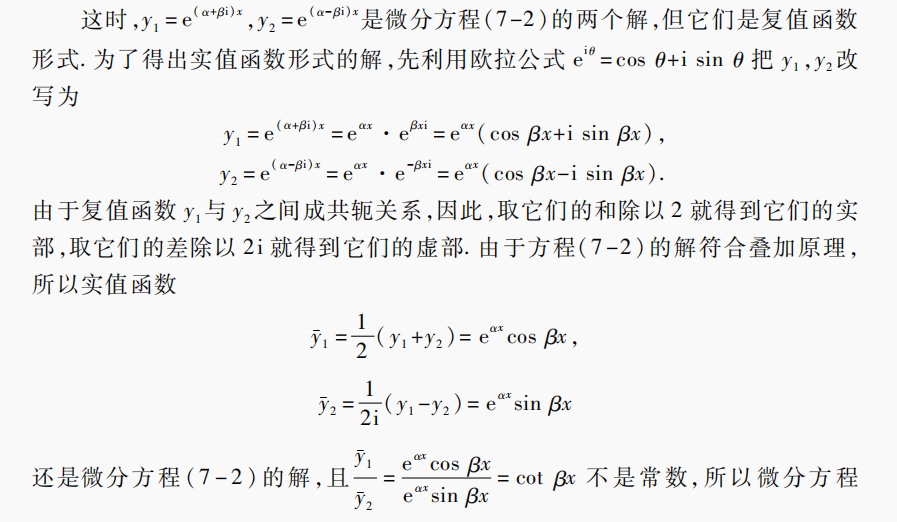

- 微分方程的建立
	- 具体问题的分析，
	- 直接求导，导数定义，
- 微分方程
	- 阶数
		- 称微分方程中*最高阶*导数的次数为微分方程的阶数，
	- 微分方程的解
		- 解的形式
			- 通解
			  collapsed:: true
				- 代入微分方程能使该方程成为恒等式的函数y，
				- n阶微分方程的通解必有*n个待定系数C*，不能在化简后丢解，
				- n阶微分方程可能没有低阶的导数项（如y^{(n)} = x），但其通解仍有n个待定系数C，
			- 初始条件特解
			  collapsed:: true
				- 一般可以根据问题的实际情况，得出确定待定常数的条件；
				- 通过初始条件确定待定常数后，得到的微分方程的解称为对应初始条件的特解，
			- 例外解
			  collapsed:: true
				- 解微分方程时应注意特殊情况，如除数不能为0等；
				- 特殊情况也可能有解，且可能不在通解的范围内，应进一步分析，不能忽略，
				- 示例
				  collapsed:: true
					- 对于方程y' = 2xy^{ 2}，
					- 按分离变量求解，设y ≠ 0，则有 $\dfrac{dy}{y^{2}} = 2xdx$ ，
					- 两侧积分，可得 $-\dfrac{1}{y} = x^{2} + C$ ，
					- 即通解为 $y = -\dfrac{1}{x^{2} + C}$ ，
					- 然而，y = 0的情况也应考虑，
					- 且y = 0时，方程左侧y' = 0 = 右侧，因此y ≡ 0也是一个解，且不在通解 $y = -\dfrac{1}{x^{2} + C}$ 内，
		- 解的结构
			- 齐次方程
				- 若y_{1}，y_{2}是齐次的解，则y_{1}，y_{2}的非零线性组合C_{1}y_{1} + C_{2}y_{2}也是齐次的解，
				- 二阶：若y_{1}，y_{2}是齐次的*线性无关*的解，则y_{1}，y_{2}的非零线性组合C_{1}y_{1} + C_{2}y_{2}就是齐次的通解，
				  collapsed:: true
					- 定理：若y_{1}，y_{2}是二阶齐次方程y'' + p(x)y' + q(x)y = 0的解，则y_{1}，y_{2}线性相关 $\Leftrightarrow \begin{vmatrix}y_{1} & y_{2} \\y'_{1} & y'_{2} \\\end{vmatrix} = 0$ ，
					- （称行列式 $\begin{vmatrix}y_{1} & y_{2} \\y'_{1} & y'_{2} \\\end{vmatrix}$ 为Wronski行列式），
				- n阶：带有n个待定系数C的函数y是n阶微分方程的通解，（即n个线性无关的齐次特解的组合），
			- 非齐次方程
			  collapsed:: true
				- 非齐次特解：一个解，*无待定常数*，
				- 解的叠加定理：若非齐次项f(x)可以写为两个函数f_{1}(x) + f_{2}(x)的和，且y_{1}，y_{2}是对应的非齐次的特解；则y_{1} + y_{2}就是非齐次项f(x)对应的方程的解，
				- 若f_{1}(x) = 0，即y_{1}是齐次的解，y_{2}是非齐次的解，则y_{1} + y_{2}是非齐次的解，
				  collapsed:: true
					- 推广：若y_{0}是齐次的*通解*，y_{1}是非齐次的解，则y_{0} + y_{1}是非齐次的*通解*，
				- 若f_{1}(x) = f_{2}(x)，即y_{1}，y_{2}是非齐次的解，则y_{2} - y_{1}是齐次的解，
		- 唯一性定理
		  collapsed:: true
			- 若p(x), q(x), f(x)均为连续函数，
			- 则微分方程y'' + p(x)y + q(x)y = f(x)在给定初始条件y(x_{0}) = α， y'(x_{0}) = β下的解一定唯一存在，
			- （方程在α = β = 0时一定有唯一零解y ≡ 0），
	- 微分等式的应用
	  collapsed:: true
		- 部分微分方程不能找到解析形式的解；
		- 可以尝试利用等式，分析函数性质；
		- 也可综合解的结构，写出抽象形式的解（如积分上限函数$\int ^{x} _{0} Q(t)dt$），再进行进一步的数学分析，
	- 近似求解
	  collapsed:: true
		- 部分微分方程不能求出精确的解，应尝试近似求解，
		- 可以先将解设定为一类函数（线性，二次函数，对数等），再带入方程，
- 微分方程的求解
	- （一阶）可分离变量的方程
	  collapsed:: true
		- 方程可以分离为f(y)dy = g(x)dx，其中dy/dx = y'，
		- 两侧积分，可得F(y) = G(x) + C，
		- 原理
		  collapsed:: true
			- 设y = y(x)，
			- 由换元积分，可以将y看作变量直接求积分，
			- 左侧$\int f(y) dy = \int f[y(x)]dy(x) = F[y(x)] + C_{1}$ ，
			- 右侧 $\int g(x) dx = G(x) + C_{2}$ ，
			- 待定常数C可以只写在一侧，
		- 分式积分时应注意幂乘关系，
		  collapsed:: true
			- 如$e^{n\ln x + C} = e^{\ln x^{n} + C} = e^{\ln x^{n}}\cdot e^{C} = C'x^{n}$，
			- $\ne e^{n}e^{\ln x} \ne e^{\ln x} + C$，
		- 对数积分应注意绝对值，
		  collapsed:: true
			- 即$\int \frac{1}{x} dx = \ln|x| +C$，
	- （一阶）齐次方程
	  collapsed:: true
		- 概述
		  collapsed:: true
			- 若引入参数t后，方程y' = f(tx, ty) = t^{ n}f(x, y)；即按原方程的形式，可以将t分离出来，则称方程为齐次方程，
			- 此时可设t = 1/x，则y' = f(1, y/x) = 1/x^{ n} f(x, y)，
			- 对于t = 0的情况，可得方程y' = f(y/x)，
		- 标准型：y' = f(y/x)
		  collapsed:: true
			- 换元：设$u = u(x) = \dfrac{y(x)}{x}$，则$y = xu，y' = x'u + u'x = u + x\dfrac{du}{dx}$ ，
			- 代入原方程，可得 $u + x\dfrac{du}{dx} = f(u)$ ，
			- 方程可转化为可分离变量的方程 $\dfrac{dx}{x} = \dfrac{du}{f(u) - u}$ ，
			- 求出u的形式后，再用y/x替代u，即可得原方程的解，
	- 《Bernoulli方程
	- 《全微分方程
	- （一阶）线性
	  collapsed:: true
		- 标准型：y' + p(x)y = q(x)，
		- 分类
			- 齐次q(x) = 0
			  collapsed:: true
				- 等同于可分离变量的方程，即 $\dfrac{dy}{y} = -p(x)dx$ ，
				- 两侧积分，可得 $\ln |y| = -\int p(x)dx$ ，
				- 可得通解： $y = Ce^{-\int p(x)dx}$ ，
				  collapsed:: true
					- 此处C为任意常数，即包括了y的正负情况，也包括了y = 0时的例外解，
			- 非齐次q(x) ≠ 0
			  collapsed:: true
				- （常数变易法）
				  collapsed:: true
					- 将解出的通解中的 C 换成 x 的未知函数u(x)，
					- 然后将新的 y 和 y' 带入原方程，尝试求解未知函数u，
				- 通解： $y = Ce^{-\int p(x)dx} + e^{-\int p(x)dx}\int q(x)e^{\int p(x)dx}dx$ ，
				  collapsed:: true
					- 其形式为齐次同解和一个非齐次特解，
		- （可化为一阶线性的方程）
		  collapsed:: true
			- 伯努利方程
			  collapsed:: true
				- 标准型： $y' + p(x)y = q(x)y^{n}$ ，
				- *分离q(x)*， $\dfrac{y'}{y^{n}} + p(x)y^{1 - n} = q(x)$ ，
				- 即 $\dfrac{1}{n - 1}(y^{1 - n})' + p(x)y^{1 - n} = q(x)$ ，
				- *换元*，令u(x) = y^{ 1 - n}，即有 $\dfrac{1}{n - 1}u' + p(x)u = q(x)$
	- （二阶）可降阶方程
	  collapsed:: true
		- 应注意二阶微分方程一定有2个待定系数；可以将降阶时求得的待定系数逐个记为C_{1}，C_{2}…，避免结果出错，
		- y^{ (n)} = q(x)，
			- 可两侧直接积分求解，
		- y'' = f(x, y')，
		  collapsed:: true
			- 换元，设y' = p(x)，则y'' = p'(x) = dp/dx，
			  collapsed:: true
				- 此处p为关于x的函数，*x为自变量*，
			- 则原方程可降阶为p' = f(x, p)，
			- 若函数p可以解出，则可积分得到原方程的解，
		- y'' = f(y, y')，
		  collapsed:: true
			- 换元，设y' = p，
			  collapsed:: true
				- 此处p为关于y的函数，*y为自变量*，
			- $y''(x) = \dfrac{dp}{dx} = \dfrac{dp}{dy}\dfrac{dy}{dx} = p\dfrac{dp}{dy}$ ，
			- 则原方程可降阶为 $p\dfrac{dp}{dy} = f(y, p)$ ，
			- 若函数p可以解出，则可得到新的一阶微分方程p = y' = g(y)，
	- 《《（二阶）常系数线性
		- 标准型：y'' + py' + qy = f(x)，
		- 基本解
		  collapsed:: true
			- 指数函数和其导数只差常数因子，因此尝试将指数函数作为一个基本解，
			- 将其带入原方程后，可将原方程化为代数方程r^{2} + pr + q = 0，
			- 因此，只要选择满足代数方程的 r ，对应的指数函数就是原微分方程的解，
		- 特征方程
		  collapsed:: true
			- 定义
			  collapsed:: true
				- 称方程r^{k} + p_{1}r^{k-1} + p_{2}r^{k-2} +…p_{k-1}r + p_{k} = 0为 k 阶常系数线性微分方程的特征方程，
				- 方程的解 r 称为特征根，
			- 性质
			  collapsed:: true
				- 特征方程给出的解为*通解*，需要结合*初始条件*才能求出特解，
		- 齐次通解
		  collapsed:: true
			- 特征方程r^{2} + pr + q = 0存在两个不等实根r_{1}，r_{2} \Leftrightarrow 方程有通解$C_{1} e^{r_{1} x} + C_{2} e^{r_{2}x}；C_{1}, C_{2} \in R$，
			- 特征方程r^{2} + pr + q = 0存在两个相等实根r_{0} \Leftrightarrow 方程有通解$(C_{1} + C_{2}x)e^{r_{0} x}；C_{1}, C_{2} \in R$，
			- 特征方程r^{2} + pr + q = 0存在两个共轭复根\alpha \pm i\beta \Leftrightarrow 方程有通解$e^{\alpha x}(C_{1}\cos \beta x + C_{2}\sin \beta x)；C_{1}, C_{2} \in R$，
			  collapsed:: true
				- 即$C_{1} e^{\alpha + i\beta x} + C_{2} e^{\alpha - i\beta x}; C_{1}, C_{2} \in R$，
				- 
		- 非齐次特解
			- 性质
			  collapsed:: true
				- 非齐次的特解和齐次通解的和，为非齐次的通解，
				  collapsed:: true
					- 非齐次的特解是非齐次方程y_{2}'' + py_{2}' + qy_{2} = f(x)的解，但*不是*齐次方程的解，
					- 齐次的通解是齐次方程y_{1}'' + py_{1}' + qy_{1} = 0的解，但*不是*非齐次方程的解，
					- 由微分运算的线性性，可知(y_{1} + y_{2})'' + p(y_{1} + y_{2})' + q(y_{1} + y_{2}) = f(x)，
				- 叠加定理：若非齐次项f(x)可以写为两个函数f_{1}(x) + f_{2}(x)的和，且y_{1}，y_{2}是对应的非齐次的特解；则y_{1} + y_{2}就是非齐次项f(x)对应的方程的解，
			- 特定非齐次项
			  collapsed:: true
				- 非齐次项的形式和参数必须*严格对应*；
				- 其它类型的非齐次项应先转化为特定形式，再拆分为多个方程并求解，
				- 非齐次项$f(x) = e^{\lambda x}P_{m}(x)$，
					- 常数\lambda不是对应的齐次特征方程的根，
					  collapsed:: true
						- 非齐次的特解为$e^{\lambda x}R_{m}(x)$，
						- 其中R_{m}(x)为待定多项式，
					- 常数\lambda是对应的齐次特征方程的单根，
					  collapsed:: true
						- 非齐次的特解为$xe^{\lambda x}R_{m}(x)$，
						- 其中R_{m}(x)为待定多项式，
					- 常数\lambda是对应的齐次特征方程的重根，
					  collapsed:: true
						- 非齐次的特解为$x^{2}e^{\lambda x}R_{m}(x)$，
						- 其中R_{m}(x)为待定多项式，
				- 非齐次项$f(x) = e^{\lambda x}[P_{l}(x)\cos \omega x + Q_{n}(x)\sin \omega x]$，
				  collapsed:: true
					- 复数\lambda + \omega i不是对应的齐次特征方程的根，
					  collapsed:: true
						- 非齐次的特解为$e^{\lambda x}[R^{1}_{m}(x)\cos \omega x + R^{2}_{m}(x)\sin \omega x]$，
						- 其中$R^{1}_{m}(x)，R^{2}_{m}(x)$为待定多项式，
					- 复数\lambda + \omega i是对应的齐次特征方程的根，
					  collapsed:: true
						- 非齐次的特解为 $xe^{\lambda x}[R^{1}_{m}(x)\cos \omega x + R^{2}_{m}(x)\sin \omega x]$ ，
						- 其中$R^{ 1}_{ m}(x)，R^{ 2}_{ m}(x)$为待定多项式，
					- m = max(l, n)，即非齐次项中*可能没有*cos项或sin项，但特解中cos和sin项仍*都需要*写出，
				- 其中，符号P_{m}(x)表示关于x的*m次*多项式：a_{m}x^{m} + a_{m-1}n^{m-1}+…+a_{1}x + a_{0}，a_{i} \in R，
	- （k阶）常系数线性齐次
	  collapsed:: true
		- 对于特征方程r^{k} + p_{1}r^{k-1} + p_{2}r^{k-2} +…p_{k-1}r + p_{k} = 0，
		- k次代数方程有k个根（重根按重数计算），而特征方程的每一个根都对应着通解中的一项，且每项各含一个任意常数，
		- 实根r_{i}：对应解$Ce^{rx}$，
		- k重根r_{j}：对应解$e^{rx}(C_{1} + C_{2}x + …C_{k}x^{k - 1})$，
		- 共轭复根：对应解$e^{\alpha x}(C_{1}\cos \beta x + C_{2}\sin \beta x)$，
		- （k重共轭复根）
	- 《Euler方程
- 求解技巧
	- 微分方程的化简
	  collapsed:: true
		- 化简时应尽量分离导数项y'，
		- x/y代换，
		  collapsed:: true
			- 将x看成y的函数，即$y' = \dfrac{dy}{dx} = \dfrac{1}{\dfrac{dx}{dy}} = \dfrac{1}{x'}$，
			- 解可以为关于y的函数 x = g(y)的形式，
		- 函数带换
		  collapsed:: true
			- 倒代换，
			- 其它函数代换（如指数、对数函数）
			- 解出后应代回x，y，
	- 对于非齐次方程，应先求出齐次通解和非齐次特解并组成非齐次通解，最后再计算待定系数C，
	- n阶微分方程的通解必有*n个待定系数C*，不能在化简后丢解，
	- 应注意题目中可能*隐含*的待定系数的信息，
	- 对于根式和对数函数，求解时应注意绝对值，
	- 微分方程的解的（唯一）要求为不能含有导数项，因此解可以为隐函数（F(x, y) = 0）的形式，
	- 部分特殊形式的微分方程可以直接计算原函数，应注意特定函数（如函数的乘积）的导数的形式，
- （反推原方程）
  collapsed:: true
	- 常见方程：设标准型，寻找线性无关的解，推断特征方程；寻找特解，推测非齐次项；
	- 其它方程：寻找特解和通解（带有待定系数C），求导得到y'，y''，联立函数方程消任意常数，
-
-
-
-
- [[微积分]]
- [[数学分析]]
- [[Science]]