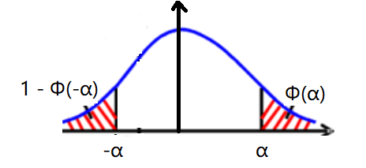

- 参数分布族
	- 基本概念
	  collapsed:: true
		- 分布的定义
		  collapsed:: true
			- 分布的来源（样本空间与事件）
			- 分布的支集
		- 分布的描述
		  collapsed:: true
			- 分布的分布函数与密度函数，分布的参数，参数的取值范围，
			- 分布的数字特征（一般为参数的函数）
	- 一一对应
	  collapsed:: true
		- 常见分布族的分布函数与数字特征，与规定的随机变量支集、参数形式、参数取值一一对应，
		- 若具体数据不完全符合规定信息，则不能直接使用算得的结论，
		- 可以考虑重新设置随机变量，或重新计算密度函数、数字特征，
- 一维分布
	- 离散
	  collapsed:: true
		- 独立重复实验（伯努利试验）
		  collapsed:: true
			- 伯努利分布$b(1, p)$
			  collapsed:: true
				- 定义
					- 来源：1次独立重复实验，实验有且只有两种可能的结果，
					- 支集：$X \in [0, 1]$，X为正整数；定义实验成功时X = 1，实验失败时X = 0，
				- 分布函数
					- $P(X = x) = p^{x}{(1-p)}^{(1-x)}$，
					- 参数：$p \in [0, 1]$，为实验成功的概率，
				- 数字特征
				  collapsed:: true
					- $EX = p$
					- $\operatorname{Var} X = p(1-p)$
					- $M_X(t) = (1-p) + pe^{t}$
			- 二项分布$b(n, p)$
			  collapsed:: true
				- 定义
				  collapsed:: true
					- 来源：n次独立重复实验，实验有且只有两种可能的结果（一般分别称为“成功”“失败”），
					- 支集：$X \in [0, n]$，X为正整数；定义X为实验成功的次数，
				- 分布函数
				  collapsed:: true
					- $P(X = x)= {n \choose x} p^{x}(1-p)^{n-x}$，
					- 参数：$p \in [0, 1]$，为实验成功的概率，
				- 数字特征
				  collapsed:: true
					- $EX = np$
					- $\operatorname{Var} X = np(1-p)$
					- $M_X(t) = {(1 + (pe^{t} - p))}^{n}$
						- 取n \to \infty并求极限，即可算得矩母函数收敛于泊松分布的矩母函数，
					- （众数）
						- 二项分布的pmf在X = [(n + 1)p]处取得极大值，其中[x]为向下取整函数，
			- 几何分布$Geo(p)$
			  collapsed:: true
				- 定义
				  collapsed:: true
					- 来源：独立重复实验，实验有且只有两种可能的结果，
					- 支集：$X \in [1, + \infty)$，X为正整数；定义X为第 1 次成功时，实验的总次数，
					- （应注意X的最小值为1），
				- 分布函数
				  collapsed:: true
					- $P(X = x) = p{(1-p)}^{x-1}$，
					- 参数：$p \in [0, 1]$，为实验成功的概率，
					- 几何分布的cdf比较容易算出，
					- 即$F_{X}(x) = P(X \leq x) = \sum \limits_{i= 1}^{x} P(X \leq i) = \sum \limits_{i= 1}^{x}p{(1-p)}^{i-1} = 1 - {(1-p)}^{x}$，
					- 因此可以得到$P(X > x) = {(1-p)}^{x}$
				- 数字特征
					- $EX = \dfrac{1}{p}$
					- $\operatorname{Var} X = \dfrac{1 - p}{{p}^{2}}$
					- $M_X(t) =  \dfrac{pe^{t}}{1-(1-p)e^{t}}$
				- 性质（无记忆性）
				  collapsed:: true
					- 若$X \sim Geo(p)$，则$P(X = b + \Delta b| X > b) = P(X = \Delta b), (b > 1)$，
					- 定理：若随机变量X的支集为正整数集，则X为几何分布的*充分必要条件*为X具有无记忆性，
			- 帕斯卡分布$PA(r, p)$
			  collapsed:: true
				- 定义
				  collapsed:: true
					- 来源：独立重复实验，实验有且只有两种可能的结果，
					- 支集：$X \in [r, + \infty)$，X为正整数；定义X为第 r 次成功时，实验的总次数，
				- 分布函数
				  collapsed:: true
					- $P(X = x)= {x-1 \choose r-1} p^{r}(1-p)^{x-r}$，
						- 按照定义，结束前的最后一次实验一定是成功的，
						- 所以是从前x - 1次实验中选择r - 1次成功的实验，
						- 即$p \cdot {x-1 \choose r-1} p^{r - 1} (1-p)^{[(x - 1) - (r - 1)]}$，
					- 参数：$p \in [0, 1]$，为实验成功的概率；$r \in [1, + \infty)$，为实验成功的次数，
				- 数字特征
				  collapsed:: true
					- $EX = \dfrac{r}{p}$
					- $\operatorname{Var} X = \dfrac{r(1 - p)}{{p}^{2}}$
					- $M_X(t) =  {(\dfrac{pe^{t}}{1-(1-p)e^{t}})}^{r}$
			- 负二项分布$NB(r, p)$
			  collapsed:: true
				- 导出：若$Y \sim PA(r, p)$，则$X = Y - r \sim NB(r, p)$，
				- 定义
				  collapsed:: true
					- 来源：独立重复实验，实验有且只有两种可能的结果，
					- 支集：$X \in [0, + \infty)$，X为正整数；定义X为第 r 次成功时，实验的*失败次数*，
				- 分布函数
				  collapsed:: true
					- $P(X = x)= {r+x-1 \choose x} p^{r}(1-p)^{x}$
					- 参数：$p \in [0, 1]$，为实验成功的概率；$r \in [1, + \infty)$，为实验成功的次数，
				- 数字特征
				  collapsed:: true
					- $EX = \dfrac{r(1-p)}{p} = \dfrac{r}{p} - r$
					- $\operatorname{Var} X = \dfrac{r(1 - p)}{{p}^{2}}$
					- $M_X(t) =  {(\dfrac{1-(1-p)e^{t}}{p})}^{-r} = {(1 - (\dfrac{1 - p}{p}e^t - \dfrac{1 - p}{p}))}^{-r}$
					  collapsed:: true
						- 取r \to \infty并求极限，即可算得矩母函数收敛于泊松分布的矩母函数，
		- 泊松分布$P(\lambda)$
		  collapsed:: true
			- 定义
			  collapsed:: true
				- 泊松过程
				  collapsed:: true
					- 较短的时间$(t_i + \Delta t)$内，事件发生的概率与等待*时长*$(\Delta t)$成正比，而与开始等待的*时刻*$(t_i)$无关；
					- 不同时间段内，事件的发生相互独立；
					- *充分小*的时间内，事件只可能发生一次，
					- 则给定时间内，事件发生的次数服从泊松分布，
				- （历史上，泊松分布是为了近似计算n较大，p较小的二项分布而由泊松引入的，因而有对应的泊松定理；然而，后续的研究发现，很多情景都可由泊松分布建模），
				- 支集：$X \in [0, +\infty]$，X为正整数，定义X的值为事件发生的次数，
			- 分布函数
			  collapsed:: true
				- $P(X = x)=e^{-\lambda} \dfrac{\lambda^{x}}{x !}$
				- 参数：$\lambda \in (0, +\infty]$，\lambda可以不为整数，
			- 数字特征
			  collapsed:: true
				- $EX = \lambda$，
					- 因此泊松分布的参数\lambda，可以解释为单位时间内事件发生的次数，
				- $\operatorname{Var} X = \lambda$
				- $M_X(t) =e^{\lambda(e^{t} - 1)}$
				- （众数）
				  collapsed:: true
					- 泊松分布的pmf在X = [\lambda]处取得极大值，其中[x]为向下取整函数，
		- 离散均匀分布$U(m)$
		  collapsed:: true
			- 定义
			  collapsed:: true
				- 一次实验，实验有m种可能结果（取值），每种结果*可能性相同*，
				- 支集：$X \in [1, m]$，X为正整数，定义X的值为实验的结果，
			- 分布函数
			  collapsed:: true
				- $P(X = x) = \dfrac{1}{m}$
				  id:: 628c2d5c-4b1e-487e-ab2d-81880d093912
				- 参数：$m \geq 1, m \in N^{+}$，为实验的可能结果的最大值，
			- 数字特征
			  collapsed:: true
				- $EX = \dfrac{m + 1}{2}$
				- $\operatorname{Var} X = \dfrac{m^{2} -1 }{12}$
		- 超几何分布$HG(n, N, M)$
		  collapsed:: true
			- 定义
			  collapsed:: true
				- 来源：N件产品，M件次品，不放回抽取n件产品，
				- 支集：$X \in [0, M]$，X为正整数，定义X为抽到的n件产品中次品的个数，
			- 分布函数
			  collapsed:: true
				- $P(X = x) = \dfrac{{M \choose x}{N - M \choose n - x}}{{N \choose n}}$，
					- 其正则性可由组合数代数运算求得，
					- 类似范德蒙组合数恒等式，
			- 数字特征
			  collapsed:: true
				- $EX = n\dfrac{M}{N}$
				- $\operatorname{Var} X = n\dfrac{M}{N} (1 - \dfrac{M}{N}) \dfrac{N - n}{n - 1}$
	- 连续
		- 均匀分布$U(a, b)$
		  collapsed:: true
			- 导出
			  collapsed:: true
				- 设X为随机变量，支集为(a, b)，
				- 若X在任意一段区间内的取值概率，都与该区间的长度（测度）成正比；
				- 即$\lim\limits_{{\Delta x} \to 0}  \dfrac{P(x \leq X \leq x + {\Delta x})}{\Delta x} = \dfrac{1}{b - a}$，
				  collapsed:: true
					- $\lim\limits_{{\Delta x} \to 0}  \dfrac{P(x \leq X \leq x + {\Delta x})}{\Delta x} = \lim\limits_{{\Delta x} \to 0}  \dfrac{F(x + {\Delta x}) - F(x)}{\Delta x} =  F'(x) = f(x) = \dfrac{1}{b - a}$
				- 则X为(a, b)上的均匀分布，
			- 分布函数
			  collapsed:: true
				- $f(x) = \dfrac{1}{b - a}$，参数a \le b；a, b \in R，
				- X的支集为$a \leq X \leq b$，
			- 数字特征
			  collapsed:: true
				- $EX = \dfrac{a + b}{2}$
				- $\operatorname{Var} X = \dfrac{{(b - a)}^{2}}{12}$
				- $M_X(t) =\dfrac{e^{bt} - e^{at}}{(b - a)t}$
		- 正态分布$N(\mu, {\sigma}^{2})$
		  collapsed:: true
			- 来源（误差分布）
			  collapsed:: true
				- 基本设定
				  collapsed:: true
					- $X_{1}, X_{2},…,X_{i}$为独立同分布随机变量；
					- X_{i}的均值（数学期望）为常数\mu，概率密度函数为$p(X_{i})$，
					- 因此，X_{i}的误差为$X_{i} - \mu$也为随机变量，且其概率密度函数为$p(X_{i} - \mu)$，
					  collapsed:: true
						- 假设函数$p(x)$满足pdf的基本性质，且连续可导，
						- 经验表明函数$p(x)$关于x = 0对称，
				- 假设
				  collapsed:: true
					- 未知参数\mu取观察值的平均值$\overline{X} = \dfrac{\sum X_{i}}{n}$时，关于误差随机变量的似然函数L有最大值，
					- 即$\dfrac{dL}{d\mu} |_{\mu = \bar{x}} = 0$，
				- 推导
				  collapsed:: true
					- 似然函数
					  collapsed:: true
						- 似然函数（样本联合分布）$L(\mu) = \prod p(X_{i} - \mu)$，
						  id:: 628c3c13-8747-4140-9bab-bd189e94fa37
						- 对数似然函数为$\ln L(\mu) = \sum \ln p(X_{i} - \mu)$，
					- 求导
					  collapsed:: true
						- 则$\dfrac{d\ln L(\mu)}{d\mu} = \dfrac{d\sum \ln p(x_{i} - \mu)}{d\mu} = \sum \dfrac{p'(x_{i} - \mu)}{p(x_{i} - \mu)}$，
					- 极值点的性质
					  collapsed:: true
						- 设$g(x_{i} - \mu) = \dfrac{p'(x_{i} - \mu)}{p(x_{i} - \mu)}$，则$\dfrac{d\ln L(\mu)}{d\mu} = \sum g(x_{i} - \mu)$，
						  id:: 628c40b9-86f1-4936-a315-5f7021543e04
						- 根据假设，$\mu = \bar{x}$时为极值点，因此应有$\sum g(x_{i} - \bar{x}) = 0$，
					- （函数方程）
					  collapsed:: true
						- 分别取i = 2，i = 3，可得等式$g(x) = -g(-x)，g(x) + g(y) = g(x + y)$，
						- 由柯西函数方程的性质可知，上述函数方程的解一定为$g(x) = bx$，
					- 微分方程
					  collapsed:: true
						- 因此，有微分方程$bx = \dfrac{p'(x)}{p(x)}$，可解得$p(x) = e^{\frac{b}{2}x^{2} + c}$，
				- 正则化
				  collapsed:: true
					- 已知密度函数$p(x)$的形式为$e^{\frac{b}{2}x^{2} + c} = Ke^{\frac{b}{2}x^{2}}$，
					- 为了使p(x)满足pdf的基本性质，可知应有$b < 0$，此处设$b = -\dfrac{1}{{\sigma}^{2}}$，
					- 由pdf在R上积分为1，可解得$K = \dfrac{1}{\sqrt{2\pi} \sigma}$，
					- 最后，可得密度函数$p(x)=\dfrac{1}{\sqrt{2 \pi} \sigma} e^{-\frac{1}{2 \sigma^{2}}x^{2}}$，
			- 分布函数
			  collapsed:: true
				- $f(x)=\frac{1}{\sqrt{2 \pi} \sigma} e^{-\frac{(x-\mu)^{2}}{2 \sigma^{2}}}$，
				- 支集：$X \in R$，
				- 参数：$\mu \in R，\sigma^{2} > 0$，
			- 性质
			  collapsed:: true
				- 对称性$f(x - \mu) = f(\mu - x)$，即$P(X - \mu \leq k) = P(\mu -X \leq k)$，
				- 对于标准正态分布的cdf，有$\Phi(x) = 1 - \Phi(-x)$，
				- $f(x)$的驻点为$x = \mu$，且极值为$\dfrac{1}{\sigma\sqrt{2\pi}}$，
				- $f(x)$的拐点为$x =\mu \pm \sigma$，
				- 3\sigma原则
				  collapsed:: true
					- 若$X \sim N(\mu, {\sigma}^{2})$，
					- 则$P(\mu - \sigma < X < \mu + \sigma) = P(-1 < \dfrac{X - \mu}{\sigma} < 1) = \Phi(1) - \Phi(-1) \approx 0.683$，
					- $P(\mu - 2\sigma < X < \mu + 2\sigma) \approx 0.954$，
					- $P(\mu - 3\sigma < X < \mu + 3\sigma) \approx 0.997$，
					- 即正态随机变量X的取值几乎全部集中在区间(\mu - 3\sigma，\mu + 3\sigma)之内，
				- 独立（可以不同参数）的正态随机变量的线性函数构成的随机变量仍为正态分布（正态分布的可加性），且其协方差为0等价于独立，
			- 数字特征
			  collapsed:: true
				- $EX = \mu$
				- $\operatorname{Var} X = \sigma^{2}$
				- $\varphi_X(t) =e^{i\mu t - \frac{{\sigma}^{2}{t}^{2}}{2}}$
				- 其它
				  collapsed:: true
					- 若$X \sim N(0, 1)$，则$\Phi(\alpha) = 1 - \Phi(-\alpha)$，
					  collapsed:: true
						- {:height 120, :width 250}
					- 若$X \sim N(\mu, {\sigma}^{2})$，则$E[\Phi(X)] = \Phi(\dfrac{\mu}{\sqrt{1 + \sigma^2}})$，
					  collapsed:: true
						- 此处\Phi(x)为标准正态分布的分布函数，
						- 可通过将期望算式$\int^{+\infty}_{-\infty}(\int^{x}_{-\infty}\frac{1}{\sqrt{2 \pi}} e^{-\frac{t^{2}}{2}}dt)\frac{1}{\sqrt{2 \pi} \sigma} e^{-\frac{(x-\mu)^{2}}{2 \sigma^{2}}}dx$，
						- 看成二元正态的概率$\int^{+\infty}_{-\infty}\int^{x}_{-\infty}\frac{1}{\sqrt{2 \pi}}\frac{1}{\sqrt{2 \pi} \sigma} e^{-\frac{y^{2}}{2} -\frac{(x-\mu)^{2}}{2 \sigma^{2}}}dydx$，
						- 即求解P(Y < X)；X \sim N(\mu, \sigma^{2})，Y \sim N(0, 1)，X，Y独立，
						- 化简后可得结论，
					- 若$X \sim N(0, 1)$，则可由矩母函数求出$E(X^{2k - 1} = 0), E(X^{2k} =2^{-k} \dfrac{(2k)!}{k!})$，
			- 计算
			  collapsed:: true
				- 标准化思想：对于任意正态分布$N(\mu, {\sigma}^2)$，计算时应首先考虑将其标准化$\frac {X- \mu}{\sigma}$，并利用标准正态分布的结论计算，
				- 正态分布的cdf没有闭形式，可以直接写为\Phi(x)的形式，
		- 正态分布的导出分布
		  collapsed:: true
			- （折叠正态分布）
			  collapsed:: true
				- 若$Y  \sim N(\mu, \sigma^{2})$，则称$X = |Y - \mu| + \mu$具有折叠正态分布；
				- 分布函数
				  collapsed:: true
					- $f(x)=\frac{2}{\sqrt{2 \pi} \sigma} e^{-\frac{1}{2 \sigma^{2}}(x-\mu)^{2}}$，
					- X的支集为$(\mu, + \infty)$，
				- 数字特征
				  collapsed:: true
					- $EX =\sqrt{\dfrac{2}{\pi}}\sigma + \mu$，
					- $\operatorname{Var} X = \dfrac{\pi - 2}{\pi} {\sigma}^{2}$，
			- 对数正态分布$\ln N(\mu, {\sigma}^{2})$
			  collapsed:: true
				- 导出（一一变换）
				  collapsed:: true
					- 若$Y \sim N(\mu, \sigma^{2})$，则$X = e^{Y} \sim \ln N(\mu, {\sigma}^{2})$，
				- 分布函数
				  collapsed:: true
					- $f(x)=\frac{1}{\sqrt{2 \pi} \sigma x} e^{-\frac{1}{2 \sigma^{2}}(\ln x-\mu)^{2}}$，
					- X的支集为$(0, + \infty)$，
					- 参数：\mu \in R，\sigma^{2} > 0；但两者不再为数字特征的值，
				- 数字特征
				  collapsed:: true
					- $EX = E[e^{Y}] = M_{Y}(1) = e^{\mu+ \frac{{\sigma}^{2}}{2}}$
					- $\operatorname{Var} X = e^{2 \mu + {\sigma}^{2}}(e^{\sigma^{2}} -1)$
					- 矩母函数不存在，
			- t分布$t(n)$
			  collapsed:: true
				- 定义
				  collapsed:: true
					- 独立的*标准正态*分布统计量与卡方分布统计量的比值为t分布，
					- 若$X \sim N(0, 1)$，$Y \sim {\chi}^{2}(n)$，则随机变量$\dfrac{X}{\sqrt{Y / n}} \sim t(n)$，
				- 分布函数
				  collapsed:: true
					- $f_{T}(t) = \dfrac{\Gamma(\frac{n + 1}{2})}{\Gamma(\frac{n}{2})}\dfrac{1}{{(n \pi)}^{\frac{1}{2}}}\dfrac{1}{{(1 + \frac{{t}^{2}}{n})}^{\frac{n + 1}{2}}}$，
					- 参数$n \in N^{+}$，称为自由度，
				- （极限分布）
				  collapsed:: true
					- 取n \to \infty，则有$\lim\limits_{n \to \infty}\dfrac{1}{{(1 + \frac{{t}^{2}}{n})}^{\frac{n + 1}{2}}} = \dfrac{1}{e^{\frac{t^{2}}{2}}} = {e^{-\frac{t^{2}}{2}}}$，
					- 由Stirling公式和\Gamma函数的性质，可得前面的系数的极限值为$\dfrac{1}{\sqrt{2\pi}}$，
					- 所以t分布以标准正态分布为极限分布，
				- n = 1时的 t 分布为Cauchy分布，
				- 数字特征
				  collapsed:: true
					- 可由$t = \dfrac{X}{\sqrt{Y / n}}$算出，
					  collapsed:: true
						- 也可根据定义，对pdf进行积分，
						- 可以通过换元$t = \tan \alpha$，转换为三角函数积分，
					- $ET = 0，(n > 1)$，
					- $\operatorname{Var}T = \dfrac{n}{n - 2}，(n > 2)$，
					- 矩母函数不存在，
			- F分布$F(m, n)$
			  collapsed:: true
				- 定义
				  collapsed:: true
					- 两个独立的卡方分布统计量的比值为F分布，
					- 若$X \sim {\chi}^{2}(m)$，$Y \sim {\chi}^{2}(n)$，则随机变量$\dfrac{X / m}{Y / n} \sim F(m, n)$，
				- 分布函数
				  collapsed:: true
					- $f_{F}(x) = \dfrac{\Gamma(\frac{m + n}{2})}{\Gamma(\frac{m}{2})\Gamma(\frac{n}{2})}{(\dfrac{m}{n})}^{\frac{1}{2}}\dfrac{{x}^{\frac{m}{2} - 1}}{{(1 + \frac{m}{n}x)}^{\frac{m + n}{2}}}$，
					- 参数$m, n \in N^{+}$，称为自由度，
				- 数字特征
				  collapsed:: true
					- 可由$F = \dfrac{X / m}{Y / n}$算出，
					- $EF = \dfrac{n}{n - 2}(n > 2)$（与m无关），
					- $E{F}^{k} = \dfrac{\Gamma(\frac{m}{2}+k)\Gamma(\frac{n}{2}-k)}{\Gamma(\frac{m}{2})\Gamma(\frac{n}{2})}{(\frac{n}{m})}^{k}$，
					  collapsed:: true
						- $E{F}^{k} = E{X}^{k}E{(\frac{1}{Y})}^{k}{(\frac{n}{m})}^{k} = E({X}^{k})E({Y}^{-k}){(\frac{n}{m})}^{k}$，
					- 矩母函数不存在，
		- 伽马分布$Ga(\alpha, \beta)$
			- 定义（泊松过程）
			  collapsed:: true
				- 随机变量
				  collapsed:: true
					- 随机变量R：给定时间内，事件发生的次数，
					- 随机变量W：事件发生了r次时的总时间，
				- 事件
				  collapsed:: true
					- 事件r：事件R至少发生了r次，即$\{R \geq r\}$，
					- 事件w：事件R发生了r次时，过去的时间（最大）为w，即$\{W \leq w\}$，
					- 由随机变量的设置，可知两个事件等价（互为子集），
					- 即$P(W \leq w) = P(R \geq r)$，
				- 概率计算
				  collapsed:: true
					- 若R为泊松过程，则有$R \sim P(\lambda w)$，
					- 因此，$P(R \geq r)= 1- P(R < r) = \sum\limits_{i = 0}^{r-1}e^{-\lambda w} \dfrac{{(\lambda w)}^{i}}{i !}$，
					- 即$P(W \leq w) = F_{W}(w) = \sum\limits_{i = 0}^{r-1}e^{-\lambda w} \dfrac{{(\lambda w)}^{i}}{i !}$，
					- 对w（逐项）求导，即可得到$p(w) = \dfrac{\lambda^{r}}{{\Gamma(r)}} {w}^{r-1}{e}^{-\lambda w}$，
					- 即W的分布为$Ga(r, \lambda)$，
				- 推广：指数分布
				  collapsed:: true
					- 若将事件r分成r个独立事件来看，W表示每两个事件之间的间隔时间，
					- 则可知R = R_{1} + R_{1} +… +R_{r}，且R_{i}为独立同分布的随机变量，
					- R_{i}的分布就是$Ga(1, \lambda)$，即指数分布$Exp(\lambda)$，
				- 参数间的关系
				  collapsed:: true
					- 三个参数\lambda，r，w中；\lambda为确定常数，
					- r为泊松分布的实现值，为伽马分布的参数，
					- w为伽马分布的实现值，为泊松分布的参数，
			- \Gamma函数
			  collapsed:: true
				- 定义
				  collapsed:: true
					- 由积分定义的*关于n*的函数：$\Gamma(n) = \int _{0}^{+\infty}{t}^{n - 1}{e}^{-t}dt$；
					- 其定义域为$n \in (0, + \infty)$，
					- 应注意定义中t的指数项为n - 1，
					- 可以看成阶乘函数往实数集R上的推广，
				- 性质
				  collapsed:: true
					- 递推公式$\Gamma(n) = (n-1)\Gamma(n-1), n\in (1, + \infty)$,
					- $\int _{0}^{+\infty}{t}^{m - 1}{e}^{-{t}^{2}}dt = \frac{1}{2}\Gamma({\frac{m}{2}})$
					  collapsed:: true
						- 可通过换元算得$\int _{0}^{+\infty}{t}^{m - 1}{e}^{-{t}^{2}}dt = \frac{1}{2}\int _{0}^{+\infty}{u}^{\frac{m}{2} - 1}{e}^{-u}du$，
					- 阶乘公式$(n\in N^{+})$
					  collapsed:: true
						- $\Gamma(n) = (n-1)!$,
						- $(2n)!! = \Gamma(n + 1)2^{n}$,
						- $(2n - 1)!! = \dfrac{\Gamma (2n)}{\Gamma(n)2^{n-1}}$,
				- 常用函数值
				  collapsed:: true
					- $\Gamma(2) = \Gamma(1) = 1$,
					  id:: 628c5cd9-f5bf-4337-a9f5-384901f2ae59
					- $\Gamma(\frac{1}{2}) = \sqrt{\pi}$,
					- $\Gamma(\frac{3}{2}) = \frac{1}{2}\Gamma(\frac{1}{2}) = \frac{\sqrt{\pi}}{2}$,
			- 与泊松分布的关系
			  collapsed:: true
				- 恒等式
				  collapsed:: true
					- $\sum \limits _{x = 0}^{m}\dfrac{{\lambda}^{x}e^{-\lambda}}{x!} = \dfrac{1}{\Gamma(m + 1)}\int_{\lambda}^{+ \infty}y^{(m + 1) - 1}e^{-y}dy$，
					  collapsed:: true
						- 同理，也有$\sum \limits _{x = m}^{+\infty}\dfrac{{\lambda}^{x}e^{-\lambda}}{x!} = \dfrac{1}{\Gamma(m)}\int_{0}^{\lambda}y^{m - 1}e^{-y}dy$，
				- 即P(X \le m) = P(Y > \lambda)；X \sim P(\lambda)，Y \sim \Gamma(m + 1, 1)，
				- 泊松分布的cdf的计算
				  collapsed:: true
					- 若$X \sim P(\lambda)$，则 X = m时，$F_{X}(m) = P_{X}(X \leq m) = P_{Y}(Y > \lambda)$，
					- 其中$Y \sim \Gamma(m + 1, 1)$，
				- 伽马分布与卡方分布
				  collapsed:: true
					- 上式可进一步写为$P_{Y}(Y > \lambda) = P(\chi^{2} > 2\lambda)$，
					- 其中$\chi^{2} \sim \chi^{2}(2m + 2)$，
				- （反推伽马分布）
				  collapsed:: true
					- 若$X \sim \Gamma(\alpha, \beta)$，则$P(X \leq m) = P(Y \geq \alpha)$，
					  collapsed:: true
						- $P(X \leq m) =\dfrac{{\beta}^{\alpha}}{\Gamma(\alpha)}\int_{0}^{m}x^{\alpha - 1}e^{-{\beta}x}dx$，
						- 换元，设$t = \beta x, x = \frac{1}{\beta}t$，
						- 化简为$P(X \leq m) = \dfrac{1}{\Gamma(\alpha)}\int_{0}^{{\beta}{m}}{t}^{\alpha - 1}e^{-t}dt$，
						- 由恒等式$\dfrac{1}{\Gamma(\alpha)}\int_{0}^{\lambda}t^{\alpha - 1}e^{-t}dt = \sum \limits _{x = \alpha}^{+\infty}\dfrac{{\lambda}^{y}e^{-\lambda}}{y!}$，
						- 可得$Y \sim P({\beta}{m})$，
					- 其中$Y \sim P({\beta}{m})$，
			- 分布函数
			  collapsed:: true
				- $f(x) = \dfrac{\beta^{\alpha}}{{\Gamma(\alpha)}} {x}^{\alpha-1}{e}^{-\beta x}$；参数$\alpha > 0，\beta > 0$，
				  collapsed:: true
				  id:: 630f5876-fc60-46f3-874f-49b1ef9fb730
					- 有时也写为$f(x) = \dfrac{1}{{\Gamma(\alpha)}\beta^{\alpha}} {x}^{\alpha-1}{e}^{-\frac{x}{\beta}}$，
					- 一般两种参数可直接转换，但使用时应保持一致性
				- X的支集为 (0, + \infty)，
			- 数字特征
				- $EX = \dfrac{\alpha}{\beta}$
				- $E{X}^{k} = \dfrac{\Gamma(\alpha + k)}{\Gamma(\alpha)}(\dfrac{1}{\beta})^{k}$，k > -\alpha，
				- $\text{Var} X = \dfrac{\alpha}{{\beta}^{2}}$
				- $M_X(t) ={(\dfrac{1}{1 -  \dfrac{t}{\beta}})}^{\alpha}, t < \dfrac{1}{\beta}$
			- 逆伽马分布$Ga^{-1}(\alpha, \beta)$
			  collapsed:: true
				- 将伽马分布中的 x 换为 1 / x，即为逆伽马分布，
				- $f(x) = \dfrac{\beta^{\alpha}}{{\Gamma(\alpha)}} {x}^{-(\alpha + 1)}{e}^{-\frac{\beta}{x}}$；参数$\alpha > 0，\beta > 0$，
				- X的支集为 (0, + \infty)，
				- $E{X}^{k} = \dfrac{\Gamma(\alpha - k)}{\Gamma(\alpha)}{\beta}^{k}, k > -\alpha$，
		- 特例：χ2分布${\chi}^{2}(n)$
		  collapsed:: true
			- 定义（标准正态分布）
			  collapsed:: true
				- 设随机变量 X 为n个独立同分布的*标准正态*变量的平方和，称 X 的分布为自由度为n的\chi^{2}分布，
				- ${\chi}^{2}(n) = \Gamma(\dfrac{n}{2}, \dfrac{1}{2})$，
			- 分布函数
			  collapsed:: true
				- $f(x) = \dfrac{({\frac{1}{2}})^{\frac{n}{2}}}{{\Gamma(\frac{n}{2})}} {x}^{\frac{n}{2}-1}{e}^{-\frac{x}{2}}$；参数$n > 0$，
				- X的支集为$(0, + \infty)$，
			- 数字特征
			  collapsed:: true
				- $EX = n$，$E{X}^{-1} = \dfrac{1}{n - 2}$，
				- $E{X}^{k} = \dfrac{\Gamma(\frac{n}{2} + k)}{\Gamma(\frac{n}{2})}{2}^{k}, k > -\dfrac{n}{2}$
				- $\operatorname{Var} X = 2n$
				- $M_X(t) ={(\dfrac{1}{1 - 2t})}^{\frac{n}{2}}, t < \dfrac{1}{2}$
		- 特例：指数分布$\text {Exp}(\lambda)$
		  collapsed:: true
			- 定义（故障率函数）
			  collapsed:: true
				- 设X为产品的寿命，t为已使用时间，
				- 若\Delta t时间内，产品“失效”（即X的取值在区间t + \Delta t内）的概率与时间长度为线性关系，
				- 即$\lambda = \lim\limits_{{\Delta x} \to 0} \dfrac {P(x \leq X \leq x + {\Delta x}|X \geq x)}{\Delta x}$，
				  collapsed:: true
					- 恒等变形
					  collapsed:: true
						- $\lim\limits_{{\Delta x} \to 0} \dfrac {P(x \leq X \leq x + {\Delta x}|X \geq x)}{\Delta x} = \lim\limits_{{\Delta x} \to 0} \dfrac {P(x \leq X \leq x + {\Delta x})}{P(X \geq x)\Delta x} = \lim\limits_{{\Delta x} \to 0}  \dfrac{F(x + {\Delta x}) - F(x)}{(1 - F(x))\Delta x}$，
						- $\lim\limits_{{\Delta x} \to 0}  \dfrac{F(x + {\Delta x}) - F(x)}{\Delta x} = \lambda (1 - F(x))$，
						- $F'(x) = f(x) = \lambda (1 - F(x))$，
					- 微分方程
					  collapsed:: true
						- $F(x) + \dfrac{1}{\lambda}F'(x) - 1 = 0$
						- 解得$y = 1 - e^{-\lambda x + C} = 1 - Ce^{-\lambda x}$，
				- 则X服从指数分布$\text {Exp}(\lambda)$，其密度函数为$\lambda {e}^{-\lambda x}$，
			- 分布间的关系
			  collapsed:: true
				- $\text {Exp}(\lambda) = \Gamma(1, \lambda)$，
				- ${\chi}^{2}(2) = \Gamma(1, {\frac{1}{2}}) = \text {Exp}({\frac{1}{2}})$，
			- 密度函数
			  collapsed:: true
				- X的支集为$(0, + \infty)$，参数$\lambda > 0$，
				- $f(x) = \lambda {e}^{-\lambda x}$，
				- $P(X > x) = 1 - F(x) = {e}^{-\lambda x}$，为X在不小于x之后继续“生存”的概率，
			- 数字特征
			  collapsed:: true
				- $EX = \dfrac{1}{\lambda}$，$\operatorname{Var} X =  \dfrac{1}{{\lambda}^{2}}$
				- $E{X}^{k} = {\Gamma(k + 1)}(\dfrac{1}{\lambda})^{k}$，k > -1，
				- $M_X(t) ={\dfrac{1}{1 -  \dfrac{t}{\lambda}}}, t < \dfrac{1}{\lambda}$
				- 参数估计
				  collapsed:: true
					- $E{X}^{-1}$不存在，因此$\dfrac{1}{X}$不是无偏估计量，
					- 一种解决方法为选择两个（或以上）的样本，
					- 如设$Y = X_{1} + X_{2}$，则$Y \sim \Gamma(2, {\lambda})$，因此$EY^{-1} = \lambda$，
					- 即$\dfrac{1}{X_{1} + X_{2}}$为参数 \lambda的无偏估计量，
			- （另一种写法）
			  collapsed:: true
				- $f(x) = \frac{1}{\lambda}{e}^{-\frac{x}{\lambda}}$，
				- $EX = \lambda$，$\text{Var} X = {\lambda}^{2}$
				- $P(X > x) = 1 - F(x) = {e}^{-\frac{x}{\lambda}}$，为X在不小于x之后继续“生存”的概率，
				- 参数估计
				  collapsed:: true
					- 由于$EX = \lambda$，所以X是参数 \lambda的无偏估计量，
			- 无记忆性
			  collapsed:: true
				- 若$X \sim Exp(\lambda)$，则$P(X>b + \Delta b|X>b) = P(X> \Delta b), (b >0)$，
		- 指数分布的导出分布
		  collapsed:: true
			- 拉普拉斯分布（双指数分布）$LA(\mu, \sigma)$
			  collapsed:: true
				- 导出（非一一变换）
				  collapsed:: true
					- 若$Y_{1}, Y_{2} \sim Exp(\sigma)$，且Y_{1}, Y_{2}独立；则$Y= Y_{1} - Y_{2} \sim LA(0, \sigma)$，
					- 若$Y \sim LA(0, \sigma)$，则$X = Y + \mu \sim LA(\mu, \sigma)$，
				- 分布函数
				  collapsed:: true
					- $f(x) = \frac{1}{2\sigma}{e}^{-|\frac{x - \mu}{\sigma}|}$；参数$\mu \in R, \sigma > 0$，
					- X的支集为R，
				- 数字特征
				  collapsed:: true
					- $EX = \mu$
					  collapsed:: true
						- $EX = E(Y + \mu) = E(Y_{1} - Y_{2} + \mu) = EY_{1} - EY_{2} + E\mu = \mu$，
					- $\operatorname{Var} X = 2{\sigma}^{2}$
					  collapsed:: true
						- $\operatorname{Var} X = \operatorname{Var} (Y_{1} - Y_{2} + \mu) = \operatorname{Var}Y_{1} + \operatorname{Var} Y_{2}  = 2{\sigma}^{2}$
					- $M_X(t) =\dfrac{e^{\mu t}}{1 -{(\sigma t)}^{2}}, |t| < \dfrac{1}{\sigma}$
					  collapsed:: true
						- $M_X(t) = E({e}^{tX}) = E({e}^{t(Y_{1} - Y_{2} + \mu)}) = E{e}^{tY_{1}}E{e}^{-tY_{2}}E{e}^{t\mu} = \dfrac{1}{1 - \sigma t}\dfrac{1}{1 + \sigma t} {e}^{t\mu} = \dfrac{e^{\mu t}}{1 -{(\sigma t)}^{2}}$，
						  id:: 62904c14-afcd-43d5-bd8e-ba769c457807
			- 位置族指数分布$Exp(\mu, \lambda)$
			  collapsed:: true
				- 导出（一一变换）
				  collapsed:: true
					- 若$Y \sim Exp(\lambda)$，则$X = Y + \mu \sim Exp(\mu, \lambda)$，
				- 分布函数
				  collapsed:: true
					- $f(x) = \frac{1}{\lambda}{e}^{-\frac{x - \mu}{\lambda}}$；参数$\mu \in R, \lambda > 0$，
					- X的支集为$(\mu, + \infty)$，
				- 数字特征
				  collapsed:: true
					- $EX = \lambda + \mu$
					  collapsed:: true
						- $EX = E(Y + \mu)  = EY + E(\mu) = \lambda + \mu$
					- $\operatorname{Var} X = {\lambda}^{2}$
					  collapsed:: true
						- $\operatorname{Var} X = \operatorname{Var} (Y + \mu) = \operatorname{Var} Y ={\lambda}^{2}$
					- $E{(X - \mu)}^{k} = E{Y}^{k} = {\Gamma(k + 1)}{\lambda}^{k}, k > -1$
					- $M_X(t) =  \dfrac{e^{\mu t}}{1 - \lambda t}, t < \dfrac{1}{\lambda}$
					  collapsed:: true
						- $M_X(t) = E({e}^{tX}) = E({e}^{t(Y + \mu)}) = E{e}^{tY} E{e}^{t \mu} =  \dfrac{e^{\mu t}}{1 - \lambda t}, t < \dfrac{1}{\lambda}$
			- 韦布尔分布$W(\gamma, \lambda)$
			  collapsed:: true
				- 导出（一一变换）
				  collapsed:: true
					- 若${Y} \sim Exp(\lambda)$，则$X = {Y}^{\frac{1}{\gamma}} \sim W(\gamma, \lambda)$，
					- （注意${Y}^{\frac{1}{\gamma}} \neq {Y}^{-\gamma}$），
				- 分布函数
				  collapsed:: true
					- $f(x) = \frac{\gamma}{\lambda} {x}^{\gamma - 1} {e}^{-\frac{{x}^{\gamma}}{\lambda}}$；参数$\gamma > 0, \lambda > 0$，
					- X的支集为$(0, + \infty)$，
				- 数字特征
				  collapsed:: true
					- $EX = E{Y}^{\frac{1}{\gamma}} =  {\Gamma({\frac{1}{\gamma}} + 1)}{\lambda}^{{\frac{1}{\gamma}}}$
					- $\operatorname{Var} X = \operatorname{Var} ({Y}^{{\frac{1}{\gamma}}}) = E{Y}^{{\frac{2}{\gamma}}} - (E{Y}^{{\frac{1}{\gamma}}})^{2}$
					- $E{X}^{k} = E{{Y}^{{\frac{k}{\gamma}}}} = {\Gamma({\frac{k}{\gamma}} + 1)}{\lambda}^{{\frac{k}{\gamma}}}, k > -\gamma$
					- （矩母函数较复杂，一般不常用），
			- 帕累托分布$PR(\alpha, \beta)$
			  collapsed:: true
				- 导出（一一变换）
				  collapsed:: true
					- 若${Y} \sim Exp({\beta})$，则$X = \alpha {e}^{Y} \sim PR(\alpha, \beta)$，
				- 分布函数
				  collapsed:: true
					- $f(x) = \dfrac{\beta {\alpha}^{\beta}}{{x}^{\beta + 1}}$；参数$\alpha > 0, \beta > 0$，
					- $F(x) = 1 - \dfrac{\alpha^{\beta}}{x^{\beta}}$，
					- X的支集为$(\alpha, + \infty)$，
				- 数字特征
				  collapsed:: true
					- $EX = \dfrac{\beta\alpha}{\beta - 1}$，\beta > 1，
					- $E{X}^{k} = \dfrac{\beta{\alpha}^{k}}{\beta - k}$，\beta > k，
					  collapsed:: true
						- $E{X}^{k} = E{(\alpha {e}^{Y})}^{k} = {\alpha}^{k} E{e}^{kY} ={\alpha}^{k} \dfrac{1}{1 - (\frac{1}{\beta} \cdot k)} = \dfrac{\beta{\alpha}^{k}}{\beta - k}$，
					- $\operatorname{Var} X = E{X}^{2} - ({EX})^{2} = \dfrac{\beta{\alpha}^{2}}{{(\beta - 1)}^{2}{(\beta - 2)}}$，\beta > 2，
					- 矩母函数不存在
		- 贝塔分布$\Beta({\alpha}, {\beta})$
		  collapsed:: true
			- 导出
			  collapsed:: true
				- 若$Y_{1} \sim \Gamma({\alpha}, \gamma)$，$Y_{2} \sim \Gamma({\beta}, \gamma)$，且二者独立；
				- 则$X = \dfrac{Y_{1}}{{Y}_{1} + {Y}_{2}} \sim \Beta({\alpha}, {\beta})$，且X与*Y1 + Y2*独立，
				- 应注意Y_{1}和Y_{1} + Y_{2}不独立，
			- B函数
			  collapsed:: true
				- 定义
				  collapsed:: true
					- 由积分$\int _{0}^{1}{x}^{\alpha - 1}{(1 - x)}^{\beta - 1}dx$定义的关于\alpha, \beta的二元函数\Beta(\alpha, \beta)，
					- 其定义域为$\alpha \in (0, + \infty) ，\beta \in (0, + \infty)$，
				- 性质
				  collapsed:: true
					- $\Beta(\alpha, \beta) = \Beta(\beta, \alpha)$，
					- $\Beta(\alpha, \beta) = \dfrac{\Gamma(\alpha)\Gamma(\beta)}{\Gamma(\alpha + \beta)}$，
			- 与二项分布的关系
			  collapsed:: true
				- 恒等式
				  collapsed:: true
					- $\sum \limits _{x = 0}^{m}{n \choose x}{p^{x}}{(1-p)^{n - x}} = \dfrac{n!}{(n - (m + 1))!((m + 1) - 1)!}\int_{p}^{1}y^{(m + 1) - 1}(1 - y)^{n - (m + 1)}dy$，
					  collapsed:: true
						- 其中，$\dfrac{n!}{(n - m)!(m - 1)!} = \dfrac{1}{\Beta(n - m + 1, m)}$，
						- 同理，也有$\sum \limits _{x = m}^{n}{n \choose x}{p^{x}}{(1-p)^{n - x}} = \dfrac{n!}{(n - m)!(m - 1)!}\int_{0}^{p}t^{m - 1}(1 - t)^{n - m}dt$，
					- 即$P(X \le m) = P(Y > p)$，其中X \sim b(n, p)，Y \sim Be(m + 1, n - (m + 1) + 1)，
				- 二项分布的cdf计算
				  collapsed:: true
					- 若$X \sim b(n, p)$，则X = m时，$F_{X}(m) = P_{X}(X \leq m) = P_{Y}(Y > p)$，
					  collapsed:: true
						- 可由恒等式算得$\sum \limits _{x = 0}^{m}{n \choose x}{p^{x}}{(1-p)^{n - x}} = \dfrac{n!}{(n - (m + 1))!((m + 1) - 1)!}\int_{p}^{1}t^{(m + 1) - 1}(1 - t)^{n - (m + 1)}dt$，
						- 右侧$=  \dfrac{n!}{(n - m - 1)!m!}\int_{p}^{1}t^{(m + 1) - 1}(1 - t)^{(n - m) - 1}dt = P_{Y}(Y > p)$，
					- 其中$Y \sim \Beta(m + 1, n - m)$，
				- 贝塔分布和F分布
				  collapsed:: true
					- 上式可进一步写为$P_{Y}(Y > p) = P(F > \dfrac{p}{1 - p} \dfrac{n - m}{m + 1})$，
					- 其中$F \sim F(2m + 2, 2n - 2m)$，
			- 分布函数
			  collapsed:: true
				- $f(x) = \dfrac{1}{\Beta(\alpha, \beta)}{x}^{\alpha - 1}{(1-x)}^{\beta -1} = \dfrac{\Gamma(\alpha + \beta)}{\Gamma(\alpha)\Gamma(\beta)}{x}^{\alpha - 1}{(1-x)}^{\beta -1}$；
				  collapsed:: true
					- 应注意pdf中为B函数的*倒数*，
				- 参数$\alpha \in (0, + \infty) ，\beta \in (0, + \infty)$，
				- X的支集为[0, 1]，
			- 数字特征
			  collapsed:: true
				- $EX = \dfrac{\alpha}{\alpha + \beta}$
				- $\operatorname{Var} X = \dfrac{\alpha\beta}{{(\alpha + \beta)}^2{(\alpha + \beta + 1)}}$
				- $EX^{k} =  \dfrac{{\Gamma(\alpha + k)}{\Gamma(\alpha + \beta)}}{{\Gamma(\alpha)}{\Gamma(\alpha + \beta + k)}}$，
				  collapsed:: true
					- 直接计算
					  collapsed:: true
						- 由贝塔分布的分布函数，可知$EX^{k} = \int_{0}^{1} {x}^{k} \dfrac{1}{\Beta(\alpha, \beta)}{x}^{\alpha - 1}{(1-x)}^{\beta -1}dx = \dfrac{1}{\Beta(\alpha, \beta)} \int_{0}^{1} {x}^{\alpha + k - 1}{(1-x)}^{\beta -1}dx$，
						- 由B函数的定义，可知$EX^{k} =  \dfrac{\Beta(\alpha + k, \beta)}{\Beta(\alpha, \beta)} = \dfrac{{\Gamma(\alpha + k)}{\Gamma(\alpha + \beta)}}{{\Gamma(\alpha)}{\Gamma(\alpha + \beta + k)}}$，
					- 基于独立性和伽马分布
					  collapsed:: true
						- $EX^{k} = E{(\dfrac{Y_{1}}{{Y}_{1} + {Y}_{2}})}^{k}$，
						- 由于X与*Y1 + Y2*独立，可以将期望写为$\dfrac{E{Y_{1}}^{k}}{{E({Y}_{1} + {Y}_{2})}^{k}}$
						  collapsed:: true
							- 随机变量$\frac{X}{Y}$，Y独立时，$E(\frac{X}{Y}) = \frac{E(X)} {E(Y)}$，
						- 由伽马分布的公式，可得$EX^{k} = \dfrac{\dfrac{\Gamma(\alpha + k)}{\Gamma(\alpha)}{\gamma}^{k}}{\dfrac{\Gamma(\alpha + \beta + k)}{\Gamma(\alpha + \beta)}{\gamma}^{k}} = \dfrac{{\Gamma(\alpha + k)}{\Gamma(\alpha + \beta)}}{{\Gamma(\alpha)}{\Gamma(\alpha + \beta + k)}}$，
				- 矩母函数形式较复杂，
		- Cauchy分布$\text {Cau}(\mu, {\sigma})$
		  collapsed:: true
			- 导出
			  collapsed:: true
				- 若$Y_{1} \sim N(0, 1)$，$Y_{2} \sim N(0, 1)$，且二者独立；则$X = \dfrac{Y_{1}}{|{Y}_{2}|} \sim Cau(0, 1)$，
				- 自由度为1的t分布就是$Cau(0, 1)$，
			- 分布函数
			  collapsed:: true
				- $f(x) = \dfrac{1}{\pi\sigma}\dfrac{1}{1 + {(\frac{x - \mu}{\sigma})}^{2}}$，参数：$\mu \in R，\sigma > 0$，
				- 支集：$X \in R$，
			- 数字特征
			  collapsed:: true
				- 柯西分布的任意阶矩都不存在，
				- 柯西分布的矩母函数不存在，特征函数为${e}^{i\mu t - \sigma |t|}$，
				- 参数\mu为柯西分布的中位数，\mu \pm \sigma为柯西分布的上，下四分位数，
			- 性质
			  collapsed:: true
				- 可加性：若$X_{1} \sim Cau(\mu_{1}, {\sigma}_{1})$，$X_{2} \sim Cau(\mu_{2}, {\sigma}_{2})$，且两者独立；则$X_{1} + X_{2} \sim Cau(\mu_{1} + \mu_{2}, {\sigma}_{1} + {\sigma}_{2})$
				  id:: 62919670-ab59-42cc-8076-10deb85aa857
				- 柯西分布的抽样
				  collapsed:: true
					- 由可加性可知，若样本$X_{i} \sim Cau(\mu, {\sigma})$，则统计量$\bar{X} \sim Cau(\mu, {\sigma})$，
					- 即样本均值的离散度（柯西分布没有方差）不会因样本数量n而变化，
		- Logistic分布$\text {Log}(\mu, \beta)$
		  collapsed:: true
			- 导出
			  collapsed:: true
				- 标准逻辑斯蒂函数
				  collapsed:: true
					- 标准逻辑斯蒂函数可以写为e^{-x}的幂级数相加，
					- 即$\dfrac{1} {{1 +{e}^{-x}}} = \sum\limits_{n=0}^{\infty}{(-1)}^{n}{e}^{-nx} = 1 -{e}^{-x} + {e}^{-2x} -{e}^{-3x}+…+{e}^{-nx}+…$
			- 分布函数
			  collapsed:: true
				- $F(x) = \dfrac{1} {{1 + {e}^{-\frac{x - \mu}{\beta}}}}$，
				- $f(x) = \dfrac{1}{\beta}\dfrac{{e}^{-\frac{x - \mu}{\beta}}} {{(1 + {e}^{-\frac{x - \mu}{\beta}})}^{2}}$；参数$\mu \in R, \beta > 0$，
				- 支集$X \in R$，
			- 数字特征
			  collapsed:: true
				- $EX = \mu$
				  collapsed:: true
					- 反常积分$\int_{0}^{+\infty}\dfrac{1} {1 + {e}^{-x}} dx= \lim\limits_{x \rightarrow +\infty} x - \ln 2$发散，
					- 均值积分$\int_{0}^{+\infty}\dfrac{x{e}^{-x}} {{(1 + {e}^{-x})}^{2}}dx =\int_{0}^{+\infty}xd\dfrac {1} {1 + {e}^{-x}} = \lim\limits_{x \rightarrow +\infty} x -  (\lim\limits_{x \rightarrow +\infty} x - \ln 2) = \ln 2$收敛，
					- 且函数$\dfrac{x{e}^{-x}} {{(1 + {e}^{-x})}^{2}}$为奇函数，
					- 所以均值为\mu，
				- $\operatorname{Var} X = \dfrac{{\pi}^{2}{\beta}^{2}}{3}$
				  collapsed:: true
					- 方差积分$\int_{-\infty}^{+\infty}\dfrac{{x}^{2}{e}^{-x}} {{(1 + {e}^{-x})}^{2}}dx$收敛，且函数$\dfrac{{x}^{2}{e}^{-x}} {{(1 + {e}^{-x})}^{2}}dx$为偶函数，
					- 所以$\int_{-\infty}^{+\infty}\dfrac{{x}^{2}{e}^{-x}} {{(1 + {e}^{-x})}^{2}}dx = 2\int_{0}^{+\infty}\dfrac{{x}^{2}{e}^{-x}} {{(1 + {e}^{-x})}^{2}}dx$
					- 将pdf*写为无穷级数*，cdf $\dfrac{1} {{1 +{e}^{-x}}} = \sum\limits_{n=0}^{\infty}{(-1)}^{n}{e}^{-nx}$，
					- 所以pdf$\dfrac{{e}^{-x}} {{(1 + {e}^{-x})}^{2}}dx = (\sum\limits_{n=0}^{\infty}{(-1)}^{n}{e}^{-nx})' = \sum\limits_{n=1}^{\infty}n{(-1)}^{n-1}{e}^{-nx}$,
					- 因此积分可写为$\int_{0}^{+\infty}\dfrac{{x}^{2}{e}^{-x}} {{(1 + {e}^{-x})}^{2}}dx = \int_{0}^{+\infty}{x}^{2}\sum\limits_{n=1}^{\infty}n{(-1)}^{n-1}{e}^{-nx}dx$
					- （*交换积分与和号*），即$\int_{0}^{+\infty}{x}^{2}\sum\limits_{n=1}^{\infty}n{(-1)}^{n-1}{e}^{-nx}dx = (\sum\limits_{n=1}^{\infty}n{(-1)}^{n-1})(\int_{0}^{+\infty}{x}^{2}{e}^{-nx}dx)$，
					- 积分可根据伽马函数算出，即$\sum\limits_{n=1}^{\infty}n{(-1)}^{n-1}\dfrac{2}{{n}^{3}} = 2 \sum\limits_{n=1}^{\infty}{(-1)}^{n-1}\dfrac{1}{{n}^{2}}$
					- 由常用级数的和，可以得到$\operatorname{Var} X = \int_{-\infty}^{+\infty}\dfrac{{x}^{2}{e}^{-x}} {{(1 + {e}^{-x})}^{2}}dx = 4 \sum\limits_{n=1}^{\infty}{(-1)}^{n-1}\dfrac{1}{{n}^{2}} =4  \cdot \dfrac{{\pi}^{2}}{12} = \dfrac{{\pi}^{2}}{3}$
				- $M_X(t) = e^{\mu t}\Gamma(1 - \beta t)\Gamma(1 + \beta t), |t| < \dfrac{1}{\beta}$
- （一维）分布之间的关系
	- 可加性
	  collapsed:: true
		- 需要随机变量间的*独立*作为前提，
		- 可以由特征函数的性质证明，
		  collapsed:: true
			- 若X_{i}相互独立，则$\varphi_{\Sigma X_{i}}(t) = \prod \varphi_{X_{i}}(t)$；但其逆命题不成立，
		- 离散
		  collapsed:: true
			- 二项分布$b(n_i, p)$
			  collapsed:: true
				- 二项分布$b(n, p)$可表示为n个独立同分布的二点分布之和，
			- 帕斯卡分布$PA(r_i, p)$
			  collapsed:: true
				- 帕斯卡分布$PA(r, p)$可表示为r个独立同分布的几何分布之和，
				- 负二项分布也有可加性，但不能由几何分布直接相加得到，
			- 泊松分布$P(\lambda _i)$，
		- 连续
		  collapsed:: true
			- 伽马分布$Ga(\alpha_i, \beta)$，
			  collapsed:: true
				- χ2分布$\chi^2 (n_i)$，
				- 指数分布关于参数λ无可加性，但分布参数相同时，有$\sum X_i \sim \Gamma(n, \lambda)$，
			- 正态分布$N(\mu_i, \sigma_i^2)$，
			- @柯西分布$Cau(\mu_{i}, {\sigma}_{i})$，
	- 概率积分变换定理
	  collapsed:: true
		- 设随机变量X的cdf为F_{x}(x)，则随机变量$Y= F(X) \sim U(0,1)$，
		- 反之，若$X \sim U(0,1)$，则随机变量$Y = F^{-1}_Y(X)$的cdf为$F_Y(y)$，
		- 随机数
		  collapsed:: true
			- 可根据概率积分变换定理，由均匀分布的随机数，生成其它概率分布的随机数，
			- 然而前提为分布函数的反函数$F^{-1}_{X}(x)$需要有解析形式的表达式，但实际上大部分分布都难以做到；需要其它的数值计算方法，
			- Box - Muller变换
			  collapsed:: true
				- 用于生成标准正态分布的随机数，
				- 设X，Y \sim U(0, 1)，且X，Y独立，
				- 设随机变量$U = \sqrt{-2\ln Y}\cos(2\pi X)，V = \sqrt{-2\ln Y}\sin(2\pi X)$，
				- 则U，V \sim N(0, 1)，且U，V独立，
		- （故障率函数）
		  collapsed:: true
			- 设随机变量X的cdf为F_{x}(x)，
			- 定义$R(x) = - \ln(1 - F_{X}(x)) = \ln \dfrac{1}{1 - F_{X}(x)}$，
			- 则随机变量$Y= R(X) \sim Exp(1)$，
	- 《《分布间的关系
		- 需要随机变量间的*独立*作为前提，
		- 离散
		  collapsed:: true
			- 若$X \sim b(n,p)$，则$n -X \sim b(n,1-p)$，
			- 若$X \sim b(n,p)，Y \sim nb(r,p)$，则$P_{Y}(Y \leq n - r) = 1 - P_{X}(X \leq r - 1)$，
			- （泊松定理）
			- 泊松翻转（多层模型）
			  collapsed:: true
				- n次独立重复实验，实验成功的概率为参数$p \in [0, 1]$，
				- 记X为成功的试验次数，Y为失败的试验次数；可知X与Y不独立，
				- 然而， 若设实验次数为随机变量，且$N \sim P(\lambda)$，
				- 则此时X，Y独立，且$X \sim P(\lambda p), Y \sim P(\lambda(1 - p))$，
				- 证明
				  collapsed:: true
					- 根据定理，需要证明$P(X = x, Y = y) = P(X = x)P(Y = y)$,
					- 引入第三变量后，可以将联合分布写为$P(X = x, Y = y, N = n)$,
					- 写为条件分布形式，即$P(X = x, Y = y|N = n)P(N = n)$，
					- *条件分布可以写为*$P(X = x, Y = n - x|N = n) = {n \choose x}{p}^{x}{(1-p)}^{n - x} = {{x + y} \choose x}{p}^{x}{(1-p)}^{y} = \dfrac{(x + y)!}{x!y!}{p}^{x}{(1-p)}^{y}$，
					- N的分布为$P(N = n) = \dfrac{{\lambda}^{n}}{n!}{e}^{-\lambda}$，
					- 所以，联合分布为$\dfrac{(x + y)!}{x!y!}{p}^{x}{(1-p)}^{y}\dfrac{{\lambda}^{n}}{n!}{e}^{-\lambda} = \dfrac{(x + y)!}{x!y!}\dfrac{{\lambda}^{x + y}}{{x + y}!}{p}^{x}{(1-p)}^{y}{e}^{-\lambda}$，
					- 上式可以拆为$\dfrac{{(\lambda p)}^{x}}{x!}{e}^{-\lambda p}\dfrac{{(\lambda(1 - p))}^{y}}{y!}{e}^{-\lambda(1 - p)}$，
			- Beta定理的离散形式
			  collapsed:: true
				- 若$X_i \sim P(\lambda_i)$，且Xi之间相互独立，
				- 则$Y_{i} = (X_i|X_i +X_j) \sim b(n,\pi_i)，\pi_i = \dfrac{\lambda_i} {\lambda_i +\lambda_j}$,
				- 对于多元，$(X_1,X_2...,X_k|\sum\limits_{i =1}^{k} X_i) \sim MN(n,\pi)$，
				- \pi为参数向量$(\pi_1,\pi_2...,\pi_k)，\pi_i = \dfrac{\lambda_i} {\sum\limits_{i =1}^{k} \lambda_i}$，
		- 连续
			- 正态分布
			  collapsed:: true
				- 若$X \sim N(\mu, \sigma^2)$，则$X - a  \sim N(\mu - a, \sigma^2)$，$bX  \sim N(b\mu, b^2\sigma^2)$，
				- 标准化：$X \sim N(\mu, \sigma^2)$，则$\dfrac{X - \mu} {\sigma} \sim N(0,1)$，
				- 若$X \sim N(0,1)$，则$X^2 \sim \chi^2(1)$，
				  collapsed:: true
					- 卡方分布的定义，
					- 应注意支集从R变换到了(0, + \infty)，
				- 若$X,Y \sim N(0,1)$，则$\dfrac{X} {|Y|} = \dfrac{X} {\sqrt {Y^2}}\sim t(1), Cau(0,1)$，
			- 伽马分布
			  collapsed:: true
				- $X \sim \Gamma(\alpha, \beta)$，则$Y = kX \sim \Gamma(\alpha, \dfrac{\beta}{k})$，
				  collapsed:: true
					- 特例：$Y = 2\beta X \sim \chi^2(2\alpha)$；反之，${\chi}^{2}(n) = \Gamma(\dfrac{n}{2}, \dfrac{1}{2})$，
					- 特例：$X \sim \text {Exp}(\lambda)$，则$\lambda X \sim \Gamma(1, 1)$；$2\lambda X \sim \Gamma(1, \dfrac{1}{2}) \to {\chi}^{2}(2)$，
				- 伽马-贝塔
				  collapsed:: true
					- 定理：若$X \sim \Gamma(\alpha_1, \beta)，Y \sim \Gamma(\alpha_2, \beta)$，则$Z =\dfrac{X} {X+Y} \sim \Beta(\alpha_1, \alpha_2)，\dfrac{Y} {X+Y} \sim \Beta(\alpha_2, \alpha_1)$，
					  collapsed:: true
						- Z与X + Y独立，（Z的分布不依赖于β，X+Y为β的充分统计量），
						- 可用于构造分布不依赖于β的统计量，
						- 对于$X \sim \chi^2(m)，Y \sim \chi^2(n)$，有$\dfrac{X} {X+Y} \sim \Beta(\dfrac{m} {2}, \dfrac{n} {2}）$，可进一步推广为F统计量，
				- 伽马-F
				  collapsed:: true
					- 定理：若$X \sim \Gamma(\alpha_1, \beta)，Y \sim \Gamma(\alpha_2, \beta)$，则$F = \dfrac{X}{Y} \dfrac{{\alpha}_{2}}{{\alpha}_{1}}\sim F(2{\alpha}_{1}, 2{\alpha}_{2})$，
						- $F = \dfrac{{2\beta}X / 2{\alpha}_{1}}  {{2\beta} Y / 2{\alpha}_{2}} = \dfrac{X}{Y} \dfrac{{\alpha}_{2}}{{\alpha}_{1}}$
					- 特例：$X \sim \text{Exp}(\lambda)，Y \sim \text{Exp}(\eta)$，则$F = \dfrac{X}{Y}\dfrac{\lambda}{\eta} \sim F(2, 2)$，
				- 贝塔-F
				  collapsed:: true
					- 两者都是伽马分布（卡方分布）的比值，因此存在一定关系，
					- 若$X \sim \Beta(m, n)$，则$F = \dfrac{X} {1-X} \dfrac{n} {m} \sim F(2m, 2n)$，
					- 若$F \sim F(m, n)$，则$\Beta = \dfrac {\dfrac{m} {n}F} {1 + \dfrac{m} {n} F} \sim \Beta(\dfrac{m} {2}, \dfrac{n} {2})$，
			- 贝塔分布
			  collapsed:: true
				- 若$X \sim \Beta(\theta, 1)$，则$-\ln X \sim Exp(\theta)$，
				- 若$X \sim \Beta(m, n)$，则$Y = 1 - X \sim Be(n, m)$，
			- t分布与F分布
			  collapsed:: true
				- 若$X \sim t(n)$，则${X}^{2} \sim F(1, n)$，
				- 若$F \sim F(m, n)$，则$\dfrac{1}{F} \sim F(n, m)$，
			- 均匀分布
			  collapsed:: true
				- 若$X \sim U(0, \theta)$，Yn为最大次序统计量，则似然比统计量$\Lambda = {(\dfrac{Y_n} {\theta_0})}^n$的准确分布为$-2\ln \Lambda \sim \chi^2(2)$，
				- 若$X \sim U(0, 1)$，则极差$Y_n - Y_1 \sim Be(n-1, 2)$，
				- 若$X \sim U(0, 1)$，则次序统计量$Y_j \sim Be(j, n-j+1)$，
	- 分布间的近似
	  collapsed:: true
		- 泊松定理
			- 二项分布的泊松分布近似
			  collapsed:: true
				- 当二项分布的参数n较大，*p较小*时，
				- 二项分布可以用泊松分布近似，即参数（均值）$np \sim \lambda$，
				- （由于p较小，也有方差$np(1-p) \sim \lambda$），
			- （负二项分布的泊松分布近似）
			  collapsed:: true
				- 当负二项分布的参数r较大，*p较大*（接近于1）时，
				- 负二项分布nb(r, p)也可用泊松分布近似，即参数（均值）$\dfrac{r(1-p)}{p} \sim \lambda$，
				- （由于p较大，也有方差$\dfrac{r(1-p)}{p^2} \sim \lambda$），
				-
			- 可由分布的矩母函数计算n \rightarrow \infty时的极限得到，
		- 中心极限定理
		  collapsed:: true
			- 二项分布的正态分布近似（棣莫弗-拉普拉斯中心极限定理）
				- 连续性校正
		- （超几何分布的二项分布近似）
		  collapsed:: true
			- 若产品数N较大，而抽取的数量n较小，则可近似看成次品率$\frac{M}{N}$不变的有放回抽样，
			- 即$HG(n, N, M) \sim b(n, \frac{M}{N})$，
- 多维分布
	- 离散
	  collapsed:: true
		- 独立重复实验的推广
			- 三点分布（二维）
			  collapsed:: true
				- 定义
				  collapsed:: true
					- 来源：1次独立重复实验，实验有且只有三种可能的结果（X，Y，Z），
					- 支集：$(X, Y) \in \{(1, 0), (0, 1), (0, 0)\}$；
					- 定义实验成功为1，实验失败为0；即(1, 0)表示结果为X，(0, 1)表示结果为Y，(0, 0)表示结果为Z，
				- 分布函数
				  collapsed:: true
					- $P((X = x, Y = y)) = p_{1}^{x}p_{2}^{y}{(1- p_{1} - p_{2})}^{(1-x - y)}$，
					- 参数：$p_{1} , p_{2} \in [0, 1]$，且$p_{1} + p_{2} \in [0, 1]$，p_{1}为实验结果为X的概率，p_{2}为实验结果为Y的概率，
			- 多点分布$MN(1, p)$
				- 定义
				  collapsed:: true
					- 来源：1次独立重复实验，实验有k种*互斥*的可能结果，记为$\begin{pmatrix}X_{1} & X_{2} & ... & X_{k} \end{pmatrix}$
					- 支集
						- $X_{i} \in \{0, 1\}$；
						- 定义实验结果为第i种时对应的X_{i} = 1，其它的X_{i} = 0，即$\sum\limits_{i=1}^k X_i = 1$（一次实验只可能出现一种结果），
				- 分布函数
				  collapsed:: true
					- $P(X_{1}, X_{2}, ...X_{k}) = {p}_{1}^{{x}_{1}}{p}_{2}^{{x}_{2}}...{p}_{k}^{{x}_{k}}$，
					- 参数：$p_{i} \in [0, 1]$，为第i种结果出现的概率，且$\sum\limits_{i=1}^{k} p_i = 1$
				- 数字特征
				  collapsed:: true
					- $X = {\begin{pmatrix}X_{1} & X_{2} & ... & X_{k} \end{pmatrix}}^{T}$，
					- $p = {\begin{pmatrix}p_{1} & p_{2} & ... & p_{k} \end{pmatrix}}^{T}$，
					- $\Lambda_{p} = \begin{pmatrix} p_{1} & & \\ &\ddots & \\ & & p_{k} \\ \end{pmatrix}$，
					- 向量期望：$EX = p$
					- 方差-协方差矩阵（k阶）：$\operatorname{Var} X = \Lambda_{p} -{p}{p}^{T}$
			- 多项分布$MN(n, p)$
				- 定义
				  collapsed:: true
					- 来源：n次独立重复实验，每次实验有k种*互斥*的可能结果，记为$\begin{pmatrix}X_{1} & X_{2} & ... & X_{k} \end{pmatrix}$
					- 支集
						- $X_{i} \in [0, n]$，X_{i}为正整数；
						- X_{i}为第i种结果出现的次数，且$\sum\limits_{i=1}^{k} x_i = n$，
				- 分布函数
				  collapsed:: true
					- $P(X_{1}, X_{2}, ...X_{k}) = \dfrac{n!}{x_1 !x_2 !...x_k !} {p}_{1}^{{x}_{1}}{p}_{2}^{{x}_{2}}...{p}_{k}^{{x}_{k}}$
					- （正则性）
					  collapsed:: true
						- 由多项式定理，${(p_1 + p_2 + … + p_k)}^{n} = \sum\limits_{x_{1} + x_{2} + ...+x_{k} = n} \dfrac{n!}{x_1 !x_2 !...x_k !} p_{1}^{x_{1}}p_{2}^{x_{2}}...p_{k}^{x_{k}}$，
						- 求和项为所有使$\sum\limits_{i=1}^{k} x_i = n$的X_{i}，
						- 由于$\sum\limits_{i=1}^{k} p_i = 1$，
						- 因此$\sum\limits_{x_{1} + x_{2} + ...+x_{k} = n} P(X_{1}, X_{2}, ...X_{k}) = {(p_1 + p_2 + … + p_k)}^{n} = 1^{n} =1$，
					- 参数
					  collapsed:: true
						- $p_{i} \in [0, 1]$，为第i种结果出现的概率，且$\sum\limits_{i=1}^{k} p_i = 1$，
						- X_{i}与p_{i}一一对应，
				- 数字特征
				  collapsed:: true
					- $X = {\begin{pmatrix}X_{1} & X_{2} & ... & X_{k} \end{pmatrix}}^{T}$，
					- $p = {\begin{pmatrix}p_{1} & p_{2} & ... & p_{k} \end{pmatrix}}^{T}$，
					- $\Lambda_{p} = \begin{pmatrix} p_{1} & & \\ &\ddots & \\ & & p_{k} \\ \end{pmatrix}$，
					- 向量期望：$EX = np$
					- 方差-协方差矩阵：$\operatorname{Var} X = n(\Lambda_{p} -{p}{p}^{T})$
					- （由于多项分布具有可加性，因此其数字特征就是对应的n个多点分布的数字特征之和），
		- （三维超几何分布）
	- 连续
		- [[矩阵论]]
		- 标准多元正态$N(0, I)$
		  collapsed:: true
			- 标准n元正态可以拆分为n个标准正态分布相乘，
			- 分布函数
				- $f(z_{1}, z_{2}, \ldots, z_{n})={(2 \pi)^{-\frac{n}{2}}} {e}^{-\frac{1}{2}{z}^{T}I^{-1}{z}}$，
				- 正则性：$\int_{R}…\int_{R} f(\vec{z}) dz_{1}…dz_{n} = \int_{{\mathbb{R}}^{n}}  f(\vec{z}) dz^{n} = \prod \int_{R}f(z_{i}) dz_{i} = 1$，
			- 数字特征
			  collapsed:: true
				- $E\vec{Z} = \vec{0}$，
				  collapsed:: true
					- $E{Z}_{i} = \int_{R}z_{i}f(z_{i}) dz_{i} = 0$，
				- $\operatorname{Var} \vec{Z} = I$，
				  collapsed:: true
					- $\operatorname{Var} \vec{X} = E(\vec{Z} - \vec{0})(\vec{Z} - \vec{0})^{T} = E[\vec{Z} \vec{Z}^{T}]$，
					- $=E\begin{pmatrix} z_{1}^{2} & z_{1}z_{2} & \cdots & z_{1}z_{n} \\z_{2}z_{1} & z_{2}^{2} & \cdots & z_{2}z_{n} \\ \vdots & \vdots & & \vdots \\ z_{n}z_{1} & z_{n}z_{2} & \cdots & z_{n}^{2} \\ \end{pmatrix} = I$ ，
					- $Ez_{i}z_{j} = Ez_{i} \cdot Ez_{j} = 0，Ez_{i}^{2} = \int_{R}z_{i}^{2}f(z_{i}) dz_{i} = 1$，
				- $\varphi_Z(t) =e^{- \frac{1}{2} {\vec{t}}^{T}{\vec{t}}}$，
		- 多元正态分布$N(\mu, {\Sigma})$
		  collapsed:: true
			- 定理：若$\vec{Z} \sim N(0, I)$，则$\vec{X} = {\Sigma}^{\frac{1}{2}}\vec{Z} + \vec{\mu} \sim N(\vec{\mu}, \Sigma)$，其中|\Sigma| \ne 0，
			  collapsed:: true
				- 反之，若$\vec{X} \sim N(\vec{\mu}, \Sigma)$，则$Z = {\Sigma}^{-\frac{1}{2}}{(\vec{X} - \vec{\mu})} \sim N(0, I)$，
				- 应注意进行变换的矩阵为${\Sigma}^{-\frac{1}{2}}$，并非${\Sigma}$，
			- 分布函数
			  collapsed:: true
				- $f(x_{1}, x_{2}, \ldots, x_{n})={(2 \pi)^{-\frac{n}{2}}}|\Sigma|^{-\frac{1}{2}} \exp [-\frac{1}{2}(\vec{x}-\vec{\mu})^{T} \Sigma^{-1}(\vec{x} - \vec{\mu})]$，
				- 支集：$\vec{X} \in \mathbb{R}^{n}$，其中$\vec{X} = \begin{pmatrix}X_1 & X_2 & ... & X_n \end{pmatrix} ^T$，
				- 参数
				  collapsed:: true
					- $\vec{\mu} \in \mathbb{R}^{n}$，其中$\vec{\mu} = \begin{pmatrix}\mu_{1} & \mu_{2} & ... & \mu_{n} \end{pmatrix} ^T$
					- \Sigma为方差-协方差矩阵，为半正定对称矩阵（应注意pdf中为\Sigma^{-1}），
					- |\Sigma|为方差-协方差矩阵的行列式（标量），（应注意pdf中为|\Sigma|^{-1/2}）
				- 特例
				  collapsed:: true
					- 二元正态分布
					  collapsed:: true
						- 均值向量$\vec{\mu} = \begin{pmatrix}\mu_{1} & \mu_{2}\end{pmatrix} ^T$
						- 相关系数${\rho} = \dfrac{\operatorname{Cov}[X, Y]}{\sqrt{\operatorname{Var}X}\sqrt{\operatorname{Var}Y}}$，
						- 方差-协方差矩阵$\Sigma = \begin{pmatrix} {\sigma}_{1}^{2} & \rho{\sigma}_{1}{\sigma}_{2} \\ \rho{\sigma}_{2}{\sigma}_{1} & {\sigma}_{2}^{2}  \\ \end{pmatrix}$，
						- 行列式$|\Sigma| = (1 - {\rho}^{2}) {\sigma}_{1}^{2}{\sigma}_{2}^{2}$，
						- 所以${\Sigma}^{-1} = \dfrac{1}{(1 - {\rho}^{2}) }\begin{pmatrix} {\sigma}_{2}^{2} & -\rho{\sigma}_{1}{\sigma}_{2} \\ -\rho{\sigma}_{2}{\sigma}_{1} & {\sigma}_{1}^{2}  \\ \end{pmatrix}$，$|\Sigma|^{-\frac{1}{2}} = \dfrac{1}{\sqrt{1 - {\rho}^{2}} {\sigma}_{1}{\sigma}_{2}}$，
						-
					- 所有分量独立同方差
					  collapsed:: true
						- 此时$\Sigma^{-1} =  \begin{pmatrix} \frac{1}{{\sigma}^{2}} & & \\ &\ddots & \\ & & \frac{1}{{\sigma}^{2}} \\ \end{pmatrix} = \dfrac{1}{{\sigma}^{2}}I$，
						- 分布函数为$f(\vec{x})={(2 \pi)^{-\frac{n}{2}}}{\sigma}^{-n} \exp [-\frac{1}{2{\sigma}^{2}}(\vec{x}-\vec{\mu})^{T} (\vec{x} - \vec{\mu})] = {(2 \pi)^{-\frac{n}{2}}}{\sigma}^{-n} \exp [-\frac{1}{2{\sigma}^{2}}\sum(x_{i} - \mu_{i})^{2}]$，
			- 数字特征
			  collapsed:: true
				- $E\vec{X} = \vec{\mu}$
				  collapsed:: true
					- $E\vec{X} = E({\Sigma}^{\frac{1}{2}}\vec{Z} + \vec{\mu}) = {\Sigma}^{\frac{1}{2}}E(\vec{Z}) + E(\vec{\mu}) = \vec{\mu}$，
				- $\operatorname{Var} \vec{X} = \Sigma$
				  collapsed:: true
					- $\operatorname{Var} \vec{X} = E(\vec{X} - \vec{\mu})(\vec{X} - \vec{\mu})^{T}$，
					- $= E({\Sigma}^{\frac{1}{2}}\vec{Z} + \vec{\mu} - \vec{\mu})({\Sigma}^{\frac{1}{2}}\vec{Z} + \vec{\mu} - \vec{\mu})^{T}$，
					- $= E({\Sigma}^{\frac{1}{2}}\vec{Z})({\Sigma}^{\frac{1}{2}}\vec{Z})^{T} = E({\Sigma}^{\frac{1}{2}}\vec{Z} \vec{Z}^{T}{{\Sigma}^{\frac{1}{2}}}^{T}) = \Sigma$，
				- $\varphi_X(t) =e^{i{\vec{\mu}}^{T}\vec{t} - \frac{1}{2} {\vec{t}}^{T}{\Sigma}{\vec{t}}}$
			- 多元正态分布的变换
			  collapsed:: true
				- 边缘分布的正态性
				  collapsed:: true
					- 多元正态分布的任一边缘分布都为正态分布，
					- 反之，每个分量X_{i}都为一维正态分布，不能说明随机向量X为m维正态分布，
					- 引理：设X为m维随机*向量*，则$X \sim N(\vec{\mu}, \Sigma) \Leftrightarrow$对“任意”m维实向量s，都有随机*变量*$Y = s^{T}_{1 * m}X_{m * 1} \sim N(s^{T}\vec{\mu}, s^{T}\Sigma s)$，
					- 即随机向量X的各个分量X_{i}的“任意”*线性组合*都为一维正态分布，
				- 线性变换
				  collapsed:: true
					- 多元正态分布的线性变换也为多元正态分布，
					- 定理：若$\vec{X} \sim N(\vec{\mu}, {\Sigma})$，A为*n阶方阵*，则$\vec{Y}_{n*1} = A_{n*n}\vec{X}_{n*1} \sim N(A\vec{\mu} , A{\Sigma}{A}^{T})，(|A| \neq 0)$，
					  collapsed:: true
						- 由于变换为一一变换，因此可类比一元变换求证，
						- 可知$P(\vec{Y} < \vec{y}) = P(A\vec{X} < \vec{y}) = P(\vec{X} < A^{-1}\vec{y})$，
						- 变换的雅可比行列式为|A^{-1}|，
						- 带入X的分布函数$f(\vec{X})={(2 \pi)^{-\frac{n}{2}}}|\Sigma|^{-\frac{1}{2}} \exp (-\frac{1}{2}(x-\mu)^{T} \Sigma^{-1}(x-\mu))$，即可得到结果，
					- 定理：若$\vec{X} \sim N(\vec{\mu}, {\Sigma})$，则$\vec{Y} = \vec{X} + \vec{b} \sim N(\vec{\mu} + \vec{b} , {\Sigma})$，
					  collapsed:: true
						- 证明类似上个定理，
				- 分块矩阵
				  collapsed:: true
					- 定理：若$\vec{X} \sim N(\vec{\mu}, {\Sigma})$，其中$\vec{\mu} = (\vec{\mu}_{1},\vec{\mu}_{2})；\Sigma = {\begin{pmatrix} {\Sigma}_{11} & 0 \\ 0 & {\Sigma}_{22}  \\ \end{pmatrix}}$；则$\vec{X}_{i} \sim N(\vec{\mu}_{i}, {\Sigma}_{i})，(i = 1, 2)$，
					- 推广：$\Sigma = {\begin{pmatrix} {\Sigma}_{11} & {\Sigma}_{k} \\ {\Sigma}_{l} & {\Sigma}_{22}  \\ \end{pmatrix}}$时，上述结论仍成立，
				- 退化正态分布
				  collapsed:: true
					- A为n阶方阵（|A| = 0）
					  collapsed:: true
						- 则对于$\vec{X} \sim N(\vec{\mu}, {\Sigma})$，$\vec{Y} = A\vec{X}$*仍为*正态分布$N(A\vec{\mu} , A{\Sigma}{A}^{T})$，
						- 但A的秩为m时，Y的分布退化为m维的正态分布，
						- （Y仍为n维向量，但其秩为m，即其部分分量之间线性相关），
					- A为m*n矩阵(m < n)，其秩为m，
					  collapsed:: true
						- 则对于$\vec{X}_{n} \sim N(\vec{\mu}, {\Sigma})$，$\vec{Y}_{m} = A\vec{X}$*仍为*正态分布，
						- 其分布为$N(A\vec{\mu} , A{\Sigma}{A}^{T})$，
					- （可由特征函数证明）
			- 独立性
			  collapsed:: true
				- 二元情况
				  collapsed:: true
					- 定理：多元正态分布的线性组合仍为正态分布，且协方差为0等价于独立，
					- 多个独立的正态分布具有可加性，且其线性组合仍为正态分布，且协方差为0等价于独立，
					- 不独立的正态分布没有可加性，且其联合分布不一定为正态分布，
				- 多元情况
				  collapsed:: true
					- 若$\vec{X}_{n} \sim N(\vec{\mu}, {\Sigma})$，则$X_{1}, X_{2},…, X_{n}$相互独立的充要条件为方差-协方差矩阵\Sigma为对角矩阵（即协方差项都为0），
					  collapsed:: true
						- 可由联合密度$f(x_{1}, x_{2}, \ldots, x_{n})={(2 \pi)^{-\frac{n}{2}}}|\Lambda|^{-\frac{1}{2}} \exp (-\frac{1}{2}(x-\mu)^{T} \Lambda^{-1}(x-\mu))$看出，
					- 推论：若$\vec{X}_{n} \sim N(\vec{\mu}, {\Sigma})$，则一定存在正交变换（矩阵）Q，使变换后的$\vec{Y} = Q\vec{X}$的各个分量相互独立，
					  collapsed:: true
						- 证明：由于\Sigma为实对称矩阵，因此必定存在正交矩阵Q，使$Q^{T}\Sigma Q = \Lambda$，
					- 推论：若$\vec{X}_{n} \sim N(\vec{\mu}, {\Sigma})$，且分量X_{i}独立*同方差*，则正交变换后的向量$\vec{Y} = Q\vec{X} \sim N(Q\vec{\mu}, {\Sigma})$，即Y_{i}仍独立同方差，
					  collapsed:: true
						- 实际上，X_{i}独立同方差时，方差-协方差矩阵$\Sigma =  \begin{pmatrix}{\sigma}^{2} & & \\ &\ddots & \\ & & {{\sigma}^{2}} \\ \end{pmatrix} = {{\sigma}^{2}}I$，
						- 因此，由正交矩阵的性质，可得$Q \Sigma Q^{T} = {{\sigma}^{2}}I$，
		- 二维均匀分布
		- （狄利克雷分布）
	- 高斯混合模型GMM
	  collapsed:: true
		- 将多个正态分布加权组合起来，以近似其它的概率分布，
- 指数分布族
	- 定义
	  collapsed:: true
		- 一元指数族
		  collapsed:: true
			- 概念
				- 若随机变量X的密度函数$f(x; \theta)$可以表示为$f(x) = {e}^{p(\theta)K(x) + H(x) + q(\theta)}$，或${e}^{p(\theta)K(x)}H(x)q(\theta)$，
				  id:: 629d6214-83b4-4d22-b02a-dbde847f8f7a
				- 则称X的密度函数族为指数族，
			- 描述
			  collapsed:: true
				- 此处的关键在于密度函数中的*参数θ*和*随机变量x*可以拆分为*乘积*形式，
				- H(x)项可以为1，q(\theta)项也可以为1，
			- 支集
			  collapsed:: true
				- 如果*支集*与参数\theta有关，则支集也应通过示性函数的形式写入密度函数中，*不能忽略*，
				- 然而，示性函数的一般形式为$I\{x \geq \theta\}$，其形式显然不能拆分为乘积，因此支集与参数有关的分布族*一般不是*指数族，
				- 换言之，指数族的所有分布都有*相同的支集*，
		- 多元指数族
		  collapsed:: true
			- 概念
			  collapsed:: true
				- 类似一元，若随机向量$\vec{x} = \begin{pmatrix}x_{1} & x_{2} & ... & x_{n} \end{pmatrix}$的密度函数$f(\vec{x}; \vec{\theta})$可以表示为$f(x) = {e}^{\Sigma p_{i}(\vec{\theta})K_{i}(\vec{x})+ H(\vec{x}) + q(\vec{\theta})}$，或$f(x) = {e}^{\Sigma p_{i}(\vec{\theta})K_{i}(\vec{x})}H(\vec{x})q(\vec{\theta})$，
				- 则称$\vec{X}$的密度函数族为指数族，
				- 此处X为随机向量，参数$\vec{\theta}$也为向量，
				- 指数项中的每个函数p_{i}的自变量都可以为向量$\vec{\theta}$，而并非每个p_{i}对应一个参数\theta_{i}，
		- 曲指数族
		  collapsed:: true
			- 若参数向量\theta的维度小于指数中的求和项i，则称指数族为曲指数族，
			- 指数分布族的参数之间存在一一对应的关系时，分布族就是曲指数族；如正态分布$N(\mu, {\mu}^{2})$，
		- 自然参数
		  collapsed:: true
			- 一般称原参数的指数族形式中的函数p(\theta)，为随机变量X的*自然参数*，
			  collapsed:: true
				- 可设$\eta = p(\theta)$，构造一一变换，将指数族重新写为$f(x) = {e}^{\eta K(x) + H(x) + b(\eta)}$，
				- 对于多参数指数族，则需构造多对多变换，此时应保证变换的Jacobian行列式不为0，
				- 由于形式改变，自然参数的参数空间（定义域）一般也发生了变化，
			- 性质
			  collapsed:: true
				- 自然参数可以简化指数族的公式计算，
				- 自然参数空间（集合）为凸集，
				- 然而，相比于人为设定的参数，自然参数的实际含义一般不明确，
	- 多余参数
	  collapsed:: true
		- 尺度参数指数族
		  collapsed:: true
			- 定义
				- $f(x) = \exp \dfrac{\Sigma \vec{\theta} K_{i}(\vec{x}) + q(\vec{\theta}) + H(\vec{x}, {\sigma}^{2})}{{\sigma}^{2}}$，
				- 即从参数项\theta中分离出了尺度参数\sigma^{2}；
				- 由于\sigma^{2}为多余参数，因此随机变量项H(x)可以带有\sigma^{2}，
		- 子集参数指数族
		  collapsed:: true
			- 定义
				- $f(x) = \exp \{\Sigma \vec{\theta} U_{i}(\vec{x}) +\Sigma \vec{\varphi} T_{i}(\vec{x}) + q(\vec{\theta}) + H(\vec{x})\}$，
				- 即将参数乘积项拆分为了两组，即\theta U_{i}(x)和\phi T_{i}(x)，
				- 一般记有兴趣参数为\theta，多余参数为\phi，
			- 性质
				- U的边缘分布为$\exp \{\Sigma \theta_{i}u_{i} + q(\vec{\theta}) + H_{u}(\vec{u})\}$，
				- T的边缘分布为$\exp \{\Sigma \varphi_{i}t_{i} + q(\vec{\theta}) + H_{t}(\vec{t})\}$，
				- 条件分布U|T只与有兴趣参数\theta有关，与多余参数\phi无关，为$\exp \{\Sigma \theta_{i}u_{i} + q'(\vec{\theta}) + H_{u,t}(\vec{u}, \vec{t})\}$
	- 性质
	  collapsed:: true
		- 分布族为指数族的必要条件为对于任意参数，分布的支集都相同，
	- 应用
	  collapsed:: true
		- 由指数分布族的密度函数的特殊形式，可以便捷的推导出很多统计学性质，从而简化进一步的计算，
		- 数字特征（与H(x)的形式无关）
			- 一元指数族
				- $E(K(x)) = -\dfrac{q'(\theta)}{p'(\theta)}$
					- 或$E(\dfrac{dp(\theta)}{d{\theta}}K(x)) =\dfrac{d{q(\theta)}}{d\theta}$
				- $\operatorname{Var} (K(x)) = -\dfrac{1}{p'(\theta)}{(\dfrac{q'(\theta)}{p'(\theta)})}^{'}$
					- 或$\operatorname{Var} (\dfrac{dp(\theta)}{d{\theta}}K(x))= -\dfrac{d^{2}{q(\theta)}}{d{\theta}^{2}} - E({\dfrac{d^{2}p(\theta)}{d{\theta}^{2}}}K(x))$
			- 自然参数
				- 一般给定的都为实际参数\theta，
					- 可以用反函数$\theta = {q}^{-1}(\eta)$将自然参数重新写为实际参数，
					- 也可以由$\eta = p(\theta)$先算出自然参数，再代入公式计算，
				- $\varphi(t) = \exp [b(\eta) - b(\eta + it)]$
				- $E(K_{i}(x)) =- \dfrac{\partial{b(\vec{\eta})}}{\partial{\eta}_{j}}$
				- $\operatorname{Var} (K_{i}(x)) = -\dfrac{\partial^{2}{b(\vec{\eta})}}{\partial{\eta_{j}}^{2}}$
		- 充分（完全）统计量
			- 若$X_{1}, X_{2},..., X_{n}$为独立同分布样本，且$f(x) = {e}^{p(\theta)K(x) + H(x) + q(\theta)}$，
			- 可知样本联合分布$f(\vec{X}) = {e}^{p(\theta)\sum K(x_{i}) + \sum H(x_{i}) + nq(\theta)}$，
			- 则此处的统计量$Y = \sum \limits _{i= 1}^{n} X_{i}$为参数\theta的充分统计量，
			- 且Y的分布函数有*形式*$f(y) = R(y){e}^{p(\theta)y + nq(\theta)}$，但此处的函数$R(y)$一般不是$e^{\sum H(x_{i})}$，
			- （多元指数族也有类似结论），
		- 极大似然估计
			- 对于指数组分布$f(x) = {e}^{\Sigma p_{i}(\vec{\theta})K_{i}(\vec{x})+ H(\vec{x}) + q(\vec{\theta})}$，
			- 其似然方程可表示为$E_{\theta}(K) = {K}$，
			- 也可用于部分曲指数族，
		- 单调似然比
- 位置-尺度族
	- 位置-尺度变换
		- 设X为随机变量，f_{X}(x)为X的概率密度函数，
		- 位置族
		  collapsed:: true
			- 称$W = X + \mu$为X的位置族随机变量，其中$\mu \in R$；
			- 密度函数
			  collapsed:: true
				- 由于位置族为一一变换，所以可得$f_{W}(w) = f_{X}(w - \mu)$，
				- 若X的支集为R，则W的支集也为R；否则W的支集一般也会变化，
			- 数字特征
			  collapsed:: true
				- EW = EX + \mu
				- VarW = VarX
		- 尺度族
		  collapsed:: true
			- 称$Z = \sigma X$为X的尺度族随机变量，其中$\sigma \in R$；
			- 密度函数
			  collapsed:: true
				- 由于尺度族为一一变换，所以可得$f_{Z}(z) = \frac{1}{\sigma}f_{X}(\frac{z}{\sigma})$，
				- 若X的支集为R，则Z的支集也为R；否则Z的支集一般也会变化，
			- 数字特征
			  collapsed:: true
				- EZ = \sigma EX
				- VarZ = \sigma^{2} VarX
		- （同理，可定义位置-尺度族随机变量$T = \sigma X + \mu$），
	- 位置-尺度不变统计量
	  collapsed:: true
		- 位置模型
		  collapsed:: true
			- 设X为来自*位置族的总体*，即X = \mu + e；$X_{1}, X_{2},..., X_{n}$为样本，
			- 若*统计量*$Z = z(X_{1}, X_{2},..., X_{n})$满足对任意d，都有$z(X_{1} + d, X_{2} + d,..., X_{n} + d) = z(X_{1}, X_{2},..., X_{n})$，
			- 则统计量Z的分布不依赖于位置参数\mu，
				- 即$P(Z \leq z) = P(z(X_{1}, X_{2},..., X_{n}) \leq z) = P(z(X_{1} - \mu, X_{2} - \mu,..., X_{n} - \mu) \leq z) = P(z(e_{1}, e_{2},..., e_{n}) \leq z)$，
		- 常见位置族统计量
		  collapsed:: true
			- 方差${S}^{2} = \dfrac{1}{n - 1}\sum \limits _{i= 1}^{n}{({X}_{i} - \overline {X})}^{2}$
			- 极差$R = \max X_{i} - \min X_{i}$，
		- 尺度模型
		  collapsed:: true
			- 设X为来自*尺度族的总体*，即X = \sigma e；$X_{1}, X_{2},..., X_{n}$为样本，
			- 若*统计量*$Z = z(X_{1}, X_{2},..., X_{n})$满足对任意d，都有$z(dX_{1}, dX_{2},..., dX_{n}) = z(X_{1}, X_{2},..., X_{n})$，
			- 则统计量Z的分布不依赖于尺度参数\sigma，
				- 即$P(Z \leq z) = P(z(X_{1}, X_{2},..., X_{n}) \leq z) = P(z(\frac{X_{1}}{\sigma}, \frac{X_{2}}{\sigma},..., \frac{X_{n}}{\sigma}) \leq z) = P(z(e_{1}, e_{2},..., e_{n}) \leq z)$，
		- 常见尺度族统计量
		  collapsed:: true
			- $\dfrac{X_{i}}{\sum X_{i}}$，
			- $\dfrac{\min X_{i}}{\max X_{i}}$，
		- 位置-尺度变换为对总体的变换（即对每个样本X_{i}都进行变换），并非对统计量T进行变换，
		- 统计量T的形式应由变换后的样本计算得出，
	- 标准化
	  collapsed:: true
		- 若随机变量的分布较为复杂，可以观察其是否可以写为位置-尺度模型，以简化计算，
	- 数字特征
- [[概率论]]
- [[数理统计]]