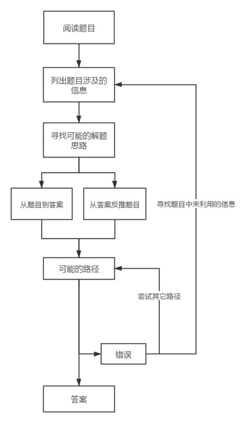

- 第一类加工是默认的加工方式，而解题并非传统的可以带来收益的行为；因此，大脑总是倾向于用直觉解决问题，然而，由于知识联系的多样性和数学练习的不足，一般的数学问题都难以通过简单的第一类加工（直觉）得到解题思路。应强迫大脑进行第二类加工，分析信息、回忆已经背下的知识点、全面寻找可能解题路径、反思解题路径中的错误，按照流程图逐步解决问题，
- 
- 1、阅读题目、列举信息：
	- 充分理解题目中的数学信息，如变量、符号、公式等，
	- 将文字信息转化为数学信息，应结合知识点，尝试多种转化方式，
	- 按照章-节-基本知识点列举出信息，
	- 若信息过多，可以画图辅助理解，同时防止直觉导致的错误；或者将信息和可能涉及的内容一一写下，
- 2、寻找思路：
	- 定位到题目所考察的章节，寻找题目中涉及的知识点与了解的知识点之间的联系；应将联系细化到基本知识点（如知识点的定义），
	- 应充分拓展思路，综合分析可能有联系的多个章节（首先要对基础知识有准确和充分理解，其次需要反复练习强化知识点之间的联系），
	- 不应盲目发散思维，可以试着按定义→基本定理→解题套路的顺序，逐个分析可能的解题路径，应多尝试知识点不同的组合方式，
	- 应考虑已经学习到的解题模板，
- 3、可能路径：
	- 应该重点思考出发点的多种可能性，而不是笃定一个方向线性的思考——在一个出发点的限制下思考会阻碍思维的发散，
	- 不应过分追求简化问题，找到一定的路径后就应动笔计算，
	- 若推导过于复杂或卡顿，应返回寻找其他路径，或寻找未利用的信息，或者思考其它题目可能涉及的知识点，
	- 尽量压制思维的随机跳跃，专注于要解决的核心问题，按照逻辑逐步推进解题步骤 ，