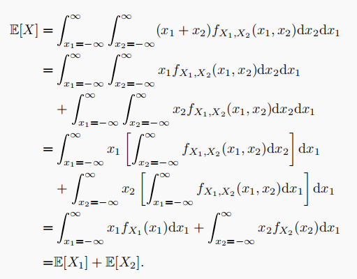

- 数字特征的求解
  collapsed:: true
	- 随机变量与常量的区分
	- 随机变量的维度
	  collapsed:: true
		- 期望和方差定义在$\mathbb{R}\rightarrow \mathbb{R}$上，而协方差和相关系数定义在$\mathbb{R}^{2} \rightarrow \mathbb{R}$上——因此，类似$E[X, Y]$和$\operatorname{Cov}[X, Y, Z]$都是没有定义的，
		- 应分清多元随机变量与多元随机变量*的函数*，
		- 对于多元随机变量，应将其数字特征写为*矩阵形式*；而对于多元随机变量的函数，应先分清随机变量的*因变量的维度*，再进一步分析，
	- 求解方式
	  collapsed:: true
		- 常见分布族的数字特征
		- 数字特征的性质（分析随机变量之间的关系）
		- 数字特征的定义（求解积分）
		  collapsed:: true
			- $E[g(X, Y)] = \begin{cases} \iint g(x,y) f_{X, Y}(x, y) dx dy \\ \int z f_{Z}(z) dz \end{cases}$，
			- 求解数字特征时，可以不求出对应随机变量的分布函数，因为求解分布函数一般较为复杂，
- 一元
  collapsed:: true
	- 数学期望
	  collapsed:: true
		- 定义
		  collapsed:: true
			- 离散：$\sum\limits_{x \in S_x} |x| p_{X}(x)$收敛时，$EX = \sum\limits_{x \in S_x} x p_{X}(x)$，
			- 连续：$\int\limits_{x \in S_x} |x| f_{X}(x) dx$存在时，$EX = \int\limits_{x \in S_x} x f_{X}(x) dx$，
		- 性质（线性运算）
		  collapsed:: true
			- 对于任意常数 $a \in \mathbb{R}$，$E[a]=a$
			- 对于任意常数 $a \in \mathbb{R}$，$E[af(X)]=aE[f(X)]$
			- $E[g(X)] \triangleq \int_{-\infty}^{\infty} g(x) f_{X}(x) d x$
			- $E(X + Y) = EX + EY$，没有独立性时也成立，
			  collapsed:: true
				- {:height 200, :width 255}
			- $E[f(X)+g(X)]=E[f(X)]+E[g(X)]$
			- 独立性
			  collapsed:: true
				- 随机变量$X，Y$独立时，$E(\frac{X}{Y}) = E(X) E(\frac{1}{Y})$，
				  collapsed:: true
					- {:height 100, :width 255}
				- 随机变量$\frac{X}{Y}，Y$独立时，$E(\frac{X}{Y}) = \frac{E(X)} {E(Y)}$，
		- 定理
		  collapsed:: true
			- 概率
			  collapsed:: true
				- 若存在常数 $a, b \in \mathbb{R}$，使$P(a \leq X \leq b) = 1$，则有$a \leq EX \leq b$；但其逆命题不成立，
				- 若存在常数 $a \in \mathbb{R}$使$EX > a$，则一定有$P(X > a) > 0$；同理，若存在常数 $b \in \mathbb{R}$使$EX < b$，则一定有$P(X < b) > 0$，
			- 分布函数
			  collapsed:: true
				- $EX = \int_{0}^{+ \infty}(1 - F(x))dx - \int_{- \infty}^{0}F(x)dx$，
				  collapsed:: true
					- 先将定义$EX = \int\limits_{x \in S_x} x f_{X}(x) dx$以0为界，拆分为(-\infty, 0)和(0, +\infty)两部分，
					- 然后引入第二参数t，将x写为积分形式$\int_{0}^{x}1dt$，$-\int_{x}^{0}1dt$，
					- 然后利用二重积分的换元可得上述结论，
	- （数学期望的示性函数求解）
	  collapsed:: true
		- 部分情况下，可能难以求得随机变量的分布律，或者求得的分布律较为复杂，难以计算期望，
		- 可以尝试将随机变量拆分为多个简单的独立事件（伯努利事件），并分别定义伯努利随机变量，再计算每个独立事件的期望，
		- 定义的伯努利随机变量之间可能*不同分布，也不独立*；但*仍可由期望的线性性*，求解得到最终的期望，
		- 示例
		  collapsed:: true
			- 超几何分布
			  collapsed:: true
				- N件产品，M件次品，不放回抽取n件产品；
				- 设X为取出的次品数，可知X为超几何分布，其期望涉及组合数的计算，
				- 可以将M件次品任意编为1~M号，
				- 定义伯努利变量$X_{j} = \begin{cases}  1 & 第j号次品被取出\\ 0 & 第j号次品没被取出 \end{cases}$，j \in [1, M]；也可理解为X_{j} = 1等价于取出的是次品，
				- 根据X_{j}的设置，可知$EX_{j} = P(X_{j} = 1) = \dfrac{n}{N}$，
				- 可知，随机变量X = X_{1} + X_{2} +… + X_{M}，
				- 所以由期望的线性性，可得$EX = EX_{1} + EX_{2} +… + EX_{M} = \dfrac{nM}{N}$，
			- 其它排列组合示例
			  collapsed:: true
				- 从自然数集{1，2，…，n}中有放回的取出n个数字，分别记为a_{1}，a_{2}，…，a_{n}，
				- 定义随机变量X为a_{i}中不同的数的个数，即X的支集为[1, n]，
				- X的分布律需要通过计数方法求得，
				- 然而，可以定义伯努利变量$X_{j} = \begin{cases}  1 & j \in {a_{1}，a_{2}，…，a_{n}} \\ 0 & j \not \in {a_{1}，a_{2}，…，a_{n}} \end{cases}$，j \in [1, n]，为选出的数字a_{1}，a_{2}，…，a_{n}中是否有数字j，
				- 可知，X = X_{1} + X_{2} +… + X_{n}，即若只有j个数出现，则a_{i}中有j个不同的数，
				- 对任意X_{j}，可由乘法公式，求得$P(X_{j} = 0) = (\dfrac{n - 1}{n})^{n}$，
				- 由伯努利随机变量的性质，可知$P(X_{j} = 1) = 1 - (\dfrac{n - 1}{n})^{n}$，
				- 因此，$EX_{j}= 1 - (\dfrac{n - 1}{n})^{n}$，
				- 由期望的线性性，可知$EX = n(1 - (\dfrac{n - 1}{n})^{n})$，
	- （Lebesgue-Stieltjes积分）
	  collapsed:: true
		- 引入
		  collapsed:: true
			- 设F(x)为随机变量的累积分布函数，
			- 定义$dF(x) = \begin{cases}  F(x) - F(x - 0) = p(x) \\ \dfrac{dF}{dx} = f(x)dx \end{cases}$，
			- 则可将期望统一定义为$EX = \int x dF(x)$，
		- {:height 280, :width 450}，
		- {:height 190, :width 450}，
		- {:height 100, :width 450}，
	- 方差（标准差）
	  collapsed:: true
		- 定义
		  collapsed:: true
			- 定义$\operatorname{Var}[X] = E[(X-EX)^{2}]$，一般用于位置族分布的方差计算，
			  id:: 62a00242-2a10-4d48-a0a4-abaec65c33e1
			- 定义式可恒等变形为$\operatorname{Var}[X] = E[X^{2}]-[EX]^{2}$，由于n阶原点矩的计算一般更容易，因此该公式更常用，
		- 性质
		  collapsed:: true
			- 对于任意常数 $a \in \mathbb{R}$，$\operatorname{Var}[a]=0$；
			  collapsed:: true
				- 引理：EX^{2} = 0当且仅当 X 为退化于0的随机变量，即P(X = 0) = 1，
				- 定理：Var X = 0 当且仅当 X “几乎处处”为常数；即存在常数c ，使得 P(X = c) = 1，
			- 对于任意常数 $a \in \mathbb{R}$，$\operatorname{Var}[af(X)]=a^2\operatorname{Var}[f(X)]$
			- 对于任意常数 $b \in \mathbb{R}$，$\operatorname{Var}[f(X) + b]=\operatorname{Var}[f(X)]$
			- $\operatorname{Var}[X \pm Y] = \operatorname{Var}[X] + \operatorname{Var}[Y] \pm 2\operatorname{Cov}[X, Y]$
		- 计算性质
		  collapsed:: true
			- 对于任意常数 $b \in \mathbb{R}$，$\min E[(X-b)^{2}] = E[(X-EX)^{2}]$，
			- $E[X^{2}] \geq [EX]^{2}$，即$\operatorname{Var}[X] \geq 0$，
			  collapsed:: true
				- 类似对于任意常数 $x_{i} \in \mathbb{R}$，总有$\sum {x_{i}}^{2} = \sum{(x_{i} - \bar{x})}^{2} + {\bar{x}}^{2} \geq {\bar{x}}^{2}$，
		- （应用：证明不等式）
		  collapsed:: true
			- 可以构造特定的随机变量，利用期望和方差的性质证明代数不等式，
			- 主要应根据要证明的不等式的形式设置随机变量，
			- 为了保证正则性，应注意随机变量可以任意取值，但其概率应小于1，
			- 此外，设置完其他随机变量后，为了保证概率和为1，可以设P(X = 0) = 1 - \Sigma P(X_{i})，
			- 此处X = 0可以保证正则性，也不会影响期望的计算，
			- 计算时也需要综合应用不等式的放缩，
			- 示例
			  collapsed:: true
				- 
				- 
				- 
				- 
	- 矩
	  collapsed:: true
		- n阶（原点）矩：$EX^{n}$
		- n阶中心矩：$E(X - EX)^{n}$
		- n阶标准化矩：$E {(\dfrac{X - EX}{\sqrt{\operatorname{Var}X}})}^{n}$
		- 变异系数$= \dfrac{\sqrt{\text{Var}X}}{EX}$
		- 峰度(Skewness)$= E {(\dfrac{X - EX}{\sqrt{\text{Var}X}})}^{3}$
		- 偏度(Kurtosis)$= {E (\dfrac{X - EX}{\sqrt{\operatorname{Var}X}})}^{4}$
		- 性质
		  collapsed:: true
			- 矩的不唯一性：不同的随机变量可能拥有相同的任意阶矩，
			- 若X，Y的支集有界，则对任意$r \in N^{+}, EX^{r} = EY^{r} \rightarrow F_{X} = F_{Y}$，
	- 分位数
	  collapsed:: true
		- 中位数
		  collapsed:: true
			- 定义
			  collapsed:: true
				- 称使分布函数$F_{X}(m) = \frac{1}{2}$的值m为随机变量X的中位数，即$m = F^{-1}_{X} (\frac{1}{2})$，
				- 一般有$m \in S_{X}$，但m可能不在X的支集中，也可能不是唯一的值（尤其对于离散随机变量），
			- 严格定义
			  collapsed:: true
				- 实际上，仅当X为连续随机变量且F_{X}严格单调时（大多数情况），上述定义才对应了唯一的中位数，
				- 因而中位数的严格定义为，满足$P(X \ge m) = F_{X}(m + 0) \ge \frac{1}{2}$，且$P(X \le m) = F_{X}(m) \ge \frac{1}{2}$的值m；
				- 或满足$F_{X}(m) \geq \frac{1}{2}$的最小的值m，即inf$\{m：F_{X} \geq \frac{1}{2}\}$
			- 性质
			  collapsed:: true
				- 对于任意常数 $b \in \mathbb{R}$，$E(|X - b|) = E(|X - m|) + 2\int _{m}^{b}(b-x)f(x) dx$，
				- 即$\min E(|X - b|) = E(|X - m|)$，
				- 若X的密度函数f(x)关于x = a对称，即f(a + x) = f(a - x)；则X的中位数为a；若X的数学期望存在，则EX = a，
		- （下）p分位数
		  collapsed:: true
			- 定义
			  collapsed:: true
				- 若$P(X \leq x_{p}) = F_{X}(x_{p}) = p$，则称x_{p}为随机变量X的p分位数，即$x_{p} = F^{-1}_{X} (p)$，
				- 其中$p \in [0, 1]$，
				- 类似中位数，一般$x_{p} \in S_{X}$，但x_{p}可能不在X的支集中，也可能不是唯一的值（尤其对于离散随机变量），
			- 其它
			  collapsed:: true
				- 一般中位数较常用，
				- 类似中位数，p分位数的严格定义也为满足$F_{X}(x_{p} + 0) \geq p$，且$F_{X}(x_{p}) \leq p$的值x_{p}；
				- p分位数由cdf的定义，因此更接近（下）\alpha分位数，即$x_{p} = x_{1 - \alpha}$（并非$x_{p} = 1 - x_{\alpha}$），
		- 上\alpha分位数
		  collapsed:: true
			- 定义
			  collapsed:: true
				- 若$\alpha = P(X > x_{\alpha}) =1 -  P(X \leq x_{\alpha}) = 1 -  F(x_{\alpha})$，则称$x_{\alpha}$为随机变量X的上\alpha分位数，
				  id:: 6286fb10-9385-474e-82a7-dfeea3e56cfd
				- {:height 100, :width 160}；
				- 其中$x_{\alpha} \in S_{X}$为随机变量X的可能取值，$\alpha \in [0, 1]$为概率（一般为比较小的数，如0.05，0.01等），
				- 也可定义下\alpha分位数，即$\alpha = P(X \leq x_{\alpha}) = F(x_{\alpha})$，但一般上\alpha分位数较为常用，
			- 性质
			  collapsed:: true
				- 可知$x_{\alpha} = F^{-1}(1 - \alpha)$，
				- 应注意定义中为$X > x_{\alpha}$，对于连续随机变量并无差别，但对于离散变量则应注意$X = x_{\alpha}$处的概率，
		- 众数
		  collapsed:: true
			- 定义：若唯一存在a，使得$a \geq x \geq y$，或$a \leq x \leq y$时，均有$f(a) \geq f(x) \geq f(y)$——即pdf或pmf在点X = a处取得最大值，则称a为众数，
			- 可知f(x)为单峰密度函数时众数唯一存在，
			- 众数的求解一般需要微积分方法，即求f(x)在S_{X}上的极值，
	- （故障率函数）
	  collapsed:: true
		- 定义
		  collapsed:: true
			- 设X为随机变量，x和\Delta x为常数，
			- 称关于 x 的函数$r(x) = \lim\limits_{{\Delta x} \to 0} \dfrac {P(x \leq X \leq x + {\Delta x}|X \geq x)}{\Delta x}$为故障率函数，
		- 性质
		  collapsed:: true
			- $r(x) = \dfrac{f_{X}(x)}{1 - F_{X}(x)}$
			- $f_{X}(x) = r(x){e}^{-\int ^{x}r(t)dt}$，
		- 常用分布
		  collapsed:: true
			- 当$r(x) = \lambda$时，可知$f_{X}(x) = {\lambda}{e}^{-\int ^{x}{\lambda}dt} = \lambda {e}^{-{\lambda}{x}}$，即X为指数分布，
	- （熵）
	  collapsed:: true
		- [[信息论]]
- 生成函数
	- 矩母函数(mgf)
	  collapsed:: true
		- 定义
		  collapsed:: true
			- 若对于常数$h > 0$，期望$E(e^{tX})$在$-h < x < h$时存在，
			- 则称X的矩母函数(moment generating function)$M(t) = E(e^{tX}) = \int e^{tX} f(x)dx$，
			- 定义域
			  collapsed:: true
				- 若随机变量X有界，则矩母函数的定义域一般为t \in R；
				- 若随机变量X无界，则矩母函数对于某些t的取值是不存在的，
			- 一般随机变量的矩不存在时，矩母函数也不存在；
			- 然而，部分存在n阶矩的随机变量也可能没有矩母函数（如对数正态分布），
		- 概率性质
		  collapsed:: true
			- 对于任意常数 $a,b \in \mathbb{R}$，若$Y = aX + b$，则$M_{Y}(t) = M_{X}(at){e}^{bt}$，
			- 若矩母函数$M_{X},M_{Y}$存在，则0的邻域内总有$M_{X}(t) = M_{Y}(t) \rightarrow F_{X} = F_{Y}$，
			- $EX^{n} = M_{X}^{(n)}(t)|_{t = 0}$，
		- 独立性
		  collapsed:: true
			- X_{1}，X_{2}独立 \Leftrightarrow $M_{X_{1}, X_{2}}(t_{1}, t_{2}) = M_{X_{1}}(t_{1})M_{X_{2}}(t_{2})$，
			- 可推广至多个随机变量，
	- 多元矩母函数
	  collapsed:: true
		- 定义
		  collapsed:: true
			- 设 $\begin{pmatrix}X_{1} & X_{2} & ... & X_{n} \end{pmatrix}$ 为n维随机向量，
			- 定义其矩母函数为n元函数$M(t_{1}, t_{2},...,t_{n}) = E({e}^{{t}_{1}{X}_{1}} \cdot {e}^{{t}_{2}{X}_{2}} \cdot ... {e}^{{t}_{n}{X}_{n}}) = E({e}^{\sum {t}_{i}{X}_{i}})$ ，
	- 特征函数
	  collapsed:: true
		- （复变函数基础）
		  collapsed:: true
			- 定义
			  collapsed:: true
				- 设X，Y为$\{S, \mathcal{F}, P\}$上的随机变量，i为虚数单位，
				- 称随机变量Z = X + iY为复随机变量，X为Z的实部，iY为Z的虚部，
				- 称随机变量X - iY为Z的共轭复随机变量，记为$\bar{Z}$，
			- 性质
			  collapsed:: true
				- 可以把复值随机变量 Z = X + iY 作为随机向量 (X, Y) 来处理，
				- EZ = EX + iEY，
				- Z_{i}相互独立时，E[Z_{1}Z_{2}…Z_{n}] = EZ_{1}EZ_{2}…EZ_{n}，
			- 欧拉公式
			  collapsed:: true
				- $e^{iY} = \cos Y + i\sin Y$，
				- 可由e^{ix}的泰勒展开式算得，
		- 定义
		  collapsed:: true
			- 称期望$E(e^{itX})$为X的特征函数，即$\varphi (t)  = E(e^{itX}) = \int e^{itX} f(x)dx$，其中i为虚数单位，
			  collapsed:: true
				- 由欧拉公式，也可将其写为$\varphi (t)  = E[\cos(tX)] + iE[\sin(tX)]$，
			- 对于任何随机变量，由于|e^{itX}| = 1，因此其特征函数总是存在，
			  collapsed:: true
				- 复数z = a + bi的模（绝对值）*定义*为$|z| = \sqrt{z \overline{z}}  = \sqrt{a^{2} + b^{2}}$，
				- 由欧拉公式，$e^{iY} = \cos Y + i\sin Y$，
				- 所以，可知$|e^{iY}| = \sqrt{{(\sin Y)}^{2} + {(\cos Y)}^{2}} = 1$，
			- 一般特征函数用于连续随机变量，而矩母函数用于离散随机变量，
		- （分析性质）
		  collapsed:: true
			- $\varphi(0) = 1$，
			- $|\varphi(t)| \leq 1$，
			  collapsed:: true
				- $|\varphi (t)|  = |\int e^{itX} f(x)dx| \leq \int |e^{itX}| f(x)dx = |e^{itX}| \int  f(x)dx$，
				  collapsed:: true
					- 密度函数f(x)总大于0,
					- $\int  f(x)dx = 1$，
				- 由于|e^{itX}| = 1，所以总有$|\varphi(t)| \leq 1$，
			- $\varphi(-t) = \overline{\varphi(t)}$，
			- \phi(t)在R上一致连续，
			- \phi(t)具有半正定性，
		- 概率性质
		  collapsed:: true
			- 对于任意常数 $a,b \in \mathbb{R}$，若$Y = aX + b$，则$\varphi_{Y}(t) = \varphi_{X}(at){e}^{bt}$，
			- 特征函数的泰勒展开
				- $\varphi(t)= 1 + \dfrac{it}{1} EX - \dfrac{t^{2}}{2!}EX^{2} + \cdots = \sum\limits_{k = 0}^{\infty}\dfrac{(it)^{k}}{k!}EX^{k}$，
				- 推论：$EX^{k} = i^{-k}\varphi_{X}^{(k)}(t)|_{t = 0}$，
				- 条件
				  collapsed:: true
					- 随机变量X存在任意阶矩，
					- \exist t_{0} > 0， \forall |t| \le t_{0}，$\lim\limits_{n \to \infty}\dfrac{|t|^{n}E|X|^{n}}{n!} = 0$，
			- 随机变量 X 与 -X 同分布 \Leftrightarrow X的特征函数\phi_{X} (t)为实值函数，
			- 独立性
			  collapsed:: true
				- 若X_{1}，X_{2}独立，则$\varphi_{X_{1} + X_{2}}(t) = \varphi_{X_{1}}(t)\varphi_{X_{2}}(t)$；但其逆命题不成立，
					- （推论：若\phi(t)为特征函数，则\phi^{n}(t)也为特征函数），
					- 可推广至多个随机变量，
		- 其它概率性质
		  collapsed:: true
			- 分布函数与特征函数一一对应，
			- 唯一性：随机变量X，Y同分布  \Leftrightarrow $\varphi_{X} (t)  = \varphi_{Y} (t)$，
			  collapsed:: true
			- 反转公式
			  collapsed:: true
				- 设X的分布函数为F(x)，特征函数为$\varphi (t)$，
				- 定理
				  collapsed:: true
					- 当x_{1}, x_{2}为F_{X}的连续点时，
					- 有$F(x_{2}) - F(x_{1}) = \lim\limits_{T \to \infty} \dfrac{1}{2\pi}\int_{-T}^{T}\dfrac{e^{-itx_{1}} - e^{-itx_{2}}}{it} \varphi(t)dt$，
				- 推论
				  collapsed:: true
					- 若$\int_{- \infty}^{+ \infty}|\varphi(t)|dt < \infty$，则分布函数的导数F'(x)存在且连续，
					- 且$F'(x) = \dfrac{1}{2\pi}\int_{-\infty}^{\infty}e^{-itx} \varphi(t)dt$，
			- 特征函数的凸组合
			  collapsed:: true
				- 
	- 多元特征函数
	  collapsed:: true
		- 定义
		  collapsed:: true
			- 设 $\begin{pmatrix}X_{1} & X_{2} & ... & X_{n} \end{pmatrix}$ 为n维随机向量，
			- 定义其特征函数为n元函数$\varphi(t_{1}, t_{2},...,t_{n}) = E({e}^{i{t}_{1}{X}_{1}} \cdot {e}^{i{t}_{2}{X}_{2}} \cdot ... {e}^{i{t}_{n}{X}_{n}}) = E({e}^{i\sum {t}_{i}{X}_{i}})$ ，
		- 独立性
		  collapsed:: true
			- X_{1}，X_{2}独立 \Leftrightarrow $\varphi_{X_{1}, X_{2}}(t_{1}, t_{2}) = \varphi_{X_{1}}(t_{1})\varphi_{X_{2}}(t_{2})$，
			- 可推广至多个随机变量，
- 条件分布
  collapsed:: true
	- 条件数学期望
	  collapsed:: true
		- 定义
		  collapsed:: true
			- 连续：$E(X_2|X_1) = \int \limits_{S_{X_2|X_1}}X_2 f({X_2|X_1}) dX_2 = \int \limits_{S_{X_2|X_1}}X_2 \frac{f(X_1, X_2)}{f(X_1)} dX_2 = \phi(X_1)$，
			- 离散：$E(X_2|X_1) = \sum \limits_{S_{X_2|X_1}}x_2 p({X_2 = x_{2}|X_1}) = \sum \limits_{S_{X_2|X_1}}x_2 \frac{p(X_1, X_2)}{p(X_1)} = \phi(X_1)$，
			- 其结果为随机变量X1的函数\phi(X_{1})（仍为随机变量），
			- 对于指定的X_{1} = x_{1}，结果为常数\phi(x_{1})，
		- 性质
		  collapsed:: true
			- 对于X_{2}的函数，$E(f(X_2)|X_1) = \int \limits_{S_{X_2|X_1}}f(X_2) f(X_2|X_1) dX_2 = \varphi(X_1)$，
			- $\min E[Y-g(X)]^2 = E[Y-E(Y|X)]^2$，
			- 对于任意函数g，g(X)和Y - E(Y|X)不相关，
		- 条件期望的计算
		  collapsed:: true
			- 概述
			  collapsed:: true
				- 条件期望的实质仍为期望，
				- 因此求解时应首先分清具体的*随机变量*，
				- 再分析条件下的概率密度函数，即随机变量的*支集*和对应的*（条件）概率值*，
				- 条件概率的基本计算方式为定义$P(X_2|X_1) = \dfrac{P(X_1, X_2)}{P(X_1)}$
				- 具体计算时，可以尝试拆分随机变量为独立的随机变量的期望，再由独立性下的期望公式求解，
				- 一般涉及多个随机变量时，需要根据其它随机变量的取值分情况讨论，
			- 条件为关于X的事件A，
			  collapsed:: true
				- 可将概率写为$E(X | A) = \dfrac{E(XI_{A})}{P(A)} = \int_{S_{X} \cap A} xf_{X|A}(x)dx$，
				- 示例
				  collapsed:: true
					- 若$X \sim Cau(0, 1)$，即$f(x) = \dfrac{1}{\pi(1 + x^{2})}$，求$E( |X| | (|X| \le 1) )$，
					- $E(|X| | (|X| \le 1)) = \int_{[-1, 1]} |x|f_{X}(x)dx = \int_{[-1, 1]} |x|\dfrac{1}{\pi(1 + x^{2})} = \dfrac{\ln 2}{\pi}$，
			- 条件为X和其它随机变量的函数，
	- 条件方差
	  collapsed:: true
		- 定义
		  collapsed:: true
			- $\operatorname{Var}(X_2|X_1) = E[(X_2-E(X_2|X_1))^{2}|X_1] = \int \limits_{S_{X_2|X_1}}(X_2-\phi(X_1))^{2} f(X_2|X_1) dX_2$
			- $\operatorname{Var}(X_2|X_1) =E[(X_2^2|X_1)]-{[E(X_2|X_1)]}^{2} = \int \limits_{S_{X_2|X_1}}X_2^2 f(X_2|X_1) dX_2 - {\phi(X_1)}^{2}$，
			- 其结果为随机变量X1的函数（仍为随机变量），
	- 重期望公式
	  collapsed:: true
		- $EX = E[E(X|Y)] = E[g(Y)]$，
		  collapsed:: true
			- 全概率公式形式：$EY = \sum\limits_{S_{N}}E(Y|N = n)P(N = n) = E(E(Y|N))$，
		- 根据条件分布拆分随机变量，
		  collapsed:: true
			- 若X，Y不独立，但条件分布f_{X|Y}已知，且g(X, Y)可拆分为乘积形式h(Y)u(X)，
			- 则可由重期望公式计算E[g(x, y)]，
			- $E[g(X,Y)] = E[h(Y)\cdot  u(X)]$，
			- $= E(E[h(Y)\cdot  u(X)|Y]) = E(h(Y) E[u(X)|Y])$（给定条件分布后，Y可以看作常量，所以可从算式中分离），
			- $= E[h(Y) \cdot t(Y)]$，
		- （期望的求解）
		  collapsed:: true
			- 可以考虑将X拆分为多个条件分布X|Y，
			  collapsed:: true
				- 一般Y的选取由具体情景给出；若没有具体情景，则Y的选取应尽量简单，
				- 一般会得到关于EX的方程或递推公式，
			- 从期望的角度分析，
			  collapsed:: true
				- 对于较复杂的分布，按照定义逐个分析随机变量的取值和对应概率较为困难，
				- 因此，此处用于计算期望xp(x)中的“X”，可能并非准确的随机变量X的取值，而是对应情况下X的“平均”值，
			- 根据重期望公式求解，
			- 示例
			  collapsed:: true
				- 连续抛掷一枚均匀的假子，直到接连抛出两个1点为止；设随机变量X为所需的抛掷次数，求EX，
				- 随机变量的设置
				  collapsed:: true
					- 可知X为离散型随机变量，X的支集为2，3，4…；直接计算期望较复杂，
					- 设随机变量Y为第一次抛掷时所掷出的点数，Y的支集为1，2，3，4，5，6；
				- 条件期望
				  collapsed:: true
					- 设条件期望E_{k} = E(X | Y = k)，
					- Y = 2，3，4，5，6
					  collapsed:: true
						- 第一次等同于白抛，从第二次开始后所需的平均次数应与 EX 相同，
						- 即E_{k} = 1 + EX，k = 2，3，4，5，6，
					- Y = 1
					  collapsed:: true
						- E(X | Y = 1)可以分为两部分，第二次投出1时的*期望值*，和第二次没有投出1时的*期望值*，
						  collapsed:: true
							- （即此处用于计算期望xp(x)中的“X”并非准确的投掷次数，而是不同情况下投掷次数的“平均”值），
						- 第二次投出1时，
						  collapsed:: true
							- （平均）次数X = 2，即$E(X| Y = 1) = 2 \cdot \frac{1}{6}$，
						- 第二次没有投出1，
						  collapsed:: true
							- 第一次等同于白抛；
							- 可以将第二次的投掷看作第一次，即Y = 2，3，4，5，6时的所需的平均次数，再加上第一次的投掷，
							- 即第二次投出k时，（平均）次数X = 1 + E_{k}，
						- 所以$E_{1} = E(X | Y = 1) = 2 \cdot \frac{1}{6} + (1 + E_{2})\cdot \frac{1}{6} + (1 + E_{3})\cdot \frac{1}{6} + (1 + E_{4})\cdot \frac{1}{6} + (1 + E_{5})\cdot \frac{1}{6} + (1 + E_{6})\cdot \frac{1}{6}$，
						- 综上所述，可得$E_{1} = 2 + \frac{5}{6}EX$，
				- 重期望公式
				  collapsed:: true
					- 由$EX = E(E(X|Y)) = \sum\limits_{k = 1}^{6}E(X|Y = k)P(Y = k) = \frac{1}{6}\sum\limits_{k = 1}^{6}E_{k}$，
					- 将求得的E_{k}的公式带入，可解得EX = 42，
	- 《《条件方差公式
	  collapsed:: true
		- $\operatorname{Var}X = E[\operatorname{Var}(X|Y)] + \operatorname{Var}[E(X|Y)] =E[g(Y)] + \operatorname{Var}[g(Y)]$ ，
		- $\operatorname{Var}[Y-E(Y|X)] = E[\operatorname{Var}(Y|X)]$ ，
	- 《《线性条件均值（正态）
	  collapsed:: true
		- 定理
		  collapsed:: true
			- 设X，Y的联合分布函数为f(x, y)，0 < VarX, VarY < +\infty，
			- 则$E(Y|X) = kX + b$时，称Y具有关于X的线性条件均值，
			- $E(Y|X) = {\mu}_{y} + \rho\dfrac{\sigma_{y}}{\sigma_{x}}(X - \mu_{x})$，
			- $E(\operatorname{Var} (Y|X)) = {\sigma}_{y}^{2}(1 - {\rho}^{2})$，
		- 二元正态
		  collapsed:: true
			- 若X，Y为二元正态分布$N(\mu_x, \mu_y, \sigma_{x}^{2}, \sigma_{y}^{2}, \rho)$，
			- 则条件分布$Y|X \sim N({\mu}_{y} + \rho\dfrac{\sigma_{y}}{\sigma_{x}}(X - \mu_{x})，{\sigma}_{y}^{2}(1 - {\rho}^{2}))$，
- 二元
	- 协方差
	  collapsed:: true
		- 定义$\mathbb{R}^{2} \rightarrow \mathbb{R}$
		  collapsed:: true
			- Cov(X, Y) = E[(X - EX)(Y - EY)]，
			- 协方差定义在*两个*随机变量之间，
		- 性质
		  collapsed:: true
			- 对于任意常数 $a \in \mathbb{R}$，$\operatorname{Cov}[X, a] = 0$
			- 对于任意常数 $a,b \in \mathbb{R}$，$\operatorname{Cov}[aX, bY] = ab\operatorname{Cov}[X, Y]$
			- 对于任意常数 $a,b \in \mathbb{R}$，$\operatorname{Cov}[X + a, Y + b] = \operatorname{Cov}[X, Y]$
			- $\operatorname{Cov}[X, X] = \operatorname{Var}[X]$
			- $\operatorname{Cov}[X, Y] = \operatorname{Cov}[Y, X]$
			- $\operatorname{Cov}[X+Y, Z] = \operatorname{Cov}[X, Z] + \operatorname{Cov}[Y, Z]$（不需要独立性），
			- $\operatorname{Var}[X \pm Y] = \operatorname{Var}X + \operatorname{Var}Y \pm 2\operatorname{Cov}[X, Y]$
		- 不相关
			- 设X，Y为随机变量，若Cov(X, Y) = 0，则称X，Y不相关，
			- 根据定义，不相关时即有EXY = EXEY，Var(X + Y) = VarX + VarY，
			- 然而不相关不同于独立，即不能说明概率P(X, Y) = P(X)P(Y)，
	- 相关系数
	  collapsed:: true
		- 引入
		  collapsed:: true
			- Cauchy - Schwarz不等式(EXY)^{2} \le EX^{2} EY^{2}，
			  collapsed:: true
				- 
			- 推论：$|\operatorname{Cov}(X, Y)| \le {\sqrt{\operatorname{Var}X}\sqrt{\operatorname{Var}Y}}$，
			- 即$|\dfrac{\operatorname{Cov}(X, Y)}{{\sqrt{\operatorname{Var}X}\sqrt{\operatorname{Var}Y}}}| \le 1$，
		- 定义$\mathbb{R}^{2} \rightarrow \mathbb{R}$
			- ${\rho}_{XY} = \dfrac{\text{Cov}[X, Y]}{\sqrt{\text{Var}X}\sqrt{\text{Var}Y}}$，
			- 可以看成${\rho}_{XY} = \operatorname{Cov}[\dfrac{X - EX}{\sqrt{\operatorname{Var}X}}, \dfrac{Y - EY}{\sqrt{\operatorname{Var}Y}}]$，即标准化后的X，Y的协方差，
			- 相关系数定义在*两个*随机变量之间，
		- 性质
		  collapsed:: true
			- -1 \le \rho_{XY} \le 1，
			- 由于Var X，Var Y > 0，因此${\rho}_{XY} = 0 \leftrightarrow \operatorname{Cov}[X, Y] = 0$，
			- $\rho(aX+b, cY + d) = \rho_{XY}$，
			- $|{\rho}_{XY}| = 1 \leftrightarrow P(Y = aX + b) = 1$，
			  collapsed:: true
				- ${\rho}_{XY} = 1 \rightarrow a > 0$，而${\rho}_{XY} = -1 \rightarrow a < 0$，
- 数字特征的不等式
	- Markov不等式
	  collapsed:: true
		- 设X为随机变量，常数\epsilon > 0，
		- 则$P(|X| \geq \varepsilon) \leq \dfrac{E|X|}{\varepsilon}$，
		- 有时也记为$P(|X| \geq \varepsilon) \leq \dfrac{Eg(|X|)}{g(\varepsilon)}$，
	- *Chebyshev不等式*
	  collapsed:: true
		- 设X为随机变量，常数\epsilon > 0，
		- 则$P(|X - EX| \geq \varepsilon) \leq \dfrac{\operatorname{Var}X}{{\varepsilon}^{2}}$，
		- 一般用于X的*分布未知*，但部分数字特征已知的情况下，
		- 可由Markov不等式直接推导得到，
	- 推论
	  collapsed:: true
		- $P(|\overline {X} - \mu| \geq k\sigma) \leq \dfrac{1}{n{k}^{2}}$，其中$\overline {X}$为样本均值，
		- $P(|X - \theta| \geq \varepsilon) \leq \dfrac{E{(X - \theta)}^{2}}{{\varepsilon}^{2}}$，
	- Chernoff不等式
	  collapsed:: true
		- 设X为随机变量，常数\epsilon > 0，t > 0，
		- 则$P(X \geq \varepsilon) \leq \dfrac{E{{e}^{tX}}}{{e}^{t \varepsilon}}$，
		- （对于给定的$\varepsilon，\dfrac{E{{e}^{tX}}}{{e}^{t \varepsilon}}$为关于t的函数h(t)，一般可进一步求解h(t)的极小值，以确定不等式的下限），
		- 可由Markov不等式直接推导得到，
	- [[概率的极限定理]]
	- [[渐近估计与极限分布]]
	- Holder不等式
	  collapsed:: true
		- 设X，Y为任意随机变量；p，q > 1，
		- 则$|EXY| \leq E|XY| \leq {(E|X|^{p})}^{\frac{1}{p}}{(E|Y|^{q})}^{\frac{1}{q}}$，
	- 特例
	  collapsed:: true
		- Cauchy - Schwarz不等式（p = q = 2）
		  collapsed:: true
			- 设X，Y为任意随机变量，则$|EXY| \leq E|XY| \leq {(EX^2)}^{\frac{1}{2}}{(EY^2)}^{\frac{1}{2}}$，
		- *协方差不等式*
		  collapsed:: true
			- 设$X = X - EX，Y = Y - EY$，
			- 可得$\text{Cov}[X, Y] \leq \sqrt{\text{Var}X}\sqrt{\text{Var}Y}$，
		- Liapounov不等式（Y \equiv 1)
		  collapsed:: true
			- 设X为任意随机变量，则$E|X| \leq {(E|X|^{p})}^{\frac{1}{p}}$，
	- Minkowski不等式
	  collapsed:: true
		- ${(E|X + Y|^{p})}^{\frac{1}{p}} \leq {(E|X|^{p})}^{\frac{1}{p}} + {(E|Y|^{p})}^{\frac{1}{p}}$
	- Jensen不等式
	  collapsed:: true
		- 凸函数(convex)
		  collapsed:: true
			- 西方教材的凹凸性定义与国内相反，
			- [[单变量微积分]]
		- 不等式
		  collapsed:: true
			- 设0 \le a_{i} \le 1为常数，且$\sum \limits _{i= 1}^{m} a_{i} = 1$；
			- 若函数为凸函数，
			- 则对于函数f(x)定义域内的任意m个点x_{1}, x_{2}, ..., x_{m}，
			- 有$f(a_1 x_1 + a_2 x_2 + ...+a_m x_m) \leq a_1 f(x_1) + a_2 f(x_2) +... + a_m f(x_m)$，
		- 随机变量形式
		  collapsed:: true
			- 设X为任意随机变量，若函数g(x)为凸函数，则$E[g(X)] \geq g(EX)$，
			- 当且仅当X为严格凸函数，且随机变量X为常数时，不等式取等号，
			- （证明）
			  collapsed:: true
				- 由$f(a_1 x_1 + a_2 x_2 + ...+a_m x_m) \leq a_1 f(x_1) + a_2 f(x_2) +... + a_m f(x_m)$，
				- 将X看成离散随机变量，其质量函数为$P(X = x_{i}) = a_{i}$，
		- 特例：由于$x^{2}, \dfrac{1}{x}$都是凸函数，所以有$EX^{2} \geq {(EX)}^{2}, E(\dfrac{1}{X}) \geq \dfrac{1}{EX}$，
	- 协方差不等式
	  collapsed:: true
		- 设X为任意随机变量，
		- 若函数g(x), h(x)单调性相同，则E[g(X)h(X)] \ge [Eg(X)][Eh(X)]，即Cov[g(X), h(X)] \ge 0，
		- 若函数g(x), h(x)单调性相反，则E[g(X)h(X)] \le [Eg(X)][Eh(X)]，即Cov[g(X), h(X)] \le 0，
- [[多元统计]]
- [[概率论]]