- 目的
  collapsed:: true
	- 已有数字电路的分析
	- 特定功能的数字电路的设计
	- （Verilog语言）
-
- 数字系统
	- 模拟信号与数字信号
		- 将模拟信号转换为离散的信号，并用数值进行表示，
		- 数字信号的传输，存储和处理都较为方便，
		- 模拟信号的采样
	- 数字进制
	  collapsed:: true
		- 二进制
		  collapsed:: true
			- 易于使用物理器件实现，
			- 运算规则简单，可以使用逻辑代数的原理，
			- （信息论）
			- {:height 195, :width 183}，
		- 多项式表示法
		  collapsed:: true
			- 多项式表示法（包括小数位），
			- {:height 190, :width 350}，
			- 其它进制按权相加可以得到十进制（包括小数位），
		- 整数的转换
		  collapsed:: true
			- 十进制*除权取余*数，按照*从下向上*的顺序可以得到对应的进制，
			  collapsed:: true
				- 计算原理
				- {:height 138, :width 261}，
			- {:height 150, :width 350}，
		- 小数的转换
		  collapsed:: true
			- 一般将小数与整数分开计算，再加到一起，
			- 小数转换可能不能算尽，
			- 十进制乘以权数后取整，按照从上到下的顺序可以得到对应的进制；直到没有小数位时停止，
			- {:height 136, :width 271}，
	- 数字表示
		- 原码
		- 反码
		- 补码
			-
	- 数字运算
		- 二进制的运算
			- 二进制的运算基本类似于十进制，同样需要借位和进位，也可以使用横式算式来运算，
			- ### 整数的运算
			- 乘法与除法
			- {:height 140, :width 275}，
			- 可见，（整数）的乘法与除法可以用移位和加减法来代替，
			- 加法与减法
			- 通过补码的运算，可以将减法转换为加法，
			- 即$[x - y]_{补} = [x]_{补} + [-y]_{补}$，而$[-y]_{补} = \lnot [y]_{补} + 1$，
			-
		- 比特与按位运算
		  collapsed:: true
			- 定义
			  collapsed:: true
				- 只具有0、1两个可能值的符号为一个比特，
				- 一般定义1为真，0为假，称只有真或假两种可能值的变量为布尔变量，
				- 因此，一个比特可以表示一个布尔变量，
			- （按位）运算
			  collapsed:: true
				- 比特的运算
				  collapsed:: true
					- 可以将比特看成一个命题，因此比特间的运算类似命题间的运算，
				- 比特串的运算
				  collapsed:: true
					- 比特串：定义只由比特组成的数组（向量）为比特串（即一个二进制数，如10011101），比特串的长度就是它所含比特的数目，
					- 定义比特串的按位运算结果为*对应位的比特*进行运算得到的结果——因此，只有长度相同的比特串才可以进行按位运算，
					- 例如，101和011的*“按位或”*运算的结果为$1(0 \lor 1 = 1)1(0 \lor 1 = 1)1(0 \lor 1 = 1)$，
			- 应用
			  collapsed:: true
				- 0-1集合
				  collapsed:: true
					- 定义
					  collapsed:: true
						- 若全集U的所有元素已知且有限，则可以利用比特串来存储*U的子集*，
						- 首先将U进行排序，即给每个元素一个序号$a_{1}, a_{2},... ,a_{n}$，
						- 对于U的某个子集A_{1}，若元素a_{i}在A_{1}中，则将a_{i}位记为1；否则记为0，
						- 这样定义的集合便于表示，而且可以直接利用基本逻辑进行按位运算，
					- 实例
					  collapsed:: true
						- 令$U = \{1, 2, 3, 4, 5\}$；$A_{1} = \{1, 2\}$，$A_{2} = \{2, 3\}$，
						- 则A_{1}可表示为11000，A_{2}可表示为01100，
						- $A_{1} \cup A_{2} \rightarrow 1(1 \lor 0 = 1)1(1 \lor 1 = 1)1(0 \lor 1 = 1)0(0 \lor 0 = 0)0(0 \lor 0 = 0)$，即11100，为集合$\{1, 2, 3\}$，
						- $A_{1} \cap A_{2} \rightarrow  0(1 \land 0 = 0)1(1 \land 1 = 1)0(0 \land 1 = 0)0(0 \land 0 = 0)0(0 \land 0 = 0)$，即00100，为集合$\{2\}$，
				- 0-1矩阵
				  collapsed:: true
					- 0-1矩阵
					  collapsed:: true
						- 定义所有元素a_{ij}均为0或1的矩阵为0-1矩阵，
					- 矩阵运算
					  collapsed:: true
						- 布尔算数运算
						  collapsed:: true
							- 同型的0-1矩阵才可以进行布尔运算（并运算和交运算），运算规则等同于基本逻辑规则，
							- 其结果也为0-1矩阵，
						- 布尔积（乘法）
						  collapsed:: true
							- 定义
							  collapsed:: true
								- 若矩阵A的行数等于等于B的列数，则定义AB的布尔积为$A_{m*k}\odot B_{k*n} = C_{m*n}$，结果也为0-1矩阵，
								- 矩阵C的元素c_{ij}的计算类似普通矩阵乘法，但乘法变为了交运算，加法变为了并运算，
							- 示例
							  collapsed:: true
								- 按矩阵乘法，$\begin{pmatrix}1 & 0 & 1 & 0 \end{pmatrix} \begin{pmatrix} 0 \\ 1 \\ 1 \\ 0 \end{pmatrix} = (1 \cdot 0) + (0 \cdot 1) + (1 \cdot 1) + (0 \cdot 0) = 1$，
								- 而布尔积运算则是$\begin{pmatrix}1 & 0 & 1 & 0 \end{pmatrix} \odot  \begin{pmatrix} 0 \\ 1 \\ 1 \\ 0 \end{pmatrix} = (1 \land 0) \lor (0 \land 1) \lor (1 \land 1) \lor (0 \land 0) = 1$，
							- 性质
							  collapsed:: true
								- 结合律$A \odot (B \odot C)  = (A \odot B)\odot C$，
						- 布尔幂乘
						  collapsed:: true
							- 若A为n阶0-1方阵，则可定义A的r次布尔幂为r个A的布尔积，一般记为$A^{[r]} = A\odot A\odot A...\odot A$，
							- 定义$A^{[0]} = I_{n*n}$，
							-
	- 数字存储
	  collapsed:: true
		- {:height 135, :width 281}，
- 逻辑代数（布尔代数）
	- 基本概念
	  collapsed:: true
		- 布尔代数为集合{0，1}上的运算，
		- 基本运算
		  collapsed:: true
			- 补(not)：$\bar{0} = 1, \bar{1} = 0$，
			- 布尔和(or)：$1 + 1 = 1, 1 + 0 = 1, 0 + 1 = 1, 0 + 0 = 0$,
			- 布尔积(and)：$1 \cdot 1 = 1, 1 \cdot 0 = 0, 0 \cdot 1 = 0, 0 \cdot 0 = 0$,
			- 运算顺序：补，积，和；可以使用括号更改运算顺序，
		- 其他运算
		  collapsed:: true
			- 类比其它逻辑运算，也可以引入异或(x \oplus y)，与非(x \uparrow y)，或非(x \downarrow y)运算，
		- （布尔等式）
		  collapsed:: true
			- 布尔运算类似于命题的逻辑运算和集合的运算，
			- 因此其运算规则也等同于逻辑运算规则，
			- 包括交换律，结合律，德摩根律等，
		- 对偶运算
		  collapsed:: true
			- 称交换布尔和与布尔积，并交换（常数）0和1，但不改变补运算的布尔表达式为原式的对偶式，
			- 示例$x(y + 0) \to x + (y \cdot 0)$，
			- （可用于获得布尔恒等式，如$x + (y + z) = (x + y) + z \to (x \cdot y)\cdot z = x \cdot (y \cdot z)$，
	- 布尔函数
	  collapsed:: true
		- 布尔变量（变元）：称只能取0，1两个值的变量x_{i}为布尔变量（为了便于理解，也可以记为b_{i}），
		- 布尔函数：称由布尔变量到布尔变量的映射为布尔函数，称由n个布尔变量到一个布尔变量的映射为n元布尔函数，
		- 布尔表达式：称由*布尔运算符*和布尔变量构成的函数表达式为布尔表达式，如$z = x \cdot \bar{y}, c = a + b$等，
			- 布尔运算符与基本的数学运算符（+，-，*等）有一定的差异，
		- 相等与等价：若对于相同的自变量，函数f，g的输出相同，则称函数f，g等价（但两者的表达式可能不相同），
		- （布尔函数的个数）
		  collapsed:: true
			- 每个布尔自变量都有2个取值，因此n个布尔自变量共有有2^{n}个取值，
			- 按照布尔函数的定义，每一个不同的取值组合都可以赋值0，1，
			- 所有的布尔函数为一个重复排列，
			- 因此，不同的n元布尔函数有$2^{2^{n}}$个，
	- 布尔函数的构造
	  collapsed:: true
		- 极小项
		  collapsed:: true
			- 设$x_{1}, x_{2},..., x_{n}$为布尔变量，
			- 称布尔积$y = y_{1} \cdot y_{2}\cdot…\cdot y_{n}$为一个极小项，其中$y_{i} = x_{i}$或$y_{i} = \overline{x_{i}}$，
			- 示例
			  collapsed:: true
				- 设布尔变量$x_{1}, x_{2}, x_{3}$，
				- 希望给定$x_{1} = 1, x_{2} = 0, x_{3} = 1$时，极小项y = 1，否则y = 0，
				- 可以算得极小项表达式为$x_{1} \cdot \overline{x_{2}} \cdot x_{3}$，
		- @布尔积展开式（析取范式）
		  collapsed:: true
			- 任意布尔函数都可以由所有布尔变量的不同极小项的组合，经过布尔加法运算得到，
			- 示例
			  collapsed:: true
				- 设布尔函数$F(x, y, z) = (x + y) \cdot \overline{z}$，
				- 由布尔式的恒等变形，可将上式展开为$F(x, y, z) = xy\overline{z} + x\overline{y}\overline{z} + \overline{x} y \overline{z}$，
				- 反之，对于给定输出的函数F，也可以由布尔积展开式来表示F，
				- 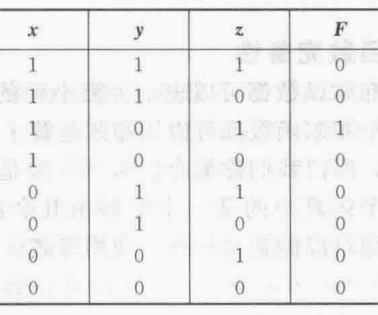{:height 190, :width 220}，
				- 可知，$F = \overline{x}\overline{y}\overline{z} + \overline{x}\overline{y}z + x\overline{y}z + \overline{x}yz + x\overline{y}\overline{z} + \overline{x}y\overline{z} + xy\overline{z} + xyz$，
		- @布尔函数的最小化
		- （完备性）
		  collapsed:: true
			- 称可以表示所有布尔函数的布尔运算符的集合，为函数完备集合，
			- 例如，集合$\{\cdot, + , \bar{}\}$是函数完备的，
			- 由德摩根律，可得出$\{\cdot, \bar{}\}$和$\{+ , \bar{}\}$也是函数完备的，
			- 集合$\{\cdot, +\}$不是函数完备的，
-
- 门电路
  collapsed:: true
	- 概述
	  collapsed:: true
		- 接受数字信号，经过运算后产生输出信号，
		- 信号一般为二值信号，单位为比特，
		- 由于基本运算规则为逻辑代数，所以也成为逻辑电路，
	- 基本组件
	  collapsed:: true
		- 电子元件
		  collapsed:: true
			- 半导体与晶体管
			- 二极管，三极管等，
		- 基本逻辑器件
		  collapsed:: true
			- 逻辑门，
		- 逻辑功能部件
		  collapsed:: true
			- 加法器，乘法器等，
		- 复杂逻辑功能部件
		  collapsed:: true
			- 微处理器等，
		- 集成电路
		  collapsed:: true
			- 通过引脚与外部交换信号，
	- 定义
	  collapsed:: true
		- 称只依据输入值产生输出值的电路为门电路，即电路没有存储能力，
		- 基本电路有三种，反相器(NOT)，或门(OR)，与门(AND)，其电路图为 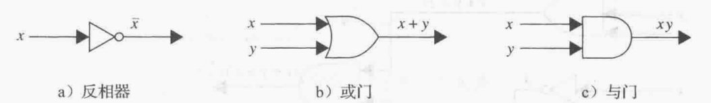{:height 70, :width 390}
		- 其中，或门和与门可以接受多个输入，即 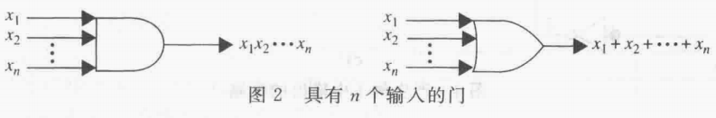{:height 70, :width 390}
- 逻辑电路
  collapsed:: true
	- 电路组合
	  collapsed:: true
		- 复杂的数字电路可以由三种简单的基本电路组合得到，
		- 给定简单命题和一个具体的输出（复合命题），就可以依据三种基本电路构造出可以得到对应输出的电路，
		- 公共输入
		  collapsed:: true
			- 可以多次写出一个输入，示例 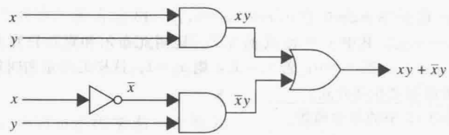{:height 100, :width 300}，
			- 也可以将输入写为分支的形式，示例 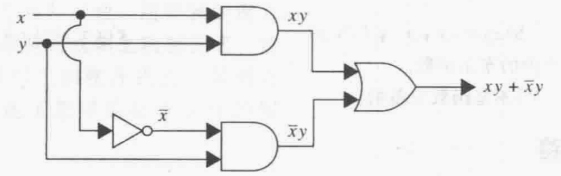{:height 110, :width 300}，
	- 类型
	  collapsed:: true
		- 组合逻辑电路：输出只与每个时刻的输入有关，与以前的输入无关，
		- 数字逻辑电路：输出与具体的输入和与以前的输入都有关，
		  collapsed:: true
			- 同步
			- 异步
	- 组合逻辑
	  collapsed:: true
		- 半加器
		  collapsed:: true
			- 定义
			  collapsed:: true
				- 计算两个二进制单位的和，即1 + 0 = 01，1 + 1 = 10，0 + 0 = 00，
				- 半加器可以输出进位，但不能接受上次加法的进位输入；所以被称为半加器，
			- 功能
			  collapsed:: true
				- 输入：两个数值（0，1），
				- 输出：一个当前位的和（0，1），一个进位值（0，1），
				- 示例 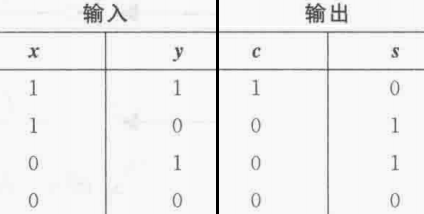{:height 150, :width 280}，
				- 其中s表示和，c表示进位（只有1 + 1才会产生进位1），
			- 实现
			  collapsed:: true
				- 可见，半加器由两个电路s，c组成，
				- 其中，$c = c(x, y) = xy；s = s(x, y) = x \oplus y = (x + y) \cdot \overline{(xy)}$，
				- 电路图 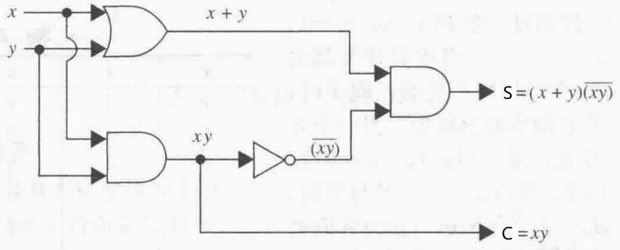{:height 140, :width 330}，
		- 全加器
		  collapsed:: true
			- 定义
			  collapsed:: true
				- 计算两个二进制单位，以及上一次计算的进位的和，
				- 进位为0时，全加器等同于半加器，
				- 进位为1时，计算方式如下
				  collapsed:: true
					- 最后的1 + 1模拟了进位1，
					- 最前的1为计算后的进位1，
				- 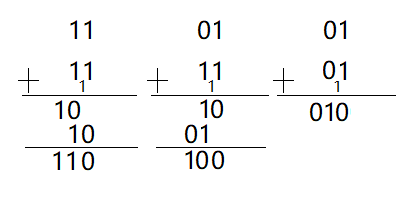{:height 150, :width 300}，
				- 输出值为和与新的进位值，
			- 功能
			  collapsed:: true
				- 输入：两个数值（0，1），一个进位值（0，1）
				- 输出：一个当前位的和（0，1），一个（新的）进位值（0，1），
				- 示例 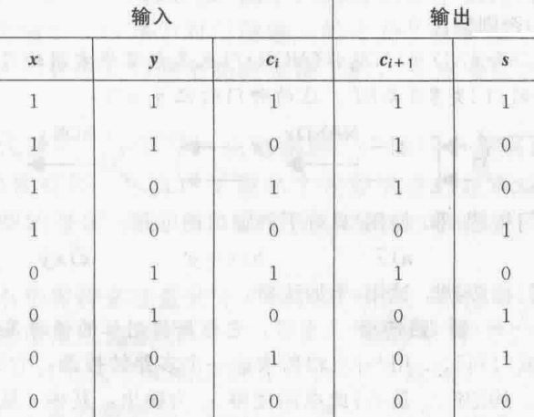{:height 200, :width 250}
				- 其中s表示和，c表示进位，
			- 实现
			  collapsed:: true
				- 全加器同样由两个电路s，c组成，
				- 可以有半加器来构造全加器，
				- 电路图 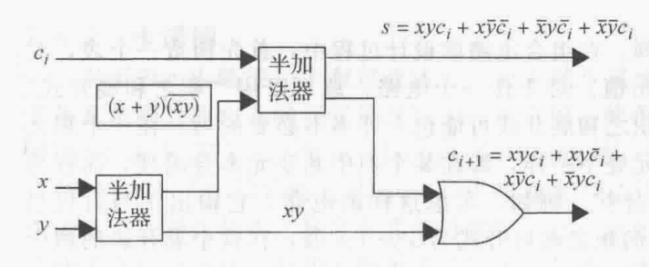{:height 140, :width 330}
		- 二进制数的加法
		  collapsed:: true
			- 利用半加器和全加器的组合，就可以计算两个k位的二进制数的和，
			- 输入：两个k位的二进制数（即2k个0，1输入），
			  collapsed:: true
				- 前几位可以为0，
			- 输出：一个k+1位的二进制数（即k + 1个0，1输出）
			  collapsed:: true
				- 此处考虑到可能有进位，
			- 示例 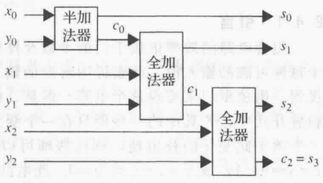{:height 210, :width 360}
		- 半减器
		  collapsed:: true
			- 定义
			  collapsed:: true
				- 计算两个二进制单位的差（和借位），即1 - 0 = 1，1 - 1 = 0，0 - 1 = (-1)1，
			- 功能
			  collapsed:: true
				- 输入：两个数值（0，1），
				- 输出：一个当前位的差（0，1），一个借位值（0，1），
				- 示例 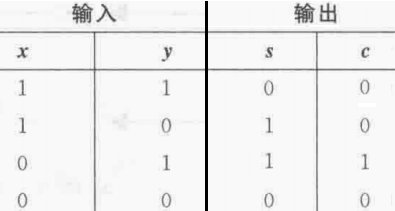{:height 140, :width 250}
				- 其中s表示差，c表示借位（只有0 - 1才会产生借位1），
			- 实现
			  collapsed:: true
				- 可见，半减器由两个电路s，c组成，
				- 其中，$c = c(x, y) = \overline{x}y；s = s(x, y) = x \oplus y = (x + y) \cdot \overline{(xy)}$，
				- 电路图 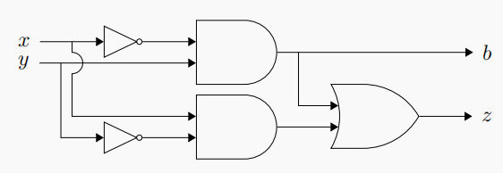{:height 120, :width 330}
		- 全减器
		  collapsed:: true
			- 定义
			  collapsed:: true
				- 计算两个二进制单位，以及上一次计算的借位的差，
				- 借位为0时，全减器等同于半减器，
				- 借位为1时，计算方式如下
				  collapsed:: true
					- 最后的0 - 1模拟了借位1，
					- 最前的1 - 0模拟了计算后的借位1，
				- 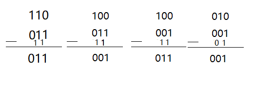{:height 110, :width 320}
				- 输出值为差与新的借位值，
			- 功能
			  collapsed:: true
				- 输入：两个数值（0，1），一个借位值（0，1）
				- 输出：一个当前位的差（0，1），一个（新的）借位值（0，1），
				- 示例 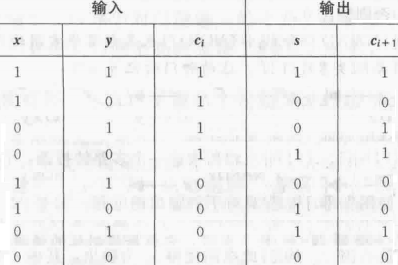{:height 230, :width 330}
				- 其中s表示差，c表示借位，
			- 实现
			  collapsed:: true
				- 电路图 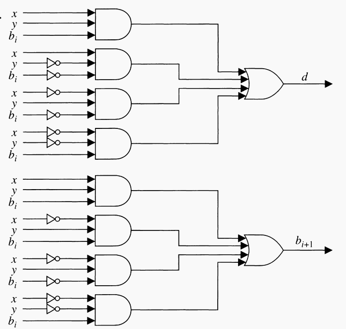{:height 320, :width 330}，
				- 根据布尔积展开式求得，
		- 二进制数的减法
		  collapsed:: true
			- 二进制数一般没有负数，因此可以先比较需要相减的两个数的大小，再用大的数减去小的数，并用一个额外的位（0，1）表示正负，
			- 利用半减器和全减器的组合，就可以计算两个k位的二进制数的差，
			- 输入：两个k位的二进制数（即2k个0，1输入），
			  collapsed:: true
				- 前几位可以为0，
			- 输出：一个k位的二进制数（即k个0，1输出）
			  collapsed:: true
				- 前几位可以为0，
	- 时序逻辑
	  collapsed:: true
		- 锁存器，触发器
-
-
-
- 其它
  collapsed:: true
	- 硬件语言（Verilog）
	- 高级数字模块
- [[计算机组成原理]]