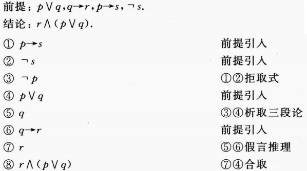

- 数学推理
  collapsed:: true
	- 数理逻辑语言是进行数学推理的基础，其实质为用规范的数学语言去描述，分析现实世界的事物，
	- 计算机并不能理解丰富多样的人类语言（可能指代较为模糊，或者有多种含义），而只能理解有明确含义的逻辑语言；因此，用严谨的逻辑命题去描述计算过程是编写计算机代码的基础，
- 命题的基本概念
	- 称涉及命题的逻辑领域为命题逻辑（或命题演算），
	- 命题（statement）
	  collapsed:: true
		- 定义
		  collapsed:: true
			- 只可能有真、假两种属性之一的陈述事实的语句，一般用小写字母表示，
			- 疑问句不是命题，不能判断真假的陈述句也不是命题，
		- 分类
			- 原子命题：不能用更简单的命题来表示的命题，一般也定义为0层公式，
			- 复合命题（命题公式）：由原子命题用逻辑运算符组合而来的命题，
				- 可以依据命题所含的运算符个数，定义公式的“层”数，
	- 命题函数（谓词逻辑）
	  collapsed:: true
		- 引入
		  collapsed:: true
			- 一般的命题中的对象是固定的，但固定对象命题并不能表达所有的数学语句的意思，
			- 因此定义了“命题函数”，即命题的谓语不再是固定的对象，而是可变的对象，
		- 定义
		  collapsed:: true
			- 称涉及n个变量$\begin{pmatrix}x_{1} & x_{2} & ... & x_{n} \end{pmatrix}$的命题语句$P(x_{1}, x_{2},... ,x_{n})$为命题函数，也称为n元谓词，
			- 命题函数同样为只有真、假两种属性之一的陈述事实的语句，
			- 其区别在于，命题函数陈述的具体事实一般会随着变量的变化而变化，因此对应的真值也可能会变化，
		- 取值
		  collapsed:: true
			- 前置条件：一般称对变量x_{i}进行运算前的命题$P(x_{1}, x_{2},... ,x_{n})$为“前置条件”，
			- 前置条件：一般称对变量x_{i}进行运算后得到的命题$P(x_{1}', x_{2}',... ,x_{n}')$为“后置条件”，
		- 命题定义域（论域）
		  collapsed:: true
			- 命题函数中的变量所能取值的范围称为命题函数的定义域，
			- 使用谓词和量词时，应首先确定命题中的变量的定义域，
			- 可将x的定义域T、量词、命题写在一起，即$\forall x \in T(P(x))$或$\exists x \in T(P(x))$
		- 真值集
		  collapsed:: true
			- 定义论域D中，使命题P为真的元素x组成的集合为真值集，
	- 命题的真值
	  collapsed:: true
		- 按照命题的定义，命题只可能有真True（1）、假False（0）两种属性之一，
		- （“真”类似集合中的全集，“假”类似集合中的空集），
		- 真假值表：可以用真假值表来描述命题的真假，一般形式为$\begin{array}{c|c} \hline p & \lnot p\\ \hline 0 & 1      \\ 1 & 0      \\  \hline \end{array}$，
	- （模糊逻辑）
	  collapsed:: true
		- 定义命题的真值可以取[0, 1]之间的任意数字，
		- 定义\not p的真值为1 - p的真值，
		- 定义p\lor q的真值为p、q命题真值的最大值，
	- 命题转换
	  collapsed:: true
		- 是否有命题函数
		  collapsed:: true
			- 判断变量个数
			- 判断变量定义域
			- 判断量词
		- 命题的所有可能情况
		  collapsed:: true
			- 命题表明的情况
			- 命题排除的情况（一般不出现在自然语言中）
		- 拆分为原子命题
		- 是否有条件命题
		  collapsed:: true
			- 单方向条件还是双方向条件
		- 选择具体的运算符号
- 命题运算
	- 命题运算符
		- 等价（逻辑相等，等值）p \equiv q
		  collapsed:: true
			- 定义
			  collapsed:: true
				- 若对于所有可能的*子命题*的真值*组合*，*复合命题*p、q的*真值*都相同，则这两个命题逻辑等价，记为p \equiv q，
				- 即p \Leftrightarrow q是永真式，
				- 双条件语句p \Leftrightarrow q只有在p、q都为真或都为假时才为真，因此p \Leftrightarrow q是永真式等同于p、q的真值相同，
			- 计算
			  collapsed:: true
				- 为了证明两个命题逻辑等价，最直接的方法是穷举出所有的子命题的真值组合，然后逐个验证，
				- 也可以根据已经推得的命题运算规律求解，
				- 反之，若想证明两个命题不等价，则只需要*一个反例*即可，
			- 其它
			  collapsed:: true
				- （理论上，等价符号 \equiv 也可以看作逻辑连接词，即p \equiv q也可当作复合命题——当p、q逻辑等价时为真，p、q逻辑不等价时为假；然而，等价符号一般只用于表示命题的真值相同，而不用于组成复合命题），
				- （北大版书籍使用$p \Leftrightarrow q$表示等价，$p \leftrightarrow q$表示双条件命题），
		- 常用
		- 非（not） ：\not p
		  collapsed:: true
			- 定义：设p为一个命题，称p的否定为“非”p，一般用\not p表示；非p的真值与原命题相反，
			- 类似集合中的“补集”$\bar{A}$，
			- 真假值表：$\begin{array}{c|c} \hline p & \lnot p\\ \hline 0 & 1      \\ 1 & 0      \\  \hline \end{array}$
		- 且（合取）（and）：p\land q
		  collapsed:: true
			- 定义：设p、q为两个命题，仅当p和q*均为真*时，p\land q为*真*；否则，p、q有一个为假时，p\land q就为假，
			- 类似集合中的“交集”\cap，
			- 推广：对于多个命题$p_{1}, p_{2},... ,p_{n}$，仅当$p_{1}, p_{2},... ,p_{n}$均为真时，$\mathop{\land}\limits_{i =1}^{n}p_i$为真；否则，$p_{1}, p_{2},... ,p_{n}$有一个为假时，$\mathop{\land}\limits_{i =1}^{n}p_i$就为假，
			- 真假值表$：\begin{array}{c|c|c} \hline p &q & p\land q \\  \hline 0 & 1 & 0 \\ 1 & 0 & 0 \\ 0 & 0 & 0 \\ 1 & 1 & 1\\  \hline \end{array}$
		- 或（析取）（inclusive or）：p\lor q
		  collapsed:: true
			- 定义：设p、q为两个命题，仅当p和q*均为假*时，p\lor q为*假*；否则p、q有一个为真时，p\lor q就为真，
			- 类似集合中的“并集”\cup，
			- 推广：对于多个命题$p_{1}, p_{2},... ,p_{n}$，仅当$p_{1}, p_{2},... ,p_{n}$均为假时，$\mathop{\lor}\limits_{i =1}^{n}p_i$为假；否则，$p_{1}, p_{2},... ,p_{n}$有一个为真时，$\mathop{\lor}\limits_{i =1}^{n}p_i$就为真，
			- 真假值表$：\begin{array}{c|c|c} \hline p &q & p\lor q\\  \hline 0 & 1 & 1 \\ 1 & 0 & 1 \\ 0 & 0 & 0 \\ 1 & 1 & 1 \\  \hline \end{array}$
		- 其它
		- 异或（exclusive or，XOR）：p \oplus q
		  collapsed:: true
			- 定义：设p、q为两个命题，当p和q*有且只有一个*为真时，p \oplus q为真；否则，p \oplus q为假，
			- p \oplus q \equiv (p \lor q) \land \not(p \land q)，
			- 异或不能简单推广至多个命题，
			  collapsed:: true
				- 若多个命题$p_{1}, p_{2},... ,p_{n}$中有且只有一个为真，则$\mathop{\oplus}\limits_{i =1}^{n}p_i$为真；
				- 反之不能成立，即$\mathop{\oplus}\limits_{i =1}^{n}p_i$为真时，不能说明$p_{1}, p_{2},... ,p_{n}$中有且只有一个为真；例如对于奇数个命题，如p、q、r均为真时，p \oplus q \oplus r为真，
			- 真假值表：$\begin{array}{c|c|c} \hline p &q & p \oplus q\\  \hline 0 & 1 & 1 \\ 1 & 0 & 1 \\ 0 & 0 & 0 \\ 1 & 1 & 0 \\  \hline \end{array}$
		- 与非（NAND，not and）：p \uparrow q
		  collapsed:: true
			- 定义：设p、q为两个命题，当p和q*均为真*时，p \uparrow q为假；否则，p \uparrow q为真，
			- p \uparrow q \equiv \not(p \land q)，
			- 真假值表：$\begin{array}{c|c|c} \hline p &q & p \uparrow q\\  \hline 0 & 1 & 1 \\ 1 & 0 & 1 \\ 0 & 0 & 1 \\ 1 & 1 & 0 \\  \hline \end{array}$，
		- 或非（NOR，not or）：p \downarrow q
		  collapsed:: true
			- 定义：设p、q为两个命题，当p和q*均为假*时，p \downarrow q为真；否则，p \downarrow q为假，
			- p \downarrow q \equiv \not(p \lor q)，
			- 真假值表：$\begin{array}{c|c|c} \hline p &q & p \downarrow q\\  \hline 0 & 1 & 0 \\ 1 & 0 & 0 \\ 0 & 0 & 1 \\ 1 & 1 & 0 \\  \hline \end{array}$，
	- 条件命题
	  collapsed:: true
		- 推导（蕴含） p \Rightarrow q
		  collapsed:: true
			- 定义
			  collapsed:: true
				- 设p、q为两个命题，称复合命题“如果p，则q”为推导语句，
				- 当且*仅当p为真，q为假*时，p \Rightarrow q为假；否则p \Rightarrow q就为真，
				  collapsed:: true
					- 理论上，只有p为True时才能推断p \Rightarrow q的真假，
					- 而p为False时，*无法推断*p \Rightarrow q的真假；为了保证“一致性”，*定义*p \Rightarrow q为真，
				- 此处“p \Rightarrow q”实际上也是*一个*命题；一般称命题p为“前提”，命题q为“结论”，
			- 真假值表：$\begin{array}{c|c|c|c} \hline p &q & p \Rightarrow q& \lnot(p \Rightarrow q) \\  \hline 0 & 1 & 1& 0 \\ 1 & 0 & 0& 1 \\ 0 & 0 & 1& 0 \\ 1 & 1 & 1 & 0\\  \hline \end{array}$
			- 其他术语
			  collapsed:: true
				- 命题推导在数学中有着重要的应用，因此存在很多表达p \Rightarrow q的术语，
				- 如“充分条件”，“如果”，“仅当”，“蕴含”等，
				- 计算机中，一般用if-（then）语句描述推导命题，其中then标识词一般会省略，
		- 推导命题的推广
		  collapsed:: true
			- 基于推导命题，可以由同样的命题p、q构成一些新的条件语句，
			- 逆命题q \Rightarrow p；否命题\not p \Rightarrow \not q
			  collapsed:: true
				- 定理：q \Rightarrow p \equiv  \not p \Rightarrow \not q，即推导命题的逆命题和否命题等价，
				- 应注意，此处定义的“否命题”\not p \Rightarrow \not q并不是原命题的“否”\not(p \Rightarrow q)，其真值也不相同，
				- 真假值表
					- $\begin{array}{c|c|c|c|c|c} \hline  p & \lnot p & q & \lnot q & q \Rightarrow p & \lnot p \Rightarrow \lnot q \\ \hline 0 & 1 & 1 & 0 & 0 & 0 \\ 1 & 0 & 0 & 1 & 1 & 1\\ 0 & 1 & 0 & 1 & 1 & 1 \\ 1 & 0 & 1  & 0 & 1 & 1\\  \hline \end{array}$
			- 逆否命题\not q \Rightarrow \not p
				- 定理： p \Rightarrow q \equiv  \not q \Rightarrow \not p，即逆否命题与原推导命题等价，
				- 逆命题、否命题的真值不能只从原推导命题的真值直接推出（需要具体的p、q命题的真值），
		- 双条件（等价）p \Leftrightarrow q
		  collapsed:: true
			- 定义
			  collapsed:: true
				- 设p、q为两个命题，称复合命题“p当且仅当q”为双条件语句；也称为“充分必要条件”，
				- 当推导命题p \Rightarrow q和其逆命题q \Rightarrow p*均为真*时，定义p \Leftrightarrow q为真，
			- 真假值表：$\begin{array}{c|c|c|c|c} \hline  p & q & p \Rightarrow q & q \Rightarrow p & p \Leftrightarrow q \\ \hline 0 & 1 & 1 & 0 & 0 \\ 1 & 1 & 1 & 1 & 1\\ 0 & 0 & 1 & 1 & 1 \\ 1 & 0 & 0 & 1 & 0\\  \hline \end{array}$
			- 定理
			  collapsed:: true
				- 双条件命题与其逆命题、否命题、逆否命题*都等价*，
				- p \Leftrightarrow q和(p \Rightarrow q) \land (q \Rightarrow p)等价，
		- 条件命题与命题运算
		  collapsed:: true
			- 自然语言中，条件命题可能与且运算混淆，但两者的真值并不相同，
			- 真值表：$\begin{array}{c|c|c|c} \hline p &q & p \rightarrow q& p \land q \\  \hline 0 & 1 & 1& 0 \\ 1 & 0 & 0& 0 \\ 0 & 0 & 1& 0 \\ 1 & 1 & 1 & 1\\  \hline \end{array}$，
			- 从真值表可以看出，关键在于p不成立时，复合命题是否成立，
			- 从逻辑规律来看，条件命题$p \rightarrow q$与或运算$\lnot p \lor q$等价，
	- 量词
	  collapsed:: true
		- 全称量词\forall
		  collapsed:: true
			- 定义\forall xP(x)的含义为：对定义域中的所有x的值，命题函数P(x)都为真，
		- 存在量词\exists
		  collapsed:: true
			- 定义\exists xP(x)的含义为：在变量x的定义域中，*至少存在一个*x使命题函数P(x)为真，
			- 应注意\exists并没有限制使P(x)成立的x的数量，即可能只有一个x使P(x)成立，也可以有多个x使P(x)成立，
		- （唯一性量词\exists！）
		  collapsed:: true
			- 定义\exists！ xP(x)的含义为：在变量x的定义域中，有且*只有一个*x使命题函数P(x)为真，
		- 量词嵌套
		  collapsed:: true
			- 同基本命题运算符一样，一个复合命题中也可以存在多个量词运算符，
			- 主要用于命题含有多个自变量$\begin{pmatrix}x_{1} & x_{2} & ... & x_{n} \end{pmatrix}$时，每个x_{i}都可以使用量词来描述，如$\forall x \forall y (x + y = y + x)$，
			- 量词间*没有*交换律，运算顺序为从左到右，
			  collapsed:: true
				- $\forall x \exist y (x + y = 0)$的意思为“对所有的x，都存在一个y使x + y = 0”；y可以为x的相反数，因此命题为真，
				- $\exist y \forall x(x + y = 0)$的意思为“存在一个y，对所有的x都有x + y = 0”；此处先固定了y，由于不可能存在一个固定的值y可以为任意的x的相反数，因此命题为假，
		- 循环
		  collapsed:: true
			- 若x的定义域为可数离散集合（如$x \in \{1, 2, 3\}$)，
			- 则可知$\forall xP(x) \equiv \mathop{\land}\limits_{i =1}^{n}P(x_{i})$，$\exists xP(x) \equiv \mathop{\lor}\limits_{i =1}^{n}P(x_{i})$，
			- 这提供了一种推理$\forall xP(x)，\exists xP(x)$的真值的思路，即利用循环逐个检验x的可能取值，
			- 虽然这一思想对无穷集合并不适用，对于由多个变量组成的命题$P(x_{1}, x_{2},... ,x_{n})$也难以进行；但仍是一种解决问题的思路（例如将无穷集合拆分为有限可列个子集），
		- （量词作用域）
		  collapsed:: true
			- 对于命题$\exists x(x + y = 1)$，变量x为量词$\exists$作用的对象；
			- 称x为“约束”变量，y为“自由”变量，
			- 此处的“约束”指命题量词对命题的限制，并非指变量x、y的定义域，
	- 命题运算规律
	  collapsed:: true
		- 复合命题的真值运算
		  collapsed:: true
			- 应先分清每个原子命题和连接符号，
			- 判断每个命题的真假，
			- 分析命题间的运算规则，
			- 根据运算规则和运算优先级，逐个判断子复合命题的真假，
			- 最后得出复合命题的真假，
		- 运算优先级
		  collapsed:: true
			- 从高到低：$\forall, \exists；\lnot, \land, \lor, \Rightarrow, \Leftrightarrow$，
			- 定义量词具有最高的优先级，即$\forall xP(x) \land Q(x)$为$(\forall xP(x)) \land Q(x)$，而不是$\forall(xP(x) \land Q(x))$，
			- 基本运算符中，“非”具有最高的优先级，即$\lnot p \land q$ 为$(\lnot p) \land q$，而不是$\lnot (p \land q)$，
			- 定义“且”的优先级高于“或”，
		- 运算规律
			- 证明
			  collapsed:: true
				- 利用逻辑等价的定义和基本运算符号，可以得到以下的命题运算规律，
				- 若复合命题由n个命题构成，则证明时应考虑的不同真假组合的个数为$2^{n}$个（重复排列），
					- 如2个命题可能有TT、TF、FT、FF四种可能，3个命题则有TTT、TTF、TFT、TFF、FTT、FTF、FFT、FFF八种可能，以此类推，
				- 然而，应尝试用简单的逻辑等价式推导更复杂的逻辑等价式，而不是每次都写出所有子命题的真假，再通过真值表判断，
			- 基本规律
			  collapsed:: true
				- 交换律
				  collapsed:: true
					- $p \land q \equiv q \land p$
					- $p \lor q \equiv q \lor p$
					- $p \oplus q \equiv q \oplus p$
				- 结合律
				  collapsed:: true
					- $(p \lor q) \lor r \equiv p \lor (q \lor r)$
					- $(p \land q) \land r \equiv p \land (q \land r)$
					- $(p \oplus q) \oplus r \equiv p \oplus (q \oplus r)$
				- 分配律
				  collapsed:: true
					- $p \lor (q \land r) \equiv (p \lor q) \land (p \lor r)$
					- $p \land (q \lor r) \equiv (p \land q) \lor (p \land r)$
				- 德摩根定律（否定律）
				  collapsed:: true
					- $\lnot (p \land q) \equiv (\lnot p) \lor(\lnot q)$；$\lnot (\mathop{\land}\limits_{i =1}^{\infty}p_i) \equiv  \mathop{\lor}\limits_{i =1}^{\infty}(\lnot p_i)$
					- $\lnot (p \lor q) \equiv (\lnot p) \land (\lnot q)$；$\lnot (\mathop{\lor}\limits_{i =1}^{\infty}p_i) \equiv  \mathop{\land}\limits_{i =1}^{\infty}(\lnot p_i)$
				- 真值等式
				  collapsed:: true
					- $p \land T \equiv p$
					- $p \land F \equiv F$
					- $p \land \lnot p \equiv F$
					- $p \lor \lnot p \equiv T$
					- $p \lor F \equiv p$
					- $p \lor T \equiv T$
			- 条件命题的规律
			  collapsed:: true
				- *推导与命题运算*
				  collapsed:: true
					- $p \rightarrow q \equiv \lnot p \lor q$
					- $\lnot (p \rightarrow q) \equiv p \land (\lnot q)$
					- $p \lor  q \equiv \lnot p \rightarrow q$
					- $p \land q \equiv \lnot (p \rightarrow \lnot q)$
				- 推导命题的推广
				  collapsed:: true
					- $p \rightarrow q \equiv \lnot q \rightarrow \lnot p$（逆否命题）
					- $q \rightarrow p \equiv  \lnot p \rightarrow \lnot q$（逆命题和否命题）
				- 多个推导命题
				  collapsed:: true
					- $(p \rightarrow q) \land (p \rightarrow r) \equiv p \rightarrow (q \land r)$
					- $(p \rightarrow r) \land (q \rightarrow r) \equiv (p \lor q) \rightarrow r$
					- $(p \rightarrow q) \lor (p \rightarrow r) \equiv p \rightarrow (q \lor r)$
					- $(p \rightarrow r) \lor (q \rightarrow r) \equiv (p \land q) \rightarrow r$
				- 双条件命题
				  collapsed:: true
					- $p \leftrightarrow q \equiv (p \rightarrow q) \land (q \rightarrow p)$（定义）
					- $p \leftrightarrow q \equiv q \leftrightarrow p \equiv \lnot p \leftrightarrow \lnot q \equiv \lnot q \leftrightarrow \lnot p$
						- 即双条件命题与其逆命题、否命题、逆否命题都等价，
					- $p \leftrightarrow q \equiv (p \land q) \lor (\lnot p \land \lnot q)$
					- $\lnot (p \leftrightarrow q) \equiv p \leftrightarrow \lnot q$
			- 量词规律
			  collapsed:: true
				- $\forall x(P(x) \land Q(x)) \equiv \forall xP(x) \land \forall x Q(x)$，
				  collapsed:: true
					- $\forall x(P(x) \lor Q(x)) \not \equiv \forall xP(x) \lor \forall x Q(x)$，
					- 即*任意*对*或*没有分配律，也没有等价式，
				- $\exist x(P(x) \lor Q(x)) \equiv \exist xP(x) \lor \forall x Q(x)$，
				  collapsed:: true
					- $\exist x(P(x) \land Q(x)) \not \equiv \exist xP(x) \land \forall x Q(x)$，
					- 即*存在*对*且*没有分配律，也没有等价式，
				- $\lnot (\forall xP(x)) \equiv \exists x\lnot P(x)$，
				  collapsed:: true
					- 即反证命题P(x)对并非对所有x都成立时，只需要一个反例即可，
					- 上式可看成广义的德摩根律，即$\lnot (\mathop{\land}\limits_{i =1}^{n}p_i) \equiv  \mathop{\lor}\limits_{i =1}^{n}(\lnot p_i)$
				- $\lnot (\exists xP(x)) \equiv \forall x\lnot P(x)$，
			- 其它
			  collapsed:: true
				- 幂等律
				  collapsed:: true
					- $p \land p \equiv p$
					- $p \lor p \equiv p$
				- 双重否定律
				  collapsed:: true
					- $\lnot (\lnot p) \equiv p$
				- 吸收律
				  collapsed:: true
					- $p \lor (p \land q) \equiv p$
					- $p \land (p \lor q) \equiv p$
		- 特殊命题
		  collapsed:: true
			- 永真式（重言式）：真值永远是真的*复合命题*，常见例子为$p \lor \lnot p$，
			- 矛盾式：真值永远是假的*复合命题*，常见例子为$p \land \lnot p$，
			- 可能式：不是永真式或矛盾式的其他复合命题，
- 命题推理
	- 可满足性
	  collapsed:: true
		- 定义
		  collapsed:: true
			- 对于复合命题，若*存在*一个子命题的真值的组合使该复合命题为真，则称该复合命题为可满足的；称这个组合为“可满足性问题”的一个解，
			- 若对于子命题的*所有*真值组合，该复合命题都为假，则称该复合命题为不可满足的，
		- 应用
		  collapsed:: true
			- 对于复杂的逻辑问题，可以利用数理逻辑建立模型，并将其转化为命题的可满足性问题，
			- 此处的逻辑问题可能由相当多条命题组成，
		- 求解
		  collapsed:: true
			- 对于涉及少量命题的可满足性问题，可以直接通过真值表来计算，
			- 对于较复杂的复合命题，应首先尝试利用运算规律对其进行化简，
			- 根据可满足性命题的定义，命题p是不可满足的 \Leftrightarrow  
			   \not p是永真式；因此可以通过分析 \not p来判断，
		- 数独问题
		  collapsed:: true
			- 概述
			  collapsed:: true
				- 在一个9*9的方格（理论上数独可以为n * n的方格，此处为了简化问题，选择9 * 9方格）内填入数字1-9，
				- 每行数字、每列数字、每个小的3*3方格的数字不能重复，
				- 每个方格只能有1个数字，
				- 预先给出了一些数字，
			- 命题建立
			  collapsed:: true
				- 设原子命题为p(i, j, n)，当数字n可以位于第i行第j列时，该原子命题为真，
				- 由于i, j, n都可以取1-9，因此共有9^{3} = 729个命题，
			- 条件转化
			  collapsed:: true
				- 求解的关键在于，先将总体的条件分为三个具体的条件，再将每个具体的条件拆分为每一行、每一列，最后再将每一行、每一列细化到每一个小格，
				- 每行都有数字1-9：$\mathop{\land}\limits_{i =1}^{9} \mathop{\land}\limits_{n =1}^{9} \mathop{\lor}\limits_{j =1}^{9}p(i, j, n)$，
					- 首先，假设第i行有数字n，则n可以在任一列中，因此可以用“或”表示$\mathop{\lor}\limits_{j =1}^{9}p(i, j, n)$（对列j求和），
					- 然后，第i行应有所有的数字n（1-9），因此需要用“且”表示，即$\mathop{\land}\limits_{n =1}^{9} \mathop{\lor}\limits_{j =1}^{9}p(i, j, n)$（对数字n求和），
					- 最后，每一行都要有所有的数字n（1-9），同样，需要用“且”表示，即$\mathop{\land}\limits_{i =1}^{9} \mathop{\land}\limits_{n =1}^{9} \mathop{\lor}\limits_{j =1}^{9}p(i, j, n)$（对行i求和）
				- 每列都有数字1-9：$\mathop{\land}\limits_{j =1}^{9} \mathop{\land}\limits_{n =1}^{9} \mathop{\lor}\limits_{i =1}^{9}p(i, j, n)$，
				- 每个小格都有数字1-9：$\mathop{\land}\limits_{r = 0}^{2} \mathop{\land}\limits_{s = 0}^{2} \mathop{\land}\limits_{n =1}^{9} \mathop{\lor}\limits_{i =1}^{3} \mathop{\lor}\limits_{j =1}^{3}p (3r + i, 3s + j, n)$，
			- 排除
			  collapsed:: true
				- 每个单元只能有1个数，即$\land (p(i, j, n) \Rightarrow \lnot p(i, j, n'))$，其中$n \not = n'$，
			- 使上述所有命题的“且”为真的原子命题p(i, j, n)的组合，即为数独的解，
	- 论证
	  collapsed:: true
		- 数个条件命题组合成的复合命题；一般称最后得到的一个命题为结论，前面的所有命题为前提，
		- 有效性
			- 定义
			  collapsed:: true
				- 若所有的前提命题都为真时，结论命题一定也为真，则称论证*有效*，
				- 若将前提命题写为p_{1}, p_{2}, ...p_{n} ，结论命题写为q，则有效论证的意思为$(f(p_{1}, p_{2}, ...p_{n}) \rightarrow q) \equiv T$，
			- 注意事项
			  collapsed:: true
				- *有效*指的是推理的*过程*，并非得到的结果，
				- 有效的推理不能说明结论命题一定为真；
				  collapsed:: true
					- 由条件命题的真值定义可知，即使条件命题真值为真，若前提命题为假，则结论命题也可能为假，
				- 结论命题为真的推理不一定为有效推理；
				  collapsed:: true
					- 部分推理基于*可满足*性，即*存在*p_{i}的某个真值组合，使f(p_{1}, p_{2}, ...p_{n})为真时q也为真（换言之，也存在f(p_{1}, p_{2}, ...p_{n})为真时，q为假的p_{i}的真值组合），
					- 然而，有效推理的定义为，对于*所有*使f(p_{1}, p_{2}, ...p_{n})为真的真值组合，q一定为真，
					- 一个简单的例子为$p \lor q \lor r \rightarrow p$，
					  collapsed:: true
						- 若结论（p）为真，则前提$p \lor q \lor r$一定为真，此时推理成立；
						- 然而，q或r为真时，前提$p \lor q \lor r$也为真，但此时结论p可能不为真；
						- 因此按照定义，这不是一个*有效*的推理，
			- 常见错误
			  collapsed:: true
				- 肯定结论错误
				  collapsed:: true
					- 指推理$(p \rightarrow q) \land q \rightarrow p$，
					- 可以理解为给定信息$p \rightarrow q$，然后从结论q为真反推p为真，
					- 然而，根据条件命题的真值定义，结论q为真时，前提p可能为假，
				- 否定假设错误
				  collapsed:: true
					- 指推理$(p \rightarrow q) \land \lnot p \rightarrow \lnot q$，
					- 可以理解为给定信息$p \rightarrow q$，然后从前提p不为真推出结论q也不为真，
					- 然而，条件命题的否命题的真值与原条件命题不同（只有双条件命题时两者真值相同），即前提p为假时，结论q可能为真，
		- 论证过程
			- 判断是否有谓词命题
			  collapsed:: true
				- 判断量词
				- 将量词名词写为特指命题
			- 将命题拆分为原子命题
			- 列出所有的前提条件（已知命题）
			- 论证过程
			  collapsed:: true
				- 命题的等价转换（等价式）
					- 为了便于论证，可以将已知命题转化为等价的命题，
					- 给出命题推出的中间结论，也可以转化为等价的命题，
				- 论证规则的使用（永真式）
					- 论证规则一般为且运算，
					- 命题间可以任意组合，
					- 给出命题推出的中间结论，也可以继续与给出命题组合，
			- 示例
			  collapsed:: true
				- {:height 220, :width 380}
	- 论证规则
	  collapsed:: true
		- 条件为$p \rightarrow q$的推理
		  collapsed:: true
			- 假言推理
			  collapsed:: true
				- $((p \rightarrow q ) \land p) \rightarrow q \equiv T$，
				- 即给出“p可以推出q”的信息后；若命题p为真，则命题q一定为真，
			- 取拒式
			  collapsed:: true
				- $((p \rightarrow q) \land \lnot q) \rightarrow \lnot p  \equiv T$
				- 即给出“p可以推出q”的信息后；若命题q不为真，则命题p一定也不为真，
			- 假言三段论
			  collapsed:: true
				- $((p \rightarrow q) \land (q \rightarrow r)) \rightarrow (p \rightarrow r) \equiv T$
				- 即给出“p可以推出q”的信息后；若“q可以推出r”为真，则“p可以推出r”一定为真，
			- 等价证明
			  collapsed:: true
				- $((p \rightarrow q) \land (q \rightarrow p)) \leftrightarrow (p \leftrightarrow q) \equiv T$
				- 根据双条件命题的定义得到，用于论证充分必要条件，
			- 多等价证明
			  collapsed:: true
				- $((p_{1} \rightarrow p_{2}) \land (p_{2} \rightarrow p_{3})...(p_{n} \rightarrow p_{1})) \leftrightarrow (p_{1} \leftrightarrow p_{2} \leftrightarrow p_{3} ...\leftrightarrow p_{n}) \equiv T$
				- 上述命题实际上建立了一个推导链，即对任意p_{i}，p_{j}，总可以找到语句p_{i} \rightarrow p_{i + 1}，p_{i + 1} \rightarrow p_{i + 2}... p_{i + k} \rightarrow p_{j}，
				- 因此，不需要证明对任意i \neq j都有直接证明语句p_{i} \rightarrow p_{j}，就可以说明p_{i}之间等价，
				-
		- 条件为$p \lor q$的推理
		  collapsed:: true
			- 消去律
				- $((p \lor q) \land (\lnot p \lor r)) \rightarrow (q \lor r) \equiv T$
				- 即给出“p或q为真”的信息后；若给出“非p或r为真”，则必有“q或r为真”，
			- 析取三段论
				- $((p \lor q) \land (\lnot p)) \rightarrow q \equiv T$，
				- 即给出“p或q为真”的信息后；若命题p不为真，则命题q一定为真，
				- 析取三段论可以看成消去律中给出r不为真的特例，
		- 其它
		  collapsed:: true
			- 附加律：$p \rightarrow (p \lor q) \equiv T$
			- 化简律：$(p \land q) \rightarrow p \equiv T$
			- 合取律：$(p) \land (q) \rightarrow (p \land q) \equiv T$
	- 量词论证
	  collapsed:: true
		- 命题转换
		  collapsed:: true
			- 带有量词的命题的运算一般较为复杂，不适合进行推理，
			- 因此，可以利用特定的代词（c）来表述命题，以便后续推理，
			- 推理得到结论后，同样可以根据代词的形式，将其转换回量词命题，
		- 量词命题转换为命题
		  collapsed:: true
			- $\forall xP(x) \rightarrow P(c)$：指给出全称命题后，则可以将其写为命题P对*任意一个*定义域中的元素c成立，
			- $\exist xP(x) \rightarrow P(c)$：指给出存在命题后，则可以将其写为命题P对一个*特定的*元素c成立；
		- 命题转换为量词命题
		  collapsed:: true
			- $\forall c, P(c) \rightarrow \forall xP(x)$：指给出对*任意一个*定义域中的元素c，命题P都成立的信息后，则可以将其写为全称命题，
			  id:: 50e07768-e004-468f-9b40-134d55108da0
			- $\exist c, P(c) \rightarrow \exist xP(x)$：指给出*存在一个*定义域中的元素c使命题P都成立的信息后，则可以将其写为存在命题，
		- 量词推理规则
		  collapsed:: true
			- 全称假言推理
				- $((\forall x(P(x) \rightarrow Q(x)) ) \land P(a)) \rightarrow Q(a) \equiv T$，
			- 全称取拒式
				- $((\forall x(P(x) \rightarrow Q(x)) ) \land \lnot Q(a)) \rightarrow \lnot P(a)  \equiv T$
- 命题逻辑的应用
  collapsed:: true
	- Prolog程序
	  collapsed:: true
		- Prolog事实
		- Prolog规则
	- 布尔搜索
	  collapsed:: true
		- 称采用了命题逻辑来判断搜索语句的搜索方法为布尔搜索，
	- 语句翻译
	  collapsed:: true
		- 为了应用命题逻辑，需要将人类语言翻译为复合命题，
		- 然后就可以判断其真值，并对其进行操作，
	- （逻辑谜题）
	  collapsed:: true
		- 先将希望得到的结论写为命题，
		- 再将已知的信息写为命题（一般为较复杂的复合命题），
		- 利用逻辑推理方式分析，
- （证明方法）
	- 基本概念
	  collapsed:: true
		- 定义：对事物的描述性命题，一般真值总为真，
		- 公理：不需要证明的，假定为真的命题；一般作为证明定理为真的前提，
		- 定理：能够被证明为真的命题；也称为“事实”或“结论”，
		- 引理：能够被证明的真的命题，但其重要性一般不如定理，
		- 推论：由定理经简单运算就可以推导出的为真的命题，
		- 猜想：人们提出的真值可能为真的命题，
	- 证明方法
	  collapsed:: true
		- 直接证明法
		  collapsed:: true
			- 根据s（一般为定义和公理）可以推出p，
			- 假设p为真，
			- 然后论证p和s可以推出q，
			- 因此q为真，
		- 反证法
		  collapsed:: true
			- 假设*结论*的否 \not q为真，
			  collapsed:: true
				- 基于逆否命题与原推导命题等价的规律，即p \Rightarrow q \equiv  \not q \Rightarrow \not p，
			- 根据s（一般为定义和公理）和\not q推理得到\not p为真，
			- 由于p为给定的前提，因此一定为真，即\not p应该为假，
			- 所以\not q也为假，即q为真，
		- 归谬法
		  collapsed:: true
			- 假设*命题*的否 \not p为真，
			- 根据s（一般为定义和公理）和\not p推理得到命题(r \land \not r)为真，
			- 由命题运算规律，r\land \not r一定为假，
			- 所以\not p为假，即p为真，
		- 反向推理法
		  collapsed:: true
			- 部分情况下，直接证明命题所需要的条件难以直接找到 ；此时可以尝试从结论q反推出前提p，
			- 不同于反证法，此处假设结论q为真，
			- 根据s（一般为定义和公理）和q推理得到p为真，即寻找$q \rightarrow r \rightarrow s \rightarrow p$，
			- 判断上述命题的每一步是否都为双条件命题，即$q \leftrightarrow r \leftrightarrow s \leftrightarrow p$，
			- 若都为双条件命题，则可写出证明$p \rightarrow s \rightarrow r \rightarrow q$，
		- 分情况证明法
		  collapsed:: true
			- 基于$[(p_1\lor p_2 \lor ... \lor p_{n}) \rightarrow q] \leftrightarrow [(p_{1} \rightarrow q) \land (p_{2} \rightarrow q) \land ...(p_{n} \rightarrow q)]$，
			- 一般用于直接证明比较困难，但证明某些特殊情况较容易时，
			- 若所考虑的情况有限，即可以列出所有情况并逐个证明，则称这种方法为穷举法(exhaustive)，
		- 存在性证明
		  collapsed:: true
			- 对于存在性命题，只需要找到一个对应的解就可以说明其正确，
			- 构造性：若对应的解*可以求得*（一般需要通过大量的计算），则称这种存在性证明为构造性的，
			- 非构造性：若可以从逻辑上推得解存在，但*没有求得*准确的解，则称这种存在性证明为非构造性的，
		- 唯一性证明
		  collapsed:: true
			- 部分定理断言*有且只有*一个元素可以使命题成立，
			- 一般分两步证明唯一性定理，
			- 第一步为存在性证明，
			- 第二步证明若x、y都符合这一定理，则必有x = y；进而说明唯一性，
		- （空证明和平凡证明）
		  collapsed:: true
			- 空证明：基于p为False时p \Rightarrow q为真；即通过证明前提为假（无论结论真假），说明命题为真，
			- 平凡证明：基于q为True时p \Rightarrow q为真；即通过证明结论为真（无论前提真假），说明命题为真，
	- 寻找反例
	  collapsed:: true
		- 证明命题一般比较困难，
		- 对于较复杂的命题，若难以直接证明，可以尝试取一些简单的特殊值来寻找反例，
		- 对于任意性命题，如果存在一个反例，就可以说明命题是错的，
-
- [[离散数学]]