- [[集合论]]
- 映射
  collapsed:: true
	- 基本概念
	  collapsed:: true
		- 设A，B都为非空集合，
		- 若运算f使得对A中的*每一个*元素，有且只有一个B中的元素与其对应，则称$b = f(a)$为A到B的一个映射，
		- 称集合A为f的*定义域*，集合B为f的*陪域*，
		  collapsed:: true
			- 按照定义，A中的不同元素可以对应B中的同一个元素，但B中的不同元素不可能对应A中的同一元素，
			- 按照定义，*并非*B中的每一个值都必须要有A中的值与其对应（对比“满射”），
			- 称函数所能取的所有的值（即f(a)）为函数的值域（一般为陪域的子集），
		- 引理
		  collapsed:: true
			- 若 $A_{1}, A_{2} \subset A, B_{1}, B_{2} \subset B$；
			- 则 ${f}^{-1}({B}_{1} \cap {B}_{2}) = ({f}^{-1}({B}_{1}) \cap f({B}_{2}))$；$f({A}_{1} \cap {A}_{2}) \subset (f({A}_{1}) \cap f({A}_{2}))$ ，
			- （交集可能为空集），
	- 非映射
	  collapsed:: true
		- 示例 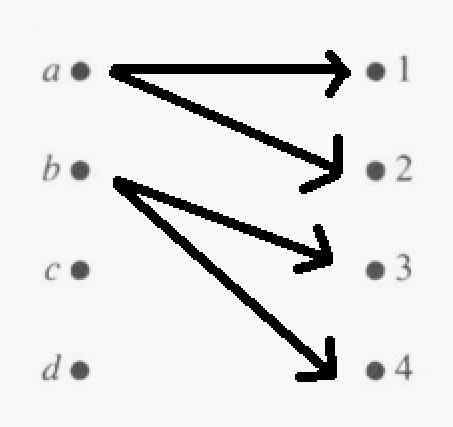{:height 160, :width 160}，
	- 单射
	  collapsed:: true
		- 若对于定义的集合A和映射f， $\forall a_{i}, a_{j}\in A , a_{i} \neq a_{j} \leftrightarrow f(a_{i}) \neq f(a_{j})$ ，则称函数f为单射，
		- 示例 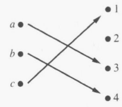{:height 150, :width 160}，单射，但非满射，
	- 满射
	  collapsed:: true
		- 若对于定义的集合A，B， $\forall b \in B , \exist a \in A (f(a) = b)$ ，则称函数f为满射，
		- 示例 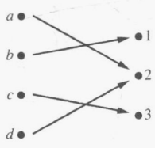{:height 160, :width 160}，满射，但非单射，
	- 双射（一一映射）
	  collapsed:: true
		- 若函数既为单射又为满射，则称函数为双射，或一一对应函数，
		- 示例 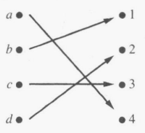{:height 160, :width 160}，
- 函数
  collapsed:: true
	- 定义
	  collapsed:: true
		- 一般称陪域集合B为数集的映射为函数，
		- 定义域与值域：“定义域”为自变量x的取值范围，“值域”为因变量y的取值范围，
		  collapsed:: true
			- 若函数的定义域（值域）连续，则可以用自变量可以取到的最值来表示定义域，
			- 奇数次根式的定义域为R，偶数次根式的定义域为（0，+∞），
		- 应注意题目中的未知量是常数还是变量，尤其对于积分、微分时，应分清求导变量、自变量与积分变量（积分限）。
	- 像集与原像集
	  collapsed:: true
		- 设f为函数，集合A为f的定义域，集合B为f的*陪域*，
		- 对于A的子集C，称C经f得到的*集合*为像（集），记为 $f(C):\{(f(x)| x \in C)\}$ ，
		- 对于B的子集D，称D在集合A中对应的元素的*集合*为原像（集），记为 $f^{-1}(D):\{x \in A| f(x) \in D)\}$ ，
		  collapsed:: true
			- （此处的逆符号不同于反函数的符号，即映射f不一定为一一映射），
			- 原像集可以为空集，
	- 无穷区间
	  collapsed:: true
		- 广义实值函数
	- 上水平集与下水平集
- 特征函数
  collapsed:: true
	- 定义
		- 设函数f的定义域为A，集合C \subset A，
		- 称特征函数$I_{C} =  \begin{cases}  1 & x \in C \\ 0 & x \not \in C \end{cases}$，
	- 可以将集合的运算转化为集合的特征函数的运算，
- 简单函数
  collapsed:: true
	- 只可取有限个的值的函数，
	- 任何函数都可以用简单函数逼近，
- 函数的表示
  collapsed:: true
	- 列表（穷举所有自变量与因变量）
	- 函数图形
	- 函数的表达式（解析形式）
	  collapsed:: true
		- 标准形式：y = f(x)，
		- 分段函数
		- 隐函数
		  collapsed:: true
			- 以F(x, y) = 0的形式表示的函数，
		- 参数方程形式
		  collapsed:: true
			- $F(x, y) = \begin{cases}  x = g(r, t) \\ y = h(r, t) \end{cases}$，
			- 若x，y均为单参数的参数方程g(t)，且函数有反函数，则可写出t = g^{-1}(x)，即y = h[g^{-1}(x)]，
	- 函数的分段表示
	- 隐函数
	- 函数的参数方程
- 函数的变换
  collapsed:: true
	- 直角坐标
	  collapsed:: true
		- 平移，伸缩
		- 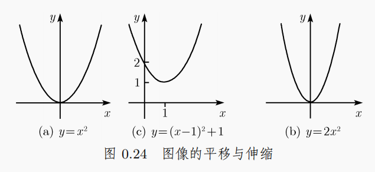{:height 168, :width 355}
		- 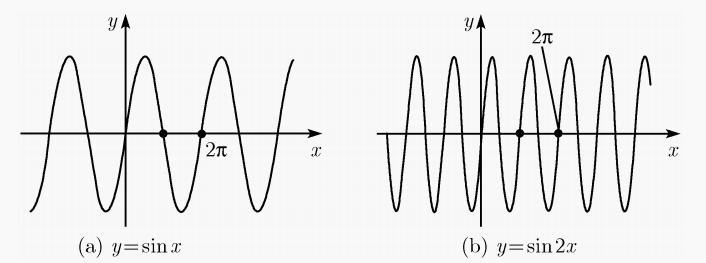{:height 153, :width 356}
		- 沿坐标轴对称，
		- 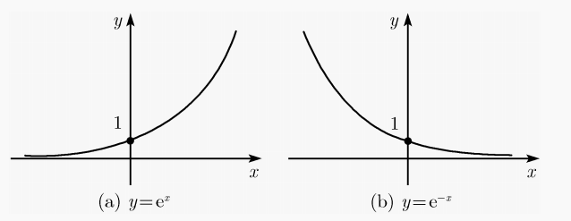{:height 142, :width 358}
- 函数的运算
  collapsed:: true
	- 函数运算的实质为对定义域中的每个值进行逐点运算，
	- 相等
	  collapsed:: true
		- 函数f和g相等 \Leftrightarrow f和g的定义域S_{f} = S_{g}，且\forall x \in S_{f}, f(x) = g(x)，
	- 四则运算
	  collapsed:: true
		- 只有定义域相同的函数才可以进行四则运算，
		- 线性组合
		  collapsed:: true
			- 可以用简单的函数多项式来近似表达式复杂的函数，如泰勒级数和傅里叶级数，
	- 反函数（逆映射）
	  collapsed:: true
		- 定义（一一对应函数）
		  collapsed:: true
			- ∀ x_{ 1}, x_{ 2} ∈ I，若x_{ 1} ≠ x_{ 2} → f(x_{ 1}) ≠  f(x_{ 2})，则称函数f 为一一对应函数，
		- 定义（反函数）
		  collapsed:: true
			- ∀ y ∈ I，∃唯一的x使y = f(x)，则称f有反函数，记为x = f^{ -1}(y)，
			- 只有一一对应函数才有反函数，即严格意义上 $y = x^2$ 没有反函数，
			  collapsed:: true
				- 若限制定义域和值域为非负实数，则 $y = x^2$ 有反函数，
		- 定理
		  collapsed:: true
			- 严格单调函数必有反函数，且反函数与原函数单调性相同；但其逆命题不成立，即有反函数不能说明函数一定为严格单调（函数可能为单调性不同的*分段函数*），
			- 设 f 为区间 I 中的可微函数；如果 f 的一阶导数处处非零，则 f 有反函数，且其反函数同样可微，
		- 性质
		  collapsed:: true
			- $f^{-1}[f(x)] = f[f^{-1}(x)] = x，\neq 1$，
			  collapsed:: true
				- 示例
				  collapsed:: true
					- 设$f(x) = x^{2}, f^{-1}(x) = \sqrt{x} = g(x) (x > 0)$，
					- 则$f^{-1}[f(x)] = g[f(x)] = \sqrt{(x^{2})} = x$，
					- $f[f^{-1}(x)] = f[g(x)] = (\sqrt{x})^{2} = x$，
			- 反函数与原函数关于y = x对称，
			- 对于反函数 $x = \phi(y)$ , 应注意 $x<\phi(b) \leftrightarrow f(x)<b$ ，
	- 复合函数
	  collapsed:: true
		- 函数可以复合的前提：定义域的交集不为空集（即可以不完全重合），
		- 复合函数的运算：基本规则为“由内到外”；
		  collapsed:: true
			- 如$\sqrt {x^2} = |x|$(x \in R)，但${(\sqrt {x})}^2 = x$(x > 0)，
			- 
		- 复合函数的求解：凑原函数（凑微分、积分），变量代换，
		- 性质
			- 没有交换律，即$f \circ g \neq g \circ f$，
			- 结合律，$(f \circ g) \circ h =  f \circ (g \circ h)$，
- 函数的基本性质
  collapsed:: true
	- 有界性
	  collapsed:: true
		- 所说的“函数f(x)”有界的意思为，函数的因变量y = f(x)的取值范围，即函数的*值域集合*有界，
		- f(x)在区间D上有界 \Leftrightarrow f(x)在区间D上既有上界也有下界，
		- 导数与有界性
		  collapsed:: true
			- 有限区间
			  collapsed:: true
				- f(x)有界$\not \to$ f'(x)有界，如$\sqrt x$，
				- f'(x)有界 \to f(x)有界，可由原函数$f(x) = \int_{a}^{x}f'(t)dt \le \int_{a}^{x}Mdt$说明，
			- 无穷区间
			  collapsed:: true
				- f(x)有界 \to $\lim\limits_{x \to \infty} \dfrac {f(x)} x = 0$，但导数不一定存在（如sin x），
				- $\lim\limits_{x \to \infty} f'(x) = 0 \not \to$ f(x)有界，如ln x，
				  collapsed:: true
					- “导数”比较的是f(x)与 x 的关系，因此只能说明f(x) 是 x 的无穷小，
	- 单调性
	  collapsed:: true
		- 若\forall x_{1}, x_{2} \in I, x_{1} < x_{2}时总有f(x_{1}) (<)≤ f(x_{2})，则称函数f在I上（严格）单调增，
		- 同理，若\forall x_{1}, x_{2} \in I, x_{1} < x_{2}时总有f(x_{1}) (>)≥ f(x_{2})，则称函数f在I上（严格）单调减，
		- 推论：区间 I 上的单调函数 f，在区间内的任意一点的左极限和右极限都存在且有限（单调有界定理，确界原理），
	- 周期性
	  collapsed:: true
		- 最小正周期：使f(x) = f(x + T)成立的最小的数字T，
		- 周期函数可以没有最小正周期，如狄利克雷函数：y = 1（x为有理数）/y = 0（x为无理数），
		- 可导周期函数的导数仍为周期函数，且周期仍为T；即f'(x) = f'(x + T)，
		- 可导周期函数的积分上限函数不一定为周期函数；即$F(x + T) = \int_{0}^{x + T}f(t)dt  = \int_{0}^{T}f(t)dt + \int_{T}^{x + T}f(t)dt = \int_{0}^{T}f(t)dt + F(x)$，
	- 奇偶性
	  collapsed:: true
		- *前提*：f(x)的定义域关于原点对称，
		- （若奇函数在原点有定义，则必有f(0) = 0），
		- 可导奇函数的导数为偶函数，可导偶函数的导数为奇函数，
		- 连续奇函数的原函数（全部）为偶函数，连续偶函数的原函数只有一个（待定常数C = 0）为奇函数，
- 基本初等函数
	- 定义
	  id:: 63511e42-bd01-436c-9569-d93d435a44bf
	  collapsed:: true
		- 反三角函数，三角函数，
		- 对数函数，指数函数，
		- 幂函数，（常值函数f(x) = C），
	- 幂函数与对数函数
		- $\begin{array}{c|c} \hline y = a^{x} & x = \log_{a} y \\ \hline a^{-x} = \dfrac{1}{a^{x}} & -\ln x = \ln \dfrac{1}{{x}} \\ \hline a^{x}a^{y} = a^{x + y} & \ln(xy) = \ln x + \ln y\\ & \ln(\frac{x}{y}) = \ln x - \ln y\\ \hline (a^{x})^{y} = a^{xy} & \ln x^{y} = y\ln x \\ \hline a^{x} = e^{x\ln a} & \log_{a} {b} = \dfrac{\ln b}{\ln a} \\ \hline \end{array}$，
		- 幂函数与对数函数将基本运算中的乘法与除法互换为了加法与减法，因此计算时应注意，
		- 幂函数运算时（主要为根式运算）应注意*复合函数的运算*规则，并适当的加*绝对值*；如$(x^{2})^{\frac{3}{2}} = |x|^{3}$，$\sqrt {x^2} = |x|$，但${(\sqrt {x})}^2 = x(x > 0)$，
	- #三角函数
		- 定义
		  collapsed:: true
			- 单位圆定义
			  collapsed:: true
				- 将传统的直角三角形定义$x \in (0, \dfrac{\pi}{2}), \sin x \in[0, 1], \cos x \in[0, 1]$，
				- 推广至钝角$(0, 2\pi)$和负角度$(-\dfrac{\pi}{2}, 0)$，
				- 再由周期性，进一步推广到R，
				- 对应的三角函数取值也推广到了正值和负值$\sin x \in[-1, 1], \cos x \in[-1, 1]$，
			- 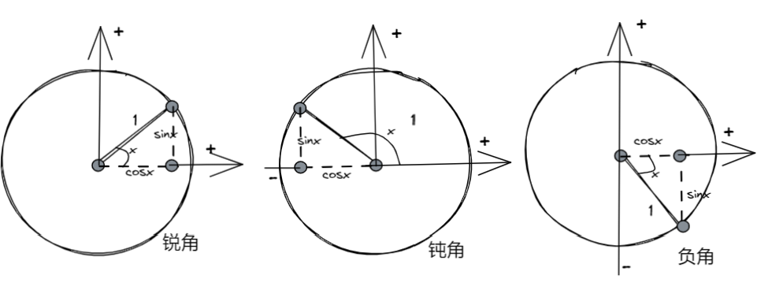
			- 
			- sin x，cos x 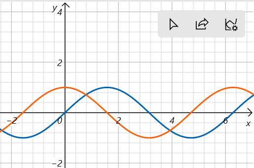{:height 143, :width 200}，
		- 其他三角函数
		  collapsed:: true
			- sin x 和cos x是基本的三角函数；其它的三角函数（tan x, cot x, sec x, csc x）都可以由其计算得到，
			- 常用的为tan x，cot x 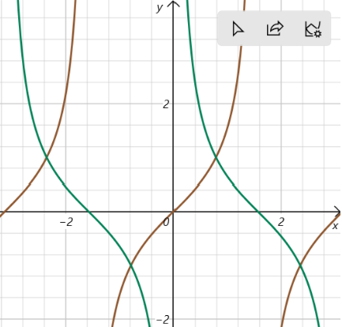{:height 200, :width 200}，
			- 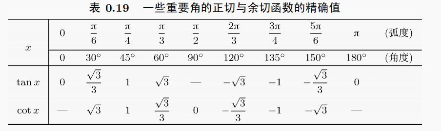
		- 《《基本公式
			- 恒等式
			  collapsed:: true
				- $\sin^{2}x + \cos^{2}x = 1$，
				- $\sec^{2}x = 1 + \tan^{2}{x}$
				- $\csc^{2}x = 1 + \cot^{2}{x}$
				- $\tan x = \csc 2x - \cot 2x$，
			- 诱导公式（单位圆定义）
			  collapsed:: true
				- ，
			- 倍角公式
			  collapsed:: true
				- de Moivre：$(\cos x + i \sin x)^{n} = \cos nx + i\sin nx$，
				- 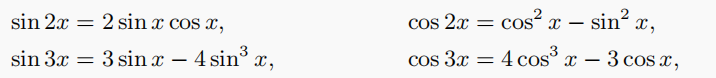，
				- 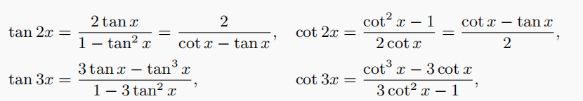，
			- 半角公式（降幂公式）
				- 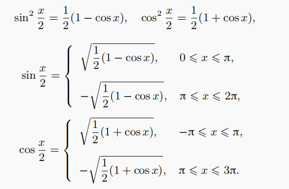{:height 176, :width 259}
				- 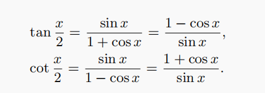{:height 99, :width 259}
			- 加法公式（和差化积）
			  id:: 632a71e5-805c-4bdb-8c99-177930c73b78
			  collapsed:: true
				- 常用：$\sin x + \cos x = \sqrt{2}\sin(x + \frac{\pi}{4}) = \sqrt{2}\cos(x - \frac{\pi}{4})$，
				- 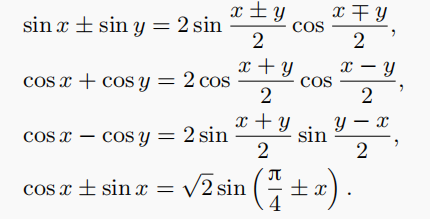{:height 158, :width 283}，
				- 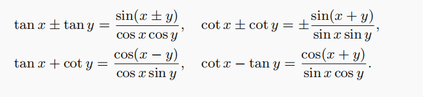，
			- 其它
			  collapsed:: true
				- 余弦定理
				  collapsed:: true
					- a^{2} = b^{2} + c^{2} - 2bc cosA，
				- 正弦定理
				  collapsed:: true
					- $\frac{a}{\sin A} = \frac{b}{\sin B} = \frac{c}{\sin C}$
				- 积化和差
				  collapsed:: true
					- 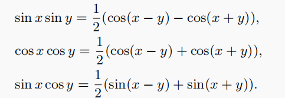，
					- 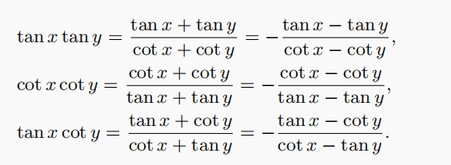，
				- 高阶降幂公式（方幂公式）
				  collapsed:: true
					- 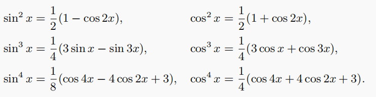
		- 求导与积分式
			- #基本初等函数的积分公式
			- （辅助三角形）
	- 反三角函数
		- 定义（图像）
		  collapsed:: true
			- arcsin x, arccos x {:height 224, :width 176}，
			- 定义域为[-1, 1]，限定为单值函数，值域为弧度，
			- arctan x, arccot x {:height 157, :width 203}，
			- 定义域为R，限定为单值函数，
		- 基本公式
		  collapsed:: true
			- 恒等式
			  collapsed:: true
				- $\arcsin x + \arccos x = \dfrac{\pi}{2}$，
				- $\arcsin x = \arccos \sqrt{1 - x^{2}}，(x > 0)$，
				- $\arctan x + \text {arccot} x = \dfrac{\pi}{2}$，
				- $\arctan x = \text {arccot} \dfrac{1}{x}，(x > 0)$，
				- $\arcsin x = \arctan\dfrac{x}{\sqrt{1 - x^{2}}}$，
				- $\arctan x = \arcsin\dfrac{x}{\sqrt{1 + x^{2}}}$，
		- 求导与积分公式
- 初等函数
	- 定义
	  collapsed:: true
		- 由基本初等函数经过有限次四则运算和复合运算所生成的函数，
		- 初等函数的连续性
	- 圆锥曲线（**conic sections**）
	  collapsed:: true
		- 定义
		  collapsed:: true
			- 平面截对顶圆锥时产生的截线，
			- 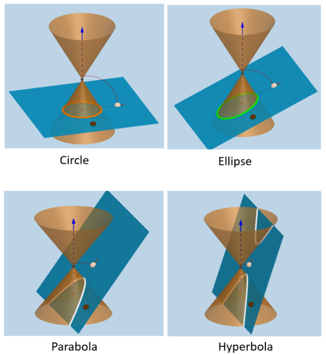{:height 261, :width 231}
		- 椭圆（ellipse）
		  collapsed:: true
			- 定义：到两个定点（焦点）的距离之和等于定长（2a）的点P的轨迹，
			- $\dfrac{x^{2}}{a^{2}} + \dfrac{y^{2}}{b^{2}} = 1，(a > b)$，
			- 离心率$e = \sqrt{a^{2} - b^{2}}$，点$(\pm e, 0)$为椭圆的焦点，
			- 数值离心率$\varepsilon = \dfrac{e}{a} \in [0, 1)$，等于0时为圆，
			- 点$(x_{0}, y_{0})$处的切线方程$\dfrac{xx_{0}}{a^{2}} + \dfrac{yy_{0}}{b^{2}} = 1$，
			- 参数方程$x = a \cos t，y = b \sin t$，
		- 双曲线（hyperbola）
		  collapsed:: true
			- 定义：到两个定点（焦点）的距离的差等于定长（2a）的点P的轨迹，
			- $\dfrac{x^{2}}{a^{2}} - \dfrac{y^{2}}{b^{2}} = 1，(a > b)$，
			- 线性离心率$e = \sqrt{a^{2} + b^{2}}$，点$(\pm e, 0)$为双曲线的焦点，
			- 数值离心率$\varepsilon = \dfrac{e}{a}(> 1)$
			- 渐近线$y = \pm\dfrac{b}{a}x$，
			- 点$(x_{0}, y_{0})$处的切线方程$\dfrac{xx_{0}}{a^{2}} - \dfrac{yy_{0}}{b^{2}} = 1$，
			- 参数方程（双曲函数）$x = -a \cosh t，y = b \sinh t$，
		- 抛物线（parabola）
		  collapsed:: true
			- 定义：到定点（焦点）和定直线（准线）的距离相等的点P的轨迹，
			- $y^{2} = 2px(p > 0)$，
			- 数值离心率$\varepsilon = 1$
			- 离心率$e = \dfrac{p}{2}$，点$(e, 0)$为抛物线的焦点，
			- 点$(x_{0}, y_{0})$处的切线方程$yy_{0} = p(x + x_{0})$，
	- （幂函数）多项式
	- 有理函数（多项式分式）
	  collapsed:: true
		- 分子和分母上都是多项式，
	- （双曲函数）
	  collapsed:: true
		- 引入
		  collapsed:: true
			- 由欧拉公式，可写出三角函数的指数形式表示，
			- 即$\sin(x) = \dfrac{e^{ix} - e^{-ix}}{2i}， \cos(x) = \dfrac{e^{ix} + e^{-ix}}{2}$，
		- 定义
		  id:: 62ccccd5-ee87-4e3e-ba04-d2d1230c5393
		  collapsed:: true
			- $\sh(x) = \dfrac{e^{x} - e^{-x}}{2}, \ch(x) = \dfrac{e^{x} + e^{-x}}{2}$，
				- 因此有对应幂级数展开，其展开式类似三角函数，区别在于没有符号项(-1)^{n}，
				- $\sinh(x) = x + \dfrac{x^{3}}{3!} + \dfrac{x^{5}}{5!}+ … + \dfrac{x^{2n+1}}{(2n + 1)!}$，
				- $\cosh(x) = 1 + \dfrac{x^{2}}{2!} + \dfrac{x^{4}}{4!}+ … + \dfrac{x^{2n}}{(2n)!}$，
				- 由幂级数展开式可看出，其图形分别类似奇数，偶数次幂函数（x^{3}, x^{2}）；而与三角函数相差较大，
			- 同样可以定义双曲正切tanh和双曲余切coth，
			-
		- 性质
		  collapsed:: true
			- 类似三角函数，
			- 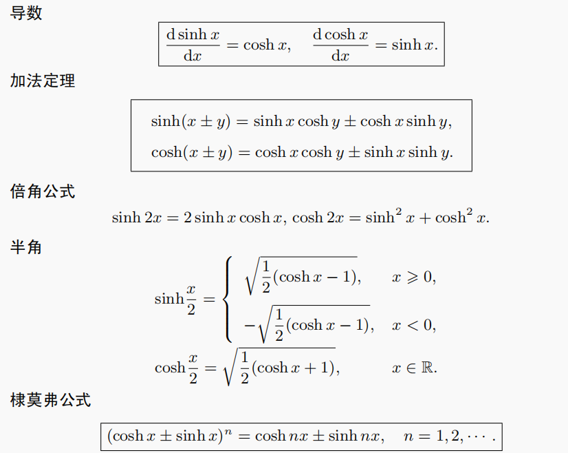
		- 应用
		  collapsed:: true
			- 可用于表示部分积分，
			- 在物理学中有实际应用，
	- （反双曲函数）
	- 其它常见函数
	  collapsed:: true
		- softplus : $f(x) = \ln (1 + e^x)$ ,
		- logistic : $f(x) = \dfrac{1}{1 + e^{-x}}$ ,
		- 符号函数（sgn）
		- 绝对值函数
		- 符号函数和绝对值函数都*不是*初等函数，
- 函数思想（会建立应用问题的函数关系）
	- 将方程、不等式、积分大小比较等问题转化为函数问题，通过分析函数的性质得到答案，
	- 函数的核心为对变量的性质的分析，应首先分清常量与变量，再根据变量建立对应的函数，并利用函数（微积分）方法对变量的情况进行分析，
	- 判断函数的零点（方程的根）
	  collapsed:: true
		- 将方程转化为函数，利用微积分的方法分析函数的性质，最后得到方程的解，
		- 对于含参数的方程，可以考虑先分离出参数，一般不含参数的函数易于分析，
		- 存在性：零点定理、罗尔定理，
		- 数量：罗尔定理推论、函数的单调性，
	- 不等式的证明
	  collapsed:: true
		- 将不等式转化为函数，利用微积分的方法分析函数的性质，
		- 函数的构造
			- 不等式的变形，
			- 分析函数的定义域，区间端点取值，
		- 证明方式
			- 函数的单调性，极值/最值，
			- （拉格朗日中值定理），（函数的泰勒公式近似），
- [[微积分]]
- [[数学分析]]
- [[实变函数]]
- [[Science]]