- 随机变量序列
	- 类似数列，但此处的一般项都为随机变量，
	- 示例
	  collapsed:: true
		- 设X_{i}为样本（独立同分布随机变量），统计量$g_{n} = g(X_1, X_2,…X_n)$，
		- 则{g_{n}}就是一个随机变量序列，
- 概率不等式
  collapsed:: true
	- [[概率计算]]
	- [[数字特征]]
- 依概率收敛
	- 定义（极限运算）
	  collapsed:: true
		- 对于随机变量序列{X_{N}}和随机变量X，
		- 若$\forall \varepsilon > 0，\lim\limits_{n \to \infty} P(|X_n - X| \geq \varepsilon) = 0$，
		- 则称随机变量序列{X_{N}}依概率收敛于随机变量X，记为$X_{n} \stackrel{P} {\rightarrow} X$，
	- 技巧
	  collapsed:: true
		- 另一种形式$\lim\limits_{n \to \infty} P(|X_n - θ| < \varepsilon) = \lim\limits_{n \to \infty} P(\theta - \varepsilon < X_n < \theta + \varepsilon) = 1$，一般较方便计算，
		- 拆绝对值符号时，应注意θ和X的支集；如对于均匀分布U（0，θ）总有X < θ，即$P(|X - θ| < \epsilon) = P(θ - X < \epsilon)$，
- 大数定律
	- 设X_{i}为随机变量；{S_{n}}为随机变量序列，且$S_{n} = \sum\limits_{i=1}^n X_{i}$，
	- 弱大数定律
	  collapsed:: true
		- 若存在实数数列{a_{n}}和正数数列{b_{n}}，使得$\lim\limits_{n \to \infty} P(|\dfrac{S_{n} - a_{n}}{b_{n}}| \geq \varepsilon) = 0$，即$\dfrac{S_{n} - a_{n}}{b_{n}} \stackrel{P} {\rightarrow} 0$，
		- 则称{X_{N}}满足弱大数定律，
		- 一般称数列{a_{n}}为中心化数列，数列{b_{n}}为正则化数列，
		  collapsed:: true
			- 常见情况为a_{n} = E[S_{n}]，b_{n} = n，
	- Markov大数定律
	  collapsed:: true
		- 若$\lim\limits_{n \to \infty} \dfrac{\operatorname{Var}S_{n}}{n^{2}} = 0$，则弱大数定律成立，
		- Markov大数定律没有对序列中的随机变量{X_{N}}之间的相互关系做任何假定，
	- Chebyshev大数定律
	  collapsed:: true
		- 若{X_{N}}的随机变量两两不相关，且X_{i}的方差有限，则弱大数定律成立，
		- 其形式为$\lim\limits_{n \to \infty}P(|\dfrac{S_{n}}{n} - \dfrac{\sum E{X}_{i}}{n}| \geq \varepsilon) = 0$，
	- Bernoulli大数定律（二项分布）
	  collapsed:: true
		- 若$S_{n} \sim b(n, p)$，则$\lim\limits_{n \to \infty}P(|\dfrac{{S}_{n}}{n} - p| \geq \varepsilon) = 0$，
		  collapsed:: true
			- 即随机变量X_{i}为独立同分布的Bernoulli随机变量，
			- 由二项分布的可加性，可知$S_{n} = \sum\limits_{i=1}^n X_{i}  \sim b(n, p)$，
			- 且ES_{n} = np，
	- *Khinchin大数定律*
	  collapsed:: true
		- 若随机变量X_{i}为独立同分布，其均值存在且为μ，则弱大数定律成立，
		- 其形式为$\dfrac{S_{n}}{n} \stackrel{P} {\rightarrow} \mu$，也写为$\overline X \stackrel{P} {\rightarrow} \mu$，
		- 证明
		  collapsed:: true
			- （前提：连续性定理）
			- 设X_{i}为独立同分布的随机变量，且有均值μ，
			- 设$\overline X$的特征函数为$\varphi(t) = E[e^{it(\frac{\Sigma X_{i}}{{n}})}]$，
			- 根据独立同分布，$\varphi(t) = (E[e^{it \cdot (\frac{X}{{n}})}])^{n}$，
			- 由$E[\frac{X}{{n}}] = \frac{μ}{{n}}$，可得$\varphi(t) \approx 1 + \frac{it}{1}\cdot \frac{μ}{{n}} + o(\frac{t}{n})$，
			- 因此有$\lim\limits_{n \to \infty}\varphi(t) = \lim\limits_{n \to \infty}{(1 + \frac{it}{1}\cdot \frac{μ}{{n}})}^{n} = e^{i\mu t}$，
	- （应用）
	  collapsed:: true
		- 利用频率收敛于概率的性质，做多次实验来求得近似的概率值，
		- 利用区间足够小的直方图近似概率密度函数，
		- 蒙特卡洛积分
		  collapsed:: true
			- 希望求解积分$\int_{a}^{b} g(x)dx$，但g(X)的形式较复杂，
			- 可将积分写为$\int_{a}^{b} g(x)dx = (b - a)\int_{a}^{b} g(x) \frac{1}{b - a}dx$，
			- 将$\frac{1}{b - a}$看成$U(a, b)$的密度函数，X看成随机变量，
			- 上述积分可写为$\int_{a}^{b} g(x)dx = (b - a)E[g(X)]$，其中$X \sim U(a, b)$，
			- 因此，可设$Y = (b - a)g(X)$，则有$EY = (b - a)E[g(X)]$，
			- 由*大数定律*，可知$\overline {Y} \stackrel{P} {\rightarrow} EY$，
			- 因此，可生成X_{i}的随机数，并计算对应的Y_{i}，然后利用多个Y_{i}计算均值来估计积分，
			- 若$\int_{a}^{b} g^{2}(x)dx$存在，可以利用Chebyshev不等式来估计误差，
- @强大数定律
	- 引理
	  collapsed:: true
		- 设a_{n}为收敛于a的数列，$\sum\limits_{i = 1}^{n}b_{i}$为发散正项级数，则$\lim\limits_{n \to \infty}\dfrac{\sum\limits_{i = 1}^{n}b_{i}a_{i}}{\sum\limits_{i = 1}^{n}b_{i}} = a$，
		- （即$\lim\limits_{n \to \infty}a_{n} = a$，$\lim\limits_{n \to \infty}\sum\limits_{i= 1}^{n}b_{i} = \infty$），
	- Kronecker 引理
	  collapsed:: true
		- 设a_{n}为数列，b_{n}为正数数列且收敛于正无穷，
		- 若级数$\sum\limits_{i = 1}^{n}\dfrac{a_{i}}{b_{i}}$收敛，则$\lim\limits_{n \to \infty} \dfrac{1}{b_{n}} \sum\limits_{i = 1}^{n}a_{i} = 0$，
	- Kolmogorov 不等式
	  collapsed:: true
		- 设X_{k}为相互独立的随机变量，且一阶矩EX_{k} = 0，二阶矩存在，支集有界（即|X_{k}| \le c \le \infty），
		- {S_{n}}为随机变量序列，且$S_{n} = \sum\limits_{i=1}^n X_{i}$，
		- 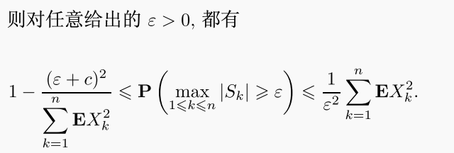{:height 120, :width 330}，
	- 独立随机变量和的 a.s. 收敛性
	  collapsed:: true
		- 定义
		  collapsed:: true
			- 随机变量序列{S_{n}}实际上为随机变量数列{X_{i}}对应的级数$\sum\limits_{i=1}^{\infty} X_{i}$，
			- 若存在事件$P(\Omega_{0}) = 1$，使得$\forall \omega \in \Omega_{0}$，级数{S_{n}(\omega)}收敛，则称级数{S_{n}} a.s. 收敛，
		- 判定
		  collapsed:: true
			- 引理：设{X_{k}}为随机变量序列，若\exist r \in (0, 1]，使$\sum\limits_{i=1}^{\infty} E|X_{i}|^{r}$收敛，则级数{S_{n}} a.s. 收敛，
			- 推论：设{X_{k}}为独立随机变量序列，且满足一阶矩EX_{k} = 0，二阶矩存在，则级数{S_{n}} a.s. 收敛，
			- 引理
			  collapsed:: true
				- 设{X_{k}}为独立随机变量序列，且满足支集有界（即|X_{k}| \le c \le \infty）；
				- 则级数{S_{n}} a.s. 收敛时，级数{\sum EX_{n}}和级数{\sum VarX_{n}}也收敛，
				- 反之，若一阶矩EX_{n} = 0，但二阶矩级数{\sum VarX_{n}}发散，则级数{S_{n}}也发散，
		- Kolmogorov 级数定理
		  collapsed:: true
			- 设{X_{k}}为独立随机变量序列，
			- 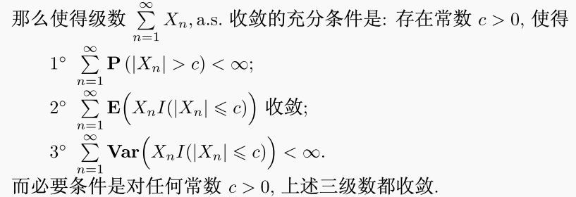{:height 145, :width 399}
	- 强大数定律
	  collapsed:: true
		- 设X_{i}为随机变量；{S_{n}}为随机变量序列，且$S_{n} = \sum\limits_{i=1}^n X_{i}$，
		- 若存在实数数列{a_{n}}和正数数列{b_{n}}，使得$\dfrac{S_{n} - a_{n}}{b_{n}} \stackrel{a.s.} {\rightarrow} 0$，
		- 则称{X_{N}}满足强大数定律，
	- Kolmogorov 强大数律
	  collapsed:: true
		- 设{X_{k}}为独立同分布随机变量序列，{S_{n}}为随机变量序列，且$S_{n} = \sum\limits_{i=1}^n X_{i}$，
		- $\dfrac{S_{n} - na}{n} \stackrel{a.s.} {\rightarrow} 0 \Leftrightarrow E|X| < \infty，EX = a$
	- 推广：Marcinkiewicz 强大数律
	  collapsed:: true
		- 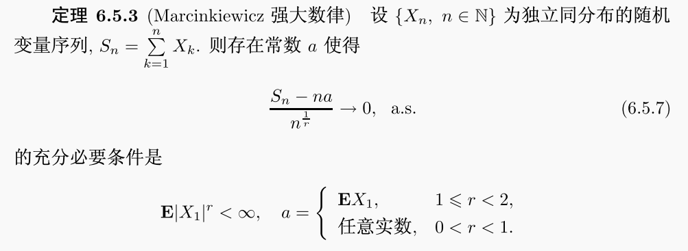
	- 应用
	  collapsed:: true
		- Glivenko-Cantelli 定理：经验分布函数几乎处处收敛于概率分布函数，
		  collapsed:: true
			- 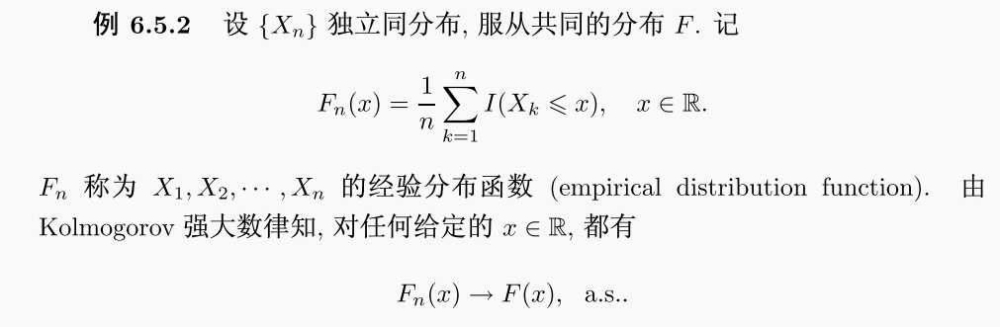
- 依分布收敛
	- 引入（弱收敛）
	  collapsed:: true
		- 设函数序列{F_{n}(x)}为定义在R上的有界，单调不减的右连续函数，
		- 如存在同样定义在R上的有界，单调不减的*右连续函数*F(x)，
		- 使得对所有使F_{X}*连续*的点的集合，都有$\lim\limits_{n \to \infty}F_{n}(x) = F(x)$，
		- 则称F_{n}(x)弱收敛于F(x)，记为$F_{n}(x) \stackrel{w} {\rightarrow} F(x)$，称F(x)为{F_{n}(x)}的弱极限，
		- 命题：分布函数列的弱收敛函数*不一定*是分布函数，
		  collapsed:: true
			- 设$F_{n}(x) = \begin{cases}  0 & x < -n \\ \frac{x + n}{2n} & -n \leq x < n \\ 1 & x > 0 \end{cases}$，
			- 可知F_{n}处处收敛于函数$F(x) \equiv \frac{1}{2}$，
			- 然而$F(x) \equiv \frac{1}{2}$显然不是分布函数，
			- 作为对比，常值随机变量的分布函数为$F(x) = I(x \ge c) = \begin{cases}  0 & x < c \\ 1 & x \ge c \end{cases}$，
		- 引理：*矩母函数*列的弱收敛函数*不一定*是矩母函数，
	- 定义
	  collapsed:: true
		- 对于随机变量序列{X_{N}}和其分布函数序列{F_{n}(x)}，若存在随机变量X和*分布函数*{F_{X}}，对所有使F_{X}连续的点的集合，
		- 都有$\lim\limits_{n \to \infty} F_{n}(x) = F_{X}$，即F_{n}(x)弱收敛于F(x)，
		- 则称{X_{N}}依分布收敛到X，记为$X_{N} \stackrel{D} {\rightarrow} X$，
	- 性质
	  collapsed:: true
		- 与其他三种收敛不同，依分布收敛只考察分布函数的性质，因此与*样本空间*的选取无关，
		- 依分布收敛不能蕴涵依概率收敛；反之，依概率收敛可以导出依分布收敛，
		- 若随机变量收敛于常数，则两者等价，即$X_{n} \stackrel{P} {\rightarrow} C \leftrightarrow X_{N} \stackrel{D} {\rightarrow} C，C \in \mathbb{R}$，
		- 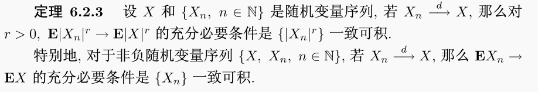{:height 90, :width 460}
	- 矩母函数收敛
	  collapsed:: true
		- 设随机变量序列{X_{n}}的矩母函数为M_{Xn}，随机变量X的矩母函数为M_{X}，
		- 若$\lim\limits_{n \to \infty}M_{X_{n}}(t) = M_{X}(t)$，则$X_{N} \stackrel{D} {\rightarrow} X$，
		- 若$M_{X_{n}}(t)$可以写为（或展开为）${(1 + \frac{b(t)}{n} + \frac{\phi(n)}{n})}^{c(t)n}$，
		- 则$\lim\limits_{n \to \infty}\phi(n) = 0$时，有$\lim\limits_{n \to \infty}M_{X_{n}}(t) = e^{b(t)c(t)}$，
		- 理论上需要连续性定理作为保证，因为矩母函数列的弱收敛函数*不一定*是矩母函数，
	- （概率有界）
	  collapsed:: true
		- 对于随机变量序列{X_{N}}；若存在B > 0，N \in N+，对任意\epsilon > 0，
		- 在n ≥ N时，总有$P((|{X}_{n}| \leq B) \geq 1-  \varepsilon)$；则称X_{N}概率有界，
		- 定理
		  collapsed:: true
			- 若$X_{N} \stackrel{D} {\rightarrow} X$，则{X_{N}}一定概率有界，反之不成立，
			- 若{X_{N}}概率有界，$Y_{N} \stackrel{D} {\rightarrow} 0$，则$X_{N}Y_{N} \stackrel{P} {\rightarrow} 0$，
- @连续性定理
  collapsed:: true
	- （引入）
	  collapsed:: true
		- 特征函数的极限不一定也为特征函数，即可能不满足特征函数的正则性，
	- 定理
	  collapsed:: true
		- 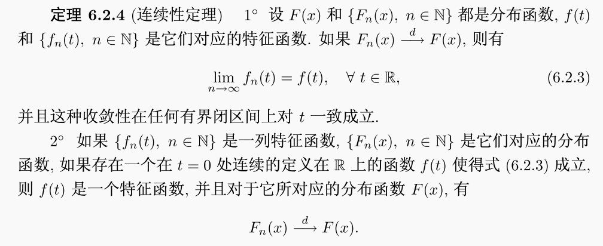{:height 200, :width 470}
- 中心极限定理
	- 渐近正态性
	  collapsed:: true
		- 设X_{i}为随机变量；{S_{n}}为随机变量序列，且$S_{n} = \sum\limits_{i=1}^n X_{i}$，
		- 若存在实数数列{a_{n}}和正数数列{b_{n}}，
		- 使得$\lim\limits_{n \to \infty} P(\dfrac{S_{n} - a_{n}}{b_{n}} \leq x) = \Phi(x)$，
		- 则称S_{n}具有渐近正态性，记为$\dfrac{S_{n} - a_{n}}{b_{n}} \stackrel{D} {\rightarrow} N(0, 1)$，
	- De Moiver-Laplace（二项分布以正态分布为极限分布）
	  collapsed:: true
		- （证明）
		  collapsed:: true
			- 用Stirling公式近似计算阶乘，
			- 用定积分近似二项分布的概率的求和，
			- 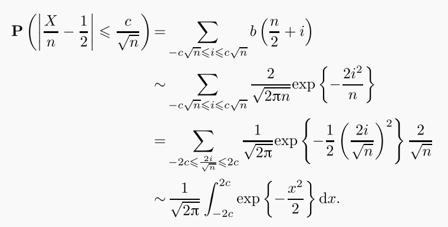{:height 190, :width 370}
		- {:height 90, :width 410}，
	- *Levy定理*
	  collapsed:: true
		- 设X_{i}为独立同分布的随机变量，且有均值μ，方差σ^{2}；
		- 则$\dfrac{\sum X_{i} - n \mu}{\sqrt{n {\sigma}^2}} \stackrel{D} {\rightarrow} N(0, 1)$，
		  collapsed:: true
			- 一般写为$\sqrt[] n(\overline X - \mu) \stackrel{D} {\rightarrow} N(0, \sigma^2)$，可以保证n→∞时方差不为0，
			- 理论上也可写为$\overline X \stackrel{D} {\rightarrow} N(\mu, \dfrac{\sigma^2} {n})$，或$\Sigma X_i \stackrel{D} {\rightarrow} N(n\mu, n\sigma^2)$；更便于对统计量进行分析，
		- 证明
		  collapsed:: true
			- （前提：连续性定理）
			- 设T = \Sigma X_{i}的特征函数为$\varphi(t) = E[e^{it(\frac{\Sigma X_{i} - n\mu}{\sqrt{n}\sigma})]}]$，
			- 独立性
			  collapsed:: true
				- 特征函数可以拆分为乘积，即$\varphi(t) = E[e^{it \cdot \sum\limits_{i=1}^{n}(\frac{X_{i} - \mu}{\sqrt{n}\sigma})}] = \prod\limits_{i=1}^{n}E[e^{it \cdot (\frac{X_{i} - \mu}{\sqrt{n}\sigma})}]$，
			- 同分布
			  collapsed:: true
				- 特征函数可以写为幂的形式，即$\varphi(t) = \prod\limits_{i=1}^{n}E[e^{it \cdot (\frac{X_{i} - \mu}{\sqrt{n}\sigma})}] = (E[e^{it \cdot (\frac{X - \mu}{\sqrt{n}\sigma})}])^{n}$
			- 特征函数的泰勒展开式，
			  collapsed:: true
				- $\varphi(t)= 1 + \frac{it}{1} EX - \frac{t^{2}}{2!}EX^{2} + \cdots$，
				- 由$E[\frac{X_{i} - \mu}{\sqrt{n}\sigma}] = 0，E[(\frac{X_{i} - \mu}{\sqrt{n}\sigma})^{2}] = \frac{1}{n}$，
				- 可得$\varphi(t) \approx 1 + \frac{it}{1}\cdot 0 - \frac{t^{2}}{2!}\cdot \frac{1}{n} = 1 - \frac{t^{2}}{2n} + o(\frac{t^{2}}{2n})$，
			- 特征函数的依分布收敛，
			  collapsed:: true
				- 可得$\lim\limits_{n \to \infty}\varphi(t) = \lim\limits_{n \to \infty}{(1 - \frac{t^{2}}{2n})}^{n} = e^{-\frac{t^{2}}{2}}$，
	- Slutsky定理
	  collapsed:: true
		- 定理（不需要独立性假定）
		  collapsed:: true
			- 若$X_{N} \stackrel{D} {\rightarrow} X$；$A_{N} \stackrel{P} {\rightarrow} 0$，$B_{N} \stackrel{P} {\rightarrow} 1$，
			- 则$A_{N} + B_{N}X_{N} \stackrel{D} {\rightarrow} X$，
		- 推论
		  collapsed:: true
			- 若$X_{N} \stackrel{D} {\rightarrow} N(\mu, {\sigma}^{2})$，则$aX_{N} + b \stackrel{D} {\rightarrow} N(a\mu + b, b^{2} {\sigma}^{2})$，
	- @独立不同分布情况
		- 设X_{i}为独立的随机变量，且有均值\mu_{i}，方差\sigma_{i}^{2}；
		- 设随机变量$S_{n} = \sum\limits_{i=1}^n X_{i}$，$B^{2}_{n} = Var S_{n}$，
		- （Feller条件）
		  collapsed:: true
			- $\lim\limits_{n \to \infty} \max[1, n]\dfrac{\sigma_{i}^{2}}{B_{n}^{2}} = 0$，
		- （Lindeberg条件）
		  collapsed:: true
			- 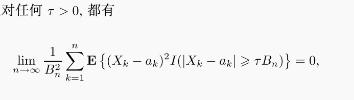{:height 110, :width 360}，
			- 可以理解为每个变量在部分和中的影响“均匀的小”，
		- 推论
		  collapsed:: true
			- 若存在正数数列L_{n}，使得$\max[1, n]|X_{k}| \le L_{n}$，且$\lim\limits_{n \to \infty} \dfrac{L_{n}}{B_{n}} = 0$，
			- 则Lindeberg条件成立，
		- （Lyapunov条件）
		  collapsed:: true
			- 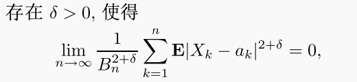{:height 80, :width 300}，
	- @正态吸引场
- @多维中心极限定理
  collapsed:: true
	- 引理：设X为m维随机*向量*，则$X \sim N(\vec{\mu}, \Sigma) \Leftrightarrow$对“任意”m维实向量s，都有随机*变量*$Y = s^{T}_{1 * m}X_{m * 1} \sim N(s^{T}\vec{\mu}, s^{T}\Sigma s)$，
	- 定理：若对“任意”m维单位实数向量s，都有随机*变量*$s^{T}X_{n} \stackrel{D} {\rightarrow}  N(0, 1)$，则有$X_{n} \stackrel{D} {\rightarrow}  N(0, I_{m})$，
	- 推论：设$\vec{X_{i}}$为独立同分布的*m维随机向量*，且有均值向量$\vec{\mu}$和协方差矩阵$\Sigma$，则有$\dfrac{\sum X_{i} - n\vec{\mu}}{\sqrt{n}}\stackrel{D} {\rightarrow}  N(0, \Sigma)$，
- @其它收敛性
  collapsed:: true
	- （函数列的收敛）
	  collapsed:: true
		- 逐点收敛
			- 对所有使F_{X}*连续*的点的集合，都有$\lim\limits_{n \to \infty}F_{n}(x) = F(x)$，
		- Lp范数收敛
			- 定义$||g(x)||_{p} = (\int_{0}^{1}|g(x)|^{p}dx)^{\frac{1}{p}}$，
			- 称$||f_{n}(x) - f(x)||_{p} \to 0, n \to \infty$，为Lp范数收敛，
		- 依测度收敛
			- 称$m(\{x : |f_{n}(x) - f(x)| > \varepsilon)\} \to 0, n \to \infty$，为依测度收敛，
			- 即不收敛的点为一个“零测集合”，
	- r阶矩收敛
	  collapsed:: true
		- 定义
		  collapsed:: true
			- 对于随机变量序列{X_{N}}和随机变量X，
			- 若$E(|X_{n}|^{r}) < \infty$，且$\lim\limits_{n \to \infty} E(|X_{n} - X|^{r}) = 0$，
			- 则称随机变量序列{X_{N}}依 r 阶矩收敛于随机变量X，记为$X_{n} \stackrel{r} {\rightarrow} X$，
			- r = 1 时简称为依平均收敛；r = 2时称为均方收敛，
		- @期望的连续性
		  collapsed:: true
			- 若$X_{n} \stackrel{P}{\rightarrow} X$，
			  collapsed:: true
				- 单调性：若$\forall n,  X_{n + 1} \geq X_{n}$，则$EX_{n} \stackrel{P}{\rightarrow} EX$，
				- 控制收敛：若$\forall n, |X_{n}| \leq Y$，则$EY < \infty$时，有$EX_{n} \stackrel{P}{\rightarrow} EX$，
				- 有界收敛：若$\forall n,  |X_{n}| \leq c$，则有$EX_{n} \stackrel{P}{\rightarrow} EX$，
		- @r阶矩收敛的分析
		  collapsed:: true
			- 一致可积的定义
			- Lebesgue 控制收敛定理
			- 单调收敛定理
			- Fatou引理
			  collapsed:: true
				- 若$\forall n, |X_{n}| \geq 0$，则$E[\varliminf\limits_{n \to \infty} X_{n}] \leq \varliminf\limits_{n \to \infty} E[X_{n}]$，
			- 一致可积的充要条件
		- 定理
		  collapsed:: true
			- 一致可积的条件
			  collapsed:: true
				- 若存在常数\alpha > 0，使得$\sup\limits_{n \in \mathbb{N}} E|X_{n}|^{(1 + \alpha)} < \infty$，
				- 则随机变量序列{X_{n}}一致可积，
			- r阶矩收敛的判定
			  collapsed:: true
				- 若随机变量序列{|X_{n}|^{r}}*一致可积*，且$X_{n} \stackrel{P} {\rightarrow} X$，
				- 则随机变量X的r阶矩存在，即$E[X^{r}] < \infty$，且$X_{n} \stackrel{r} {\rightarrow} X$，
			- 推论：一阶矩的收敛
			  collapsed:: true
				- 若随机变量序列{X_{N}}和随机变量X均非负，且都存在一阶矩，
				- 则$X_{n} \stackrel{P} {\rightarrow} X$时，如下三个命题相互等价：
				- {X_{n}}一致可积，
				- $\lim\limits_{n \to \infty} E|X_{n} - X| = 0$，
				- $\lim\limits_{n \to \infty} EX_{n} = EX$，
	- 几乎处处收敛（almost surely）
	  collapsed:: true
		- 定义
		  collapsed:: true
			- 对于随机变量序列{X_{N}}和随机变量X，
			- 若$P(\{\omega \in \Omega | \lim\limits_{n \to \infty}X_{n}(\omega) - X(\omega) = 0\}) = 1$，
			- 则称随机变量序列{X_{N}}几乎处处收敛于随机变量X，记为$X_{n} \stackrel{a.s.} {\rightarrow} X$，
		- 定理
		  collapsed:: true
			- $X_{n} \stackrel{a.s.} {\rightarrow} X \Leftrightarrow \lim\limits_{i \to \infty}P(\mathop{\cup}\limits_{n = i}^{\infty}|X_{n} - X| \ge \varepsilon) = 0$，\forall \epsilon > 0，
			- 若$X_{n} \stackrel{P} {\rightarrow} X$，则存在子列$X_{n_{k}} \stackrel{a.s.} {\rightarrow} X$，
		- （无穷多次发生）
		  collapsed:: true
			- 定义
			  collapsed:: true
				- 设{A_{n}}是概率空间中的一列事件，如果存在
				  无穷多个 n 使得\omega \in A_{n}，则称事件序列 {A_{n}} 无穷多次发生，记作 {A_{n} i.o.}，
				- 无穷多次发生的概念等同于上极限事件，
			- Borel-Cantelli 引理
			  collapsed:: true
				- 设{A_{n}}是概率空间中的一列事件，
				- 若$\sum\limits_{n = 1}^{\infty} P(A_{n}) < \infty$，则有P(A_{n}, i.o.) = 0，
				- 若{A_{n}}为相互独立的事件序列，
				- 则$\sum\limits_{n = 1}^{\infty} P(A_{n}) = \infty \Leftrightarrow P(A_{n}, i.o.) = 1$，
			- 定理
			  collapsed:: true
				- $X_{n} \stackrel{a.s.} {\rightarrow} X \Leftrightarrow P(|X_{n} - X| \ge \varepsilon，i.o.) = 0$，\forall \epsilon > 0，
				- 反之，若$\exist \varepsilon_{0} > 0，P(|X_{n} - X| \ge \varepsilon，i.o.) = 1$，则随机变量序列{X_{N}}不会几乎处处收敛于随机变量X，
	- 不同收敛之间的关系
	  collapsed:: true
		- 定理
			- 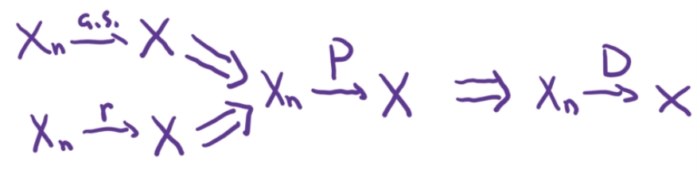{:height 100, :width 400}，
			- 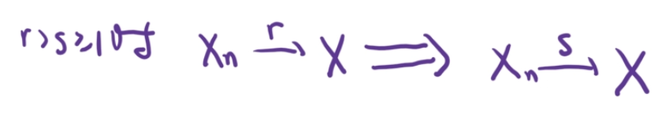{:height 80, :width 400}，
			- 即依高阶矩收敛可以推出依低阶矩收敛，
		- @证明
- [[渐近估计与极限分布]]
- [[概率论]]