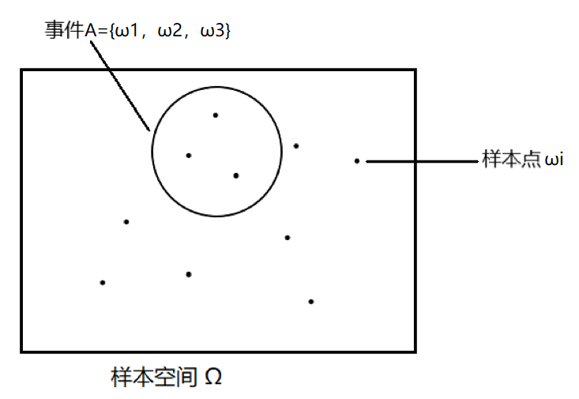

- 随机变量的分析
	- 随机变量的构造
	  collapsed:: true
		- 应首先区分样本空间与事件，以判断随机变量是离散还是连续，
	- 随机变量与常数
	  collapsed:: true
		- 概率论的核心是对随机变量的分析，应分清随机变量与常数，
	- 随机变量的维度
	  collapsed:: true
		- 一般统计量会由多个随机变量和多个参数构成，统计量可能是多个随机变量对应的一元随机变量，也可能是多个随机变量对应的多维随机向量，应注意区分；
		- 此外，也应分清需要求解的是参数（如费舍尔信息量）还是随机变量，
- 基本定义
- 随机事件
  collapsed:: true
	- 随机事件
	  collapsed:: true
		- 样本空间、样本点、事件
		- {:height 270, :width 370}
	- 集合论
	  collapsed:: true
		- 集合论
			- 集合的类别：可数集合，不可数集合，空集，
			- 集合的运算
				- 交集、并集、补集；
				- 相等、包含（子集）、互斥，
			- 运算律：交换律、结合律、分配律，
		- 集合的划分
			- 博雷尔事件域
				- 定义
				  collapsed:: true
					- 样本空间为集合S，B为S中的一组子集，
					- 若这一组子集B满足
						- $\varnothing \in B$,
						- 若$A \in B$，则$\overline A \in B$，
						- 若$A_1, A_2... \in B$，则$\mathop{\cup}\limits_{i =1} ^{\infty}A_i \in B$，
					- 则称B为一个Borel事件域，
				- 性质
				  collapsed:: true
					- borel域可以有多个，统计学中讨论的为包含S中全体开集的最小的borel域，
					- 若S可数，则含有n个元素的最小的borel域应有（2^{n+1} - 1）+ 1（空集）个集合，
					- 若S不可数，则可先选定一些端点（a1，a2…），再利用这些端点将S划分为多个集合，并利用这些集合进行并、交运算，
			- 划分（完备事件组）
			  collapsed:: true
				- 样本空间为集合S，A1、A2…为S中的事件（子集）；
				- 若对任意i ≠ j，都有$A_i \cap A_j =\varnothing$（即事件两两不交），且$\mathop{\cup}\limits_{i =1} ^{\infty}A_i = S$，则称Ai构成S的一个划分（完备事件组），
				- 同一个集合S可以有多种不同的划分，
		- 集合函数
			- 定义：集合→实数的映射，
			  collapsed:: true
				- 在概率论中，集合中的元素一般不是实数，而是现实生活中的具体事件，
	- 概率集合函数
	  collapsed:: true
		- 概率的公理化定义
		  collapsed:: true
			- 样本空间为集合S，B为S中的一个Borel事件域，
			- 若定义在B上的函数P满足
			  collapsed:: true
				- 对任意$A \in B, P(A) \geq 0$，
				- P(S) = 1，
				- 若$A_1, A_2... \in B$且两两不交，则$P(\mathop{\cup}\limits_{i =1}^{\infty}A_i ) = \sum\limits_{i =1}^{\infty} P(A_i)$，
			- 则称P为一个概率函数，
		- 概率的性质
		  collapsed:: true
			- （非负性、规范性、可列可加性）
			- 可列可加性 → 有限可加性
			- 有限可加性 + 连续性 → 可列可加性
		- 条件概率
		  collapsed:: true
			- 条件概率的定义
			- 独立性
				- 两两独立与相互独立
				- 独立重复实验（伯努利试验）
	- 概率的计算
	  collapsed:: true
		- 必然事件与不可能事件
			- 必然事件发生的概率为1，
			- 不可能事件发生的概率为0，然而发生的概率为0的事件不一定为不可能事件（如按照定义，连续分布取每一点的值的概率都为0），
		- 集合的运算规律（德摩根律）
		- 加法公式、乘法公式、减法公式，
		- 全概率公式
		- 贝叶斯公式
		- 概率不等式：Bon不等式、Boole不等式
	- 计数原理（排列、组合）
	- 古典概型、几何概型
- 随机变量
  collapsed:: true
	- 一维随机变量
	  collapsed:: true
		- 随机变量的概念
			- 定义：$X：\Omega \rightarrow \mathbb{R}$，
			- 集合函数（事件→实数）的因变量，概率函数（实数→实数（概率））的自变量，
			- 可以看成中介变量，即随机变量（实数）理论上没有概率，只是反映了对应的事件的概率；将事件统一为随机变量易于数学处理，
			- 类别：离散型、连续型、（混合型）
		- 概率函数
			- 累积分布函数cdf
			  collapsed:: true
				- 定义：$F_{X} : \mathbb{R} \rightarrow[0,1]$，其表达式为$F_{X}(x) \triangleq P(X \leq x)$，
				- 分布函数描述的为变量取某些值的“概率”，而并非传统函数的一一对应关系，
				- 性质
					- $0 \leq F_{X}(x)\leq 1$
					- $\lim\limits_{x \rightarrow-\infty} F_{X}(x)=0$
					- $\lim\limits _{x \rightarrow\infty} F_{X}(x)=1$
					- $x \leq y \Longrightarrow  F_{X}(x)\leq F_{X}(y)$
				- 计算（事件的描述、不连续点）
				- 依分布相等：随机变量由事件定义，因此随机变量相等即对应的事件相等，因此概率也相等；而分布函数由概率定义，所以依分布相等只能说明事件的概率相同，不能说明事件也相等，
			- 概率分布函数
				- 示性函数与支集
				- 概率质量函数pmf
				  collapsed:: true
					- 定义：$p_{X} : \mathbb{R} \rightarrow \mathbb{R}$，其表达式为$p_{X}(x) \triangleq P(X=x)$，
					  collapsed:: true
						- $X$为离散随机变量，即$X$只能取有限（或无限但可数）的可能值时，可以直接指定随机变量取得每个值的概率，
					- 性质
					  collapsed:: true
						- $0 \leq p_{X}(x)\leq 1$
						- $\sum\limits_{x \in V \text { al }(X)} p_{X}(x)=1$
						- $P(X \in A) = \sum\limits_{x \in A} p_{X}(x)$
				- 连续随机变量pdf
				  collapsed:: true
					- 定义：$p_{X} : \mathbb{R} \rightarrow \mathbb{R}$，其表达式为$f_{X}(x) \triangleq \frac{d F_{X}(x)}{d x}$，
						- 概率密度函数(PDF)定义为累积分布函数的导数（因此pdf有时可能不存在，如cdf不是处处可微的），
						-
					- 性质
						- $f_X(x)\geq 0$
							- $f_X(x)$一般小于1，但理论上$f_X(x)$可以取大于1的函数值，
						- $\int_{-\infty}^{\infty} f_{X}(x)=1$
						- $f _X (x) \not = P(X = x)$
						- $\int_{x \in A} f_{X}(x) d x=P(X \in A)$
	- 多维随机变量
	  collapsed:: true
		- 随机向量
			- 样本空间由一元变为多元，并非为多个一元空间的组合；因此总的概率仍为1，
			- 定义：概率$P[(x_1 \leq k_1) ∩ (x_2 \leq k_2)]$，
		- 累积分布函数
			- 联合分布函数
				- 定义：$F_{X} : \mathbb{R}^{n} \rightarrow[0,1]$，
				  collapsed:: true
					- 表达式：$F_{X_{1}, X_{2}, \ldots, X_{n}}\left(x_{1}, x_{2}, \ldots x_{n}\right)=P\left(X_{1} \leq x_{1}, X_{2} \leq x_{2}, \ldots, X_{n} \leq x_{n}\right)$
				- 性质
				  collapsed:: true
					- $0 \leq F_{XY }(x,y) \leq 1$
					- $\lim\limits _{x, y \rightarrow \infty} F_{X Y}(x, y)=1$
					- $\lim\limits _{x, y \rightarrow -\infty} F_{X Y}(x, y)=0$
					- $F_{X}(x)=\lim\limits _{y \rightarrow \infty} F_{X Y}(x, y)$
			- 边缘分布函数
			  collapsed:: true
				- 定义：$F_{X}(x)=\lim\limits _{y \rightarrow \infty} F_{X Y}(x, y) d y，F_{Y}(y)=\lim\limits _{y \rightarrow \infty} F_{X Y}(x, y) dx$，
		- 概率分布函数
			- 概率质量函数
			  collapsed:: true
				- 联合分布：$p_{X Y}(x,y)=P(X=x,Y=y)$，
				- 边缘分布：$p_{X}(x)=\sum\limits_{y} p_{X Y}(x, y)$
			- 概率密度函数
			  collapsed:: true
				- 联合分布：$f_{X_{1}, X_{2}, \ldots, X_{n}}\left(x_{1}, x_{2}, \ldots x_{n}\right)=\dfrac{\partial^{n} F_{X_{1}, X_{2}, \ldots, X_{n}}\left(x_{1}, x_{2}, \ldots x_{n}\right)}{\partial x_{1} \ldots \partial x_{n}}$，
				- 边缘分布：$f_{X_{1}}\left(X_{1}\right)=\int_{-\infty}^{\infty} \cdots \int_{-\infty}^{\infty} f_{X_{1}, X_{2}, \ldots, X_{n}}\left(x_{1}, x_{2}, \ldots x_{n}\right) d x_{2} \ldots d x_{n}$，
				- 性质（类似一元分布）
					- $f_{XY}(x,y) \geq 0，\int_{-\infty}^{\infty} \int_{-\infty}^{\infty} f_{X Y}(x, y)=1$，
					- $P((X, Y) \in A) = \iint\limits_{x \in A} f_{X Y}(x, y) dx dy$，
	- 条件分布
	  collapsed:: true
		- （条件概率定义）
		- 条件概率分布
		  collapsed:: true
			- 定义
			  collapsed:: true
				- 离散：$p_{Y | X}(y | x)=\dfrac{p_{X Y}(x, y)}{p_{X}(x)}$，
				- 连续：$f_{Y | X}(y | x)=\dfrac{f_{X Y}(x, y)}{f_{X}(x)}$，
			- 对于f(y|x)，y为随机变量，x则看作常量；因此求解数字特征、概率时以y为基础 ，
			- 链式法则
			  collapsed:: true
				- \begin{aligned} f\left(x_{1}, x_{2}, \ldots, x_{n}\right) &=f\left(x_{n} | x_{1}, x_{2} \ldots, x_{n-1}\right) f\left(x_{1}, x_{2} \ldots, x_{n-1}\right) \\ &=f\left(x_{n} | x_{1}, x_{2} \ldots, x_{n-1}\right) f\left(x_{n-1} | x_{1}, x_{2} \ldots, x_{n-2}\right) f\left(x_{1}, x_{2} \ldots, x_{n-2}\right) \\ &=\cdots=f\left(x_{1}\right) \prod_{i=2}^{n} f\left(x_{i} | x_{1}, \ldots, x_{i-1}\right) \end{aligned}
				-
		- 独立性
		  collapsed:: true
			- 定义
			  collapsed:: true
				- 如果对于$X$和$Y$的所有值，都有$F_{XY}(x,y) = F_X(x)F_Y(y)$，则称两个随机变量$X$和$Y$是（统计）独立的，
			- 独立性的证明与否定
			  collapsed:: true
				- 分布函数乘积（定义），密度函数乘积，概率的乘积；
				- 证明需要严格说明以上三点中的一点（即必须算出准确的pdf、cdf等），
				- 反之，否定独立性则只需要寻找一个反例（如某交集事件的概率不同于两个事件的概率的乘积），
			- 独立性和不相关性
			  collapsed:: true
				- 独立性由概率定义，不相关性由数字特征（协方差）定义；因此独立可以说明不相关，但不相关不一定独立，
			- 独立随机变量的性质
		- 条件独立
		  collapsed:: true
			- 定义：若$p((A|B), C) = p((A)|C)$，则称事件A和B关于事件C条件独立，
				- 可以理解为事件C的发生使得A和B相互独立，即$p((A,B)|C) =p((A)|C)p((B)|C)$，
				- 推导$p((A,B)|C) = \dfrac{P(A,B,C)}{P(C)} = \dfrac{P(A,B,C)}{P(B,C)} * \dfrac{P(B,C)}{P(C)} = p(A|(B,C))*p(B|C)=p(A|C)p(B|C)$，
		- 混合分布
			- 线性组合、混合分布（离散）、混合分布（连续），
		- 条件分布思想
		  collapsed:: true
			- 对于较复杂的概率问题，应尝试从条件分布的角度考虑；即对随机变量进行适当的划分，
		- （连续场合的全概率公式与贝叶斯公式）
		- （多元条件分布）、（联合条件分布）、（Borel悖论）
- 数字特征
  collapsed:: true
	- 一元
		- 期望（矩）
			- 数学期望
			  collapsed:: true
				- 定义
					- 离散：$EX \triangleq \sum\limits_{x \in V a l(X)} x p_{X}(x)$，
					- 连续：$EX \triangleq \int_{-\infty}^{\infty} x f_{X}(x) d x$，
				- 性质（线性运算）
					- 对于任意常数 $a \in \mathbb{R}$，$E[a]=a$
					- 对于任意常数 $a \in \mathbb{R}$，$E[af(X)]=aE[f(X)]$
					- $E[f(X)+g(X)]=E[f(X)]+E[g(X)]$
					- $E[g(X)] \triangleq \int_{-\infty}^{\infty} g(x) f_{X}(x) d x$
			- 方差（标准差）
				- 定义：$\operatorname{Var}[X] \triangleq E\left[(X-E(X))^{2}\right] = E\left[X^{2}\right]-E[X]^{2}$，
				- 性质
					- 对于任意常数 $a \in \mathbb{R}$，$Val[a]=0$
					- 对于任意常数 $a \in \mathbb{R}$，$Var[af(X)]=a^2Var[f(X)]$
			- 矩
			  collapsed:: true
				- n阶（原点）矩、n阶中心矩
				- 变异系数、峰度、偏度
			- 矩母函数、特征函数，
		- 分位数
		  collapsed:: true
			- 中位数、p分位数、众数
		- （故障率函数）
		- （熵）
	- 一元/条件分布
		- 条件数学期望、条件方差（一般为随机变量）；
		- 重期望公式
		  collapsed:: true
			- 定理：$EX = E[E(X|Y)] = E[g(Y)]$，（常数）
			- 性质
				- $\min E[Y-g(X)]^2 = E[Y-E(Y|X)]^2$，
				- 对难以直接求解的EX，可以考虑将X拆分为条件分布X|Y，再根据重期望公式求解，
				- 若X、Y不独立，但条件分布已知，则可由重期望公式计算E[g(x, y)]，其理论依据为给定条件分布后，Y可以看作常量，所以可以由常量的期望运算规则，从算式中分离，
				- 如$E[g(X,Y)] = E(E[g(X,Y)|Y]) = E(h(Y)*E[u(X)|Y])$（将g(X, Y) 拆分为h(Y)和u(X)的乘积）$= E[h(Y)*t(Y)]$，
		- 条件方差公式
		  collapsed:: true
			- $\operatorname{Var}X = E[\operatorname{Var}(X|Y)] + \operatorname{Var}[E(X|Y)] =E[g(Y)] + \operatorname{Var}[g(Y)]$ ，（常数）
			- $\operatorname{Var}[Y-E(Y|X)] = E[\operatorname{Var}(Y|X)]$ ，
	- 线性条件均值（正态）
	- 多元
		- 随机变量的维度
		  collapsed:: true
			- 期望和方差定义在$\mathbb{R}\rightarrow \mathbb{R}$上，而协方差和相关系数定义在$\mathbb{R}^{2} \rightarrow \mathbb{R}$上，
			- 因此，类似$E[X, Y]$和$\operatorname{Cov}[X, Y, Z]$都是没有定义的，
			- 应分清多元随机变量与多元随机变量*的函数*，
			- 对于多元随机变量，应将其数字特征写为*矩阵形式*；而对于多元随机变量的函数，应先分清随机变量的*因变量的维度*，再进一步分析，
		- 多元随机变量期望
			- 随机变量函数的期望$\mathbb{R}\rightarrow \mathbb{R}$
			  collapsed:: true
				- 定义：$E[g(X, Y)] \triangleq \sum\limits_{x \in V a l(X)} \sum\limits_{y \in V a l(Y)} g(x, y) p_{X Y}(x, y)$，
			- 随机向量期望$\mathbb{R}^{n} \rightarrow \mathbb{R}^{n}$
			  collapsed:: true
				- 定义：$EX = E\begin{pmatrix} x_1 \\ x_2 \\ \vdots \\ x_n \end{pmatrix} = \begin{pmatrix} Ex_1 \\ Ex_2 \\ \vdots \\ Ex_n \end{pmatrix}$，
		- 协方差与相关系数
			- 定义$\mathbb{R}^{2} \rightarrow \mathbb{R}$
				- $\operatorname{Cov}[X, Y] \triangleq E[(X-E[X])(Y-E[Y])]$
				- 协方差定义在两个随机变量之间，
			- 性质
				- $\operatorname{Cov}[X, Y] = \operatorname{Cov}[Y, X]$
				-
		- 方差-协方差矩阵
			- 定义：
				- 对于多个随机变量$\begin{pmatrix}x_1 & x_2 & ... & x_n \end{pmatrix}$，
				- 其两两之间的协方差可以写为矩阵形式，$\begin{pmatrix} \operatorname{Cov}[X_1, X_1] & \operatorname{Cov}[X_1, X_2] & ... & \operatorname{Cov}[X_1, X_n] \\\operatorname{Cov}[X_2, X_1] & \operatorname{Cov}[X_2, X_2] & ... & \operatorname{Cov}[X_2, X_n] \\ \vdots & \vdots & & \vdots \\ \operatorname{Cov}[X_n, X_1] & \operatorname{Cov}[X_n, X_2] & ... & \operatorname{Cov}[X_n, X_n] \\ \end{pmatrix}$，
				- 由协方差的定义，其对角线元素实际上为方差$\operatorname{Var}[X_i]$，
			- 性质
				- $\Sigma=\Sigma^T$，即$\Sigma$为对称矩阵，
				- $\Sigma \geq 0$，即$\Sigma$为半正定矩阵，
		- 随机向量矩母函数
	- 随机变量函数的数字特征
	- 数字特征的不等式
		- 柯西－施瓦茨不等式；（闵可夫斯基不等式、holder不等式）；
		- Jensen不等式及其推广；（凸函数／严格凸函数），
- 变量变换
  collapsed:: true
	- 随机变量的函数的分布
		- 随机变量的函数的分布
		- 根据两个随机变量的联合分布求其函数的分布
		- 根据多个独立随机变量的联合分布求其函数的分布
	- 分析变量
		- 类型：离散、连续、混合，
		- 维度：一元-一元，多元-一元，多元-多元，
	- 确定变量支集
		- 原变量
		- 新变量
			- 连续：不等式变换/边界变换，增补变量法，
			- 离散：穷举，
		- 描述事件
		  collapsed:: true
			- 分析变换方式
				- 一对一变换
				- 非一对一变换
					- 对于X \in(-1,3), Y =X^2
					- X的不同支集 → Y的同一支集：概率相加，即 P(0<Y<1) = P(-1<X<0)+P(0<X<1)，
					- X的不同支集 → Y的不同支集：分段函数，即 P(1<Y<9) = P(1<X<3)，与前两段无关，
			- “事件”的描述
				- 全概率公式展开，
				- 联合分布与条件分布的应用，
				- 独立性的应用，
	- 概率的计算
		- 拆分支集，按支集分别计算概率，
		- 离散：求和
		  collapsed:: true
			- 分析/引入求和变量，
		- 连续：积分
		  collapsed:: true
			- 确定积分变量，积分限，
			- 确定事件（概率P）→ cdf的定义（函数F）
	- 技巧
		- 描述事件
		  collapsed:: true
			- 应首先尝试对“事件”（即概率P(f(x,y)\leq z)进行化简，将其尽量转化为已知分布的形式；化简时应注意不等号的方向，
			- 可以通过分析随机变量之间的关系，分布函数F(x) 的性质等寻找突破，
			- 拆分为多个一对一变换时，应注意不同的变换的雅可比行列式可能不同，
			- （直接计算分布有困难时，可以考虑引入新的随机变量，）
		- 计算概率
		  collapsed:: true
			- 对于离散分布，可以用求和代替积分；一般可以引入第三变量 i 以便于求和——而对于较复杂的函数变换，可以考虑引入多个参数来表示随机变量，
			- 含参数的二重积分的积分限的划分方式与普通的二重积分类似，只是参数z可能会出现在原本为常数的积分范围中，应画图辅助分析，
			- pdf一般难以直接求解，所以一般方法为先由概率求出cdf，再求导得到pdf，
			- 对于均匀分布等，二重积分换元后的函数与雅可比行列式|J|可能变化较小，但支集的变化一般较大，即积分得到的一元分布会有差异，
			- 对于离散-连续混合分布，若难以写出pmf的表达式，可以写成分布列的形式，
		- （矩母函数方法）
- 常见分布族
  collapsed:: true
	- 分布的定义（支集）、分布的密度函数（分布的参数）、数字特征
	  collapsed:: true
		- 常见分布族的分布函数与数字特征，与规定的随机变量支集、参数形式、参数取值一一对应；若具体数据不完全符合规定信息，则不能直接使用算得的结论，
		- 可以考虑重新设置随机变量，或重新计算密度函数、数字特征，
	- 一维分布
	  collapsed:: true
		- 离散
		  collapsed:: true
			- 伯努利分布
			  collapsed:: true
				- $$
				    p(x)=\left\{\begin{array}{ll}{p} & {\text { if } p=1} \\ {1-p} & {\text { if } p=0}\end{array}\right.
				    $$
			- 二项分布
			  collapsed:: true
				- $$
				  p(x)= {n \choose x} p^{x}(1-p)^{n-x}
				  $$
			- 泊松分布
			  collapsed:: true
				- $$
				  p(x)=e^{-\lambda} \frac{\lambda^{x}}{x !}
				  $$
			- 几何分布，
			- 负二项分布、帕斯卡分布、
			- 离散均匀分布、超几何分布，
			- 组合数、二项式定理，
			- 泊松定理、（泊松过程）
		- 连续
		  collapsed:: true
			- 均匀分布
				- $$
				  f(x)=\left\{\begin{array}{ll}{\frac{1}{b-a}} & {\text { if } a \leq x \leq b} \\ {0} & {\text { otherwise }}\end{array}\right.
				  $$
			- 正态分布（标准正态分布）
				- $$
				  f(x)=\frac{1}{\sqrt{2 \pi} \sigma} e^{-\frac{1}{2 \sigma^{2}}(x-\mu)^{2}}
				  $$
			- 伽马分布（Γ函数）
				- χ2分布、指数分布
				- 伽马分布与泊松分布的cdf的关系；贝塔分布与二项/负二项分布的cdf的关系，
			- 贝塔分布（B函数）
			- 柯西分布、逻辑斯蒂分布；
			- 折叠正态分布、对数正态分布；
			- 双指数分布、威布尔分布、帕累托分布，
	- 多维分布
	  collapsed:: true
		- 离散
		  collapsed:: true
			- 三项分布（二维）、多项分布
				- 三点分布、多点分布、（条件分布），
				- 多项式定理，
			- （三维超几何分布）
		- 连续
			- 二维正态分布
			- 多元正态分布
			  collapsed:: true
				- 密度函数
				  collapsed:: true
					- pdf：$f_{X_{1}, X_{2}, \ldots, X_{n}}\left(x_{1}, x_{2}, \ldots, x_{n} ; \mu, \Sigma\right)=\frac{1}{(2 \pi)^{n / 2}|\Sigma|^{1 / 2}} \exp \left(-\frac{1}{2}(x-\mu)^{T} \Sigma^{-1}(x-\mu)\right)$，
					- 其中，X为随机向量$\begin{pmatrix}x_1 & x_2 & ... & x_n \end{pmatrix} ^T$，\mu为均值向量$\begin{pmatrix}\mu_1 & \mu_2 & ... & \mu_n \end{pmatrix} ^T$，
					- \Sigma为方差-协方差矩阵，|\Sigma|为方差-协方差矩阵的行列式（标量），
				- 性质
				  collapsed:: true
					- 定理：多元正态分布的线性组合仍为正态分布，且协方差为0等价于独立，
					- 多个独立的正态分布（多维正态分布） → 多维正态分布（分布间不独立）→ 多个正态分布（分布间不独立）
			- 二维均匀分布
			- （狄利克雷分布）
	- 指数分布族
	  collapsed:: true
		- 定义、性质（正则条件、充分（完全）统计量、mlr），
		- 多参数指数族，曲指数族，
	- 位置－尺度族
	  collapsed:: true
		- 位置－尺度变换、位置 - 尺度不变统计量，
		- 标准化、数字特征，
	- 分布之间的关系
		- 可加性
		  collapsed:: true
			- 需要随机变量间的独立作为前提，
			- 离散
				- 二项分布b(n_i, p)，
					- 负二项分布nb(n_i, p)，
					- 几何分布geo(p)/pa(1,p)，帕斯卡分布pa(r_i, p)，
				- 泊松分布P(\lambda _i)，
			- 连续
				- 伽马分布Ga(\alpha_i, \beta)，
					- χ2分布\chi^2 (n_i)，
					- 指数分布关于参数λ无可加性，但分布参数相同时，有$\Sigma X_i \sim Ga(n, \frac{1} {\lambda})$，
				- 正态分布$N(\mu_i, \sigma_i^2)$，
					- 方差项为常数平方相加，即$((a+b)\mu_i, (a^2 + b^2)\sigma_i^2)$，
		- 分布间的关系
		  collapsed:: true
			- 概率积分变换定理
				- 若X的cdf为$F_X(x)$，则随机变量$Y= F_X(X) \sim U(0,1)$，
				- 反之，若X \sim U(0,1), Y = F^{-1}_Y(X)，则Y的cdf为F_Y(y)，
			- 离散
				- 若X \sim b(n,p)，则n -X \sim b(n,1-p)，
				- 若$X_i \sim P(\lambda_i)$，且Xi之间相互独立，则$(X_1|X_1 +X_2) \sim b(n,\pi_1)，\pi_1 = \dfrac{\lambda_1} {\lambda_1 +\lambda_2}$,
				- 对于多个随机变量，多元变量（X1，X2…，Xk）的条件分布为多项分布$(X_1,X_2...,X_k|\sum\limits_{i =1}^{k} X_i) \sim MN(n,\pi)$，\pi为参数向量$(\pi_1,\pi_2...,\pi_k),\pi_i = \dfrac{\lambda_i} {\sum\limits_{i =1}^{k} \lambda_i}$，
			- 连续
				- 正态分布
				  collapsed:: true
					- 标准化：$X \sim N(\mu, \sigma^2)$，则${\dfrac{X - \mu} {\sigma}} \sim N(0,1)$，
					- 若$X \sim N(0,1)$，则$X^2 \sim \chi^2(1)$，
					- 若$X,Y \sim N(0,1)$，则$\dfrac{X} {|Y|} = \dfrac{X} {\sqrt {Y^2}}\sim t(1), Cau(0,1)$，
				- 伽马分布
				  collapsed:: true
					- 若X \sim Ga(\alpha, \beta)，则Y = kX \sim Ga(\alpha, k\beta)，
						- 特例，$Y = \dfrac{2} {\beta}X \sim \chi^2(2\alpha)$，
					- 定理：若$X \sim Ga(\alpha_1, \beta)，Y \sim Ga(\alpha_2, \beta)$，则$Z =\dfrac{X} {X+Y} \sim Be(\alpha_1, \alpha_2)，\dfrac{Y} {X+Y} \sim Be(\alpha_2, \alpha_1)$，
						- Z与X + Y独立，（Z的分布不依赖于β，X+Y为β的充分统计量），
						- 可用于构造分布不依赖于β的统计量，
						- 对于$X \sim \chi^2(m)，Y \sim \chi^2(n)$，有$\dfrac{X} {X+Y} \sim Be(\dfrac{m} {2}, \dfrac{n} {2}）$，可进一步推广为F统计量，
				- 贝塔分布
				  collapsed:: true
					- 若X \sim Be(\theta, 1)，则-\ln X \sim Exp(\theta)，
					- 若X \sim Be(m, n)，则Y = 1 - X \sim Be(n, m)，
					- 若X \sim Be(m, n)，则$F = \dfrac{X} {1-X}* \dfrac{n} {m} \sim F(2m, 2n)$，
					- 反之，若F \sim F(m, n)，则$B = \dfrac {\dfrac{m} {n}F} {1 + \dfrac{m} {n} F} \sim Be(\dfrac{m} {2}, \dfrac{n} {2})$，
				- 均匀分布
				  collapsed:: true
					- 若X \sim U(0, \theta)，Yn为最大次序统计量，则似然比统计量$\Lambda = {(\dfrac{Y_n} {\theta_0})}^n$的准确分布为$-2\ln \Lambda \sim \chi^2(2)$，
					- 若X \sim U(0, 1)，则极差$Y_n - Y_1 \sim Be(n-1, 2)$，
					- 若X \sim U(0, 1)，则次序统计量$Y_j \sim Be(j, n-j+1)$，
		- 分布间的近似
		  collapsed:: true
			- 二项分布、负二项分布的泊松分布近似，
			- 二项分布的正态分布近似
				- 连续性校正，
			- 超几何分布的二项分布近似，
- [[Data_science]]