- [[Neuroscience]]
- [[Medicine]]
- [[日常生活规划]]
- 学习
  collapsed:: true
	- 综述
	  collapsed:: true
		- 类似体力锻炼，脑力活动也应按照“锻炼——休息——增强”的基本步骤，
		- 类似不同的肌肉组织（上肢，腰腹，下肢），大脑也可以分为解决“不同”问题的多个不同区域，
	- 锻炼
	  collapsed:: true
		- 起步
		  collapsed:: true
			- 体力锻炼：不常锻炼的人可能难以直接跑完数公里，或连续做多个俯卧撑，
			- 脑力活动：对于全新的学科和大量的全新的抽象名词，大脑可能会很快感到疲劳，
		- 循序渐进
		  collapsed:: true
			- 体力锻炼：对于不常锻炼的人，应逐渐增加运动量；可以从一天只做1个俯卧撑开始，
			- 脑力活动：对于复杂的学科，应从最简单的例子开始，不应强求一步解出困难的题目，
	- 休息
	  collapsed:: true
		- 能力
		  collapsed:: true
			- 体力锻炼：不常锻炼的人可能跑完5公里都会很累，但对于常锻炼的人，跑完整个马拉松都是可能的；因此疲劳的一方面因素，是肌肉的“能力”不足，
			- 脑力活动：对于非母语使用者，尝试用外语表达事物会很耗费精力，然而对母语使用者，同样的“外语”则表达则几乎是不需要努力的；因此，脑力活动的疲劳，也可以描述为知识的了解不足，
		- 疲劳与恢复
		  collapsed:: true
			- 体力锻炼
			  collapsed:: true
				- 对于肌肉锻炼，休息与运动同样重要；
				- 身体的肌肉活动状态大概分为三步：急性疲劳，相对恢复，超量恢复
				- 经过一定强度的训练后，身体会感觉到疲劳，
				- 停止训练，休息和进食之后，身体的疲劳感会逐渐消失，
				- 然而身体的恢复是逐步进行的，首先是恢复到平时状态，保证基本的生命活动；然后，由于经历了高强度的训练，身体为了应对以后的可能情况，会进一步增强肌肉的能力，即“超量”恢复，
				- 如果忽视了超量恢复所需要的时间，那么身体来不及增强就不得不面对下一次训练，然后再恢复到同样的平时状态，
				- 这可能会导致过度疲劳，表现为肌肉酸痛，肌肉拉伤，睡眠变差等，而且也可能达不到锻炼效果，
			- 脑力劳动
			  collapsed:: true
				- 类似体力劳动，脑力劳动也可以分为急性疲劳，相对恢复，超量恢复三个阶段，
				- 对于新的知识和问题，
	- 超量恢复
	- 衰退
- 运动
  collapsed:: true
	- 锻炼，Lieberman
		- 在体育和锻炼的很多方面，基因都起着关键作用，其中包括让我们最初开始锻炼的驱动力，
		- 坦桑尼亚干燥高温林区的哈扎（Hadza）部落，在大约1 200名哈扎人中，只有约400人仍然将狩猎和采集作为主要生活方式，
		- 哈扎成年人平均每天的轻体力活动时间为3小时40分，中等强度活动或者高强度活动时间为2小时14分钟。
		- 我们又对非洲、亚洲和美洲的现代狩猎采集部落进行了大量研究，结果表明，具有代表性的人类工作时间为每天7小时，其中绝大部分时间用于完成轻体力劳动，而用于完成重体力劳动的时间最多为1小时。19当然，这些数据会因部落和季节的不同而略有差异。
		- 联合国粮食及农业组织的科学家决定使用最简单可行的标准对人体的能量消耗进行衡量，他们称之为“身体活动水平”（Physical Activity Level，PAL）。20PAL的计算方法是：用一个人正常工作和生活24小时消耗的能量除以完全不离开床的情况下所消耗的能量
		- 黑猩猩和习惯久坐的美国人的PAL值则更低，分别为1.5和1.6。
		- 一般来说，男性狩猎采集者的PAL值为1.9，女性的PAL值为1.8，略低于自给自足型农耕者男性2.1、女性1.9的水平。
		- 大多数野生哺乳动物的PAL值为3.3甚至更高，大约是狩猎采集者的两倍。
		- 有一种说法是，安息日的这一条戒律写成于铁器时代，而休息一天恰是当时人们的一个明智选择。
		- 对于狩猎采集者而言，每周休息一天都没有任何意义，因为他们没有任何食物储备，所以必须每天到丛林中为自己和家人寻找食物
		- 清醒时，黑猩猩通常会花一半以上的时间用来进食高纤维食物以填饱肚子，白天剩余时间它们会休息、消化、互相清理毛皮，外加睡大觉。
		- 脂肪是一种相对惰性的组织，对新陈代谢影响不大，这也就解释了为什么哈扎人的脂肪含量比西方人少40%，但与后者的基础代谢率大致相同
		- 饥饿状态下被试的静息代谢率会大幅下降，我们从这一事实中得到了一条关键信息——人的静息代谢是可变的。简而言之，他们的新陈代谢将那些耗能的生理活动变缓或者索性砍掉，而这些生理活动的作用是使身体保持一个平衡的状态。他们的心率下降了1/3，体温从37℃下降到35.4℃，
		- 测量结果显示，静息代谢所消耗的能量中，有2/3被分配给了3个最昂贵的器官和组织——大脑、肝脏和肌肉。大脑和肝脏的能量消耗各占静息代谢所消耗能量的20%，如果你是那种典型的身体强壮的人，那么你的肌肉消耗的能量占静息代谢所消耗能量的16%～22%。15心脏、肾脏、肠胃、皮肤和免疫系统等分享剩下的40%。
		-
		- 尽可能地保持静态，是人类进化的结果。或者说得更准确一点，在自然选择的作用下，我们的身体会在包括身体活动在内的非繁衍活动中投入适当而不是过量的能量。
		- ，通过行走更远的距离、挖掘、经常性的奔跑、对食物进行处理、互相之间的交流分享，人类每天在运动中消耗的能量大大超过黑猩猩，但是通过这些努力所获得的能量使人类不仅可以进行这些身体活动，而且繁殖速度几乎达到了黑猩猩的两倍。这些额外的能量还可以使我们拥有更大的大脑、在体内储存更多的脂肪，以及做很多其他事。
		- 我曾经抱着好玩的心态，在美国运动医学会的年会上做过这个实验。在这项显然不够科学的研究中，我在楼梯底部站了10分钟，统计选择搭乘电梯的人和选择走楼梯的人各自的数量。我发现10分钟内，151人中只有11人选择走楼梯，约占总数的7%。显然，研究和推广锻炼的人，与其他人没有太大区别。因为在全球范围内，这一比例约为5%。
		- 但问题在于，时至今日，人类的生存条件发生了奇怪的反转，出于健康目的而自愿进行的身体活动，也就是锻炼，已经变成了特权阶级的特权。为什么像坐姿这种如此古老、普遍和平常的姿势会这么不利于健康呢？
		- 在欧洲，直到16世纪晚期，带有支撑靠背的椅子才在逐渐壮大、买得起家具的中产阶级和上层阶段中流行开来。
		- 当内脏脂肪细胞膨胀时，它们会向血液里释放大量可以造成炎症的蛋白质。过多的脂肪，尤其是内脏内部和周围的脂肪会引发慢性轻度炎症。这是久坐引发慢性轻度炎症的第一种方式，这一过程的机理提醒我们，久坐会带来危险，而原因很可能仅仅就是这一行为造成了体重的增加。
		- 久坐会降低身体从血液中吸收脂肪和糖的能力，凡是你暂时用不上的脂肪和糖最终都会被转化成脂肪存储起来，但是如果你此时进行一些哪怕是中等强度的运动，你身体的细胞都会加速燃烧这些燃料。只需花一点点时间让自己从久坐的状态中脱身出来，做一些轻量、不连续的活动，或者哪怕只是蹲一会儿或者跪一会儿这类简单的肌肉动作，都有助于降低血液中的脂肪和糖的浓度水平，
		- 肌肉除了能够使身体活动，还具有类似于腺体的功能，可以合成和释放十多种起着重要作用的蛋白质，这种蛋白质名为肌细胞因子（myokines）。这些肌细胞因子有诸多功效，除了对新陈代谢、循环系统和骨骼起作用之外，还能够帮助抑制炎症。活跃的肌肉可以促进抗炎效应。就算是中等强度的身体活动，也可以降低慢性轻度炎症水平，
		- 研究人员让背景多样的8 000名45岁以上的美国人佩戴加速计一周的时间，4年之后对被试中的死亡案例——约占总人数的5%进行分析。49结果不出所料，更愿意坐着的人死亡率更高，那些极少长时间久坐不动的人死亡率更低。更详细的数据是，那些极少连续坐着超过12分钟的人，有着较低的死亡率，而那些连续坐30分钟或者更长时间不起身的人，有着极高的死亡率。
		- 实验表明，当被试被要求打破久坐状态，哪怕只是很短的时间，比如每半小时起身100秒，他们血液中的血糖、血脂和所谓的坏胆固醇的浓度也会降低
		- 增加了一点肌肉间歇运动的坐，由于能够促进腿部的血液循环，所以比单纯坐在椅子上要健康一些。
		- 当哈扎人坐着、蹲着或者跪着的时候，他们通常每种姿势只持续15分钟
		- 大多数健康专家在内的很多西方人都认定，只要在坐着的时候腰部保持自然曲线、背部保持挺直，我们就可以避免背部疼痛
		  id:: 6328781a-37e7-436f-abad-8deb7ca5f6c1
		- 但是，科学的证据颠覆了这个现代文化的不成文规范。一个很重要的逻辑是，虽然人们坐在无腰部支撑的靠背椅上确实更容易弯腰驼背，但是全世界的人在没有椅子可坐的时候难道不都是会自然而然地选择最为舒服的瘫坐姿势——腰部放平、背部弯曲吗？
		- 数十篇严谨的荟萃分析（meta-analyses）和系统综述（systematic reviews）对公开发表的坐姿与背痛之间关系的研究论文进行了梳理，并且给予了缜密的评估。这个课题中几乎所有的高水平研究，其实都没能在习惯性的放松式坐姿（或者说瘫坐）与背痛之间找到有说服力的因果关系。
		- 对于避免背部疼痛最好的建议是增强腰部肌肉，因为肌肉可以抵抗疲劳；反过来，有着强壮的腰部肌肉、可以抵抗疲劳的人，就更有可能拥有更好的姿态。71换句话说，人们一直把因果关系弄反了。
		-
		- 在温暖的月份，食物采集农耕者平均每天睡5.7～6.5小时，在寒冷的月份，他们每天要睡6.6～7.1小时。
		- 通过新型传感器技术对睡眠进行纯客观监控，结果显示，美国、德国、意大利和澳大利亚的普通成年人，在温暖、白天较长的夏季往往会睡6～6.5小时，而在寒冷、夜间较长的冬季会睡7～7.5小时。
		- “？有充分的证据表明”有规律的短时高强度锻炼（High-Intensity Interval Training，HIIT）能使我们变得更强壮、速度更快，而且能让我们的体能状况更好、更健康。这种训练包括交替进行的各种短时但是高强度的无氧运动项目，比如多组冲刺跑，两组之间是低强度的恢复阶段。简而言之，高强度间歇训练不是力量训练，而是剧烈的心肺训练。
		- 高强度间歇训练需要你极其严苛地逼迫自己，才能达到效果，而且这种训练确实会给人造成强烈的不适感，所以对于那些体能状况不佳，或者存在关节疼痛和心血管功能缺陷等健康问题的人，一般不建议采用这种方法。而且，每周也不宜进行太多次的高强度间歇训练，这样反而不会燃烧更多的能量，只会增加受伤的风险。
		- 根据测量得到的哈扎人的握力，再结合对他们的全面上肢力量和肌肉尺寸的估算，我们得知，上述数据均表明他们与同年龄段的西方普通人的测量结果处于同一区间，但远远低于从事系统训练的运动员；但是他们精瘦、体能状况良好，为了生存，他们日常需要进行挖掘、奔跑、爬树等各种各样的活动，而他们的整体力量完全适应这种需求。
		- 虽然狩猎采集者偶尔也需要举起重物，但是他们的肌肉所承受的阻力大多数来自运输物品、挖掘或者支撑自己的身体。在没有健身房的情况下，有些必要的项目狩猎采集者做不了，他们也因此无法变得超级强壮，
		- 亚契男性在20多岁达到力量的峰值，女性达到力量峰值的时间稍晚，但是在衰老过程中肌肉并不会过多流失。
		- 超级强壮的另外一个缺点在于，维持这种体型所消耗的能量太多，这在石器时代显得尤为突出。肌肉是一种昂贵的组织，重量约为正常人体重的1/3，消耗的能量占总消耗能量的1/5。为了“养活”我的这副新体格，我每天需要多摄入200～300大卡热量。放在石器时代，每天靠搜集食物获得这多出来的热量绝对是一个巨大的挑战，
		- 总之，肌肉发达者和健美痴迷者所拥有的那种体型，极少出现在我们的狩猎采集者祖先身上，甚至根本就不可能出现。
		- 研究在方法上各不相同，但是在整体上都表明，就强壮程度而言，成年黑猩猩至多只比成年人类强30%。与广为流传的说法完全不同的是，黑猩猩在一场掰手腕比赛中根本不可能将你的手臂从肩膀上撕扯下来。
		- 举起过重的物体时，我们可能会面对这样一个非常致命的风险：此时肌肉紧绷，但是血液仍要源源不断地通过这些肌肉送往大脑。由于供血过程中的任何中断都有可能造成昏迷，甚至可能致命。所以，在进行高强度阻力训练时，心脏需要形成较高的血压，而且心脏和主动脉都必须承受这种较高的压力。正因如此，当血压升高时，我们会本能地让自己的胸腔膨胀，并且短暂地屏住呼吸。这一重要的本能反应被称作瓦尔萨尔瓦动作
		  id:: 63301847-9cd5-49e5-925d-a9af3cd54248
		-
		- 阻力训练背后的基本原理是让肌肉发力以对抗反作用力，比如对抗自身的体重或者来自哑铃、杠铃片或者一头牛的外力。其核心是，你使用这些重的东西去阻止肌肉收缩。不是所有的身体活动都需要克服阻力，游泳过程中遇到的阻力是最小的，因为水是液体；走路和跑步也是低阻力运动，因为地面只在每一步的一小部分环节对腿部的一小部分肌肉形成阻力。
		- 即使不承受可怕的疼痛，也可以增强自己的肌肉；不必对它造成撕裂，也可以激发基因促进肌肉的生长。如果你的主要目标是增加力量，那么只需进行离心肌肉训练或者等长肌肉训练，慢速进行几组每组需要重复举起较大重量的训练，便可以达到最佳效果。如果你更想提升爆发力和耐力，那么你可以尝试多组轻重量、需要快速向心肌肉运动的重复举重，每组15～20次，两组之间只做短暂休息。这样的训练能达到你想要的效果。
		  id:: 6330184e-69f9-4b82-8d47-4870c049ca6c
		- 熊冬眠的时候，虽然几个月不进食、不活动，但是仍然能够保护好自己的肌肉组织。46而人类卧床3周后，腿部肌肉可以萎缩10%。
		- 随着年龄的增加，肌肉纤维的尺寸和数量通常都会减少，神经也会出现退化，从而造成力量和能量的流失。
		- 当人们力量不足的时候，他们就很难完成诸如从椅子上起身、爬楼梯和正常行走等基本活动。他们越发衰弱，他们的活动量越发减少，从而陷入了身体退化的恶性循环。
		- 针对衰老的研究表明，与后工业时代的西方人一样，狩猎采集者的力量也会随着年龄增加而减少，但是趋势会非常缓慢。
		- 衰老并不意味着增肌能力的终止，肌肉永远会对阻力训练做出反应。中等强度的阻力训练可以减缓甚至逆转肌少症，这种效应与年龄无关，
		- 在人类的进化过程中，与攻击性相关的雄性性征（庞大、强壮的面部和眉弓）逐渐减弱，
		- 今天的人类身体更弱，不是因为我们在进化过程中减少了打斗，而是因为进化让我们用完全不同的方式进行打斗：更加主动，使用武器，而且更多是以体育作为替代。
		- 我们并没有进化出以下能力——为了锻炼而参与体育。作为一种有组织、有规范的玩耍形式，体育在任何一种文化中被发明出来，其目的都在于教授人们捕杀猎物和避免被捕杀的实用技巧，同时让人们学会相互合作，不要相互攻击。只有在贵族出现以及后来的白领在工作中越发缺乏身体活动之后，体育才与锻炼联系起来，
		- 像步行这种低强度到中等强度的活动相对来说会燃烧更多的脂肪，而不是碳水化合物，一些锻炼器械上的“燃脂区域”就是这个意思
		- 当你走路、慢跑、跑步和冲刺时，你会燃烧更多的能量，但强度越大，糖原的百分比就越高，所以在最大容量时，你只燃烧糖原。 因此，脂肪燃烧区是一个中低水平的活动，然而，中等活动水平存在广泛的差异，时间也很重要。
		- 一些现实的原因是，他们需要尽量快地实施实验，以免太多人中途退出，然后分析结果并予以公布。因此，不会有太多实验对长达数月的锻炼效果进行跟踪测量。这种短期实验就引发了一个现实问题，由于步行是一种非常节能的运动，这种低能耗的锻炼行为通常需要数月甚至数年的时间才能累积显著可观的减重效果。
		- 在进一步搜集美国、加纳、牙买加和南非等国家成年人的能耗数据后，庞泽及其同事发现，在体重相同的情况下，运动量更大的人每天消耗的能量只比那些久坐的人多出一点点。而且，那些运动量大的个体实际消耗的能量，并不像想象中那么多。
		- 一种解释是，人们的总能耗是受到控制的：如果我在步行时额外消耗了500大卡，我就会在静息代谢上少消耗一些能量以帮助“支付”运动消耗。
		- 我们在进化过程中拥有了每天步行10 000步的能力，而且这一运动量并不太大，又容易实现，大多数狩猎采集者每天步行的8千米左右的路程，折合成步数大约也是10 000步。
		- 耐力打猎法也包括多种形式，其中一种是充分利用人类耐热的独特能力——奔跑而不会导致身体过热。在一天中最热的时间，一群猎人开始对动物实施追击，追击的动物越大越好，因为动物就像人一样，体形越大越容易出现过热症状，而且疲劳得更快。开始阶段，猎物肯定会飞奔着快速跑开，猎人们慢跑跟随。之后那些可怜的动物开始大口喘息着降温，而猎人们则改为步行，不懈地搜寻着猎物的踪迹，通常在猎物彻底将温度降下来之前，猎人们就能发现它们然后继续奔跑追逐。
		- 蹬踏地或者用力挤压脚趾之类的压迫性动作虽然只是中等强度，但是由于重复次数极多，容易引发“重复性劳损”，如果我的身体组织能够强大到足以承受这些压力而不被损坏的程度，我就不会受伤。问题在于，骨骼、韧带和肌腱等连接性组织，其适应能力的提高远比肌肉和体力等能力的提高来得慢。因此，以首次跑马拉松的选手为代表的跑步新手就要面临极大的受伤风险，他们经常会快速提升跑量或者配速，或者同时提高两者，其幅度远远超过胫骨、趾骨、跟腱、髂胫束和其他易受伤组织能够适应的程度。很多专家因此建议跑步量以每周增加10%为宜，
		- 第一，不要迈步过大，这样会使你的落地位置距离你的躯干过远；第二，步频保持在每分钟170～180步；第三，身体不要过度前倾，尤其是腰部；第四，落地时，脚部尽量与地面平行，这样可以避免脚部与地面产生巨大快速的冲击力
		- 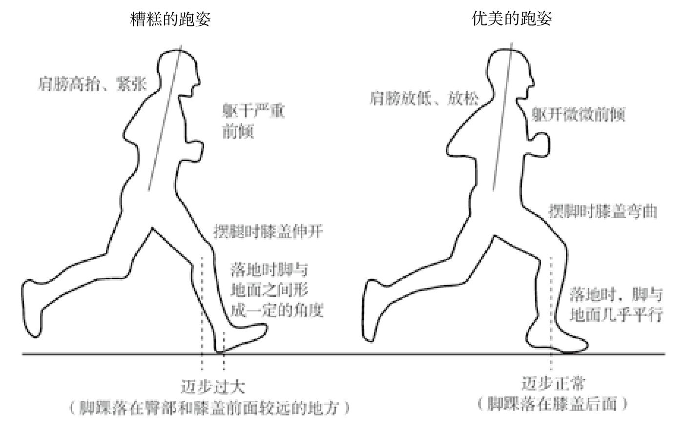{:height 264, :width 413}
		- 随着速度的增加而提高步频，而不是迈步更大，
		- 前脚掌落地和足弓落地跑法会在膝盖以下和脚踝以上的部位产生旋转力（扭力），需要强健的小腿肌肉和跟腱，对于那些准备改用这种落地方法的跑者来说，初期会遇到一些麻烦。如果你也准备尝试改变落地方法，要注意循序渐进，
		- 在现代跑鞋于20世纪70年代被发明出来之前，这种跑姿已经被大多数人类使用了数百万年，
		- 然而，脱掉鞋子并不一定能让你跑得更好，穿着鞋跑得出色的大有人在。
		-
		- 与人们普遍认为的狩猎采集者寿命不长的情况正好相反，狩猎采集者只要能度过危险的婴儿期，就有很大的可能性活到68～78岁。
		- 为了阐释锻炼与衰老之间的联系，我为“祖母假说”又做了一个推论，我称之为“忙碌的祖父母假说”（active grandparent hypothesis）。按照这个推论，人类的长寿不仅是被选择出来的，更是通过人类自己的努力才成为可能，这些努力包括：人在进入老年之后还需要从事中等强度的工作，尽可能地帮助儿孙辈和其他年轻的亲属生存下来，并让他们健康成长。也就是说，一方面，那些能够帮助人类活过50岁的基因得到了选择（虽然尚未得到证实），另一方面，能够在我们进行运动时对身体进行修复和维护的基因也得到了选择。
		- 每周锻炼消耗2 000大卡以上能量的中年校友（25～49岁），其全因死亡率比习惯久坐的同龄同学要低21%。而那些每周锻炼消耗2 000大卡以上能量的70岁以上校友，其全因死亡率只有习惯久坐的同龄同学的一半。
		- 研究表明，如果在服用抗氧化剂的同时进行锻炼，甚至会对人体产生危害，在锻炼的同时服用抗氧化药物的人，其身体的一部分氧化损伤被药物修复，剩下的损伤程度不足以激发自我修复机制，这部分氧化损伤便积累下来
		- 研究报告发现，那些每周运动时间为公认的150分钟标准10倍以上的狂热锻炼者，其死亡率与每周运动时间为公认标准时长5～10倍的锻炼者相比，对健康的积极影响并没有明显提升。13米根·瓦斯菲和阿伦·巴吉什在整理这些数据之后总结道：“这些研究结论强化了一个概念，即轻微到中等强度的锻炼对于健康有着实质性的积极作用，但是继续增加运动量似乎对健康既没有更好的影响，也没有更坏的影响
		- 极端的锻炼也许会对身体造成伤害，但是极少有人真正达到那种水平，因此过度锻炼的效应很难得到深入研究。
		- 各种各样的数据引发了一个假说：高强度运动对于能量的需求使得人体出现了一个暂时的“开窗”效应，对于感染的防御能力严重下降。
		- 开窗假说（open window hypothesis）只是一个大致的判断，但是到底怎样的锻炼才算过量，则需要进一步研究。
		- 相比完全不动的小白鼠，进行中等强度低水平运动（每天跑20～30分钟）的小白鼠的存活率是前者的两倍，但是进行高强度运动（每天跑动2.5小时）的小白鼠的死亡率要高于完全不动的小白鼠；
		- 我们仍然需要更多的医学数据，才能确定锻炼时的运动量要高到何种程度，以及在何种条件下，才会超越免疫系统对抗感染的能力。20但正在与严重的感染性疾病对抗的人，无疑都应该尽量避免剧烈运动。
		-
		- 研究人员进一步仔细观察之后发现，伯富特等运动员体内较高密度的冠状动脉钙化斑块与普通人的不同，后者体内更软也更不稳定的斑块才是造成心脏病的危险因素。运动员由于高强度训练产生的高压对血管壁造成了损伤，而斑块更像是一种保护性的适应，它们起到了创可贴的作用，对血管壁进行了修复。26一项针对2 2000名中年人和老年人的大规模分析发现，身体活动量最大的个体，冠状动脉钙化这一指标得分最高，但患心脏病的风险最低。
		- 以极值的运动量水平进行训练确实有这种可能，而且如果你在严重感染的状态下或者在受伤恢复期间仍然这样锻炼，那么出现锻炼过度的可能性就更大。如果你不停地尝试高强度的运动，如奥运会级别的举重、每天5盘网球大战、跑马拉松或者超负荷参与那些令你痴迷的项目，而你的骨骼、肌肉和其他组织又无法适应这种压力，那么你的肌肉骨骼系统的受伤风险将会增加。
		- 为数不多的研究显示，一些在老龄阶段发胖的个体，但并非肥胖或者严重超重，似乎会活得略微长久一点，其中的原因也许是他们拥有更多的能量储备，
		- 近年来，运动科学家开始研究和重视高强度间歇训练，加拿大运动生理学家马丁·吉巴拉（Martin Gibala）的实验室组织了两组大学生，一组进行高强度间歇训练——30秒全力运动，共6组，两组运动中间会短暂休息，另一组以常规的长距离有氧运动为主，两周之后进行测量对照。令人震惊的是，高强度间歇训练对学生的心血管状况和新陈代谢功能产生了巨大的影响，他们的身体使用血糖的能力和燃烧脂肪的能力都有提高。
		- 如果你习惯每周进行几次30分钟轻松慢跑或者自行车骑行，那么不妨在周计划中尝试加入一点高强度间歇训练。当然，你最好先征求一下医生的意见。
		- 高强度间歇训练需要你极其严苛地逼迫自己，才能达到效果，而且这种训练确实会给人造成强烈的不适感，所以对于那些体能状况不佳，或者存在关节疼痛和心血管功能缺陷等健康问题的人，一般不建议采用这种方法。而且，每周也不宜进行太多次的高强度间歇训练，这样反而不会燃烧更多的能量，只会增加受伤的风险。
		- 一个共识性的建议是，每周进行两次肌肉力量增强训练，把所有大肌肉群（腿、臀、背、核心、肩和臂）都调动起来。合理安排这两次锻炼，以确保每次锻炼之后肌肉有足够的恢复时间，
		- 不需要进行大重量的训练，每个部位重复练习8～12次，感觉累的时候可以停下来。做2～3组上述训练比只进行一组效果更好。
		- 我和同事罗布·谢弗、阿伦·巴吉什测量了一百多名塔拉乌马拉农耕者的血压，从年轻至年老，所有年龄的人都包括在内，我们最终发现，十几岁少年与80多岁老年人的血压没有区别。34同样的道理，那些合理饮食、保持运动习惯的工业化社会人群，在步入老年的时候也会保持正常的血压。
		- 只进行耐力训练的职业跑者能够一直保持较低的血压，他们的心脏在训练中变得更大更有弹性，这样才能更好地确保超大量的血液流动，但是这种类型的心脏无法应对力量训练负重时所需要的高血压。而美式足球跑锋式对抗型选手，他们的心脏会变厚变硬以应对高血压，却无法处理心肺训练所需要的超大血流量。
		- 这一风险是芬兰学者在对1920年至1964年参加过奥运会的每一名芬兰选手进行大规模研究时发现的。越野滑雪等耐力项目选手的心脏病突发风险竟然比芬兰人的平均值低2/3，而举重和摔跤等项目的力量型选手的这一数据比平均值高1/3。
		- 它们测量的只是免疫系统的活动，而不是临床结果，但是研究也发现，经常进行中等强度锻炼的人群，其抗感染细胞的基准水平较高，而在长时间的高强度锻炼之后，这一水平会迅速下降。
		- 规律的中等强度身体活动能够提高免疫系统的能力，至于运动量多少是合适的，对于哪种传染性疾病更有效，我们所知甚少。
		- 身体活动对免疫系统产生的效果，几乎所有研究都是针对心肺训练的，为数不多的另外一些研究发现，力量训练对免疫系统几乎没有什么作用，当然也没有副作用。
		  id:: 63ac0eed-66d3-44c2-8e60-6803430b5bee
		- 软骨退化的过程也许可以通过身体活动干预，但是不同的锻炼项目如何预防骨关节炎，以及预防到何种程度，仍然不甚清楚。也许身体活动最大的好处是避免肥胖症和降低肥胖程度，从而减轻了炎症和巨大的压力。83步行和跑步等身体活动所施加的压力，能够提升关节软骨的数量和质量。84最终，锻炼尤其是负重训练，能够增强关节周边的肌肉，从而降低这些关节由于异常行为（如膝盖扭伤）而受到的损伤。85但是任何事情都存在两面性。身体活动虽然总体而言有助于预防骨关节炎，但是有些运动，尤其是像速降滑雪这样的时尚运动，可能造成关节部位的严重损伤，反而增加了你患病的风险。
		- 我们应该对这个话题拥有一个更广泛的认知，即长期不进行身体活动就是一种失配，
	- 运动生理学
	  collapsed:: true
		- 从30岁左右开始，人体内的肌肉质量会以每十年约3%的速度下降，
		- 肌肉
		  collapsed:: true
			- 中等强度运动会肌肉组织产生微小损伤，这会促使肌肉会释放出血管内皮生长因子（VEGF）和成纤维细胞生长因子（FGF-2），让细胞分化形成更多组织以制造新血管，从而可以构造一个更加强健的输送氧气系统，
			- 运动使肌梭的静息张力放松，这种放松切断了通向大脑的应激反馈回路，
			- 有技巧的运动能起到活动依赖性学习的作用，提高大脑的可塑性，
		- 关节
		- 骨骼
		  collapsed:: true
			- 有氧训练难以阻止肌肉和骨骼随着年老而退化，因此应做一定的力量练习，
			- 但力量练习只是减缓了老化的速度，不应做超过自己“能力范围”的锻炼，
		- 运动的局限性
		  collapsed:: true
			- 运动会增加皮质醇的量，降低免疫力，
			- 如果长期不运动，综合生活中可能的其它压力，忽然的运动会带来负面影响，
			- 运动过后一小时，运动迅速集中注意力的作用开始消失，
	- 运动处方
		- 体质测定
		  collapsed:: true
			- 基本评估
				- 血压，心率，体脂率，体重指数，
				- 身体部位维度，身体姿态，
			- 体能测试
				- 平衡性测试，柔韧度测试，
				- 肌肉耐力测试，心肺耐力测试，
		- 运动量
		  collapsed:: true
			- 跑步科学(John Brewer)
			  collapsed:: true
				- 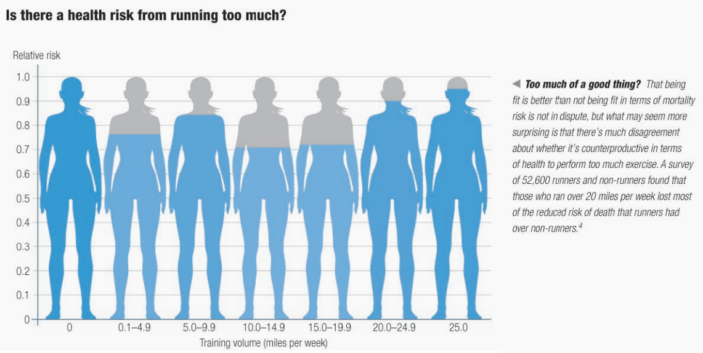{:height 270, :width 520}
				- 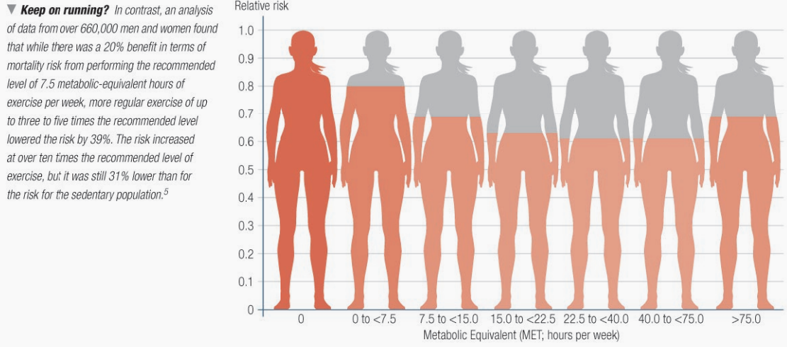{:height 250, :width 520}
			- MET(metabolic equivalents)
			  collapsed:: true
				- 换算
				  collapsed:: true
					- 1 MET \approx 1 kcal/kg/hr；
					- 即60kg的人，跑步0.5小时，配速10km/h（MET大约为10）；
					- 对应的卡路里消耗为(10 \cdot 60 \cdot 0.5  = )300kcal，
				- 不同运动的MET值
				  collapsed:: true
					- 1；静坐，看电视等，
					- 3；一般家务工作，
					- 7；一般力量训练，
					- 7；骑自行车，
					- 10；跑步，配速10km/h，
			- 运动标准
			  collapsed:: true
				- 建议的保持身体健康的运动量为*每周16MET·小时*（1000MET·分钟），
				- 按照上图数据，推荐的运动量为*每周30 - 40MET·小时*，或每周1800 - 2400kcal，
				- 按照上图数据，推荐的跑量为*每周18公里*（11英里），
			- 运动上限
			  collapsed:: true
				- 按照上图数据，上限运动量为*每周75MET·小时*，换算成卡路里为每周(75 \cdot 60 =)4500kcal左右，
				- 按照上图数据，上限跑步距离为每周20英里，即32公里，
			- （环境修正）
			  collapsed:: true
				- 空气质量不好时，应尽量避免室外运动，
				- 如果需要室外运动，应将时间控制在0.5小时以内，
		- 运动组成
			- 概述
			  collapsed:: true
				- 建议一次运动时间小于一小时，一周运动3 - 5次，
				- 训练计划的要点应包括：每周运动频率，动作费力程度，运动持续时间，运动方式，总运动量等，
				- 最初开始训练时应降低训练量，如一次一组，一组8 - 12次；最初训练阶段应维持4周左右，
				- 应该间隔4 - 6周对身体状态进行重新评估，并重新调整计划，
			- 热身
			  collapsed:: true
				- 5-10分钟的小到中等强度的运动，
				- 包括低强度的抗阻运动和有氧运动，
				- 可以调节机体运动状态，增加关节活动度，从而降低损伤风险，
			- 整理活动
			  collapsed:: true
				- 类似热身阶段，为5-10分钟的小到中等强度的运动，
				- 包括低强度的抗阻运动和有氧运动，
				- 使身体恢复到正常水平，消除较大强度运动时的代谢产物，
			- 抗阻运动
				- 运动时间
				  collapsed:: true
					- 建议每周对每个肌群训练2-3次，
					- 每个肌群的训练间隔时间应大于2天，
					- 建议每个肌群练习2-4组，一组8-12次，组间休息1-3分钟，
				- 运动选择
				  collapsed:: true
					- 建议包括能调动多个肌群参与的运动，和单关节练习的运动，
					- 肌肉“不平衡”会引起损伤，建议同时练习相对的肌群，
				- 运动强度
				  collapsed:: true
					- 最大重复次数（RM）
					- 建议初学者的强度为60% 1 - RM，有一定力量后可以增加至70% 1 - RM，
					- 力量较差的人建议强度为50% 1 - RM，
			- 拉伸
			  collapsed:: true
				- 概述
					- 缓解运动带来的肌肉紧张，增加关节活动度；
					- 应保持轻微的拉伸感或少量的不适感，不应感到疼痛，
				- 组成
					- 动态拉伸：即通过重复拉伸动作进行拉伸，
					- 静态拉伸：即拉伸到一定位置后保持静止一段时间，
				- 时间
					- 持续时间在10-30秒左右即可，
					- 建议重复2-4次，可以每天练习，
			- 平衡练习
			  collapsed:: true
				- 目前对平衡性练习的研究较少，因而还没有比较普适的平衡性练习方案，
				- 可以每天进行20min左右的瑜伽，太极拳等动作的练习，
	- 训练计划（基础）
	  collapsed:: true
		- （有氧运动）
		  collapsed:: true
			- 运动时间
				- 建议有氧运动至少持续10分钟，
				- 建议每周3-5次较大强度运动，
				- 每周进行五次以上“较大强度”运动时，发生损伤的概率增加，因此不向大多数人推荐这样的运动频率，
				- 建议每天进行30-60min的中等强度运动，或每周3天，每天20-30min的较大强度运动，
			- 运动强度
				- 运动时的心率（HR）
				- 运动时的最大摄氧量（VO_{ 2}）
				- 运动新陈代谢值（MET）
			- 运动强度估计
				- 一般有氧运动的速度可用于估计运动强度，
				- 中等强度：5km/h，100步/分钟，5MET，
				- 较大强度：10km/h，10MET，
		- 抗阻运动
			- 运动准备
			  collapsed:: true
				- 泡沫轴拉伸
				  collapsed:: true
					- 建议先完成5~10分钟的按摩，
				- 静态拉伸
				- 动态拉伸
					- 手助力高抬腿走
			- 上肢运动
				- 上肢拉伸
				  collapsed:: true
					- 有轻度拉伸感即可，*不应*出现疼痛感，
					- 一天2组-3组，
					- 肩颈柔韧性
					  collapsed:: true
						- 颈部：10-15秒
							- 单手辅助低头伸展
							- 下巴后缩低头伸展
							- 左侧，右侧颈部拉伸
							- 左前侧，右前侧；左后侧，右后侧，
						- 肩部：10次
							- 肩部向前，向后旋转，
							- 耸肩沉肩
					- 胸背柔韧性
					  collapsed:: true
						- 侧卧手臂伸展：5-10秒
						- ？胸椎后伸伸展：双手屈肘枕在投后，肘部平放，保持2-5分钟，
						- 背阔肌拉伸：背部紧贴墙壁，双脚不靠墙壁，向上举起手臂：10秒，
						- 胸大肌拉伸：手肘贴紧墙壁，肘部低于肩膀，另一只手臂自然下垂：10-30秒，
						- 胸小肌拉伸：手肘贴紧墙壁，肘部高于肩膀，另一只手臂自然下垂：10-30秒，
					- 泡沫轴滚动上背部
					  collapsed:: true
						- 双肘要相触，让肩胛骨前伸，并露出胸椎，
						- 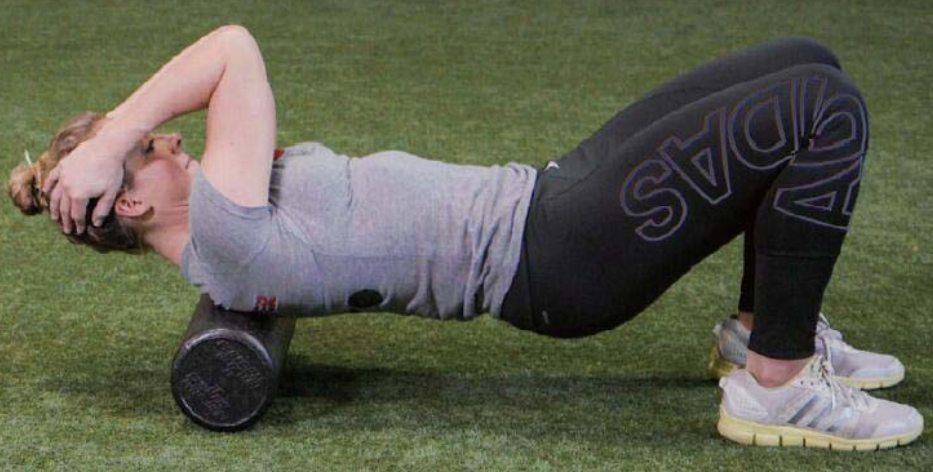{:height 138, :width 251}
				- 上肢热身
					- 肩关节环绕
					- 小臂向前拉伸：左右2次，每次20秒，
					- 俯身Y字伸展：2组，每组10次，
					- 招财猫：2组，每组10次，
					- 俯身T字伸展：2组，每组10次，
					- 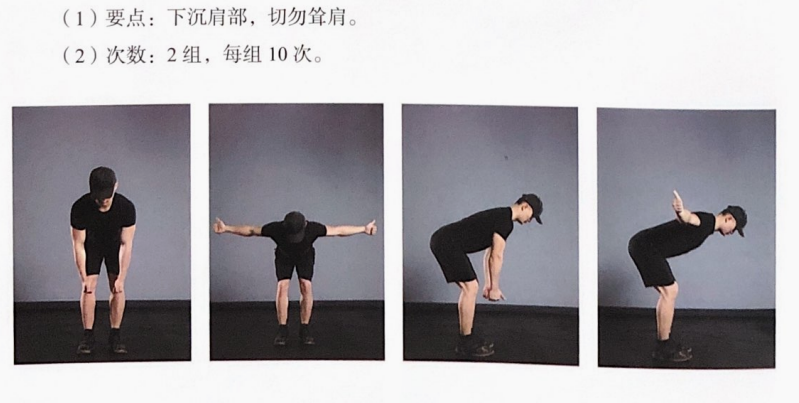{:height 167, :width 315}
					- 站姿L字伸展：2组，每组10次，
					- 俯身W字伸展：2组，每组10次，
					- 站姿胸部伸展：4次，
					- 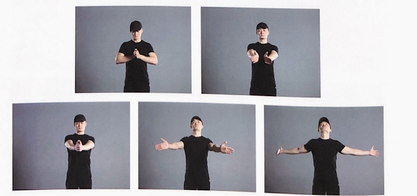{:height 149, :width 304}
				- 上肢运动
					- 胸部：靠墙俯卧撑（8-10次）
					- 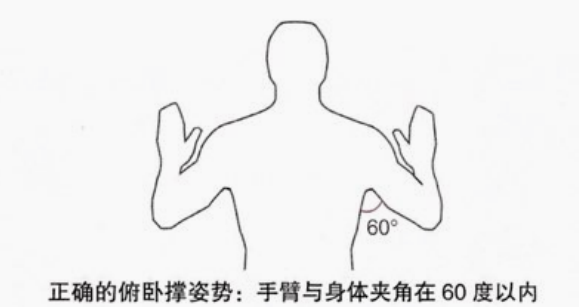{:height 150, :width 262}
					- 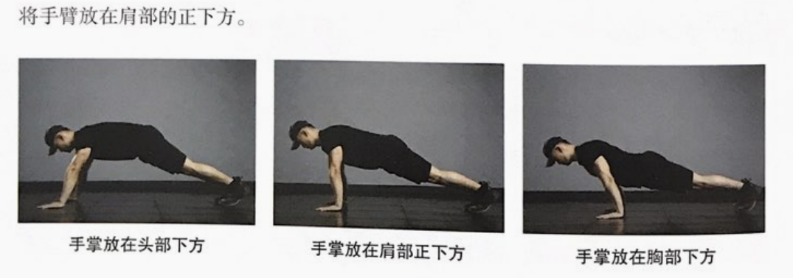{:height 102, :width 262}
					- 休息40秒，
					- 斯万推胸（8 - 10次）
					- 休息40秒，
					- 背部：俯身划船10次，
					- 休息40秒，
					- 高位引体10次，
					- 胸部，背部的肌群较大，应首先练习，
					- 手臂，肩部的肌群应降低练习量，
					- 单臂过头动作可能会对肩关节造成太大压力，
			- 腰腹运动
			  collapsed:: true
				- 腰腹热身
					- 腹肌热身
				- 腰腹运动
					- 平板支撑（30秒）
					- 休息40秒，
					- 动态平板支撑（5 - 6次）
					- 休息40秒，
					- 卷腹（10 - 12次）
					- 休息40秒，
					- 仰卧自行车（30秒）
					- 休息40秒，
					- 臀桥（5秒，5次）
					- 鸟式伸展
				- 不建议尝试增大腰椎的活动范围，骨盆和下肢向一侧转动的同时，躯干还保持稳定或旋转到另一侧尤其危险，
				- 发展胸椎灵活性，并限制腰椎的灵活性，
				- 有多少运动项目或体育活动包含躯干的前屈和伸展？答案会是“寥寥无几”。运动要求的是核心稳定，即核心肌群的主要目的是阻止运动，
				- 大多数人的躯干并不需要额外的旋转活动范围。我们真正需要的是能够控制自己现有的活动范围。
			- 下肢运动
			  collapsed:: true
				- 下肢拉伸
					- 靠墙腘绳肌拉伸
					  collapsed:: true
						- 臀部在地板上，腰部略微弓起。
						- 可以在下背部下方放一个小腰枕，以维持腰椎轻微前凸。
						- 腘绳肌的止点在骨盆，而不是脊柱。
						- 双脚并拢，髋关节外旋会感觉比较舒服，但可以尽量达到中立位，
						- 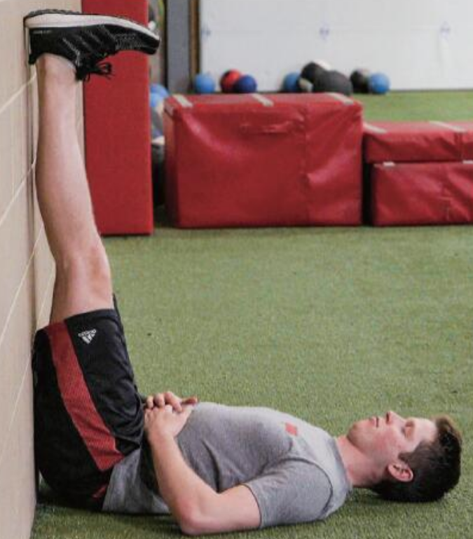{:height 242, :width 209}
					- 踝关节灵活性
						- 侧向踢腿
						- 保持支撑脚与地面接触，把旋转带到足部和踝关节
						- 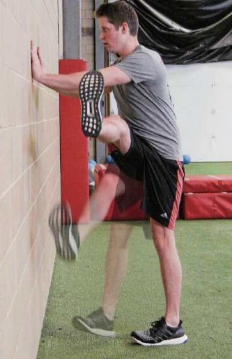{:height 246, :width 157}
					- 髋关节灵活性
						- 侧向弓箭步：双脚分开1~1.2米，
				- 下肢热身
					- 膝关节热身
					- 侧抬腿（臀部）保持上身平衡，
				- 下肢运动
					- 侧卧踢腿
					- 半蹲
					  collapsed:: true
						- 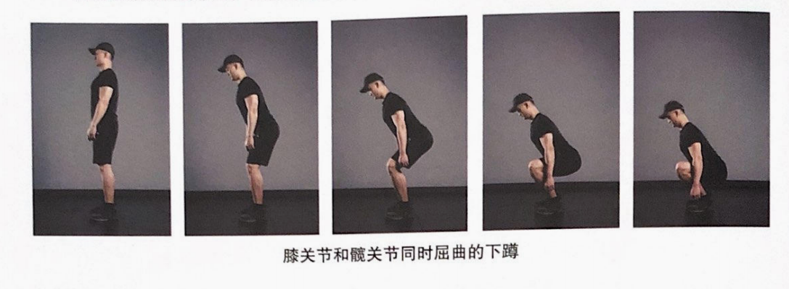
						- 双脚分开大约与肩同宽，略向外转约10~15度，
						- 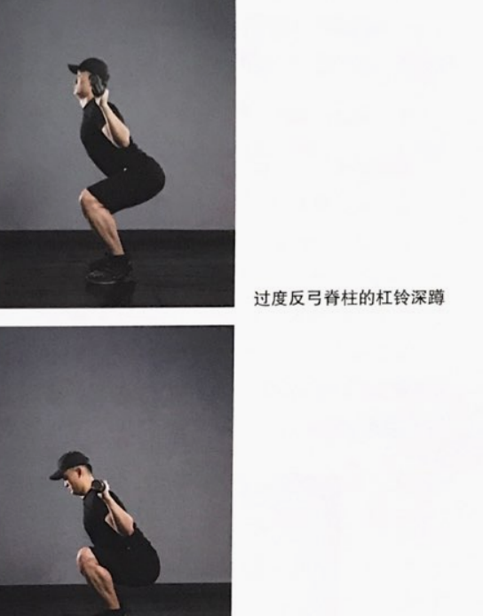{:height 253, :width 191}
						- 如果脚跟离开地面，可以在鞋跟下放一块约2.5×10厘米板；
					- 单腿（直腿）硬拉
					- 原地分腿蹲
					  collapsed:: true
						- 重心要保持在前脚的脚后跟上，用前腿发力；后脚当作一个平衡点，不要使用后腿来发力，
					- 站姿提踵
					- （弓箭步走）
						- 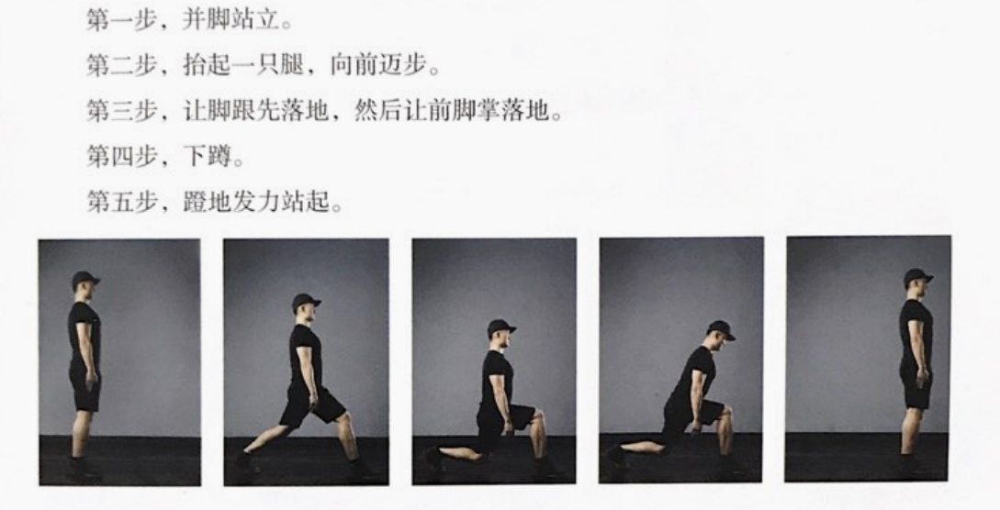
			- （准备时吸气，发力时呼气），
		- （肩颈强化运动）
		  collapsed:: true
			- 颈部
			  collapsed:: true
				- 仰卧抬头
				  collapsed:: true
					- 嘴巴张开，舌顶上颚，
					- 头部不应完全抬离地面，
					- 微收下巴，避免抬头，
					- 维持10秒，重复5-10次，
				- 俯卧头部上抬
				  collapsed:: true
					- 微收下巴，避免抬头，
					- 双手放于额前，
					- 肩膀夹紧，避免耸肩，
					- 头部向上移动，不是抬头（后仰），
					- 维持10秒，重复5-10次，
			- 肩背肌肉
			  collapsed:: true
				- 坐姿肩部后夹（菱形肌）
				  collapsed:: true
					- 微收下巴，避免抬头，
					- 感受肩胛骨内侧发力，
					- 维持10秒，重复5-10次，
				- 坐姿肩部外旋（小圆肌）
				  collapsed:: true
					- 保持上臂贴近身体，前臂与上臂垂直，
					- 向外移动前臂，维持5-10秒，重复5-10次，
				- 靠墙划臂（下斜方肌）
				  collapsed:: true
					- 向上划臂时，手臂可以向外扩展，
		- ？神经伸展
	- 运动损伤与修复
- 饮食
  collapsed:: true
	- BMR(Basic metabolic rate)
	  collapsed:: true
		- 可以大概理解为不做任何运动锻炼的时候，身体维持现在的体重所需要的卡路里，
		- 对于男性，BMR(Harris-Benedict equation)为88.362 + (13.397 x weight(kg)) + (4.799 x height(cm)) - (5.677 x age)，
		- 以60kg，172cm，25岁计算；BMR为1890 - 1930kcal，
		- 按推荐运动标准（每天200kcal），建议的一天摄入量为*2100kcal左右*，
	- 热量限制(calorie restriction)
	  collapsed:: true
		- 综述
		  collapsed:: true
			- 人体长期*营养不良*，饥饿，容易使肝内脂肪代谢发生障碍，导致脂肪细胞堆积，最终产生*脂肪肝*；消瘦的脂肪肝病患者约占脂肪肝病患者总数的20%，
			- 骨骼肌和心脏都需要能量，能量不足会影响心脏的工作[9,11]，可能引发潜在的身体供氧、供血方面的问题；对四千多名长期节食者的观察发现，他们经常出现头晕和疲劳[8]，
			- 对运动员的研究发现，节食可引起睡眠周期和睡眠模式的改变，导致睡眠障碍，入睡困难、白天嗜睡[67]，
			- 基于动物的研究显示，*卡路里限制*饮食*延缓*了年龄相关的*疾病*的发作，并且在一些研究中延长了寿命，
			- 啮齿动物和其他动物的卡路里比平时少10%到40%，但提供了所有*必要的营养素*时，许多动物的寿命延长了，几种疾病的发病率降低了，
			  collapsed:: true
				- 一项针对雄性小鼠的研究发现，终生隔日禁食可以延长寿命，主要是通过延缓癌症的发生，而不是减缓其他衰老过程，
				- 一些研究没有显示出这种益处，
				- 一些小鼠品系中，卡路里限制缩短了寿命而不是延长了它，
			- 基于人类的研究显示，*肥胖和超重*的人可以通过卡路里限制饮食改善他们的健康状况，
			- 然而，从长远来看，没有足够的证据向*所有人*推荐这样的饮食方案，
			  collapsed:: true
				- CALERIE是目前针对人类的最长的试验（持续了2年），但仍不足以了解卡路里限制的长期健康影响，
				- 卡路里限制干预导致了部分人骨密度，瘦体重和有氧能力（身体在运动期间使用氧气的能力）略有下降，
				- 一些CALERIE参与者经历了短暂的贫血发作，
				- CALERIE的卡路里限制程度对于正常体重或中度肥胖的人来说是安全的，但建议进行临床监测，
			- 来源
			  collapsed:: true
				- https://www.nia.nih.gov/news/calorie-restriction-and-fasting-diets-what-do-we-know
				- https://knowyourdna.com/calorie-restriction/
				-
		- 具体方式(fasting)
		  collapsed:: true
			- 限时饮食：每天在有限的小时数（如 6-8 小时）内食用餐食，其他时间不吃任何东西，
			- 隔日禁食：一天进食不受限制，第二天只进食少量卡路里，如此反复，
			- 5-2饮食模式：每周连续5天不受限制进食，然后2天限制卡路里摄入，
			- 定期禁食：连续多天限制热量摄入，例如每月一次，连续5天，所有其他日子不受限制，
		- 建议
		  collapsed:: true
			- 美国人的膳食指南建议，限制卡路里的男性饮食为1600至1800卡路里，
			- 研究显示，美国男性平均膳食摄入量为2700卡路里，
	- 饮食比例
	  collapsed:: true
		- 按照建议的三大营养素配比，对应的供能和摄入标准为，
		- 碳水化合物(2100 \cdot 0.55 =)1155kcal，大约(1155 / 4 =)290g，
		- 蛋白质(2100 \cdot 0.18 =)378kcal，大约(378 / 4 =)95g，
		  collapsed:: true
			- 各项动物，人体的研究显示，日常热量来源中的蛋白质超过20%（*110g左右*），与全因死亡风险提升75%有关。
			- 建议动物蛋白应占膳食蛋白质总量的30%左右（20-30g），
			- 植物蛋白质可以（部分）替代动物蛋白质，但应多种植物蛋白搭配食用，
			- 饮食中植物脂肪越高，动物脂肪和蛋白含量越低，死亡风险会下降，
		- 脂肪(2100 \cdot 0.27 =)567kcal，大约(567 / 9 =)63g，
		  collapsed:: true
			- omega-3脂肪往往来自于鱼和蛋，
			- 植物食物（亚麻籽）也含有omega-3，但不易转化为人类使用的类型，
			- 可以适当多摄入亚麻籽等食物，
			- 饮食中可以不包括饱和脂肪，因为细胞可以通过脂质新生产生棕榈酸，之后再转化为其他饱和脂肪，
			- 然而，近年发现，奶类、鸡蛋和黑巧克力中饱和脂肪并不会对健康有害处，
	- 饮食修正
	  collapsed:: true
		- 一般认为，不应过于介意某些特定时间的饮食状况，而应保证一段时间内饮食的“均值”符合建议水平，
		- 未来的状况难以预期，因此不应强迫维持每天都将饮食控制的十分严格，
		- 一种妥协的方式为，从食物的选择（购买）阶段最小化可能的风险，
		- 零食选择
		  collapsed:: true
			- 选择零食时最好选择碳水化合物较多，脂肪较少的食物，
			  collapsed:: true
				- 如果植物油为高油酸，则可以适当放宽标准，
				- 对于其它植物油，应尽量降低植物油的量，
			- 按照个人经验，相比脂肪和蛋白质，碳水化合物较容易消化，
			- 碳水化合物中，白砂糖和淀粉较易消化，果糖和其它代糖（麦芽糖醇，木糖醇等）较不易消化，
			- 含钠（盐）较多的食物不容易消化，
		- 情绪调整
		  collapsed:: true
			- 除了消化系统的反馈调节，心理状态也会对进食产生一定的影响，
			- “饮食激励理论”认为，对饮食可能带来的满足感的预期会促使人们进食；
			- 反之，若进食没能带来“满足感”，则消化系统的反馈调节可能不足以阻止人类继续进食，
			- 人是活在当下的生物，而情绪上的停止进食，则是基于不良的饮食在未来可能带来不利影响的*预期*；然而预期的实现是概率问题，而且不会在当下立即实现，
			- 类似睡眠，歌曲可能会帮助调节情绪，但可能难以找到适当的歌曲，
			- 可以尝试转移注意力，但并非所有的事物都能激活注意力——刺激性较强的事物难以长期专注，而可能长期专注的事物则难以在短期内激活注意力，
			- 综上所述，情绪的波动难以预计，难以改善；在和平年代，社会联系可能是短期的调整情绪的最佳方式，
		- 环境调整
		  collapsed:: true
			- 过热或过冷的环境都会对进食有影响，
			- 最好保证饮食环境的恒温状态，保证不会出大量的汗或者感到寒冷，
			- 进食一段时间以前应保证饮水的充足，
			- 最好不要一边吃饭，一边读书，工作或思考其它问题；掌管语言机能的大脑区域活动时，提高血清素活力的效果就会变弱，
	- 饮食来源
	  collapsed:: true
		- 精制糖
		  collapsed:: true
			- 一般建议每日糖的摄入量小于30g，
			- 同样为碳水化合物，精制碳水（果糖，蔗糖）会导致更严重的脂质新生，内脏脂肪的增加，最后可能导致脂肪肝和胰岛素抵抗；
			- 因此，即使控制卡路里的摄入，高精制糖的饮食也会导致健康隐患，
			- 8位受试者在18天当中，9天摄取大量的果糖（100g左右），另外9天摄取的能量不变，但用其他碳水化合物取代果糖。
			- 喝果糖饮料的9天，受试者出现“脂质新生反应”——指碳水化合物过多时，肝脏会把多余的能量转化为脂肪储存，是脂肪肝的发病前期指标。
			- 该项试验证明，果糖的摄入可能引致脂肪肝的形成，
			- 41位肥胖儿童在9天内限制果糖摄取量（20g左右），减少的卡路里用淀粉类食物取代；9天后，受试者的肝脏脂肪，体脂减少，胰岛素抵抗降低，
		- 素食修正
		  collapsed:: true
			- 奶制品
			  collapsed:: true
				- 中国居民膳食指南建议每天应该喝300克奶，约合30-50g奶粉，
				- 然而，维生素B1、B6、B12、叶酸和维生素C对热不稳定，加热容易损失；巴氏灭菌奶的营养价值变化不大，超高温灭菌乳里面维生素的损失在10-20%左右，
				- 2022年的大规模研究揭示，经常喝牛奶与中国人癌症风险升高有关；然而，目前关于食用乳制品是否会影响癌症风险的总体证据，在全球范围内并不一致。
				  collapsed:: true
					- Dairy consumption and risks of total and site-specific cancers in Chinese adults，
			- 维生素B12
				- 主要来源为肉类和蛋类，
				- 重吸收率较高，体内的储存量可以满足一段时间的需要，