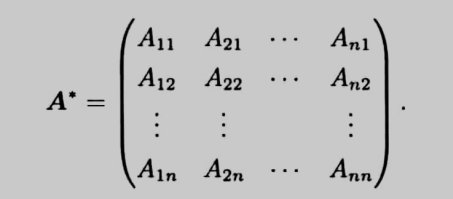
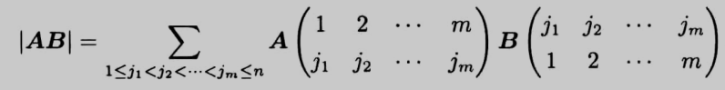
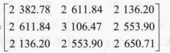
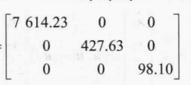

- 矩阵的定义
	- 将m \cdot n个数，按一定顺序排列成一个矩形阵列，称为一个m \times n阶的矩阵（二维数组），
	- 称第i行第j列的元素为a_{ij}（先行后列），
	- 若m = n，则称矩阵为n阶方阵，
	- （也可将矩阵看成m个行向量，或n个列向量的组合），
- 特殊矩阵
	- 零矩阵
	  collapsed:: true
		- 零矩阵可以不为方阵，
		- 一般认为不同型的零矩阵不相同，
	- 单位矩阵 I (identity)
	  collapsed:: true
		- 单位矩阵都为方阵，
		- 不同阶数的单位矩阵都可以用E（或者I）表示，为了避免混淆，应标记单位矩阵的阶数I_{n}，
		- 可交换性：$AI = IA = A$，
		- 一般认为不同型的单位矩阵不相同，
	- 分块单位矩阵
	- 对角矩阵 \Lambda (diag)
	  collapsed:: true
		- 定义：$\Lambda = \begin{pmatrix} \lambda_{1} & & \\ &\ddots & \\ & & \lambda_{n} \\ \end{pmatrix}$，即只有对角线上元素不为0，
		- 性质：
		  collapsed:: true
			- $\Lambda = {\Lambda}^T$，
			- ${\Lambda}^n = \begin{pmatrix} {\lambda_{1}}^n & & \\ &\ddots & \\ & & {\lambda_{n}}^n \\ \end{pmatrix}$,
	- 分块对角矩阵
	  collapsed:: true
		- 若A为分块对角矩阵，且A中的每个分块矩阵都为可逆矩阵，则A也为可逆矩阵，且其逆矩阵为每个分块矩阵的逆矩阵组成的分块矩阵，
		  collapsed:: true
			- 设$\Lambda = \begin{pmatrix} A_{1} & & \\ &\ddots & \\ & & A_{n} \\ \end{pmatrix}$，
			- 则$\Lambda ^{-1}= \begin{pmatrix} A_{1} ^{-1} & & \\ &\ddots & \\ & & A_{n} ^{-1} \\ \end{pmatrix}$，
			- 其中A_{i}可以不是同阶的分块矩阵，
	- 上/下三角矩阵
	- （实）对称矩阵 S (symmetric)
		- 定义
		  collapsed:: true
			- 若方阵A满足$A^T = A$，则称A为对称矩阵，
		- 性质
		  collapsed:: true
			- 转置运算的性质
			  collapsed:: true
				- 对称矩阵之间的线性运算和幂乘得到的矩阵仍为对称矩阵，
				- 对称矩阵的乘积不一定为对称矩阵，
				- 若对称矩阵可逆，则其逆矩阵也为对称矩阵，
			- 对称矩阵不一定可逆，但其逆矩阵也为对称矩阵，
			- 特征值与特征向量
			  collapsed:: true
				- 实对称矩阵的特征值都是实数，
				- 实对称矩阵的k重特征值对应的特征向量的秩一定为k，但不一定正交；
				- 实对称矩阵的不同特征值对应的特征向量一定正交，但不一定为单位向量，
				  collapsed:: true
					- 可由特征值和对称矩阵的定义证明，
				- 实对称矩阵A必定可以进行特征值分解，且*存在*正交矩阵Q使$A = Q\Lambda Q^{T}$，
	- （反对称矩阵）
	  collapsed:: true
		- 定义
		  collapsed:: true
			- 若方阵A满足$A^T = -A$，则称A为反对称矩阵，
		- 性质
		  collapsed:: true
			- $\operatorname{tr} (A) = \sum \limits _{i = 1}^{n} a_{ii} = \sum \limits _{i = 1}^{n} \lambda_i = 0$，
			- $|A| = {(-1)}^{n}|A|$，
			- 反对称矩阵的所有特征值都是复数，
		- 若方阵A同时为对称矩阵和反对称矩阵，则A一定为零矩阵，
	- （图拉普拉斯矩阵）
	  collapsed:: true
		- 构造方阵
		  collapsed:: true
			- 对于任意矩阵$A \in \mathbb{R}^ {m \times n}$，都有$AA^ T$和$A^TA$是对称矩阵，且一定为半正定或正定矩阵，
		- 拆分为对称矩阵和反对称矩阵
		  collapsed:: true
			- 对于任意方阵$A \in \mathbb{R}^ {n \times n}$，都有$A  +  A^ T$是对称矩阵，$A -A^T$为反对称矩阵；
			- 因此，任何方阵$A \in \mathbb{R}^ {n \times n}$都可以表示为对称矩阵和反对称矩阵的和，即$A=\frac{1}{2}(A+A^T)+\frac{1}{2}(A-A^T)$，
	- （列正交矩阵）
	  collapsed:: true
		- 定义：若m行n列矩阵A满足$A^{T}A = I_{n}$，则矩阵A的列向量为单位正交列向量；一般称A为列正交矩阵，
		- 性质
		  collapsed:: true
			- 对任意向量x，都有$||Ax|| = ||x||$，
			- (Ax) \cdot (Ay) = x \cdot y，
			- x \cdot y = 0 \Leftrightarrow (Ax) \cdot (Ay) = 0
	- 正交矩阵 Q (orthogonal)
	  collapsed:: true
		- 定义
		  collapsed:: true
			- 若方阵A满足$A^T = A^{-1}$，则称A为正交矩阵，
			- 正交矩阵不一定为对称矩阵，
		- 正交矩阵的性质
		  collapsed:: true
			- 所有行（列）向量都是单位向量，且行（列）向量之间两两正交，
			  collapsed:: true
				- $A^T A = I = A A^T$，
				- 行、列向量之间一般不正交，
			- 正交矩阵的乘积仍为正交矩阵，但加减一般不是正交矩阵，
			- $|\lambda| = 1$，$|A| = \pm 1$；即正交矩阵必定可逆，
			  collapsed:: true
				- 设 \alpha 为Q的特征向量，则$||Q\alpha|| = ||\lambda\alpha|| = |\lambda| \cdot ||\alpha||$，
				- 由$||Q\alpha|| = ||\alpha||$，可知$|\lambda| = 1$，
			- $A^{*}  = |A|A^{-1} = |A|A^T = \pm A^T$，即有$a_{ij} = \pm A_{ij}$，
			- 正交矩阵不一定为对称矩阵，但同样可以进行特征值分解，且*存在*正交矩阵Q使$A = Q\Lambda Q^{T}$，
		- 构造
		  collapsed:: true
			- 单位矩阵I就是最基本的正交矩阵，
			- 任意n阶可逆方阵P都可以通过格拉姆-施密特正交化转为正交方阵，
			- 任意给定r(r < n)个n维的线性无关向量，也可以先由基扩张定理扩充为R^{n}的一组基，再通过格拉姆-施密特正交化转为正交方阵，
	- 正定矩阵
	  collapsed:: true
		- 定义：若对于所有非零向量x \in R^{n}总有x^{T}Ax > 0，则称*对称阵*A为正定（positive definite），
		- 性质
		  collapsed:: true
			- 正定矩阵定义在*对称矩阵*的基础上，因此说明正定性时应先判断对称性，
			- 正定矩阵一定可逆，
			- \lambda_{i} > 0，|A| > 0，
			- A与I合同，即必有$A = CIC^T = CC^T$，
			  collapsed:: true
				- 此处C可以为任意可逆矩阵，而不一定为正交矩阵，
				- 证明：二次型总可以经正交变换变为标准型，再单位化变为规范型；由于正定二次型的规范性就是单位矩阵，所以正定矩阵A必定可以与I合同，
		- Gram矩阵
		  collapsed:: true
			- 对于任意矩阵A，称矩阵G = A^{T}A 为Gram矩阵，
			- Gram矩阵必为半正定矩阵，
			- 若m \ge n，且A可逆，则Gram矩阵正定，
	- 等价矩阵，相似矩阵，合同矩阵
	- 秩为1的矩阵
	  collapsed:: true
		- 构造
		  collapsed:: true
			- 对于任意向量\alpha, \beta，向量乘法${\alpha}_{m*1}{\beta^{T}}_{1*n}$得到的矩阵为秩为1的m行n列矩阵，
			- 反之，*任意*秩为1的m行n列矩阵都*可以分解*为一个m维列向量和n维行向量之积，
			  collapsed:: true
				- 任意矩阵都可经有限次初等行变换变为行最简型矩阵，对于秩为1的矩阵A，其行最简型为$A_1 = \begin{pmatrix} a_{11} & a_{12} & ... & a_{1n} \\ \vdots & \vdots & & \vdots \\ 0 & 0 & ... & 0 \\ \end{pmatrix}$，变换可以用矩阵语言表述为$A_1 = P_1P_2...P_nA$，
				- 对A_{1}再进行初等列变换，即可变为标准型矩阵$A_2 = \begin{pmatrix} a_{11} & 0 & ... & 0 \\ \vdots & \vdots & & \vdots \\ 0 & 0 & ... & 0 \\ \end{pmatrix}$，变换可以用矩阵语言表述为$A_2 = A_1Q_1Q_2...Q_n$，
				- 标准型矩阵A_{2}可以拆分为$A_2 = a_{11} \begin{pmatrix} 1 \\ 0 \\ \vdots \\ 0 \end{pmatrix} \begin{pmatrix} 1 & 0 & ... & 0 \end{pmatrix}$，
				- 综上所述，可得$A_2 = P_1P_2...P_nAQ_1Q_2...Q_n$，由于初等矩阵均可逆，因此可得$A = P_n^{-1}...P_1^{-1}A_2 Q_n^{-1}...Q_1^{-1} = a_{11} (P_n^{-1}...P_1^{-1}\begin{pmatrix} 1 \\ 0 \\ \vdots \\ 0 \end{pmatrix}) (\begin{pmatrix} 1 & 0 & ... & 0 \end{pmatrix}Q_n^{-1}...Q_1^{-1}) = p_{(m*1)}q_{(1*n)}^{T}$，
		- 构造其它矩阵
		  collapsed:: true
			- 若向量$u_1,u_2,..u_n$的“方向”不相同，则$u_1u_1^T + u_2u_2^T+ ...+u_nu_n^T$可以得到一个秩为n的矩阵，
			- 反之，任意秩为n的矩阵都可以拆分为n个秩为1的矩阵相加（SVD分解），
		- 性质
		  collapsed:: true
			- $A^n = \alpha(\beta^{T}\alpha)(\beta^{T}\alpha)\beta^{T}...\alpha\beta^{T} = {k}^{n-1}A$，
			- 在A的阶数 > 2时，由r(A) = 1可知r(A^{*}) = 0，即A*为0矩阵，
			- 矩阵最多只有一个非零特征值\lambda_{1}，
			  collapsed:: true
				- 矩阵多项式：A^{n} - k^{n-1}A = 0，即\lambda(\lambda^{n-1} - k^{n-1}) = 0；所以必有\lambda = 0或k，但不能说明个数，
				- 特征向量：由于r(A) = 1，因此方程组Ax = 0的解空间的秩为n - 1——即特征值\lambda = 0对应的特征向量的个数为n - 1，
				- 定义（行列式运算）
				  collapsed:: true
					- ，
					- ，
			- 设矩阵为$\alpha\beta^{T}$，则其唯一非0特征值$\lambda_{1} = \beta^{T}\alpha$（常数），对应的特征向量为\alpha，
			- 若\alpha, \beta正交，则矩阵的所有特征值都为0，此时矩阵不能相似对角化；反之，\beta^{T}\alpha \ne 0时，矩阵A可以相似对角化，
	- （幂零矩阵）
	  collapsed:: true
		- 定义：对于方阵A，若A存在某个正整数次方为0，则称A为幂零矩阵，
		- 性质
		  collapsed:: true
			- 若A^{m} = 0，可知对任意正整数k都有A^{m+k} = 0，
			- A不可逆，但秩不一定为0，即A不一定为零矩阵，
			- A的所有特征值都为0，
			  collapsed:: true
				- 证明
				  collapsed:: true
					- 可构造多项式A^{m}\alpha = \lambda^{m}\alpha，
					- 由A^{m} = 0，可知\lambda^{m}\alpha = 0，
					- 由于\alpha \ne 0，所以一定有\lambda^{m} = 0，即\lambda = 0，
				- tr A = |A| = 0，
				- A一定不能相似对角化，
				  collapsed:: true
					- 由于A的所有特征值都是0，所以特征方程$(A - \lambda E)\alpha = 0$就是$A \alpha = 0$，
					- 由于A不可逆，所以秩$r(A)$一定小于n，即方程$A \alpha = 0$不可能有n个线性无关的解，
		- 构造
		  collapsed:: true
			- 最常见的幂零矩阵为$\begin{pmatrix} 0 & 0 & ... & 0 \\i & 0 & ... & 0 \\ \vdots & \vdots & \ddots & \vdots \\ j & k & ... & 0 \\ \end{pmatrix}$或其转置$\begin{pmatrix} 0 & i & ... & j \\0 & 0 & ... & k \\ \vdots & \vdots & \ddots & \vdots \\ 0 & 0 & ... & 0 \\ \end{pmatrix}$，即对角线元素都为0的三角矩阵，
- 矩阵的秩
  collapsed:: true
	- 定义
	  collapsed:: true
		- 基于子式的定义
		  collapsed:: true
			- 定义k阶子式为矩阵A中任取k行k列（可以不在一起），位居交叉处的k^{2}个元素按原顺序排成的矩阵的行列式，
			- 矩阵A的最高阶的非零子式的阶数 r 称为矩阵A的秩，
		- （基于向量组的秩的定义）
		  collapsed:: true
			- 可以利用矩阵的行阶梯形变换进行分析，
		- 定义公式
		  collapsed:: true
			- r(A) = 0 \Leftrightarrow A = 0
			- 1 \le r(A) \le min(m,n)，(A \ne 0)
			- r(A) = r(A^{T})，r(A) = r(kA)
	- 矩阵变换
	  collapsed:: true
		- 定理：初等变换不改变矩阵的秩，
			- 推论：相似，合同变换也不改变矩阵的秩，
		- 定理：矩阵A，B等价 \Leftrightarrow r(A) = r(B)，
		- 公式
		  collapsed:: true
			- r(PAQ) = r(A)； r(PA) = r(A),r(AQ) = r(A)，
				- P、Q可逆，或P列满秩，Q行满秩，
			- r(P^{-1}AP) = r(A)，r(P^{T}AP) = r(A)，
				- P可逆，
			- 行最简型变换
				- 对于任意矩阵A，应有通过可逆变换将其转化为最简型的思路；这可以将矩阵转化为分块矩阵，
				- 设P，Q为变换的可逆矩阵，矩阵A的秩为r，
				- 则有$r(A) = r(PA) = r \begin{pmatrix} A_{1} \\ 0  \\ \end{pmatrix}$，其中A_{1}为 r 行 n 列行最简型矩阵，
				- 同理，也有$r(A) = r(AQ) = r \begin{pmatrix} A_{1} & 0   \\ \end{pmatrix}$，其中A_{1}为 n 行 r 列列最简型矩阵，
	- 定理（矩阵的运算）
	  collapsed:: true
		- $\max[r(A), r(B)] \leq r(A,B) \leq r(A) + r(B)$，
		- $r(A + B) \leq r(A) + r(B) \leq r(AB) + n$，(A_{m*n}，B_{n*s})
		- $r(AB) \leq \min[r(A), r(B)]$，
	- 方程组
	  collapsed:: true
		- 方程组的解
		  collapsed:: true
			- 定理：齐次线性方程组
			  collapsed:: true
				- $Ax = 0 \begin{cases} 必有零解 &  \\ 唯一零解 & r(A) = n \\ 无穷多解 & r(A) < n \end{cases}$
			- 定理：非齐次线性方程组
			  collapsed:: true
				- $Ax = b \begin{cases} 无解 & r(A) < r(A,b) (=r(A,b) - 1) \\ 唯一解 & r(A) =r(A,b) = n(方阵) \\ 无穷解 & r(A) = r(A,b) \end{cases}$
			- 推论：矩阵方程AX = B有解 \Leftrightarrow r(A) = r(A, B)，
			  collapsed:: true
				- 由于max[r(A), r(B)] \le r(A, B)，所以可知 r(B) \le r(A)，
			- 定理：对于m行*n列*矩阵A，若r(A) = r，则齐次线性方程组Ax = 0的解向量组的秩为n - r，
			  collapsed:: true
				- 可由行阶梯形矩阵证明，
			- 推论：A_{m*n}B_{n*s} = 0 \Leftrightarrow r(A) + r(B) \le n，
			  collapsed:: true
				- 此处A，B可能不是方阵，
				- 秩由矩阵*A的列数*限定，矩阵B的列数没有影响，
				- B的列向量都为Ax = 0的解，但不一定为A的基础解系（等号成立时B为A的基础解系）
			- 推论：A与A^{*}，
				- AA^{*} = |A|I，$\begin{cases}r(A) = n &  & r(A^{*}) = n \\ r(A) = n-1 &  & r(A^{*}) = 1 \\ r(A) \leq n-1 &  & r(A^{*}) = 0 \\ \end{cases}$，
			- 推论：同解方程组的秩相等，
			- 应用：r(A) = r(A^{T}A) = r(A^{T}) = r(AA^{T})，
				- 若A为n阶矩阵，则 r(A^{n}) = r(A^{n+1}) ，
		- 应用
		  collapsed:: true
			- 方阵与非方阵，
			  collapsed:: true
				- 方阵（方阵的转置）：可逆（满秩）、不可逆，
				- 非方阵
				  collapsed:: true
					- 判断行数（m）、列数（n）的大小关系（m < n，m > n）；分析R ≤ min(m, n) 的限制，
					- 行（方程）满秩、列（未知数）满秩，
					- 非方阵的转置，
			- 齐次与非齐次，
			  collapsed:: true
				- 齐次：唯一零解、无穷多解，
				  collapsed:: true
					- 若A列满秩，则有R(A) = n，
				- 非齐次：无解、唯一解、无穷多解，
				  collapsed:: true
					- 充分条件：若A行满秩，则必有R(A) = R(A, b)（线性无关向量的延伸组），
						- 非齐次必定有解，但不一定为唯一解，
	- 分块矩阵
	  collapsed:: true
		- $r(A,B) \leq r(A) + r(B)$，
		- $r{\begin{pmatrix} A_{(m*m)} & 0 \\ 0 & B_{(n*n)}  \\ \end{pmatrix}} = r{\begin{pmatrix}  0 & A_{(m*m)} \\ B_{(n*n)} & 0  \\ \end{pmatrix}} = r(A) + r(B)$
		- $r{\begin{pmatrix} A & 0 \\ C & D  \\ \end{pmatrix}} \geq r(A) + r(D)$，$r{\begin{pmatrix} A & B \\ 0 & D  \\ \end{pmatrix}} \geq r(A) + r(D)$
			- 当A可逆时等号成立，
- 运算
	- 矩阵的运算
		- 基本运算
		  collapsed:: true
			- （相等）
			  collapsed:: true
				- 若两个矩阵的行数和列数相同，且每个对应位置的元素都相同，则称两个矩阵相同，
			- （同型矩阵）
			  collapsed:: true
				- 称行数和列数相同的矩阵为同型矩阵，
			- 线性运算
			  collapsed:: true
				- 只有同型的矩阵才可以进行代数运算，如加减、数（标量）乘，
				- 定义数乘矩阵为数乘矩阵中的*每个*元素，
				  collapsed:: true
					- 相比之下，数乘行列式为数乘行列式的某一行/列，
					- 表现为|$kA| = |k\alpha_1,k\alpha_2...,k\alpha_n| =k^n|A|$，
				- 矩阵的线性运算满足线性运算的性质，
			- 转置（transpose）
			  collapsed:: true
				- 将原矩阵的行向量变为列向量，或将a_{ij}元素变为a_{ji}元素，一般记为A^{T}或A'，
				- m \times n阶的矩阵转置后变为n \times m阶的矩阵，
				- 性质
					- 交换律，结合律，
					- 线性运算：$(A + B)^T = A^T + B^T$，且$(kA)^T = kA^T$，
			- 矩阵乘法
			  collapsed:: true
				- 定义：矩阵C_{m·n} = A_{m·k}B_{k·n}的元素c_{ij} = a_{i1}b_{1j} + a_{i2}b_{2j} +…+ a_{ik}b_{kj}，
				  collapsed:: true
					- 左乘矩阵的行数需要等于右乘矩阵的列数，
					- 只有方阵才可以进行幂乘的运算，
					- （向量的线性变换的角度）
					  collapsed:: true
						- 运算ABx可以看成先用矩阵B对向量x进行变换，
						  collapsed:: true
							- 即$ABx = A(Bx) = A [\begin{pmatrix}{\beta}_{1} & {\beta}_{2} & … & {\beta}_{n} \end{pmatrix}x] = A[\begin{pmatrix} \beta_1 \\ \vdots  \\  \\  \end{pmatrix}x_1] + A\begin{pmatrix} \beta_2 \\ \vdots  \\  \\  \end{pmatrix} x_2+ \cdots + A\begin{pmatrix} \beta_n \\  \vdots \\  \\  \end{pmatrix}x_n$，
						- 再用矩阵A对得到的向量进行变换，
						  collapsed:: true
							- 即$A \beta=\begin{pmatrix}{\alpha}_{1(n*1)} & \alpha_{2(n*1)} & ... & \alpha_{n(n*1)} \end{pmatrix} \begin{pmatrix} b_{1(1*1)} \\ b_{2(1*1)} \\ \vdots \\ b_{n(1*1)} \end{pmatrix}= \begin{pmatrix} \alpha_1 \\ \vdots  \\  \\  \end{pmatrix}b_1 + \begin{pmatrix} \alpha_2 \\ \vdots  \\  \\  \end{pmatrix} b_2+ \cdots + \begin{pmatrix} \alpha_n \\  \vdots \\  \\  \end{pmatrix}b_n$，
						- 由此可得，线性变换的角度下，矩阵AB的乘法可以定义$AB=A \begin{pmatrix}{\beta}_{1} & {\beta}_{2} & … & {\beta}_{n} \end{pmatrix} = \begin{pmatrix} A{\beta}_{1} &  A{\beta}_{2} & … &  A{\beta}_{n} \end{pmatrix}$，
						- 即对B的每个分量做线性变换后，组合得到的矩阵，
				- 可以记为“前行后列，乘完相加，按行填充”，
				- 性质
				  collapsed:: true
					- 定义：$A^0 = I, A^{-k} = (A^{-1})^k = (A^k)^{-1}$，
					- 结合律：$(AB)C = A(BC)$，
					- 分配律：$A(B + C) = AB + AC$，
					- 交换律，
					  collapsed:: true
						- 一般AB \ne BA，
						- 若A，B都为*同阶方阵*，则AB = BA时，称A，B可交换，
						- 若矩阵A可逆（B不需要可逆），则A，B可交换，
					- 消去律,
					  collapsed:: true
						- AB = AC，A \ne 0时，*不能*说明必有B = C，
						- A \ne 0，B \ne 0时，*不能*说明必有AB \ne 0，
						- 若矩阵A可逆（或列满秩），则上述公式*能够*成立，
			- （Moore - Penrose逆）
			  collapsed:: true
				- 引入（奇异值分解的简化）
				  collapsed:: true
					- A的奇异值分解$U\Sigma V^{T}$中，对角矩阵\Sigma一般有0元素的分块矩阵，即$\begin{pmatrix} \Lambda_r & 0 \\  0 & 0 \end{pmatrix}_{m*n}$，
					- 可以将U，V也进行对应的分块，即$U = \begin{pmatrix} U_r & U_{m - r}\end{pmatrix}$，$V^{T} = \begin{pmatrix} V^{T}_r \\  V^{T}_{n - r}\end{pmatrix}$，
					- 因此，可将奇异值分解简化为$A = U_{m*r}\Lambda_{r}V_{r*n}^{T}$，
				- 定义
				  collapsed:: true
					- 设A为任意m*n矩阵，r(A) = r，\Lambda为A的奇异值对应的r阶对角矩阵，
					- 称A的广义逆为$V_{n*r}\Lambda^{-1}_{r}U_{r*m}^{T}$，记为A^{+} ，为n*m矩阵，
				- 性质
				  collapsed:: true
					- 满足矩阵方程A(A^{+})A = A，
					- (A^{+})^{+} = A，
				- 应用
				  collapsed:: true
					- 最小二乘法求解
					  collapsed:: true
						- 对于方程组Ax = b，
						- 设x' = A^{+}b = V\Lambda^{-1}U^{T}b，
						- 则可算得$Ax' = AA^{+}b = (U\Lambda V^{T})(V\Lambda^{-1}U^{T})b = U_{r}U_{r}^{T}b$，
						- 由于U_{r}为Col A的标准正交基，所以由坐标投影的计算，U_{r}U_{r}^{T}b就是b在Col A上的正交投影，
						- 因此x' = A^{+}b就是最小二乘法的解，
		- 其他运算
		  collapsed:: true
			- （复数矩阵）
			  collapsed:: true
				- 复数矩阵的共轭为将其所有元素共轭后形成的矩阵，
			- 矩阵的阿达马积
			  collapsed:: true
				- 定义两个矩阵的阿达马积为对应元素相乘得到的矩阵，
				- 可见，只有同型矩阵才可进行阿达马积运算，
			- 矩阵的Kronecker积
			  collapsed:: true
				- 设矩阵A为m行n列矩阵，B为k行l列矩阵，
				- 定义A，B的Kronecker积为一个mk行nl阶矩阵，
				- 即$A \otimes B = \begin{pmatrix} a_{11}B & a_{12}B & \cdots & a_{1n}B \\a_{21}B & a_{22}B &  \cdots & a_{2n}B \\ \vdots & \vdots & & \vdots \\ a_{m1}B & a_{m2}B & \cdots & a_{mn}B \\ \end{pmatrix}$，
			- 矩阵的范数（Norm）
			  collapsed:: true
				- L-p范数
				  collapsed:: true
					- 定义
					  collapsed:: true
						- ${||W||}_p = \max \limits _{x \neq 0} \dfrac{{||Wx||}_p} {{||x||}_p}$，
						- 类似向量的L-p范数，所以也成为“诱导范数”，
						- p = 2时称为谱范数，一般范数默认指谱范数，
					- 性质
					  collapsed:: true
						- 因为${||W||}_2^2 = \max \limits _{x \neq 0} \dfrac{x^{T}W^{T} W x} {x^{T}x}$，由瑞利商的定义，可知${||W||}_2^2$为矩阵W^{T}W的最大特征值，
						- 换言之，矩阵W的谱范数为矩阵W^{T}W的最大特征值的平方根，
				- Frobenius范数（F范数）
				  collapsed:: true
					- 定义
						- ${||A||}_{F}=\sqrt{\sum\limits_{i=1}^{m} \sum\limits_{j=1}^{n} a_{i j}^{2}}$，结果为标量，
						- 其中a_{ij}为矩阵的元素，
					- 性质
						- 正交变换不改变矩阵的F范数，
						  collapsed:: true
							- 由于${||A||}_{F} = \sqrt{\operatorname{tr}(A^{T}A)}$，
							- 因此对于左乘正交矩阵Q，有${||QA||}_{F} = \sqrt{\operatorname{tr}((QA)^{T}QA)} = \sqrt{\operatorname{tr}(A^{T}Q^{T}QA)} = \sqrt{\operatorname{tr}(A^{T}A)}$，
							- 同理，对于右乘正交矩阵U，有${||AU||}_{F} = \sqrt{\operatorname{tr}(AU(AU)^{T})} = \sqrt{\operatorname{tr}(AUU^{T}A^{T})} = \sqrt{\operatorname{tr}(AA^{T})}$，
						- 设矩阵A为n阶方阵；若$||A||_{F} \le 1$，则I_{n} - A可逆，即恒等映射作一个小的扰动以后仍然为可逆映射（可以推广至其它可逆映射），
						  collapsed:: true
							- 设n维向量为方程组(I_{n} - A)x = 0的解，
							- 可知||x|| = ||I_{n}x|| = ||Ax||，
							- 由Cauchy - Schwarz不等式，可知||Ax|| \le ||A|| \cdot ||x||，即||x|| \le ||x||，
							- 由范数的非负性，可知必有x = 0，即方程组只有零解，
							- 所以矩阵I_{n} - A可逆，
					- 计算方式
						- ${||A||}_{F} = \sqrt{\operatorname{tr}(A^{T}A)} = \sqrt{\operatorname{tr}(AA^{T})}$
						  collapsed:: true
							- 由F范数的定义可知，${||A||}_{F} = \sqrt{\sum\limits_{i=1}^{m}  a_{i1}^{2} +\sum\limits_{i=1}^{m}  a_{i2}^{2} +... +\sum\limits_{i=1}^{m}  a_{in}^{2}} = \sqrt{||\alpha_{1}||+ ||\alpha_{2}||+... + ||\alpha_{n}||}$
							- 由于$A^{T}A = \begin{pmatrix} \alpha_{1}^{T} & &  & \\\alpha_{2}^{T} & & &  \\ \vdots & & &  \\ \alpha_{n}^{T} & & &  \\ \end{pmatrix} \begin{pmatrix} \alpha_1 & \alpha_2 & ... & \alpha_n \\ &  &  &  \\  & & &  \\  &  &  &  \\ \end{pmatrix} = \begin{pmatrix} \alpha_{1}^{T}\alpha_{1} & \alpha_{1}^{T}\alpha_{2} & ... & \alpha_{1}^{T}\alpha_{n} \\\alpha_{2}^{T}\alpha_{1} & \alpha_{2}^{T}\alpha_{2} & ... & \alpha_{2}^{T}\alpha_{n} \\ \vdots & \vdots & & \vdots \\ \alpha_{n}^{T}\alpha_{1} & \alpha_{n}^{T}\alpha_{2} & ... & \alpha_{n}^{T}\alpha_{n} \\ \end{pmatrix}$，
							- 由迹的性质，可知$\operatorname{tr}(A^{T}A) = \operatorname{tr}(AA^{T})$，
						- ${||A||}_{F}= \sqrt {\sum\limits_{i=1}^{r} \sigma_i^2}$，\sigma_{i}为A的奇异值，
						  collapsed:: true
							- 由奇异值分解$A = U\Sigma V^{T}$，
							- 对于矩阵\Sigma，其F范数就是$\sqrt {\sum\limits_{i=1}^{r} \sigma_i^2}$（其它元素都为0），
							- 由于正交变换不改变矩阵的F范数，因此A的奇异值与\Sigma相同，
				- 范数不等式
				  collapsed:: true
					- $\dfrac{{||Wx||}} {{||x||}} ≤ {||W||}_F$，即F范数为谱范数的上界，
	- 方阵的运算
		- 方阵的幂
		  collapsed:: true
			- 按矩阵乘法的定义，只有方阵才能进行幂乘，
			- 幂乘的性质
			  collapsed:: true
				- 一般(AB)^{k} = A(BA)^{k-1}B \ne A^{k}B^{k}，
				- 只有A，B可交换时，才有(AB)^{k} = A^{k}B^{k}，
				- 若A^{n} \ne 0，则对任意i < n都有A^{i} \ne 0（反证法），
			- 矩阵多项式
			  collapsed:: true
				- 由于A^{k}与A可交换，所以矩阵多项式的运算类似于数字x，
				- 且对于对角矩阵Λ，多项式可等同于每个对角元素的数字多项式的计算，
		- 逆矩阵（inverse）
		  collapsed:: true
			- 定义
			  collapsed:: true
				- 对于n阶方阵A，若存在n阶方阵B使AB (= BA) = I，则称B为A的逆矩阵，记为B = A^{-1}，
				- 一般也称不可逆的矩阵为奇异（singular）矩阵，
			- 性质
			  collapsed:: true
				- n阶方阵A的逆矩阵唯一，
				- 若A，B均可逆，则(AB)^{-1} = B^{-1}A^{-1}；反之，若A，B有一个不可逆，则AB也不可逆，
				  collapsed:: true
					- 可推广至多个矩阵的乘积，
				- 若矩阵A可逆，则A的转置，求行列式和求逆运算可交换，
				- 若矩阵A*列满秩*，则矩阵A^{T}A可逆（r(A) = r(A^{T}A)），
			- 矩阵可逆的充分必要条件
			  collapsed:: true
				- 定义AB = I，
				  collapsed:: true
					- 对于低阶的矩阵，可以根据定义设对应的逆矩阵$A^{-1} = \begin{pmatrix} b_{11}& b_{12} \\ b_{21 }&b_{22} \\ \end{pmatrix}$，再进行矩阵运算，
					- 对于抽象矩阵等式，应尝试寻找（） = E / kE，
				- 行列式|A| \ne 0，
				- A的列（行）向量线性无关，
				- A与单位矩阵等价，
				- 方程组Ax = 0只有零解，
			- 逆矩阵的求解
			  collapsed:: true
				- 初等行变换
				  collapsed:: true
					- (A | I) \rightarrow (I | A^{-1})，
					  collapsed:: true
						- 证明
						  collapsed:: true
							- 将A，I组合为分块矩阵后，对分块矩阵进行的行变换等同于分别对两个矩阵进行行变换，
							- 即P(A , I) = (PA , PI)，
							- 因此P = A^{-1}时，有(PA , PI) = (I , A^{-1})，
							- 然而，对矩阵进行的列变换，不能等同于分别对两个矩阵进行列变换，
				- （初等列变换）
				  collapsed:: true
					- 理论上，也可通过列变换，将$\begin{pmatrix} A \\ I \\ \end{pmatrix} \rightarrow \begin{pmatrix} I \\ A^{-1} \\ \end{pmatrix}$，
				- 伴随矩阵
				  collapsed:: true
					- 若A可逆，则A^{-1} = |A|^{-1}A*，
					- 对于n阶矩阵，求其伴随矩阵需要求解n^{2}个n - 1阶行列式，计算量较大，
				- 矩阵方程
				  collapsed:: true
					- 可以将求逆矩阵看成求矩阵方程AB = I的解，
					- 由此可以将矩阵方程拆分为多个方程组，
					- $AB=A_{n*n} \begin{pmatrix}{\beta}_{1_{n*1}} & {\beta}_{2} & … & {\beta}_{n} \end{pmatrix} = \begin{pmatrix} A{\beta}_{1_{n*1}} &  A{\beta}_{2} & … &  A{\beta}_{n} \end{pmatrix} = \begin{pmatrix} e_{1} &  e_{2} & … &  e_{n} \end{pmatrix}$，
					- 即$A\beta_{i} = e_{i}$，
			- （Sherman-Morrison公式）
			  collapsed:: true
				- 设A为n阶可逆矩阵，u，v为n维列向量，
				- 则${(A + uv^{T})}^{-1} = A^{-1} - \dfrac{1}{1 + v^{T}A^{-1}u}A^{-1}uv^{T}A^{-1}$，
				- 推论：A为单位矩阵I，
				  collapsed:: true
					- 公式变为${(I + uv^{T})}^{-1} = I - \dfrac{1}{1 + v^{T}u}uv^{T}$，
				- 推论：u，v分别为n行k列矩阵，和k行n列矩阵，
				  collapsed:: true
					- 公式变为${(I_{n*n} + U_{n*k}V^{T}_{k*n})}^{-1} = I_{n*n} - U{(I_{k*k} + V^{T}_{k*n}U_{n*k})}^{-1}V^{T}$，
					- 该公式将求n阶矩阵的逆转化为求k阶矩阵的逆，
		- 伴随矩阵（adjoint）
		  collapsed:: true
			- 定义
			  collapsed:: true
				- n阶方阵A的所有*代数*余子式（按照A^{T}的顺序）组成的n阶矩阵，记为A*，
				- {:height 130, :width 290}
			- 性质
				- 根据余子式的定义，任意方阵都有伴随矩阵，
				- AA* =A*A = |A|I,
				  collapsed:: true
					- 推论：若|A| \ne 0，则A* = |A|A^{-1}，A^{-1} = |A|^{-1}A*，
				- 按照定义，I* = I，0* = 0，
				- A*和A^{T}的排列相同，
				  collapsed:: true
					- a_{ij} = -A_{ij} 等价于A^{T} = -A* ，
					- 两侧取行列式，可知|A| = (-1)^{n} |A|^{(n-1)}，
		- 方阵的行列式（Determinant）
		  collapsed:: true
			- 定义：称n阶方阵A对应的行列式|A|为矩阵A的行列式，
			- 性质
			  collapsed:: true
				- |A| = |A^{T}|，|A^{-1}| = |A|^{-1}（A可逆时）；若方阵A不可逆，则|A| = 0，
				  collapsed:: true
					- 逆否命题：如果|A| \ne 0，由于方阵的伴随矩阵一定存在，则A^{-1}存在，且为|A|^{-1}A*，
				- |AA^{T}| \ge 0，且|AA^{T}| = 0 \Leftrightarrow |A| = 0，
				- 非线性：|A + B| \ne |A| + |B|，且|kA| = k^{n}|A| \ne k|A|，
				  collapsed:: true
					- $|k\alpha_{1},\alpha_{2}...,\alpha_{n}| = k|\alpha_{1},\alpha_{2}...,\alpha_{n}|$，
				- |AB| = |A| \cdot |B| = |BA|，可以推广至更多矩阵的积，
				  collapsed:: true
					- 证明：构造分块矩阵， 利用行列式的性质；$C = \begin{pmatrix} A & 0 \\-I & B \\ \end{pmatrix} = \begin{pmatrix} 0 & AB \\-I & B \\ \end{pmatrix}$，
				- $\prod \limits _{i = 1}^n \lambda_i = |A|$,
				- 其它
				  collapsed:: true
					- 三阶矩阵A的特征值行列式$|\lambda I - A| = {\lambda}^3 - \Sigma a_{ii}{\lambda}^2 + \Sigma A_{ii}\lambda - |A| = (\lambda - {\lambda}_1)(\lambda - {\lambda}_2)(\lambda - {\lambda}_3)$,
		- 方阵的迹（Trace）
		  collapsed:: true
			- 定义：矩阵的主对角线元素的（代数）和，即tr(A) = \sum a_{ii}，
			- 性质
				- tr(A) = tr(A^{T})，但一般tr(A^{-1}) \ne [tr(A)]^{-1}，
				- tr(AA^{T}) \ge 0，且tr(AA^{T}) = 0 \Leftrightarrow A = 0，
				  collapsed:: true
					- 可由迹的定义直接计算得到tr(AA^{T}) = \sum\sum(a_{ij})^{2} \ge 0，
					- 性质可用于证明矩阵A为零矩阵，
				- 线性运算：tr(A + B) = tr(A) + tr(B)，tr(kA) = k tr(A)，
				- tr(AB) = tr(BA)，可以推广至更多矩阵的积；但tr(AB) \ne tr(A) \cdot tr(B)，
				  collapsed:: true
					- 可由矩阵乘法的定义证明，
				- $\sum \limits _{i = 1}^n \lambda_i = {\text tr}(A)$,
		- 二阶矩阵的公式
		  collapsed:: true
			- 对于二阶矩阵$A = \begin{pmatrix} a & b \\ c & d \\ \end{pmatrix}$，
			- |A| = ad - bc，tr A = a + d，
			- 伴随矩阵$A^{*} = \begin{pmatrix} d & -b \\ -c & a \\ \end{pmatrix}$，
			- 逆矩阵$A^{-1} = \dfrac{1}{|A|}A^{*} = \dfrac{1}{ad - bc}\begin{pmatrix} d & -b \\ -c & a \\ \end{pmatrix}, ad - bc \ne 0$，
	- 矩阵乘法的向量角度
		- 以n阶方阵为例，其它矩阵也有类似分块，
		- 矩阵-向量乘法
		  collapsed:: true
			- 向量的线性组合
			  collapsed:: true
				- $y_{(n*1)}=A x=\begin{pmatrix}{\alpha}_{1(n*1)} & \alpha_{2(n*1)} & ... & \alpha_{n(n*1)} \end{pmatrix} \begin{pmatrix} x_{1(1*1)} \\ x_{2(1*1)} \\ \vdots \\ x_{n(1*1)} \end{pmatrix}= \begin{pmatrix} \alpha_1 \\ \vdots  \\  \\  \end{pmatrix}x_1 + \begin{pmatrix} \alpha_2 \\ \vdots  \\  \\  \end{pmatrix} x_2+ \cdots + \begin{pmatrix} \alpha_n \\  \vdots \\  \\  \end{pmatrix}x_n$，
				- $y^{T}_{(1*n)} = x^{T}A =  {\begin{pmatrix}x_1 & x_2 & \cdots & x_n \end{pmatrix}}^T \begin{pmatrix} {\alpha}_{1}^{T} \\ {\alpha}_{2}^{T} \\ \vdots \\ {\alpha}_{n}^{T} \end{pmatrix} = x_1\begin{pmatrix} \alpha_1  & \cdots   \end{pmatrix} ^T + x_2\begin{pmatrix} \alpha_2  & \cdots   \end{pmatrix} ^T+ \cdots + x_n\begin{pmatrix} \alpha_n  & \cdots   \end{pmatrix} ^T$
			- 向量的内积
			  collapsed:: true
				- $y = Ax = \begin{pmatrix} {\alpha}_{1_{1*n}}^{T} \\ {\alpha}_{2}^{T} \\ \vdots \\ {\alpha}_{n}^{T} \end{pmatrix} x_{n*1} =  \begin{pmatrix} {\alpha}_{1}^{T}x_{1*1} \\ {\alpha}_{2}^{T}x \\ \vdots \\ {\alpha}_{n}^{T}x \end{pmatrix}$，
		- 矩阵-矩阵乘法
			- 可以将矩阵按行或列向量分块，将矩阵乘法拆分为向量与矩阵相乘，
			- 分块1
			- $AB= \begin{pmatrix}{\alpha}_{1_{n*1}} & {\alpha}_{2} & … & {\alpha}_{n} \end{pmatrix}\begin{pmatrix} {\beta}_{1_{1*n}}^{T} \\ {\beta}_{2}^{T} \\ \vdots \\ {\beta}_{n}^{T} \end{pmatrix} = {\alpha}_{1}{\beta}_{1_{n*n}}^{T} +{\alpha}_{2}{\beta}_{2}^{T} + \cdots + {\alpha}_{n}{\beta}_{n}^{T}$
			- $AB= \begin{pmatrix} {\alpha}_{1_{1*n}}^{T} \\ {\alpha}_{2}^{T} \\ \vdots \\ {\alpha}_{n}^{T} \end{pmatrix} \begin{pmatrix}{\beta}_{1_{n*1}} & {\beta}_{2} & … & {\beta}_{n} \end{pmatrix} = \begin{pmatrix} {\alpha}_{1}^{T}{\beta}_{1_{1*1}} & {\alpha}_{1}^{T}{\beta}_{2} & … & {\alpha}_{1}^{T}{\beta}_{n} \\{\alpha}_{2}^{T}{\beta}_{1} & {\alpha}_{2}^{T}{\beta}_{2}  & … & {\alpha}_{2}^{T}{\beta}_{n} \\ \vdots &  & \ddots & \vdots \\ {\alpha}_{n}^{T}{\beta}_{1} &  & … & {\alpha}_{n}^{T}{\beta}_{n}\\ \end{pmatrix}$
			- 分块2
			-
			- $AB = \begin{pmatrix} {\alpha}_{1}^{T} \\ {\alpha}_{2}^{T} \\ \vdots \\ {\alpha}_{n}^{T} \end{pmatrix} B = \begin{pmatrix} {\alpha}_{1}^{T}B \\ {\alpha}_{2}^{T}B \\ \vdots \\ {\alpha}_{n}^{T}B \end{pmatrix}$，
			- $AB=A \begin{pmatrix}{\beta}_{1} & {\beta}_{2} & … & {\beta}_{n} \end{pmatrix} = \begin{pmatrix} A{\beta}_{1} &  A{\beta}_{2} & … &  A{\beta}_{n} \end{pmatrix}$，
	- 分块矩阵及其运算
		- 运算规则
			- 分块后的小块矩阵也要满足矩阵运算规则；可以写出矩阵的行、列数来辅助分析，
			- 满足运算法则后，分块后的小块矩阵的运算基本类似矩阵元素的运算，
			- 转置
			  collapsed:: true
				- ${\begin{pmatrix} A & B \\ C & D  \\ \end{pmatrix}}^{T} = \begin{pmatrix} A^{T} & C^{T} \\ B^{T} & D^{T}  \\ \end{pmatrix}$
			- 乘法
			  collapsed:: true
				- $\begin{pmatrix} A^{T}_{n*m} & B^{T}_{n*m} \\ \end{pmatrix} \begin{pmatrix} A_{m*n}  \\ B_{m*n} \\ \end{pmatrix} = (A^{T}A)_{n*n} + (B^{T}B)_{n*n}$，
				- m = 1时，有$({\alpha}_{1} {\beta}_{1}^{T})_{n*n} + ({\alpha}_{2} {\beta}_{2}^{T})_{n*n} = \begin{pmatrix} {\alpha}_{1_{n*1}} & {\alpha}_{2_{n*1}} \\ \end{pmatrix} \begin{pmatrix} {\beta}_{1_{1*n}}^{T} \\ {\beta}_{2_{1*n}}^{T} \\ \end{pmatrix}$，
			- 幂次
			  collapsed:: true
				- ${\begin{pmatrix} A &  \\  & D  \\ \end{pmatrix}}^{n} = \begin{pmatrix} A^{n} &  \\  & D^{n}  \\ \end{pmatrix}$
			- 逆矩阵
			  collapsed:: true
				- 此处设矩阵A，D均为可逆方阵，
				- ${\begin{pmatrix} A & B \\  & D  \\ \end{pmatrix}}^{-1} = \begin{pmatrix} A^{-1} & -A^{-1}BD^{-1} \\  & D^{-1}  \\ \end{pmatrix}$
				- ${\begin{pmatrix}  & A \\ D &   \\ \end{pmatrix}}^{-1} = \begin{pmatrix} & D^{-1}   \\  A^{-1} &  \\ \end{pmatrix}$
			- 分块矩阵的行列式
				- 设矩阵$M = \begin{pmatrix} A_{m*m} &  B \\C  & D_{n*n}  \\ \end{pmatrix}$，其中A，D为方阵；B，C不是方阵，
					- 若方阵A可逆，则|M| = |A|\cdot |D - CA^{-1}B|，
					- 若方阵D可逆，则|M| = |D|\cdot |A - BD^{-1}C|，
					- （嫁接公式）若方阵A，D均可逆，则|A|\cdot |D - CA^{-1}B| = |D|\cdot |A - BD^{-1}C|，
					  collapsed:: true
						- 对于复杂的n阶矩阵，可以考虑将矩阵拆分为多个简单矩阵的乘积，
						- 再利用嫁接公式运算行列式，
				- （Cauchy-Binet公式）
				  collapsed:: true
					- 引入
					  collapsed:: true
						- 若A，B均为方阵，则|AB| = |A| \cdot |B|，
						- 若AB为方阵，但A，B不是方阵，则|AB|的值可由Cauchy-Bint公式求解，
						  id:: 62ebc739-6e9e-4caf-b11f-89a5b46971f3
					- 设矩阵$AB_{m*m} = A_{m*n} B_{n*m}$，
					  collapsed:: true
						- 若m > n，则|AB| = 0，
						  collapsed:: true
							- （基于秩的证明：r(AB) \le min[r(A), r(B)]；而r(A), r(B) \le n；因此r(AB) \le n < m），
						- 若m \le n，
						  collapsed:: true
							- 则 {:height 50, :width 350}，
							- 其中$A\begin{pmatrix} i_{1}, i_{2}, \cdots, i_{k}  \\j_{1}, j_{2}, \cdots, j_{k}  \end{pmatrix}$为A的一个m阶子式，$B\begin{pmatrix} i_{1}, i_{2}, \cdots, i_{k}  \\j_{1}, j_{2}, \cdots, j_{k}  \end{pmatrix}$为B的一个m阶子式，
					- 推论
					  collapsed:: true
						- Lagrange恒等式：$(\sum a_{i}^{2})(\sum b_{i}^{2}) - (\sum a_{i}b_{i})^{2} = \sum(a_{i}b_{j} - a_{j}b_{i})^{2}$，
						- Cauchy不等式：$(\sum a_{i}b_{i})^{2} \le(\sum a_{i}^{2})(\sum b_{i}^{2})$，
						-
			- （分块矩阵的初等变换）
			- （分块初等矩阵）
		- （单位向量的应用）
		  collapsed:: true
			- 一般用于对“任意”向量都成立的情况，
			  collapsed:: true
				- 对于“任意”矩阵都成立的情况，可以取n阶矩阵的行，列分别为第i个单位向量，
			- 设A，B均为m行n列矩阵；若对任意n维向量γ都有Aγ = Bγ，则必有A = B，
			  collapsed:: true
				- 可取向量γ分别为单位向量e1，e2...，
				- 根据矩阵的乘法规则，可得必有a1 = b1，a2 = b2...，
			- 特例（B = 0）：若对任意n维向量γ都有Aγ = 0，则必有A = 0，
			- 若A为n阶对称矩阵，则对任意n维向量\alpha都有\alpha^{T}A\alpha = 0 \Leftrightarrow A = 0，
			  collapsed:: true
				- 同上，取向量\alpha分别为单位向量e1，e2...；根据矩阵的乘法规则，可得必有a_{ii} = 0，
				- 取向量\alpha为单位向量e_{i} + e_{j}，可得a_{ii} + a_{jj} + a_{ij} + a_{ji}= 0，
				- 由于A为对称矩阵，所以有a_{ij} = a_{ji}，再由a_{ii} = 0，可得A一定为零矩阵，
			- 推论：对任意n维向量\alpha都有\alpha^{T}A\alpha = 0 \Leftrightarrow A为n阶反对称矩阵，
			  collapsed:: true
				- 即若矩阵同时满足对称和反对称，则矩阵一定为0矩阵，
		- 矩阵的分块
		  collapsed:: true
			- 抽象矩阵相乘时，应注意矩阵/向量表达式之间的转换，
			- 即将矩阵写为行向量$\begin{pmatrix} \alpha_1^T \\ \alpha_2^T \\ ... \\ \alpha_n^T \end{pmatrix}$，或列向量$\begin{pmatrix}\alpha_1 & \alpha_2 & ... & \alpha_n \end{pmatrix}$ 的形式， 便于分析与运算，
			- 有时需要将向量写为数值形式参与运算，即$\alpha^T = (a_1, a_2...,a_n)$，尤其对于方程组的解$x^T = (x_1, x_2...,x_n)$，应根据题目和矩阵运算法则分析，
		- 矩阵的组合
		  collapsed:: true
			- 直接论证矩阵等式有困难时，可以考虑将矩阵扩充为大的分块矩阵以寻找思路，
			- 可以综合行阶梯形矩阵和行最简形矩阵，分块矩阵的秩的性质等结论分析，
	- 运算技巧
	  collapsed:: true
		- 幂乘的求解
		  collapsed:: true
			- 求解低次幂寻找规律，
			- 尝试拆分矩阵A，
			  collapsed:: true
				- 若A可写为B + C，且B^{k}C / BC^{k} = 0/I，或BC可交换，则可以考虑用二项展开式求A的幂，
				- 秩为1的矩阵，尝试拆分矩阵为两个向量，
				  collapsed:: true
					- 引理：秩为1的矩阵必定可以拆为非零行向量、列向量的乘积，
				- 拆分为分块矩阵
			- （可对角化时）求解特征值，利用对角矩阵的性质，
			  collapsed:: true
				- 利用特征值和特征向量$A^n \alpha = \lambda ^n \alpha$，即A^{n} 有特征值\lambda^{n}和与A相同的特征向量α，
				- 对角矩阵的幂等同于对角线元素a_{ii}的幂，所以可以尝试通过相似对角化求相似对角矩阵，求出原矩阵的幂，
			- 对于高阶幂的矩阵等式，可以考虑构造递推公式，
		- 单位矩阵的应用
		  collapsed:: true
			- I = I^{2} = I^{n}；I = A\*A^{-1} = (AB)*(AB)^{-1}，
			- 矩阵运算包括数乘和矩阵乘法，数字1和单位矩阵I的作用并不相同，但有1*A = IA =A，计算时应注意，
		- 行列式的运算
		  collapsed:: true
			- 若矩阵的每个元素都为和式的形式，则可尝试将矩阵写为两个矩阵的积，并利用|AB| = |A| \cdot |B|求解，
		- 可以尝试用求平方的方式转化题目条件，尤其对于向量构成的矩阵，
		- 对于矩阵等式，可以考虑两侧求行列式、求伴随、求逆矩阵的方法，
	- 转置，逆矩阵，伴随，行列式的运算性质
	  collapsed:: true
		- $$\begin{array}{c|c|c|c}
		  \hline
		  {(kA)}^T = kA^{T} & {(kA)}^{-1} = k^{-1}A^{-1} & {(kA)}^{*} = k^{n-1}A^{*} & |kA| = k^{n}A \\{(A + B)}^{T} = {A}^{T} + {B} ^ {T} & {(A + B)}^{-1} \not= & {(A + B)}^{*} \ne  & {|A + B|} \not= \\
		  ({(A)^{T}})^{T} = A & ({(A)^{-1}})^{-1} = A & ({(A)^{*}})^{*} = {|A|}^{n-2} A &   \\        
		  {(AB)}^{T} = {B}^{T}{A}^{T} & {(AB)}^{-1} = {B}^{-1}{A}^{-1} & {(AB)}^{*} = B^{*}A^{*} & {|AB|} = |BA| = |A| \cdot |B| \\        
		  
		  {({A}^{T})}^{-1} = {({A}^{-1})}^{T} &  & {({A}^{*})}^{-1} = {({A}^{-1})}^{*} &  \\
		           &  &{({A}^{*})}^{T} = {({A}^{T})}^{*}  &  \\
		  |A^T| = |A|  &|A^{-1}| = {(|A|)}^{-1}  &|A^{*}| = {|A|}^{n-1} &  \\
		  \hline \end{array}$$
- 变换
  collapsed:: true
	- 初等变换（任意矩阵）
	  collapsed:: true
		- （引入）
		  collapsed:: true
			- 高斯消元法（初等行变换）
			- 解方程组时，由于每一列对应的元素（未知数x_{i}）不同，因此只能进行列变换，
			- 如果列变换*可逆*（即可以通过逆变换，将变换后的方程组变回原方程组），则经过列变换后得到的新方程组与原方程组同解，
		- 三种初等变换
		  collapsed:: true
			- 对换行i，j（列）
			- 第 i 行（列）乘上*非零*常数，
			  collapsed:: true
				- 乘以0时的*变换结果*等同于乘以非零常数，即将变换后的矩阵的行（列）变为0，
				- 如 {:height 100, :width 291}
				- 但是此时变换矩阵不可逆，所以不能算作初等变换，
			- 将第 i 行（列）的非零常数倍加到第 j 行（列）上，第 i 行不变，
		- 矩阵的等价（相抵/equivalence）
		  collapsed:: true
			- 定义：若矩阵A可经有限次初等变换变为矩阵B，则称A，B等价，
			- 等价关系
			  collapsed:: true
				- 若元素a，b同时满足自反，对称，传递三种关系，则称a，b之间有等价关系，
				- 矩阵的等价满足等价的定义，即自反（A ~ A），对称（A ~ B，则B ~ A），传递（A ~ B，B ~ C，则A ~ C），
			- 性质
			  collapsed:: true
				- 矩阵A，B等价 \Leftrightarrow r(A) = r(B)，
				- 得到的新方程组与原方程组同解，
		- 初等矩阵
		  collapsed:: true
			- 单位矩阵经过*一次*（任意）初等变换得到的矩阵；
			- 初等矩阵均可逆，但行列式一般不相同，
			- 初等变换可以用初等矩阵的乘积表示——根据矩阵乘法规则，左乘/右乘初等矩阵分别对应行/列变换，
			- 只要满足矩阵乘法要求（左行 = 右列），*任意矩阵*都可以进行初等变换，
		- 行阶梯形矩阵（REF)，行最简形矩阵（RREF），标准型
		  collapsed:: true
			- 定理：任意矩阵都可以经初等*行变换*变为等价的行阶梯形矩阵，
			  collapsed:: true
				- 行阶梯形矩阵的第一行的首个非零元素不一定在第一列，
				- 第i + 1行的首个非零元素也不一定在第 i 行的首个非零元素的正右下方，
			- 定理：任意矩阵都可以经初等变换（行变换和列变换）转化为等价的标准型，
			  collapsed:: true
				- 即对任意矩阵A，都有可逆矩阵P，Q使$PAQ =\begin{pmatrix} I_{r} &  0 \\ 0 & 0  \\ \end{pmatrix}$，
			- 定理：若方阵A可逆，则A的标准型矩阵为（同阶）单位矩阵；且A可以只通过行*或*列变换，变为单位矩阵，
			  collapsed:: true
				- 即一定存在初等矩阵P_{i}，Q_{j}，使P_{1}P_{2}…P_{m}A = AQ_{1}Q_{2}…Q_{n} = I，
		- 初等变换的应用
		  collapsed:: true
			- 一般只有求行列式的时候才可以进行列变换；
			- 求逆矩阵，解方程组时都只能进行行变换，
	- 合同变换（方阵）
	  collapsed:: true
		- 定义：$C^TAC = B$ ，或$AC = (C^T)^{-1}B$，即C需要为可逆矩阵，
		- 判定（对称矩阵）
		  collapsed:: true
			- A、B的正负惯性指数相同 \rightarrow A、B合同（二次型的配方法），
			- A、B相似 \rightarrow A、B合同（正交变换），
			  id:: 626b6216-5c4a-4ba2-9780-7722be8d3480
		- 性质
		  collapsed:: true
			- 等价关系
			  collapsed:: true
				- 满足自反（A ~ A），对称（A ~ B，则B ~ A），传递（A ~ B，B ~ C，则A ~ C），
			- 合同矩阵不改变矩阵特征值的符号（惯性定理），
			  collapsed:: true
				- 即二次型经坐标变换后， 正、负惯性指数不变，
				- 仍有R(A) = R(B)，
			- 合同矩阵的特征值不一定相同，
			  collapsed:: true
				- 因此合同矩阵一般不相似，相似矩阵也不一定合同，
				- |A|，|B|同号（或都为0），但值不一定相同，
				- tr A，tr B不一定相同，
			- 不改变矩阵的对称性，
			  collapsed:: true
				- 合同矩阵不一定为对称矩阵，但对称矩阵的合同矩阵必须也为对称矩阵，
					- 若A为对称矩阵，则必有$B^{T} ={(C^TAC)}^{T} = C^TA^{T}C = C^TAC = B$，
			- 矩阵多项式
			  collapsed:: true
				- A、B合同 \rightarrow A^{T}与B^{T}合同，A^{-1}与B^{-1}合同，
				- 但 A^{k}与B^{k}不一定合同，
	- 相似变换（方阵）
	  collapsed:: true
		- 定义：若存在可逆矩阵P使AP = PB，则称A与B相似，
		- 判定
		  collapsed:: true
			- 定理：若A，B均为实对称矩阵，则A \sim B \Leftrightarrow $\lambda_{A} = \lambda_{B}$，
			  collapsed:: true
				- 对于任意相似矩阵，特征值相同的必要条件总是成立，
				- 但特征值相同的矩阵可能不相似；例如，矩阵A为对角矩阵，但矩阵B无法相似对角化，即没有足够的线性无关的特征向量，则A、B不相似，
			- 任意矩阵的相似一般没有直接方法求解，
			- 可以由定义AP = PB，
			- 或者寻找中介矩阵（如对角矩阵\Lambda）求解，
		- 性质
		  collapsed:: true
			- 等价关系
			  collapsed:: true
				- 满足自反（A ~ A），对称（A ~ B，则B ~ A），传递（A ~ B，B ~ C，则A ~ C），
			- $A \sim B \rightarrow \lambda_{A} = \lambda_{B}$，
			  collapsed:: true
				- 推论：$\operatorname{tr} A=\operatorname{tr} B，|A|= |B|，|A - λI| = |B - λI|$
				- R(A) = R(B)，
				- B的特征向量为P^{-1}\alpha，
				- 但此处*不能说明*A，B都相似于对角矩阵\Lambda，因为A，B不一定都能*对角化*，
			- 不改变矩阵的可逆性，
			  collapsed:: true
				- 相似矩阵不一定为可逆矩阵，但可逆矩阵的相似矩阵必须也为可逆矩阵，
				  collapsed:: true
					- 若A可逆矩阵，则必有$B^{-1} ={(P^{-1}AP)}^{-1} = P^{-1}A^{-1}P$，
			- 矩阵多项式
			  collapsed:: true
				- A \sim B \rightarrow A^{n} \sim B^{n}；A^{T} \sim B^{T}，
				- A \sim B \rightarrow A+kI \sim B+kI，kA+I \sim kB+I；
				- 不能推广至任意矩阵，如一般没有$A+C \sim B+C$，因为$P^{-1}(A + C)P = P^{-1}AP + P^{-1}CP = B + P^{-1}CP \not = B + C$，
		- 特例：相似对角化
		  collapsed:: true
			- 相似变换的特例，此处矩阵B为对角矩阵\Lambda，即$AP = P \Lambda$；等同于将A进行特征值分解，
			- 充分必要条件：n阶矩阵A存在n个线性无关的*特征向量*（可组成可逆矩阵P），
			  collapsed:: true
				- 推论：矩阵A的m重特征值需要有m个线性无关的特征向量；即m重特征值\lambda对应的*矩阵* (A - λI) 的秩为n - m，
				  collapsed:: true
					- 此时齐次线性方程组(A - λI)x = 0 的解集的秩为n - (n - m) = m，
					- 或特征值\lambda的“特征空间”的秩为m，
				- 充分条件：n阶矩阵A存在n个不同的特征值，
				- 特征值可以为0，即矩阵的可逆性与对角化无直接关系，
			- 相似对角化的可逆矩阵P
			  collapsed:: true
				- P的求解：特征值、特征向量的求解，
				- 对于线性无关的向量组，应考虑构造可逆矩阵P（计算相似矩阵），
				- 对于等式AP = PB，
				  collapsed:: true
					- 若P不由特征向量组成，等式仍可能成立，但*矩阵B*一般不是对角矩阵，
					- 若P由特征向量的线性组合构成，
					  collapsed:: true
						- 不同特征值对应的特征向量的（非零）线性组合不再为矩阵的特征向量，
						- 同一特征值对应的特征向量的（非零）线性组合，仍然为该特征值的特征向量，
						- 由于特征向量不唯一，所以利用P 、Λ反求矩阵A时应注意其他限制条件，如特征值的重根，实对称矩阵特征向量正交等，否则可能求出的矩阵不完全符合题意，
			- 应用
			  collapsed:: true
				- 特征值分解可以简化矩阵多项式的运算，
				- 若矩阵A可以相似对角化为$P\Lambda P^{-1}$，则矩阵A的矩阵多项式$f(A)$可以转化为对角矩阵的矩阵多项式$f(\Lambda)$，
				- 例如，$A^2 + A = (P\Lambda P^{-1}) (P\Lambda P^{-1}) + P\Lambda P^{-1} = P(\Lambda ^ 2 + \Lambda)P^{-1}$，
			- （单位矩阵的对角化）
			  collapsed:: true
				- 若$\Lambda = kI$，则由相似定义，其相似矩阵必有$A = P\Lambda P^{-1}  = k P I P^{-1}  = kI$，即单位矩阵只和自己相似；
				- 反之，若n阶矩阵A的特征值为n重根，则A不是单位矩阵kI时，A一定不能相似对角化，
		- 分块矩阵的对角化
		  collapsed:: true
			- 定义：存在可逆矩阵D使$\Sigma D = D \Lambda$，其中\Lambda为*分块*对角矩阵，即$D^{T} \Sigma D = {\begin{pmatrix} {\Sigma}_{1} & 0 \\ 0 & {\Sigma}_{2}  \\ \end{pmatrix}}$，
			- D的分块
			  collapsed:: true
				- 可以将D横向分块，即$D = {\begin{pmatrix}  A_{n*l} & B_{n*k}  \\ \end{pmatrix}}$，则$D^{T} = {\begin{pmatrix}  A^{T} \\ B^{T} \\ \end{pmatrix}}$，此时$D^{T} \Sigma D = {\begin{pmatrix} A^{T}_{l*n} {\Sigma}_{n*n} A_{n*l}  & A^{T}{\Sigma}B \\ B^{T}{\Sigma}A & B^{T}{\Sigma}B  \\ \end{pmatrix}}$，
				- 若将D竖向分块，即$D = {\begin{pmatrix}  A_{l*n}  \\ B_{k*n} \\ \end{pmatrix}}$，则$D^{T} = {\begin{pmatrix}  A^{T}_{n*l} & B^{T}_{n*k}  \\ \end{pmatrix}}$不能与矩阵\Sigma做分块乘法，
	- 正交变换
	  collapsed:: true
		- 定义：综合了合同变换与相似变换，此处可逆矩阵P为正交矩阵，即$P^{-1}AP = P^TAP$，
		- 性质
		  collapsed:: true
			- 满足合同变换的基本性质（不改变矩阵的对称性），
			- 满足相似变换的基本性质（\lambda_{A} = \lambda_{B}，不改变矩阵的可逆性），
			- 不改变向量的正交性，即x \cdot y = 0 \Leftrightarrow (Qx) \cdot (Qy) = 0，
			- 不改变向量的L2范数，即对任意向量x，都有$||Qx|| = ||x||$，
			  collapsed:: true
				- $||Qx|| = {(Qx)}^{T}{Qx} = x^{T}Q^{T}Qx = x^{T}x = ||x||$，
		- 正交对角化
		  collapsed:: true
			- 若*存在*正交矩阵Q，使$Q^{-1}AQ = Q^TAQ =\Lambda$，则称A可以正交对角化
			  collapsed:: true
				- 反之，若有可逆矩阵P使$P^{-1}AP =\Lambda$ ，则P不一定为正交矩阵，
			- 定理：n阶矩阵A可以正交对角化 \Leftrightarrow A是对称矩阵，
			  collapsed:: true
				- 定理并未要求实对称矩阵A为可逆矩阵，
				- 正交矩阵Q必定可逆，且Q^{-1} = Q^{T}，没有正交矩阵的条件时，Q^{-1} 、 Q^{T}不能等同，
			- 正交矩阵Q的求解
			  collapsed:: true
				- Q由特征向量正交单位化后组成，即一般需要Gram-Schmidt正交化，
				- （唯一性）
				  collapsed:: true
					- 若A的特征值有重根，则即使固定$\Lambda$中特征值的位置，特征值的重根也对应了多个不相同的特征向量，将重根特征值对应的特征向量重排，即可得到不同的正交矩阵Q，
					- 若A的特征值没有重根（即所有特征值均不相同），则固定$\Lambda$中特征值的位置，$\Lambda$对应的正交矩阵Q应该唯一，
						- 设A为n阶矩阵，对A的任意特征值$\lambda_{i}$，特征方程$(A - \lambda_{i}I)\alpha_{i} = 0$的秩都为n-1，
							- 由于$A$与$\Lambda$相似，因此$A - \lambda_{i}I$与$\Lambda - \lambda_{i}I$相似，$\Lambda - \lambda_{i}I$的秩一定为n-1，
							- （若A有特征值0，则对任一$\lambda_{i}$，$\lambda_{i}-\lambda_{i} = 0$，$0 - \lambda_{i}= -\lambda_{i}$，因此并不影响矩阵的秩），
						- 因此，特征值$\lambda_{i}$对应的特征向量$\alpha_{i}$虽然有无数个，但其形式一定为$k_{i} \alpha_{i}$，
						- 所以，特征向量$\alpha_{i}$单位化后的结果是唯一的，即正交矩阵Q也是唯一的，
				- （特征值均不相同与矩阵正定、负定没有必然关系），
	- Household变换
	  collapsed:: true
		- 定义
		  collapsed:: true
			- 正交变换的特例，
			- 此处Household矩阵P为对称正交矩阵，即$P^{-1}AP = P^TAP = PAP$，
			- 一般用于将矩阵转化为类似对角形式的矩阵，
		- Household矩阵
		  collapsed:: true
			- 对于n维非0单位列向量w，定义矩阵P = E - 2ww^{T}为w对应的Household矩阵，
			- 对于n维非单位向量u，也将矩阵P写为$E - \dfrac{uu^T}{\dfrac{1}{2} {||u||}^2}$（$\dfrac{1}{2} {||u||}^2$为常数），
			- 矩阵P的特征值为-1和1（n-1重根）；w为-1对应的特征向量，由实对阵矩阵的性质，其他特征向量为方程组wx = 0（只有1个方程）的根，
		- 变换步骤
		  collapsed:: true
			- 对称矩阵
			  collapsed:: true
				- 原理
				  collapsed:: true
					- 设A的第一列为向量x，即$\begin{pmatrix} x & & \\ \vdots & & \\ & & \\ \end{pmatrix}$，
					- 构造向量$u = x - ||x||e_{1}$，
					- 根据向量u构造矩阵$P = E - \dfrac{uu^T}{\dfrac{1}{2} {||u||}^2}$（而不是直接由x构造），
					- 可以算得，$Px = x - u = ||x||e_{1}$，即将向量x变为$\begin{pmatrix} ||x|| \\ 0 \\ \vdots \\ 0 \end{pmatrix}$，
					-
					- 因此，$PA = \begin{pmatrix} ||x|| & … & \\ \vdots & & \\ 0& & \\ \end{pmatrix}$，
					- 同理，由行向量x^{T}也可构造矩阵P——由于A为对称矩阵，所以行向量x^{T}同列向量x相同，因此同样的矩阵P也可使$AP = \begin{pmatrix} ||x|| & … & 0 \\ \vdots & & \\ & & \\ \end{pmatrix}$，
				- 具体操作
				  collapsed:: true
					- 虽然理论上可以同样的矩阵P将A的同一行和列“零化”，然而，左乘矩阵P后的矩阵（PA）行向量发生了变化，因此再右乘矩阵P不能保证再将A的行向量零化，
					- 因此，实际操作时采用A的后*n-1个元素*作为向量x，即$\begin{pmatrix} a_{11} & & \\ x & & \\ \vdots & & \\ \end{pmatrix}$，构造*n-1阶矩阵*P1，
					- 然后组合为变换矩阵P（n阶），即$\begin{pmatrix} 1 & 0 & ... & 0 \\0 & P_1 & ... & 0 \\ \vdots & \vdots & & \vdots \\ 0 & 0 & ... & ... \\ \end{pmatrix}$，或$\begin{pmatrix} 1 & 0 \\0 & P_1 \\ \end{pmatrix}$，
					- 因此，$PA = \begin{pmatrix} a_{11} & a_{12} & ... & a_{1n} \\k &  & ... &  \\ 0 & \vdots & & \vdots \\ 0 &  & ... &  \\ \end{pmatrix}$，保证了第一行的其他元素不变，
					- 然后，右乘*同样*的矩阵P可得$A_1 =\begin{pmatrix} a_{11} & k & 0 & 0 \\k &  & ... &  \\ 0 & \vdots & & \vdots \\ 0 &  & ... &  \\ \end{pmatrix}$，由正交变换的性质，A_{1}仍然为对称矩阵，
					- 然后，用A_{1}的第2列的后面*n-2个*元素构造*n-2阶*矩阵P_{2}，即$\begin{pmatrix} a_{11} & k & 0 & 0 \\k & a_{22} &  &  \\ 0 & x & & \vdots \\ 0 &  & ... &  \\ \end{pmatrix}$，
					- 再组合成新的变换矩阵P（n阶）$\begin{pmatrix} 1 & 0 & ... & 0 \\0 & 1 & ... & 0 \\ \vdots & \vdots & P_ 2& \vdots \\ 0 & 0 & ... & ... \\ \end{pmatrix}$，再进行运算PA_{1}P，
					- 如此递推，最终可得到三对角线矩阵$\begin{pmatrix} b_{11} & b_{12} & 0 & 0 \\b_{21} & b_{22} &b_{23}& 0 \\ 0 & b_{32} & b_{33} & \vdots \\ 0 & 0 & ... & b_{nn}\\ \end{pmatrix}$，
			- 任意矩阵
			  collapsed:: true
				- 变换方法同对称矩阵相似，只是此处行向量的元素不能0化，
				- 最后得到的为上海森堡矩阵$\begin{pmatrix} b_{11} & b_{12} & … & b_{1n} \\b_{21} & b_{22} & … & b_{2n} \\ 0 & b_{32} & b_{33} & \vdots \\ 0 & 0 & ... & b_{nn}\\ \end{pmatrix}$，
- 分解
	- 标准型分解
	  collapsed:: true
		- 定义：$A_{m*n} = P_{m*m}\begin{pmatrix} I_{r} & 0 \\ 0 & 0  \\ \end{pmatrix}_{m*n}Q_{n*n}$；其中P，Q为可逆矩阵，I_{r}为A的标准型矩阵，
		- 由于任意矩阵总可经初等变换变为标准型，所以任意m行n列矩阵都可进行标准型分解，
		- 一般用于进行矩阵计算中的推导，如矩阵的广义逆，
	- LU分解
	  collapsed:: true
		- 定义：$A = LU$；A为给定的任意矩阵，L为下三角*方阵*，U为上三角矩阵，
		- 性质
		  collapsed:: true
			- 实质为对矩阵进行高斯消元的数学符号描述，
			- 虽然任何矩阵都可以经过有限次初等变换转换为行阶梯矩阵（上三角矩阵），但并非所有矩阵都可进行LU分解（即所用的初等矩阵的乘积可能不为下三角），
		- 算法
		  collapsed:: true
			- 设E_{i}为单位下三角初等矩阵，且对应变换为k倍（行）相加，
			- 由初等变换的性质，可知必有变换E_{k}…E_{i}…E_{1}A = U，
			- 由于初等矩阵均可逆，且下三角初等矩阵的*逆和乘积仍为*下三角矩阵，
			- 所以有A = (E_{k}…E_{i}…E_{1})^{-1}U = LU，
		- 应用
		  collapsed:: true
			- 求解方程组Ax = b，
			- 一般情况下，求解三角矩阵组成的方程组比较容易，
			- 若A可以分解为LU，则方程组可写为(LU)x = L(Ux) = b，
			- 将Ux看成向量y，则方程组可分解为两个方程组Ux = y，Ly = b，且均为三角矩阵对应的方程组，
	- Cholesky分解（对称方阵）
	  collapsed:: true
		- 定义：$A = LL^{T}$；A为给定的任意对称半正定方阵，L为下三角矩阵，
		- 性质
		  collapsed:: true
			- 若A为实对称且正定的矩阵，则A有唯一的楚列斯基分解，
				- 由于正定二次型必有$A = Q\Lambda Q^{T}$，Q为正交矩阵，但不一定为三角矩阵，
				- 可以将对角矩阵拆为平方根的形式，即$\Lambda =  \begin{pmatrix} \sqrt \lambda_{1} & & \\ &\ddots & \\ & & \sqrt\lambda_{n} \\ \end{pmatrix}\begin{pmatrix} \sqrt \lambda_{1} & & \\ &\ddots & \\ & & \sqrt\lambda_{n} \\ \end{pmatrix} = \Lambda_{1}\Lambda_{1}^{T}$，此处$\Lambda_{1} = \Lambda_{1}^{T}$，
				- 因此，有$A = Q\Lambda_{1}\Lambda_{1}^{T} Q^{T} = Q\Lambda_{1}({Q\Lambda_{1}})^{T} = DD^{T}$，
				- 再对D进行RQ分解，即可得到三角矩阵L，但此时的三角矩阵一般不为正交矩阵，
			- 若A不为正定或半正定矩阵，则不能进行分解，
		- 应用
			- 求解方程组
			  collapsed:: true
				- 对于方程组Ax = b，可利用楚列斯基分解将其写为LL^{T}x = b，
				- 可先设L^{T}x = y，求解Ly = b得到y，再求解L^{T}x = y得到原方程组的解x，
				- 由于L为三角矩阵，因此求解速度较快，
	- QR分解
	  collapsed:: true
		- 定义
		  collapsed:: true
			- $A = QR$；A为给定的任意矩阵，Q为正交矩阵，R为上三角矩阵（或上三角矩阵的扩充），
			- 若A为方阵，则R为上三角矩阵，
			- 若A为m行n列矩阵，m＞n，则$R =\begin{pmatrix} R_n \\  0_{(m-n)*n} \end{pmatrix}$，
			- 若A为m行n列矩阵，m＜n，则$R =\begin{pmatrix} R_m & B_{m*(n-m)}  \end{pmatrix}$，此处B矩阵的取值不确定，
		- 性质
		  collapsed:: true
			- 若A为可逆方阵，且要求R的主对角线元素为正，则分解唯一，
		- 方法
		  collapsed:: true
			- 格拉姆-施密特正交化
			  collapsed:: true
				- 要求
				  collapsed:: true
					- 格拉姆-施密特正交化的要求为线性无关的向量组，但QR分解可以应用到任意矩阵上；
					- 此外，即使对于线性无关的向量组，其格拉姆-施密特正交化变换也不一定可以写为上三角矩阵的形式，
				- 特例：可逆方阵
				  collapsed:: true
					- 对于n阶可逆方阵A，可以利用施密特正交化和单位化将其转化为正交矩阵Q，
					- 利用得到的正交矩阵Q与A即可得出上三角矩阵$R = Q^{T}A$，
			- Household变换
			  collapsed:: true
				- 利用矩阵A的*第一列*构造Household矩阵P1，可知$P_1A  = \begin{pmatrix} a_{11} & a_{12} & ... & a_{1n} \\0 & a_{22} & ... & a_{2n} \\ 0 & \vdots & & \vdots \\ 0 & a_{n2} & ... &  a_{nn}\\ \end{pmatrix}$，
				- 由于QR分解*不需要右乘*矩阵，因此此处可以用A的完整的第一列构造矩阵P1，
				- 然而，进行下一步变换时，为了保证第一列的结果不改变，仍需要用第二列的后n-1个元素构造矩阵P2$\begin{pmatrix} 1 & 0 & ... & 0 \\0 & P_2 & ... & 0 \\ \vdots & \vdots & & \vdots \\ 0 & 0 & ... & ... \\ \end{pmatrix}$，或$\begin{pmatrix} 1 & 0 \\0 & P_2 \\ \end{pmatrix}$，
				- 可得$P_2P_1A  = \begin{pmatrix} a_{11} & a_{12} & ... & a_{1n} \\0 & a_{22} & ... & a_{2n} \\ 0 & 0 & & \vdots \\ 0 & a_{n2} & ... &  a_{nn}\\ \end{pmatrix}$，
				- 以此类推，经过n-1次Household变换，可得上三角矩阵$R = P_{n-1}...P_2P_1A$；由于Household矩阵P都为正交矩阵，因此可得正交矩阵$Q = {(P_{n-1}...P_2P_1)}^{-1}$，
		- 应用（QR算法）
		  collapsed:: true
			- 步骤
			  collapsed:: true
				- 设初始矩阵为A_{1}，将其QR分解，得到$A_1 = Q_1 R_1$，
				  collapsed:: true
					- 令$R_1Q_1 = A_2$，则$R_1 = A_2Q_1^{-1}$
					- 因此$A_1 = Q_1R_1 = Q_1A_2Q_1^{-1}$，
				- 对于矩阵A_{2}，重复上述步骤$A_2 = Q_2 R_2$，
				  collapsed:: true
					- 令$R_2Q_2 = A_3$，则$R_2 = A_3Q_2^{-1}$，
					- 因此$A_2 = Q_2R_2 = Q_2A_3Q_2^{-1}$，此时$A_1 = Q_1R_1 = (Q_1Q_2)A_3(Q_2^{-1}Q_1^{-1})$，
				- 递归分解，最终可以得到$A_1 = (Q_1Q_2…Q_n)A_{n+1}(Q_n^{-1}…Q_2^{-1}Q_1^{-1})$，
			- 性质
			  collapsed:: true
				- QR迭代为正交变换，可以传递矩阵A的对称性，
				- QR迭代最终收敛到*上三角矩阵*，其*特征值*为对角线元素；由于QR迭代为*相似变换*，因此可以得到原矩阵的特征值，
				- 若A为实对称矩阵，则QR分解最终会收敛到对角矩阵，$Q_k = Q_1Q_2…Q_n$的所有列即为A的特征向量；可以看成A的特征值分解$A = Q^{-1} \Lambda Q = Q^T \Lambda Q$，
			- 优化
				- 对于一般矩阵，QR算法可能收敛较慢；可以利用Household变换将其转化为三对角线矩阵或上海森堡矩阵，
	- 特征值分解（谱分解）
	  collapsed:: true
		- 定义
		  collapsed:: true
			- $A = P \Lambda P^{-1}$，A为n阶方阵，P为可逆矩阵，
			- 可以由A与对角矩阵\Lambda相似推得，即$AP = P \Lambda$，
		- 分解为秩为1的矩阵
			- 公式
			  collapsed:: true
				- 若方阵A可以相似对角化，则方阵A可以分解为$\sum\limits_{i=1}^n \lambda_{i} p_i q_i^{T}$，
				- 其中n为A的秩（或A的非0特征值的个数），即A不需要满秩（可逆），
				- $\lambda_{i}$为A的特征值，$p_{i}$是A的特征向量；$q_{i}^{T}$为$P^{-1}$的行向量，一般与特征向量$p_{i}$无明确关系，
			- 实对称矩阵
			  collapsed:: true
				- 若A为实对称矩阵，则存在正交矩阵Q，使$A = Q\Lambda Q^{T}$（$Q^{-1} = Q^{T}$），
				- 此时，方阵A可以分解为$\sum\limits_{i=1}^n \lambda_{i} p_i p_i^{T}$，
				- 此时也称矩阵$p_{i} p_{i}^{T}$为投影矩阵，向量$(p_{i} p_{i}^{T})x$为p_{i}张成的子空间上的正交投影，
			- 推导
			  collapsed:: true
				- $A = P \Lambda P^{-1} = P \begin{pmatrix} \lambda_{1} & & \\ & \lambda_{2} & \\ & & \ddots \\ \end{pmatrix} P^{-1}$,
				- $= P \begin{pmatrix} \lambda_{1} & & \\ & 0  & \\ & & \ddots \\ \end{pmatrix} P^{-1} + P \begin{pmatrix} 0 & & \\ & \lambda_{2}  & \\ & &\ddots  \\ \end{pmatrix} P^{-1} + …$
				- 其中，$P \begin{pmatrix} \lambda_{1} & & \\ & 0  & \\ & & 0 \\ \end{pmatrix} P^{-1}= \lambda_{1} P \begin{pmatrix} 1 & & \\ & 0  & \\ & & 0 \\ \end{pmatrix} P^{-1} =\lambda_{1} P \begin{pmatrix} 1 \\ 0 \\ \vdots \\ 0 \end{pmatrix} \begin{pmatrix} 1 & 0 & ... & 0 \end{pmatrix}P^{-1}$，此处假设\lambda_{1}不为0，
				- $=  \lambda_{1}\begin{pmatrix} p_{1} & p_{2} & ... & p_{n} \\ &  & &  \\  & \vdots & & \vdots \\  &  & ... &  \\ \end{pmatrix} \begin{pmatrix} 1 \\ 0 \\ \vdots \\ 0 \end{pmatrix}  \begin{pmatrix} 1 & 0 & ... & 0 \end{pmatrix} \begin{pmatrix} q_{1}^{T} &  &  & \\q_{2}^{T} &  & &  \\ \vdots &  & &  \\ q_{n}^{T} &  &  &  \\ \end{pmatrix}$
				- $=\lambda_{1} p_1 q_1^{T}$，
				- 因此，$A = \sum\limits_{i=1}^n \lambda_{i} p_i q_i^{T}$，
		- 性质
		  collapsed:: true
			- n阶矩阵A可以进行特征值分解的充分必要条件为A存在n个线性无关的特征向量（可组成可逆矩阵P），
			- 按矩阵乘法定义，P的组成为$\begin{pmatrix} p_{1} & p_{2} & ... & p_{n} \\ &  & &  \\  & \vdots & & \vdots \\  &  & ... &  \\ \end{pmatrix}$（或简写为$\begin{pmatrix} p_{1} & p_{2} & ... & p_{n} \end{pmatrix}$），其中p_{i}为\lambda_{i}对应的特征向量，
			- 即$A\begin{pmatrix} p_{1} & p_{2} & ... & p_{n} \end{pmatrix} = \begin{pmatrix} p_{1} & p_{2} & ... & p_{n} \end{pmatrix} \begin{pmatrix} \lambda_{1} & & \\ &\ddots & \\ & & \lambda_{n} \\ \end{pmatrix}$，
		- 实对称矩阵
		  collapsed:: true
			- 若矩阵A为实对称，则A必定可以进行特征值分解，且*存在*可逆且正交的矩阵Q，使$A = Q\Lambda Q^{-1} = Q\Lambda Q^{T}$，
		- 应用
		  collapsed:: true
			- 若A可以进行特征值分解，则可以利用QR算法实现，
			- 对角矩阵的形式可以简化矩阵多项式的计算，
	- 奇异值分解（SVD）
	  collapsed:: true
		- 引入（二次型）
		  collapsed:: true
			- 线性变换矩阵A
			  collapsed:: true
				- 对于任意线性变换（矩阵）A，考虑变换后的向量Ax，
				- 可知Ax的模长||Ax||^{2} = x^{T}A^{T}Ax = x^{T}(A^{T}A)x，
				- 因此，||Ax||可以用二次型来表示，
			- 二次型的矩阵A^{T}A
			  collapsed:: true
				- 对于任意m*n矩阵A，可知A^{T}A都为n阶对称矩阵，
				- 由对称矩阵的性质，可知A^{T}A一定可以正交对角化，
				- 设矩阵A^{T}A的任一特征值为\lambda_{i}，对应的单位化特征向量为v_{i}（正交对角化），
				- 可知$||Av_{i}||^{2} = v_{i}^{T}A^{T}Av_{i} = v_{i}^{T}(A^{T}Av_{i}) =  v_{i}^{T}\lambda_{i}v_{i} = \lambda_{i}v_{i}^{T}v_{i} = \lambda_{i}$，
				- 即矩阵A^{T}A的特征值非负，
			- 奇异值
			  collapsed:: true
				- 由$||Av_{i}||^{2} = \lambda_{i}$，可以求解A^{T}A的特征值的平方根，即$||Av_{i}|| = \sqrt{\lambda_{i}}$，
				- 称非负平方根为A的奇异值，即+$\sqrt{\lambda_{i}} = \sigma_{i}$，
				- 可知\sigma_{i} = ||Av_{i}||，即奇异值为向量Av_{i}的模长，
			- 定理（矩阵A的秩）
			  collapsed:: true
				- 若v_{i}为矩阵A^{T}A的标准正交基，则Av_{i}为矩阵A（的列向量）对应的一组正交基，
				- A的秩r(A)的值为A的非零奇异值的个数，
			- 奇异向量
			  collapsed:: true
				- 设v_{i}为A^{T}A的特征向量，
				- 则由定理可知Av_{i}为矩阵A（的列向量）对应的一组正交基
				  collapsed:: true
					- v_{i}为标准正交基，但Av_{i}不一定为标准正交基，
				- 将Av_{i}单位化，即$\dfrac{1}{||Av_{i}||}Av_{i} = u_{i}$，可得另一组标准正交基u_{i}，
				- 由于\sigma_{i} = ||Av_{i}||，所以有$Av_{i} = \sigma_{i}u_{i}$，
				- 根据基扩张定理，将u_{i}扩张为m个向量组成正交基，即可得到正交矩阵U，
				- 且可算得U\Sigma = AV，
		- 定义：$A = U\Sigma V^{T}$，或$AV = U\Sigma$，
		  collapsed:: true
			- A为任意m行n列矩阵，r(A) = r，
			- \Sigma为m行n列矩阵，
				- $\Sigma =\begin{pmatrix} \Lambda_r & 0 \\  0 & 0 \end{pmatrix}_{m*n}$，
				- \Lambda矩阵的对角元素值为A的非零奇异值\sigma_{i}，即A^{T}A或AA^{T}的非零特征值的非负平方根，
				  collapsed:: true
				- r为矩阵A的秩；r \le min{m, n}，
			- U为m阶正交矩阵，其*列向量*u_{i}为AA^{T}的特征向量（称为A的左奇异向量），
			- V为n阶正交矩阵，其*列向量*v_{i}为A^{T}A的特征向量（称为A的右奇异向量），
		- 分解为秩为1的矩阵
		  collapsed:: true
			- 公式
			  collapsed:: true
				- 任意矩阵A都可以分解为$\sum\limits_{i=1}^r \sigma_{i} u_i v_i^{T}$，
				- 其中 r 为$AA^{T}(A^{T}A)$的秩，
				- \sigma\_{i}为A的奇异值，u_{i}为\sigma_{i}对应的左奇异向量，v_{i}为\sigma_{i}对应的右奇异向量，
				- 此处向量u，v的维度可能不相等，
				- （若A为n阶正定或半正定实对称矩阵，则$u_i、v_i$相同，奇异值\sigma_{i}就是A的特征值），
			- 推导
			  collapsed:: true
				- 类似特征值分解的拆分，m行n列矩阵\Sigma也可以拆分为r个秩为1的矩阵的和，
				- 由于此时$A =  U\Sigma V^{T} = \sigma_{1}\begin{pmatrix} u_{1} & u_{2} & ... & u_{n} \\ &  & &  \\  & \vdots & & \vdots \\  &  & ... &  \\ \end{pmatrix} \begin{pmatrix} 1 \\ 0 \\ \vdots \\ 0 \end{pmatrix}  \begin{pmatrix} 1 & 0 & ... & 0 \end{pmatrix} \begin{pmatrix} v_{1}^{T} &  &  & \\v_{2}^{T} &  & &  \\ \vdots &  & &  \\ v_{n}^{T} &  &  &  \\ \end{pmatrix}$，因此其分解就是$\sum\limits_{i=1}^r \sigma_{i} u_i v_i^{T}$，
		- 性质
		  collapsed:: true
			- 任意矩阵A都可以进行奇异值分解，
			- 奇异值
			  collapsed:: true
				- $\sigma_{i} = ||Av_{i}||$，
				- A的奇异值\sigma_{i}为A^{T}A或AA^{T}的非零特征值\lambda_{i}的非负*平方根*，即$\sigma_{i}^{2} = \lambda_{i}$，
				- AA^{T}和A^{T}A的特征值都为非负数，
				- $r = r(A) = r(AA^{T}) = r(A^{T}A)$，
				  collapsed:: true
					- AA^{T}和A^{T}A分别有m个和n个特征值，但可以证明两个矩阵的非零特征值相同，且个数均为 r 个，
			- 奇异向量
			  collapsed:: true
				- $Av_{i} = \sigma_{i}u_{i}$，
				- A的左奇异向量u_{i}为AA^{T}的特征向量，
				- A的右奇异向量v_{i}为A^{T}A的特征向量，
				- 一般矩阵U，V不唯一，
				  collapsed:: true
					- U，V包括了AA^{T}，A^{T}A的零特征值对应的特征向量，所以U，V的阶数并不为r，
			- （A为n阶方阵的情况）
			  collapsed:: true
				- 若A为实对称矩阵，则AA^{T}和A^{T}A都等同于A^{2}，
					- 若A为正定或半正定矩阵，则奇异值分解就是特征值分解——A的奇异值就是A的特征值，且矩阵U与V相同，
					- 若A存在负的特征值，按照奇异值的定义（非负平方根），A的奇异值*不是*A的特征值，而是其*绝对值*，
					  collapsed:: true
						- 此时矩阵U与V*不相同*（因为A与\Sigma不可能相似），
						- 虽然AA^{T}和A^{T}A相同，但由于特征向量可以有无数个，因此AA^{T}和A^{T}A的特征向量可以不相同，
				- 若A并非对称矩阵，则AA^{T}和A^{T}A的特征值的非负平方根（A的奇异值）*不一定*为A的特征值，且矩阵U与V一般*不相同*；
		- 应用
			- 条件数
			  collapsed:: true
				- 定义矩阵A的最大奇异值和最小奇异值的比值为条件数，
				- 条件数可以用于判断A的元素的基本情况，从而分析Ax = b的求解中的可能误差，
			- 单位正交基
			  collapsed:: true
				- 设A的秩为r，
				- U的前r个向量为Col A的一组单位正交基，而V的前r个向量则是Row A的一组单位正交基，
				- U的后m - r个向量为Nul A^{T}的一组单位正交基，而V的后n - r个向量则是Nul A的一组单位正交基，
				- （正交补W^{⊥}）
			- 主成分分析
			  collapsed:: true
				- 观测矩阵
				  collapsed:: true
					- 对于实验得到的数据，一般称数据的不同性质（如身高，体重，年龄等）为维度（行），称不同的数据（样本）为向量个数（列），
					- 因此，可以将实验数据写为性质数(p)*样本数(N)的一个矩阵，
					- 如观测到3个人的2个性质（身高，体重），则可将数据写为2*3的观测矩阵$\begin{pmatrix} 170 & 171 & 172 \\ 60 & 61 & 62 \end{pmatrix}$，
				- 观测矩阵的统计分析
				  collapsed:: true
					- （张量）
					  collapsed:: true
						- 部分情况下，可能有m个p*N的观测矩阵，
						- 此时称$m*p*N$个元素组成的数据库为一个张量（tensor），
					- 矩阵的数字特征
						- 设X_{i}为一个p维的观测向量，
						- 样本均值（向量）
						  collapsed:: true
							- 定义均值$M = \dfrac{X_{1} + … +X_{N}}{N}$，
							- 由此，可定义中心化矩阵$B = \begin{pmatrix} X_{1} - M & X_{2} - M &\cdots &X_{N} - M \end{pmatrix}$，矩阵B的样本均值为0，
							- 称B为“平均偏差形式”，
						- 协方差（矩阵）
						  collapsed:: true
							- 定义协方差为p阶方阵S，$S = \dfrac{1}{N - 1}BB^{T}$，
							- 称S的元素s_{ij}为性质x_{i}与性质x_{j}的协方差，
							- 其中，对角线元素s_{ii}为性质x_{i}的方差，可知S的迹tr(S)为性质的总方差，
				- 主成分分析的目的
				  collapsed:: true
					- 对于平均偏差形式的矩阵X，
					- 希望求解p阶正交矩阵Q，使得正交变换后得到的观测矩阵Y对应的协方差矩阵为对角矩阵，且对角线元素按递减顺序排列，
					- 即将原来的协方差矩阵（如 {:height 57, :width 150}）进行正交对角化（如 {:height 66, :width 133}），
					-
					- 由此，可以更好的分析不同的性质对总体的影响的程度，
				- 主成分
				  collapsed:: true
					- 称协方差矩阵S的单位化特征向量u_{i}为观测数据的“主成分”，
					- 称最大特征值对应的特征向量为第一主成分，以此类推，
				- 求解正交对角化矩阵
				  collapsed:: true
					- 由于S为对称矩阵，因此可以进行正交对角化，
					- 求得的对角矩阵\Lambda即为对角化协方差矩阵，
					- 由于正交变换的性质，可知\Lambda的总方差tr(\Lambda) = tr(S)，
				- 数据的变换
				  collapsed:: true
					- 设Y的对角化协方差矩阵为D，正交矩阵为Q，即QDQ^{T}= S，
					- 可以算得数据的变换为Y = Q^{-1}X = Q^{T}X，
					  collapsed:: true
						- S = XX^{T} = QDQ^{T},
						- 其中D = YY^{T},
						- 所以S = Q(YY^{T})Q^{T} = (QY)(QY)^{T},
						- 即X = QY，Y = Q^{T}X，
				- 数值计算
				  collapsed:: true
					- 对于计算程序，奇异值分解的求解一般比特征值分解更快，更准确，
					- 因此对于观测矩阵B，可设矩阵$A = \dfrac{1}{\sqrt{N - 1}}B^{T}$，
					- 则可知S = A^{T}A，
					- 由奇异值分解的性质，可知S的特征值为A的奇异值的平方，且S的单位化特征向量u_{i}（主成分）就是A的右奇异向量，
		- （计算）
		  collapsed:: true
			- 计算矩阵A^{T}A，
			- 求出A^{T}A的特征值和对应的特征向量（矩阵），
			- 将特征值按大到小排列，开根号并求解矩阵\Sigma，
			- 将特征向量矩阵进行Gram-Schmidt正交化，得到正交矩阵V，
			- 计算u_{i} = Av_{i}，并对其单位化，
			- 扩充得到的矩阵（求解方程组$U_{r*n}x_{n*1} = 0$，并对解进行Gram-Schmidt正交化）得到正交矩阵U，
		- （推广）
		  collapsed:: true
			- 极分解：$A = SQ$
			  collapsed:: true
				- A为n阶方阵，S为对称矩阵，Q为正交矩阵，
				- 可以从SVD分解中推导出来，即$A = U\Sigma V^{T} = U\Sigma U^{T}UV^{T} = (U\Sigma U^{T})(UV^{T}) = SQ$，
				- 此处$U,\Sigma,V$都为n阶方阵，否则矩阵无法相乘，
- 特征值与特征向量
	- 定义
	  collapsed:: true
		- Ax = λx；(A - λE)x = 0，
		- 推论
		  collapsed:: true
			- A的各行元素之和均为k
			  collapsed:: true
				- 可写为$A\begin{pmatrix} 1 \\ 1 \\ ... \\ 1 \end{pmatrix} = k\begin{pmatrix} 1 \\ 1 \\ ... \\ 1 \end{pmatrix}$，
				- 即A有特征值k和对应的特征向量$\begin{pmatrix}1 & 1 & ... & 1 \end{pmatrix} ^T$，
			- 递推关系的构造
			  collapsed:: true
				- 如$A(A \alpha) = A(\lambda \alpha) =\lambda (A\alpha)=\lambda ^2 \alpha$ ，
				- 即A^{2}有特征值\lambda^{2}和特征向量α，
	- 特征值
	  collapsed:: true
		- 求解
		  collapsed:: true
			- 定义：|A - λI| = 0，
			  collapsed:: true
				- 行列式的运算（综合行列式的性质）
				- 特征值行列式尽量不进行分数运算（容易出错），
				- 求解时应注意λ多项式的倍数之间的关系，
			- 三角矩阵的特征值
			  collapsed:: true
				- 由行列式的运算，可知三角矩阵（不需要为对角矩阵）的特征值为主对角线元素，
				- 可以通过相似变换将矩阵变为三角矩阵（一般上三角较常用）来计算特征值，
		- 矩阵多项式
		  collapsed:: true
			- 由于特征向量α ≠ 0，可以将由特征值和特征向量的运算将矩阵多项式f(A)转化为特征值多项式f(\lambda)（单位矩阵 I 可以转换为数值1），
			- 因此，可以将矩阵A拆为矩阵多项式f(B)，其中B的特征值易求得，然后以多项式推算出A的特征值，
			- 反之，求解特征值时，也应尝试构造矩阵多项式进行分析，
			- 可由φ(\lambda) = 0解出所有特征值的取值（但不能说明重根的个数），
		- 矩阵多项式的特征值与特征向量
		  collapsed:: true
			- $\begin{vmatrix}kA & A^{k} & A^{-1} & A+kI \ \  & A^{*} \\ k & {\lambda}^{k} & {\lambda}^{-1} & {\lambda}+k \ \  & \dfrac{|A|}{\lambda} \\ & & \alpha（特征向量不变） \\\end{vmatrix}$，
			- 由于特征向量不变，所以若$P^{-1}AP = \Lambda$，则有$P^{-1}[f(A)]P = \Lambda_{f(A)}$，
			- $\begin{vmatrix}A^{T} &  & B = P^{-1}AP \\& \lambda（特征值不变） \\ 与\alpha无明确关系 &  & P^{-1}\alpha  \end{vmatrix}$
		- 性质
		  collapsed:: true
			- $|A - λI| = |A^{T} - λI|$，
			- n阶矩阵必有n个特征值，
			  collapsed:: true
				- 特征值方程|A - λI| = 0，可以转化为特征值多项式：\lambda^{n} + a_{1}\lambda^{n-1} + a_{2}\lambda^{n-2} +…+ a_{n} = 0，
				- 由代数基本定理，可知特征值多项式必有n个解；但可能有重根，也不一定都为实数，
				- 因此，可以将特征值多项式写为$(\lambda - \lambda_{1})(\lambda - \lambda_{2})…(\lambda - \lambda_{n}) = 0$，
				- 将上述多项式展开，并由Vieta定理，可知$\operatorname{tr} A=\sum\limits_{i=1}^{n} \lambda_{i}，|A|=\prod\limits_{i=1}^{n} \lambda_{i}$，
				  collapsed:: true
					- 
			- $\operatorname{tr} A=\sum\limits_{i=1}^{n} \lambda_{i}，|A|=\prod\limits_{i=1}^{n} \lambda_{i}$，
			- 特征值可以为0，也可以全为0（幂零矩阵），
			- 可交换性
			  collapsed:: true
				- 若矩阵AB、BA均为方阵（可以不同阶），则两者的*非零特征值*相同，
			- 特征值的重根
			  collapsed:: true
				- 矩阵可以有多个相同的特征值，
				- 对于ni重特征值λi，称ni为λi的代数重数；称λi对应的线性无关的特征向量的个数mi为λi的几何重数，
			- 矩阵的谱（Spectrum）
			  collapsed:: true
				- 矩阵的谱：矩阵的所有不同的特征值构成的集合，
				- 矩阵的谱半径：所有特征值的绝对值的最大值，
	- 特征向量
	  collapsed:: true
		- 求解
		  collapsed:: true
			- 特征值λ对应的齐次线性方程组(A - λI)x = 0 的解（基础解系）
			- 称矩阵A的特征值\lambda对应的特征向量组成的向量组，为A对应于\lambda的特征空间；
			- 即方程组(A - λI)x = 0的基础解系就是特征空间的一组基，
		- 性质
		  collapsed:: true
			- 特征向量不唯一，
			- 矩阵A的同一特征值对应的特征向量的（非零）线性组合，仍为该特征值对应的特征向量，
			- 矩阵A的m重特征值*最多*对应m个线性无关的特征向量，
			- 逆命题：若k个线性无关的非零向量均为 λ 对应的特征向量，则 λ 至少为A的k重特征值，
			- 矩阵A的不同特征值对应的特征向量一定线性无关，不同特征值对应的特征向量组成的向量组同样线性无关，
	- （广义特征值）
	  collapsed:: true
		- 对于方阵A，B，若存在数λ和非0向量x，使Ax = λBx，则称λ为广义特征值，x为对应的广义特征向量，
		- 同样可写出特征方程|A - λB| = 0，
	- （瑞利商）
	  collapsed:: true
		- 瑞利商（Rayleigh quotient）
		  collapsed:: true
			- 定义
			  collapsed:: true
				- 设A为对称方阵，x为非0向量，称$R(A, x) = \dfrac{x^{T} A x}{x^{T} x}$为A和x的瑞利商，
			- 性质
			  collapsed:: true
				- 冗余性：$R(A, kx) = R(A, x)$，
				- 值域：$\lambda_{min} \leq  R(A, x) \leq \lambda_{max}$，
				  collapsed:: true
					- 当向量x分别为最小和最大的特征值对应的特征向量时等号成立，
		- 广义瑞利商
		  collapsed:: true
			- 类似广义特征值，设A、B为对称方阵，x为非0向量，称$R(A, x) = \dfrac{x^{T} A x}{x^{T}B x}$为A、B和x的广义瑞利商，
			- 其性质类似瑞利商，此处极值变为在广义特征值处取得，
	- （应用）
		- 一阶线性常微分方程组
		  collapsed:: true
			- 微分方程
			  collapsed:: true
				- 设x_{i}为关于t的函数，其对应的导数为x_{i}'(t)（实际应用中，t一般为时间变量），
				- 独立的微分方程组
				  collapsed:: true
					- 可以利用对角矩阵构造微分方程组，$\begin{cases}  x_{1}'(t) = \lambda_{1}x_{1}(t) \\x_{2}'(t) = \lambda_{2}x_{2}(t) \\ \cdots \\x_{n}'(t) = \lambda_{n}x_{n}(t) \end{cases}$，
					- 此处每个方程可以直接求解，
					- 为了便于推广，也可将方程组写为矩阵形式，
					- 即$\begin{pmatrix} x_{1}'(t) \\ x_{2}'(t) \\ \vdots \\ x_{n}'(t) \end{pmatrix} = \begin{pmatrix} \lambda_{1} & & & \\ & \lambda_{2} & & \\ & &\ddots & \\ & & &\lambda_{n} \\ \end{pmatrix} \begin{pmatrix} x_{1}(t) \\ x_{2}(t) \\ \vdots \\ x_{n}(t) \end{pmatrix}$，
				- （线性）微分方程组
				  collapsed:: true
					- 由上面的矩阵方程组，可以推广至一般的（线性）微分方程组$\begin{pmatrix} x_{1}'(t)  \\ \vdots \\ x_{n}'(t) \end{pmatrix} = \begin{pmatrix} a_{11} & \cdots & a_{1n} \\  & \ddots &  \\ a_{n1} & \cdots & a_{nn} \\\end{pmatrix} \begin{pmatrix} x_{1}(t)  \\ \vdots \\ x_{n}(t) \end{pmatrix}$，
					- （微分方程学证明该方程组存在基础解系），
			- 特征值求解
			  collapsed:: true
				- 引入：对角矩阵
				  collapsed:: true
					- 对于对角矩阵构成的独立微分方程组，
					- 可以直接积分求得其解的形式为$\begin{pmatrix} x_{1}(t) \\ x_{2}(t) \\ \vdots \\ x_{n}(t) \end{pmatrix} = \begin{pmatrix} c_{1}e^{\lambda_{1}t} \\ c_{2}e^{\lambda_{2}t} \\ \vdots \\ c_{n}e^{\lambda_{n}t} \end{pmatrix}$，
					- 为了便于推广，也可将解写为线性组合的形式，
					- 即$\begin{cases}  x_{1}(t) = c_{1}e^{\lambda_{1}t} + 0 \cdot e^{\lambda_{2}t} +  \cdots \\x_{2}(t) = 0\cdot e^{\lambda_{1}t} + c_{2}e^{\lambda_{2}t} +  \cdots \\ \cdots \\x_{n}(t) = 0 \cdot e^{\lambda_{1}t} +  \cdots + c_{n}e^{\lambda_{n}t} \end{cases}$，
					- 再写为向量的形式，
					- 即$\begin{pmatrix} x_{1}(t) \\ x_{2}(t) \\ \vdots \\ x_{n}(t) \end{pmatrix} = \begin{pmatrix} c_{1} \\ 0 \\ \vdots \\ 0 \end{pmatrix}e^{\lambda_{1}t} +  \begin{pmatrix} 0 \\ c_{2} \\ \vdots \\ 0 \end{pmatrix}e^{\lambda_{2}t} + … +  \begin{pmatrix} 0 \\ 0 \\ \vdots \\ c_{n} \end{pmatrix}e^{\lambda_{n}t} = \sum\limits_{i = 1}^{n}\vec{c}_{i}e^{\lambda_{i}t}$，
					- 对于对角矩阵\Lambda，\lambda_{i}就是其特征值；而$\vec{c_{i}}$则为对应的特征向量，
					- 如$\Lambda \vec{c_{1}} = c_{1} \Lambda \begin{pmatrix} 1 \\ 0 \\ \vdots \\ 0 \end{pmatrix} = c_{1} \begin{pmatrix} \lambda_{1} \\ 0 \\ \vdots \\ 0 \end{pmatrix} = \lambda_{1}\vec{c_{i}}$，
				- 定理：线性微分方程组$\vec{x'} = A\vec{x}$的通解的*形式*也为线性组合的形式，即$\vec{x} = \sum\limits_{i = 1}^{n}\vec{u}_{i}e^{\lambda_{i}t}$；其中\lambda_{i}为A的特征值， u_{i}为\lambda_{i}对应的特征向量，
				  collapsed:: true
					- 设线性微分方程组$\vec{x'} = A\vec{x}$，(I)，
					- 设其解的形式也为线性组合的形式，即$\vec{x} =\sum\limits_{i = 1}^{n}\vec{u}e^{\lambda_{i}(t)}$，
					- 设\lambda为A的某个特征值，即$\vec{x} =\vec{u}e^{\lambda(t)}$，(II)
					- (II)两侧同时（对t）求导，可得$\vec{x'} = \lambda\vec{ u}e^{\lambda(t)}$，(III)
					- (II)两侧同时左乘矩阵A，可得$A\vec{x} = A\vec{u}e^{\lambda(t)}$，(IV)
					- 由(I), (III), (IV)：$\vec{x'} = \lambda\vec{u}e^{\lambda(t)} = A\vec{x} = A\vec{u}e^{\lambda(t)}$，即$\lambda\vec{u}e^{\lambda(t)} = A\vec{u}e^{\lambda(t)}$，
					- 由于$e^{\lambda(t)} \ne 0$，所以一定有$\lambda\vec{u} = A\vec{u}$，即u为\lambda对应的特征向量，
				- 定理：一阶线性常微分方程组$\vec{x'} = A\vec{x}$的通解为$\vec{x} = \sum\limits_{i = 1}^{n}C_{i}\vec{u}_{i}e^{\lambda_{i}t}$，其中C_{i}为待定系数，
				  collapsed:: true
					- 特征向量不唯一，
					- 给定初值$\vec{x_{0}} = \vec{t}$后，由于$e^0 = 1$，因此可求出对应的一组特解，
		- 差分方程组
		  collapsed:: true
			- 概念
			  collapsed:: true
				- 可知
			- 差分方程
			  collapsed:: true
				- 设A为n阶可相似对角化矩阵；其对应的特征向量矩阵为P，特征向量为p_{i}，对应的特征值为\lambda_{i}，
				- 设x_{i}为未知数向量，
				- 可构造差分方程x_{k+1} = Ax_{k}，
			- 特征值分解
			  collapsed:: true
				- 由于A可相似对角化，即AP = P\Lambda，
				- 由于p_{i}线性无关，因此可以作为R^{n}的一个基，
				  collapsed:: true
					- 设未知数向量x_{k} 在基 p_{i} 下的坐标为向量 c_{k}，
					- 即x_{k} = c_{1}p_{1} + c_{2}p_{2} + … +c_{n}p_{n}，或x_{k} = Pc_{k}，
				- 因此， 差分方程可以表示为x_{k+1} = APc_{k} = P\Lambda c_{k}，
				- 将方程分解为秩为1的矩阵，
				- 即$x_{k+1} = c_{k1}\lambda_{1}p_{1} + c_{k2}\lambda_{2}p_{2} + … +c_{kn}\lambda_{n}p_{n}$，
			- 差分方程的递推关系
			  collapsed:: true
				- 根据x_{k+1} = Ax_{k}，可知x_{k} = Ax_{k-1}，即x_{k+1} = A^{2}x_{k-1}，
				- 以此类推，可得x_{k+1} = A^{k+1}x_{0}，
			- 方程组的解
			  collapsed:: true
				- 设差分方程组x_{k+1} = Ax_{k}，初始条件为x_{0} = Pc_{0}，
				- 根据矩阵多项式的特征值的性质，
				- 可知$x_{k} = c_{01}(\lambda_{1})^{k+1}p_{1} + c_{02}(\lambda_{2})^{k+1}p_{2} + … +c_{0n}(\lambda_{n})^{k+1}p_{n}$，就是方程组的一个通解，
				- 可以根据特征值 \lambda_{i} 的不同取值和幂函数的性质，来分析向量的*变化趋势*，
				- 即$|\lambda_{i}| < 1$时有$(\lambda_{i}) ^{k} \to 0$；而$|\lambda_{i}| > 1$时，则有$(\lambda_{i}) ^{k} \to \infty$，
		- （单个）特征值的数值计算
		  collapsed:: true
			- 幂算法
			  collapsed:: true
				- 原理
				  collapsed:: true
					- 一般用于矩阵A有一个极大的特征值（比其他所有特征值都大）的情况，
					- 假设A可以特征值分解为$A^{k}x = c_{1}(\lambda_{1})^{k}p_{1} + c_{2}(\lambda_{2})^{k}p_{2} + \cdots + c_{n}(\lambda_{n})^{k}p_{n}$，
					- 两侧同时除以(\lambda_{1})^{k}，
					- 可得$\dfrac{1}{(\lambda_{1})^{k}}A^{k}x = c_{1}p_{1} +c_{2}(\dfrac{\lambda_{2}}{\lambda_{1}})^{k}p_{2} + \cdots + c_{n}(\dfrac{\lambda_{n}}{\lambda_{1}})^{k}p_{n}$，
					- 由于\lambda_{1}比其他特征值都大，所以上述算式的右侧会随着k的增加趋向于0，即$\dfrac{1}{(\lambda_{1})^{k}}A^{k}x \to  c_{1}p_{1}$，
				- 算法
				  collapsed:: true
					- 输入：（n阶）矩阵A
					- 运算
					  collapsed:: true
						- 选择一个最大分量为1的n维向量x_{0}，
						- k = 0
						- while Ax_{k}没有收敛，
						  collapsed:: true
							- 计算Ax_{k}，
							- 设\mu_{k}为Ax_{k}中绝对值最大的一个分量，
							- 计算$x_{k+1} = (1 / \mu_{k}) Ax_{k}$，
							- k = k + 1，
					- 输出：A的最大特征值\mu_{k}和对应的特征向量x_{k}，
			- （逆幂法）
- [[线性代数]]
- [[概率论]]
- [[多变量微积分]]