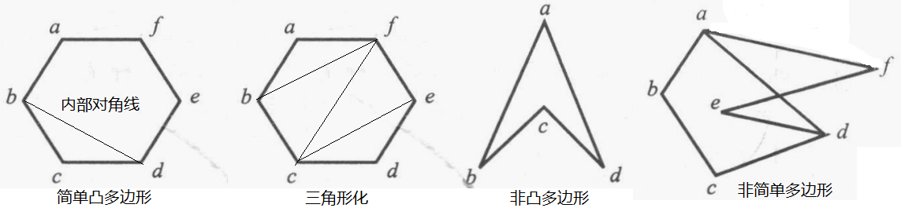

- 概述
  collapsed:: true
	- 研究离散个体和离散结构的数学分支，
	- 连续与离散
	- 计算机科学
	  collapsed:: true
		- 计算机本质上是离散的（即可数的电子元件），因此计算机科学是建立在离散数学基础上的，
		- 离散数学并非一个完整的领域，现有的离散数学课程基本上是建立在计算机科学对离散数学的具体应用上的，
	- 应用
	  collapsed:: true
		- 数理逻辑（数学语言）：形式语言及自动机，程序设计语言
		- 集合论与图论：数据结构，计算机网络，可计算性理论，数据库理论，
		- 布尔代数：逻辑设计与程序理论，
	- 网课
	  collapsed:: true
		- 台湾网课：数理逻辑，集合论（数学归纳法，函数，关系），计数原理（计数，容斥，生成函数），图论（树，最优化）
		- 重庆大学：数理逻辑，集合论（基本结构），计数原理（计数，高级计数），关系，图论（图，树），布尔代数，
		- 北大慕课：数理逻辑，集合论，图论，（抽象代数），（形式语言与自动机）
		- 北大网课：集合论（集合，关系，函数）与图论（图，树），抽象代数（代数系统，群，环，域，格，布尔代数），计数方法（组合计数）
- 离散结构
  collapsed:: true
	- [[数列与级数]]
	- [[映射与函数]]
	- 离散函数
	  collapsed:: true
		- 下取整函数floor
			- 称 $f(n) = \lfloor n \rfloor$ 为下取整函数，为 $R \rightarrow Z$ 上的函数，
			- 下取整为小于等于n的最大整数，如0.5下取整为0，
			- 常用的取整函数 $f(x) = [x]$ 为下取整函数，
		- 上取整函数ceiling
			- 称 $f(n) = \lceil n \rceil$ 为上取整函数，为 $R \rightarrow Z$ 上的函数，
			- 上取整为大于等于n的最小整数，如0.5上取整为1，
		- 阶乘函数factorial
			- 称 $f(n) = n(n-1)(n-2)...2 \cdot 1 = n!$ 为阶乘函数，为 $N \rightarrow N^{+}$ 上的函数，
			- 定义 $f(0) = 0! = 1$ ，
			- 斯特林公式 $\sqrt{2\pi n}\dfrac{{n}^{n}}{{e}^{n}} \approx n!$ 可用来近似阶乘的结果，
	- 矩阵
	  collapsed:: true
		- 基本概念
		  collapsed:: true
			- 由mn个数字按顺序排列成的m行n列的数组称为矩阵，m = n时称矩阵为方阵，
			- 矩阵第i行第j列的元素记为a_{ ij}，
		- 基本运算
		  collapsed:: true
			- 加减，数乘
			- 乘法
			- 幂乘
		- 其他运算
		  collapsed:: true
			- 转置
	- 有限状态机
- [[数理逻辑]]
- [[集合论]]
- [[图论]]
- [[计数原理]]
- 数学归纳法
  collapsed:: true
	- 应用对象：基于*正整数*n的命题P(n)，
	- 第一类
	  collapsed:: true
		- 基础步骤：证明命题P(1)为真，
		- 假设步骤：假设命题P(k)为真，
		- 归纳步骤：证明(P(1) \land P(k)) → P(k + 1)，
	- 第二类
	  collapsed:: true
		- 基础步骤：证明命题P(1)为真，
		- 假设步骤：假设i < k时的*所有*命题P(i)都为真，
		- 归纳步骤：证明命题P(k)为真，
		  collapsed:: true
			- 此处可能会用到P(k)之前的所有命题P(1)，P(2)，…P(i)；也可能只需要部分命题P(i)，P(j)，
	- 基础步骤
	  collapsed:: true
		- 上述定义默认基础步骤为n = 1时的情况，
		- 实际应用时，存在命题对前几个正整数1，2，3…不成立的情况，
		- 如果命题对后续正整数成立，则应将使命题成立的那个正整数作为基础步骤，
	- 推广（归纳载入）
	  collapsed:: true
		- 部分命题无法用数学归纳法证明，
		- 可以尝试用数学归纳法证明带有一些附加条件的原命题，然后再证明原命题，
		- 示例 {:height 120, :width 390}，
	- （证明）
	  collapsed:: true
		- 正整数集N的最小数原理（良序性），
	- （应用：计算几何学）
	  collapsed:: true
		- 定义
		  collapsed:: true
			- 称封闭的图为多边形，若组成多边形的边没有交点，则称该多边形为简单多边形，
			- 若连接多边形任意两个顶点的线段都在该多边形内，则称多边形为凸多边形，
			- 称连接简单多边形的任意两个不相邻顶点的线段为多边形的对角线；
			- 若对角线除了两个顶点外，整个包含在多边形内部，则称该对角线为内部对角线，
			- 称通过不相交的对角线将简单多边形划分为多个三角形的过程为三角形化；简单多边形可能有多种三角形化的方式，
			- 示例
			- {:height 110, :width 410}
		- 定理
		  collapsed:: true
			- 每个简单的至少4条边的多边形都存在一条内部对角线，
			- n条边的简单多边形能够被三角形化为n - 2个三角形(n ≥ 3)（可用第二类数学归纳法证明），
- 递归（Recursive）
	- 递归定义
	  collapsed:: true
		- 包括两个步骤，
		- 基础步骤：定义初始条件P(1)，
		- 递归步骤：定义由P(k)求出P(n)的规则，其中1≤k≤n，
	- 结构归纳法
	  collapsed:: true
		- 基础步骤：证明基础步骤为真，
		- 假设步骤：假设第一次递归得到的命题为真，
		- 归纳步骤：证明后续递归得到的命题也为真，
	- 广义归纳法
	  collapsed:: true
		- 应用对象：基于正整数N的关系集合（N \times N），即数组(m, n)的命题P(m，n)，
		- （证明）
		  collapsed:: true
			- 基于关系集合的字典顺序和良序性，
	- 递归与迭代
		- 递归(Recursion)算法
		  collapsed:: true
			- 一般为由上到下（初始条件），
			- 即根据给定的值，根据递推公式逐个反推前一步，直到初始条件，
			- 对于可以递归定义的序列，递归算法易于实现，也较容易理解；然而，递归算法一般需要的资源更多，即运算效率更低，
		- 迭代(Iteration)算法
		  collapsed:: true
			- 一般为由下（初始条件）到上，
			- 即根据初始条件，根据递推公式逐个求解下一步的取值，
			- 再将下一步的取值当作初始条件，继续计算，直到要求的取值，
			- 迭代算法一般运算效率更高，然而一般需要人为对算法进行分析和推导，相对递归算法而言更难以实现，
		- 示例：Fibonacci数列的计算
		  collapsed:: true
			- 输入：正整数n
			- 递归算法
			  collapsed:: true
				- 由递推公式，f(n) = f(n - 1) + f(n - 2)，
				- 求解f(n - 1)，为f(n - 2) + f(n - 3)，
				- 再求解f(n - 2) …
				- 直到初始条件f(0) = 0，f(1) = 1，
			- 迭代算法
			  collapsed:: true
				- 由初始条件f(0) = 0和f(1) = 1开始，
				- 设变量x = 0，y = 1，
				- for(i = 1 ; i < n - 1; i++)
					- z = x + y;
					  collapsed:: true
						- 将算出来的z当作下一次循环的初始条件 ，继续循环，
					- x = y;
					- y = z;
			- 输出：Fibonacci数列的第n项
-
-
- （数论及其应用）
  collapsed:: true
	- 离散运算
	  collapsed:: true
		- a | b：a整除b，如3 | 9，
		- a \equiv b(mod n)：a和b被n除后的余数相同，如4 \equiv 7(mod 3)，
			- 有时也记为(a - b) \equiv 0(mod n)，即a，b相减后可以被n整除，
		- gcd(a, b)：a和b的最大公*约数*，如gcd(3, 9) = 3，gcd(3, 7) = 1，
		- lcm(a, b)：a和b的最小公倍数，如gcd(3, 9) = 9，gcd(3, 7) = 21，
	- 素数
	- 最大公约数与最小公倍数
	- 同余
	- 密码学
- （计算理论）
  collapsed:: true
	- 形式语言
	- 自动机
	- 正则表达式
	- 计算模型
	- 可计算性理论
	- 复杂性理论
- [[数列]]
- [[概率论]]
- [[计算机组成原理]]
- [[Science]]