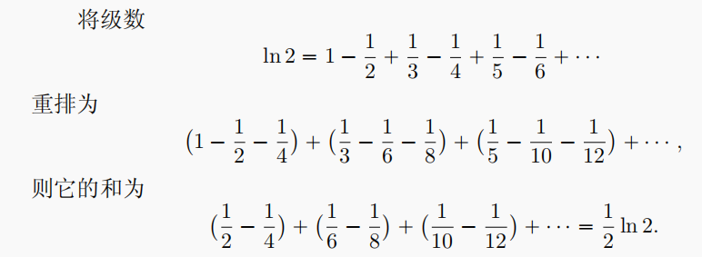
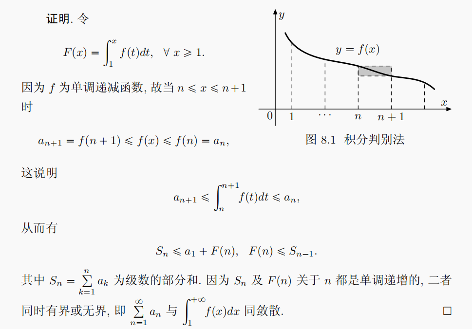
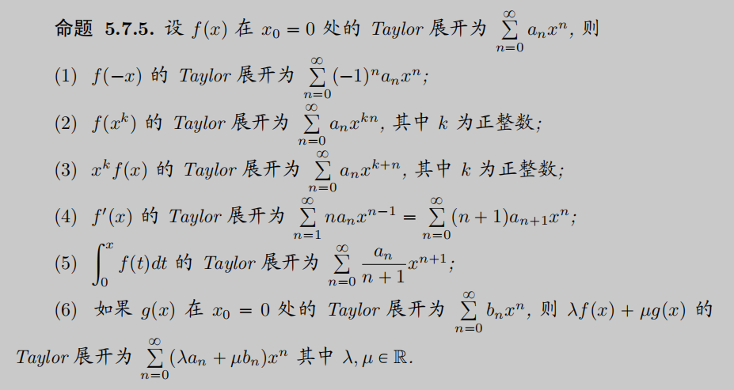
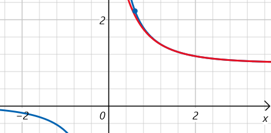
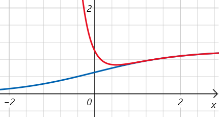
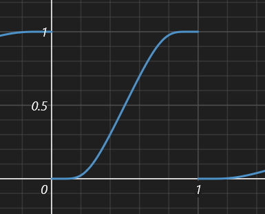

- [[数列与级数]]
- 常数项级数（Series）
	- 定义
	  collapsed:: true
		- 无穷级数
		  collapsed:: true
			- 对于常数数列a_{1}, a_{2},…, a_{n}…，
			- 记无穷和$\sum \limits _{i= 1}^{\infty} a_{i}$ =  a_{1} + a_{2} + … + a_{n} +…为无穷级数，
		- 和数列
		  collapsed:: true
			- 设数列S_{n}的一般项为$S_{k} = \sum \limits _{i= 1}^{n}a_{i} =  a_{1} + a_{2} + … + a_{n}$，为无穷级数的前n项部分和，
			- 称数列S_{n}为无穷级数的和数列，
	- 敛散性
		- 无穷级数收敛的定义
		  collapsed:: true
			- 数列方法：可以通过引入和数列Sn，将级数问题转化为数列问题，并利用数列的理论进行分析，
			- 定义：若和数列S_{n}收敛，且$\lim\limits_{n \to \infty}S_{n} = S$，则称无穷级数$\sum \limits _{i= 1}^{\infty} a_{i}$收敛，且其和为S；反之，若和数列S_{n}没有极限，则称原无穷级数发散，
		- 和数列的敛散性
		  collapsed:: true
			- Cauchy准则：无穷级数$\sum \limits _{i= 1}^{\infty} a_{i}$收敛 \Leftrightarrow 对于和数列S_{n}，有$\lim\limits_{u, v \to \infty} S_{u} - S_{v} = 0$，
		- 收敛的必要条件
		  collapsed:: true
			- 若级数$\sum \limits _{i= 1}^{\infty} a_{i}$收敛，则其一般项$\lim\limits_{n \to \infty}a_{n} = 0$，
			  collapsed:: true
				- 可由和数列的柯西收敛准则证明，即$\lim\limits_{n \to \infty} S_{n+1} - S_{n} = a_{n} = 0$，
			- 任意收敛级数（正项、交错、条件）都满足收敛的必要条件，
		- 收敛级数的运算
		  collapsed:: true
			- 代数运算
			  collapsed:: true
				- 若无穷级数$\sum \limits _{i= 1}^{\infty} a_{i}$，$\sum \limits _{i= 1}^{\infty} b_{i}$均收敛，
				- 则对任意*常数*k，$\sum \limits _{i= 1}^{\infty} ka_{i}$收敛，
				- 级数的和（差）$\sum \limits _{i= 1}^{\infty} a_{i} \pm b_{i}$收敛，
				- 若*正项级数*$\sum \limits _{i= 1}^{\infty} a_{i}$收敛，则$\sum \limits _{i= 1}^{\infty} a^{2}_{i}$也收敛，
				- 若$\sum \limits _{i= 1}^{\infty} a_{i}$收敛，则$\sum \limits _{i= 1}^{\infty} \dfrac {{n+1}}{{n}}a_{i}$也收敛，
			- 《《级数的拆分
			  collapsed:: true
				- 改变有限项
				  collapsed:: true
					- 不改变原级数的一般项的位置，在级数中加入、删除或改变有限项，
					- 级数的敛散性不变，但级数的和可能改变（如改变的为前有限项），
				- 子级数
				  collapsed:: true
					- 原级数的部分特殊指标的一般项组成的新级数，即(a1 + a3 + a5 + … ) ，或(a2 + a4 + a6 + …)，
					- 若级数的“所有”子级数（如\sum a_{2n},\sum a_{2n+1} ; \sum a_{3n}, \sum a_{3n+1}, \sum a_{3n+2}）都收敛，则原级数收敛；反之不成立（如交错调和级数），
					- 对于任意项级数，原级数的收敛性与子级数的收敛性没有明确关系，
				- 括号级数
				  collapsed:: true
					- 不调换正项级数的*求和顺序*，在级数中加括号，即(a1 + a2 +…) + (ak + ak+1 +…) + …
					- 级数的敛散性可能会变化；
					- 收敛级数仍会收敛，且其和不变；
					- 但发散级数可能也会收敛，即无穷级数求和*不满足加法的分配律*，
				- 级数重排
				  collapsed:: true
					- 调换正项级数的*求和顺序*，在级数中加括号，
					- 若正项级数（或绝对收敛级数）收敛，则所得到的新级数仍收敛，
					- （Riemann）若级数条件收敛，则调换其求和顺序，所得到的新级数的收敛性可能改变，或收敛于不同的值；即无穷级数的求和*不满足加法的交换律*，
					  collapsed:: true
						- 示例： 
				- 一般项运算
				  collapsed:: true
					- 即对原数列的一般项进行拆分，即\sum a_{n} = a1 + a2 +… = (b1 + c1) + (b2 + c2) +… = (b1 + b2+ …) + (c1 + c2 +…) = \sum b_{n} + \sum c_{n}，
					- 得到的级数与原级数的敛散性关系较复杂，
					- 级数的“所有”拆分级数都收敛可以说明原级数收敛；
					- 反之，原级数收敛不能说明运算得到的级数的收敛性，
	- 敛散性的判断
		- 正项级数
		  collapsed:: true
			- 定义：一般项u_{n} \ge 0的无穷级数；
			- 性质
			  collapsed:: true
				- 正项级数的和数列必有下界0，且一定单调不减，
				- （正项级数的一般项可以为0），
			- 敛散性的判别
			  collapsed:: true
				- 以下判别法*只能*用于正项级数，
				- 和数列：正项级数的和数列S_{n}有上界  \Leftrightarrow 正项级数$\sum \limits _{i= 1}^{\infty} a_{i}$收敛，
				  collapsed:: true
					- 可由和数列收敛的单调有界准则得到，
				- 比较审敛法
				  collapsed:: true
					- 若存在常数M > 0，使得n充分大时，*一般项*a_{n} \le Mb_{n}，
					- 则$\sum \limits _{i= 1}^{\infty} b_{i}$收敛时，$\sum \limits _{i= 1}^{\infty} a_{i}$也收敛，
					- $\sum \limits _{i= 1}^{\infty} a_{i}$发散时，$\sum \limits _{i= 1}^{\infty} b_{i}$也发散，
					- 应用
					  collapsed:: true
						- 一般取级数$\sum \limits _{i= 1}^{\infty} b_{i}$为P级数，
						- 不等式放缩
						- 已知敛散性的级数
				- 比较法极限形式（等价无穷小）
				  collapsed:: true
					- 若*一般项*a_{n}，b_{n}为同阶无穷小（即 $\lim\limits_{n \to +\infty} \dfrac{a_{n}}{b_{n}} = k$ ），则$\sum \limits _{i= 1}^{\infty} a_{i}$和$\sum \limits _{i= 1}^{\infty} b_{i}$同敛散（充分条件），
					  collapsed:: true
						- 反之，$\sum \limits _{i= 1}^{\infty} a_{i}$和$\sum \limits _{i= 1}^{\infty} b_{i}$同敛散，*不能说明*a_{n}，b_{n}一定为同阶无穷小（即极限$\lim\limits_{n \to +\infty} \dfrac{a_{n}}{b_{n}}$存在），
						- 如$\sum \limits _{i= 1}^{\infty} \dfrac{1}{n}$和$\sum \limits _{i= 1}^{\infty} \dfrac{1}{n\ln^{\alpha} n}$，
					- 若一般项a_{n}为b_{n}的高阶无穷小（即 $\lim\limits_{n \to +\infty} \dfrac{a_{n}}{b_{n}} = 0$ ），则$\sum \limits _{i= 1}^{\infty} b_{i}$收敛时，$\sum \limits _{i= 1}^{\infty} a_{i}$也收敛，
					- 若一般项a_{n}为b_{n}的低阶无穷小（即 $\lim\limits_{n \to +\infty} \dfrac{a_{n}}{b_{n}} = \infty$ ），则$\sum \limits _{i= 1}^{\infty} b_{i}$发散时，$\sum \limits _{i= 1}^{\infty} a_{i}$也发散，
				- 单调性判别
				  collapsed:: true
					- 在难以求得极限时，可以通过单调性判断一般项a_{n}，b_{n}的关系，
					- 若$\dfrac{a_{n + 1}}{a_{n}} \le \dfrac{b_{n + 1}}{b_{n}}$，则$\sum \limits _{i= 1}^{\infty} a_{i}$和$\sum \limits _{i= 1}^{\infty} b_{i}$同敛散，
					- 证明
					  collapsed:: true
						- $\dfrac{a_{n + 1}}{a_{n}} \le \dfrac{b_{n + 1}}{b_{n}}$，即$\dfrac{a_{n + 1}}{b_{n + 1}} \le \dfrac{a_{n}}{b_{n}}$，
						- 则可知数列$\dfrac{a_{i}}{b_{i}}$单调递减，
						- 由于a_{n}，b_{n}均为正项级数，所以数列$\dfrac{a_{i}}{b_{i}}$必有下界0，
						- 所以由单调有界准则，可知数列$\dfrac{a_{i}}{b_{i}}$收敛，即存在常数k使$\lim\limits_{n \to +\infty} \dfrac{a_{n}}{b_{n}} = k$，
						- 因此$\sum \limits _{i= 1}^{\infty} b_{i}$和$\sum \limits _{i= 1}^{\infty} a_{i}$同敛散，
					- （推论）
					  collapsed:: true
						- 若取b_{n}为等比级数，则可得比值审敛法，
				- 具体级数的判定（仅用于正项级数）
				  collapsed:: true
					- 比值，根值审敛法
					  collapsed:: true
						- （基于几何级数的收敛性）
						- 若$\lim\limits_{n \to \infty} \dfrac {a_{n+1}}{a_{n}} =\rho$，
						- 或$\lim\limits_{n \to \infty} \sqrt[n] {a_n} =\rho$，
						- 则$\sum\limits_{n=1}^{\infty} a_n \begin{cases}  \rho < 1 & 收敛 \\ \rho > 1 & 发散 \\ \rho = 1 & 不能判断 \end{cases}$，
					- 积分审敛法
					  collapsed:: true
						- 若对所有$n\in N^{+}$，都有a_{n} = f(n)，且f(x)在 [1, +\infty)单调减且非负，
						- 则$\sum\limits_{n=1}^{\infty} a_n$与$\int _{1}^{+\infty} f(x)dx$同敛散，
						- 证明（积分上限函数）
						  collapsed:: true
							- {:height 230, :width 320}，
				- （其他判别法）
				  collapsed:: true
					- Kummer判别法
					  collapsed:: true
						- 若$\dfrac{1}{b_{n}} \cdot \dfrac{a_{n}}{a_{n + 1}} - \dfrac{1}{b_{n + 1}} \ge \lambda > 0$，则$\sum \limits _{i= 1}^{\infty} a_{i}$收敛，
						  collapsed:: true
							- （证明：单调性判别，和数列的有界性）
						- 若$\dfrac{1}{b_{n}} \cdot \dfrac{a_{n}}{a_{n + 1}} - \dfrac{1}{b_{n + 1}} \le 0$，则$\sum \limits _{i= 1}^{\infty} b_{i}$发散时，$\sum \limits _{i= 1}^{\infty} a_{i}$也发散，
					- Rabee判别法
					  collapsed:: true
						- 若$n \cdot (\dfrac{a_{n}}{a_{n + 1}} - 1) \ge \lambda > 1$，则$\sum \limits _{i= 1}^{\infty} a_{i}$收敛，
						- 若$n \cdot (\dfrac{a_{n}}{a_{n + 1}} - 1) \le 1$，则$\sum \limits _{i= 1}^{\infty} a_{i}$发散，
						- 在Kummer判别法取b_{n} = 1/n即可得到，
						- （对于极限形式，比值等于1时无法判别），
					- Cauchy凝聚判别法
					  collapsed:: true
						- 设a_{n}单调递减且趋于零，
						- 则$\sum \limits _{i= 1}^{\infty} a_{i}$收敛 \Leftrightarrow $\sum \limits _{k = 0}^{\infty} 2^{k}a_{2^{k}}$收敛，
		- 交错级数
		  collapsed:: true
			- 定义（标准型）：$\sum\limits_{n=1}^{\infty} (-1) ^n a_n，a_n \ge 0$，
			- 敛散性的判别
			  collapsed:: true
				- 和数列
				  collapsed:: true
					- 为了便于讨论，可以先将数列拆分为单调增和单调减的两个和数列，
					- 设和数列$S_{2n} =  a_{1} - a_{2} + a_{3} - a_{4} … + a_{2n - 1} - a_{2n}$，
					- 所以S_{2(n+1)} -S_{2n} = a_{2n + 1} - a_{2n + 2}，
					- 可将数列改写为$S_{2n} =  a_{1} - (a_{2} - a_{3}) - (a_{4} - a_{5}) … + (a_{2n - 2} - a_{2n - 1}) - a_{2n}$，
					- 可见，若a_{n}单调递减，则和数列S_{2n}单调递增，且有上界a_{1}，
					- 因此有单调有界准则，可知和数列S_{2n}收敛，
					- 同理可说明和数列S_{2n-1}收敛，
				- Leibniz 定理（充分条件）
				  collapsed:: true
					- 对于交错级数$\sum\limits_{n=1}^{\infty} (-1) ^n a_n$，若a_{n}单调递减，且一般项$\lim\limits_{n \to \infty}a_{n} = 0$，则级数收敛，
					- 分段级数可能无法满足单调性的要求，可用于特殊值的构造，
		- 任意项级数（绝对收敛与条件收敛）
		  collapsed:: true
			- 定义
			  collapsed:: true
				- 绝对收敛：若\sum|a_{n}|收敛，则称\sum a_{n}绝对收敛，
				- 条件收敛：若\sum a_{n}收敛，但\sum|a_{n}|发散，则称\sum a_{n}条件收敛，
			- 敛散性的判别
			  collapsed:: true
				- 转换为正项级数
				  collapsed:: true
					- 定理：绝对收敛的级数一定收敛，
					  collapsed:: true
						- 证明：和数列，Cauchy收敛准则，绝对值不等式，
					- 因此一般先判断是否为绝对收敛，即先将任意项级数转化为正项级数，
				- 夹逼准则
				  collapsed:: true
					- 若n充分大时，*一般项*a_{n} \le b_{n} \le c_{n}，
					- 则$\sum \limits _{i= 1}^{\infty} a_{i}$和$\sum \limits _{i= 1}^{\infty} c_{i}$均收敛时，$\sum \limits _{i= 1}^{\infty} b_{i}$也收敛，
					- 由于正项级数必有下界0，所以比较审敛法不需要下界；但一般项级数需要有下界，
				- 拆分为两个正项级数
				  collapsed:: true
					- 设$a_{n}^{\pm} = \dfrac{|a_{n}| \pm a_{n}}{2}$，
					- $a_{n}^{+} = \begin{cases}  a_{n} & a_{n} > 0  \\ 0 & a_{n} < 0\end{cases}$，$a_{n}^{-} = \begin{cases} 0 & a_{n} > 0  \\  -a_{n} & a_{n} < 0\end{cases}$，
					- 则$\sum \limits _{i= 1}^{\infty} a_{i}^{+}$，$\sum \limits _{i= 1}^{\infty} a_{i}^{-}$均为正项级数，且$a_{n}^{+} + a_{n}^{-} = |a_{n}|，a_{n}^{+} - a_{n}^{-} = a_{n}$，
					- 定理（绝对收敛与条件收敛）
					  collapsed:: true
						- 若$\sum \limits _{i= 1}^{\infty} a_{i}$绝对收敛，则$\sum \limits _{i= 1}^{\infty} a_{i}^{+}$和$\sum \limits _{i= 1}^{\infty} a_{i}^{-}$都收敛，
						- 若$\sum \limits _{i= 1}^{\infty} a_{i}$条件收敛，则$\sum \limits _{i= 1}^{\infty} a_{i}^{+}$和$\sum \limits _{i= 1}^{\infty} a_{i}^{-}$都发散（反证法），
				- （乘积数列的收敛性）
				  collapsed:: true
					- Dirichlet定理：设数列{a_{n}}单调且*趋于 0*，级数$\sum\limits_{i = 1}^{n}b_{i}$的部分和*有界*，则级数$\sum\limits_{i = 1}^{\infty}a_{i}b_{i}$收敛，
					  collapsed:: true
						- 对于交错级数$\sum\limits_{i = 1}^{\infty}(-1)^{n}\dfrac{1}{n}$，
						- 数列$\frac{1}{n}$单调且趋于0，级数$\sum\limits_{i = 1}^{\infty}(-1)^{n}$的部分和有界，
						- 所以由Dirichlet定理，交错级数$\sum\limits_{i = 1}^{\infty}(-1)^{n}\dfrac{1}{n}$收敛，
					- Abel定理：设数列{a_{n}}为单调*有界*数列，级数$\sum\limits_{i = 1}^{n}b_{i}$*收敛*，则级数$\sum\limits_{i = 1}^{\infty}a_{i}b_{i}$收敛，
					  collapsed:: true
						- 若级数$\sum\limits_{n = 1}^{\infty}na_{n}$收敛，
						  id:: 63042bde-d3af-4917-bfaa-f71f48348c68
						- 则由于数列$\frac{1}{n}$为单调有界数列，
						- 所以级数$\sum\limits_{i = 1}^{\infty}\dfrac{1}{n} (na_{n}) = \sum\limits_{i = 1}^{\infty}a_{n}$收敛，
					- 推论：设数列{a_{n}}为*有界*数列，级数$\sum\limits_{i = 1}^{n}b_{i}$*绝对收敛*，则级数$\sum\limits_{i = 1}^{\infty}a_{i}b_{i}$绝对收敛，
					- 推论：设数列{a_{n}}收敛于a，正项级数$\sum\limits_{i = 1}^{n}b_{i}$发散，则$\lim\limits_{n \to \infty}\dfrac{\sum\limits_{i = 1}^{n}b_{i}a_{i}}{\sum\limits_{i = 1}^{n}b_{i}} = a$，
	- 敛散性问题求解
		- 分析级数类型
			- 具体、抽象；正项、交错、任意项；含参数、不含参数，
			- 可以写出级数的前几项以辅助分析，
			- 应注意很多判别法都*只适用于正项*级数；应分析级数是否为正项，也可尝试构造正项级数，
		- 构造新的级数
			- 可以尝试根据给出的等式构造新的级数，
			- 如通过拆分为子级数，级数的运算等，
		- 数列方法
			- 分析和数列的性质，
			- 递推关系数列，数学归纳法，
		- 级数方法
			- 正项、交错、任意项，
			- 不等式放缩
				- $\sum\limits_{n = 1}^{2^{n}} {\dfrac{1}{n}} \geq 1 + \dfrac{n}{2}$，
					- 可用数学归纳法证明，
		- 技巧
		  collapsed:: true
			- 对于含参数的（具体）级数，一般先讨论系数a_{n}；可以先用比值/根值法辅助分析，
			- 对于有界数列，应注意0也为有界量；因此$\frac{1}{a_{n}}$可能无界，而$a_{n} \cdot \infty$可能有界，
			- 放缩时应注意级数的正负，负数数值变大时绝对值变小，
			- 对于由特殊函数构成的一般项a_{n}，应考虑函数方法，如中值定理、函数的单调性/有界性等，
			- 级数放缩时同样应注意函数的有界性，
			- 若交错级数u_{n}条件收敛，则其子级数u_{2n + 1}和u_{2n - 1}均发散（反证法），
			- 条件收敛级数的正项、负项构成的子级数发散，
	- 《《常见级数的敛散性
		- p级数的收敛性
		  collapsed:: true
			- $\sum \limits_{n = 1}^{+\infty} \dfrac{1}{n^{p}}  = \begin{cases}  收敛 & p > 1 \\发散 & p \le 1 \end{cases}$，
		- $\sum \limits _{n=1}^{\infty} \dfrac {1}{n}$发散，
		  collapsed:: true
			- 交错：$\sum \limits _{n=1}^{\infty} (-1)^{n}\dfrac {1}{{n}}$收敛，
			- a_{n}^{2}：$\sum \limits _{n=1}^{\infty} (-1)^{n}\dfrac {1}{\sqrt{n}}$收敛，$\sum \limits _{n=1}^{\infty} \dfrac {1}{\sqrt{n}}$发散，
			- a_{n}^{k}：$\sum \limits _{n=1}^{\infty} (-1)^{n}\dfrac {1}{{n}^{k}}$发散，0 < k < 1，
			- -a_{n}：$\sum \limits _{n=1}^{\infty} -\dfrac {1}{n}$发散，但单调递增且有上界，
			- ka_{n}：$\sum \limits _{n=1}^{\infty} \dfrac {k}{n}$，$\sum \limits _{n=1}^{\infty} \dfrac {1}{kn}$发散，
			- k + a_{n}：$\sum \limits _{n=1}^{\infty} \dfrac {1}{n} + k$发散，
			- < a_{n}：$\sum \limits _{n=1}^{\infty} \dfrac {1}{n\ln n}$发散，
			- \> a_{n}：$\sum \limits _{n=1}^{\infty} \dfrac {1}{\ln n}$发散，
			- 
		- 分段级数，括号级数
		  collapsed:: true
			- $\sum \limits _{n=1}^{\infty} {(-1)}^{n}$发散，
	- 收敛级数求和
	  collapsed:: true
		- 错项相减
		- 利用幂级数求常数项级数的和
		  collapsed:: true
			- 应注意灵活选择自变量x，最好使级数的形式较为简单，
		- （分部求和公式）
		  collapsed:: true
			- $\sum\limits_{k = m}^{n - 1}a_{k + 1}(b_{k + 1} - b_{k}) + \sum\limits_{k = m}^{n - 1}b_{k + 1}(a_{k + 1} - a_{k}) = a_{n}b_{n} - a_{m}b_{m}$ ，
			  collapsed:: true
				- 取m = 0，a_{ 0} = 0，
				- 则公式为a_{ 1}(b_{ 1} - b_{ 0}) + a_{ 2}(b_{ 2} - b_{ 1}) + a_{ 3}(b_{ 3} - b_{ 2}) + … +b_{ 1}(a_{ 1} - a_{ 0}) + b_{ 2}(a_{ 2} - a_{ 1}) + b_{ 3}(a_{ 3} - a_{ 2}) + …= a_{ n}b_{ n}，
			- Abel引理
			  collapsed:: true
				- Abel变换： $\sum\limits_{i = m + 1}^{n}a_{i}b_{i} = \sum\limits_{i = m + 1}^{n - 1}(a_{i} - a_{i - 1})\sum\limits_{k = 1}^{i}b_{k} + a_{n}\sum\limits_{k = 1}^{n}b_{k} - a_{m + 1}\sum\limits_{k = 1}^{m}b_{k}$ ，
				- 若{a_{ i}}为单调数列，且 $\sum\limits_{k = 1}^{i}b_{k} \le M$ ，
				- 则 $|\sum\limits_{i = m + 1}^{n}a_{i}b_{i}| \le 2M(|a_{n}| + |a_{m + 1}|), \forall M \ge 0$ ，
	- 《《常见常数项级数的和
	  collapsed:: true
		- 算术级数（等差数列）
		- 几何级数（等比数列）
		- $\dfrac{\pi}{4} = 1 - \frac{1}{3} + \frac{1}{5} - \frac{1}{7} + ... + {(-1)}^{n}\frac{1}{2n - 1} = \sum\limits_{n = 0}^{+\infty} {(-1)}^{n}{\frac{x^{2n + 1}}{2n + 1}}|_{x = 1} = \arctan(1)$
		- $\ln 2 = 1 - \frac{1}{2} + \frac{1}{3} - \frac{1}{4} + ... + {(-1)}^{n}\frac{1}{n} = \sum\limits_{n = 1}^{+\infty} {(-1)}^{n + 1}{\frac{x^{n}}{n}}|_{x = 1}$，
		- $1 = 1 - \frac{1}{2} + \frac{1}{2} - \frac{1}{3} + ... + \frac{1}{n} - \frac{1}{n + 1} = \sum\limits_{n = 1}^{+\infty} {\frac{1}{n(n + 1)}}$，
		- ${\text e} = 1 + \frac{1}{1!} + \frac{1}{{2!}} +\frac{1}{{3!}} +...+ \frac{1}{{n!}} = \sum\limits_{n = 0}^{+\infty} \frac{x^{n}}{n!}|_{x = 1}$，
		- $\gamma(0.5772…) = 1 + \frac{1}{{2}} +\frac{1}{{3}} +\frac{1}{{4}} +...+ \frac{1}{{n}} - \ln (n + 1)= \sum\limits_{n = 1}^{+\infty} \dfrac{1}{n} - \ln (n + 1) = -\int_{0}^{+\infty}e^{-t}\ln tdt$，
		  collapsed:: true
			- 即$1 + \frac{1}{{2}} +\frac{1}{{3}} +\frac{1}{{4}} +...+ \frac{1}{{n}} \approx \ln (n + 1) + \gamma$，
		- $\dfrac{{\pi}^{2}}{6} = 1 + \frac{1}{{2}^{2}} +\frac{1}{{3}^{2}} +\frac{1}{{4}^{2}} +...+ \frac{1}{{n}^{2}}$
		  collapsed:: true
			- $\frac{{\pi}^{2}}{24} = \frac{1}{{2}^{2}} +\frac{1}{{4}^{2}} +\frac{1}{{6}^{2}} +...+ \frac{1}{{(2n)}^{2}} = (1 + \frac{1}{{2}^{2}} +\frac{1}{{3}^{2}} +\frac{1}{{4}^{2}} +...+ \frac{1}{{n}^{2}})\frac{1}{4}$
			- $\frac{{\pi}^{2}}{8} = 1 + \frac{1}{{3}^{2}} +\frac{1}{{5}^{2}} +\frac{1}{{7}^{2}} +...+ \frac{1}{{(2n-1)}^{2}} = \frac{{\pi}^{2}}{6} - \frac{{\pi}^{2}}{24}$
	- （调和级数的发散性）
	  collapsed:: true
		- 不等式放缩：利用$\frac{1}{3} > \frac{1}{4}$，$\frac{1}{5}, \frac{1}{6}, \frac{1}{7} > \frac{1}{8}$，将调和级数拆分为多个$\frac{1}{2}$的分段，
		- 和数列的Cauchy极限准则：$\lim\limits_{n \to \infty} S_{2n} - S_{n} \ne 0$，
- 推广：无穷乘积
	- 级数的Cauchy乘积
		- 定义
		  collapsed:: true
			- 级数$(\sum\limits_{n = 0}^{\infty} a_{n}) \cdot (\sum\limits_{n = 0}^{\infty} b_{n}) = \sum\limits_{n = 0}^{\infty} c_{n}$，其中$c_{k} = \sum\limits_{i = 0}^{i + j = k} a_{i} \cdot b_{j}$，
			- 即$\sum\limits_{k = 0}^{\infty}(\sum\limits_{i = 0}^{i + j = k} a_{i} \cdot b_{j}) = a_{0}b_{0} + (a_{0}b_{1} + a_{1}b_{0}) + (a_{0}b_{2} + a_{1}b_{1} + a_{2}b_{0}) + \cdots$，
		- 定理
		  collapsed:: true
			- Cauchy：若$\sum \limits _{i= 1}^{\infty} a_{i}$和$\sum \limits _{i= 1}^{\infty} b_{i}$均*绝对收敛*；则其乘积$\sum \limits _{i= 1}^{\infty} c_{i}$也*绝对收敛*，且$\sum\limits_{n = 0}^{\infty} c_{n} = (\sum\limits_{n = 0}^{\infty} a_{n}) \cdot (\sum\limits_{n = 0}^{\infty} b_{n})$，
			- Mertens：若$\sum \limits _{i= 1}^{\infty} a_{i}$和$\sum \limits _{i= 1}^{\infty} b_{i}$均*收敛*，且至少有一个*绝对收敛*；则其乘积$\sum \limits _{i= 1}^{\infty} c_{i}$也*收敛*，且$\sum\limits_{n = 0}^{\infty} c_{n} = (\sum\limits_{n = 0}^{\infty} a_{n}) \cdot (\sum\limits_{n = 0}^{\infty} b_{n})$，
			- Abel：若$\sum \limits _{i= 1}^{\infty} a_{i}$和$\sum \limits _{i= 1}^{\infty} b_{i}$均*收敛*，且其乘积$\sum \limits _{i= 1}^{\infty} c_{i}$也*收敛*；则有$\sum\limits_{n = 0}^{\infty} c_{n} = (\sum\limits_{n = 0}^{\infty} a_{n}) \cdot (\sum\limits_{n = 0}^{\infty} b_{n})$，
	- 无穷乘积
		- 定义
		  collapsed:: true
			- 对于常数数列p_{1}, p_{2},…, p_{n}…(p_{i} \ne 0)，
			- 记$\prod \limits _{i= 1}^{\infty} p_{i}$ =  p_{1} \cdot p_{2} \cdot … \cdot p_{n} \cdot…为无穷乘积，
		- 敛散性
		  collapsed:: true
			- 类似无穷级数，记部分积P_{n}的一般项为$P_{k} = \prod \limits _{i= 1}^{k}p_{i} =  p_{1} \cdot p_{2} \cdot … \cdot p_{k}$，为无穷乘积的前n项部分积，
			- 若部分积数列P_{n}收敛，且$\lim\limits_{n \to \infty}P_{n} = P$，则称无穷乘积$\prod \limits _{i= 1}^{\infty} p_{i}$收敛，且其积为P；反之，若数列P_{n}没有极限，则称原无穷乘积发散，
		- 敛散性的判断
		  collapsed:: true
			- 积数列的敛散性
			  collapsed:: true
				- Cauchy准则：无穷乘积$\prod \limits _{i= 1}^{\infty} p_{i}$收敛 \Leftrightarrow 对于积数列P_{n}，有$\lim\limits_{u, v \to \infty} P_{u} - P_{v} = 0$，
			- 收敛的必要条件
			  collapsed:: true
				- 若级数$\prod \limits _{i= 1}^{\infty} p_{i}$收敛，则其一般项$\lim\limits_{n \to \infty}p_{n} = 1$，
				  collapsed:: true
					- 由柯西收敛准则，有$\lim\limits_{n \to \infty} P_{n+1} - P_{n} = P_{n}(p_{(n + 1)} - 1) = 0$，
		- 转换为级数
		  collapsed:: true
			- 由收敛的必要条件，可对无穷乘积两侧取对数，转化为无穷级数的求和，
			- 即$\ln(\prod \limits _{i= 1}^{k}p_{i}) =  \sum \limits _{i= 1}^{k}\ln p_{i}$，
			- 可知无穷乘积$\prod \limits _{i= 1}^{\infty} p_{i}$收敛 \Leftrightarrow 无穷级数$\sum \limits _{i= 1}^{k}\ln p_{i}$收敛，
		- 定理
		  collapsed:: true
			- 无穷乘积$\prod \limits _{i= 1}^{\infty} p_{i}$收敛 \Leftrightarrow 无穷级数$\sum \limits _{i= 1}^{k}(p_{i} - 1)$收敛；其中n充分大时有(p_{i} - 1) > 0(< 0)，
			  collapsed:: true
				- 设p_{k} = 1 + a_{k}，由等价无穷小$\lim\limits_{n \to \infty} \dfrac{\ln(1 + a_{n})}{a_{n}} = 1$和正项级数的比较判别法可证明，
			- 若无穷级数$\sum \limits _{i= 1}^{\infty}a_{i}$和$\sum \limits _{i= 1}^{\infty}a^{2}_{i}$均收敛，则无穷乘积$\prod \limits _{i= 1}^{\infty} (1 + a_{i})$收敛，
	- 常见常数项无穷乘积的积
	  collapsed:: true
		- $\prod \limits _{n = 2}^{\infty} (1 - \frac{1}{n^{2}}) = \frac{1}{2}$
		- $\prod \limits _{n = 1}^{\infty} (1 - \frac{1}{{(2n)}^{2}}) = \frac{2}{\pi}$
		- $\prod \limits _{n = 1}^{\infty} (1 - \frac{1}{{(2n + 1)}^{2}}) = \frac{\pi}{4}$
- 函数项级数（Power Series）
	- （函数列的收敛性）
	  collapsed:: true
		- 定义
		  collapsed:: true
			- 设{g_{n}(x)}为定义在区间I上的“一列”函数（可以理解为每个函数g_{i}(x)的具体表达式都依赖于参数i），
			- 若存在同样定义在I上的函数g(x)，使得\forall x_{0} \in I，总有$\lim\limits_{n \to \infty}{g_{n}(x)} = g(x)$
			- 则称函数列{g_{n}(x)}在区间I上收敛于函数g(x)，
		- 一致收敛性
		  collapsed:: true
			- \forall \epsilon > 0，\exist N(\epsilon) \in N+，
			- 在n > N时，\forall x_{0} \in I，总有|g_{n}(x) - g(x)| < \epsilon，
			- 则称函数列{g_{n}(x)}在区间I上一致收敛于函数g(x)，
		- 一致收敛性定理
		  collapsed:: true
			- 定义推论
			  collapsed:: true
				- 若\forall x_{0} \in I，$\lim\limits_{n \to \infty} \sup|g_{n}(x) - g(x)| = 0$，
				- 则函数列{g_{n}(x)}在区间I上一致收敛于函数g(x)，
			- 定理（Dini）
			  collapsed:: true
				- 类似单调有界准则，
				- 设函数列{f_{n}(x)}在区间I上为非负连续函数，且关于n单调递减（即f_{n}(x) \ge f_{n+1}(x)），
				- 若函数f(x)在区间I上连续，且\forall x_{0} \in I，总有$\lim\limits_{n \to \infty}{f_{n}(x)} = f(x)$，
				- 则函数列{f_{n}(x)}在区间I上一致收敛于函数f(x)，
			- Cauchy准则
			  collapsed:: true
				- \forall \epsilon > 0，\exist N(\epsilon) \in N+，
				- 在m，n > N时，\forall x_{0} \in I，总有sup |g_{n}(x) - g_{m}(x)| < \epsilon，
			- 推论（Weierstrass）
			  collapsed:: true
				- 如果|g_{n}(x)| \le M_{n}，则正项级数$\sum \limits _{i= 1}^{\infty} M_{i}$ 收敛时，函数项级数 $\sum \limits _{i= 1}^{\infty} g_{n}(x)$一致收敛，
				- 可由Cauchy准则证明，
		- 乘积的一致收敛性定理
		  collapsed:: true
			- （类似级数的收敛性定理）
			- Dirichlet：设\forall x \in I，函数列{a_{i}(x)}关于i单调且*趋于 0*，级数$\sum\limits_{i = 1}^{n}b_{i}(x)$的部分和*一致有界*，则级数$\sum\limits_{i = 1}^{\infty}a_{i}(x)b_{i}(x)$一致收敛，
			- Abel：设\forall x \in I，函数列{a_{i}(x)}关于i单调且*一致有界*，级数$\sum\limits_{i = 1}^{n}b_{i}(x)$在I中*一致收敛*，则级数$\sum\limits_{i = 1}^{\infty}a_{i}(x)b_{i}(x)$一致收敛，
		- 一致收敛函数列的性质
		  collapsed:: true
			- 引入
			  collapsed:: true
				- 对有限情况，函数列的解析性质（连续性，可导性，可积性）在求和情况下不会发生改变（微积分的线性性），
				- 然而在无限情况，函数列的解析性质会发生变化，如积分，求导和求和交换后，得到的结果可能不同于原结果，
				- 示例：对于$f_{n}(x) = 2n^{2}e^{-n^{2}x^{2}}$，x = 0时积分与求和不可交换，
				- 因此引入了“一致”收敛性，以分析无限情况下函数列的性质，
			- 收敛性
			  collapsed:: true
				- 设{g_{n}(x)}为非负连续函数，如果函数项级数$\sum\limits_{n=1}^{\infty} g_{n}(x)$在闭区间中收敛于连续函数g，则必一致收敛于g，
			- 连续性
			  collapsed:: true
				- 若{g_{n}(x)}均为区间I上的连续函数，则 g 也是区间I上的连续函数，
				- 若$\lim\limits_{x \to x_{0}}{g_{n}(x)} = a_{n}$，则求极限次序可交换，即$\lim\limits_{x \to x_{0}}\lim\limits_{n \to \infty}{g_{n}(x)} = \lim\limits_{n \to \infty}\lim\limits_{x \to x_{0}}{g_{n}(x)}$，
			- 求和与求导，积分的“可交换性”
			  collapsed:: true
				- 若g_{n}均为区间I上的连续函数，则g也是可积函数，且$\int_{a}^{b}[\sum\limits_{n=1}^{\infty}g_{n}(x)]dx=\sum\limits_{n=1}^{\infty} \int_{a}^{b}g_{n}(x)dx =  \int_{a}^{b}g(x)dx$，
				- 若g_{n}在区间I上均有*连续的导函数*，则g也是可导函数，且$[\sum\limits_{n=1}^{\infty}g_{n}(x)]'= \sum\limits_{n=1}^{\infty} g'_{n}(x) = g'(x)$，
				- 即函数项级数可以*逐项*积分和求导，且得到的新级数仍收敛于原来的和函数的原函数和导函数，
	- 定义
	  collapsed:: true
		- 标准型：$\sum\limits_{n=0}^{\infty} a_nx^n / a_n(x-x_0)^n$，
		- 一般讨论$\sum\limits_{n=0}^{\infty} a_{n} x^{n}$的情况，$\sum\limits_{n=0}^{\infty} a_{n} (x - x_{0})^{n}$的情况可通过变量代换u = x - x_{0}计算，
		- 幂级数是函数列的一种特殊形式，
	- 敛散性
		- 幂级数的和函数
		  collapsed:: true
			- 设定义在区间Ｉ上的函数列f_{n}(x)的一般项为$f_{k}(x)= \sum \limits _{i= 1}^{k}a_{i}x^{i} =  a_{0} + a_{1}x + … + a_{k}x^{k}$，为幂级数的前k项部分和，
			- 若\forall x_{0} \in I，函数列f_{n}(x)收敛，且$\lim\limits_{n \to \infty}f_{n}(x) = f(x)$，则称无穷幂级数$\sum \limits _{i= 1}^{\infty} f_{n}(x)$收敛，且其和函数为f(x)；
			- 反之则称原无穷幂级数发散，
		- 幂级数（在收敛区间内）的性质
		  collapsed:: true
			- 前提
			  collapsed:: true
				- 可以证明，幂级数在收敛区间内一致收敛，
			- 连续性
			  collapsed:: true
				- 幂级数的和函数在收敛区间内连续，
			- 逐项求导和逐项积分
				- 幂级数的和函数在收敛区间内可（任意次）逐项求导，逐项积分，即求导（积分）运算和求和运算可交换，
				- 得到的新的幂级数的收敛半径不变，但*收敛端点*的收敛性可能改变（如$\dfrac{1}{1 + x}$和$\ln (1+x)$），且新级数的和一般会变化，
			- 幂级数的代数运算
			  collapsed:: true
				- 幂级数在收敛区间内可以进行加减，数乘，
				- 得到的新级数在原来级数之中较小的收敛区间内一定收敛，
				- 新级数的收敛半径也可能比原来两个级数都大，
			- 幂级数的子级数
				- 正项级数（绝对收敛级数）收敛时，其任意子级数都必定收敛；但其子级数的收敛半径可能比原来级数大，
			- （幂级数的Cauchy乘积）
			  collapsed:: true
				- 设幂级数$\sum\limits_{n=0}^{\infty} a_{n} x^{n}$和$\sum\limits_{n=0}^{\infty} b_{n} x^{n}$在区间I内*均收敛*，
				- 定义级数$(\sum\limits_{n = 0}^{\infty} a_{n}x^{n}) \cdot (\sum\limits_{n = 0}^{\infty} b_{n}x^{n}) = \sum\limits_{n = 0}^{\infty} c_{n}x^{n}$，其中$c_{k} = \sum\limits_{i = 0}^{i + j = k} a_{i} \cdot b_{j}$，
				  collapsed:: true
					- 即$\sum\limits_{k = 0}^{\infty}(\sum\limits_{i = 0}^{i + j = k} a_{i} \cdot b_{j}) = a_{0}b_{0} + (a_{0}b_{1} + a_{1}b_{0})x + (a_{0}b_{2} + a_{1}b_{1} + a_{2}b_{0})x^{2} + \cdots$，
				- 级数$\sum\limits_{n=0}^{\infty} c_{n} x^{n}$在原来级数之中较小的收敛区间内一定收敛，且S_{c}(x) = S_{a}(x) \cdot S_{b}(x)，
	- 敛散性的判断
		- Abel定理
			- 如果幂级数$\sum\limits_{n=0}^{\infty} a_{n} x^{n}$在 x = x_{1} 处收敛，则它在区间 |x| < |x1| 中绝对收敛；若幂级数在 x = x_{2} 处发散，则它在区间 |x| > |x2| 中均发散，
			- 逆命题：由于幂级数在收敛域内绝对收敛，所以若x_{i}处幂级数发散，则必有x_{i} \ge R，
			- 由于幂级数在收敛区间内*绝对收敛*，所以可以利用*正项级数*的判别法，
		- 幂级数的收敛性
			- 收敛域
			  collapsed:: true
				- 根据Abel定理，若幂级数不在R上收敛，则幂级数一定存在有界的收敛区间，幂级数在收敛区间外一定发散；即幂级数的收敛性一定有以下性质，
				- 收敛区间：幂级数在开区间(-\rho, \rho)内一定绝对收敛，
				- 收敛端点：在区间端点\rho上可能绝对收敛或条件收敛，
				- 发散区间：在区间(-\infty, -\rho)和(\rho, \infty)上发散，
			- 收敛半径
			  collapsed:: true
				- 比较审敛法
				  collapsed:: true
					- 类似正项级数，若n充分大时，*一般项*|a_{n}x^{n}| \le |b_{n}x^{n}|，
					- 则$\sum \limits _{n = 1}^{\infty} b_{n}x^{n}$收敛时，$\sum \limits _{n = 1}^{\infty} a_{n}x^{n}$也收敛，
					- $\sum \limits _{n = 1}^{\infty} a_{n}x^{n}$发散时，$\sum \limits _{n = 1}^{\infty} b_{n}x^{n}$也发散，
					- 计算技巧
					  collapsed:: true
						- 不等式放缩
						- 单调有界准则
						- 已知敛散级数
				- 比值审敛法
				  collapsed:: true
					- 定理：对于幂级数$\sum\limits_{n=0}^{\infty} a_{n} x^{n}$，设$\lim\limits_{n \to \infty} |\dfrac {a_{n+1}}{a_{n}}| = \rho$，则$\begin{cases}  \rho = 0 & 收敛半径 = \infty \\ \rho = +\infty & 收敛半径 = 0 \\ 0 < \rho < \infty & 收敛半径 = \dfrac{1}{\rho} \end{cases}$，
					- 推导
					  collapsed:: true
						- 由Abel定理，幂级数在收敛区间内绝对收敛，所以可以利用正项级数的判别法，
						- 根据比值法，$\lim\limits_{n \to \infty} |\dfrac {a_{n+1}x^{n + 1}}{a_{n}x^{n}}| = \lim\limits_{n \to \infty} |\dfrac {a_{n+1}}{a_{n}}|x$，
						- 设$\lim\limits_{n \to \infty} \dfrac {a_{n+1}}{a_{n}} = \rho$，根据$\begin{cases}  \rho < 1 & 收敛 \\ \rho > 1 & 发散 \end{cases}$，
						- 可知$\rho \cdot x < 1$，即$x < \dfrac{1}{\rho}$时幂级数绝对收敛，
					- 计算技巧
					  collapsed:: true
						- 一般用于具体级数，
						- 求解时应先写为标准型，并注意a_{n}，x_{n}的形式（可能存在缺项等情况），
					- 反推收敛半径
					  collapsed:: true
						- 对于抽象级数，理论上不能由收敛半径反推$|\dfrac {a_{n+1}} {a_n}|$，但有类似考题，
				- （根值审敛法）
				  collapsed:: true
					- 一般比值判别法较常用，根值法不常用，
					- 类似比值判别法，对于幂级数$\sum\limits_{n=0}^{\infty} a_{n} x^{n}$，设$\lim\limits_{n \to \infty} \sqrt[n]{|a_{n}|} = \rho$，则$\begin{cases}  \rho = 0 & 收敛半径 = \infty \\ \rho = +\infty & 收敛半径 = 0 \\ 0 < \rho < \infty & 收敛半径 = \dfrac{1}{\rho} \end{cases}$，
					- 推导过程类似，
			- 收敛端点
			  collapsed:: true
				- 应注意幂级数在收敛*半径内*绝对收敛，即开区间(-\rho, \rho)，不能说明收敛端点的收敛情况，
				- 表现为判断敛散性时应分清<、\le（或>、\ge），两者不能等同，
				- 一般收敛端点需要用*常数项级数*的敛散性判断，
			- 收敛区间（开区间）
			  collapsed:: true
				- 对于标准型的幂级数$\sum\limits_{n=0}^{\infty} a_{n} x^{n}$，收敛中心为x = 0，
				- 对于幂级数$\sum\limits_{n=0}^{\infty} a_{n} (x - x_{0})^{n}$，收敛中心为x = x_{0}，
	- 收敛幂级数求和
		- 和函数的形式
			- 幂级数的分析
			  collapsed:: true
				- 应先将级数写为标准型$\sum\limits_{n=1}^{\infty} a_nx^n / a_n(x-x_0)^n$，其中a_{n}的形式更为重要，
				- 应首先尝试对级数进行化简，再进行求导或积分，
				- 可以写出前几项与和函数的表达式，来判断应选择求导还是积分，
				  collapsed:: true
					- $\sum\limits_{n=1}^{\infty} nx^{n-1}= (\sum\limits_{n=1}^{\infty} x^{n})' = (\dfrac{1}{1 - x})'$
					- $\sum\limits_{n=1}^{\infty} \dfrac{x^{n}}{n}= \int_{0}^{x}(\sum\limits_{t=1}^{\infty} t^{n-1})dt = \int_{0}^{x}(\dfrac{1}{1 - t})dt$，
				- 逐项积分时应注意最后的常数项，即$\sum\limits_{n=1}^{\infty} s_{n}(x)=  \int_{0}^{x}f'(t)dt = f(t)|^{x}_{0} = f(x) - f(0)$，
				- 缺幂次的展开式可能为幂级数的子数列，或交错级数相加减；应综合考虑a_{n}和x_{n}的形式，
				  collapsed:: true
					- 可以考虑建立微分方程，对标准型中的x进行替换，拆分为子级数分别求解和函数等方式，
				- 求导和积分时，应注意和号的起始值，即前几项的具体取值，最好写出前几项的表达式避免漏项，
				- 数学归纳法、递推公式的应用，
			- 基本思路
			  collapsed:: true
				- 和函数的运算（a_{n}的运算）
				- 寻找类似的已知展开式
				- 幂级数的性质
			- “无穷小量”
			  collapsed:: true
				- 幂级数的收敛域内，n→∞时的后无限项（n+1，n+2等项）为无穷小量，所以可以忽略，
				- 关键在于前有限项（n = 0，1，2等），一般其中每一项都不能忽略；所以应注意给定的和号起始项，以及函数的自然定义域可能导致的缺项，
				- 最好写出前几项以避免出错，
		- 和函数的定义域
			- 定义域只有三种可能：x = 0，x \in R，区间，
			- 应求出幂级数的收敛区间，并判断收敛端点的收敛性，作为和函数的定义域，
			- 收敛端点
			  collapsed:: true
				- （证明：Abel 连续性定理）
				- 设幂级数的收敛半径为R(R > 0)，
				- 若幂级数在端点x = R处收敛，则$\lim\limits_{x \to R^{-}} S(x) = \lim\limits_{x \to R^{-}}\sum\limits_{n=0}^{\infty} a_{n} x^{n} = \sum\limits_{n=0}^{\infty} a_{n} R^{n}$，
				- 若幂级数在端点x = -R处收敛，则$\lim\limits_{x \to -R^{+}} S(x) = \lim\limits_{x \to -R^{+}}\sum\limits_{n=0}^{\infty} a_{n} x^{n} = \sum\limits_{n=0}^{\infty} a_{n} (-R)^{n}$，
			- 若和函数有分式，应求解x = 0时级数的和，并在和函数中单独列出x = 0时的情况，
	- 函数的幂级数展开
	  collapsed:: true
		- （展开式的存在性）
		  collapsed:: true
			- 函数在x_{0}的某一邻域内具有任意阶导数，即若某阶导数不存在，则不能展开，
			- 充要条件：邻域内f(x)的泰勒公式中的余项有$\lim\limits_{n \to \infty} R_n(x) = 0$，
		- （展开式的收敛性）
		  collapsed:: true
			- 定理（Bernstein）
			  collapsed:: true
				- 设 f 在[a, b] 中任意阶可导，且各阶*导数非负*；
				- 则\forall x, x_{0} \in [a, b]，|x - x_{0}| < |b - x_{0}|时，
				- 展开式$\sum\limits_{n = 0}^{\infty}\dfrac{{{f}^{(n)}}({{x}_{0}})}{n!}{{(x-{{x}_{0}})}^{n}}$收敛于函数f(x)，
			- 推论
			  collapsed:: true
				- 设 f 在[x_{0} - R, x_{0} + R] 中任意阶可导，且各阶*导数有界*（\exist M > 0，f^{(n)}(x) \le M^{n}）；
				- 则\forall x, x_{0} \in [x_{0} - R, x_{0} + R]，
				- 展开式$\sum\limits_{n = 0}^{\infty}\dfrac{{{f}^{(n)}}({{x}_{0}})}{n!}{{(x-{{x}_{0}})}^{n}}$收敛于函数f(x)，
		- {:height 235, :width 430}
		  id:: 62e345db-c489-462e-af3b-d7a684941b71
		- 一般方法为寻找已知的幂级数展开式，
		  collapsed:: true
			- 已知展开式的形式必须严格对应，应改变f(x)的形式凑已知展开式的形式，
			- 对较复杂的函数，一般先考虑代数运算，或拆分为子数列；再考虑求导或积分，
			- 对于非零点幂级数，应注意标准型为x - x_{0}，并非x + x_{0}，
		- 展开为幂级数后，应计算幂级数的收敛区间，和收敛端点处的收敛性，
	- 《《初等函数的幂级数展开式（Maclaurin展开式）
		- 定理：函数f(x)在x_{0}点的Taylor展开式
		  collapsed:: true
			- $f(x)=f({{x}_{0}})+{f}'({{x}_{0}})(x-{{x}_{0}})+\frac{1}{2!}{f}''({{x}_{0}}){{(x-{{x}_{0}})}^{2}}+\cdots+\frac{{{f}^{(n)}}({{x}_{0}})}{n!}{{(x-{{x}_{0}})}^{n}}+{{R}_{n}}(x)$，
		- ${{{e}}^{x}} = \sum\limits_{n=0}^{\infty} \dfrac{1}{n!}{{x}^{n}} = 1+\frac{x}{1!}+\frac{{x}^{2}}{2!}+\cdots+\frac{{{x}^{n+1}}}{(n+1)!}{{e}^{\xi}}$，在R上收敛，
		  collapsed:: true
			- 可简记为$e^{ix} = \sum\limits_{n=0}^{\infty} \dfrac{1}{n!}{i}^{n}{x}^{n} = 1 + \frac{i}{1!}{x} - \frac{1}{2!}{x}^{2} - \frac{i}{3!}{x}^{3} + \frac{1}{4!}{x}^{4} + \frac{i}{5!}{x}^{5} - … = i\sin x + \cos x$，
		- $\sin x= \sum\limits_{n=0}^{\infty} {{(-1)}^{n}}\dfrac{{{x}^{2n + 1}}}{(2n + 1)!}= x-\frac{1}{3!}{{x}^{3}}+\frac{1}{5!}{{x}^{5}} - \cdots$，在R上收敛，
		- $\cos x= \sum\limits_{n=0}^{\infty}{{(-1)}^{n}}\dfrac{{{x}^{2n}}}{(2n)!} = 1-\frac{1}{2!}{{x}^{2}}+\frac{1}{4!}{{x}^{4}} - \cdots$，在R上收敛，
		- ${{(1+x)}^{m}}= \sum\limits_{n=0}^{\infty}\frac{m(m-1)\cdots (m-n+1)}{n!}{{x}^{n}} = 1+mx+\frac{m(m-1)}{2!}{{x}^{2}}+\frac{m(m-1)(m-2)}{3!}{{x}^{3}} + \cdots$，在(-1, 1)上收敛，
		  collapsed:: true
			- 一般用于 m 为任意实数的情况，
			- m 为正整数时，展开式为标准二项展开式，但仍可以用前几项拟合高次幂，
			- 余项为$\frac{m(m-1)\cdots (m-n+1)}{(n+1)!}{{x}^{n+1}}{{(1+\xi )}^{m-n-1}}$，
		- 应用：根号展开
		  collapsed:: true
			- ${{(1+x)}^{\frac{1}{2}}}=  1+ \frac{1}{2} x - \frac{1}{8}{{x}^{2}}+…$
			- ${{(1+x)}^{\frac{1}{3}}}=  1+ \frac{1}{3} x - \frac{1}{9}{{x}^{2}}+…$
			- ${{(1+x)}^{-\frac{1}{2}}}=  1 - \frac{1}{2} x + \frac{3}{8}{{x}^{2}}+…$
			  collapsed:: true
				- 将x 换为 -x^{2}，再逐项积分，
		- 也可以由(1 + x)^{m}的展开式，取m = \pm 1得到以下两个展开式，
		- $\dfrac{1}{1 - x} = \sum\limits_{n=0}^{\infty} {{x}^{n}} = 1+x+{{x}^{2}}+\cdots$，在(-1, 1)上收敛，
		- $\dfrac{1}{1 + x} = \sum\limits_{n=0}^{\infty} {{(-1)}^{n}}{{x}^{n}} = 1-x+{{x}^{2}}-\cdots$，在(-1, 1)上收敛，
		- $\ln (1+x)= \sum\limits_{n=1}^{\infty}{{(-1)}^{n-1}}\dfrac{{{x}^{n}}}{n} =x-\frac{1}{2}{{x}^{2}}+\frac{1}{3}{{x}^{3}}-\cdots$，在(-1, 1]上收敛，
		  collapsed:: true
			- 余项为$\frac{{{(-1)}^{n}}{{x}^{n+1}}}{(n+1){{(1+\xi )}^{n+1}}}$，
			- 可由$\dfrac{1}{1 + x}$逐项积分得到，
	- 其它幂级数展开式
		- $\arctan x = x -\frac{1}{3}x^{3} + \frac{1}{5}x^{5} -\cdots  = \sum\limits_{n=0}^{\infty}{(-1)}^{n} \dfrac{x^{2n + 1}}{2n + 1}$，在(-1, 1)上收敛，
		  collapsed:: true
			- 可由$\dfrac{1}{1 + x}$先换元，再逐项积分得到，
		- $\arcsin x = x + \frac{1}{6} x^{3} + \frac{3}{40}{{x}^{5}}+…$，在(-1, 1)上收敛，
		  collapsed:: true
			- ${{(1+x)}^{-\frac{1}{2}}}=  1 - \frac{1}{2} x + \frac{3}{8}{{x}^{2}}+…$
			- 将x 换为 -x^{2}，再逐项积分，
		- $\tan x = x + \frac{1}{3}x^{3} + \frac{2}{15}x^{5} + …$，在$(-\frac{\pi}{2},  \frac{\pi}{2})$上收敛，
		  collapsed:: true
			- $\int \tan x \text dx = -\ln \cos x$
			- $\cos x = 1-\frac{1}{2!}{{x}^{2}}+\frac{1}{4!}{{x}^{4}}+ \cdots$，即$\cos x - 1 = -\frac{1}{2!}{{x}^{2}}+\frac{1}{4!}{{x}^{4}}+ \cdots$
			- $\ln(1 + (\cos x - 1)) = (-\frac{1}{2!}{{x}^{2}}+\frac{1}{4!}{{x}^{4}}+ \cdots) - \frac{1}{2}(-\frac{1}{2!}{{x}^{2}}+\frac{1}{4!}{{x}^{4}}+ \cdots)^{2} + \cdots = -\frac{1}{2}{{x}^{2}} - \frac{1}{12}{{x}^{4}}+ \cdots$，
			- 两侧逐项求导，即可得tan x的前几项展开式，
		- $\dfrac{1} {{1 - {e}^{-x}}} = \sum\limits_{n=0}^{\infty}{e}^{-nx} = 1 + {e}^{-x} + {e}^{-2x} +{e}^{-3x}+…+{e}^{-nx}+…$，
		  collapsed:: true
			- 可由$\dfrac{1}{1 - x}$换元得到，
			- 在e^{-x} \in (-1, 1)，即$x \in (0,  +\infty)$上收敛，
			- 图像 {:height 132, :width 250}
		- $\dfrac{1} {{1 +{e}^{-x}}} = \sum\limits_{n=0}^{\infty}{(-1)}^{n}{e}^{-nx} = 1 -{e}^{-x} + {e}^{-2x} -{e}^{-3x}+…+{e}^{-nx}+…$，
		  collapsed:: true
			- 可由$\dfrac{1}{1 + x}$换元得到，
			- 同样在e^{-x} \in (-1, 1)，即$x \in (0,  +\infty)$上收敛，
			- 图像 {:height 140, :width 250}，
		- $\dfrac{1}{\sin^{2}(x)} = \dfrac{1}{x^{2}} + \sum\limits_{n = 1}^{\infty}[\dfrac{1}{(x + n\pi)^{2}} + \dfrac{1}{(x - n\pi)^{2}}]$，
		  collapsed:: true
			- 应用
			  collapsed:: true
				- 取x \to 0，则$\lim\limits_{x \to 0}(\dfrac{1}{\sin^{2}(x)} - \dfrac{1}{x^{2}}) =\dfrac{1}{3} =  \sum\limits_{n = 1}^{\infty}[\dfrac{1}{(n\pi)^{2}} + \dfrac{1}{(n\pi)^{2}}]$，
				- 即$\sum\limits_{n = 1}^{\infty}\dfrac{1}{n^{2}} = \dfrac{\pi^{2}}{6}$，
		- 推论：$\dfrac{1}{\sin x} = \dfrac{1}{x} + \sum\limits_{n = 1}^{\infty}(-1)^{n}(\dfrac{1}{x + n\pi} + \dfrac{1}{x - n\pi})$，
		- 推论：$\dfrac{\sin x}{x} = \prod\limits_{n = 1}^{\infty}[1 - (\dfrac{x}{n\pi})^{2}]$，
		  collapsed:: true
			- 应用：取x = \pi / 2，则有$\dfrac{2}{\pi} = \prod\limits_{n = 1}^{\infty}[1 - \dfrac{1}{4n^{2}}]$，即Wallis公式的倒数形式，
	- @级数定义的函数
		- Weierstrass函数
		- Peano 曲线
		- \Theta函数
		  collapsed:: true
			- 由无穷级数$\theta(s) = \sum\limits_{n = -\infty}^{\infty} e^{-n^{2}\pi s}$定义的关于s的函数称为\Theta函数，定义域为s > 0，
			-
		- 不收敛到原函数的级数
		  collapsed:: true
			- 部分函数任意阶可导，即其 Taylor 展开存在且收敛，但不收敛到函数本身，
			- 示例 $f(x) = \begin{cases}  0 & x \le 0 \\ e^{-\frac{1}{x}} & x > 0 \end{cases}$ ，称为“鼓包函数”，
			- 函数在0点任意次可导，但其导数均为0，因此其在0点的泰勒展开式也恒为0，
			  collapsed:: true
				- 可知此时其 Taylor 展开的系数可以为任意实数列，
			- 构造函数 $\dfrac{f(x)}{f(x) + f(1 - x)}, 0 < x < 1$ ，其图像为 {:height 130, :width 150}为区间(0, 1)内的光滑曲线，
	- 级数的应用
		- 计算定积分
		  collapsed:: true
			- 一般用于难以找到原函数的积分，
			- 只能在积分区间位于幂级数的收敛域内时，才能通过展开式计算积分，
			- 可以尝试先通过换元法改变积分区间，再利用展开式计算，
		- 求解微分方程
		  collapsed:: true
			- 基本思路：由于幂级数可以逐项积分和求导，因此可将幂级数$y = \sum\limits_{n=0}^{\infty} a_{n} x^{n}$设为微分方程的解，
			- 逐项求导，可得$y' = \sum\limits_{n=0}^{\infty} (n + 1)a_{n + 1} x^{n}$，$y'' = \sum\limits_{n=0}^{\infty} (n + 2)(n + 1)a_{n + 2} x^{n}$，
			- 带回原方程， 可得关于系数{a_{n}}的递推公式，
			- 然而，并非总能解得系数{a_{n}}的闭形式，一般需要综合其它方式求解，
			- 示例：对于方程y'' - y' = 0，
			  collapsed:: true
				- 可得$\sum\limits_{n=0}^{\infty} (n + 2)(n + 1)a_{n + 2} x^{n} - \sum\limits_{n=0}^{\infty} (n + 1)a_{n + 1} x^{n} = \sum\limits_{n=0}^{\infty}[(n + 2)(n + 1)a_{n + 2} -  (n + 1)a_{n + 1}]x^{n} = 0$，
				- 由于方程两端的 x 的系数应相同，所以有递推公式(n + 2)(n + 1)a_{n + 2} =  (n + 1)a_{n + 1}，即(n + 2)a_{n + 2} = a_{n + 1}，
				- 此处的方程较简单，因此关于a_{n}的递推公式也可解出闭形式$a_{n + 2} = \dfrac{1}{(n + 2)!}$，即方程的通解为e^{x}，
	- [[单变量微积分]]
	- [[计数原理]]
- [[Fourier分析]]
- [[数学分析]]