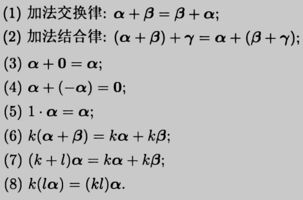

- 基本符号
  collapsed:: true
	- 矩阵
	  collapsed:: true
		- $A \in \mathbb{R}^{m \times n}$，表示A为实数组成的m行n列的矩阵，
		- a_{ij}表示A中的第 i 行和第 j 列的元素：$A=\left[\begin{array}{cccc}{a_{11}} & {a_{12}} & {\cdots} & {a_{1 n}} \\ {a_{21}} & {a_{22}} & {\cdots} & {a_{2 n}} \\ {\vdots} & {\vdots} & {\ddots} & {\vdots} \\ {a_{m 1}} & {a_{m 2}} & {\cdots} & {a_{m n}}\end{array}\right]$
		- 矩阵A的按行分块：$A=\left[\begin{array}{c}{-a_{1}^{T}-} \\ {-a_{2}^{T}-} \\ {\vdots} \\ {-a_{m}^{T}-}\end{array}\right]$
		- 矩阵A的按列分块：$A=\left[\begin{array}{llll}{ |} & { |} & {} & { |} \\ {a^{1}} & {a^{2}} & {\cdots} & {a^{n}} \\ { |} & { |} & {} & { |}\end{array}\right]$，
	- 向量
	  collapsed:: true
		- $x \in \mathbb{R}^{ n}$，表示$x$为具有$n$个元素的向量，
		- 一般向量$x$表示列向量（或$n$行$1$列的矩阵）；而$x^T$表示行向量（或$1$行$n$列的矩阵），
		- $x_i$表示向量$x$的第$i$个元素，$x=\left[\begin{array}{c}{x_{1}} \\ {x_{2}} \\ {\vdots} \\ {x_{n}}\end{array}\right]$，
	- 标量与向量
	  collapsed:: true
		- 标量：$k, |A|, {\alpha}^T\alpha, \dfrac {1}{{\alpha}^T\alpha}$
		- 向量：$\alpha, k\alpha, {\alpha}^TA_{(1*m)}, A\alpha_{(m*1)}$
		- 矩阵：$A, kA, \alpha{\alpha}^T, \begin{pmatrix} A\alpha_1 & A\alpha_2 & ... & A\alpha_n \\ \vdots & \vdots & & \vdots \\  &  &  &  \\ \end{pmatrix}$
- 概述
  collapsed:: true
	- 线性性
	  collapsed:: true
		- 引入
		  collapsed:: true
			- 很多数据的转换都有“线性性”，
			- 多元一次方程组是最基础的线性系统，
			- 微积分也是线性系统：导数具有数乘和可加性，定积分同样（积分的基本性质），
			- 物理电路（串联，并联；电流，电压）也是线性系统，
			- 线性性的思想在许多数学和物理问题中是重要的，线性代数就是对数学家和物理学家研究线性结构所积累的经验的总结，
		- 线性算子
		  collapsed:: true
			- 若对于元素f，g和常数a，b，
			- 算子L满足 L(af + bg) = aLf + bLg，
			- 则称L为一个线性算子，
			- 示例
			  collapsed:: true
				- 微积分都是线性算子，
				- 设元素f，g为函数，L为求导；按求导的性质，可知$(af + bg)' = af' + bg'$，
				- 同理，设元素f，g为函数，L为求积分；可知$\int (af + bg)dx = \int af dx +\int bg dx$，
			- 反例
			  collapsed:: true
				- 求行列式不是线性算子，即|A + B| \ne |A| + |B|，且|kA| \ne k|A|，
				- 求方差不是线性算子，即Var(A + B) \ne Var A + Var B，且Var kA \ne k Var A
		- 线性空间
		  collapsed:: true
			- 设V为非空集合，K为数域；
			- 若集合V（中的元素）对加法运算封闭；集合V，K对数乘运算封闭；
			- 且集合V中的运算满足下述规则，
				- {:height 140, :width 200}
			- 则称V为数域K上的线性空间，一般记为V_{K}，
	- 线性代数
	  collapsed:: true
		- 广义的线性代数指研究向量空间和矩阵理论的数学学科，
		- 线性方程组可以作为大部分线性代数理论的出发点，在很多工程理论中也有实际的应用，
		  collapsed:: true
			- 行列式是描述一类线性方程组是否可解的主要理论，在其他地方也有应用，
		- 向量空间可以看成线性代数理论的“几何”部分；向量的基，线性组合和线性无关性都可以看成二维和三维解析几何的推广，
		  collapsed:: true
			- 一般的“向量”指由纯数字构成的有序数列，
		- 矩阵理论可以看成线性代数理论的“代数”部分，矩阵的计算，分解与变换可以较好的分析不同组向量之间的几何关系，
	- 高等代数
	  collapsed:: true
		- “高等代数”理论除了向量空间和矩阵理论之外，还包括了多项式P_{n}(x)的理论，
		  collapsed:: true
			- 对于广义的线性空间，给定一组基(x^{n}, x^{n-1},…x, 1)，
			- 可知任意n次多项式P_{n}(x)都可由这组基线性表示，
			- 因此可以由线性空间的理论分析多项式，
		- 研究方向包括高次多项式的分解与组合等，
		- 进一步的理论（群，环，域）与抽象代数相连，
- [[线性方程组]]
- [[向量]]
- [[矩阵论]]
- [[二次型]]
- 其它
	- 矩阵特殊值
	  collapsed:: true
		- 对于抽象矩阵，可以考虑矩阵特殊值来辅助分析，但一般只用于举反例，
		- 常用的有$\begin{pmatrix} 1 & 0\\0 & 1\\ \end{pmatrix} \begin{pmatrix} 0 & 1\\1 & 0\\ \end{pmatrix} ,\begin{pmatrix} 0 & 0\\0 & 0\\ \end{pmatrix}$,
		- $\begin{pmatrix} 1 & 0\\1 & 0\\ \end{pmatrix} \begin{pmatrix} 1 & 1\\0 & 0\\ \end{pmatrix}$,
		- $\begin{pmatrix} 1 & 0\\0 & 0\\ \end{pmatrix} \begin{pmatrix} 0 & 0\\0 & 1\\ \end{pmatrix} \begin{pmatrix} 1 & 1\\1 & 1\\ \end{pmatrix}$,
		- $\begin{pmatrix} 0 & 1 & 1 \\0 &0 & 1 \\ 0 & 0 & 0 \\ \end{pmatrix}: A \not = 0,A^{K} = 0 ,$
	- 数学归纳法与递推公式
- [[Science]]