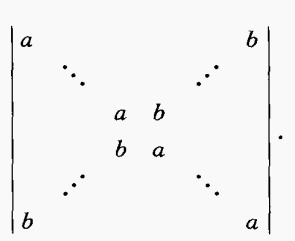
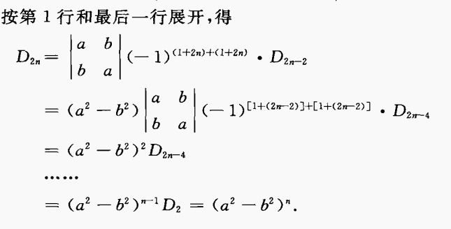
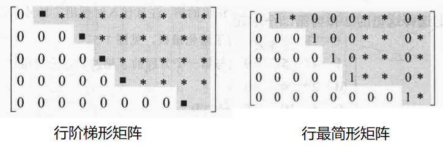
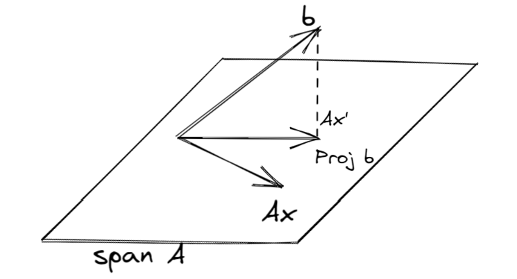

- 行列式（Determinant）
  collapsed:: true
	- （引入）
	  collapsed:: true
		- n个n元线性方程组的求解
		  collapsed:: true
			- n = 2的情况
			  collapsed:: true
				- 高斯消元法
				- $x_{1} = \dfrac{\begin{vmatrix}b_{1} & a_{12} \\b_{2} & a_{22} \\\end{vmatrix}}{\begin{vmatrix}a_{11} & a_{12} \\a_{21} & a_{22} \\\end{vmatrix}}$
			- n = 3的情况
			  collapsed:: true
				- 变量代换法
				- 行列式的递归定义
				- $\begin{vmatrix}a_{11} & a_{12} & a_{13} \\a_{21} & a_{22} & a_{23} \\a_{31} & a_{32} & a_{33} \\ \end{vmatrix} = a_{11}\begin{vmatrix}a_{22} & a_{23} \\a_{32} & a_{33} \\\end{vmatrix} - a_{21}\begin{vmatrix}a_{12} & a_{13} \\a_{32} & a_{33} \\\end{vmatrix} + a_{31}\begin{vmatrix}a_{12} & a_{13} \\a_{22} & a_{23} \\\end{vmatrix}$，
				- 因此，可以定义$\begin{vmatrix}a_{11} & a_{12} & a_{13} \\a_{21} & a_{22} & a_{23} \\a_{31} & a_{32} & a_{33} \\\end{vmatrix}$为行列式，定义$\begin{vmatrix}a_{22} & a_{23} \\a_{32} & a_{33} \\\end{vmatrix}$为余子式，
	- 行列式的定义
	  collapsed:: true
		- 称n^{2}个元素（数值）组成的n行n列式子为n阶行列式，其值为一个标量；一般记为|A|或 det A，
		- 行列式的递归定义
		- 行列式的组合定义
		  collapsed:: true
			- （引入）
			  collapsed:: true
				- 二阶行列式的值为a_{11}a_{12} - a_{12}a_{11}，
				- 三阶行列式的值为a_{11}a_{22}a_{33} + a_{12}a_{23}a_{31} + a_{13}a_{21}a_{32} - a_{11}a_{23}a_{32} - a_{12}a_{21}a_{33} - a_{13}a_{22}a_{31}，
				- 可见，行列式的值都为$\Sigma a_{1i}a_{2j}a_{3k}…$的形式，
			- 排列与逆序数
			  collapsed:: true
				- 排列
				  collapsed:: true
					- 记n个自然数的一个n-全排列为N(k_{1}, k_{2},..., k_{n})，
				- 排列的顺序
				  collapsed:: true
					- 称1，2，3…，n为自然顺序，
					- 逆序数示例：对于排列32514，
					  collapsed:: true
						- 3前面没有数字，所以逆序数为0，
						- 2前面的数字中，3比2大，所以逆序数为1，
						- 5前面的数字中，没有比5大的数，所以逆序数为0，
						- 1前面的数字中，3，2，5比1大，所以逆序数为3，
						- 4前面的数字中，5比4大，所以逆序数为1，
						- 综上所述，排列32514的逆序数为(0 + 1 + 0 + 3 + 1 = )5，
					- 称逆序数为奇数的排列为奇排列，逆序数为偶数的排列为偶排列，
				- 对换
				  collapsed:: true
					- n-排列中任意两个元素对换，排列的奇偶性改变，
			- 组合定义
			  collapsed:: true
				- 定义：n阶行列式的值为$\sum\limits^{n!} (-1)^{t_{p_{1}p_{2}…p_{n}}} a_{1p_{1}}a_{2p_{2}}…a_{np_{n}}$，
				- 和式共有*n！项*，即2阶行列式有2！= 2项，3阶行列式有3！= 6项…，
				- 求和式的每一项（的绝对值）都为$a_{1p_{1}}a_{2p_{2}}…a_{np_{n}}$，即第1，2，3…*行*中，位于*不同列*的n个元素的乘积，
				- $p_{1}p_{2}…p_{n}$为一个n-全排列，$t_{p_{1}p_{2}…p_{n}}$为该排列的逆序数，
			- 应用
	- 余子式与代数余子式
		- 定义
		  collapsed:: true
			- 称n阶矩阵A删除第i行和第j列后的n - 1阶矩阵的*行列式*为余子式，记为$M_{ij}$，
			- 称$A_{ij} = {(-1)}^{i + j}M_{ij}$为代数余子式，
		- 性质
		  collapsed:: true
			- A_{ij}的取值与a_{ij}无关，所以特定（代数）余子式的和可以看作某个行列式的值，因此可以尝试构造行列式简化计算，
			  collapsed:: true
				- *构造*新行列式不同于对原行列式进行*变换*，变换后的行列式算出的ΣA_{ij}不再为原行列式的A_{ij}，
			- A* 由代数余子式组成，
			  collapsed:: true
				- 求出A* 就可以求得所有的Aij，但A* 一般不易求解，
				- A* 的排列（Aij的排列）与原矩阵不同，而是与原矩阵的*转置*相同，
				  collapsed:: true
					- $a_{ij} = -A_{ij}$ 等价于$A^{T} = -A^{*}$ ，
					- 两侧取行列式，可知$|A| = (-1)^{n} |A|^{(n-1)}$，
				- 由A* 的排列，可知$\Sigma A_{ii} = \operatorname{tr}A^{*} = \Sigma λ_{A*}$，
			- A的一个代数余子式等同于A的一个n - 1阶子式，
	- 行列式按行（列）展开
	  collapsed:: true
		- n阶行列式的值等于任一行（列）的每个元素和其对应的*代数余子式*的乘积的和，
		- $|A|_{n} = \sum\limits_{i=1}^n a_{ij}A_{ij} = a_{1j}A_{1j}+a_{2j}A_{2j}+ ... + a_{nj}A_{nj}$，此处j \in [1, n]，
		- $|A|_{n} = \sum\limits_{j=1}^n a_{ij}A_{ij} = a_{i1}A_{i1}+a_{i2}A_{i2}+ ... + a_{in}A_{in}$，此处i \in [1, n]，
		- 性质
		  collapsed:: true
			- 按照定义，行列式可以按照行或列进行递归展开，
			- 任一行（列）的每个元素和其它行（列）对应的*代数余子式*的乘积的和为0，
	- 行列式的性质
	  collapsed:: true
		- 基本性质（定义）
		  collapsed:: true
			- |A| = |A^{T}|，即行列式的行，列等同（求解时应综合考虑行变换和列变换），
			  collapsed:: true
				- 证明行列式可以按第一行展开，
					- *特殊情况*：假设第一行只有一个元素a_{1r}不为0，此时按递归定义（按第一列展开），可算得|A| = a_{1r}A_{1r}，
					- 对其他元素也不为0的情况，将行列式展开为n个行列式，即a_{11} = a_{11} + 0 + 0…，
					- 最后可证明结论，
				- 利用数学归纳法，将|A|按第一列展开，|A^{T}|按第一行展开，即可证明结论，
			- 对换两行/列后的行列式变号，
			  collapsed:: true
				- 推论：若行列式的某一行（列）全为0，则行列式的值为0，
				- 推论：若行列式的某两行（列）相同，则行列式的值为0，
				- 递归证明：可以先证明对换相邻两行结论成立，再说明对换任意两行等同于多次对换相邻两行，
			- 数乘行列式 = 数乘行列式的某一行/列，即$|k\alpha_1,\alpha_2...,\alpha_n| = k|\alpha_1,\alpha_2...,\alpha_n|$，$|kA| = k^n|A|$；
			  collapsed:: true
				- 推论：若行列式的某两行（列）成比例，则行列式的值为0，
			- 若行列式的某行/列的*所有元素*都可以表示为两个数的和，则可将行列式写为两个行列式之和，即$|\alpha_1 + \beta,\alpha_2...,\alpha_n| = |\alpha_1,\alpha_2...,\alpha_n| + |\beta,\alpha_2...,\alpha_n|$，
			- 将某一行（列）乘以常数k后加到另一行（列），行列式的值不变（拆分后另一个行列式为0），
		- 数学归纳法证明
		  collapsed:: true
			- 由于行列式可以由递归的方式定义，因此很多行列式的性质都可以由数学归纳法证明，
			- 对于“任意”类的性质，证明时可以先从简单的情况开始（如相邻两行，假设元素为0等），再逐步推广至其他情况，
		- 其他性质
		  collapsed:: true
			- 一般AB \neq BA（矩阵），但总有|AB| = |A| *|B| = |BA|（数字），
			- 矩阵A不可逆时|A| = 0；A可逆时${|A|}^{-1} = \dfrac{1}{|A|}$，
		- 特征值
		  collapsed:: true
			- $\prod \limits _{i = 1}^n \lambda_i = |A|$,
			- 三阶矩阵A的特征值行列式$|\lambda E - A| = {\lambda}^3 - \Sigma a_{ii}{\lambda}^2 + \Sigma A_{ii}\lambda - |A| = (\lambda - {\lambda}_1)(\lambda - {\lambda}_2)(\lambda - {\lambda}_2)$,
	- （推广：子式与Laplace定理）
	  collapsed:: true
		- 定义
		  collapsed:: true
			- n阶行列式中，任取k行k列（可以不在一起），位居交叉处的k^{2}个元素按*原顺序*排成的行列式称为原行列式的k阶子式（仍为行列式），
			- 对于指定的k行（列），其对应的所有k阶子式的个数为$C_{n}^{k}$个（即从n列（行）中任选k列（行）组成k阶子式），
			- 一般记为$A\begin{pmatrix} i_{1}, i_{2}, \cdots, i_{k}  \\j_{1}, j_{2}, \cdots, j_{k}  \end{pmatrix}$，其中i为行数，j为列数，
		- 余子式
		  collapsed:: true
			- 称原行列式除去k阶子式*所在的行和列的所有元素*（而不是只删除子式的k^{2}个元素）后，剩余的元素构成的n - k阶行列式为k阶子式的余子式，一般记为$M\begin{pmatrix} i_{1}, i_{2}, \cdots, i_{n - k}  \\j_{1}, j_{2}, \cdots, j_{n - k}  \end{pmatrix}$，
			- 称$\hat{A} = (-1)^{(i_{1} + i_{2} + \cdots + i_{k}) + (j_{1} + j_{2} + \cdots + j_{k})}\begin{pmatrix} i_{1}, i_{2}, \cdots, i_{n - k}  \\j_{1}, j_{2}, \cdots, j_{n - k}  \end{pmatrix}$为k阶子式的代数余子式，
		- Laplace定理
		  collapsed:: true
			- n阶行列式|A|可以按照k行（列）展开，其值等于这k行（列）元素的所有k阶子式与其对应的代数余子式的乘积之和，
			- 应用
			  collapsed:: true
				- 一般用于求解形式较特殊的行列式，
				- 分块行列式
				  collapsed:: true
					- $\begin{vmatrix} A_{(m*m)} & &0  \\ & & \\C & & B_{(n*n)}  \\ \end{vmatrix}$可以按照前m行展开，
					- 其对应的子式中，只有|A|不为0，其余子式都一定有零列；因此原行列式的值 = |A||B|，
				- 对称行列式
				  collapsed:: true
					- {:height 140, :width 160}
					- {:height 170, :width 320}
	- 特殊的行列式
	  collapsed:: true
		- 三角形行列式
		  collapsed:: true
			- 称*主对角线*以下（上）的元素全部为0的行列式为上（下）三角形行列式，即$\begin{vmatrix} a_{11} & a_{12} & ... & a_{1n} \\0 & a_{22} & ... & a_{2n} \\ \vdots & \vdots & & \vdots \\ 0 & 0 & ... & a_{nn} \\ \end{vmatrix}$（或$\begin{vmatrix} a_{11} & 0 & ... & 0 \\a_{21} & a_{22} & ... & 0 \\ \vdots & \vdots & & \vdots \\ a_{n1} & a_{n2} & ... & a_{nn} \\ \end{vmatrix}$），
			- 主对角线行列式$|A| = \prod \limits _{i = 1}^n a_{ii}$（可用数学归纳法和行列式的递推展开式证明），
			- 副对角线行列式$|A| = {(-1)}^{\frac{n(n-1)} {2}}\prod \limits _{i = 1}^n a_{ii}$，
			  collapsed:: true
				- 即副对角线行列式可以经过$\frac{n(n-1)} {2}$次对换，换为主对角线行列式，
				- 对换次数由递推方式得出，即第一列经n - 1次对换到最后一列，第二列经n - 2次对换到最后一列…，
				- 也可考虑直接对换第一列和第n列，此时对换次数为$\begin{cases}  \frac{n}{2} & n为偶数 \\ \frac{n - 1}{2} & n为奇数 \end{cases}$，
		- 分块行列式
		  collapsed:: true
			- 主对角线分块矩阵$\begin{pmatrix}  A_{(m*m)} &  \\ 0& D_{(n*n)} \\ \end{pmatrix} = |A||D|$，
			- 副对角线分块矩阵$\begin{pmatrix}  0 & B_{(m*m)} \\ C_{(n*n)}& 0 \\ \end{pmatrix} = {(-1)}^{mn}|B||C|$
			- 分块矩阵$\begin{pmatrix}  A_{(n*n)} & B_{(n*n)} \\ C_{(n*n)}& D_{(n*n)} \\ \end{pmatrix}$
			  collapsed:: true
				- 若A可逆，则$\begin{pmatrix}  A & B \\ C & D \\ \end{pmatrix} = |A| |D - CA^{-1}B|$,
				- 若D可逆，则$\begin{pmatrix}  A & B \\ C & D \\ \end{pmatrix} = |D| |A - BD^{-1}C|$,
			- 分块矩阵$\begin{pmatrix}  A_{(n*n)} & B_{(n*n)} \\ C_{(n*n)}& D_{(n*n)} \\ \end{pmatrix}$
			  collapsed:: true
				- 
		- Vandermonde行列式
		  collapsed:: true
			- $\begin{vmatrix} 1 & 1 & 1 & ... & 1 \\ a_1 & a_2 & a_3 & ... & a_n \\ a_1^2 & a_2^2 & a_3^2 & ... & a_n^2 \\ \vdots & \vdots & \vdots & & \vdots \\ a_1^{n - 1} & a_2^{n - 1} & a_3^{n - 1} & ... & a_n^{n - 1} \\ \end{vmatrix} = \prod \limits _{n\geq i \geq j \geq 1} (a_i - a_j)$，
			- 如$(a_3 - a_2)(a_3 - a_1)(a_2 - a_1)$，
			- 可以用数学归纳法和行列式的展开证明，
		- Fibonacci行列式
		  collapsed:: true
			- ${\begin{vmatrix} 1 & 1 & 0 & ... & 0 \\ -1 & 1 & 1 & ... & 0 \\ 0 & -1 & 1 & ... & 0 \\ \vdots & \vdots & \vdots & & \vdots \\ 0 & 0 & 0 & ... & 1 \\ \end{vmatrix}}_{n*n} = F_{n}$，为三对角线行列式，
			- 可见F_{1} = 1，F_{2} = (1 \cdot 1) - (1 \cdot (-1)) = 2，
			- 按照递归展开，可以证明F_{n} = F_{n - 1} + F_{n - 2}(n > 2)，
	- 行列式的计算技巧
	  collapsed:: true
		- 递归展开（构造0）
		  collapsed:: true
			- 由于行列式可以按照某一行递归展开，因此若某一行大部分元素都为0，则可以简化展开式，
			- 消元时应注意，同一行/列的其他元素也需要进行运算，
		- 求和法
		  collapsed:: true
			- 由于行列式可以提取公因子，
			- 因此可以将每行/列都加至某行，检查是否有公因子，
			- 提出公因子后的行列式，可以再判断是否可以简化，
		- 三对角线行列式
		  collapsed:: true
			- 逐行/列相加/相减，（并非一定从首行开始）
			- 每行/列都加至某行，
			- 化简后用展开公式，
		- 拆分法
		  collapsed:: true
			- 若行列式的某行/列的*所有元素*都可以表示为两个数的和，则可将行列式写为两个行列式之和，
			- 可以尝试分解或构造特殊的行列式，
			- 若行列式有m行（列）可以拆分，则行列式最后可以拆分为2^{m}个行列式；因此，具体计算时应注意细节，
		- n阶行列式
		  collapsed:: true
			- 若难以直接求解，可以考虑利用递推公式或数学归纳法求解，
			- 展开时可以备注行列式阶数，避免失误，
		- 综合其它知识
		  collapsed:: true
			- 方阵的行列式可以进行整体运算，应注意与矩阵的乘法、单位矩阵的恒等变形的综合，
			- kE+B/kB+E型行列式与相似矩阵，特征值的综合，
			- |A| = |A^{T}|，应注意与特征值行列式的综合，
		- 抽象行列式的计算
	- Cramer法则（方阵）
	  collapsed:: true
		- 对于非齐次方程组Ax = b，若|A| ≠ 0，则n阶线性方程组有*唯一*解，且 $x_{i} = \dfrac{|A_{i}|}{|A|}$ ，
		- 其中|A_{i}|为用常数列向量b替换对应的第i列a_{ki}得到，
		- 若常数列向量b为零向量，即方程组为齐次方程组，则|A| \neq 0时线性方程组有唯一零解，
		- 推导
		  collapsed:: true
			- 线性方程组$\begin{cases} a_{11}x_{1} + a_{12}x_{2} + \cdots + a_{1n}x_{n} = b_{1} \\ a_{21}x_{1} + a_{22}x_{2} + \cdots + a_{2n}x_{n} = b_{2} \\ \cdots\\ a_{n1}x_{1} + a_{n2}x_{2} + \cdots + a_{nn}x_{n} = b_{n} \\ \end{cases}$对应的行列式为$\begin{vmatrix} a_{11} & a_{12} & ... & a_{1n} \\a_{21} & a_{22} & ... & a_{2n} \\ \vdots & \vdots & & \vdots \\ a_{n1} & a_{n2} & ... & a_{nn} \\ \end{vmatrix}$，
			- 假设方程组有解，设行列式|A_{1}|为$\begin{vmatrix} b_{1} & a_{12} & ... & a_{1n} \\b_{2} & a_{22} & ... & a_{2n} \\ \vdots & \vdots & & \vdots \\ b_{n} & a_{n2} & ... & a_{nn} \\ \end{vmatrix}$，
			- 则由方程组，可得$\begin{vmatrix} a_{11}x_{1} + a_{12}x_{2} + \cdots + a_{1n}x_{n} & a_{12} & ... & a_{1n} \\a_{21}x_{1} + a_{22}x_{2} + \cdots + a_{2n}x_{n}  & a_{22} & ... & a_{2n} \\ \vdots & \vdots & & \vdots \\ a_{n1}x_{1} + a_{n2}x_{2} + \cdots + a_{nn}x_{n} & a_{n2} & ... & a_{nn} \\ \end{vmatrix}$，
			- 将行列式化简，最后可得$|A_{1}| = x_{1}|A|$，即可求得$x_{1} = \dfrac{|A_{1}|}{|A|}$，
			- 可根据行列式的按列展开证明，
- 线性方程组
  collapsed:: true
	- （线性空间）
	  collapsed:: true
		- 零空间
		  collapsed:: true
			- 定义
			  collapsed:: true
				- 设A为m行n列矩阵，x为n维（列）向量，
				- 称使Ax = 0的全体列向量x的集合为矩阵A的零空间，记为Nul A，
			- 性质
			  collapsed:: true
				- Nul A是R^{n}的一个子空间，
		- 列空间
		  collapsed:: true
			- 定义
			  collapsed:: true
				- 设A为m行n列矩阵，x为n维（列）向量，
				- 称矩阵A的全体列向量的扩张空间为矩阵A的列空间，记为Col A，
			- 性质
			  collapsed:: true
				- Col A是R^{m}的一个子空间，
				- Col A可以写为{b | b = Ax}，即对任何已知矩阵A，都可以写出Col A中的向量（A的列向量的线性组合）；而对任何已知列向量b，也可写出其对应的Col A，
	- 方程组的定义
	  collapsed:: true
		- 由一个或多个包含n个未知变量x_{i}的线性方程组成的方程组，
		  collapsed:: true
			- 即方程组并非必须要有n个方程，
			- “线性”指未知项x_{i}的系数只能为一次，
		- 方程组的矩阵表示
		  collapsed:: true
			- 系数矩阵与增广矩阵
			  collapsed:: true
				- 对于线性方程组Ax = b，一般称A为方程组的系数矩阵，(A, b)为方程组的增广矩阵，
				- $A = \begin{pmatrix} a_{11} & a_{12} & ... & a_{1n} \\a_{21} & a_{22} & ... & a_{2n} \\ \vdots & \vdots & & \vdots \\ a_{n1} & a_{n2} & ... & a_{nn} \\ \end{pmatrix}$，
				- $(A,b) = \begin{pmatrix} a_{11} & a_{12} & ... & a_{1n} & b_{1} \\a_{21} & a_{22} & ... & a_{2n} & b_{2} \\ \vdots & \vdots & & \vdots \\ a_{n1} & a_{n2} & ... & a_{nn} & b_{n} \\ \end{pmatrix}$，
				-
		- 齐次与非齐次
	- 解的分析
		- 解的判定
		  collapsed:: true
			- 应先分清矩阵的方程个数（m行）与未知数个数（n列），
			- 齐次线性方程组有非零解的充分必要条件
				- $Ax = 0 \begin{cases} 必有零解 &  \\ 唯一零解 & R(A) = n \\ 无穷多解 & R(A) < n \end{cases}$
			- 非齐次线性方程组有解的充分必要条件
			  collapsed:: true
				- $Ax = b \begin{cases} 无解 & R(A) < R(A,b) (=R(A,b) - 1) \\ 唯一解 & R(A) =R(A,b) = n(方阵) \\ 无穷解 & R(A) = R(A,b) \end{cases}$
			- 唯一解的必要条件为 r(A) = n，因此m < n的非方阵不可能有唯一解，
		- 解的结构
		  collapsed:: true
			- 齐次线性方程组解的结构
			  collapsed:: true
				- 解，基础解系，通解
				  collapsed:: true
					- 解（向量）：可使方程组Ax = 0 / Ax = β成立的任意一个向量，
					- 解集空间（向量组） → 基础解系（向量组）：齐次线性方程组的解集空间的最大无关组，
					- 通解（向量）：基础解系的线性组合形式（含参数），
				- 基础解系的性质
				  collapsed:: true
					- 基本性质
					  collapsed:: true
						- 解：其中的每个向量都是方程的解，
						- 最大无关组：基础解系向量组线性无关，且可表示任意解，即其秩为n - r(A)，
						  collapsed:: true
							- 定理：对于m*n矩阵A（m为方程个数，n为未知数个数），若r(A) = r，则Ax = 0的解的向量组的秩为n - r，
								- 可由行最简型矩阵证明，
					- 一般基础解系不唯一，所以通解也不唯一，
					- 0解必为齐次方程组的解，但不能作为基础解系，
			- 非齐次线性方程组解的结构与通解
			  collapsed:: true
				- （解的叠加原理）
				- 非齐次线性方程组的通解 = 齐次方程组的通解（含参数） + 非齐次线性方程组的（任意）一个特解（不含参数），
				  collapsed:: true
					- 应注意非齐次线性方程组的特解不是齐次线性方程组的解，齐次方程组的通解也不是非齐次线性方程组的解，
	- 求解（具体方程组）
		- 克拉默法则
		- 初等行变换（Gauss消元法）
		  collapsed:: true
			- 矩阵的初等变换
			  collapsed:: true
				- 基本思路
				  collapsed:: true
					- 若消元的步骤“可逆”，则得到的方程组应该与原方程组同解，
					- 三种初等变换都是“可逆”的，即可以通过逆变换变回原来的矩阵，
				- 三种初等变换
				  collapsed:: true
					- 对换行i，j（列）
					- 第 i 行（列）乘上非零常数，
					- 将第 i 行（列）的非零常数倍加到第 j 行（列）上，第 i 行不变，
				- 行阶梯形矩阵（REF)，行最简形矩阵（RREF），标准型
				  collapsed:: true
					- 定义
					  collapsed:: true
						- ，
						- 称元素“1”为主元（主变量），
					- 定理：任意矩阵都可以经初等行变换变为等价的行阶梯形矩阵，且变换得到的行阶梯形矩阵唯一，
					  collapsed:: true
						- 行阶梯形矩阵的第一行的首个非零元素不一定在第一列，
						- 第i + 1行的首个非零元素也不一定在第 i 行的首个非零元素的正右下方，
					- 定理：任意矩阵都可以经初等变换（行变换和列变换）转化为等价的标准型，
					  collapsed:: true
						- 即对任意矩阵A，都有可逆矩阵P，Q使$PAQ =\begin{pmatrix} I_{r} &  0 \\ 0 & 0  \\ \end{pmatrix}$，
					- 定理：若方阵A可逆，则A的标准型矩阵为（同阶）单位矩阵；且A可以只通过行*或*列变换，变为单位矩阵，
					  collapsed:: true
						- 即一定存在初等矩阵P_{i}，Q_{j}，使P_{1}P_{2}…P_{m}A = AQ_{1}Q_{2}…Q_{n} = I，
			- 同解方程组
			  collapsed:: true
				- 若两个线性方程组的增广矩阵行等价，则方程组同解，
				- 同解的矩阵乘法证明
				  collapsed:: true
					- 由矩阵乘法的消去律，若P可逆（初等行变换），则P(Ax) = 0时，必有矩阵Ax = 0；
					  collapsed:: true
						- 定理：任意矩阵总可经初等行变换转换为行阶梯形矩阵，
					- 即方程组PAx = 0与Ax = 0通解，
					- 反之，Q可逆时（初等列变换）不能说明AQx = 0和Ax = 0同解，
			- 求解齐次通解
			  collapsed:: true
				- 分析方程的秩，解向量的秩
				- 主变量与自由变量
				  collapsed:: true
					- 每个方程（每行）的第一个未知量为主变量，主变量可能不完全按对角线排列，
					- {:height 178, :width 265}，
					- 方程组的主变量个数一般与矩阵的秩 r(A) 相同，
					- 自由变量的个数则与n - r(A) 相同，
				- 赋值自由变量
				  collapsed:: true
					- 一般用1逐个赋值自由变量，剩下的自由变量赋值0，
					- 一个自由变量时应赋值1，
					- 求解新的方程组（而不是分别求解方程），
				- 得到带有待定参数的通解，
			- 求解非齐次特解
			  collapsed:: true
				- 只需要求解一个特解，即特解的形式较为自由，
				- 但仍需求解方程组，而不是分别求解方程，
				- 可以取自由变量为0，并求解主变量的取值，
			- （验算）
			  collapsed:: true
				- 保证齐次的基础解系的每个解向量都是解，
				- 保证非齐次的特解是非齐次的解，
	- 求解（抽象方程组）
		- 解的判断：秩、行列式、向量的线性相关性，
		- 解的结构：齐次、非齐次；解向量的秩，
		- 解的证明
			- 基础解系的性质（解、最大无关组）
			- 设出解向量/通解β，证明β可由基础解系组线性表示，
	- 其它
		- 公共解与同解
			- 公共解
			  collapsed:: true
				- 一般方法为联立方程组，求联立方程组的解，
				- 也可分别求解每个方程组，得到基础解系，再令解向量（通解形式）相同，求待定参数间的关系，
			- 同解
			  collapsed:: true
				- 先分析每个方程组的性质（方程个数、秩），
				- 求解其中一个方程组得到基础解系，
				- 将基础解系代入另一个方程组，
				- 最后应验算是否符合全部条件，
		- 对于n阶矩阵A，A^{n}x = 0，A^{n+1}x = 0同解，
		  collapsed:: true
			- 只能为A^{n}，不能为A^{k}(k < n)，
			- 证明
			  collapsed:: true
				- 反证法，向量线性相关的定义
				- 设\alpha 为A^{n+1}x = 0的解，但不是A^{n}x = 0的解，
				- 由于n+1个n维向量\alpha, A\alpha, ..., A^{n}\alpha必定线性相关，即必有不全为0的k_{i}，使k_{1}\alpha+k_{2} A\alpha+ ..., +k_{n+1}A^{n}\alpha = 0，
				- 由已知条件，两侧同乘A^{n}，即k_{1}A^{n}\alpha+k_{2} A^{n+1}\alpha+ ..., +k_{n+1}A^{n+n}\alpha = k_{1}A^{n}\alpha =0，
				- 若\alpha 不是A^{n}x = 0的解，则必有k1 = 0，
				- 如此递推，可得任意ki均为0，与n+1个n维向量必定线性相关矛盾，
				- 因此\alpha 是A^{n}x = 0的解，
		- 对于m*n矩阵A，B，$Ax = 0，Bx = 0$同解 $\not \leftrightarrow A^{T}x = 0，B^{T}x = 0$同解，
		  collapsed:: true
			- 可以取特殊值，如$\begin{pmatrix}1 & 0 & 0 \\2 & 0 & 0 \\\end{pmatrix}，\begin{pmatrix}2 & 0 & 0 \\1 & 0 & 0 \\\end{pmatrix}$，
- 矩阵方程
  collapsed:: true
	- 解的分析
		- 矩阵方程AX = B有解 \Leftrightarrow R(A) = R(A, B)，
		- 若AB = 0，则B的列向量均为A的解，但不一定为基础解系——即R(A) + R(B) \le 0，而并非一定为n，
	- 求解（AX = B）
	  collapsed:: true
		- 初等行变换（A可逆时）
			- (A | B) \rightarrow (I | A^{-1}B)，
		- 若A不可逆，则可将矩阵B按列分块为列向量，再逐个求解非齐次的方程组，
		- 寻找对应矩阵
			- 求解AX = 0时，应考虑寻找使AB = 0的特殊矩阵，如AA* = 0，A\alpha = 0\alpha = 0等，
	- 求解（XA = B）
	  collapsed:: true
		- 类似AX = B的求解，但此处的变换为列变换，
		- 即将$\begin{pmatrix} A \\ B \\ \end{pmatrix} \rightarrow \begin{pmatrix} I \\ BA^{-1} \\ \end{pmatrix}$，
- 方程组的应用
  collapsed:: true
	- 具体问题的方程组形式，
	- 向量问题的方程组形式，
		- 线性组合
		  collapsed:: true
			- 线性组合的求解可以写为方程组形式，
			- 即求解k_{1}\alpha_{1} + k_{2}\alpha_{2} + …k_{n}\alpha_{n} = \beta，
			- 等同于求解方程组$\begin{cases} a_{11}k_{1} + a_{12}k_{2} + \cdots + a_{1n}k_{n} = b_{1} \\ a_{21}k_{1} + a_{22}k_{2} + \cdots + a_{2n}k_{n} = b_{2} \\ \cdots\\ a_{n1}k_{1} + a_{n2}k_{2} + \cdots + a_{nn}k_{n} = b_{n} \\ \end{cases}$，
		- 线性无关
		  collapsed:: true
			- 向量组\alpha_{1}，\alpha_{2}，…\alpha_{n}线性无关，
			- 等价于齐次方程组$\begin{cases} a_{11}k_{1} + a_{12}k_{2} + \cdots + a_{1n}k_{n} = 0 \\ a_{21}k_{1} + a_{22}k_{2} + \cdots + a_{2n}k_{n} = 0\\ \cdots\\ a_{n1}k_{1} + a_{n2}k_{2} + \cdots + a_{nn}k_{n} = 0 \\ \end{cases}$只有零解，
			- 反之，向量组线性相关则等价于齐次方程组有非零解，
	- 矩阵问题的方程组形式，
	  collapsed:: true
		- 方程组$\begin{cases} a_{11}k_{1} + a_{12}k_{2} + \cdots + a_{1n}k_{n} = b_{1} \\ a_{21}k_{1} + a_{22}k_{2} + \cdots + a_{2n}k_{n} = b_{2} \\ \cdots\\ a_{n1}k_{1} + a_{n2}k_{2} + \cdots + a_{nn}k_{n} = b_{n} \\ \end{cases}$
		- 可以写为矩阵形式Ax = b，
- 最小二乘法
	- [[线性回归]]
	- 引入
	  collapsed:: true
		- 根据有解的判定条件，可知具体应用中的许多线性方程组都可能无解；或者维数很多，难以计算，
		- 由于*无法得到准确的解*，因此一种思路为寻找一个比较好的“近似”，
		- 近似的优良性可以由空间中的向量的距离来判断，
	- 定义
	  collapsed:: true
		- 设A为m行n列矩阵，b为n维列向量，
		- 对任意n维列向量$\vec{x}$，称使得$||\vec{b} - A\hat{x}|| = \min ||\vec{b} - A\vec{x}||$的n维列向量$\hat{x}$为线性方程组Ax = b的最小二乘（least squares）解，
	- 求解
		- 几何含义
		  collapsed:: true
			- 方程组无解的几何含义为向量b不在A的列向量的扩张空间中；即任意 x 对应的扩张空间中的向量 Ax 都无法与b“重合”，
			- {:height 147, :width 262}
			- 从几何角度，可知 b 在span A上的投影向量Proj b与向量b 的“距离”最短，
			- 而且Proj b \in span A， 所以方程组Ax = Proj b一定有解，
		- 定理
		  collapsed:: true
			- 向量$\hat{x}$为线性方程组Ax = b的最小二乘（least squares）解的充要条件为$A\hat{x}$ = Proj b，
		- 求解
			- 由投影向量的性质，可知b - b' 应与 span A正交；即b - Ax' 与 A（的列向量） 正交，
			- 因此可推出A^{T}(b - Ax') = 0，即A^{T}b = A^{T}Ax'，
			- 因此，满足方程组A^{T}Ax = A^{T}b的向量x ，就是原方程组的最小二乘解，
			- （一般称方程组A^{T}Ax = A^{T}b为原方程组的法方程），
		- 方程组的计算
		  collapsed:: true
			- 若矩阵A列满秩，则矩阵A^{T}A可逆；此时可通过求逆矩阵的方式求解，即x = (A^{T}A)^{-1}A^{T}b，
			- 矩阵A列满秩时，也可使用QR分解求解；设A = QR，则可解得x = R^{-1}Q^{T}b，
	- 解的判定
	  collapsed:: true
		- 设A为m行n列矩阵，b为n维列向量，
		- $Ax = b \begin{cases}  唯一最小二乘解 & R(A) = n(列满秩) \\ 无穷解 & R(A) < n \end{cases}$，
	- 应用
		- [[线性回归]]
		- 最小二乘线性回归
		  collapsed:: true
			- 概念
			  collapsed:: true
				- 给定一组实验数据(x_{i}, y_{i})，
				- 希望求解x与y之间的线性关系，
				- 可将线性关系表示为方程$y = \beta_{0} + \beta_{1}x$，
				- 因此，希望求解的就是参数\beta_{0}，\beta_{1}的值，一般称为（线性）回归系数，
				- 此处没有统计学假定，也没有误差项，
			- 求解
			  collapsed:: true
				- 假设已有直线$y = \beta_{0} + \beta_{1}x$；则对于给定的x_{i}，可以算出对应的$y_{i}' = \beta_{0} + \beta_{1}x_{i}$，
				- 由于实验中的其他因素，y_{i}'一般与得到的y_{i}不同，
				- 一般称y_{i}'为预测值，称y_{i}' - y_{i}为余差，
				- 为了使预测尽量精确，一般希望将两者之间的差值最小化，
				- 对于总的误差，则希望将余差的平方和最小化，
			- 算法
				- 输入：n个（二维）向量(x_{i}, y_{i})，
				- 运算
					- 方程组
						- 可构造方程组$\begin{cases} \beta_{0} + \beta_{1}x_{1} = y_{1}\\ \beta_{0} + \beta_{1}x_{2} = y_{2}\\ \vdots \\ \beta_{0} + \beta_{1}x_{n} = y_{n}\\ \end{cases}$，
						- 写为矩阵形式，即$\begin{pmatrix} 1 & x_{1}\\ 1 & x_{2}\\ \vdots \\ 1 & x_{n}\\ \end{pmatrix} \begin{pmatrix} \beta_{0}  \\ \beta_{1} \\ \end{pmatrix} = \begin{pmatrix} y_{1}\\ y_{2}\\ \vdots \\ y_{n}\\ \end{pmatrix}$，
						- 一般记为X\beta = y，
					- 分析
					  collapsed:: true
						- 方程组一般没有*准确*（即恰好通过每个样本点）的\beta_{0}和\beta_{1}的解，
						- 此时可使用最小二乘法，求解使||X\beta - y||最小的\beta，
					- 最小二乘求解
					  collapsed:: true
						- 由最小二乘法的求解，可构造方程X^{T}X\beta = X^{T}y，
						- 若X^{T}X可逆，则可解得最小二乘解\beta = (X^{T}X)^{-1}X^{T}y，
				- 输出：标量\beta_{0}，\beta_{1}，
		- 最小二乘曲线回归
		  collapsed:: true
			- 概念
			  collapsed:: true
				- 给定一组实验数据(x_{i}, y_{i})，但x与y之间的关系不能用直线拟合，
				- 可将关系表示为$y = \beta_{0}f_{0}(x) + \beta_{1}f_{1}(x) +\cdots + \beta_{k}f_{k}(x)$，其中f_{i}(x)为确定的函数，
				- 因此，希望求解的就是参数\beta_{i}的值，
			- 算法
			  collapsed:: true
				- 输入：n个（二维）向量(x_{i}, y_{i})，
				- 运算
				  collapsed:: true
					- 方程组
					  collapsed:: true
						- 可构造方程组$\begin{cases} \beta_{0}f_{0}(x_{1}) + \beta_{1}f_{1}(x_{1}) +\cdots + \beta_{k}f_{k}(x_{1}) = y_{1}\\ \beta_{0}f_{0}(x_{2}) + \beta_{1}f_{1}(x_{2}) +\cdots + \beta_{k}f_{k}(x_{2}) = y_{2}\\ \vdots \\ \beta_{0}f_{0}(x_{n}) + \beta_{1}f_{1}(x_{n}) +\cdots + \beta_{k}f_{k}(x_{n}) = y_{n}\\ \end{cases}$，
						- 虽然此处的回归曲线不是线性的，但求解参数的方程组仍可以表示为线性方程组，
						- 仍可将上式写为矩阵形式，即$\begin{pmatrix} f_{0}(x_{1}) & f_{1}(x_{1}) & … & f_{k}(x_{1})\\  f_{0}(x_{2}) & f_{1}(x_{2}) & … & f_{k}(x_{2})\\ \vdots \\  f_{0}(x_{n}) & f_{1}(x_{n}) & … & f_{k}(x_{n})\\ \end{pmatrix} \begin{pmatrix} \beta_{0}  \\\beta_{1}  \\\vdots \\ \beta_{k} \\ \end{pmatrix} = \begin{pmatrix} y_{1}\\ y_{2}\\ \vdots \\ y_{n}\\ \end{pmatrix}$，
						- 并记为X\beta = y，
					- 最小二乘求解
					  collapsed:: true
						- 由最小二乘法的求解，可构造方程X^{T}X\beta = X^{T}y，
						- 若X^{T}X可逆，则可解得最小二乘解\beta = (X^{T}X)^{-1}X^{T}y，
				- 输出：参数向量\beta，
			- 误差分析
			  collapsed:: true
				- 余差向量
				  collapsed:: true
					- 有时也将回归曲线记为y = X\beta + \epsilon的形式，
					- 此时，求解最“合适”的回归参数（向量）\beta的问题就可转化为使余差（向量）\epsilon最小化的问题，
					- 由于\epsilon = y - X\beta，因此使||\epsilon||最小化就是使||y - X\beta||最小化，
					- 即问题等同于最小二乘求解，
				- 回归平方和
				  collapsed:: true
					- 一般记||X\beta||^{2}为SS(R)（回归项平方和），||y - X\beta||^{2}为SS(E)（余差平方和），||y||^{2}为SS(T)（实际值平方和），
					- 可以证明：SS(T) = SS(R) + SS(E)，
					- SS(R) = \beta^{T}X^{T}y，
					- SS(E) = y^{T}y - \beta^{T}X^{T}y，
		- 二元最小二乘曲线回归
		  collapsed:: true
			- 概念
			  collapsed:: true
				- 给定一组实验数据(u_{i}, v_{i}, y_{i})；此处y变为多元函数，即受多个自变量的取值影响，
				- 简单的二次回归方程表示为平面$y = \beta_{0} + \beta_{1}u + \beta_{2}v + \beta_{3}u^{2} + \beta_{4}uv + \beta_{5}v^{2}$，
				  collapsed:: true
					- 一般的回归方程则可写为$y = \beta_{0}f_{0}(u, v) + \beta_{1}f_{1}(u, v) +\cdots + \beta_{k}f_{k}(u, v)$，
				- 同理，希望求解的仍然为参数\beta_{i}的值，
			- 算法
			  collapsed:: true
				- 输入：n个（三维）向量(u_{i}, v_{i}, y_{i})，
				- 运算
				  collapsed:: true
					- 对于*给定的*拟合函数，y和*拟合值*f(u, v)之间的关系为线性关系，
					- 因此同样可构造方程组，并写为矩阵形式X\beta = y，
					- 并根据最小二乘法，求解矩阵方程X^{T}X\beta = X^{T}y，
				- 输出：参数向量\beta，
		- （加权最小二乘法）
		  collapsed:: true
			- 引入
			  collapsed:: true
				- 有时由于实验的不确定性，得到的数据(x_{i}, y_{i})的可靠性不一致，
				- 为了增加拟合的准确度，可以对y_{i}的测量值加上一定的权重，再对加权的数据进行拟合，
				- 设权值为w_{i}，则加权后的测量值为w_{i}y_{i}，
				- 为了便于矩阵运算，可以将加权运算写为矩阵形式，即$\begin{pmatrix} w_{1} & & & \\ & w_{2} & & \\ & &\ddots & \\ & & &w_{n} \\ \end{pmatrix}\begin{pmatrix} y_{1} \\ y_{2} \\ \vdots \\ y_{n} \end{pmatrix} = \begin{pmatrix} w_{1}y_{1} \\ w_{2}y_{2} \\ \vdots \\ w_{n}y_{n} \end{pmatrix}$，
- [[线性代数]]
- [[Science]]