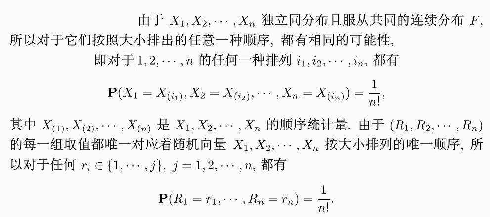
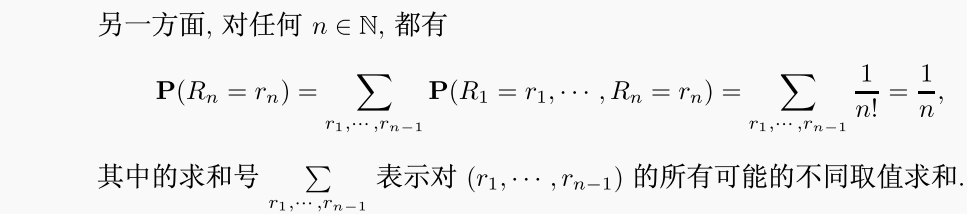
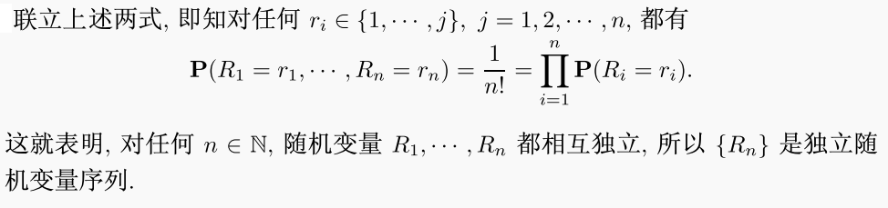

- 参数与参数空间
- 统计量（statistic）的定义
	- 设$X_{1}, X_{2},..., X_{n}$为随机样本，称随机变量的函数$T = T(X_{1}, X_{2},..., X_{n})$为一个统计量，
	- T可以为随机变量或随机向量，
	- T不能含有（未知）参数；即在样本值确定以后，统计量也需要为确定的量，
- 基于概率论的统计量
	- 样本矩
	  collapsed:: true
		- 基本概念
		  collapsed:: true
			- 设$X_{1}, X_{2},..., X_{n}$为样本，
			- 定义k阶样本（原点）矩为$a_{k} = \dfrac{1}{n}\sum  \limits _{i = 1}^{n}X_{i}^{k}$，
			- 定义k阶样本（中心）矩为$m_{k} = \dfrac{1}{n}\sum \limits _{i= 1}^{n}{({X}_{i} - \overline {X})}^{k}$；其中$\overline {X}$为样本均值，即$a_{1} = \dfrac{1}{n}\sum \limits _{i= 1}^{n} {X}_{i}$，
		- （性质）
		  collapsed:: true
			- 由大数定律，可知a_{k} \to EX^{k}，m_{k} \to E(X - EX)^{k}，
		- 样本均值
		  collapsed:: true
			- 定义$\overline {X} =  \dfrac{X_{1} + X_{2} +...+ X_{n}}{n} = \dfrac{1}{n}\sum \limits _{i= 1}^{n} {X}_{i}$，
			- 性质
			  collapsed:: true
				- $E\overline {X} = \mu$
				- $\operatorname{Var} \overline {X} = \dfrac{{\sigma}^{2}}{n}$
				  collapsed:: true
					- 若X_{i}不独立，但X_{i}间的协方差相同，则有$\operatorname{Var} \overline {X} = \dfrac{{\sigma}^{2}}{n} + \dfrac{n - 1}{n}\operatorname{Cov}[X_{i}, X_{j}]$，
					- 若协方差不同，则应按定义和方差性质计算，
				- $M_{\overline {X}}(t) = {[M_{X}(\dfrac{t}{n})]}^{n}$
		- 样本方差
		  collapsed:: true
			- 定义${S}^{2} = \dfrac{1}{n - 1}\sum \limits _{i= 1}^{n}{({X}_{i} - \overline {X})}^{2}$，
			  collapsed:: true
				- 不同于一般的中心矩，为了保证无偏性，样本方差的定义为$\dfrac{1}{n - 1}$，
				- 若均值已知，也可定义${S}_{\mu}^{2} = \dfrac{1}{n}\sum \limits _{i= 1}^{n}{({X}_{i} - \mu)}^{2}$，
				- 一般称n - 1为自由度，为“自由变化”的自变量个数，
				  collapsed:: true
					- 由样本的性质，可知$\sum \limits _{i= 1}^{n}({X}_{i} - \overline {X}) = 0$，
					- 因此当n - 1个样本值确定以后，剩余的一个样本值只能为确定的值，
			- 运算性质
			  collapsed:: true
				- $(n - 1){S}^{2} = \sum \limits _{i= 1}^{n}{({X}_{i} - \overline {X})}^{2} = \sum \limits _{i= 1}^{n}{X}_{i}^{2} - n {\overline {X}}^{2}$
				  id:: 62a7e942-115d-452f-bf98-4a49ce7cf572
				- $\min \sum \limits _{i= 1}^{n}{({X}_{i} - a)}^{2} = \sum \limits _{i= 1}^{n}{({X}_{i} - \overline {X})}^{2}$
			- 统计性质
			  collapsed:: true
				- $E{S}^{2} = {\sigma}^{2}$
				  collapsed:: true
					- $E{S}^{2} = \dfrac{1}{n - 1}\sum \limits _{i= 1}^{n}{({X}_{i} - \overline {X})}^{2} = \dfrac{1}{n - 1}\sum \limits _{i= 1}^{n}{({X}_{i} - EX + EX - \overline {X})}^{2}$，
					- $= \dfrac{1}{n - 1}\sum \limits _{i= 1}^{n}[{({X}_{i} - EX)}^{2} + 2({X}_{i} - EX)(EX - \overline {X}) + {(EX - \overline {X})}^2]$，
				- $\operatorname{Var} S^{2}$较难计算，
		- （样本协方差）
		  collapsed:: true
			- 一般用$\dfrac{1}{n}\sum \limits _{i= 1}^{n}{({X}_{i} - \overline {X})({Y}_{i} - \overline {Y})}$估计样本的协方差，
			- 同理，可定义样本相关系数$r = \dfrac{\sum \limits _{i= 1}^{n}{({X}_{i} - \overline {X})({Y}_{i} - \overline {Y})}}{\sqrt{\sum \limits _{i= 1}^{n}{({X}_{i} - \overline {X})}^{2}\sum \limits _{i= 1}^{n}{({Y}_{i} - \overline {Y})}^{2}}}$
		- 样本标准差
		  collapsed:: true
			- 定义为方差的正平方根，即$S = + \sqrt{{S}^{2}}$，
	- 特殊分布的性质
		- 特殊分布总体的基本统计量（样本均值,样本方差）具有特殊性质；此外，特殊分布一般也有专有的统计量，
		- 正态分布$X \sim N(\mu, {\sigma}^{2})$
			- 样本均值
			  collapsed:: true
				- $\overline {X} \sim N(\mu, \dfrac{{\sigma}^{2}}{n})$
				  collapsed:: true
					- ${\sigma}^{2}$未知时，$\dfrac{\overline {X} - {\mu}}{S / \sqrt{n}} \sim t(n - 1)$，
					- ${\sigma}^{2}$已知时，$\dfrac{\overline {X} - {\mu}}{{\sigma} / \sqrt{n}} \sim N(0, 1)$，
				- ${X}_{i} - \overline {X} \sim N(0, \dfrac{n - 1}{n}{\sigma}^{2})$，
				  collapsed:: true
					- ${X}_{i}$与$\overline {X}$*不独立*，应当拆分$\overline {X}$，再计算${X}_{i} - \overline {X}$的分布，
					- $\overline {X}$与每个${X}_{i} - \overline {X}$都独立；可进一步说明样本均值与样本方差（${X}_{i} - \overline {X}$的函数）独立，
					  id:: 62a7eec4-10a8-452a-ba4d-923e8e80625a
					- 但${X}_{i} - \overline {X}$*之间不独立*，
			- 样本方差（\chi^{2}统计量）
			  collapsed:: true
				- $\dfrac{(n - 1){S}^{2}}{{\sigma}^{2}} \sim \chi^{2}(n - 1)$，
				- 推广
				  collapsed:: true
					- ${S}^{2} \sim Ga(\dfrac{n - 1}{2}, \dfrac{n - 1}{2{\sigma}^{2}})$，
					- $\sum \limits _{i= 1}^{n}{({X}_{i} - \overline {X})}^{2} \sim Ga(\dfrac{n - 1}{2}, \dfrac{1}{2{\sigma}^{2}})$，
					  collapsed:: true
						- ${({X}_{i} - \overline {X})}^{2} \sim Ga(\dfrac{1}{2}, \dfrac{1}{2{\sigma}^{2}}\dfrac{n}{n - 1})$，
						- 然而，由于${X}_{i} - \overline {X}$*之间不独立*，所以不能直接推出$\sum \limits _{i= 1}^{n}{({X}_{i} - \overline {X})}^{2} \sim Ga(\dfrac{n - 1}{2}, \dfrac{1}{2{\sigma}^{2}})$，
					- $\sum \limits _{i= 1}^{n}{({X}_{i} - \mu)}^{2} \sim Ga(\dfrac{n}{2}, \dfrac{1}{2{\sigma}^{2}})$（\mu已知时），
					  collapsed:: true
						- ${({X}_{i} - \mu)}^{2} \sim Ga(\dfrac{1}{2}, \dfrac{1}{2{\sigma}^{2}})$，且${X}_{i} - \mu$之间独立，
				- \chi^{2}分布
				  collapsed:: true
					- 定义
					  collapsed:: true
						- 设随机变量 X 为n个独立同分布的*标准正态*变量的平方和，则称 X 的分布为自由度为n的\chi^{2}分布，
					- pdf的求解
					  collapsed:: true
						- 数学归纳法
						- 密度函数变换（n重积分）
						  collapsed:: true
							- 随机变量分析
							  collapsed:: true
								- 设X_{i}为标准正态分布随机变量，$Y = \sum \limits _{i= 1}^{n}{X}_{i}^{2}$，
								- 可知(X_{1}, X_{2},…,X_{n})的联合分布为n元标准正态分布：$f(X_{1}, X_{2}, \cdots, X_{n})={(2 \pi)^{-\frac{n}{2}}} {e}^{-\frac{1}{2}{x}^{T}I^{-1}{x}} = {(2 \pi)^{-\frac{n}{2}}} {e}^{-\frac{1}{2}\sum \limits _{i= 1}^{n}{X}_{i}^{2}}$，
							- 定义求解
							  collapsed:: true
								- $F_{Y}(y) = P(Y \le y) = P(\sum \limits _{i= 1}^{n}{X}_{i}^{2} \le y) = \int\cdots\int_{\sum \limits _{i= 1}^{n}{X}_{i}^{2} \le y} {(2 \pi)^{-\frac{n}{2}}} {e}^{-\frac{1}{2}\sum \limits _{i= 1}^{n}{X}_{i}^{2}} d\vec{x}$，
							- 球坐标变换
							  collapsed:: true
								- $F_{Y}(y) = \int\cdots\int_{{\rho}^{2} \le y} {(2 \pi)^{-\frac{n}{2}}} {e}^{-\frac{1}{2}{\rho}^{2}} \rho^{n-1}\sin^{n-2}\theta_{1}\sin^{n-3}\theta_{2}\cdots\sin^{2}\theta_{n-3}\sin\theta_{n-2}d\rho d\theta_{1}d\theta_{2}\cdots d\theta_{n-1}$
								- 可知区域$= \{0 \le \rho \le \sqrt{y}, 0 \le \theta_{1}, \cdots, \theta_{n-2} \le \pi，0 \le \theta_{n-1} \le 2\pi\}$，
							- 积分计算
							  collapsed:: true
								- 半径
								  collapsed:: true
									- $\int_{0}^{\sqrt{y}}(2 \pi)^{-\frac{n}{2}} {e}^{-\frac{1}{2}{\rho}^{2}} \rho^{n-1}d\rho$，
									- 换元t = \rho^{2}，则$\rho|_{0}^{\sqrt{y}} \to t|_{0}^{y}，dt = 2\rho d\rho$，
									- 即$\int_{0}^{{y}}(2 \pi)^{-\frac{n}{2}} {e}^{-\frac{t}{2}} t^{\frac{n}{2} - 1}d\rho$，
								- 三角函数
								  collapsed:: true
									- 由n重球体的体积求解，可知$C_{n} = \dfrac{n\pi^{\frac{n}{2}}}{\Gamma(\frac{n}{2}+1)} = \dfrac{2\pi^{\frac{n}{2}}}{\Gamma(\frac{n}{2})}$，
							- 所以$F_{Y}(y) = \int_{0}^{{y}}(2 \pi)^{-\frac{n}{2}} {e}^{-\frac{t}{2}} t^{\frac{n}{2} - 1}d\rho \cdot \dfrac{2\pi^{\frac{n}{2}}}{\Gamma(\frac{n}{2})} = \dfrac{{(\frac{1}{2})}^{\frac{n}{2}}}{\Gamma(\frac{n}{2})}\int_{0}^{{y}}t^{\frac{n}{2} - 1}{e}^{-\frac{t}{2}} d\rho$，
					- 与\Gamma分布的关系
					  collapsed:: true
						- 根据密度函数的形式，可知${\chi}^{2}(n) = Ga(\frac{n}{2}, {\frac{1}{2}})$，
			- 证明（多元正态分布）
			  collapsed:: true
				- 构造随机变量
				  collapsed:: true
					- 设样本$\vec{X} = (X_{1}, X_{2}, \cdots, X_{n})^{T}$，其中$X_{i} \sim N({\mu}, {\sigma}^{2})$，
					- 由X_{i}的独立性，可知$\vec{X} \sim N(\vec{\mu}, {\sigma}^{2}I_{n})$，
					- 设随机向量$\vec{Y} = (Y_{1}, Y_{2}, \cdots, Y_{n})^{T}$，
				- 随机变量的变换
					- 构造n阶正交矩阵Q，使Q的第一行所有元素全为$\frac{1}{\sqrt{n}}$，其余元素*任意*，
						- 即$\begin{pmatrix} \frac{1}{\sqrt{n}} & \cdots & \frac{1}{\sqrt{n}}\\ a_{21} & \cdots & \cdots \\ a_{31} & \cdots & a_{nn}\end{pmatrix}$，
					- 做变换$\vec{Y} = Q\vec{X}$，
					- 由多元正态分布的变换，可知随机向量$\vec{Y} \sim N (Q\vec{\mu}, Q^{T}\sigma^{2}I_{n}Q)$，即$N (Q\vec{\mu}, \sigma^{2}I_{n})$，
					- 可知Y_{i}之间仍相互独立，
					- 可求得$Y_{1} \sim N(\sqrt{n} \mu, \sigma^{2})，Y_{i} \sim N(0, \sigma^{2})$，
					  collapsed:: true
						- i \ne 1时，$\sum\limits_{k = 1}^{n}a_{ik} = \sqrt{n} \sum\limits_{k = 1}^{n}\dfrac{1}{\sqrt{n} } a_{ik}$，
						- 由于正交矩阵Q的行向量一定正交，所以可以说明其他行的元素$\sum\limits_{k = 1}^{n}a_{ik} = 0$，
						- 因此有$Y_{i} \sim N(0, \sigma^{2})$，
				- 统计量的分布
					- 样本均值
					  collapsed:: true
						- $Y_{1} = \sum \frac{1}{\sqrt{n}} X_{i} = {\sqrt{n}}\overline{X} \sim N(\sqrt{n} \mu, \sigma^{2})$，
						- 所以$\overline {X} \sim N(\mu, \dfrac{{\sigma}^{2}}{n})$，
					- 样本方差
					  collapsed:: true
						- 样本方差$(n - 1){S}^{2} = \sum \limits _{i= 1}^{n}{({X}_{i} - \overline {X})}^{2} = \sum \limits _{i= 1}^{n}{{X}_{i}}^{2} - n \overline {X}^{2}$；
						- 正交变换不改变向量长度，即$\sum\limits _{i= 1}^{n} X_{i}^{2} = \sum\limits _{i= 1}^{n} Y_{i}^{2}$，
						- 所以$(n - 1){S}^{2} = \sum\limits _{i= 2}^{n} Y_{i}^{2}$，
						- 由于$Y_{i} \sim N(0, \sigma^{2})$，且Y_{i}之间相互独立，
						- 所以$\dfrac{(n - 1){S}^{2}}{{\sigma}^{2}} \sim \chi^2(n - 1)$，
					- 独立性
					  collapsed:: true
						- 样本均值为Y_{1}的函数，样本方差为其余Y_{i}的函数，
						- Y_{i}之间相互独立，所以Y_{1}与Y_{i}的函数也独立，
						- 所以样本均值与样本方差独立，
					- 充分统计量
					  collapsed:: true
						- $\bar{X}$对X_{i}的充分性等价于Y_{1}对Y_{i}的充分性，
						- 由于Y_{i}之间相互独立，所以给定Y_{1}时Y_{i}的分布等同于(Y_{2}, Y_{3},…Y_{n})的分布，
						  id:: 6385be5d-87f5-4c8d-b3e9-481c6029c20d
						- 由于$Y_{i} \sim N(0, \sigma^{2})$，所以(Y_{2}, Y_{3},…Y_{n})的分布与参数μ无关，
			- t统计量
				- t分布
					- 定义
					  collapsed:: true
						- 设随机变量 X 为独立的标准正态分布统计量与\chi^{2}分布统计量的比值，
						- 称 X 的分布自由度为 n 的 t 分布，其中 n 为分母的\chi^{2}变量的自由度，
					- pdf的求解
					  collapsed:: true
						- 由于分子，分母的分布已知且独立，因此可直接由随机变量的商的密度公式求解，
				- 应用
				  collapsed:: true
					- 一般构造t分布的目的为寻找*均值*的估计，因此*方差*为*未知*参数，*不应出现在统计量内*，
					- 所以，构造t分布的关键一般是寻找合适的方差估计量，
					- 构造时也应考虑统计量的具体应用，
				- 《《构造
				  collapsed:: true
					- 单总体
					  collapsed:: true
						- 分子：$\dfrac{\overline {X} - {\mu}} {{\sigma}/{\sqrt{n}}} \sim N(0, 1)$
						- 分母：$\dfrac{(n - 1) {S}^{2}}{{\sigma}^{2}} \sim {\chi}^{2}(n - 1)$
						- t统计量：$t = \dfrac{\overline {X} - {\mu}}{{S}/{\sqrt{n}}} \sim t(n - 1)$
					- 双总体$X_{n} \sim N(\mu_{1},{\sigma}_{1}^{2})$，$Y_{m} \sim N(\mu_{2},{\sigma}_{2}^{2})$
					  collapsed:: true
						- 样本数成比例，m = kn
						  collapsed:: true
							- 可以将Y分为n组，每组k个，
							- 构造随机变量$Z_{i} = X_{i} - \dfrac{1}{k}\sum\limits_{j= 1}^{k} {Y}_{k(i - 1) + j}$，
							  collapsed:: true
								- 可知$Z \sim N(\mu_{1} - \mu_{2}, {\sigma}_{1}^{2} + \dfrac{{\sigma}_{2}^{2}}{k})$，$\overline {Z} \sim N(\mu_{1} - \mu_{2}, \dfrac{{\sigma}_{1}^{2}}{n} + \dfrac{{\sigma}_{2}^{2}}{nk})$
							- 分子：$\dfrac{\overline {Z} - {(\mu_{1} - \mu_{2})}} {\sqrt{\dfrac{{\sigma}_{1}^{2}}{n} + \dfrac{{\sigma}_{2}^{2}}{nk}}} \sim N(0, 1)$
							- 分母：$\dfrac{(n - 1) {S}_{Z}^{2}}{{\sigma}_{1}^{2} + \dfrac{{\sigma}_{2}^{2}}{k}} \sim {\chi}^{2}(n - 1)$
							  collapsed:: true
								- S_{Z}^{2}为Z的方差，即$\dfrac{1}{n - 1}\sum \limits _{i= 1}^{n}{({Z}_{i} - \overline {Z})}^{2}$，
							- t统计量：$t = \dfrac{\overline {Z} - {\mu}}{{S}_{Z}/{\sqrt{n}}} \sim t(n - 1)$，
						- （样本数相同，k = 1）
						- 方差成比例，${\sigma}^{2} = {\sigma}_{1}^{2} = \dfrac{1}{c}{\sigma}_{2}^{2}$
						  collapsed:: true
							- 推导
							  collapsed:: true
								- 总体分布与样本数
								  collapsed:: true
									- $X_{n_{1}} \sim N(\mu_{1},{\sigma}^{2})$，$Y_{n_{2}} \sim N(\mu_{2},c{\sigma}^{2})$
								- 需要的统计量：$\overline {X} - \overline {Y}$
								- 分子统计量
								  collapsed:: true
									- $\overline {X} \sim N(\mu_{1},\dfrac{{\sigma}^{2}}{{n_{1}}})$，$\overline {Y} \sim N(\mu_{2},\dfrac{c{\sigma}^{2}}{{n_{1}}})$
								- 统计量的分布
								  collapsed:: true
									- $\overline {X} - \overline {Y} \sim N(\mu_{1} - \mu_{2},\dfrac{{\sigma}^{2}}{{n_{1}}}+ \dfrac{c{\sigma}^{2}}{{n_{2}}})$
									- 正态分布的可加性，
								- 构造标准正态分布
								  collapsed:: true
									- $\dfrac{(\overline {X} - \overline {Y}) - (\mu_{1} - \mu_{2})}{{\sigma}\sqrt{\dfrac{1}{{n_{1}}}+ \dfrac{c}{{n_{2}}}}} \sim N(0, 1)$
								- 分母统计量
								  collapsed:: true
									- $\dfrac{({n}_{1} - 1) {S}_{X}^{2}}{{\sigma}^{2}} \sim {\chi}^{2}({n}_{1} - 1)$
									- $\dfrac{({n}_{2} - 1) {S}_{Y}^{2}}{c{\sigma}^{2}} \sim {\chi}^{2}({n}_{2} - 1)$
								- 构造分母统计量
								  collapsed:: true
									- $\dfrac{1}{{\sigma}^{2}}({({n}_{1} - 1) {S}_{X}^{2}} + \dfrac{({n}_{2} - 1) {S}_{Y}^{2}}{c}) \sim {\chi}^{2}({n}_{1} + {n}_{2} - 2)$，
									- \chi^{2}分布的可加性，
								- 方差的估计
								  collapsed:: true
									- 方差\sigma^{2}的无偏估计为联合样本方差$S_{\omega}^{2} = \dfrac{{({n}_{1} - 1) {S}_{X}^{2}} + \dfrac{({n}_{2} - 1) {S}_{Y}^{2}}{c}}{{n}_{1} + {n}_{2} - 2}$，
									  collapsed:: true
										- 由卡方分布的期望值，可以推出$E[\dfrac{1}{{\sigma}^{2}}({({n}_{1} - 1) {S}_{X}^{2}} + \dfrac{({n}_{2} - 1) {S}_{Y}^{2}}{c})] = {n}_{1} + {n}_{2} - 2$，
										- 即$E[\dfrac{{({n}_{1} - 1) {S}_{X}^{2}} + \dfrac{({n}_{2} - 1) {S}_{Y}^{2}}{c}}{{n}_{1} + {n}_{2} - 2}] = {\sigma}^{2}$，
									- 方差\sigma^{2}的mle为$\dfrac{{({n}_{1} - 1) {S}_{X}^{2}} + \dfrac{({n}_{2} - 1) {S}_{Y}^{2}}{c}}{{n}_{1} + {n}_{2}}$，即为有偏估计，
								- 构造t统计量
								  collapsed:: true
									- $t = \dfrac{\dfrac{(\overline {X} - \overline {Y}) - (\mu_{1} - \mu_{2})}{{\sigma}\sqrt{\dfrac{1}{{n_{1}}}+ \dfrac{c}{{n_{2}}}}}}{\sqrt{\dfrac{\dfrac{1}{{\sigma}^{2}}({({n}_{1} - 1) {S}_{X}^{2}} + \dfrac{({n}_{2} - 1) {S}_{Y}^{2}}{c})}{({n}_{1} + {n}_{2} - 2)}}} = \dfrac{{(\overline {X} - \overline {Y}) - (\mu_{1} - \mu_{2})}}{\sqrt{\dfrac{1}{{n_{1}}}+ \dfrac{c}{{n_{2}}}}{\sqrt{\dfrac{({({n}_{1} - 1) {S}_{X}^{2}} + \dfrac{({n}_{2} - 1) {S}_{Y}^{2}}{c})}{({n}_{1} + {n}_{2} - 2)}}}}\sim t(n - 1)$
							- t统计量$t = \dfrac{{(\overline {X} - \overline {Y}) - (\mu_{1} - \mu_{2})}}{\sqrt{\dfrac{1}{{n_{1}}}+ \dfrac{c}{{n_{2}}}}{\sqrt{\dfrac{({({n}_{1} - 1) {S}_{X}^{2}} + \dfrac{({n}_{2} - 1) {S}_{Y}^{2}}{c})}{({n}_{1} + {n}_{2} - 2)}}}}\sim t({n}_{1} + {n}_{2} - 2)$
						- 方差相等，c = 1
						  collapsed:: true
							- t统计量可简化为$t = \dfrac{{(\overline {X} - \overline {Y}) - (\mu_{1} - \mu_{2})}}{\sqrt{\dfrac{1}{{n_{1}}}+ \dfrac{1}{{n_{2}}}}{{S}_{P}}} \sim t({n}_{1} + {n}_{2} - 2)$，
							- 其中${S}_{P}^{2} = {{\dfrac{{({n}_{1} - 1) {S}_{X}^{2}} + {({n}_{2} - 1) {S}_{Y}^{2}}}{{n}_{1} + {n}_{2} - 2}}} = \dfrac{\sum \limits _{i= 1}^{{n}_{1}}{({X}_{i} - \overline {X})}^{2} + \sum \limits _{j= 1}^{{n}_{2}}{({Y}_{j} - \overline {Y})}^{2}}{{n}_{1} + {n}_{2} - 2}$，称为联合方差统计量，
						- 方差未知（Behrens - Fisher）
						  collapsed:: true
							- 大样本方法
							  collapsed:: true
								- 即$U = \dfrac{{(\overline {X} - \overline {Y}) - (\mu_{1} - \mu_{2})}}{\sqrt{\dfrac{{S}^{2}_{X}}{{n_{1}}}+ \dfrac{{S}^{2}_{Y}}{{n_{2}}}}{}} \stackrel{D} {\rightarrow}  N(0, 1)$，
							- Welch
							  collapsed:: true
								- 统计量$T_{*} = \dfrac{{(\overline {X} - \overline {Y}) - (\mu_{1} - \mu_{2})}}{{\sqrt{\dfrac{{S}^{2}_{X}}{{n_{1}}}+ \dfrac{{S}^{2}_{Y}}{{n_{2}}}}{}}}\stackrel{D} {\rightarrow}  t(r)$，
								- 自由度 r 的近似取值为 ，
					- 二元正态分布$(X,Y) \sim N(\mu_{1},\mu_{2},\sigma_{1}^{2},\sigma_{2}^{2},\rho)$
					  collapsed:: true
						- 构造随机变量$W = X - Y$，
						- 推导
						  collapsed:: true
							- W的分布
							  collapsed:: true
								- 由二元正态的性质，可知$W \sim N(\mu_{1} - \mu_{2}, \sigma_{1}^{2} + \sigma_{2}^{2} - 2\rho\sigma_{1}^{2}\sigma_{2}^{2})$
							- 统计量的分布
							  collapsed:: true
								- $\overline {W} \sim N(\mu_{1} - \mu_{2}, \dfrac{\sigma_{1}^{2} + \sigma_{2}^{2} - 2\rho\sigma_{1}^{2}\sigma_{2}^{2}}{n})$，
								- $\dfrac{(n - 1){S}^{2}_{W}}{\sigma_{1}^{2} + \sigma_{2}^{2} - 2\rho\sigma_{1}^{2}\sigma_{2}^{2}} \sim {\chi}^{2}(n - 1)$，
							- （W的方差）
							  collapsed:: true
								- ${S}_{W}^{2} = \dfrac{1}{n - 1}\sum \limits _{i= 1}^{n}{({W}_{i} - \overline {W})}^{2}$
								- 其中，${W}_{i} - \overline {W} = {X}_{i}- {Y}_{i} - (\overline {X} - \overline {Y}) = ({X}_{i} - \overline {X}) - ({Y}_{i} - \overline {Y})$
								- 所以${S}_{W}^{2} = \dfrac{1}{n - 1}\sum \limits _{i= 1}^{n}{[({X}_{i} - \overline {X}) - ({Y}_{i} - \overline {Y})]}^{2}$，
								- 拆分括号，可得${S}_{W}^{2} = {S}_{X}^{2} + {S}_{Y}^{2} - 2\dfrac{\sum \limits _{i= 1}^{n}{({X}_{i} - \overline {X})({Y}_{i} - \overline {Y})}}{n - 1}$，
							- t统计量的分子
							  collapsed:: true
								- $\dfrac{\overline {W} - (\mu_{1} - \mu_{2})}{\sqrt{\dfrac{\sigma_{1}^{2} + \sigma_{2}^{2} - 2\rho\sigma_{1}^{2}\sigma_{2}^{2}}{n}}} \sim N(0, 1)$，
							- t统计量的分母
							  collapsed:: true
								- $\sqrt{\dfrac{{S}^{2}_{W}}{\sigma_{1}^{2} + \sigma_{2}^{2} - 2\rho\sigma_{1}^{2}\sigma_{2}^{2}}}$，
						- t统计量$t = \dfrac{\overline {W} - {(\mu_{1} - \mu_{2})}}{{S}_{W}/{\sqrt{n}}} \sim t(n - 1)$
			- F统计量
				- F分布
				  collapsed:: true
					- 定义
					  collapsed:: true
						- 设随机变量 X 为两个独立的\chi^{2}分布统计量的比值，
						- 称 X 的分布为自由度为m，n的 F 分布，其中m，n分别为分子和分母的\chi^{2}变量自由度，
					- pdf的求解
					  collapsed:: true
						- 由于分子，分母的分布已知且独立，因此可直接由随机变量的商的密度公式求解，
				- 应用
				  collapsed:: true
					- 一般用于比较两个正态总体的方差，
				- 构造
				  collapsed:: true
					- 双总体$X_{n} \sim N(\mu_{1},{\sigma}_{1}^{2})$，$Y_{m} \sim N(\mu_{2},{\sigma}_{2}^{2})$
					- 统计量的分布
					  collapsed:: true
						- $\dfrac{(n - 1) {S}_{X}^{2}}{{\sigma}_{1}^{2}} \sim {\chi}^{2}(n - 1)$
						- $\dfrac{(m - 1) {S}_{Y}^{2}}{{\sigma}_{2}^{2}} \sim {\chi}^{2}(m - 1)$
					- F统计量
					  collapsed:: true
						- $F = \dfrac{\dfrac{(n - 1) {S}_{X}^{2}}{{\sigma}_{1}^{2}} / (n - 1)}{\dfrac{(m - 1) {S}_{Y}^{2}}{{\sigma}_{2}^{2}} / (m - 1)} = \dfrac{{S}_{X}^{2}}{{S}_{Y}^{2}} \cdot \dfrac{{\sigma}_{2}^{2}}{{\sigma}_{1}^{2}} \sim F(n - 1, m - 1)$
			- 推广
				- 非中心\chi^{2}分布
				  collapsed:: true
					- 定义
						- 设随机变量X_{i}之间独立同方差，即$X \sim N(a_{i}, 1)$，
						- 设统计量$Y = \sum\limits_{i = 1}^{n}X_{i}^{2}$，
						- 称 Y 的分布为自由度为n，非中心参数$\delta = \sqrt{\sum\limits_{i = 1}^{n}a_{i}^{2}} = \sqrt{a_{i}^{T}a_{i}}$的\chi^{2}分布，
					- pdf的求解
					  collapsed:: true
						- 类似求解样本方差的分布，
						- 构造n阶正交矩阵$Q = \begin{pmatrix} \dfrac{\sqrt{\sum\limits_{i = 1}^{n}a_{i}^{2}}}{a_{1}} & \dfrac{\sqrt{\sum\limits_{i = 1}^{n}a_{i}^{2}}}{a_{2}} & \cdots & \dfrac{\sqrt{\sum\limits_{i = 1}^{n}a_{i}^{2}}}{a_{n}} \\ \cdots &  & & \\\cdots & & & \\ \cdots & & &\ \end{pmatrix}$，其余元素*任意*，
						- 构造正交变换$\begin{pmatrix} X_{1} \\ X_{2} \\ \vdots \\ X_{n} \end{pmatrix} \to \begin{pmatrix} Y_{1} \\ Y_{2} \\ \vdots \\ Y_{n} \end{pmatrix}$，即$\vec{Y} = Q\vec{X}$，且Y_{1} \sim N(\delta, 1)，Y_{j} \sim N(0, 1)，
						- 由正交变换的性质，可知$\sum\limits _{i= 1}^{n} X_{i}^{2} = \sum\limits _{i= 1}^{n} Y_{i}^{2}$，因此$\sum\limits _{i= 1}^{n} X_{i}^{2}$的密度函数就是$\sum\limits _{i= 1}^{n} Y_{i}^{2}$的密度函数，
						- 由于$\sum\limits _{i= 2}^{n} Y_{i}^{2} \sim \chi^{2}(n - 1)$，Y_{1} \sim N(\delta, 1)，且两者独立，
						- 因此经较复杂的计算可算得非中心\chi^{2}分布的pdf，
					- 特征函数的求解
					  collapsed:: true
						- $M_{Y}(t) = E(e^{tY}) = E(e^{t\sum\limits_{i = 1}^{n}X_{i}^{2}}) = \prod\limits_{i = 1}^{n}E(e^{tX_{i}^{2}})$，
						- 其中$E(e^{tX_{i}^{2}}) = \int_{-\infty}^{+\infty} \dfrac{1}{\sqrt{2\pi}} e^{tX_{i}^{2}}e^{-\frac{(X_{i} - a_{i})^{2}}{2}}dX_{i}$，
						- 凑正态分布（尽量使用乘除变量代换，避免使用加减），
						- 可得$E(e^{tX_{i}^{2}}) = \dfrac{1}{\sqrt{1 - 2t}} e^{\frac{t a_{i}^{2}}{1- 2t}}$，
						- 所以$M_{Y}(t) = \dfrac{1}{\sqrt{(1 - 2t)^{n}}} e^{\frac{t \sum\limits_{i = 1}^{n}a_{i}^{2}}{1- 2t}} = \dfrac{1}{\sqrt{(1 - 2t)^{n}}} e^{\frac{t {\delta}^{2}}{1- 2t}}$，
					- 多层模型
					  collapsed:: true
						- 非中心\chi^{2}分布可以看成\chi^{2}分布和泊松分布的混合分布，
						- 即其pdf的形式为$f_{y}(y) = \sum\limits_{k = 0}^{+\infty}P(K = k)\cdot \chi^{2}_{n + 2k}(y)$，
						- 则Y有多层模型X|K，其中$X \sim {\chi}^{2}(n + 2k)，K \sim P(\dfrac{\delta^{2}}{2})$，
						- 也可算得$EX = E[E_{X}(X | K)] = E_{K}[n + 2K] = n + 2EK = n + \delta^{2}$，
					- 应用
					  collapsed:: true
						- 数字特征：EY = n + \delta^{2}，Var Y = 2n + 4\delta^{2}，
						- 可加性
						  collapsed:: true
							- 若Y_{i}相互独立，且均为非中心\chi^{2}分布，Y_{i} \sim \chi^{2}(n_{i}, \delta_{i})；
							- 则$\sum\limits_{i = 1}^{k} Y_{i} \sim \chi^{2}(n_{k}, \delta_{k})，n_{k} = \sum\limits_{i = 1}^{k}n_{i}，\delta_{k} = \sqrt{\sum\limits_{i = 1}^{n}{\delta}_{i}^{2}}$
				- 非中心t分布
					- 定义
					  collapsed:: true
						- 设随机变量 Y 为独立的正态分布统计量（分布为N(\delta, 1)）与\chi^{2}分布统计量的比值，
						- 称 Y 的分布自由度为 n ，非中心参数为\delta的 t 分布，
					- 性质
					  collapsed:: true
						- EY$= \delta(\frac{n}{2})^{\frac{1}{2}}\dfrac{\Gamma(\frac{n - 1}{2})}{\Gamma(\frac{n}{2})}(n \ge 2)$
						- VarY$= \dfrac{n(1 + \delta^{2})}{n - 2} - (EY)^{2}(n \ge 3)$
				- 非中心F分布
					- 定义
					  collapsed:: true
						- 设随机变量 F 为两个独立的\chi^{2}分布统计量的比值，分子为非中心\chi^{2}分布，分母为\chi^{2}分布，
						- 称 X 的分布为自由度为m，n，非中心参数为\delta的 F 分布，
						- 其中m，n分别为分子和分母的\chi^{2}变量自由度，\delta为分子的\chi^{2}分布统计量的非中心参数，
		- 位置族指数分布$X \sim Exp(\lambda) + \mu$
		  collapsed:: true
			- 设$X_{1}, X_{2},..., X_{n}$为样本，$Y_{1}, Y_{2},..., Y_{n}$为次序统计量，
			- 样本统计量
			  collapsed:: true
				- ${S} = \sum \limits _{i= 1}^{n} ({Y}_{i} - {Y}_{1}) = \sum \limits _{i= 1}^{n}{X}_{i} - n{Y}_{1}$
				- ${S}_{r} = \sum \limits _{i= 1}^{r} ({Y}_{i} - {Y}_{1}) + (n - r)({Y}_{r} - {Y}_{1}) = \sum \limits _{i= 1}^{r}{Y}_{i} + (n - r){Y}_{r} - n{Y}_{1}$
			- 统计量的性质
			  collapsed:: true
				- $S \sim Ga(n - 1, {\lambda})$，
				- ${S}_{r} \sim Ga(r - 1, {\lambda})$，
				- ${Y}_{1} \sim Exp(n\lambda) + \mu$，
				- Y_{1}与S，S_{r}独立，
		- 均匀分布$X \sim U(a, b)$
		  collapsed:: true
			- 设$X_{1}, X_{2},..., X_{n}$为样本，Y_{1}为最小次序统计量，Y_{n}为最大次序统计量，
			- 则$Z_{1} = \dfrac{Y_1 - a}{b - a} \sim \Beta(1, n)$，$Z_{n} = \dfrac{Y_n - a}{b - a} \sim \Beta(n, 1)$，
	- 样本次序统计量（order statistic）
		- 定义
		  collapsed:: true
			- 设$X_{1}, X_{2},..., X_{n}$为样本，称将样本*按大小升序*排列的随机变量$Y_{1}, Y_{2},..., Y_{n}$为次序统计量，
			- Y_{i}仍为随机变量，但总有$Y_{1} \leq Y_{2} \leq...\leq Y_{n}$，
		- 分布
			- 分布推导
			  collapsed:: true
				- 基于概率和二项分布
				  collapsed:: true
					- 设Y_{i}为第i个次序统计量，y为常数
					- 按照次序统计量的定义，
					- 事件y < Y_{i} < y +dy等价于X_{1}，…X_{n}中有i - 1个在(-\infty, y]，一个在(y, y +dy]， n - i个在(y + dy, +\infty)，
					- 所以由三项分布，$P(y < Y_{i} < y +dy) = \dfrac{n!}{(i - 1)!1!(n - i)!}{[F_X({y})]^{i - 1}} [f_{X}({y})dy] {[1 - F_X({y})]^{n - i}}$，
					- 令*dy → 0*，可得$f(y_{i}) = \dfrac{n!}{(i - 1)!(n - i)!}{[F_X({y})]^{i - 1}} f_{X}({y}) {[1 - F_X({y})]^{n - i}}$
				- 基于二项分布
				  collapsed:: true
					- F_{m}(y_{m}) = P(Y_{m} \le y) = P(*至少*有m个样本 < y)，
					  collapsed:: true
						- 由于次序统计量按顺序排列，因此事件{只有m + k个样本 < y}发生时，一定也有{Y_{m} \le y}，
						- 因此，事件{只有m个样本 < y}是事件{Y_{m} \le y}的一个子事件，
						- 而{Y_{m} \le y}对应的事件的整体应该为{至少有m个样本 < y}，
					- P(*至少*有m个样本 < y) = $\sum \limits _{i = m}^{n}$P(*只有* i 个样本 < y)，
					- 事件{只有i个样本 < y}，可以用二项分布表述，
					- 即P{只有i个样本 < y} = ${n \choose i}{[F_X({y})]^{i}}{[1 - F_X({y})]^{n - i}}$，
					- 所以$F_{m}(y_{m}) = \sum \limits _{i = m}^{n}{n \choose i}{[F_X({y})]^{i}}{[1 - F_X({y})]^{n - i}}$，
					- 根据二项分布与贝塔分布的关系，
					- 可知$F_{m}(y_{m}) = \dfrac{n!}{(m - 1)!(n -m)!}\int_{0}^{F_{X}(y)}t^{m - 1}{(1 - t)}^{n - m}dt$，
					- 两侧求导，可得pdf：$f_{m}(y_{m}) = \dfrac{n!}{(m - 1)!(n -m)!}[F_{X}(y_{m})]^{m - 1}{[1 - F_{X}(y_{m})]}^{n - m}f_{x}(y_{m})$，
				- 基于联合分布的积分
				  collapsed:: true
					- 联合分布
					  collapsed:: true
						- n个次序统计量的联合分布为：$f(y_{1},y_{2},...,y_{n}) = {n!}f_{X}({y}_{1})f_{X}({y}_{2})...f_{X}({y}_{n})$；支集Y_{1} < Y_{2} < …< Y_{n}，
					- n重积分的计算
					  collapsed:: true
						- 设X的支集为(a, b)，a, b \in R
						- 则$\int \cdots \int_{a < x_{1} < \cdots < x_{n} < b} f(x_{1})\cdots f(x_{n})dx_{1} \cdots dx_{n} = \dfrac{1}{n!}[F(b) - F(a)]^{n}$，
						  collapsed:: true
							- 证明（数学归纳法）
							- 数学归纳法的关键在于寻找类似的格式，
							- 此处x_{2}的积分限为$\int_{x_{1}}^{b}$，所以应将*后n - 1个*积分写为$\dfrac{1}{(n - 1)!}(\int_{x_{1}}^{b}f(t)dt)^{n - 1}$的形式，
					- 对其余变量积分，即可得到需求的变量的边缘分布，
					  collapsed:: true
						- 示例：5个样本的情况，希望求解y_{2}, y_{4}的联合分布，
						- 次序统计量的联合分布为：$f(y_{1},y_{2},y_{3},y_{4},y_{5}) = {5!}f_{X}({y}_{1})f_{X}({y}_{2})f_{X}({y}_{3})f_{X}({y}_{4})f_{X}({y}_{5})$，
						- 对y_{1}, y_{3}, y_{5}积分，即$\int_{a < y_{1} < y_{2} < y_{3} < y_{4} < y_{5} < b}{5!}f_{X}({y}_{1})f_{X}({y}_{2})f_{X}({y}_{3})f_{X}({y}_{4})f_{X}({y}_{5})dy_{1}dy_{3}dy_{5}$，
						- 由于y_{2}, y_{4}不是积分变量（即可以看作常量），因此可将积分*拆为累次积分*$= {5!}\int_{a < y_{1} < y_{2}}f_{X}({y}_{1})dy_{1} \cdot f_{X}({y}_{2}) \cdot \int_{y_{2} < y_{3} < y_{4}}f_{X}({y}_{3})dy_{3} \cdot f_{X}({y}_{4}) \cdot \int_{y_{4} < y_{5} < b}f_{X}({y}_{5})dy_{5}$，
						- 积分得到原式$= 5![F_{X}(y_{2}) - 0] f_{X}({y}_{2})[F_{X}(y_{4}) - F_{X}(y_{2})] f_{X}({y}_{4})[1 - F_{X}(y_{4})]$，
			- 《《分布函数
			  collapsed:: true
				- 一般情况
				  collapsed:: true
					- 单个：$f_{r}(y_{r}) = \dfrac{n!}{(r - 1)!(n - r)!}{[F_X({y}_{r})]^{r - 1}}f_{X}({y}_{r}){[1 - F_X({y}_{r})]^{n - r}}$；支集与原统计量相同，
					- 两个：$f_{ij}(y_{i}, y_{j}) = \dfrac{n!}{(i - 1)!(j - i - 1)!(n - j)!}{[F_X({y}_{i})]^{i - 1}}f_{X}({y}_{i}){[F_X({y}_{j}) - F_X({y}_{i})]^{j - i - 1}}f_{X}({y}_{j}){[1 - F_X({y}_{j})]^{n - j}}$；支集Y_{i} < Y_{j}，
					- 前r个：$f(y_{1},y_{2},...,y_{r}) = \dfrac{n!}{(n - r)!} f_{X}({y}_{1})f_{X}({y}_{2})...f_{X}({y}_{r}){[1 - F_X({y}_{r})]^{n - r}}$；支集Y_{1} < Y_{2} < …< Y_{r}，
					- 所有：$f(y_{1},y_{2},...,y_{n}) = {n!}f_{X}({y}_{1})f_{X}({y}_{2})...f_{X}({y}_{n})$；支集Y_{1} < Y_{2} < …< Y_{n}，
				- 常用
					- 最小次序统计量：$f(y_{1}) = n{[1 - F_X({y}_{1})]^{n - 1}}f_{X}({y}_{1})$，
					- 最大次序统计量：$f(y_{n}) = n{[F_X({y}_{n})]^{n - 1}}f_{X}({y}_{n})$，
					- 最小值与最大值的联合分布：$f(y_{1}, y_{n}) = n(n - 1){[F_X({y}_{n}) - F_X({y}_{1})]^{n - 2}}f_{X}({y}_{1})f_{X}({y}_{n})$，
			- 离散分布次序统计量
			  collapsed:: true
				- 示例
				  collapsed:: true
					- 设总体X为离散均匀分布，即$p_{X}(x) = P(X = x) = \frac{1}{\theta}$，
					  collapsed:: true
						- 其中$X = 1, 2,..., \theta; \theta \in N^{+}$；
					- $X_{1}, X_{2},..., X_{n}$为样本，
					- 最大次序统计量（定义）
					  collapsed:: true
						- $Y_{n} = \max(X_{1}, X_{2},..., X_{n})$，
					- X的分布函数（定义）
					  collapsed:: true
						- $F_X(x) = P(X \leq x) = \sum \limits _{i= 1}^{x}P(X = i) = \frac{x}{\theta}$，
					- Y的分布函数（定义）
					  collapsed:: true
						- $F_Y(y) = P(Y \leq y) = P(\max(X_{1}, X_{2},..., X_{n}) \leq y) = P(X_{1}\leq y, X_{2}\leq y,..., X_{n} \leq y)$，
						- 由独立性，可得$P(X_{1}\leq y)P(X_{2}\leq y)...P(X_{n}\leq y) = {[P(X \leq y)]}^{n}$，
						- 因此，$F_Y(y) = P(Y \leq y) = {(\frac{y}{\theta})}^{n}$，
					- Y的密度函数（定义）
					  collapsed:: true
						- $p_{Y}(y) = P(Y = y) = P(Y \leq y) - P(Y \leq y - 1) = {(\frac{y}{\theta})}^{n} - {(\frac{y - 1}{\theta})}^{n}$，
		- 性质
		  collapsed:: true
			- 次序统计量与总体*不同分布*，数字特征也不相同；
			- 每个次序统计量的支集都与总体相同，但多个次序统计量的联合分布中，应注意次序统计量之间的大小关系，
		- 次序统计量的函数
		  collapsed:: true
			- 极差（range）
			  collapsed:: true
				- 定义：R = Y_{n}  - Y_{1}，
				- 求解
				  collapsed:: true
					- 任意两个次序统计量的联合分布已知，因此一般以此为出发点，
					- 为了构造一一变换，设辅助随机变量Z = Y_{1}，
					- 则变换(Y_{1}, Y_{n}) \to (R, Z)为一一变换，
					  collapsed:: true
						- 变换方式为$\begin{cases}  R = Y_{n} - Y_{1}\\ Z = Y_{1} \end{cases}$，
						- 逆变换为$\begin{cases}  Y_{n} = Z + R \\ Y_{1} = Z \end{cases}$，
						- 其Jacobi行列式|J| = 1，
					- 直接带入$f_{1n}(y_{1}, y_{n}) = \dfrac{n!}{(n - 2)!}f_{X}({y}_{n}){[F_X({y}_{n}) - F_X({y}_{1})]^{n - 2}}f_{X}({y}_{1})$，
					- 再根据具体分布对Z积分，即可得到R的分布，
				- 特例
				  collapsed:: true
					- 若X_{i} \sim U(0, 1)，则$f_{R}(t) = n(n - 1)(1 - t)t^{n - 2}I_{\{0 \le t \le 1\}}$，
			- 样本中位数（median）
			  collapsed:: true
				- 定义：$M = \begin{cases}  Y_{\frac{n + 1}{2}} & n = 2k + 1 \\ \dfrac{Y_{\frac{n}{2}} + Y_{\frac{n}{2} + 1}}{2} & n = 2k \end{cases}$
				- n = 2k+1时，可直接带入单个次序统计量的函数求解；而n = 2k时可以以任意两个次序统计量的联合分布为出发点，并增补变量构造一一变换求解，
				- 特例
			- 样本p分位数
			  collapsed:: true
				- 引理：对于次序统计量$Y_{p(n+1)}$，有$E(F_X[Y_{p(n+1)}] )=E(g[Y_{p(n+1)}])= p$，
				- 所以称次序统计量$Y_{p(n+1)}$为样本p分位数，
			- （中程数）
			  collapsed:: true
				- $V = \dfrac{Y_1 + Y_n}{2}$
		- 经验分布函数
		  collapsed:: true
			- 设X为总体，$X_{(1)}, X_{(2)},...,X_{(n)}$为*次序*统计量，
			- 定义$F_{n}(x) = \begin{cases}  0 & X < X_{(1)} \\ \dfrac{k}{n} &  X_{(k)} \leq X < X_{(k+1)} \\  1 & X_{(n)} \leq X \end{cases}$，
			- 经验分布函数为分段函数，
			- Glivenko-Cantelli 定理：经验分布函数（几乎处处）收敛于概率分布函数，即$F_{n}(x) \stackrel{D} {\rightarrow} F_{X}$，
	- 纪录值
	  collapsed:: true
		- 定义
		  collapsed:: true
			- 设$X_{1}, X_{2},..., X_{n}$为样本，
			- 若样本X_{n}的取值超过前面的所有样本，即$X_{n} = \max (X_{1}, X_{2},..., X_{n})$，则称X_{n}为一个纪录值，
			- 定义随机变量$I_{j} = \begin{cases}  1 & X_{j} = \max (X_{1}, X_{2},..., X_{j}) \\ 0 & 其它 \end{cases}$，表示X_{j}是否为记录值，
		- 概率分布
		  collapsed:: true
			- 由于样本为独立同分布，所以由对称性，可知$P(X_{k} = \max (X_{1}, X_{2},..., X_{j})) = \dfrac{1}{j}$，其中k \in [1, j]，
			- 因此$\begin{cases}  P(I_{j} = 1) = \dfrac{1}{j} \\ P(I_{j} = 0) = 1- \dfrac{1}{j} \end{cases}$，
			- 引理：随机变量I_{j}为独立同分布的随机变量，
		- 极限分布
		  collapsed:: true
			- 设$X_{1}, X_{2},..., X_{n}$为样本，Z_{n}为前 n 个变量中纪录值的出现次数，
			- 则$\dfrac{Z_{n} - \ln n}{\sqrt{\ln n}} \stackrel{D} {\rightarrow} N(0, 1)$，
	- 推广：样本的大小
	  collapsed:: true
		- 定义
		  collapsed:: true
			- 设$X_{1}, X_{2},..., X_{n}$为样本，
			- 定义随机变量$R_{n} = \sum\limits_{k = 1}^{n}I(X_{k} \ge X_{n})$，表示随机变量X_{n}在$X_{1}, X_{2},..., X_{n}$中处于第几大的位置，
			- R_{n}的支集为[1, n]，
			  collapsed:: true
				- 根据定义，可知总有I(X_{n} \ge X_{n}) = 1，
				- R_{n} = 1表明X_{n}最大，因为在求和的各个加项中只可能有I(X_{n} \ge X_{n}) = 1；
				- R_{n} = 2 意味着除了X_{n}自身之外，还存在一个加项I(X_{k} \ge X_{n}) = 1（对于连续情况，不用考虑变量相等），所以X_{n}是第二大，
				- R_{n} = n 则说明X_{n}是最小观测值，
			- 引理：$R_{1}, R_{2},…, R_{n}$的每一组取值都唯一决定了随机向量$X_{1}, X_{2},…, X_{n}$的大小顺序，
		- 概率分布
		  collapsed:: true
			- 定理（Renyi）：若$X_{1}, X_{2},…, X_{n}$独立同分布，则R_{j}为独立同分布的随机变量，且总有$P(R_{n} = k) = \dfrac{1}{n}$，
			- 即随机变量X_{j}排在所有n个观测值的*任意位置*的概率*都是*$\dfrac{1}{n}$，
			- 指定X_{j}的位置后，X_{k}排在所有n - 1个观测值的任意位置的概率*都是*$\dfrac{1}{n - 1}$，且两个*事件独立*，
		- （证明）
		  collapsed:: true
			- {:height 170, :width 370}
			- {:height 90, :width 370}
			- {:height 100, :width 370}
		- 示例
		  collapsed:: true
			- 设$X_{1}, X_{2},…, X_{n}$独立同分布，
			- 则在X_{n}个变量中，X_{1}是最小观测值等同于随机变量R_{1} = n，其概率为$\dfrac{1}{n}$，
			- X_{n}是最小观测值，X_{1}是第二小的观测值等同于随机变量R_{1} = n - 1，R_{n} = n；
			- 由于两个事件独立，所以其概率为$\dfrac{1}{n} \cdot \dfrac{1}{n - 1}$，
- 基于统计学的统计量
	- 充分统计量
		- 定义
		  collapsed:: true
			- 设$X \sim f(x ; \theta)$为总体，$\vec{X} = X_{1}, X_{2},..., X_{n}$为样本，
			  id:: 62abd5c6-d8c2-4278-8004-20e732e8ba24
			- 若样本$\vec{X}$在已知统计量$T(\vec{X})$取值时的条件分布与参数\theta无关，则称统计量T为参数\theta的充分统计量，
			- 即条件分布$f_{X|T}(x_{1}, x_{2},..., x_{n}|T) = \dfrac{f(x_{1}, x_{2},..., x_{n}, t)}{f_{T}(t)}$为参数\theta的常函数，
		- 求解
		  collapsed:: true
			- 定义（条件分布）
			  collapsed:: true
				- 按照定义，需要证明条件分布$f_{X|T}(x_{1}, x_{2},..., x_{n}|T)$不依赖于参数，
				- 先根据总体分布，写出*样本*$\vec{X}$的分布$f_{X}(x_{1}, x_{2},..., x_{n})$，
				- 再求解*统计量*T的分布$f_{T}(t)$，
				- 再求解*样本和统计量*的联合分布$f(x_{1}, x_{2},..., x_{n}, t)$，
				  collapsed:: true
					- 由于样本和统计量显然不独立，因此求解联合分布一般是最复杂的步骤，
					- 可以通过随机变量的变换，将样本和统计量变换为易于求联合分布的随机变量，如使随机变量之间*相互独立*，
					- 对于n个随机变量（样本），一般构造n \to n的一一变换易于求解；应注意变换后的随机变量的支集，
				- （引理：联合分布$f(x_{1}, x_{2},..., x_{n}, t)$可以写为$f(x_{1}, x_{2},..., x_{n})I\{x : T(\vec{x}) = t\}$），
				  collapsed:: true
					- 证明
					  collapsed:: true
						- 联合分布$f(x_{1}, x_{2},..., x_{n}, t) = f(x_{1}, x_{2},..., x_{n})f(t|x_{1}, x_{2},..., x_{n})$，
						- 而条件分布$f(t|x_{1}, x_{2},..., x_{n})$为退化分布，即对任意的$\vec{X} = \vec{x}$，统计量T的取值都一定为$t = T(\vec{x})$，
						- 因此有$f(t|x_{1}, x_{2},..., x_{n}) = \begin{cases}  1 & T(\vec{x}) = t \\ 0 & T(\vec{x}) \neq t \end{cases} = I\{x : T(\vec{x} = t)\}$，
					- 应用
					  collapsed:: true
						- 此处的示性函数$I\{x : T(\vec{x}) = t\}$可以看成对样本X_{i}的取值的限制，
						- 对于离散情况X \sim b(1, p)，设T = \sum X_{i}，
						- 则$P(X_{1} = x_{1}, X_{2} = x_{2},..., X_{n} = x_{n}, t =  \sum x_{i}) = P(X_{1} = x_{1}, X_{2} = x_{2},..., X_{n} = x_{n})I\{\sum x_{i} = t\}$，
						- 当\sum x_{i} \ne t时，概率为0，
						- 当\sum x_{i} = t时，事件“限定”为\sum x_{i} = t，
						- 所以一定有$P(X_{1} = x_{1}, X_{2} = x_{2},..., X_{n} = x_{n})I\{\sum x_{i} = t\} = p^{t}(1 - p)^{(n - t)}$，
				- 由定义，计算*条件分布*$f_{X|T}(x_{1}, x_{2},..., x_{n}|T) = \dfrac{f(x_{1}, x_{2},..., x_{n}, t)}{f_{T}(t)}$，
			- 因子分解定理（充要条件）
			  collapsed:: true
				- 若样本联合分布$f(x_{1}, x_{2},..., x_{n})$可写为$g(T(\vec{X}), \theta) \cdot h(\vec{X})$的形式；其中T为统计量（表达式不含参数\theta），$h(\vec{X})$为参数\theta的常函数，
				  id:: 62abea33-f9b1-4e3b-a7f0-d583e8e91a5b
				- 则T为参数\theta的充分统计量，
				- 可知，因子分解的关键为随机变量与参数可以“拆分”，
				- 若随机变量与参数为加减关系（如位置族f(X - \theta)），则充分统计量可能只能简化到次序统计量，
				- 注意事项
				  collapsed:: true
					- 此处的函数$g[T(\vec{X}), \theta]$一般*不是*T的分布函数，
					- 函数$h(\vec{X})$可以为1，
					- 参数\theta的函数c(\theta)可以写入函数$g(T(\vec{X}), \theta)$中，
					- 若随机变量的支集依赖于参数，应以示性函数的形式写在联合分布中，不能忽略，
			- 充分次序统计量
			  collapsed:: true
				- 部分情况下，充分统计量只能简化到次序统计量，
				- 因此，由定义和因子分解定理可能都难以求出形式较好的统计量，
				- 由联合分布可知，次序统计量一定为充分统计量，但一般不是极小充分统计量，
		- 性质
		  collapsed:: true
			- 一般充分统计量的数量与参数的数量相同，但也有其他情况，
			- 一般充分统计量应为*所有样本*的函数，
			- 充分统计量的*一一对应函数*也为充分统计量，即充分统计量不唯一，
			- 若充分统计量存在，且mle唯一存在，则mle一定为充分统计量的函数；其他情况下，mle不一定为充分统计量的函数，
	- 极小充分统计量
	  collapsed:: true
		- 定义
		  collapsed:: true
			- 设T'(X)为分布族F的充分统计量，
			- 若对于F的任一充分统计量T(X)，都存在函数\phi，使T'(X) = \phi(T(X))，则称T'(X)为极小充分统计量，
		- 求解
		  collapsed:: true
			- 定理：设样本的联合分布为$f_{X}(\vec{X}; \theta)$，若对于任意两个样本点$\vec{x_{1}}, \vec{x_{2}}$，比值$\dfrac{f_{X}(\vec{x_{1}}; \theta)}{f_{X}(\vec{x_{2}}; \theta)}$仅在某统计量$T(\vec{x_{1}}) = T(\vec{x_{2}})$时为参数\theta的常函数，且T为充分统计量，则T也为极小充分统计量，
			  id:: 62abeb78-9da7-4b04-88a0-9f7dac17c19d
		- 性质
		  collapsed:: true
			- 极小充分统计量的一一对应函数也为充分统计量，即极小充分统计量不唯一，
			- 由于极小充分统计量为充分统计量的函数，因此mle为充分统计量的函数时，mle为一个极小充分统计量，
	- 辅助统计量
	  collapsed:: true
		- 定义
		  collapsed:: true
			- 若统计量S(X)的分布与参数\theta无关，则称S(X)为辅助统计量，
		- 求解
		  collapsed:: true
			- 对于位置 - 尺度族辅助统计量，一般需要综合考虑总体的性质和统计量的性质，即关于位置 - 尺度族总体的位置 - 尺度族统计量为辅助统计量，
			- 对于其他统计量，也可直接由统计量的形式计算其cdf（概率P）的形式，
		- （辅助统计量的信息）
		  collapsed:: true
			- 例如，给定辅助统计量T2时充分统计量T1的条件分布，其条件均值一般不依赖于T2，但其方差可能受T2影响，即辅助统计量可以帮助分析参数θ的估计值的精度，
	- 完全统计量
	  collapsed:: true
		- 定义
		  collapsed:: true
			- 设T(X)为分布族F的统计量，\phi为可测函数，
			- 若对参数空间中的所有\theta，都有$E_\theta (\phi[T(X)]) = 0 \leftrightarrow \phi[T(X)] = 0$，则称T(X)为分布族F的完全统计量，
			  id:: 6321cd45-9681-4229-9e0d-049ce76187a2
			  collapsed:: true
				- 概念来自于函数的内积$\int f(x) \cdot g(x)dx$，和由此定义的函数的正交性，
				- 若f为一族函数，且只在g(x) \equiv 0时两者正交（内积为0），则称f为完全正交函数族，
		- 判断
		  collapsed:: true
			- 定义式（期望）
			  collapsed:: true
				- $E_\theta (\phi[T(X)]) = \int_{S_{T(X)}}\phi(T)f_{T}(t)dt = 0$，
				- 对离散变量，一般通过展开求和式分析，
				- 对连续变量，一般通过积分式两侧（对参数\theta）求导分析，
			- 寻找分布不依赖于θ的统计量Y
			  collapsed:: true
				- 求X的期望，寻找与参数θ的关系
				- 考虑位置 - 尺度族分布（支集依赖于θ），
				- 构造分段函数，
			- 完全性与分布族中参数的取值范围有关，
		- 定理
		  collapsed:: true
			- 若极小充分统计量存在，则任意完全统计量都是极小充分统计量，
			- 若分布族为指数族，且自然参数空间“作为R^{k}的子集有内点”，则指数族中的统计量K(X)为完全统计量，
			- 然而，充分统计量不一定为完全统计量，
			  collapsed:: true
				- 示例：均匀分布$U(\theta - \frac{1}{2}, \theta + \frac{1}{2})$，
				- 可知次序统计量Y_{1}，Y_{n}为充分统计量，
				- 但可以构造不常为 0 的函数\phi，使得E[\phi(Y_{1}, Y_{n})] = 0，
		- 推广：有界完全统计量
		  collapsed:: true
			- 类似完全统计量，但此处将函数\phi()放宽为*有界的*可测函数，
			- 可知完全统计量一定是有界完全统计量，
	- Basu定理
	  collapsed:: true
		- 完全的极小充分统计量与辅助统计量独立，
		  collapsed:: true
			- 由于完全统计量一定为极小充分统计量，所以“极小”的条件可以忽略，
			- 即完全充分统计量与辅助统计量独立，
		- 多参数情况
		  collapsed:: true
			- 若U为\alpha的充分统计量，V的分布与\alpha无关——不管两者的分布是否与\beta有关，U与V仍独立，
			  collapsed:: true
				- 例如，对于正态分布$N(\mu, {\sigma}^{2})$，样本均值$\overline {X}$为\mu的充分统计量，样本方差${S}^{2}$的分布与\mu无关，则可用Basu定理说明两者独立，
				- 然而，对于正态分布$N(\mu, {\mu}^{2})$，仍有样本均值$\overline {X}$和样本方差${S}^{2}$独立，但不能用Basu定理证明，
			- 若(U, V)为参数(\alpha, \beta)的充分统计量，T的分布与参数(\alpha, \beta)都无关；则T与(U, V)独立，
		- 应用（利用独立性）
		  collapsed:: true
			- 数字特征的计算
			  collapsed:: true
				- 设随机变量$X_{i} \sim Exp(\theta)$，
				- 统计量$W(\vec{X}) = \dfrac{X_{n}}{\sum \limits _{i= 1}^{n}X_{i}}，T(\vec{X}) = \sum \limits _{i= 1}^{n}X_{i}$，
				- 极小充分统计量：由于指数分布为完备族，且统计量T为参数\theta的充分统计量，所以T为极小充分统计量，
				- 辅助统计量：由于指数分布为尺度族，由统计量W的形式，可知W的分布与\theta无关，即为辅助统计量，
				- 因此，由Basu定理，W与T独立，
				- 由独立随机变量的性质，可知$E(WT) = EW \cdot ET$，
				- 即$EX_{n} = EW \cdot E[\sum \limits _{i= 1}^{n}X_{i}]$，
				- 所以，无需求出统计量W的分布，也可算得$EW = \dfrac{1}{n}$，
				  collapsed:: true
					- 此处$X_{n}$与$T(\vec{X}) = \sum \limits _{i= 1}^{n}X_{i}$*不独立*，
					- 若设$T(\vec{X}) = \sum \limits _{i= 1}^{n - 1}X_{i}$，则X_{n}与T独立；此时W的分布为F分布，但T不再是充分统计量，
			- 概率的计算
		- （Basu定理的推论）
- （统计量的极限分布）
	- [[渐近估计与极限分布]]
- 其它
  collapsed:: true
	- （信仰推断）
	- （证据函数，形式化的充分性原理，条件原理，形式化的似然原理，Birnbaum定理）
	- 同变性原理：度量同变，形式不变，（变换群）
- [[随机变量的变换]]
- [[常见分布族]]
- [[数理统计]]