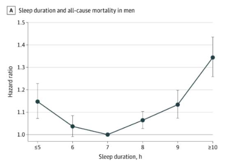
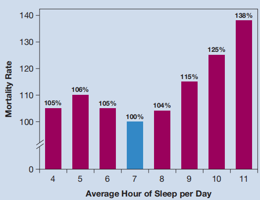

- 生物节律
	- 研究显示，人的状态会在好与不好之间波动，这种波动大致是呈周期性变化，
	- 人的很多行为都有一定的规律，有以秒为周期的节律，包括眨眼、心脏跳动、呼吸的节律等；有白天活动晚上睡觉，即以 24 小时为周期的昼夜节律，
- 基本生理行为
	- 基本运动与感觉
	  collapsed:: true
		- 运动系统：肌肉→脊柱→脑干→初级运动皮层→次级运动皮层→大脑皮层，
			- 同感觉系统类似，都是并联传输信号的等级系统，且每个组织都有明确的功能，
			- 区别主要在于运动系统是大脑向各个器官输出信息，而感觉系统则相反，
		- 运动系统与感觉系统之间存在着复杂的相互作用，即大脑会根据我们感知的信息调整运动，
			- 研究显示，这一行为主要由顶叶控制，顶叶的损伤会导致注意力和运动方面的缺陷，
			- 前额叶皮层也参与了这一过程，其主要功能可能是对具体行为的指示与控制，
		- 我们可以通过练习掌握一些复杂的运动，并形成肌肉记忆（内隐记忆），
			- 研究显示，初级运动皮层对运动的调控并非为机械的模式化操作，而是多种联系复杂的流程的组合，即初级感觉皮层的各个部位都是并联的，且这些部位之间的相互作用使得我们可以做出复杂的行为，
	- 饮食行为
	  collapsed:: true
		- 食物的选择
		  collapsed:: true
			- 一般认为，大多数人都偏好甜味、脂肪味和咸味的食物；此外，人们也会形成自己独特的味觉偏好，
			- 研究显示，生物在感知到钠的缺乏时，一般能够主动筛选出富含钠的饮食，但一般不能感知其它“必需矿物质和维生素”的缺乏——然而，在被动摄入含有这些“必需矿物质和维生素”的食物，并感受到身体状态的好转后，它们能够“学习”到这些食物的益处，并会继续选择这些食物，
		- 进食的因素
			- （饮食的三个阶段）
			  collapsed:: true
				- 头期，吸收期：胰岛素水平高，胰高血糖素水平低；促使摄入的过量葡萄糖转化为糖原和脂肪，
				- 禁食期：胰岛素水平低，胰高血糖素水平高；促使体内储存的糖原转化为葡萄糖，
			- （设定点理论）
			  collapsed:: true
				- 曾经的学者认为，人类的饮食类似于常规的负反馈系统，即体内存在一个“设定点”（如体脂含量，或血糖值），当身体检测到身体水平低于设定点时就产生饥饿感，促使进食；而达到设定点后就产生饱腹感，抑制进食，
				- 然而，这一理论并未得到实验证实，而且只考虑身体指标对饮食的影响简化了问题，
			- *饮食激励理论*
				- 一种观点认为，人们对饮食可能带来的满足感的预期促使人们进食，
				- 同时，这种理论指出，很多因素都可能使人产生“预期”，例如对食物的想象，别人对食物的描述，别人的饮食情况等，
			- 饮食习惯理论
				- 一种观点认为，人们长期形成的三餐习惯导致了饭前饥饿——即身体并非真的缺乏足够的能量，而是身体适应了我们的饮食习惯，从而在预期的饭点之前主动增加了胰岛素的释放，使得体内血糖降低，以应对即将到来的食物的摄入，
				- 这说明，人们在不同时期的“饥饿感”会随着具体的饮食习惯改变；此外，这种理论也部分解释了吃少量的“开胃菜”为何会增加饥饿感；这是因为少量的饮食可以促使身体进入饮食的“头期”，并开始调整血糖水平，
				- 关于大鼠的血糖实验证实了这一点，即观测到了大鼠的血糖在饮食开始前一段时间会有明显的下降，
		- 停止进食的因素
			- 一般认为，人体并没有严格的“停止进食”的机制，
				- 按进化论的视角，人体被“设定”为尽可能地吃下“更多”的食物，
			- 饱腹感
				- 对于个人，“饱腹感”在不同生命周期可能也会有区别，
				- 身体因素
				  collapsed:: true
					- 由于人的体重并非固定，显然饱腹感也并非一种准确的限制，
				- 外界环境
					- 研究显示，食物的味道，饭碗的大小和吃饭时的环境都会影响“饱腹感”，
					- 食物的种类
					  collapsed:: true
						- 研究显示 ，人们的“饱腹感”与具体的食物对应；
						- 人们在吃一定量的同一类食物后会产生“饱腹感”，
						- 然而，对于不同味道的“新”食物，人们一般仍能吃下，
					- 食物的总量
					  collapsed:: true
						- 研究显示 ，人们倾向于吃完“一份”食物，
						- 然而，食物的具体的量仍会有影响，对于较少的食物，吃完一份仍会有一定的饥饿感，
						- 而对于较多的食物，虽然吃不完就可能有“饱腹感”，但停止进食仍会有一定的“不满足感”，
			- 饱腹感的生理机制
			  collapsed:: true
				- 胃肠道
					- 部分研究显示，摄入的食物可以与胃肠道中的受体相互作用，从而导致胃肠道将一些特定的肽释放到血液中，这些肽可以与大脑中的受体结合，产生“饱腹感”；研究显示，身体内的“饱腹”肽和“饥饿”肽的主要作用区域为下丘脑，
					- 然而，已经分离出了很多不同的肽分子， 且这些分子间存在着复杂的交互作用，
					- 最新的观点是 ，肠道与大脑皮层共同控制“饱腹感”，而下丘脑则是二者传递信息的中介，
				- 瘦素
					- 在小鼠中的研究显示，瘦素可以抑制食欲，促进新陈代谢，并降低体脂水平，
					- 然而关于人类的研究则较为复杂，不同于肥胖小鼠，超重的人有着较高的瘦素水平，且注射瘦素并没有减少他们的进食量或体重，
				- 胰岛素
					- 研究显示，胰岛素水平与内脏脂肪水平相关，
				- 血清素
					- 研究显示，血清素可以增加“饱腹感”，从而抑制人们的进食；
					- 然而，其背后的具体机制尚不明确，而且基于血清素的药物被发现可能导致心脏疾病，
		- 限制饮食
			- 多项基于动物的实验表明，保证“营养充足”的“低热量”饮食可以延长寿命，
			- 基于人类的研究显示，“较高”的体脂水平对身体健康不利，
			- 研究表明，服食葡萄糖能够提高大脑对“艰巨任务”的处理能力——但是，在现代生活条件下，大脑一般能够储存充足的葡萄糖；此外，摄入过多的糖会导致其他系统的损害，如短期摄入过多的糖可能导致疲惫；
			- 基于厌食症患者的研究显示，“长期”食物匮乏的人可能会对食物产生心理上的厌恶，且进食也会产生生理上的不适感；换言之，医生建议这些人应当间歇地吃少量的食物，而不是立即大吃一顿，
		- 体重
		  collapsed:: true
			- 基础代谢
				- 一些研究显示，人体会按照体内的脂肪水平动态的调整基础代谢水平，表现为随着体脂水平的下降，人体会更“有效”地利用能量资源，从而减缓体重减轻的速度，
				- 基础代谢水平的不同部分解释了人的食量与体重并不完全相关的现象，
			- 肠道菌群：研究显示 ，肠道菌群的组成可能会对人体的体重有影响，
			- 动态设定点模型：基于基础代谢理论，部分研究者提出了动态的设定点模型，即人体的体重受多个因素影响，且身体会对单个因素的影响做出反馈调整；只有多个因素都有了明显的，长期的变化时，人体的体重才会变动，否则成年人的体重会保持“相对稳定”——并非为某个特定的，物种水平的值，而是因人而异，
			- 运动：研究显示，现代人所消耗的能量可分为四大部分：静息时的生命活动，进食过程中的产热，非“运动”（如保持坐姿、站姿平衡等）活动产热和“运动”产热——一般认为，“运动”（小于一小时的运动）产热只占其中的五分之一不到，
	- 性行为
	  collapsed:: true
		- 生理基础
		  collapsed:: true
			- 内分泌腺
				- 通过释放激素，调控体内的其它器官，
			- 垂体
				- 与下丘脑联系紧密，可进一步分为垂体后叶和垂体前叶，
				- 内分泌腺的主要器官，其分泌的激素主要为调节激素，包括加压素和催产素，
				- 垂体的激素释放受下丘脑的调节，但两者间的具体交互较为复杂，
			- 性腺
				- 指男性的睾丸和女性的卵巢，
				- 影响性发育和成人性行为激活的激素（性激素）都是类固醇激素（睾酮等），
			- 激素
				- 主要为三类：氨基酸衍生物，肽和蛋白质，类固醇，
				- 睾丸和卵巢都会同时释放雄激素和雌激素，只是释放的比例不同，即男性会释放更多的雄激素（主要为睾酮）；此外，女性的激素释放水平存在周期，但男性的激素释放水平较为平缓，
			- 性激素
				- 睾酮是主要的雄激素，然而睾酮的水平与性欲和性能力都没有明显的相关性；反之，清除睾酮会降低男性的性欲，但并不能完全改变男性性征，这可能是因为肾上腺分泌的雄激素也会在维持男性的性活动中起一定作用，
				- 研究显示，睾丸激素会增加许多物种的雄性的社会攻击性，但这一结论在人类中没有得到明确的实验数据支持；虽然有研究显示男性罪犯的睾酮水平往往高于正常人，然而，这也可能是攻击性行为增加了睾酮的分泌，
				- 虽然对性激素的了解不足，但合成类固醇仍然有着一定的市场（如体育运动和美容）；然而，合成代谢类固醇已被证明具有多种与过早死亡相关的心血管效应，且口服类固醇可能对肝脏有不良影响，包括促使肝脏的癌变，
				- 此外，在性分化发育程序完成之前的青春期使用合成代谢类固醇是特别危险的，且其副作用可能需要数年才能显现出来，
		- 性的发育
		  collapsed:: true
			- 精子与卵细胞
			- 幼年期
				- 性染色体（X/Y）：Y染色体上的Sry基因促使性腺发育为睾丸，
				- 睾丸分泌的雄激素（主要为睾酮）可以促使生殖器进一步分化为雄性生殖器，
			- 青春期
				- 下丘脑分泌促性腺激素释放激素，促使垂体分泌促性腺激素，
				- 促性腺激素可以刺激青春期的发生，包括促使睾丸产生精子并分泌睾酮，以及促使“第二性征”的产生，
				- （第二性征部分程度上直接受性激素调控，且部分第二性征的两性潜能将保持终生），
			- 成年期
				- 信息素：已经在动物中发现了明显的促使性行为的信息素（主要通过嗅觉），然而，虽然有研究显示人类的性行为也会受信息素影响，但并没有一致的明确结论，
				- 激素水平调节
					- 神经信号调节，包括自主信号和非自主信号；一些研究显示，对性活动的预期和色情图像可以提高男性的睾酮水平，
					- 化学信号调节，包括激素的反馈调节，和其它化学物质（血糖、血脂、血钠等）的反馈调节，
					- （外界环境调节），研究显示，外界环境也会导致激素释放量的变化，
		- 两性差异
		  collapsed:: true
			- 男性群体中，阅读障碍、精神分裂症、自闭症、多动症的发病率更高，
			- 女性群体中， 抑郁症、焦虑症、阿尔茨海默病、饮食失调的发病率更高，
		- 性行为的脑机制
		  collapsed:: true
			- 预期：纹状体与对性活动和其他愉快活动的预期和体验相关联 ，色情图像在男性中产生了更大的杏仁核活动，次级视觉皮层（颞叶、枕叶）的活动较为活跃，
			- 性行为：前额叶皮层和杏仁核的活动在性高潮时受到抑制，
- 睡眠与注意
	- 注意
	  collapsed:: true
		- 默认模式网络（DMN）
			- 概述
				- 研究显示，在非睡眠的“静息”状态下（即不执行具体任务），内侧前额叶皮层、后扣带回皮层、后顶叶皮层、海马和外侧颞叶皮层可能比执行具体行为任务时更活跃，这些区域一起被称为默认模式网络（DMN），
				- 说明了为何有时我们会“走神”，无法专注于想要的任务，
			- 功能
				- 人们在随机位置广泛监控他们的周边视野是否有刺激，但不是在被指示聚焦于刺激可能出现的一个位置时，可以观察到默认网络的激活，
				- 做“白日梦”（如回忆过去的事件和想象新的事件）会激活内侧前额叶和后扣带回皮层的类似区域，
				- 不做事情或做的事情很无聊时出现，此时注意力过滤器同样在工作，且更关注内在事物，
		- 注意力
			- 外源性注意（自下而上的注意）：我们的注意力会被特殊的外界刺激吸引，据推测，像这样的过程被许多动物用来快速检测和躲避捕食者，
			- 内源性注意（自上而下的注意）：注意力被大脑有意地引导到某个对象或地方，以服务于某个行为目标，
	- 疲劳
	  collapsed:: true
		- 脑电图
		  collapsed:: true
			- 概述
				- 大脑可以产生低至约 0.05 Hz和快至 500 Hz或更高的节律。
				- 尽管脑质量有很大的差异，但脑电图的特征在从小鼠到人类的哺乳动物大脑中非常相似，
			- 类别
				- 主要的脑电图节律按频率范围分类，每个范围都以希腊字母命名，
				- 一般来说，高频率、低振幅的节律与警觉和清醒，或睡眠中的做梦阶段有关，而低频、高振幅节律与非做梦睡眠状态、某些麻醉状态或病理导致的昏迷状态有关。
					- Δ波节律小于 4 Hz，幅度通常很大，是深度睡眠的标志，
					- θ波节律为 4‑7 Hz，在睡眠和清醒状态下都可观测到，
					- α波节律约为 8‑13 Hz，在枕叶皮层中最明显，与安静、清醒的状态有关，
					- μ波节奏类似α波，但在运动皮层和感觉皮层中最明显，
					- β波节律约为15‑30 Hz，
					- γ波节律相对较快，范围约为 30‑90 Hz，并发出激活注意力皮层的信号。
					- 其他节律包括纺锤波，与睡眠相关的 8‑14 赫兹的短暂波，和80‑200 赫兹的短暂振荡波纹，
			- 脑电图的同步
				- 部分神经元会首先震荡，然后通过神经元的兴奋性和抑制性连接互相作用，最终产生一种协调、同步的活动模式，这种模式可能保持在局部化，也可能扩散至更大的皮层区域，
				- 一种观点认为，神经节律是用来协调神经系统不同区域之间的活动的——例如在睡眠时，下丘脑会首先震荡并发出低频的脑电波，从而帮助整个大脑进入睡眠状态；但这一观点尚未得到证实，
				- 也有观点指出，脑电波只是神经元活动的表现形式，并不具有特定的功能，
		- 睡眠-唤醒系统
		  collapsed:: true
			- 睡眠是由抑制唤醒系统的特定脑回路产生的暂时、可逆的意识丧失。
			- 视前核腹外侧区的神经元含有抑制性神经递质GABA，且可以广泛投射至上行觉醒系统的大部分区域；这些视前神经元在清醒时放电最慢，在动物入睡时放电增加，在睡眠剥夺一段时间后的深度睡眠时放电最快，
			- 脑干和下丘脑中存在着“唤醒”系统，可以唤醒“睡眠”中的前脑，
			- 谷氨酸，乙酰胆碱和γ-氨基丁酸是调控睡眠与唤醒的主要神经递质，而下丘脑分泌的食欲素被认为在其中发挥着主要调节作用，
			- 食欲素能通过激活蓝斑和中缝背侧的单胺类神经元以及中脑的GABA能神经元，抑制脑桥中产生REM睡眠的神经元，从而促进清醒，
	- 睡眠
		- 睡眠理论
		  collapsed:: true
			- 睡眠调养理论认为，清醒以某种方式破坏了身体的稳态，需要睡眠来“恢复”，包括恢复清醒时下降的能量水平，清除大脑和其他组织中在清醒时积累的毒素，恢复清醒时可能消散的突触可塑性等，
			- 睡眠适应理论认为，人类的睡眠是对自然界的24小时周期逐渐进化适应的结果，早期人类有足够的时间在白天进行觅食等行为，而夜晚做这些事情并不高效，所以他们通过睡觉来保存能量，并避免夜间活动可能带来的危险，
			- 大多数哺乳动物和鸟类都会睡觉的事实表明，除了保护动物免受灾难和保存能量，睡眠也有一些重要的生理功能，但其主要功能并非一些特殊的、更高阶的人类功能，
			- 这两种理论并非严格对立，例如有的研究者指出，我们晚上睡觉的行为是逐渐进化而来的，但我们每晚睡眠的持续时间是由恢复机制决定的，
		- 睡眠周期
		  collapsed:: true
			- 一般认为，睡眠可分为两个不同阶段，快速眼动睡眠 （REM）和非快速眼动睡眠 ，
			- 快速眼动睡眠时大脑比较活跃，此时人们会做梦，且脑电图看起来与活跃、清醒的大脑十分相似，
			- 非快速眼动睡眠时脑电图比较平缓，同时副交感神经的活动增加，使得心率，呼吸和肾功能减慢，
			- 在整个睡眠周期（6-8小时）中，两种睡眠阶段一般会交替出现，
		- 睡眠节律
		  collapsed:: true
			- 包括人类，大多数物种都表现出有规律的昼夜睡眠-觉醒周期——即使在没有时间线索和外部环境变化的条件下，人类也会保持一定的昼夜节律，但具体时长一般略大于24小时；昼夜节律是人类睡眠的驱动力之一，
			- 研究显示，下丘脑是实现昼夜节律的主要神经组织，但并非唯一与昼夜节律相关的组织，
				- 下丘脑的损伤会导致睡眠周期的昼夜节律紊乱，但不会对哺乳动物的睡眠时间产生很大影响；
				- 下丘脑与视神经交叉相连，即下丘脑对昼夜节律的感知主要依靠视觉信息；但视神经中存在专属的感知光线强弱的分支，使得动物在闭眼时仍可以感受到外界的光线变化，
			- 时差和倒班工作会使得昼夜节律紊乱，从而导致睡眠障碍、疲劳等生理问题，且提前睡眠时间一般比延后睡眠时间更困难；目前认为，服用褪黑素或接受充足日照可以改善这一问题，
		- 睡眠剥夺的影响
		  collapsed:: true
			- （由于睡眠剥夺一般是由外界压力（包括疾病、工作压力、药物等）导致的，这些外界压力本身可能会产生不依赖于睡眠损失的不利影响，所以应谨慎解释睡眠剥夺研究的结果），
			- 研究显示，每晚比正常睡眠少3或4小时带来的影响主要包括三点：对睡眠的渴望，负面情绪的增加，注意力的缺乏，
			- 睡眠剥夺对认知功能的影响在个体间存在显著差异，从而没能得到一致的结论；但一般认为，睡眠剥夺会破坏工作记忆的运行，从而影响个体的认知能力，
			- 也有研究显示短期睡眠不足会导致体温降低、免疫功能下降等生理影响，但这些影响也是短期的，对身体的长期影响难以直接测量，
			- 此外，部分研究指出，上述长时间的睡眠不足带来的影响，大部分都只需要短时间的睡眠就可以得到恢复；这可能是因为经过睡眠剥夺后，人们的睡眠“效率”会变高，即拥有较高比例的慢波睡眠期，
		- 睡眠时间
			- 时间段
				- 部分研究显示，褪黑激素在夜间22:00-06:00分泌旺盛，大概在02:00达到分泌量最高峰；因此，一般建议这一时间段睡眠，
			- 时长
				- {:height 210, :width 270}
				- {:height 220, :width 270}
				- 一般认为，成年人需要的睡眠时长为6-8小时，
				- 多项研究指出，没有迹象表明睡眠时间“短”（一般为4-6小时）的人受到睡眠时间短的任何生理影响；但也有研究认为，“长期”睡眠“不足”会导致免疫系统功能下降，
				- 相比之下，跟踪研究表明睡眠时间“长”（一般为9-11小时）的人一般死亡率较高，但不能判断睡眠时长是否为导致这一结果的直接原因，
				- 一些研究者认为，每天睡6小时左右不会有“重大”不良后果，
			- 安眠药
				- 苯二氮卓类药物在短期内对促进睡眠比较有效，但其副作用十分明显，包括睡眠周期失调，对药物的耐药性以及“预期寿命缩短”等，
				- 一般认为，褪黑激素在哺乳动物中起着促进睡眠或调节睡眠时间的作用，但研究显示，外源性褪黑激素的安眠效果十分微弱，
- 行为动机
	- 实践分类
	  collapsed:: true
		- 具体实践
			- 动物的基本生理行为，
		- 虚拟实践
			- 可以看成对基本行为的“模仿”，
	- 奖赏回路
	  collapsed:: true
		- 动机
			- 内部动机与外部动机
			  collapsed:: true
				- 内部动机
					- 生理信号：饥饿，口渴等，
					- 昼夜节律：睡眠等作息，
					- 后天认知：对人类社会行为的理解，
				- 外部动机
					- 外部自然环境/社会环境
				- 内部动机与外部动机一般同时存在，且会共同影响最终行为，
			- 短期动机与长期动机
		- 概述
			- 进化机制
			  collapsed:: true
				- 为了实现特定目标，大脑需要“学习”不同的行为的收益与风险，
				- 如果特定的环境线索的出现会产生“回报”，大脑就会释放多巴胺，形成关于这一线索的记忆，以最大化获得回报的可能性，并最小化徒劳的追求，
				- （反之，如果特定的环境线索的出现会导致“危害”，大脑同样会释放多巴胺，促进形成关于这一线索的记忆），
				- 只要环境没有改变，就没有更多的东西需要“学习”，因此同样的“奖赏”行为所带来的多巴胺的释放会逐渐下降，
			- 生理基础
			  collapsed:: true
				- 中脑边缘多巴胺系统
				- 伏隔核为核心，由纹状体，前额叶皮质，下丘脑，海马，杏仁核等多个大脑区域组成，
				- 多巴胺为主要神经递质，谷氨酸，γ-氨基丁酸，食欲素等多个神经递质发挥着作用，
				- 包括直接奖赏行为和环境因素，记忆因素等多因素导致的间接奖赏行为，
		- 机制
			- 行为动机
			  collapsed:: true
				- “动机”
					- 研究显示，多巴胺的释放带来的动机并不等同于“愉悦”——愉悦是一种人为定义的快乐体验，而动机主要指促使个体做出行为，但有时并不能带来“愉悦”感，
					- 一般认为，“愉悦”类似于是奖赏的直接激活带来的生理满足感，而“动机”则类似于环境因素或对奖赏的预期的间接激活带来的对行为的驱动，
				- 伏隔核
					- 中脑边缘多巴胺系统的枢纽，
					- 受前额叶皮层的认知信息，边缘系统的情绪信息及下丘脑的信息调控，
					- 通过增加多巴胺的释放，使个体产生“动机”，促使个体做出行为，
				- （下丘脑）
					- 研究显示，下丘脑也直接参与了自然奖赏的产生，下丘脑损伤会减弱动物对奖赏物的反应，
					- 下丘脑神经元通过释放食欲素，影响前额叶皮质、杏仁核、伏隔核的多巴胺水平；而多巴胺神经元与伏隔核γ-氨基丁酸神经元则会反向调控食欲素的水平，
			- 激活机制
				- 奖赏的直接激活
				  collapsed:: true
					- 反馈效应
						- 自然奖赏物会导致个体出现“适应”，从而使多巴胺释放逐渐减少；即更多的自然奖赏物的条件下，才能观测到类似初始水平的多巴胺的释放，
						- 这可能是因为多巴胺的释放不是作为“愉悦”信号，而是作为“预测错误”信号；换言之，最初的奖赏一般是“超出预期”的，因此大脑通过释放多巴胺来记住这一奖赏，然而，记住了奖赏后，随后的奖赏就变得可以“预测”，因此大脑不再释放多巴胺，
					- 然而，成瘾药物会导致个体出现“敏感化”，从而使多巴胺的释放增加；这可能是因为成瘾药物总会释放出“比预期的要好”的信号，促使个体进一步的寻求药物和服用药物，
					- 除了直接的短期收益，思考可能得到的长期收益可以调动前额叶皮层，从而同样能够产生奖励的效果，
				- 环境因素（对环境的记忆）的间接激活
				  collapsed:: true
					- 概述
						- 环境线索反复匹配，会促进奖赏相关的情绪记忆的形成，
					- 机制
						- 参与学习记忆的脑区（前额叶皮质、海马、杏仁核等），与调控奖赏效应的脑区（中脑腹侧被盖区、伏隔核等）有十分密切的联系，
						- 多巴胺和谷氨酸是发挥作用的两种主要神经物质，多巴胺主要参与药物的奖赏作用，谷氨酸则主要参与突触可塑性的形成，
						- 突触可塑性改变是正常学习记忆形成的基础，也是奖赏记忆的持续性和牢固性的根本原因。
				- 情绪因素的间接激活
				  collapsed:: true
					- 蓝斑（去甲肾上腺素），中缝背核（5-羟色胺）和杏仁核（谷氨酸）都会对伏隔核的行为进行调控，这三个脑区与情绪变化关系密切，说明奖赏效应会受到情绪因素的影响，但不一定只受积极或消极情绪的影响，
			- 调节机制
				- 内侧前额叶皮层和眶额皮层
				  collapsed:: true
					- 主要参与对奖赏的效果，和不同环境下奖赏的利弊评估，并帮助个体根据评估结果进行决策；
					- 内侧前额叶皮层和眶额皮层的结构和功能受损会导致个体的判断风险和做出决策功能下降，负性情绪和应激反应增加，
				- 背外侧前额叶皮质
				  collapsed:: true
					- 主要参与认知控制过程，通过分析多种环境因素，抑制特定因素诱发的渴求，或抑制渴求行为转换为具体行动，
			- 强化机制
				- 背内侧纹状体接受（内侧）前额叶皮质的谷氨酸调节，主要参与行为—结果连接介导的目标导向行为；
				- 背外侧纹状体接受来自初级运动皮质和躯体感觉皮质的谷氨酸调节，主要参与刺激—反应连接介导的习惯性行为，
				- 两条通路之间存在着复杂的关系，随着成瘾行为的延长，背外侧纹状体通路逐渐变为主导，使得成瘾行为变为习惯性行为，
				- 研究表明，发出奖赏即将到来的信号的中性刺激，就可以触发伏隔核多巴胺的释放，
	- 成瘾行为
	  collapsed:: true
		- 定义
			- 指个体长期持续冲动与强迫性的参与对自身身体、心理和社会功能有害的活动。根据诊断标准，成瘾行为的核心要素包括四项：失控、强烈的渴求、社会功能受损、耐受性与戒断状态。
		- 类型
			- 物质成瘾：指长期使用成瘾药物，或其他成瘾性化学物质（如酒精、尼古丁等）导致中枢神经系统结构和功能改变；
				- 在所有尝试吸烟的人中，大约 68%的人会上瘾——这个数字与 23%的酒精和9%的大麻相比令人不快；此外，成瘾行为并非短期形成，而是通常需要几周时间，但发展速度会逐渐加快，
				- 酒精和许多成瘾药物一样，会产生耐受性和身体依赖性；“长期”“大量”饮酒会导致肝硬化，这是大量饮酒者死亡的主要原因；而且也有其它研究显示，酒精会促使DNA甲基化，且会触发细胞调亡，因而长期饮酒会造成广泛的脑损伤，
				- 自然奖赏与成瘾药物奖赏存在相互作用，充分的自然奖赏和不足的自然奖赏都会增强成瘾药物的奖赏，
			- 非物质成瘾：主要指行为成瘾，其症状表现和脑结构功能损害特征与药物成瘾近似，行为特点为反复出现具有强迫性质的冲动行为，
			- 两者的特征、表现和结果类似，但形成过程存在明显的差异：药物成瘾主要是药物的化学成分直接作用于大脑，从而系统地改变了大脑神经系统的结构和功能；而行为成瘾则是反复的外部行为刺激间接导致的大脑内部的生理状态失衡，
		- 机制
			- 生理机制
				- 前额叶皮质的功能或结构受损，削弱了个体对反应的抑制能力；
				- 纹状体功能的增强，导致了习惯性与自动化行为；
				- 腹侧纹状体（伏隔核）与杏仁核的结构和功能的适应性变化，导致药物引发的兴奋体验的强度逐渐下降，而停止使用药物后产生的心境低落等负性情绪体验则越来越强，
				- 此外，成瘾后自然强化物（饮食，睡眠等）带来的幸福感会下降，这使得成瘾者更难以彻底戒瘾，
			- 外界机制
				- 一般认为，成瘾复发的诱因主要有三种：外界“压力”，偶然的成瘾物质暴露，和暴露于与成瘾物质相关的环境中，
				- 研究显示，成瘾行为存在一定的“潜伏期”，即戒瘾后对药物的渴求会在一段时间后达到峰值，
		- 戒瘾
			- 身体不适感
				- 在成瘾状态下，交感神经系统的结构和功能发生了的适应性变化，减少或停止成瘾行为会导致交感神经系统高度激活，从而引起全身脏器的过度反应；
				- 此外，大脑也会变得更加敏感，大脑并不能很好的区分压力，所以大脑会把成瘾当成重要的事情，从而机械的采取“行为”吸引主观意识的注意，促使我们采取有利于生存的行为。
				- 研究显示，经过1个月—3个月的戒瘾治疗后，躯体的戒断症状会基本消失，
			- 思考长期收益
				- 对冲动行为的抑制并非总会减少你的多巴胺，前额叶皮层的任务是追求长远的目标，调控伏隔核中的多巴胺释放，
				- 应主动思考抑制冲动行为后可能带来的更长远的收益，这一行为可以调动前额叶皮层，从而同样能够产生奖励的效果，
			- 建立新的回路
				- 如果想要长期戒瘾，更重要的是用其他的行为替代曾经的成瘾行为，而不是仅凭意志力“删除”成瘾行为，例如，可以通过运动弥补戒瘾带来的空虚；运动期间产生的多巴胺会与受体结合，由此钝化成瘾的欲望，长期的锻炼则有助于恢复奖励中枢的平衡。
				- 养成新的习惯需要前额叶皮层的参与，并且付出精神上的努力。因此，刚开始的几次可能是最困难的，如果你的习惯第一次没有养成，那就继续尝试、对自己有耐心并宽容一点儿。一个人难以总是成功，但是因此而对自己感到不满只会阻碍对大脑的再训练，而不会有任何帮助。挫折感以及自我评判是压力产生的主要来源，而这会使得你更倾向于会重复做出那些老习惯。
			- 改变外界环境
				- 成瘾行为一般是由某些外界因素引起的，可以通过鉴别出环境中那些可以触发出习惯行为的特定信号，然后避免或者直接改变这些信号，从而摆脱这类不好的习惯，
				- 如果你不能确定哪些东西是特定的触发因素，可以先尝试随机改变一些环境中你不喜欢的事物。比如试着在客厅中挂一幅不一样的画，或者重新粉刷自己的卧室，大脑的边缘系统非常善于捕获微小的环境信号，而且它同纹状体之间有着非常强烈的联系，所以即便是很微小的改变，也可能会带来非常显著的效果。
- 行为选择
	- 决策
	  collapsed:: true
		- 满意原则
			- 人的计算能力有限，不能同时考虑到各种可能性。一般情况下，人在进行活动时只是很简单地考虑一种或两种可能性，即利用一些生活中常用的启发式的规则。
			- 然而，想得到次数最少、效能最高的解决方法是很困难的，也不一定有必要。
			- 我们每天都要面临很多抉择，但大多数的抉择都不会有长期的影响，
		- 统计信息的复杂性：事件的独立性，贝叶斯统计，对随机性的错误估计
		- 虚假相关效应：大脑善于发现事件之间的联系，但缺乏关注事件的宏观规律的能力；换言之，大脑会本能的关注偶然事件、罕见事物，并且做出错误的相关性判断，
		- 相较经济决策，“道德”决策涉及更多的大脑区域，包括眼窝前额皮质以及其上的背外侧前额叶皮层。当我们需要了解自己与其他人之间的关系时，了解我们是否遵守社会准则时，我们也需要这两大区域的参与。因此，大多数人都很难同时权衡那些既有经济意义又有道德意义的不同结果。
		- 整体与局部
			- “我方立场偏差”
				- 在思考与自己的利益相关的问题时，我可能会倾向于忽略不利因素，夸大有利因素，
				- 其原因可能是“沉没成本”效应，即我已经付出了很多努力，不愿意抛弃已付出的努力；也可能是应激反应过度，即夸大了不利因素带来的威胁；也可能是大脑的懒惰，即不愿意全面的分析多个因素的利弊，只是简单的根据部分有利因素就直接做出一个粗略的判断，
		- 损失厌恶
			- 后悔是风险规避的驱动力，我们都会试着避免由于错误决定导致的遗憾，尽管有时这些决定可能会与我们的预期价值截然不同。
			- 相同量的收获（或损失）并不会带来相同量的幸福（与悲伤），
	- （医学决策）
	  collapsed:: true
		- 当我们感觉无助时，我们倾向于关闭自己的决策系统，从外界寻找确定性，但我们可以了解更多的医学知识，认清自己对风险与后悔的偏好，并向更多的医生寻求意见。病人和医生之间应该是一种合作关系，
		- 医生的局限性
			- 医生有自己不同的个性、风格和特长；
			- 医生掌握的关于成功的知识多于风险的知识，医生倾向于相信逻辑推断，而不是实验证据；这些因素会影响他们决策的准确性，
			- 医生开药时可能会为了获取更大的利益，可能会过分相信疗法的有效性，可能难以对预后做出精确的判断，
		- 调查负面结果
		- 利用数学工具：明白怎样利用医生给你的信息，花一点时间做决定，将决定转变为可以评价的数字，避免直觉性的猜测，
		- 数学工具的不足：部分统计工具可能存在偏差（如平均值），统计数字仅在宏观的多次实验中才有意义，对于个体，应该对问题予以更多重视，
		- 全面看待疾病：寿命并非是唯一的因素，有些手术或许不能延长寿命，但是可以提升生活质量，手术与死亡并非截然对立，此外，手术也难以带来十分确定的收益。因此，问题并非是否愿意挽回生命，而是挽回生命的尝试是否真的有效且副作用可控，
		- 替代疗法
			- 伪科学一般缺少严谨的试验控制与可证伪的假设，美国国立卫生研究院已经报告了大量没有效果或者收效甚微的替代药物，即只有一小部分人从替代疗法中获益，大多数人没有收获任何好处。
			- 替代疗法的反例
				- 过量的膳食补充剂：过量的维生素E和叶酸会增加癌症风险；过量的维生素D会增加患心脏炎症的概率；过量的维生素B6与神经损伤有关。在正常食量下这些维生素都不是问题，但补充物质及非处方维生素片可能是有害的。
				- 自然的植物不一定是好的，如毒芹、蓖麻豆种子、茉莉浆果和毒蘑菇都是反例。而且人工养殖的作物也可能有一定的污染，
				- 许多标榜“自然”的产品含有添加剂，从而可能会对人们造成一定损害。
				- 草药以及一些其他植物药片在美国等国家没有得到监管，企业的生产规格可能不达标。
		- 医学倾向
			- 极简主义：不愿意与药物、医生有太多接触；
			- 极繁主义：每个问题、每次疼痛都有一个医学答案；
			- 自然主义：人的身体可以自己治愈，也许只需要基于植物和精神的某种补救措施；
			- 技术专家：一定会有比眼前更好的新的药物与疗法，新的才是最有效的。
			- 这些都是比较极端的，但我们每个人身上多多少少都带着一点这四种类型，且这些倾向通常会交互进行。
			- 你可能会在牙齿护理方面主张极简主义，但在肉毒杆菌和“青春保养”方面主张极繁主义；你可能会对感冒和流感保持自然主义，但当你需要面对阑尾破裂手术时又成了技术专家。
- 应激行为
	- 分类
	  collapsed:: true
		- 一般将应激分为三大类，物理应激、社会应激（社会隔离，社会挫败等）和母婴隔离，
	- 机制
	  collapsed:: true
		- 生理机制
			- 边缘系统—下丘脑—垂体—肾上腺皮质轴系统（LHPA轴）
				- 应激性刺激通过作用于前额叶皮层和边缘系统，这些脑区的激活会影响下丘脑的激活状态，下丘脑/垂体通过分泌激素，最终影响应激的内分泌反应，
				- 具体为，个体经历应激时，下丘脑分泌促肾上腺皮质激素释放素（CRF），CRF进而作用于垂体，使其分泌促肾上腺皮质激素（ACTH），而ACTH则又作用于肾上腺皮质，促使其分泌糖皮质激素（GC）；
				- 高水平的GC可以通过作用于下丘脑、垂体和海马的GC受体，负反馈抑制下丘脑CRF和垂体ACTH的进一步释放，从而避免HPA轴持续和过度激活，
				- 然而，动物研究显示，长期应激可能会导致海马的体积缩小，前额叶皮层的激活下降，以及前额叶皮层—杏仁核之间功能性联系的下降，
			- 交感神经系统（SNS）
				- 应激状态下，SNS激活，并释放各类儿茶酚胺类神经递质，参与应激反应。SNS在中枢和外周水平上可以相互作用，同时与HPA轴也有着复杂的交互作用，
			- 高级中枢的参与
				- 研究显示，前额叶皮质参与了对心理性应激的认知评价，因而个体的心理活动差异可能造成个体对同样外界应激刺激的差异性反应。
				- 个体的易感性可能与个体的遗传倾向和早期环境因素有关，
		- 表观遗传机制
			- 研究显示，慢性社会击败应激可引起抑郁样行为和认知障碍；其生理学基础可能是前额叶皮质，边缘系统和伏隔核内的组蛋白乙酰化、DNA甲基化修饰过程，
			- 针对人类、灵长类和啮齿类动物的PTSD相关研究也发现，早期社会应激或严重的应激事件可提高人类和动物的应激反应敏感性，从而增加个体成年后精神相关疾病的发病可能性；其生理学基础可能是DNA的甲基化修饰过程，
	- 外界环境
	  collapsed:: true
		- 许多人类研究表明，实验程序诱发的情绪激活（心理应激）能影响被试的听觉或视觉的选择性注意加工能力；而严重的应激性事件则可能导致人们的注意系统产生明显改变，
		- 另一方面，注意能力也会对应激反应发挥调节作用，
		- 涉及注意的神经调节环路主要包括前额叶、上丘、背内侧丘脑、外侧膝状体、内侧颞叶和颞下皮质等脑区。皮质结构如前额叶传送自上而下的视觉信息的信号至感觉区，再融合奖励和情绪信号对注意进行调节。应激可通过作用于该神经环路影响注意加工。
	- 应激反应
	  collapsed:: true
		- 概述
			- 一般将应激反应分为三大类：即时的应激反应，通过推理对同一应激做出不同反应，通过推理对不同应激（变化的应激条件）做出不同反应，
			- 一般认为，个体可以较好的应对“短期”的“适度”应激，但长期的“过度”应激则会损害个体对应激事件的反应能力，
		- 机制
			- 研究表明，前额叶皮层在应激反应中发挥着重要作用；进一步的研究显示，前额叶皮层的不同区域独立介导了不同的反应——同一应激下对不同策略的分析主要发生在眶额皮层，而对于不同应激条件的分析则与背外侧前额叶皮层有关；此外，边缘系统与纹状体也通过与前额叶皮质间的神经联系参与了对应激反应的调节，
			- 生物化学研究显示，去甲肾上腺素（NE）和血清素（5-HT）参与了应激反应过程；NE和5-HT的耗竭会导致个体难以进行对应激反应的进一步调控，而NE水平的过度增加也会导致认知转换能力的降低，
		- 调节
			- 早期应激诱发的HPA轴应激易感性增加主要由心理性应激（如束缚应激、新异环境等）而非躯体性应激（如失血、寒冷、低血压等）诱导，提示前额叶-边缘系统可能参与HPA轴调节，
			- 动物研究显示，内侧前额叶皮质对应激较为敏感，短期的应激就会损害前额叶及神经通路的可塑性，表现为海马—内侧前额叶皮质的长时程增强降低；但眶额皮质对应激的敏感性较低，
	- 记忆
	  collapsed:: true
		- 学习后给予短暂应激可以增强情景记忆；进一步的研究还显示短暂应激后检测到了皮质醇含量增高，提示应激对记忆任务巩固的增强作用与皮质醇相关，
		- 但是，测试时给予的应激则会产生负向作用，即应激会损伤对过去的记忆的提取能力；进一步研究检测到了前额叶内的多巴胺分泌增多，提示应激导致的空间记忆受损可能与前额叶中多巴胺神经元相关，
		- 动物研究显示，海马的多巴胺系统和谷氨酸系统在大鼠的空间记忆加工中发挥了关键性作用，长期应激可能会对海马造成损伤，从而影响动物的记忆能力，
		- 然而，丰富的生活环境能引起大鼠海马内谷氨酸和γ-氨基丁酸水平的显著增高，以及腹侧纹状体内多巴胺转化率的增高，即“正性”应激可以增强海马的功能。
	- 压力
	  collapsed:: true
		- 压力可能表现为多种不同形式，意识所分辨的“压力”并不完全等同于生理意义上的压力，
		- 让细胞周期性地承受轻度压力是有好处的，那样可提高它们应对更严重压力的能力。神经学家把这种现象称为压力接种，类似于给大脑打预防针；
		- 然而，仍应注意避免过度的压力。试着思考未来，或思考更多的可能情况可以促使大脑停止应激反应；此外，运动也可以减缓压力阈值自然下降的速度，
- 基本情感
	- 定义
	  collapsed:: true
		- “情绪”是一个复杂的概念，目前认为广义的情绪包括三个方面：一是个体的主观感受，二是主动的行为反应，三是被动的生理反应；还有研究者认为情绪还包括行为的动机，即情绪可以使得人们产生有效的动机去完成适应性的行为，
		- 情绪的分类并非十分严谨，尤其是文化对情绪具有独特的影响，如东方文化倡导内化的情绪表达，这使得他们在评价情绪时与西方文化的人们有所不同。目前，研究者们倾向于用基本面孔表情定义情绪，
		- 对于具体的情绪，由于大脑各个区域间的作用十分复杂，因此并非每种情绪状态都有“合理”的解释；例如，有的理论认为被动的生理反应导致了主观感受，但也有研究者认为是主观感受激起了情绪和被动反应，也有理论认为两者是相互独立的过程，
	- 机制
	  collapsed:: true
		- 边缘系统：包括杏仁核、眶额皮层、基底神经节、丘脑前核、扣带回、海马等大脑区域；然而这一系统的具体定义并非十分明确，
		- 杏仁核
			- 位于海马的前方和海马旁回钩的深部，侧脑室下角的前方，与内侧颞叶、前额叶皮质、前扣带回皮层、丘脑和下丘脑等许多脑区有着广泛的纤维联系。
			- 杏仁核是机体对于外界刺激进行警觉和分析的结构，尤其是当刺激具有生命性特征或包含社会性信息时，可以观察到杏仁核的活动明显增强，
			- 然而，杏仁核主要受视觉信息的激活，对杏仁核损伤病人的研究表明，他们仍可以正确分辨别人使用的恐惧语气，
			- 杏仁核主要影响的为恐惧情绪，但对于其它情绪，杏仁核更类似“中介”机构，即只是引起大脑的警觉，并将信息传输至其他脑区；研究显示，岛叶皮层参与了对厌恶情绪的加工和对厌恶表情的体验，而眶额皮层则主要影响对愤怒表情的加工，而对其它表情的研究尚未得出比较一致的结论。
	- “焦虑”
	  collapsed:: true
		- 概述
			- 温和的、可以被调控的应激反应可以让大脑保持警觉，产生适当的神经化学反应，促进大脑成长；但对焦虑的“过度”反应，可能导致大脑分泌过多应激激素，并长期维持在压力状态，不利于大脑健康。
			- 人类和动物实验研究表明，控制恐惧和焦虑的脑区主要集中在杏仁核、前额叶皮质等区域，而且恐惧和焦虑相关脑区有着很大程度的重叠，
			- 抑郁症和焦虑症的大脑结构有很大的重叠，都包括前额叶皮层、海马体和杏仁核，
		- 机制
			- 短期影响
				- 感受到外界应激后，杏仁核分泌去甲肾上腺素，给下丘脑发出信号，下丘脑又给脑垂体发出信号，脑垂体又给肾上腺发出信号，让其释放肾上腺素和皮质醇，造成呼吸加快、心跳加速、血压升高等“战或逃反应”。
				- 这一通路的进展很快，会直接作用于交感神经系统，而没有大脑皮层的参与。
				- 皮质醇可以增强多巴胺功效，让人保持警觉和活跃。然而，若皮质醇分泌过多且持续时间很长，多巴胺就会耗尽，从而使人感觉到难受和抑郁，
				- 部分研究显示，老年人仅在接触积极信息时才会激活杏仁核，而年轻人在接触正反两方面的信息时都会激活杏仁核。这可能解释了为何年轻人更容易情绪化，
			- 长期影响
				- 海马体中有许多皮质醇受体，用于负反馈调节皮质醇的产生。然而皮质醇过多或者持续时间过长，海马体受体自身就会关闭，紧接着会萎缩，从而导致记忆力的减退。
				- 杏仁核会变得更加敏感，即长期的应激反应会让人更加容易焦虑。
				- 这一结果可能是由过去经历的严重创伤或长时间应激反应导致的，而现在的每一次应激反应也会对其有影响，
		- 应对
			- 自发行为
				- 焦虑是一种“无意识”的自发的应激行为，
				- 这种无意识的行为并不能很好的应对现代社会的复杂而多样的问题，即边缘系统并不能准确的识别我们所面临的问题的严重程度，
			- 尝试保持平静
				- 意识和情绪是由不同的脑区所介导的。外界的“问题”会自动激活杏仁核，从而产生焦虑情绪，但是意识到自己所产生的反应，则能够激活前额叶皮层，从而起到冷静杏仁核的作用。
				- 部分研究表明，识别情绪可能是消除消极情绪的一种有效方法。例如使用词句来代表情绪状态，比如说“生气了”，可以抑制杏仁核的活跃程度。
			- 重新理解记忆
				- 一般情况下，伴随着恐惧的记忆比较牢固，因而难以彻底忘记，但我们可以通过建立一个新的记忆并不断强化它，来逐步替代恐惧的记忆。
				- 对于同一实践的回忆可以是积极的，也可以是消极的，应该试着通过做出不同的假设，逐渐改变消极的核心信念，更积极的面对事件，
				- 可以在较为安全的情境下接触小剂量的恐惧源。我们在没有恐惧感的情况下体验这些身体反应后，大脑会经历一次认知的重建过程。我们在前额叶皮层内建立了有助于镇静杏仁核的连接后，就会产生安全感，随后大脑会把那种感觉刻录成一段记忆，
				- 新产生的中性记忆会记住安全的感觉，通过连接正确的认知解读，把触发器与典型的反应断开，削弱曾经的恐惧情景与感到恐怖及心率加快之间的联系。
			- 分析问题
				- 应激水平的下降可以降低皮质醇等激素的释放，促进其它缓和激素的产生，从而使海马体等组织更加活跃，因而能利用的已知信息也会更多，从而可以更全面的思考“问题”，例如分析多种不同的可能性，以及它们的可能影响，
				- 此外，把注意力放在思考可能性上，也可以扩充神经元之间的新联系，而不是使用陈旧的联系加剧消极情绪。
				-
				- 较容易理解的是，未来的情况是受自己的努力和外界社会因素共同作用的，而且我一般无法仅通过自己的努力来完全掌握未来，
				- 问题一般在于，对于不同的具体情境，我很难判断自己的努力起到的作用到底有多大，
				- 对于这类无法得到准确答案的问题，可以尝试寻找一个宽泛的限度，而这个限度的确定是建立在长期的实践和认识的基础上的，
			- 采取行动
				- 前额叶皮层负责目标驱使的行为，即决定要去实现怎样的目标以及如何去实现这些目标，而实现目标的第一步就是要制定决策。因此，做出决策可以有效地促使前额叶皮层运转，更好地调动和利用大脑的各种有效资源，
				- 当前额叶皮层开始运转，它就可以让边缘系统冷静下来，并且克制纹状体的活性，防止其将你拉入到负面的冲动和例行行为当中。
				- 尝试针对不同的可能情景制订针对性的计划，也可以让我们感觉到更多的控制感，从而减缓边缘系统的应激反应，
				- 然而，当你一次要做太多决定的时候，你的决策环路也会变得疲惫，然后大脑会重新陷入无法决策或者更加冲动的非理性状态。因此，锻炼大脑和适度休息都是必要的，
			- 呼吸方式
				- 缓慢的呼吸会增加迷走神经的活性，迷走神经是副交感神经中最主要的一支，因而迷走神经的激活可以让身体变得放松；相比之下，快速的呼吸则会激活交感神经系统，从而让身体变得更加紧张，
				- 此外，快而浅的呼吸排出了过量的二氧化碳，这可能导致血液pH降低从而激发脑干的报警机制，使得神经变得更加兴奋，
				- 对着一个纸袋呼吸可以迫使我们重新吸入二氧化碳，从而避免过度换气；当然，主要还是应该控制应激，认清问题，并尝试放慢呼吸频率，
	- “抑郁”
	  collapsed:: true
		- 诊断
			- 神经体征
				- 神经硬体征：反映基本的运动和感觉的异常，涉及椎体系统和椎体外系统，与特定的脑区相联系。
				- 神经软体征：指可观测到，但很难找到与之相对应的脑解剖基础的异常行为，
			- 目前，抑郁症不能通过核磁共振成像或脑电图扫描等科学方法诊断；相比之下，帕金森综合征是由于特定的多巴胺神经元的死亡，而阿尔茨海默病则特定的蛋白分子相关，
			- 对于抑郁症的确诊依靠的仍然是一系列症状的判断——例如，抑郁症的一种表现为“固着性”认知和情感理解能力“失常”，这可能是由前额叶功能异常导致的，
		- 机制
			- 综述
				- 前额叶皮层控制着新行为的形成，但它的功能出现紊乱时，纹状体便会取代它。因此，抑郁时做出的行为一般是一些早就形成的例行行为或者冲动行为。
				- 抑郁的时候背侧纹状体的活性也同样减弱了，所以除非被某种冲动所激励，否则患者更有可能什么事情都不想做。
				- 大量关于抑郁症患者大脑结构和功能的神经影像学研究发现，患者的前额叶皮质、海马体、杏仁核和扣带回皮质的灰质体积在持续减少，
			- 应激假说
				- 有研究表明，抑郁症患者的糖皮质激素负反馈调节功能损害，使得其HPA轴的激素分泌“失常”，表现为患者的“过度”应激反应，
				- 然而，无论人群还是实验动物研究都发现，应激并不是抑郁症发病的必要和充分条件，受到应激的人类和动物只有部分表现出明显的抑郁症状。
				- 但不可控制和不可预测的长期应激，的确与抑郁症状有着较强的相关性；进一步的研究显示，早期应激可能通过增强应激反应性（如使HPA轴及其分泌的激素的基础水平升高，且激素分泌时间更久）而增加个体成年后抑郁症发病风险，表观遗传改变途径参与介导了这一过程，
			- 5-羟色胺假说
				- 目前的抗抑郁药物主要通过调节单胺类神经递质，改善前额叶功能来发挥作用；抗抑郁药物治疗能够迅速（2天—3天内）提升5-HT和NE的水平，然而抑郁症状和认知功能的改善则通常需2周—3周，提示这些神经递质释放的增加并不对临床疗效直接起作用，而是通过其他下游分子事件发挥治疗作用；
				- 此外，也有20%—30%的抑郁症患者没有得到改善，说明仅仅依靠5-HT难以解释抑郁症的发病机理，
			- 脑源性神经营养因子假说
				- 慢性应激或者慢性给予皮质酮会造成海马锥体细胞减少、树突分支缩短、长时程增强降低等结构和功能可塑性损害，也能够显著降低海马、前额叶皮质BDNF表达水平，
				- 由于BDNF在神经发育、神经元正常功能维持和损伤修复中发挥重要的作用，因此研究者指出，BDNF信号通路的损害参与了抑郁症的病理生理改变，
				- 部分研究证实，抑郁症患者血和脑内BDNF水平较正常人群显著降低，且BDNF水平与症状、严重程度和病程相关；抗抑郁治疗可逆转上述改变，且二者具有时程上的一致性，
				- 然而，脑内存在复杂的BDNF调节网络，脑内或者特定脑区条件化抑制或敲除BDNF基因并不直接导致抑郁样行为产生；同样，BDNF的作用也与早期环境因素和遗传因素经表观遗传引起的个体差异有关，
		- 避免短期收益
			- 抑郁时，多巴胺的活性降低，这会使得我们难以对过去的行为产生兴趣，而且可能更倾向于做一些可以迅速带来收益的行为，例如吃过多的甜食，
			- 这种行为可以用于改善短期的情绪低落，然而，由于这种行为本身就是能够带来收益的，因此更容易形成习惯，而这些习惯一般会带来不利的长期影响，大脑对这些行为带来的满足感的阈值也会增加，
			- 应尝试从其他角度解决问题，避免让这种行为变成长期的习惯，
		- 转变预期
			- 一般认为，人们的情绪存在一个“基准点”，例如悲观性格或乐观性格，这可能是先天因素和后天经验共同作用下形成的，
			- 例如，人们的情绪环路一般更容易被负面和消极的信息所激活，即体验很多积极的事件才能抵消由一次负面事件所带来的影响。
			- 如果情绪的基准点就是悲观的，那么我们对未来的判断，以及可能做出的行为都会带有悲观成分，
			- 可以尝试重新理解自己的风险偏好，探索更多的可能性，来转变自己的情绪基准点，
			- 一般情绪基准点不是短期内形成的，因此也需要长时间的“实践”，才能将乐观状态变为常态，
		- 伸展运动
			- 面部伸展
				- 大脑可以感受到特定面部肌肉的收缩（比如位于我们嘴角附近的颧大肌），因而特定的面部行为也会对我们的情绪有一定影响，
				- 微笑可以增强积极正面的感觉，张开嘴角假笑也可以在一定程度上让我们更轻松，
				- 皱眉的姿态可能会让人们变得更容易悲伤，气愤或厌恶，
				- 通常当我们感觉到压力的时候会不自觉地咬紧我们的牙关，这会增加整个面部的肌肉张力。可以尝试让下颌放松一点，左右动一动它，或者张张嘴，
			- 伸展身体
				- 当你觉得压力太大或者过于焦虑的时候，身体的肌肉也会变得更加紧张。简单的伸展运动就可以帮助放松你的肌肉，也会一定程度上缓解紧张的情绪，
				- 部分研究显示，伸展可以刺激内啡肽和内源性大麻素的产生，它们可以减轻疼痛。
		- 社会联系
			- 研究表明，同其他人的互动（不仅仅是朋友和家人，甚至是同陌生人或者宠物）都会有助于逆转抑郁的进程。如果你不想同其他人互动，也应该尝试到人多一点儿的地方去，比如图书馆或者咖啡馆，只要同其他人待在同一个空间里也会有所帮助。
			- 找到归属感也是一种互动方式，这就是为何人们会愿意支持某个团队。因为对团体的支持会使人们感受到一种团体氛围，感受到大家的团结一致的感情，从而增强人们的社会归属感，
			- 同宠物互动也是一种选择，有不少研究已经表明，饲养宠物能够减少抑郁。然而，由于宠物的生物本性的限制，一般饲养宠物并不能完全替代人与人之间的交往，
		- 保持感激心态
			- 感激的心态可以替代负面的感受，从而激发幸福感；部分研究发现，感激的情感会导致前额叶皮层的神经元密度的变化，
			- 尝试用感激的心态来思考事情会使得你更多地关注于生活中的积极方面，这会使前扣带回皮层中5-羟色胺产量的增加，而回忆糟糕的往事则会降低前扣带回中5-羟色胺的产生。
			- 对于他人的感激会增强社交多巴胺环路的活性，从而使得社交互动变得更有乐趣，
	- 自信
	  collapsed:: true
		- 接受自己的早期失败，
		- 关注多种可能性
			- 一个应激情境提供了探索一种新的做事方法的机会。你可以通过关注事情的可能性来在困境中寻找方向，从一种自我限制的心态中解放出来。
			- 试着扩大注意力的范围，以正确地看待事情的多个方面而不囿于某个局部，
		- 积极面对挑战
			- 改变错误的信念，如认为生活本应是简单的；成功人士被绊倒时不会退缩，因为他们并不认为生活本来就是容易的，
			- 抱负和好奇心会对你的大脑发育到什么程度赋予一种能动性。这两种特质可以让你充满活力，怀着对生活的渴望展望未来。它们为你打开了未来的大门，使你愿意接受新体验。由于培养出了一种永不满足的好奇心，你会把任何环境都当成一种优越的环境。刺激多的环境会促进神经可塑性的发生，而缺少刺激的单调环境则会损害大脑。
			- 健康的抱负不是竞争或者侵略，不是为了达到目的而踩踏或超越他人。健康的抱负包括好奇心和超越你现有的理解力、由目标驱动的使命感。
		- 培养幽默感与同情心
			- 要通过认识自己的特质来减轻你的思想包袱，幽默可以让你的注意力从无关紧要的细节中解放出来。如果幽默是自发的，那么效果会更好。培养幽默感有益于你的大脑和思维，它会促成某些生理上的变化，特别是心血管系统、免疫系统和肌肉组织的变化。当你感到开心的时候，多巴胺和内啡肽就会释放出来。重要的是，你培养的幽默感应当是积极向上的，而不是贬损别人的消极幽默感。积极的幽默会使人精神振奋而不是感到丢脸。积极的幽默感有助于增强你的思维和情绪的活力，提升你的自尊心以及应对应激反应、焦虑和抑郁，
			- 对他人的同情心是情商的一个方面。在洞察和了解他人需求的基础上，以开放的心态改变你的信念有助于提高你的智商和重塑你的大脑。为了让自己获得这方面的智慧，你应当从集体利益出发采取行动，并且记得人们难免会犯错的道理，保持一定的宽容，
		- 调整站姿
			- 哈佛大学的研究人员发现，当人们按照一种开放舒展的姿势站立或者坐着的时候，雄性激素的水平会上升，而压力激素皮质醇的水平则会下降。
			- 试着让自己的站姿挺拔一些，一个自信的姿态会调节大脑对于思维的反应，也会让人们显得更有活力，
	- 其它
	  collapsed:: true
		- 负罪感
			- 研究显示，负罪感和羞愧感会激活伏隔核，表明这种感觉可能会激活奖赏回路，从而在大脑中被强化，
		- 有证据表明双相情感障碍中下丘脑-垂体-肾上腺(HPA)轴失调；双相情感障碍患者及其非亲属的昼夜节律都出现了明显的紊乱；
		- 奖赏超敏反应理论提出，双相情感障碍是由对奖赏反应过度或缺乏奖赏的功能失调的大脑奖赏系统引起的，
			- 奖赏追求：双相情感障碍患者的活动会导致过度的目标寻求，并最终导致轻躁狂或躁狂，
			- 奖赏缺失：双相情感障碍患者如果未能实现目标，其奖赏寻求活动会过度减少，从而可能导致抑郁行为。
			- 与这一理论相一致的发现是，双相情感障碍患者在抑郁和躁狂状态下，前额叶和纹状体奖赏回路的活动都增加了，
			- 内侧前额叶皮层、左前扣带回、左颞上回、某些前额叶区域和海马体在双相情感障碍患者中更小，
-
-
- [[Neuroscience]]