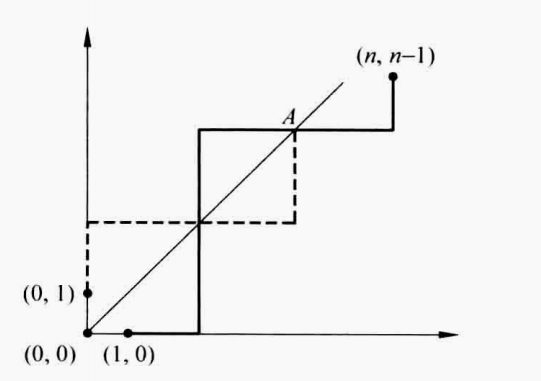

- 基本方法
  collapsed:: true
	- 求解逻辑
	  collapsed:: true
		- 分析“事件”与对应的“对象”，
			- 此处的事件可能是具体事件（如给人分配物品），也可能是一些抽象事件（如组成一个比特串），
			- 应主要分析“事件”是否可以分为多个步骤来完成，
		- 将事件划分为*多个步骤*，
		  collapsed:: true
			- 判断使用乘法原理还是加法原理，
			- 分析是否有顺序，以及顺序和组合之间的关系，
		- 每个步骤也可以分为*多个子步骤*，
		  collapsed:: true
			- 再判断使用乘法原理还是加法原理，
			- 分析是否有顺序，以及顺序和组合之间的关系，
		- ……
		- 将所有子步骤按照乘法原理或加法原理合并起来，计算得到结果，
	- 乘法原理
	  collapsed:: true
		- 若完成一件事有*k个步骤*，其中第i个步骤有m_{i}种方法，
		- 则完成此事共有$m_{1}m_{2}...m_{k} = \prod m_{i}$种方法，
		- 集合语言
			- 设$A_{1}, A_{2},..., A_{n}$为有穷集，$A_{1} \times A_{2}$为集合的笛卡尔积（集合），$|A_{i}|$为集合的元素数（标量），
			- 则$|A_{1} \times A_{2} \times … A_{n}| = |A_{1}| \cdot |A_{2}| \cdot …|A_{n}|$，
	- 加法原理
	  collapsed:: true
		- 若完成一件事有*k类方法*（且每类方法互斥），其中第i类方法有m_{i}种子方法，
		- 则完成此事共有$m_{1} + m_{2} +...m_{k} = \sum m_{i}$种方法，
		- 集合语言
			- 设$A_{1}, A_{2},..., A_{n}$为有穷集，$|A_{i}|$为集合的元素数（标量），
			- 若A_{i}之间两两互斥，
			- 则$|A_{1} \cup A_{2} \cup … A_{n}| = |A_{1}| + |A_{2}| + …|A_{n}|$，
	- （推广：除法原理）
	  collapsed:: true
		- 若完成一件事*一共*有k类*方法*（且每类方法互斥），而这些方法可以分为i类；则每类包含的子方法数为k / i，
		  id:: 62c3f3c1-b6e0-45eb-8c37-6ea3be58e474
		-
	- 方法的树图表示
	  collapsed:: true
		- 若问题的步骤和方法较少，则可以用树图来穷举出所有的可能方法，
- @推广：容斥原理
  collapsed:: true
	- 
	- 埃拉托色尼筛
	  collapsed:: true
		- 不超过100的素数的个数为 {:height 160, :width 440}，
	- 对称筛公式
	  collapsed:: true
		- 若集合的性质具有“对称性”，
		- 则容斥原理可以写为 {:height 40, :width 440}，
	- 错位排列数
	  collapsed:: true
		- 定义：对于n个数的某个具体的排列A，错位排列数D_{n}为n个数的所有n!种排列中，*每个数字*的位置都与排列A中的数字位置不同的排列的个数，
		  collapsed:: true
			- 示例：对1，2，3进行排列，设某个排列A为132，则所有的错位排列为213和321，即错位排列数D_{3} = 2，
			- 证明可见概率论苏淳P52，
		- 引理：错位排列数$D_{n} = n!\sum\limits_{k = 0}^{n}(-1)^{k}\dfrac{1}{k!} = n!(1 - \frac{1}{1!} + \frac{1}{2!} - \frac{1}{3!} +…)$
		- 推论：对于n个数的某个具体的排列A，*恰有m个*数字的位置都与排列A中的数字位置相同的排列的个数，
		- 引理（配对问题）：$D_{m} = {n \choose m}(n - m)!\sum\limits_{k = 0}^{n - m}(-1)^{k}\dfrac{1}{k!}$，
		- 可见，当m = 0时，D_{m}就是错位排列数D_{n}，
	- 欧拉函数
	  collapsed:: true
		- 对于正整数n，称不超过n的正整数k中，与n互素的数的个数\phi(n)为欧拉函数，
		- 设n的因子分解为$p_{1}^{\alpha_{1}}p_{2}^{\alpha_{2}}…p_{i}^{\alpha_{i}}$，其中p_{j}均为素数，
		- 则$\phi(n) = n(1 - \frac{1}{p_{1}})(1 - \frac{1}{p_{2}})…(1 - \frac{1}{p_{i}})$，
		- {:height 100, :width 420}
- 鸽巢原理
  collapsed:: true
	- 定理
	  collapsed:: true
		- 若将（有限的）k + 1个或更多“物体”放入k个“盒子”，则至少有一个盒子包含了2个或更多的物体，
			- 示例：13个人中，至少有2个人生在同一个月，
		- 推广：若将N个物体放入k个盒子，则至少有一个盒子包含了至少$\lceil \frac{N}{k} \rceil$个或更多的物体，
			- 示例：100个人中，至少有$\lceil \frac{100}{12} \rceil = 9$个人生在同一个月，
	- 推论（映射）
	  collapsed:: true
		- 从k + 1个或更多个元素的集合到只有k个元素的集合的映射f一定不是一一映射，
	- 推论（数列）
	  collapsed:: true
		- 任意一个由n^{2} + 1个数构成的数列，都包含一个由n + 1个数构成的严格递增（或递减）的子数列，
	- （Ramsey数）
	  collapsed:: true
		- 定义：Ramsey数R(m, n)表示若每两个人都是朋友或者敌人，则使得或者m个人两两都是朋友，或者n个人两两都是敌人所需的最小人数，
	- 应用
	  collapsed:: true
		- 应用鸽巢原理的关键在于“物体”与“盒子”的选择，
- 排列组合
  collapsed:: true
	- 引入
	  collapsed:: true
		- 常见的一类计数问题为n个元素中选择r个元素，
		- 原则上，求解这类问题的本质仍然是加法原理和乘法原理，
		- 然而，可以将计算中的一些重复的逻辑抽象为排列数和组合数，从而简化计算，
	- 排列
	  collapsed:: true
		- 排列数
		  collapsed:: true
			- 称从n个元素的集合中，无放回的选择r个元素为一个r-排列，
			- 称总的r-排列的方法个数为$A_{n}^{r}$，
			- 推导
			  collapsed:: true
				- 选择过程可以分为r步，
				- 第1步有(n - 0)种方法，
				- 无放回的条件下，第2步有(n - 1)种方法，
				- 以此类推，第r步有(n - (r - 1))种方法，
				- 因此，由乘法原理，总共的方法数为$n(n-1)...(n-r+1)$种，
			- $A_{n}^{r} = n(n-1)...(n-r+1) = \dfrac {n!}{(n-r)!}$，
		- （环排列）
		  collapsed:: true
			- 默认按直线顺序进行排列，
			- 若元素的顺序为一个圆圈，称此时的r-排列为一个r-环排列，
			- 对于确定的一个r-排列，排列中的r个数中，每个数都可以排在首位；如对于排列123，三种排列123，231，312为一种环排列，
			- 因此环排列数为$\dfrac{A_{n}^{r}}{r}$，
		- 重复排列
		  collapsed:: true
			- 称从n个元素的集合中，有放回的选择r个元素为一个r-重复排列，此处r可以大于n，
			- 选择过程可以分为r步，
			- 由于可以重复，所以每步都有n种方法，
			- 因此，由乘法原理，总共的方法数为$n \cdot n ...\cdot n = n^{r}$种，
		- 重复集合的排列
		  collapsed:: true
			- （多项式系数）
			- 对于*多重集*，即n个元素的集合中，不重复的元素有k个；其中，每个元素a_{i}有n_{i}个，且n_{1} + n_{2} + ...+n_{k} = n，
			- 若*r = n*，则无放回的选择r个元素的方法个数为$C_{n}^{n_{1}}C_{n-{n}_{1}}^{n_{2}}C_{n-{n}_{1}-{n}_{2}}^{n_{3}}...C_{n_{k}}^{n_{k}} = \dfrac{n!}{n_1 !n_2 !...n_k !}$种，有时也记为$n \choose {n_1, n_2, ..., n_k}$，
			- 若*r ≤ n_{i}*，则等同于对不重复的k个元素进行重复排列，
			- 对于其它情况，一般难以得到计数公式，
	- 组合
	  collapsed:: true
		- 组合数
		  collapsed:: true
			- 称从n个元素的集合中，无放回的选择r个元素，且只考虑元素种类，不考虑元素顺序的方法个数为一个r-组合，
			- 称总的r-组合的方法个数为$C_{n}^{r}$，也记作$n \choose {r}$（此处n，r*位置*与$C_{n}^{r}$相反），
			- 推导
			  collapsed:: true
				- 排列计算（有序）
				  collapsed:: true
					- 由上面的计算可知，n个元素中选择r个元素，总共的方法数为$n(n-1)...(n-r+1)$种，
				- 排除顺序（组间排列）
				  collapsed:: true
					- 排列选择得到的为含有不同的r个元素的多个小组，
					- 小组间有顺序，如(1, 2)和(2, 1)含有的元素相同，但会被计算两次，
					- 对于每个不同的r个元素的小组进行组内排序，即从r个元素中选择r个元素，按上面的计算，每个组内的排序方法数都为r!种，
					- 因此，不考虑顺序的情况下需要排除重复情况，即总共的方法数为$\dfrac {\dfrac {n!}{(n-r)!}}{r!}$种，
			- $C_{n}^{r} =\dfrac {A_{n}^{r}}{r!}=\dfrac {n!}{r!(n-r)!}$,
		- 组合数的性质
		  collapsed:: true
			- $C_{n}^{1} = n，C_{n}^{0} = C_{n}^{n} = 1$，
			- $C_{n}^{r} = C_{n}^{n - r}$,
			- 帕斯卡恒等式：$C_{n}^{r} + C_{n}^{r - 1} = C_{n+1}^{r}$，
			  collapsed:: true
				- {:height 150, :width 200}，
			- 二项式系数的递归算法
			  collapsed:: true
				- 输入：数字r，n（r ≤ n）
				- $C_{1}^{0}  = 1，C_{1}^{1} = 1$，
				- if n > 1
					- if r = 0 or r = n，
						- $C_{n}^{r} = 1$，
					- $C_{n}^{r} = C_{n - 1}^{r} + C_{n - 1}^{r - 1}$，
				- 输出：二项式系数$C_{n}^{r}$，
			- 范德蒙恒等式：$C_{m + n}^{r} = \sum\limits_{k = 0} ^{n} C_{m}^{r - k}C_{n}^{k}$，
			  collapsed:: true
				- 类似超几何系数$\sum\limits_{x = 0} ^{n}\dfrac{{M \choose x}{N - M \choose n - x}}{{N \choose n}} = 1$，
				- 推论：设m = r = n，可得$C_{2n}^{n} = \sum\limits_{k = 0} ^{n} {(C_{n}^{k})}^{2}$，
			- 组合恒等式：$C_{n + 1}^{r + 1} = \sum\limits_{j = r} ^{n} C_{j}^{r}$，
		- 重复组合
		  collapsed:: true
			- 称从n个元素的集合中，有放回的选择r个元素，且只考虑元素种类，不考虑元素顺序的方法个数为一个r-重复组合，
			- ${n+ r -1 \choose r} =\dfrac {(n + r - 1)!}{r!(n-1)!}$，
			- 重复集合的排列求解
			  collapsed:: true
				- 由于有放回，所以设每个元素被选择的次数为x_{i}次，且x_{i}均为正整数，
				- 可知x_{1} + x_{2} + ...+x_{n} = r，
				- 由于x_{i}均为正整数，所以x_{i}可以写为x_{i}个1相加，
				- 将每个x_{i}之间用*一个0*隔开，则上述方程可以写为 {:height 70, :width 310}，
				- 可知，方程共有r个1和n - 1个0，
				- 因此，可以将其看为r + n - 1个元素的集合中，不重复的元素有2个；其中，元素1有r个，元素0有n - 1个的一个重复排列，
				- 因此，由多项式系数，可得重复排列数为$\dfrac {(n + r - 1)!}{r!(n-1)!} = C_{n + r - 1}^{r}$，
			- 生成函数求解
			  collapsed:: true
				- 设数列{a_{r}}的一般项a_{r}为n个元素中，重复组合r个元素的方法数，
				- {a_{r}}的生成函数$G(x) = \sum\limits_{r = 0}^{\infty}a_{r}x^{r}$，
				- $G(x) = \sum\limits_{r = 0}^{\infty}a_{r}x^{r}$，
				- $G(x) = {(1 - x)}^{-n}$（8.4.3节，例14），
				- ${(1 - x)}^{-n} = \sum\limits_{r = 0} ^{\infty} C_{-n}^{r} {(-x)}^{r} = \sum\limits_{r = 0} ^{\infty} {(-1)}^{r}C_{n + r - 1}^{r} (-x)^{r} =  \sum\limits_{r = 0} ^{\infty} C_{n + r - 1}^{r} x^{r}$，
				- 对比可得，$a_{r} = C_{n + r - 1}^{r}$，
		- 广义组合数（二项式系数）
		  collapsed:: true
			- 定义
			  collapsed:: true
				- 组合数$C_{n}^{r}$定义为$\dfrac {n!}{r!(n-r)!} = \dfrac {\dfrac {n!}{(n-r)!}}{r!} = \dfrac {n(n-1)...(n-r+1)}{r!}$，
				- 此处n，r都是正整数，且n < r，所以可以写为阶乘的形式，
				- 若不用阶乘计算，则可以推广为*n*不是正整数，且*n可以小于r*的情形，即n可以为任意实数；但*r仍为*正整数，
				- 同样定义$C_{n}^{r} = \dfrac {(n - 0)(n - 1)...(n-(r - 1))}{r!}$（分子有r项），
					- 定义r = 0时$C_{n}^{r} = 1$，
				- 示例
				  collapsed:: true
					- $C_{-2}^{2} = \dfrac {(-2 - 0)(-2 - 1)}{2!} = 3$，
					- $C_{\frac{1}{2}}^{4} = \dfrac {(\frac{1}{2} - 0)(\frac{1}{2} - 1)(\frac{1}{2} - 2)(\frac{1}{2} - 3)}{4!} = -\frac{5}{128}$，
	- 排列组合算法
	  collapsed:: true
		- 排列数的算法
		  collapsed:: true
			- 输入：数字a_{1}a_{2}…a_{n}，即n个数字的一个排列数，
			- 算法
				- 从给定排列的尾部向前寻找，直到首个连续的两个“递增”的数，
				  collapsed:: true
					- 例如，2341对应的为“34”，a_{j} = 3，
				- j = n - 1，
				- while a_{j} > a_{j + 1}
					- j = j - 1;
				- 找到a_{j}右边且大于a_{j}的最小整数，
				  collapsed:: true
					- 例如，2341对应的为a_{k} = 4，
				- k = n,
				- while a_{j} > a_{k}
					- k = k - 1;
				- 按递增顺序重新排列a_{j}右边的数字，
				  collapsed:: true
					- 即2341→2431→2413，
				- a_{j} = a_{k}
				- r = n, s = j + 1,
				- while r > s
					- a_{r} = a_{s},
					- r= r - 1, s = s + 1,
			- 输出：按照*字典顺序*，比a_{1}a_{2}…a_{n}大的下一个排列数，
			  collapsed:: true
				- 例如，2341的下一个排列数为2413，而2413的下一个排列数则是2431，
		- 组合数的算法
		  collapsed:: true
			- 输入：数组(a_{1}, a_{2}, …a_{r})，即从n个数字中选取r个的组合数，
			- 算法
				- i = r
				- while a_{i} = n - r + i
					- i = i - 1
				- a_{i} = a_{i} + 1
				- for j = i + 1 to r
					- a_{j} = a_{i} + j - i
			- 输出：按照*字典顺序*，比(a_{1}, a_{2}, …a_{r})大的下一个组合数，
				- 例如，对于数字1234，(1, 2, 4)的下一个组合数为(1, 3, 4)，
- @非降路径问题（随机游动）
  collapsed:: true
	- 概述
	  collapsed:: true
		- 设m, n \in N+；希望从(0, 0)点移动到(m, n)点，且每次只能向上*或*向右移动一步，
		- 可知最终路线为一条折线，且长度为m + n，
		- 所有的不同的路径数为从m + n个位置中选取m个位置的方法数，即$C_{m + n}^{m}$种，
		- 示例 {:height 140, :width 220}
	- 推论
	  collapsed:: true
		- 起点为(a, b)
		  collapsed:: true
			- 相当于将坐标进行了平移，
			- 所有的不同的路径数为$C_{m - a + n - b}^{m - a}$种，
		- 经过点(a, b)
		  collapsed:: true
			- 相当于移动两次，
			- 所有的不同的路径数为$C_{a + b}^{a} \cdot C_{m - a + n - b}^{m - a}$种，
		- 终点为(n, n)，且*不经过*对角线y = x，
		  collapsed:: true
			- 1，路径可以在对角线下方，或对角线上方，且两类路径的个数相同（对称），
			- 2，以下考虑对角线下方的路径，
			- 3，路径的第一步必须向右移动到(1, 0)，而最后一步必须从(n, n - 1)向上移动到(n, n)，
			- 4，从(1, 0)到(n, n - 1)的非降路径总数为$C_{2n - 2}^{n - 1}$种，
			- 5，从(1, 0)到(n, n - 1)，且接触过对角线的非降路径总数为$C_{2n - 2}^{n}$种，
			  collapsed:: true
				- 反射定理
			- 6，因此，总的路径数为$(C_{2n - 2}^{n - 1} - C_{2n - 2}^{n}) \cdot 2 = \frac{2}{n}C_{2n - 2}^{n - 1}$种，
			- 示例 {:height 150, :width 210}，
- 多项式定理
  collapsed:: true
	- 二项式定理
		- 对任意的实数x，y和正整数n，${(x + y)}^{n} = \sum\limits_{k = 0} ^{n} C_{n}^{k} x^{n-k} y^{k} = \sum\limits_{k = 0} ^{n}  \dfrac{n!}{k!(n - k)!}x^{n-k} y^{k}$
		- 代数形式为$C_{n}^{0} x^{n} y^{0} +C_{n}^{1} x^{n-1} y^{1} +…+ C_{n}^{m} x^{n-m} y^{m} +…+C_{n}^{n} x^{0} y^{n}$，
		- 可以利用数学归纳法证明，
	- 推论
		- 设x = 1，可得$\sum\limits_{k = 0} ^{n} C_{n}^{k} y^{k} = {(1 + y)}^{n}$，
		  collapsed:: true
			- y = -1时，有$\sum\limits_{k = 0} ^{n} C_{n}^{k}{(-1)}^{k} = 0$，
			- y = 1时，有$\sum\limits_{k = 0} ^{n} C_{n}^{k} = {2}^{n}$，
	- 广义二项式定理
		- 对任意的实数x，y和*实数α*，${(x + y)}^{\alpha} = \sum\limits_{n = 0} ^{\infty} C_{\alpha}^{n} x^{n}y^{\alpha - n}$，
		- 其中$C_{\alpha}^{n} = \dfrac {(\alpha - 0)(\alpha - 1)...(\alpha-(n - 1))}{n!}$为广义组合数，
		- 特例：负整数二项展开，${(1 + x)}^{-n} = \sum\limits_{k = 0} ^{\infty} C_{-n}^{k} x^{k} = \sum\limits_{k = 0} ^{\infty} {(-1)}^{k}C_{n + k - 1}^{k} x^{k}$（n \in N+，-n为负整数），
		  collapsed:: true
			- 若n为负整数，则可根据广义组合数的定义，将其改写为通常的组合数，
			- 设n \in N+，则-n为负整数，
			- 由定义，可知$C_{-n}^{r} = \dfrac {(-n - 0)(-n - 1)...(-n-(r - 1))}{r!} = \dfrac {(-1)^{r}(n + (r - 1))(n + (r - 2))...n}{r!} =(-1)^{r} \dfrac {(n + r - 1)!}{r!(n - 1)!} = (-1)^{r}C_{n + r - 1}^{r}$，
	- 三项式定理
		- 对任意的实数x，y，z和正整数n，可以按照二项式定理组合成三项式定理，
		- ${(x + y + z)}^{n} = {[x + (y + z)]}^{n} = \sum\limits_{i = 0} ^{n}   \dfrac{n!}{i!(n - i)!} x^{i} {(y + z)} ^{n - i}$，
		- 而${(y + z)} ^{n - i} = \sum\limits_{j = 0} ^{n-i} \dfrac{(n - i)!}{j!(n - i - j)!}y^{j} z ^{n - i - j}$，
		- 所以有${(x + y + z)}^{n} = \sum\limits_{i = 0} ^{n} \sum\limits_{j = 0} ^{n-i} \dfrac{n!}{i!j!(n - i - j)!} x^{i}y^{j} z ^{n - i - j}$
	- 多项式系数
	  collapsed:: true
		- 若$n_{1} + n_{2} + ...+n_{k} = n$，则称$C_{n}^{n_{1}}C_{n-{n}_{1}}^{n_{2}}C_{n-{n}_{1}-{n}_{2}}^{n_{3}}...C_{n_{k}}^{n_{k}} = \dfrac{n!}{n_1 !n_2 !...n_k !}$为多项式系数，有时也记为$n \choose {n_1, n_2, ..., n_k}$
		- 推导
		  collapsed:: true
			- 将n个元素分配给k个对象，使每个对象分别有nk个元素，一共需要k步（乘法原理），
			- 先从n个元素中选择n1个元素，并分配给对象1，共有$C_{n}^{n_{1}}$种方法，
			- 再从剩下的从n-n1个元素中选择n2个元素，并分配给对象2，共有$C_{n-n_1}^{n_{2}}$种方法，
			- 如此递推下去，最后从nk个元素中选择nk个元素，并分配给对象k，共有$C_{n_{k}}^{n_{k}}$种方法，
			- 根据乘法原理，总共的方式数为$C_{n}^{n_{1}}C_{n-{n}_{1}}^{n_{2}}C_{n-{n}_{1}-{n}_{2}}^{n_{3}}...C_{n_{k}}^{n_{k}}$种，
	- 多项式系数的推广
	  collapsed:: true
		- 设$N = C_{n}^{n_{1}}C_{n-{n}_{1}}^{n_{2}}C_{n-{n}_{1}-{n}_{2}}^{n_{3}}...C_{n_{k}}^{n_{k}}$为多项式系数，
		- 组间重复
		  collapsed:: true
			- 多项式分配中排除了每个组的组内顺序的重复，但没有考虑到k个组之间可能存在的重复，如部分n_{i}与n_{j}可能相同，
				- 例如，假设n1=n2=3，则不考虑顺序的话，(1,2,3 ; 4,5,6)和(4,5,6 ; 1,2,3)是一种分组，但是会被重复计算，
			- 因此，若“包含元素个数相等的组”的*个数*分别为k1，k2…kl，则不考虑组间顺序的总分法为$\dfrac{N}{k_{1}!k_{2}!...k_{l}!}$，
		- 附加排列
		  collapsed:: true
			- 部分情况可以理解为先分组后排列的问题，
			- 例如，虽然组间可能存在重复（即组中所含元素相同），但最后要将同样的组分配到m个不同的任务上，
			- 此时应先进行组合，然后排除组间重复，最后再利用排列分配不同的任务，
			- 按照乘法原理，总分法为$\dfrac{N}{k_{1}!k_{2}!...k_{l}!} m!$种，
	- 多项式定理
	  collapsed:: true
		- 对于任意实数$x_1, x_2,… x_k$和正整数n，
		- ${(x_1 + x_2 + … + x_k)}^{n} = \sum\limits_{n_{1} + n_{2} + ...+n_{k} = n} \dfrac{n!}{n_1 !n_2 !...n_k !} x_{1}^{n_{1}}x_{2}^{n_{2}}...x_{k}^{n_{k}}$，
		- 求和对象为所有满足n_{1} + n_{2} + ...+n_{k} = n的正整数向量（n_{1}，n_{2} ，...，n_{k}），
- 递推方程
  collapsed:: true
	- 为了对算法的效率做出估计，求解递推方程是经常使用的方法，
	- 递推关系模型的建立
	  collapsed:: true
		- 区分下标变量 n 和数列变量a_{n}
		  collapsed:: true
			- 应先分清需要建立递推关系的量，
		- 初始条件的推导
		  collapsed:: true
			- 从基本的条件开始，如n = 0，n = 1时的情况，
			- 可以分析前几个条件，对问题有一个粗略的理解，
		- 递推关系
		  collapsed:: true
			- *假设已经得到*了a_{n}，即a_{n}满足给定条件，
			- 分析a_{n}和a_{n-1}或a_{n+1}之间的关系，
		- 递推关系的化简
		  collapsed:: true
			- 有时可能无法立刻得出直接的递推关系，
			- 可以先得到一个大致的递推关系，如a_{n}和多个a_{k}项之间的关系，
			- 在根据得到的关系，利用恒等变形，错项相减等方式寻找规律，尝试化简，
	- 线性递推方程
		- 定义
		  collapsed:: true
			- 常系数线性齐次
			  collapsed:: true
				- 若存在递推关系：a_{n} = c_{1}a_{n-1} + c_{2}a_{n-2} +…c_{k}a_{n-k}，,c_{k} \neq 0；则称a_{n}满足常系数k阶线性齐次递推关系，
				- 常系数指c_{i} \in R，或c_{i}与项数n无关，
				- 线性指a_{i}的次数都为1次，
				- 齐次指递推关系中没有常数项，
			- 常系数线性非齐次
			  collapsed:: true
				- 若存在递推关系：a_{n} = c_{1}a_{n-1} + c_{2}a_{n-2} +…c_{k}a_{n-k} + F(n)；则称a_{n}满足常系数k阶线性非齐次递推关系，
				- 其中，F(n)为不恒为0的只依赖于n的函数，
			- 由于a_{n}依赖于n的函数，所以递推关系也可看成关于a_{n}的方程，
		- 基本解
		  collapsed:: true
			- 对于线性递推关系，设a_{n} = r^{n}，则递推关系可以写为r^{n} = c_{1}r^{n-1} + c_{2}r^{n-2} +…c_{k}r^{n-k}，
			- 当r \neq 0时，两侧除以r^{n-k}并移项，可得代数方程r^{k} - c_{1}r^{k-1} + c_{2}r^{k-2} +…c_{k-1}r - c_{k} = 0，
			- 因此，只要选择满足代数方程的 r ，对应的指数函数就是原递推方程的解，
		- 特征方程
		  collapsed:: true
			- 定义
			  collapsed:: true
				- 称方程r^{k} - c_{1}r^{k-1} + c_{2}r^{k-2} +…c_{k-1}r - c_{k} = 0为线性递推关系的特征方程，
				- 方程的解r称为特征根，
			- 性质
			  collapsed:: true
				- 特征方程给出的解为*通解*，需要结合*初始条件*才能求出特解，
		- 齐次通解
		  collapsed:: true
			- 常系数2阶线性齐次递推关系
			  collapsed:: true
				- 特征方程r^{2} - c_{1}r - c_{2} = 0存在两个不等实根r_{1}，r_{2} \Leftrightarrow a_{n}有通解$\alpha_{1}r_{1}^{n} + \alpha_{2}r_{2}^{n}；\alpha_{1}, \alpha_{2} \in R$，
				- 特征方程r^{2} - c_{1}r - c_{2} = 0存在两个相等实根r_{0} \Leftrightarrow a_{n}有通解$(\alpha_{1} + \alpha_{2}n)r_{0}^{n}；\alpha_{1}, \alpha_{2} \in R$，
				- （不考虑共轭复根的情况）
			- 常系数k阶线性齐次递推关系
			  collapsed:: true
				- 若特征方程r^{k} - c_{1}r^{k-1} + c_{2}r^{k-2} +…c_{k-1}r - c_{k} = 0存在k个不等实根r_{1}，r_{2}…r_{k}，
				- 则a_{n}有通解$\alpha_{1}r_{1}^{n} + \alpha_{2}r_{2}^{n} +… \alpha_{k}r_{k}^{n}，\alpha_{1}, \alpha_{2}, …\alpha_{k} \in R$，
				- 一般情况
				  collapsed:: true
					- 特征方程r^{k} - c_{1}r^{k-1} + c_{2}r^{k-2} +…c_{k-1}r - c_{k} = 0存在t个不等实根r_{1}，r_{2}…r_{t}，
					- 其中，根r_{i}的重数为m_{i}，m_{i}≥1，
					- 则a_{n}有通解$(\alpha_{1, 0} + \alpha_{1, 1}n +\cdots +\alpha_{1, m_{1} -1}n^{m_{1} -1})r_{1}^{n} + (\alpha_{2, 0} + \alpha_{2, 1}n +\cdots +\alpha_{2, m_{2} -1}n^{m_{2} -1})r_{2}^{n} + \cdots + (\alpha_{t, 0} + \alpha_{t, 1}n +\cdots +\alpha_{t, m_{t} -1}n^{m_{t} -1})r_{t}^{n}$
					- 参数$\alpha_{i, j} \in R; 1 \leq i \leq t, 0 \leq j \leq m_{i} - 1$，
		- 非齐次特解
		  collapsed:: true
			- 性质
			  collapsed:: true
				- 非齐次的特解和齐次的（一个）特解的和为非齐次的通解，
			- 特定非齐次项
			  collapsed:: true
				- 对于非齐次项$F(n) = s^{n}(b_{t}n^{t} + b_{t-1}n^{t-1}+ \cdots +b_{1}n + b_{0}), s \in R, b_{i} \in R$，
				- 常数 s 不是对应的齐次特征方程的根：非齐次的一个特解为$s^{n}(p_{t}n^{t} + p_{t-1}n^{t-1}+ \cdots +p_{1}n + p_{0})$，其中p_{i}为待定系数，
				- 常数 s 是对应的齐次特征方程的根：s 的重数为 m时，非齐次的一个特解为$n^{m}s^{n}(p_{t}n^{t} + p_{t-1}n^{t-1}+ \cdots +p_{1}n + p_{0})$，其中p_{i}为待定系数，
		- 其他方程
		  collapsed:: true
			- 换元法
			  collapsed:: true
				- 第一类：可以找到b_{n} = b(a_{n})，使得b_{n}满足线性递推关系，
				  collapsed:: true
					- 示例
					- $a_{n}^{2} = 2a_{n - 1}^{2} + 1$，
					- 可以设$b_{n} = a_{n}^{2}$，
					- 则原式变为$b_{n} = 2b_{n - 1} + 1$，
				- 第二类：可以找到n = c(k)，a_{n} = a_{c(k)} = c_{k}，使得c_{k}满足线性递推关系，
				  collapsed:: true
					- 示例
					- $a_{n} = 2a_{\frac{n}{2}} + n - 1$，
					- 可以设$n = 2^{k}$，
					- 则原式变为$a_{2^{k}} = a_{2^{k-1}} + 2^{k} -  1$，即$c_{k} = c_{k-1} + 2^{k} -  1$，
				- 换元时应注意初始条件也应随之改变，
				- 将换元公式带回，即可得到原方程的解，
			- 直接求解
			  collapsed:: true
				- 部分一阶递推关系，可以尝试直接递推回初始条件，
				- 即a_{n} = f(a_{n-1}) = f[f(a_{n-2})]…，
				- 部分二阶递推关系，可以尝试寻找规律，简化为一阶递推关系，
				  collapsed:: true
					- 示例
						- 错位排列数D_{n} = (n - 1)(D_{n-1} + D_{n-2})，
						- 可恒等变形为D_{n} = nD_{n-1} + nD_{n-2} - D_{n-1}  - D_{n-2}，
						- D_{n} - nD_{n-1} =  -D_{n-1} + (n - 1)D_{n-2} = (-1)(D_{n-1} - (n - 1)D_{n-2})
						- 逐个递推，可得D_{n} - nD_{n-1} = (-1)^{n-2}(D_{2} - 2D_{1}) = (-1)^{n-2}，为一阶递推关系，
			- 近似求解
			  collapsed:: true
				- 部分递推方程不能求出精确的解，
				- 应尝试近似求解，并估计*函数的量级*，便于进行算法的分析，
				- 可以先将解设定为一类函数（线性，二次函数，对数等），再带入递推方程；若两边阶数最高的函数项相同，则说明函数的阶数正确，否则应重新设定，
	- 分治递推方程
		- 分治思想
		  collapsed:: true
			- 假设有n个问题，直接求解需要T(n)次运算，
			- 如果n个问题可以分为规模较小的子问题，就可以分别求解每组子问题，再将子问题的解进行综合，得到原来的问题的解，
			- 可以设每组子问题有$\frac{n}{b}$个问题，一共有a组（一般有a = b，但也有其它情况），
			- 设将n个子问题的解进行综合需要W(n)次运算，
			- 可知，这样求解的运算次数为$a \cdot T(\frac{n}{b}) +W(n)$，
		- 分治递推方程的解
		  collapsed:: true
			- 设初始条件T(1) = c，n为b的幂次(n = b^{k})，
			- 尝试直接递推回初始条件，
			- 可得$T(n) = ca^{k} + \sum\limits_{i = 0}^{k - 1}a^{i}W(\frac{n}{b_{i}})$，
			- 将a写为对数形式，$a^{k} = a^{\log_{b}{n}} = n^{\log_{b}{a}}$，
			- W(n) = d时，上式可化简为
			- $T(n) = \begin{cases}ca^{k} + d\frac{a^{k} - 1}{a - 1} = O(n^{\log_{b} a}) & a \neq 1  \\ ca^{k} + kd = kd = O({\log n}) & a =  1   \end{cases}$，
			- W(n) = bn时，上式可化简为
			- $T(n) = \begin{cases}ca^{k} + dn\frac{(\frac{a}{b})^{k} - 1}{(\frac{a}{b}) - 1} = O(n) & a < b  \\ cn + kdn = O(n{\log n}) & a = b \\ ca^{k} + dn\frac{(\frac{a}{b})^{k} - 1}{(\frac{a}{b}) - 1} = ca^{k} + d\frac{a^{k} - b^{k}}{(\frac{a}{b}) - 1} = O(n^{\log_{b} a}) & a > b   \end{cases}$，
		- 分治算法的优化
		  collapsed:: true
			- 可知，a的值（问题的个数）较小时，算法的复杂度较低，
- 生成函数
	- [[级数]]
	- 引入
	  collapsed:: true
		- 根据数学分析知识，可知符合条件的幂级数可以收敛到一个具有闭形式的（简单）函数，
		- 对于形式较为复杂的数列，可能难以（直接）找到对应的通项公式，
		- 可以引入生成函数，将数列变为幂级数；
		- 通过对生成函数做幂级数的四则运算和求导以及积分等，我们可以了解生成函数的性质, 进而了解数列{a_{n}}  的性质，这种办法称为生成函数方法，
	- 定义
	  collapsed:: true
		- 设{a_{n}}为数列，
		- 称无穷（幂）级数$a_{0} + a_{1}x + \cdots + a_{k}x^{k} + \cdots = \sum\limits_{k = 0}^{\infty}a_{k}x^{k}$为数列{a_{n}}的生成函数G(x)，
		  collapsed:: true
			- 对于只有有限n项的数列，可以定义a_{n+1} = 0来得到对应的生成函数，
	- 运算（幂级数的性质）
	  collapsed:: true
		- 生成函数就是幂级数，因此可以根据数学分析中对级数的分析处理生成函数，
		- 设{a_{n}}，{b_{n}}，{c_{n}}为数列，
		- $f(x) = \sum\limits_{k = 0}^{\infty}a_{k}x^{k}$，$g(x) = \sum\limits_{k = 0}^{\infty}b_{k}x^{k}$，$h(x) = \sum\limits_{k = 0}^{\infty}c_{k}x^{k}$为三个数列对应的生成函数，
		  collapsed:: true
			- 若幂级数收敛， 则生成函数有解析表达式，
			- 但幂级数不收敛时，也可由此定义生成函数的运算，
		- 代数运算
		  collapsed:: true
			- ${b_{n}} = k {a_{n}}$  \Leftrightarrow  $g(x) = k f(x)$，
			- ${c_{n}} = {a_{n}} + {b_{n}}$  \Leftrightarrow  $h(x) = f(x) + g(x)$，
			  collapsed:: true
				- 即$\sum\limits_{k = 0}^{\infty}c_{k}x^{k} = \sum\limits_{k = 0}^{\infty}(a_{k} +b_{k})x^{k}$，
			- ${c_{n}} = {a_{n}} \cdot {b_{n}}$  \Leftrightarrow  $h(x) = f(x) \cdot g(x)$，
			  collapsed:: true
				- 级数的Cauchy乘积：$c_{n} = \sum\limits_{i = 0}^{i + j = n} a_{i} \cdot b_{j}$，
				- 即$\sum\limits_{k = 0}^{\infty}(\sum\limits_{i = 0}^{i + j = k} a_{i} \cdot b_{j})x^{k} = a_{0}b_{0} + (a_{0}b_{1} + a_{1}b_{0})x + (a_{0}b_{2} + a_{1}b_{1} + a_{2}b_{0})x^{2} + \cdots$，
		- 微积分运算
		  collapsed:: true
			- ${b_{n}} = n {a_{n}}$  \Leftrightarrow  $g(x) = x f'(x)$，
			- ${b_{n}} = \dfrac {a_{n}}{n + 1}$  \Leftrightarrow  $g(x) = \frac{1}{x}\int_{0}^{x} f(t)dt$，
			- ${b_{n}} = \sum\limits_{i = 0}^{n}{a_{i}}$  \Leftrightarrow  $g(x) = \dfrac{f(x)}{1 - x}$，
			- ${b_{n}} = \sum\limits_{i = n}^{\infty}{a_{i}}$，且*级数*{a_{n}}收敛（即f(1)存在）\Leftrightarrow  $g(x) = \dfrac{f(1) - xf(x)}{1 - x}$，
	- 生成函数的求解
	  collapsed:: true
		- 首先分析数列{a_{n}}，{b_{n}}…的（常数）形式；若有生成函数，也应先根据生成函数分析数列，
		- 再将生成函数写为幂级数的标准型，即$\sum\limits_{k = 0}^{\infty}a_{k} x^{k}$，
		- 再分析表达式之间的运算，
		- 根据生成函数的运算定义，将表达式的运算转化为给定的生成函数的运算，
		- 求解得到闭形式，
		  collapsed:: true
			- 生成函数一定为幂级数的形式，
			- 孤立的其它次项（如kx)一般为对应的数列项的特殊值，
			- {:height 70, :width 390}
		- 示例
		  collapsed:: true
			- 已知$\dfrac{1}{1 - x} = 1 + x + x^2 + x^3 + \cdots$，
			- 不用微积分，求$\dfrac{1}{1 - x^2}$对应的数列，
			- 1，函数$\dfrac{1}{1 - x} = 1 + x + x^2 + x^3 + \cdots$对应的数列{a_{n}} = 1，1，1…，
			- 2，同理，设{b_{n}} = 1，1，1…，
			- 3，给定函数与已知函数的关系为$\dfrac{1}{1 - x^2} = \dfrac{1}{1 - x} \cdot \dfrac{1}{1 - x}$，
			- 4，根据生成函数的乘法$\sum\limits_{k = 0}^{\infty}(\sum\limits_{i = 0}^{i + j = k} a_{i} \cdot b_{j})x^{k}$，
			- $\dfrac{1}{1 - x} \cdot \dfrac{1}{1 - x}$为$\sum\limits_{k = 0}^{\infty}(\sum\limits_{i = 0}^{i + j = k} 1 \cdot 1)x^{k}$，
			- 即$(1\cdot 1) 1 + (1 \cdot 1 + 1 \cdot 1)x + (1 \cdot 1+1 \cdot 1+1 \cdot 1)x^{2} + \cdots$，
			- 5，因此，函数$\dfrac{1}{1 - x^2}$对应的生成函数为$1 + 2x + 3x^2 + \cdots$，
			- 6，生成函数对应的级数为1，2，3…，
	- 生成函数的应用
	  collapsed:: true
		- 引理：生成函数与数列一一对应，
		- 幂级数的麦克劳林展开式
		  collapsed:: true
			- ${{(1+x)}^{m}}=1+mx+\dfrac{m(m-1)}{2!}{{x}^{2}}+\cdots +\dfrac{m(m-1)\cdots (m-n+1)}{n!}{{x}^{n}} + …$，
			- m = -1时，为$\dfrac{1}{1 + x}=1 - x + {{x}^{2}} - \cdots +{(-1)}^{n}{{x}^{n}} + …$，
			- m = 1/2时，为${{(1+x)}^{\frac{1}{2}}}=1 + \sum\limits_{k = 1}^{\infty}\dfrac{{(-1)}^{(k - 1)}}{2^{2k - 1}k}C_{2k - 2}^{k - 1}x^{k}$，
			  collapsed:: true
				- 
			- t = - x时，为$\dfrac{1}{1 - x}=1 + x + {{x}^{2}} + \cdots +{{x}^{n}} + …$
		- 求解递推方程
		  collapsed:: true
			- 应先分清需要求解的数列{a_{n}}，并设立对应的生成函数F(x)，
			- 再根据递推关系，分析得到关于*F(x)与x*的方程，
			  collapsed:: true
				- 类似幂级数的求解，应综合分析和号的性质与数列的初始项，
				- 可以写出数列的前几项辅助分析，
				- 应分清数列的乘积的形式$\sum\limits_{i = 0}^{i + j = n} a_{i} \cdot a_{j}$，
			- 求解方程得到F(x)的形式（一般为通解），
			- 根据初始条件，得到F(x)的特解，
			- 将F(x)进行幂级数展开，得到数列的通项公式，
		- （求解不定方程的解的个数）
		  collapsed:: true
			- 称 p_{1}x_{1} + p_{2}x_{2} + ...+ p_{k}x_{k} = r，p_{i}, x_{i} \in N+ 为不定方程；希望求得满足方程的解的个数，
			- 可以设数列{a_{r}}的一般项a_{r}为 r 对应的解的个数，
			- 则{a_{r}}的生成函数$G(x) = \sum\limits_{r = 0}^{\infty}a_{r}x^{r}$，
			- 由于不定方程中的 x 的次数都为 1 次，而生成函数中，一般项a_{r}对应的 x 的次数为 r 次，
			- 可以理解为从不同的 x 中任意的进行选择，使得最后的 x 的次数为 r ，
			- 因此一般项a_{r}对应的就是所有可能的选择的总数，
			- 示例
			  collapsed:: true
				- {:height 160, :width 390}
				- {:height 210, :width 390}
		- （正整数的拆分）
	- 指数生成函数
	  collapsed:: true
		- 设{a_{n}}为数列，
		- 称无穷（幂）级数$a_{0} + a_{1}\dfrac{x}{1!} + \cdots + a_{k}\dfrac{x^{k}}{k!} + \cdots = \sum\limits_{k = 0}^{\infty}a_{k}\dfrac{x^{k}}{k!}$为数列{a_{n}}的指数生成函数G_{e}(x)，
	- 指数生成函数的性质
	  collapsed:: true
		- 设{a_{n}}，{b_{n}}，{c_{n}}为数列，
		- $F_{e}(x) = \sum\limits_{k = 0}^{\infty}a_{k}x^{k}$，$G_{e}(x) = \sum\limits_{k = 0}^{\infty}b_{k}x^{k}$，$H_{e}(x) = \sum\limits_{k = 0}^{\infty}c_{k}x^{k}$为三个数列对应的生成函数，
		  collapsed:: true
			- 若幂级数收敛， 则生成函数有解析表达式，
			- 但幂级数不收敛时，也可由此定义生成函数的运算，
		- ${c_{n}} = {a_{n}} \times {b_{n}}$  \Leftrightarrow  $H_{e}(x) = F_{e}(x) \cdot G_{e}(x)$，
		  collapsed:: true
			- 不同于生成函数，此处的数列“乘积”为$c_{n} = \sum\limits_{i = 0}^{i + j = n} C_{n}^{i}a_{i} \cdot b_{j}$，
	- 指数生成函数的应用
		- 示例
		  collapsed:: true
			- 由${{(1+x)}^{m}}=1+mx+m(m-1)\dfrac{{x}^{2}}{2!}+\cdots +[m(m-1)\cdots (m-n+1)]\dfrac{{x}^{n}}{n!} + …$，
			- 可知(1+x)^{m}为排列数的指数生成函数，
		- 求解多重集的排列数
		  collapsed:: true
			- {:height 120, :width 410}
	- （Bernoulli数）
	  collapsed:: true
		- 满足递推方程$B_{n} = -\frac{1}{n + 1}\sum\limits_{k = 0}^{n - 1}{n + 1 \choose k}B_{k}$和初始条件B_{0} = 1的数列的一般项B_{n}称为Bernoulli数，
		- Bernoulli数的指数生成函数为函数$\dfrac{x}{e^{x} - 1}$的展开式，即$\dfrac{x}{e^{x} - 1} = \sum\limits_{k = 0}^{\infty}B_{k}\dfrac{x^{k}}{k!}$，
		- 推广：Bernoulli多项式
			- 称二元函数$\dfrac{xe^{tx} }{e^{x} - 1} = \sum\limits_{k = 0}^{\infty}B_{k}(t)\dfrac{x^{k}}{k!}$关于 x 的幂级数展开式的系数B_{n}(t)为Bernoulli多项式，
			- 性质
			  collapsed:: true
				- B_{0} = 1
				- B_{n}'(t) = nB_{n-1}(t)，(n \ge 1)
				- B_{n}(1- t) = (-1)^{n}B_{n}(t)，(n \ge 0)
		- 应用
			- 数论：正整数的幂次
			  collapsed:: true
				- 设正整数幂次和S_{n}^{p} = 1^{p} + 2^{p} + … + n^{p}，则
				- ，
				- 其中B_{p}为Bernoulli数，
				- {:height 146, :width 277}，
				- 
			- （Euler-Maclaurin公式）
	- （Catalan数）
	  collapsed:: true
		- 满足递推方程$h_{n} = \sum\limits_{k = 1}^{n - 1}h_{k}h_{n - k}，(n \ge 2)$和初始条件h_{1} = 1的数列的一般项h_{n}称为Catalan数，
		- 可由生成函数求得该递推方程的解，为$\frac{1}{n}C_{2n - 2}^{n - 1}$，
		- 可由多个计数问题中求得，如将凸多边形划分为三角形的划分方案，不接触对角线的非降路径问题等，
	- （Stirling数）
		- 第一类
		  collapsed:: true
			- 多项式$x(x - 1)\cdots(x - n + 1)$的展开式为$S_{n}x^{n} - S_{n - 1}x^{n - 1} + \cdots + (-1)^{n - 1}S_{1}x$，
			- 称上述展开式中，x^{r}项的系数的绝对值S_{r}为第一类Stirling数，一般记为$[{n \atop r}]$，
		- 第二类
		  collapsed:: true
			- 称n个不同的球恰好放到r个相同的盒子里的方法数为第二类Stirling数，一般记为$\{{n \atop r}\}$，
- [[数列]]
- [[概率计算]]
- [[离散数学]]