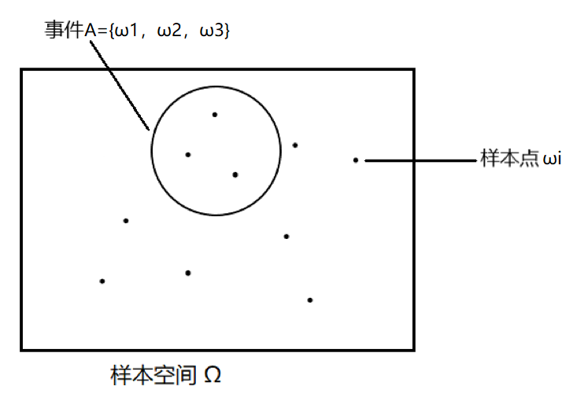

- 随机事件
	- 随机试验
	  collapsed:: true
		- 定义
			- 相同条件下，可以重复的随机现象的观察、记录和实验，常用字母E表示，
		- 特点
			- 实验可以在相同条件下重复进行，
			- 每次实验可能出现的结果不止一个，但实验前知道所有可能的结果，
			- 实验前无法得知哪个结果会出现，
	- 样本空间，样本点，事件
	  collapsed:: true
		- 样本空间：随机试验E的所有可能结果组成的*集合*称为E的样本空间，
		- 样本点：随机试验E的一种可能的结果，为样本空间集合中的*元素*，
		- 事件
			- 由部分样本点组成的样本空间集合的子集，
			- 若*存在*（并非*所有*）事件A中的某个样本点在实验中发生，则称这次实验中*事件A发生*，
		- {:height 200, :width 280}，
		- （由此可得基本的古典概型公式，即$P(A) = \dfrac{\sum \limits_{{\omega}_{i} \in A}{\omega}_{i}}{\sum \limits_{{\omega}_{i} \in \Omega}{\omega}_{i}} =\dfrac{n_A}{n}$），
- 事件的运算
	- [[集合论]]
	- 概述
	  collapsed:: true
		- 可以用基本事件和基本运算，表示（任意）其它的事件，
		- {:height 300, :width 410}
	- 对立事件（补集）
	  collapsed:: true
		- 定义：在样本空间S中但不在事件A中的样本点组成的事件称为A的对立事件，一般用 $\bar{A}$ 表示，
		- 性质
		  collapsed:: true
			- 若A、B为对立事件，则A、B一定为互斥事件；但反之一般不成立，
			- A、B为对立事件 $\leftrightarrow  A\cap B = \varnothing，且A\cup B = S$ ，
			- 若A、B为对立事件，则 $P(AB) = 0$ ；即对立事件不可能同时发生，也就没有条件概率 $P(A|B)$ ，
		- 运算
		  collapsed:: true
			- $P(A) + P(\bar{A}) = 1$ ，
			- $P(\overline {\overline{A}}) = P(A)$ ，
			- $P(\overline {AB}) = P(\overline {BA})$ ，
			- 一般 $P(\overline {AB}) \neq P(\bar{A}\bar{B})$ ， $P(\overline {AB\overline{C}}) \neq P(\overline {AB}C)$ ，应通过补集的定义和减法公式计算，
			  collapsed:: true
				- A、B独立时， $P(\bar{A}\bar{B}) = P(\bar{A})P(\bar{B})$ ，应区分事件与概率，
	- 互斥（不相容）
	  collapsed:: true
		- 定义：若事件A、B没有公共的样本点，则称事件A、B互斥，
		- A、B为互斥事件 $\leftrightarrow A\cap B = \varnothing$
		- 若A、B互斥，则 $P(AB) = 0$ ；即互斥事件不可能同时发生，也就没有条件概率 $P(A|B)$ ，
	- @极限事件
	  collapsed:: true
		- 可数集合
		- 无穷集合
- 《《概率的公理化定义
	- （引入）
	  collapsed:: true
		- 在没有概率的定义时，“频率”与“概率”之间的关系较为模糊，
		- 频率可以通过多次实验来获得，但不是一个确定的值；概率应该是一个确定的值，但其取值却需要频率来近似，
		- Kolmogorov 公理化体系基于集合论和测度论，对样本空间，事件，概率等进行了严谨的定义，
		- 其本质是用测度论的理论来解释概率理论，
	- （样本空间的推广）
	  collapsed:: true
		- 实际情况下，很多随机实验的样本空间的样本点都不止是可数个，
		- 例如，对于无限集合构成的样本空间，其子集数量也是无穷的，因此可能难以具体计算，
		- 为了保证概率的合法性，只需要把*可测的集合*定义为事件，并建立对应的概率测度即可，
	- 随机事件的公理化定义
		- \sigma域与其概率含义
		  collapsed:: true
			- 定义
			  collapsed:: true
				- 对于集合\Omega，称\Omega的*一组子集*$\mathcal{F}$为代数（域），
				- 若$\mathcal{F}$满足
				  collapsed:: true
					- $\Omega \in \mathcal{F}$，
					  collapsed:: true
						- （即所有实验结果组成的全集应该是可测的，即有概率），
					- 对补运算封闭：即$A \in \mathcal{F}$时，也有$\overline A \in \mathcal{F}$，
					  collapsed:: true
						- （若一个事件可测，则其对立事件也应该可测），
					- 对（无穷）并运算封闭：若$A_1, A_2... \in \mathcal{F}$，则$\mathop{\cup}\limits_{i =1} ^{\infty}A_i \in \mathcal{F}$，
					  collapsed:: true
						- （若多个事件都可测，则这些事件都发生（即这些事件的并集）也应该可测），
				- 则称$\mathcal{F}$为一个\sigma代数，称（$\Omega，\mathcal{F}$）为可测空间，
			- 基本性质
			  collapsed:: true
				- $\varnothing \in \mathcal{F}$
				  id:: 62846a6e-65f0-48fe-b9ef-edfdc8921509
				  collapsed:: true
					- $S \in \mathcal{F}$，$\overline S = \varnothing$，所以$\varnothing \in \mathcal{F}$
				- 对（无穷）交运算封闭：即$A_1, A_2... \in \mathcal{F}$时，有$\mathop{\cap}\limits_{i =1} ^{\infty}A_i \in \mathcal{F}$，
				  collapsed:: true
					- $A_i \in \mathcal{F}$，$\overline A_i \in \mathcal{F}$，$\mathop{\cup}\limits_{i =1} ^{\infty} \overline {A_i} \in \mathcal{F}$，
					- $\mathop{\cup}\limits_{i =1}^{\infty} \overline{A_i} = \overline{\mathop{\cap}\limits_{i =1}^{\infty}A_i}$（德摩根定律），即$\overline{\mathop{\cap}\limits_{i =1}^{\infty}A_i} \in \mathcal{F}$，
					- $\overline{\overline{\mathop{\cap}\limits_{i =1}^{\infty}A_i}} = \mathop{\cap}\limits_{i =1}^{\infty}A_i$，所以$\mathop{\cap}\limits_{i =1} ^{\infty}A_i \in \mathcal{F}$，
				- 对（可列）并运算封闭：即$A_1, A_2... \in \mathcal{F}$时，有$\mathop{\cup}\limits_{i =1} ^{n}A_i \in \mathcal{F}$，
				- 对（可列）交运算封闭：即$A_1, A_2... \in \mathcal{F}$时，有$\mathop{\cup}\limits_{i =1} ^{n}A_i \in \mathcal{F}$，
				- 对减运算封闭：若$A_{i}, A_{j} \in \mathcal{F}$，则$A_{i} - A_{j} \in \mathcal{F}$，
				- 以上性质的推导，说明了\sigma域可以满足对*所有事件的概率*的计算，
		- Borel事件域
		  collapsed:: true
			- 引入
			  collapsed:: true
				- 设总的样本空间为集合\Omega，\Omega中的元素为样本点，
				- 可知集合\Omega上的\sigma代数可以*有多个*，如$\{\varnothing, S \}$，$\{\varnothing, A, \bar{A}, S \}$等都满足\sigma代数的定义，
				- 为了定义所有事件的测度，需要确定一个更具体的\sigma代数，
			- 定义1
			  collapsed:: true
				- 称所给出的一些集合所作的各种（有限次或可列次）取补，取交和取并运算以及它们的混合运算为 Borel 运算，
				- 定义由开集和闭集的类作一切可能的 Borel 运算得到的所有集合构成的域为Borel 域，
			- 定义2
			  collapsed:: true
				- 对于集合\Omega和\Omega上的任意\sigma代数$\mathcal{F}$，具有如下性质的\sigma代数是唯一的，
					- 包含$\mathcal{F}$，
					- 若有其它\sigma代数包含$\mathcal{F}$，则必包含在该\sigma代数内，
				- 称这样的\sigma代数为Borel事件域，
			- 构造
			  collapsed:: true
				- 若S可数，则含有n个元素的最小的Borel域应有（2^{n} - 1）+ 1（空集）个集合，
					- 最简单的样本空间为$S = \{ A, \bar{A}\}$（例如扔硬币就可以写为{正，反}），其对应的\sigma域为$\sigma = \{\varnothing, A, \bar{A}, S \}$，
				- 若S不可数，则可先选定一些端点（a1，a2…），再利用这些端点将S划分为多个集合，并利用这些集合进行并、交运算，
		- （乘积空间）
		  collapsed:: true
			- \sigma域的运算
			  collapsed:: true
				- 同一样本空间S中的不同\sigma域的交集仍为\sigma域，
				  id:: 6295636e-78ce-467b-a819-79a5720c1833
				- 同一样本空间S中的不同\sigma域的并集可能不再是\sigma域，
					- 例如$S = \{1, 2 ,3, 4\}$，$\sigma_{1} = \{\varnothing, 1, \{2, 3, 4\}, S \}$，$\sigma_{2} = \{\varnothing, 2, \{1, 3, 4\}, S \}$，
					- 因此，$\sigma_{1} \cup \sigma_{2} = \{\varnothing, 1, 2, \{1, 3, 4\},  \{2, 3, 4\},S \}$，
					- 然而，可以看出$\sigma_{1} \cup \sigma_{2}$中的事件$\{1\}$, $\{2\}$的并$\{1, 2\}$不在$\sigma_{1} \cup \sigma_{2}$中，即不满足对并运算封闭的性质，
				-
	- 概率的公理化定义
		- 样本空间为集合\Omega，$\mathcal{F}$为S中的一个Borel事件域，
		- 若定义在$\mathcal{F}$上的*函数*P满足
		  collapsed:: true
			- 非负性：对任意$A \in \mathcal{F}, P(A) \geq 0$，
			- 正则性（规范性）：$P(\Omega) = 1$，
			- 可列可加性（完全可加性）：若$A_1, A_2... \in \mathcal{F}$且两两互斥，则$P(\mathop{\cup}\limits_{i =1}^{\infty}A_i ) = \sum\limits_{i =1}^{\infty} P(A_i)$，
		- 则称P为一个$\mathcal{F} \rightarrow \mathbb{R}$上的*概率函数*，称$\{\Omega, \mathcal{F}, P\}$为一个概率空间，
		  collapsed:: true
			- 满足上述要求的函数就是一个规范的测度，
			- 在上述要求之下，每一个事件都对应着一个具体的测度值（概率），
			- 示例
			  id:: 62884a5d-9316-4689-96b9-005cc6b10019
			  collapsed:: true
				- 对于扔硬币，$\Omega = \{H, T\}$,
				- $\mathcal{F} = \{\varnothing, H, T, \Omega\}$；
				- $P = \{P(\varnothing) = 0, P(H) = \frac{1}{2}, P(T) = \frac{1}{2}, P(\Omega) =  1\}$
	- 概率（函数）的性质
		- $P(\varnothing)  = 0$
		  collapsed:: true
			- 由集合论
			  collapsed:: true
				- $\varnothing \cup \varnothing \cup \varnothing ...\varnothing = \varnothing$，
				- $\varnothing$之间两两互斥，
			- 由可列可加性
			  collapsed:: true
				- $P(\varnothing \cup \varnothing \cup \varnothing ...\varnothing) = P(\varnothing)  = P(\varnothing) + P(\varnothing) + P(\varnothing)...+ P(\varnothing)$，
				- 即$P(\varnothing) + P(\varnothing) + P(\varnothing)...+ P(\varnothing) = 0$，
			- 由非负性，可知$P(\varnothing)  = 0$，
		- 有限可加性
		  collapsed:: true
			- 若*有限个事件*$A_1, A_2..., A_n\in \mathcal{F}$且两两互斥，则$P(\mathop{\cup}\limits_{i =1}^{n}A_i ) = \sum\limits_{i =1}^{n} P(A_i)$，
			- 可列可加 + $P(\varnothing)  = 0$ →有限可加，
			- 有限可加 + 上连续 → 可列可加，
			- 推论：$P(A) + P(\bar{A}) = 1$，
		- （可减性）
		  collapsed:: true
			- 设A、B为两个事件，若A\subset B，则$P(B-A) = P(B) - P(A)$，
		- 单调性
		  collapsed:: true
			- 设A、B为两个事件，若A\subset B，则$P(A) \leq P(B)$，
			- 推论：$0\leq P(A) \leq 1$
		- （容斥公式）
		  collapsed:: true
			- {:height 160, :width 410}，
			- {:height 290, :width 410}，
		- 连续性
		  collapsed:: true
			- 事件序列（集合的极限）
			  collapsed:: true
				- 单调序列
					- 若事件序列$A_{n}$满足$A_{1} \subset A_{2} ...\subset A_{n} \subset A_{n+1} \subset ...$，则称$A_{n}$为单调增序列，
					- 若事件序列$B_{n}$满足$B_{1} \supset B_{2} ...\supset B_{n} \supset B_{n+1} \supset ...$，则称$B_{n}$为单调减序列，
				- 单调序列的极限
					- 定义事件$\mathop{\cup}\limits_{n =1}^{\infty}A_{n}$为*单调增*事件序列{A_{n}}的极限，记为$\lim\limits_{n \to \infty}A_{n}  = \mathop{\cup}\limits_{n =1}^{\infty}A_{n}$，
					- 定义事件$\mathop{\cap}\limits_{n =1}^{\infty}B_{n}$为*单调减*事件序列{B_{n}}的极限，记为$\lim\limits_{n \to \infty}B_{n}  = \mathop{\cap}\limits_{n=1}^{\infty}B_{n}$，
			- 概率的连续性
			  collapsed:: true
				- 下连续：对于*单调增*事件序列{A_{n}}，有$P (\mathop{\cup}\limits_{n =1}^{\infty}A_{n}) = \lim\limits_{n \to \infty}P(A_{n})$，
					- 若$\mathop{\cup}\limits_{n =1}^{\infty}A_{n} = \Omega$，则$\lim\limits_{n \to \infty}P(A_{n}) = 1$
				- 上连续：对于*单调减*事件序列{B_{n}}，有$P (\mathop{\cap}\limits_{n =1}^{\infty}B_{n}) = \lim\limits_{n \to \infty}P(B_{n})$，
					- 若$\mathop{\cap}\limits_{n =1}^{\infty}B_{n} = \varnothing$，则$\lim\limits_{n \to \infty}P(B_{n}) = 0$，
				- 其含义为事件的极限概率$\lim\limits_{n \to \infty}P$与极限事件$\mathop{\cup}\limits^{\infty}A$的概率相同；即求事件极限和概率极限是可交换的，
				- 概率既是上连续的，也是下连续的，
		- 次可加性
		  collapsed:: true
			- 对任意的$A_1, A_2... \in \mathcal{F}$，有$\sum\limits_{i =1}^{\infty} P(A_i) \geq P(\mathop{\cup}\limits_{i =1}^{\infty}A_i )$，
- 条件概率
	- 基本概念
		- 引入
		  collapsed:: true
			- 若已知事件B发生，此时事件A发生的概率应不同于一般情况；例如整体样本空间中，事件A发生，但是事件B不发生的情况是不可能出现的，
			- 可以理解为，此时*样本空间*发生了变化，由整体的实验E变为了事件B，
			- 从古典概型来看，事件B发生对应的样本集合为$\sum \limits_{{\omega}_{i} \in B} = n_B$ ，而A，B同时发生对应的样本集合为$\sum \limits_{{\omega}_{i} \in (A \cap B)} = n_{AB}$，
			- 因此，事件B发生的条件下，事件A发生的概率为 $\dfrac{n_{AB}}{n_{B}}$ ，
			- 设n为总体样本空间中样本点的个数，则上述概率可写为 $\dfrac{\frac{n_{AB}}{n}}{\frac{n_{B}}{n}} = \dfrac{P(AB)}{P(B)}$ ，将这个概率定义为事件B发生的条件下，事件A发生的条件概率，记为$P(A|B)$，
		- 定义
		  collapsed:: true
			- 对于概率空间$(\Omega, \mathcal{F}, P)$，
			- 若$B\in \mathcal{F}$为一个事件，且*P(B) > 0*；
			- 则对任意$A \in \mathcal{F}$，定义$P(A | B) = \dfrac{P(AB)}{P(B)}$为事件B发生的条件下，事件A发生的条件概率，
			- 可以验证P(A|B)也为F上的概率，即满足概率的三条基本性质，
		- 性质
		  collapsed:: true
			- $P(\varnothing|B) = 0, P(\Omega | B) = 1$，
				- $P(\Omega | B) = \dfrac{P(\Omega, B)}{P(B)} = \dfrac{P(B)}{P(B)} = 1$，
			- $0\leq P(A|B) \leq 1$
	- 事件的独立性
		- 定义
		  collapsed:: true
			- 若对于事件A、B，其*概率*P(AB) = P(A)P(B)，则称事件A、B统计独立；即独立性由概率定义，而并非具体事件（集合），
			- 不同于条件概率，独立性的定义中*不要求*P(A)、P(B)或P(AB) > 0，
		- 推广（多个事件）
		  collapsed:: true
			- 两两独立
			  collapsed:: true
				- 若事件A、B、C只满足概率P(AB) = P(A)P(B)、P(AC) = P(A)P(C)、P(BC) = P(B)P(C)，则称事件A、B、C两两独立，
				- 对于事件$A_{1},A_{2}...,A_{n}$，若其只满足对任意i、j，都有$P(A_iA_j) = P(A_i)P(A_j)$，则称这n个事件两两独立 ，
			- 相互独立
			  collapsed:: true
				- 若事件A、B、C满足概率P(AB) = P(A)P(B)、P(AC) = P(A)P(C)、P(BC) = P(B)P(C)，*而且*P(ABC) = P(A)P(B)P(C)，则称事件A、B、C相互独立，
				- 对于事件$A_{1},A_{2}...,A_{n}$，若其满足*2^{n}-n-1个等式*$P(A_iA_j) = P(A_i)P(A_j),P(A_iA_jA_k) = P(A_i)P(A_j)P(A_k), …P(A_1A_2…A_n)= P(A_1)P(A_2)…P(A_n)$，则称这n个事件相互独立 ，
		- 独立事件性质
		  collapsed:: true
			- 基本性质
			  collapsed:: true
				- 若A、B互斥，则P(AB) = 0但一般P(A)、P(B) \neq 0，即互斥事件一般不独立，
				- 若A为空集，则P(A) = 0且P(AB) = 0，因此空集和任意事件都独立，
				- 若A为全集，则P(A) = 1且P(AB) = P(B)，因此全集和任意事件都独立，
			- 定理
			  collapsed:: true
				- 若P(B) > 0，则A、B独立$\leftrightarrow P(A|B) = P(A)$，
				- 若$P(A_1A_2...A_n)  >  0$，则$A_{1},A_{2}...,A_{n}$相互独立$\leftrightarrow$对*任意*$A_{i0},A_{i1}...,A_{im}$，都有$P(A_{i0} | A_{i1}A_{i2}...A_{im})  = P(A_{i0})$，
			- 独立事件的复合事件
			  collapsed:: true
				- 若$A、B$独立，则$\bar{A}、B$；$\bar{B}、A$；$\bar{A}、\bar{B}$之间也独立，
				- 若$A_{1},A_{2}...,A_{n}$相互独立，则$\bar{A_{i}}、A_{j}$之间也相互独立，
				- 相互独立事件运算得到的事件也是独立的，
				  collapsed:: true
					- 例如，若A、B、C、D独立，则$A \cup B, C-D$也是独立的，
	- 条件独立
		- 定义
		  collapsed:: true
			- 若$P(AB|C) =P(A|C)P(B|C)$，则称事件A和B关于事件C条件独立，
			- 可以理解为事件C的发生使得A和B相互独立，
		- 性质
		  collapsed:: true
			- 定理：若$P(BC) > 0$，则$(P(A|B|C) =) P(A|BC) = P(A|C) \leftrightarrow$事件A和B关于事件C条件独立，
				- $P((AB)|C) = \dfrac{P(ABC)}{P(C)} = \dfrac{P(ABC)}{P(BC)} \dfrac{P(BC)}{P(C)} = P(A|(BC))P(B|C)=P(A|C)P(B|C)$，
			- 若$A、B$关于C条件独立，则$\bar{A}、B$也关于C条件独立，
			- 然而，$A、B$关于C条件独立不能说明$A、B$也关于$\bar{C}$条件独立，
		- 推广
		  collapsed:: true
			- 对于事件$B，A_{1},A_{2}...,A_{n}$，若P(B) > 0，且其满足多个等式$P(A_iA_j|B) = P(A_i|B)P(A_j|B),P(A_iA_jA_k|B) = P(A_i|B)P(A_j|B)P(A_k|B), …P(A_1A_2…A_n|B)= P(A_1|B)P(A_2|B)…P(A_n|B)$，则称这n个事件A_{i}关于B条件独立 ，
			- 条件独立与独立*不能互推*，
	- 独立重复实验（伯努利试验）
-
- [[概率论]]