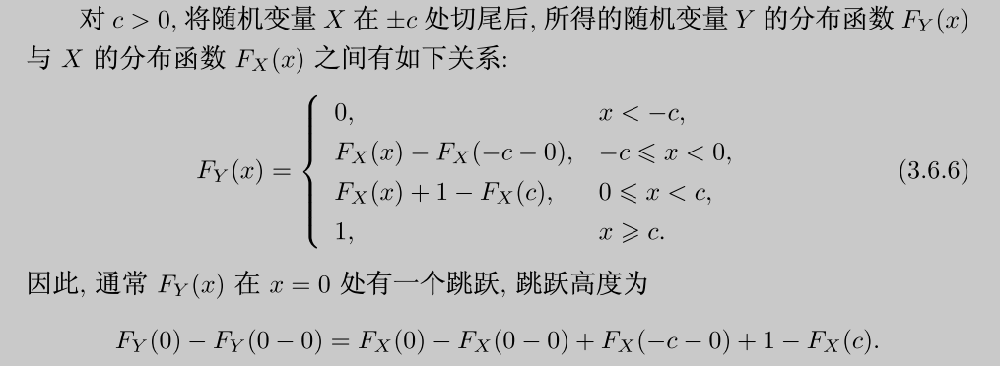

- 概述
  collapsed:: true
	- （合法性：博雷尔可测函数）
	  collapsed:: true
		- 引理：若X，Y均为$\{S, \mathcal{F}, P\}$上的随机变量，则函数X + Y也为$\{S, \mathcal{F}, P\}$上的随机变量，
		  id:: 629ff541-e281-4050-baed-586727108dbc
	- 对于多变量的情况，可以先从单变量的角度考虑，并逐步推广，
	- （连续型）随机变量的变换的实质就是积分的换元，因此求解的关键就是积分区域的划分和积分函数的变换方式，
-
- 变量
  collapsed:: true
	- 类型：离散，连续；混合，
	- 维度：一元-一元，多元-一元，多元-多元，
	- 应先考虑是否能够应用已证明的*随机变量*间的关系，如变量的可加性等，
	- 再考虑对*密度函数*进行求解，
- 支集
  collapsed:: true
	- 原变量
	- 新变量
	  collapsed:: true
		- 连续：不等式变换/边界变换，增补变量法，
		- 离散：穷举，
- 概率（事件）
  collapsed:: true
	- 拆分支集，按支集分别计算概率，
	- 应先将 cdf 写为概率，再分析概率对应的“事件”；再由事件反推概率，并求解cdf，
	- 离散：求和
	  collapsed:: true
		- 分析/引入求和变量，
	- 连续：积分
	  collapsed:: true
		- 确定积分变量，积分限，
		- 确定事件（概率P）→ cdf的定义（函数F）
	- 连续：公式（R^{2} \to R）
	  collapsed:: true
		- 求解技巧
		  collapsed:: true
			- 从概率（cdf）出发，写出二重积分，
			- 进行换元，
				- 二重积分的换元可以写为两个积分变量的函数，
				- 即t = t(x, y), u = u(x, y)，
			- 得到的二重积分为z的cdf，一般为以z为自变量的积分上限函数，
			- 若能够将z和x，y从积分限上分离，则可以对z求导得到z的pdf，
		- 函数的卷积（加法）
		  collapsed:: true
			- 设Z = X + Y，S_{X} = S_{Y} = R，
			- 则$f_{Z}(z) = \int_{-\infty}^{+\infty}f_{XY}(t, z - t)dt = \int_{-\infty}^{+\infty}f_{XY}(z - t, t)dt$，
			- 证明
			  collapsed:: true
				- $P(Z \le z) = P(X+Y \le z) = \iint_{X+Y \le z}f(x, y)dxdy$，
				- $= \int_{-\infty}^{+\infty}dx\int_{-\infty}^{z - x}f(x, y)dy$
				- 换元；设t = t(x, y) = x + y，y = t - x；则dt = dy，$y|_{-\infty}^{z-x} \to t|_{-\infty}^{z}$，
				- $=\int_{-\infty}^{+\infty}dx\int_{-\infty}^{z}f(x, t-x)dt$
				- 交换积分次序；$=\int_{-\infty}^{z}[\int_{-\infty}^{+\infty}f(x, t-x)dx]dt$，
				- 对z求导，即可得$=\int_{-\infty}^{+\infty}f(x, z-x)dx$，
		- 乘积
		  collapsed:: true
			- 设Z = XY；S_{X} = S_{Y} = (0, +\infty)，
			- 则$f_{Z}(z) = \int_{0}^{+\infty}\frac{1}{t}f_{XY}(t, \frac{z}{t})dt$，
		- 商
		  collapsed:: true
			- 设Z = X/Y；S_{X} = S_{Y} = (0, +\infty)，
			- 则$f_{Z}(z) = \int_{0}^{+\infty}tf_{XY}(zt, t)dt = \frac{1}{z^{2}}\int_{0}^{+\infty}tf_{XY}(t, \frac{t}{z})dt$，
	- 多元-多元变换
	  collapsed:: true
		- X_{n} \to Y_{m}，m = n：一一变换
		  collapsed:: true
			- 设$\begin{pmatrix}X_{1} & X_{2} & … & X_{n} \end{pmatrix}$为随机向量，其联合pdf为$f_{X}(x_{1}, x_{2},…,x_{n})$，
			- 对于新随机向量$\begin{pmatrix}Y_{1} & Y_{2} & ... & Y_{n} \end{pmatrix}$，设$Y_{i} = g_{i}(X_{1}, X_{2},…,X_{n})$，
			- 条件
			  collapsed:: true
				- 每个变换g_{i}都是一对一变换，即存在逆变换$X_{i} = g^{-1}_{i}(y_{1}, y_{2},...,y_{n}) = u_{i}(y_{1}, y_{2},...,y_{n})$，
				- 逆变换都有一阶连续偏导数，且雅可比行列式$|J| \neq 0$（其中$J_{ij} = \dfrac{\partial x_{i}} {\partial y_{j}} = \dfrac{\partial u_{i}(y_{1}, y_{2},...,y_{n})} {\partial y_{j}}$），
			- 则随机向量$\begin{pmatrix}Y_{1} & Y_{2} & ... & Y_{n} \end{pmatrix}$的概率密度函数为$f_{X}(u_{1}(y_{1}, y_{2},...,y_{n}), u_{2}(y_{1}, y_{2},...,y_{n}),...,u_{n}(y_{1}, y_{2},...,y_{n}))|J|$，
		- 特例：正交变换
		  collapsed:: true
			- 设$\begin{pmatrix}X_{1} & X_{2} & ... & X_{n} \end{pmatrix}$，$\begin{pmatrix}Y_{1} & Y_{2} & ... & Y_{n} \end{pmatrix}$为随机向量，
			- 变换$\vec{Y} = Q\vec{X}$，其中Q为正交矩阵，
		- X_{n} \to Y_{m}，m < n
		  collapsed:: true
			- 一般采用增补变量法，转化为m = n的情形，
			- 再对多余的变量积分，得到Y_{m}的密度函数，
			- （m > n时，不能保证每个变换的逆变换都存在；因此一般不考虑这种情况），
		- 拆分为多个一一变换
		  collapsed:: true
			- 一般原则为，将支集拆分为互斥的集合（即支集的一个划分），使每个子集上为一对一变换，
			- 具体计算时仍应先分析$\vec{X}， \vec{Y}$的支集，
			- 映射到$\vec{Y}$的*同一支集*上的变换， 可以将其密度函数（概率）直接相加，
			  id:: 62a2a03b-177a-454a-9262-b7e62012ee22
			  collapsed:: true
				- 应注意不同的支集上的逆变换可能不同，因此雅可比行列式也可能不同，
				- 即$\begin{pmatrix}Y_{1} & Y_{2} & ... & Y_{n} \end{pmatrix}$的概率密度函数为$\sum\limits_{i = 1}^{k} f_{X}(u_{1i}(\vec{y}), u_{2i}(\vec{y})…, u_{ni}(\vec{y}))|J_{i}|$，
			- 映射到$\vec{Y}$的*不同支集*上的变换，则应写为分段函数，
			- 示例
				- 对于$X \in(-1,3), Y =X^2$
				- X的不同支集 → Y的同一支集：概率相加，即 $P(0<Y<1) = P(-1<X<0)+P(0<X<1)$，
				- X的不同支集 → Y的不同支集：分段函数，即 $P(1<Y<9) = P(1<X<3)$，与前两段无关，
	- [[多变量微积分]]
-
- 计算技巧
  collapsed:: true
	- 事件的数学语言表示
	  collapsed:: true
		- 应首先尝试对“事件”（即概率$P(f(x,y)\leq z)$进行化简，如转化为已知分布的形式；化简时应注意不等号的方向，
	- 联合分布
	  collapsed:: true
		- 全概率公式
		  collapsed:: true
			- 事件，$P(Z \le z) = P(X + Y \le z)$，
			- 联合分布，$= P(X + Y \le z, Y = 1) + P(X + Y \le z, Y = 2)$，
			- 全概率公式（条件分布），$= P(X + Y \le z|Y = 1)P(Y = 1) + P(X + Y \le z|Y = 2)P(Y = 2)$，
			- 简化事件，$= P(X + 1 \le z)P(Y = 1) + P(X + 2 \le z)P(Y = 2)$，
			  collapsed:: true
				- 给定条件以后，可以用条件（如Y = y）简化分布，
				- 如果简化后的分布与条件随机变量无关，则可以转为无条件分布，
			- 独立性，条件分布
			  collapsed:: true
				- 由于独立随机变量的概率密度可拆分，因此应先分析变量间的独立性；
				- 可以通过分析随机变量之间的关系寻找突破，
		- cdf的拆分
		  collapsed:: true
			- $P(Y_{1} \le x, Y_{2} \le y)$
			- $= P(1, Y_{2} \le y) - P(x < y_{1}, Y_{2} \le y)$
			- $= P(Y_{2} \le y) - P(x < y_{1}, Y_{2} \le y)$，
	- 积分的计算
	  collapsed:: true
		- 含参数的二重积分的积分限的划分方式与普通的二重积分类似，只是参数z可能会出现在原本为常数的积分范围中，应画图辅助分析，
		- 一般方法为先由概率求出cdf，再求导得到pdf，然而也存在部分积分上限函数（如部分抽象函数），无法直接求导得到pdf闭形式，
		- 对于均匀分布等，二重积分换元后的函数与雅可比行列式|J|可能变化较小，但支集的变化一般较大，即随机变量的边缘分布会有差异，
		- 对于离散-连续混合分布，若难以写出pmf的表达式，可以写成分布列的形式，
		- 对于较复杂的函数变换，若难以直接计算分布，可以考虑引入新的随机变量，
		  collapsed:: true
			- 对于离散变量，可以引入第三变量 i 以便于求和，
			- 示例：离散卷积公式$P(Z = z) = \sum\limits_{i=0}^z P(X = i, Y = z - i) = \sum\limits_{i=0}^z P(X = i) P(Y = z - i|x = i)$，
		- ?若函数变换较复杂，可以尝试求“逆变换”，
		  collapsed:: true
			- 设X，Y为二元随机向量，随机向量U = u(x, y)，V = v(x, y)，
			- 则由换元法，可知$f_{UV}(u, v) = f_{XY}(x(u, v), y(u, v))|J_{XY \to UV}| = f_{XY}(x, y)|J_{XY \to UV}|$，
			- 反之，也有$f_{XY}(x, y) = f_{UV}(u(x, y), v(x, y))|J_{UV \to XY}| = f_{UV}(u, v)|J_{UV \to XY}|$，
			- 因此，$f_{UV}(u, v) = \dfrac{f_{XY}(x, y)}{|J_{UV \to XY}|}$，
	- 数学归纳法与递推公式
	  collapsed:: true
		- 对于n个随机变量的情况，一般应尝试数学归纳法与递推公式，
		- 如求解\chi^{2}分布和\Gamma分布的密度函数，
- 特征函数方法
  collapsed:: true
	- 定理：若X_{i}之间相互独立，则$\varphi_{\Sigma X_{i}}(t) = \prod \varphi_{X_{i}}(t)$；但其逆命题不成立，
- 常用分布
  collapsed:: true
	- 最大值与最小值
	  collapsed:: true
		- 应综合次序统计量的理论分析，
		- 两个随机变量
		  collapsed:: true
			- $U = \max (X, Y) = \frac{X + Y + |X - Y|}{2}$，
			- $V = \min(X, Y) = \frac{X + Y - |X - Y|}{2}$，
			- 即$U + V = X + Y, UV = XY$，
		- 多个随机变量
		  collapsed:: true
			- $U = \max (X_{1}, X_{2}，…，X_{n})$，
			- 对应事件$P(U \le u) = P(\max (X_{1}, X_{2}，…，X_{n}) \le u) =P(X_{1} \le u, X_{2} \le u，…，X_{n} \le u)$，
			- 若X_{i}独立同分布，则有F_{U}(u) = [F_{X}(u)]^{n}，
			- $V = \min (X_{1}, X_{2}，…，X_{n})$，
			- 对应事件$P(V \le v) = P(\min (X_{1}, X_{2}，…，X_{n}) \le v) =1 - P(\min (X_{1}, X_{2}，…，X_{n}) \ge v) = 1 - P(X_{1} \ge v, X_{2} \ge v，…，X_{n} \ge v)$，
			- 若X_{i}独立同分布，则有F_{V}(v) =1 - [1 - F_{X}(v)]^{n}，
	- 均值分布
	  collapsed:: true
		- 分布的求解
		  collapsed:: true
			- 若分布具有可加性，则可较快的算出均值的分布，
			- 因此，寻找特定分布与具有可加性的分布之间的联系，是求解均值的分布的一种方式，
			- 也可考虑大样本方法，即利用中心极限定理得出均值的分布，
		- 离散分布
		  collapsed:: true
			- 二项分布（n = 1时为伯努利分布）
			  collapsed:: true
				- 若X_{i}独立，且$X_{i} \sim b(n_{i}, p)$，
				- 则由二项分布的可加性，有$\sum X_i \sim b(\sum n_{i}, p)$，即$P(\sum X_{i} = k) = {\sum n_{i} \choose k}p^{k}(1-p)^{\sum n_{i} - k}$，
				- 由于$\sum X_{i} = n\bar{X}$，所以均值的分布可直接写为$P(\bar{X} = \frac{k}{n}) = {\sum n_{i} \choose k}p^{k}(1-p)^{\sum n_{i} - k}$，
				- （即不需要推出$\bar{X} = k$的直接表达式），
			- 帕斯卡分布（n = 1时为几何分布）
			  collapsed:: true
				- 若X_{i}独立，且$X_{i} \sim PA(r_{i}, p)$，
				- 则由帕斯卡分布的可加性，有$\sum X_i \sim PA(\sum r_{i}, p)$，即$P(\sum X_{i} = k) = {k - 1 \choose \sum r_{i} - 1}p^{\sum r_{i}}(1-p)^{k - \sum r_{i}}$，
				- 由于$\sum X_{i} = n\bar{X}$，所以均值的分布可直接写为$P(\bar{X} = \frac{k}{n}) =  {k - 1 \choose \sum r_{i} - 1}p^{\sum r_{i}}(1-p)^{k - \sum r_{i}}$，，
				- （即不需要推出$\bar{X} = k$的直接表达式），
			- 泊松分布
			  collapsed:: true
				- 若X_{i}独立，且$X_{i} \sim P(\lambda_{i})$，
				- 则由泊松分布的可加性，有$\sum X_i \sim P(\sum \lambda_{i})$，即$P(\sum X_{i} = k) = e^{-\Sigma \lambda_{i}}\dfrac{{(\sum \lambda_{i})}^{k}}{k!}$，
				- 由于$\sum X_{i} = n\bar{X}$，所以均值的分布可直接写为$P(\bar{X} = \frac{k}{n}) =   e^{-\Sigma \lambda_{i}}\dfrac{{(\sum \lambda_{i})}^{k}}{k!}$，
				- （即不需要推出$\bar{X} = k$的直接表达式），
		- 连续分布
		  collapsed:: true
			- 正态分布
			  collapsed:: true
				- 若X_{i}独立，且$X_{i} \sim N(\mu_{i}, \sigma_{i}^{2})$，
				- 则由正态分布的可加性，有$\sum X_i \sim N(\sum \mu_{i}, \sum \sigma_{i}^{2})$，
				- 根据正态分布的性质，可知$\bar{X} \sim N(\dfrac{\Sigma \mu_{i}}{n}, \dfrac{\Sigma \sigma^{2}_{i}}{n^{2}})$，
				- 若X_{i}独立且同分布，即$X_{i} \sim N(\mu, \sigma^{2})$，则$\bar{X} \sim N(\mu, \dfrac{\sigma^{2}}{n})$,
	- 截尾分布
	  collapsed:: true
		- {:height 180, :width 460}
- [[统计量]]
- [[概率论]]