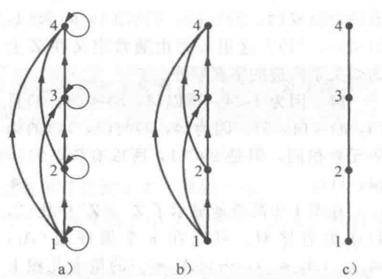

- [[映射与函数]]
- 集合
	- 基本概念
	  collapsed:: true
		- 定义
		  collapsed:: true
			- 称一系列事物的*无序*组合为一个集合（set），一般写为A = {element1，element2……}，
			- 称集合中的事物为元素（element），记为a \in A，
			- 集合的定义并没有限制集合中的元素的种类，即数字，字符，符号等可以混在一起组成一个集合，
			- 理论上，集合内的元素是*不能重复*的，
		- 描述方式
		  collapsed:: true
			- 穷举法
			  collapsed:: true
				- 对于只有少量元素的集合，可以将集合中的所有元素都写出来，
				- 例如元音字母$V = \{a, e, i, o, u\}$，
			- 元素性质
				- 若集合中的元素较多，但有某种共同的“性质”；则可使用这种规则来表示集合，
					- 此处的性质应为明确的，无歧义的语言，
				- 例如（闭）区间$[a, b] = \{x | a \leq x \leq b\}$，
			- Venn图
			  collapsed:: true
				- 对集合的一种直观的图形表示，
				- 对于多个集合，Venn图的表述可能并不精确，
				- 一般利用矩形框表示全集，圆形表示集合，点表示集合中的元素，
				- {:height 120, :width 180}
		- 空集与全集
		  collapsed:: true
			- 称不包含任何元素的集合为空集∅，
				- 空集本身也是一个元素（集合），即集合{∅}不再是空集，
			- 称“所有”元素的集合为全集，一般用Ω表示，
		- 其它
		  collapsed:: true
			- 有序集合（向量）
			  collapsed:: true
				- 定义
				  collapsed:: true
					- 称有序排列的集合{a, b, c..., z}为有序n元组，记为(a, b, c..., z)，
			- （多重集）
			  collapsed:: true
				- 允许包含重复元素的集合称为多重集，如{1, 1, 2, 2}，
				- 可以将其记为{m_{1}\cdot a_{1}, m_{2}\cdot a_{2}…}，其中m_{i}为元素a_{i}的重复次数，如{1, 1, 2, 2} = {2\cdot 1, 2\cdot 2}，
	- 集合的大小（势）
	  collapsed:: true
		- 有限集与无限集
		  collapsed:: true
			- 有限集：所含的元素为有限个的集合，
			  collapsed:: true
				- 定义：若存在正整数集N+的子集{1，2，…，m}（m为正整数）到集合A的*双射*关系，则称集合A是有限集，
			- 无限集：所含的元素为无限个的集合，
			  collapsed:: true
				- 无限可数集
					- 如果无限集A中的元素，可以按一定规律（一般为字典法则）排成一列，则称A是可数集（可列集），
					- 定理
					  collapsed:: true
						- 在所有无限集中，正整数集N+的势最小，
						- 若存在正整数集N+到集合U的*满射*关系，则集合U是无限可数集，
						- 若存在正整数集N+到集合A的*双射*关系，则集合A是无限可数集，
					- 整数集Z，有理数集Q都为无限可数集，
					  collapsed:: true
						- 正有理数的定义为形如p/q的分数，其中p, q \in N+，且无公因子，
						- 负有理数和正有理数一一对应，
						- 存在N到Z的满射，和Z到Q的满射，
					- （一般将无限可数集和有限集统称为（至多）可数集），
				- 无限不可数集
				  collapsed:: true
					- 无理数集和实数集R都是无限不可数集，
			- 应用
			  collapsed:: true
				- 可数集和不可数集的区分，是定义定积分的可积性和离散/连续随机变量的基础，
		- 基数（势）
		  collapsed:: true
			- 定义
			  collapsed:: true
				- 若集合A为可数集合，则称集合A的元素数量为集合A的基数，记为|A|，
				- 对于任意集合，定义A的“元素数量”为A的势，记为$\overline{\overline{A}}$，
			- 势的比较
				- 有限集
				  collapsed:: true
					- 有限集的基数可以直接比较，
					- 若两个集合的基数相等，则称两个集合等势，
				- 无限集
				  collapsed:: true
					- 无限集的基数不能直接对比，主要方式为寻找集合间的函数关系，
					- 定义：对于集合A，B，若存在从A到B的单射f，则称A的势小于等于B的势，
					  collapsed:: true
						- 可知，若A为B的子集，则A到B上必存在恒等映射，因此A的势小于等于B的势，
						- 然而，A为B的子集或真子集，不能推出A的势严格小于等于B的势，
						- 对于集合A，B，若A的势小于等于B的势，且A的势不等于B的势，则A的势(严格)小于B的势，
					- 定理：对于集合A，B，若存在从A到B的单射f，也存在从B到A的单射g，则称这两个集合的基数相等，或称两个集合“等势”，
					  collapsed:: true
						- 上述定理简化了证明等势的方式，即不需要找到集合A，B上的一一对应函数，就可以证明等势，
						- 有时找到单射较容易，但找到满射（即一一对应）函数可能较为困难，
					- 示例
					  collapsed:: true
						- R与（0，1）
						  collapsed:: true
							- 函数$f(x) = \dfrac {1}{1 + e ^ {-x}}$为实数集R到区间（0，1）上的一一对应函数，
							- 所以R与（0，1）等势，
						- (0, 1)与(0, 1]
							- 虽然两个集合“只”差一个元素1，但由于两者都是*不可数*集合，因此*不能*直接比较，
							- 函数$f:y = x$是(0, 1)到(0, 1]的一对一函数，
							- 函数$g:y = \dfrac{x}{2}$是(0, 1]到(0, 1)的一对一函数，此处的函数g不是满射（即陪域不同于值域），但仍满足函数的定义，
							- 因此(0, 1]和(0, 1)等势，
				- 定理：存在A到B的双射（一一对应函数）的充要条件为集合A，B的势相同，
			- 基数的运算
			  collapsed:: true
				- 容斥原理：$|A\cup B| = |A| + |B| - |A\cap B|$，
		- 性质
		  collapsed:: true
			- 可数个可数集的并集也为可数集，
	- 集合的运算
	  collapsed:: true
		- 基本运算
			- Venn图
			  collapsed:: true
				- {:height 299, :width 421}
			- 相等 =
			  collapsed:: true
				- 定义：两个集合相等当且仅当它们拥有同样的元素，即$\forall x (x \in A \leftrightarrow x \in B) \leftrightarrow  A = B$，
				- 定理：若$A \subseteq B且B \subseteq A$，则A = B，
				- 集合中的元素是无序的，即{1，3}和{3，1}是相等的，
				  collapsed:: true
					- 集合的相等只考虑元素的类别，而不考虑元素的个数；即{1，1，3，3}和{1，3}是相等的，
					- 严格意义上，集合内的元素不能重复，因此{1，1，3，3}是不合法的集合，
				- 集合一般不能“嵌套”运算，即集合{{3}}和{3}并不相同，
			- 交\cap
			  collapsed:: true
				- 对于集合A，B，定义A和B的交集集合包含的元素为A和B中共有的元素，
				- 即$A\cap B = \{x: x\in A \land x \in B\}$，
				- 若$A\cap B = \varnothing$，则称集合A，B互斥，
				- 推广
				  collapsed:: true
					- 对于多个集合$A_{1}, A_{2},... ,A_{n}$，其交集为$\mathop{\cap}\limits_{i =1}^{n}A_i =  \{x:  \mathop{\land}\limits_{i =1}^{n}x\in A_i\}$，
					- 利用指标集的写法，多个集合的交集可以写为$A = \mathop{\cap}\limits_{\alpha \in \Lambda}A_i$，
					- 若指标集\Lambda为有限集，则可写为$\mathop{\cap}\limits_{i =1}^{n}A_i$，
					- 若指标集\Lambda为无限集（如正整数集N），则可写为$\mathop{\cap}\limits_{i =1}^{\infty}A_i$，
				- （交集有时可理解为“任意”\forall），
			- 并\cup 
			  collapsed:: true
				- 对于集合A，B，定义A和B的并集集合包含的元素为所有A，B中的元素，
				- 即$A\cup B = \{x: x\in A \lor  x \in B\}$，
				- 推广：对于多个集合$A_{1}, A_{2},... ,A_{n}$，其并集为$\mathop{\cup}\limits_{i =1}^{n}A_i =  \{x:  \mathop{\lor}\limits_{i =1}^{n}x\in A_i\}$，
				- （并集有时可理解为“存在”\exist），
			- 补$\bar{A}$（或$A^{C}$）
			  collapsed:: true
				- 定义\Omega为全集，称集合A相对于\Omega的补集为$\bar{A}$，
				- 即$\bar{A} = \{x: x \in \Omega \land x \not \in A\}$，
				- $\overline{\overline{A}} = A$,
				- $\overline{\Omega} = \varnothing, \overline{\varnothing} = \Omega$,
			- 差A - B
			  id:: 2a79c743-3675-40b4-ad70-77dcb7e5a5ba
			  collapsed:: true
				- 对于集合A，B，定义A和B的差集集合包含的元素为所有在A中但不在B中的元素，
				  collapsed:: true
					- 即$A - B = \{x: x\in A \land x \not \in B\}$，
					  id:: 627637ee-f4ec-4b3c-a1b8-554bd8593b56
				- 性质：$A-B \leftrightarrow A\cap \bar{B}$；
				  collapsed:: true
					- 可知，若A，B互斥时A - B = A，
				- 不同于交集和补集，差集*没有*交换律，即$A - B \neq B - A$，
			- 对称差\oplus
			  collapsed:: true
				- 对于集合A，B，定义A和B的对称差集合包含的元素为既在A中也在B中，但不同时在A，B中的元素，
				  collapsed:: true
					- 即$A \oplus B = \{x: x\in A \oplus  x \in B\}$，
					- \oplus也表示异或（XOR）运算符，
				- 性质：$A \oplus B  \leftrightarrow (A \cup B) - (A \cap B)$，
				  collapsed:: true
					- 可知，若集合A，B不相容，则对称差集等同于并集，
			- 子集$\subseteq$
			  collapsed:: true
				- 若A的每个元素都是B的元素，则称A是B的子集，即$\forall x (x \in A \rightarrow x \in B) \leftrightarrow  A \subseteq B$，
				- 真子集：若$A \subseteq B$但$A\not = B$，则称A为B的真子集，记为$A \subset B$，
		- 划分
		  collapsed:: true
			- 设A1、A2…为集合S的子集，
			- 若对任意i ≠ j，都有$A_i \cap A_j =\varnothing$，
			- 且$\mathop{\cup}\limits_{i =1} ^{\infty}A_i = S$，则称A_{i}构成S的一个划分，
			- 同一个集合S可以有多种不同的划分，
		- 集合的幂集（power set）
		  collapsed:: true
			- 称集合S的所有*子集*的*集合*为S的幂集，记为$\mathcal{P}(S)$，
			- 任意集合S都至少有两个子集，即集合S自身和空集\emptyset，
			- 定理
			  collapsed:: true
				- 若集合的元素可数，且基数为n；则集合的幂集的基数为2^{n}个，
				  collapsed:: true
					- $C_{n}^{0} + C_{n}^{1} +…+ C_{n}^{n} = \sum\limits_{k = 0} ^{n} C_{n}^{k} = {2}^{n}$，
					  id:: 62c93c6a-d848-42ec-a02f-b5ff4b3e3b7b
				- 若$A \subseteq B$，则$\mathcal{P}(A) \subseteq \mathcal{P}(B)$，
				- 正整数集合N的幂集为不可数集，
		- [[随机事件]]
		- [[概率计算]]
	- 集合的运算规则
	  collapsed:: true
		- 复合集合运算
		  collapsed:: true
			- 同基本数学运算一样，集合运算也可以进行复合，如$\overline {A\cup (B\cap C)}$，
			- 关键在于将部分复合集合看成整体（可以用括号标记），
			- 再利用简单集合运算逐个拆分括号，
			- 例如：$(A\cup B)\cap (C\cup D) = (A\cap (C\cup D))\cup (B\cap (C\cup D))=(A\cap C)\cup (B\cap C)\cup (B\cap D)\cup (C\cap D)$
		- 运算顺序：补集 > 交集 > 并集，
		- （运算规则的证明）
		  collapsed:: true
			- 数理逻辑
			  collapsed:: true
				- 把集合的运算写为命题后，就可以根据数理逻辑证明集合的运算规则，
			- 应用已知等式
			- （成员表）
			  collapsed:: true
				- 类似命题的真值表，可以列出集合的成员表来分析运算逻辑是否成立，
				- {:height 100, :width 400}
				- 可以看出，对于所有的成员组合，都有集合$A \cap (B \cup C) = (A \cap B) \cup (A \cap C)$，因此分配律成立，
		- 幂等律
		  collapsed:: true
			- $A \cup A = A$，$A \cap A = A$，
			- $A \oplus A = \varnothing$，
		- 交换律
		  collapsed:: true
			- $A \cup B = B \cup A$，$A \cap B = B \cap A$，
			- $A \oplus B = B \oplus A$
		- 结合律
		  collapsed:: true
			- $A\cup(B\cup C) = (A\cup B)\cup C$
			- $A\cap(B\cap C) = (A\cap B)\cap C$
			- $A\oplus(B\oplus C) = (A\oplus B)\oplus C$
		- 分配律
		  collapsed:: true
			- $(A\cup B)\cap C = (A\cap C)\cup (B\cap C)$
			- $(A \oplus B)\cap C = (A\cap C)\oplus (B\cap C)$
			- $(A\cap B)\cup C = (A\cup C)\cap (B\cup C)$
		- （消去律）
		  collapsed:: true
			- $A \oplus B = A \oplus C \to B = C$，
		- De Morgan律
		  collapsed:: true
			- $\overline {A\cup B} = \bar{A} \cap \bar{B}$；$\overline{\mathop{\cup}\limits_{i =1}^{\infty}A_i } = \mathop{\cap}\limits_{i =1}^{\infty} \overline{A_i}$
			- $\overline {A\cap B} = \bar{A} \cup \bar{B}$；$\overline{\mathop{\cap}\limits_{i =1}^{\infty}A_i } = \mathop{\cup}\limits_{i =1}^{\infty} \overline{A_i}$
			- $\overline {A - B} = \bar{A} \cup B$
		- 容斥原理
		  collapsed:: true
			- $A\cup B = A + B - A\cap B$，
	- 集合的性质
	  collapsed:: true
		- 单调性
		  collapsed:: true
			- 定义
			  collapsed:: true
				- 设$A_{1}, A_{2},...,A_{n},...$为集合序列，
				- 若$\forall k \in N^{+}, A_{k} \subset A_{k+1}$，则称$\{A_{k}\}$为单调增序列；即$A_{1} \subset A_{2} ...\subset A_{n} \subset A_{n+1} \subset ...$
				- 若$\forall k \in N^{+}, A_{k+1} \subset A_{k}$，则称$\{A_{k}\}$为单调减序列；即$A_{1} \supset A_{2} ...\supset A_{n} \supset A_{n+1} \supset ...$，
		- 有序性
		  collapsed:: true
			- 若对于集合S，
				- \forall a, b \in S; a < b, a = b, a > b有且只有一种成立，
				- \forall a, b, c \in S; (a < b) \land (b < c) \rightarrow a < c，
			- 则称集合S为有序集合，
		- 有界性
		  collapsed:: true
			- 设R为实数集，S为R的非空子集，
			  collapsed:: true
				- 示例
				  collapsed:: true
					- 对于开集合(0, 1)，
					- 0，-1，-2…都是下界，0是下确界，但不是最小值（*无法取到*），
					- 1，2，3…都是上界，1是上确界，但不是最大值（*无法取到*），
			- 最大值与最小值
			  collapsed:: true
				- 若\exist M \in *S*, \forall s \in S，s ≤ M，则称M为S的最大值，
				- 同理，若\exist m \in *S*, \forall s \in S，s ≥ m，则称m为S的最小值，
			- 推广：上确界和下确界
			  collapsed:: true
				- 引入
				  collapsed:: true
					- 无限集合S可能没有最大值或最小值，如开集(0, 1)并不能取到最大值1和最小值0，
					- 为了分析这一类集合，需要引入新的概念来描述，
				- 引入：上界与下界
				  collapsed:: true
					- 若\exist M \in*R* , \forall s \in S，s ≤ M，则称M为S的上界，
					- 同理，若\exist m \in *R*, \forall s \in S，s ≥ m，则称m为S的下界，
					- 若集合S既有上界又有下界，则称集合S为有界的，
				- 引申
				  collapsed:: true
					- 按照定义，上界和下界可以有*无限多个*，
					- 示例：按照定义，1 \in R是开集(0, 1)的*一个*上界，而2，3…都是开集(0, 1)的*一个*上界，
					  id:: 62d60cf5-595d-43df-ad7f-6c009f089f84
					- 因此，需要一个更准确的概念来描述集合的界限，即一个“最小”上界和“最大”下界，
				- 上确界（supremum）
				  collapsed:: true
					- 若\exist M \in*R* , \forall \epsilon > 0, \exist s \in S, M ≥ s > M - \epsilon，则称M为S的上确界，记为M = sup(S)；
					- 若上确界*M ∈ S*，则称M为S的最大值，
					- 若满足此条件的M不存在，则称此集合的上确界为＋∞；
				- 下确界（infimum）
				  collapsed:: true
					- 若\exist m \in*R* , \forall \epsilon > 0, \exist s \in S, m ≤ s < m + \epsilon，则称m为S的下确界，记为m = inf(S)；
					- 若下确界*m ∈ S*，则称m为S的最小值，
					- 若满足此条件的m不存在，则称此集合的下确界为-∞；
				- 若集合的确界存在，则必定唯一，
			- 确界原理
			  collapsed:: true
				- 若集合S为非空数集，且S有上（下）界，则S一定也有上（下）确界，
				- 有理数集Q的子集不满足确界原理，
				  collapsed:: true
					- 示例：集合{a^{2} ≤ 2 | a \in Q}有上界2，但没有上确界$\sqrt{2}$，
				- 实数集R的子集满足确界原理，
			- 确界的运算
			  collapsed:: true
				- 若集合A有上确界，则集合-A有下确界，且inf -A = sup A，
					- 同理，若集合A有下确界，则集合-A有上确界，且sup -A =  inf A，
				- 若集合A，B均为有界集合，则inf (A + B) = inf A + inf B，sup (A + B) = sup A + sup B，
				- 若集合A \subset B，则B有下界时，inf A ≥ inf B；
					- 同理，B有上界时，sup A ≤ sup B；
	- 集合的极限
	  collapsed:: true
		- 集合序列
		  collapsed:: true
			- 指标集/下标集
			  collapsed:: true
				- 设$A_{\alpha}$为一族集合，其中下标\alpha为常数（一般为正整数），
				- 称下标（指标）\alpha组成的集合为指标集，记为\Lambda，
				- 因此，这一族集合可以写为$\{A_{\alpha} : \alpha \in \Lambda\}$，
		- 设$\{A_{k}\}$为集合序列，
		- 单调序列的极限
		  collapsed:: true
			- 若集合序列$\{A_{k}\}$为单调增集合序列，则称$\mathop{\cup}\limits_{n =1}^{\infty}A_{n}$为$\{A_{k}\}$的极限，记为$\lim\limits_{n \to \infty}A_{n}  = \mathop{\cup}\limits_{n =1}^{\infty}A_{n}$，
			  collapsed:: true
				- 例如，若取集合$A_{k} = (-\infty, k)$，则$\lim\limits_{n \to \infty}A_{n} = (-\infty, +\infty) = R$，
				- 若取集合$A_{k} = (0, 1 - \dfrac{1}{k})$，则$\lim\limits_{n \to \infty}A_{n} = (0, 1)$，
			- 若集合序列$\{A_{k}\}$为单调减集合序列，则称$\mathop{\cap}\limits_{n =1}^{\infty}A_{n}$为$\{A_{k}\}$的极限，记为$\lim\limits_{n \to \infty}A_{n}  = \mathop{\cap}\limits_{n =1}^{\infty}A_{n}$，
			  collapsed:: true
				- 例如，若取集合$A_{k} = (k, + \infty)$，则$\lim\limits_{n \to \infty}A_{n} = (+\infty, +\infty) = \varnothing$，
		- 推广：上极限与下极限
			- 引入
			  collapsed:: true
				- {:height 80, :width 340}
				- 类似数列极限，*并非所有*集合的元素都需要被研究，
				- 对于无穷集合，需要研究的一般为*n以后*的无穷多项，
				- 单调序列的极限容易定义，然而并非所有集合序列都是单调序列，
				- 示例 {:height 140, :width 330}，其中A_{2n}单调递减，而A_{2n + 1}单调递增，
				- 因此，可以考虑构造单调的集合序列，然后就容易分析集合的极限了，
			- 上极限
				- 定义集合序列的*上极限集合*为，任意大的N*以后*的所有无穷集合内的*所有*项，
				  collapsed:: true
					- 即{x：对任意N > 0，总存在n > N，使x \in A_{n}}，一般记为$\varlimsup\limits_{n \to \infty}A_{n}$，
					- 上极限不同于无穷并集，
					- 示例
					  collapsed:: true
						- 集合$\{A_{n} | [0, \dfrac{1}{n}]\}，n = 1，2…$，
						- 显然，集合的无穷并集为区间[0, 1]，但集合的上极限为{0}，
						- 因为集合的上极限关注的是任意大的N*以后*的所有*无穷集合*内的所有项，而不关心前面的*有限项*，
				- 用集合语言可以写为$\varlimsup\limits_{n \to \infty}A_{n} = \mathop{\cap}\limits_{n =1}^{\infty} \mathop{\cup}\limits_{m =n}^{\infty}A_{m}$，
				  collapsed:: true
					- 即$\varlimsup\limits_{n \to \infty}A_{n} = \mathop{\cap}\limits_{m =1}^{\infty}U_{n}$，其中$U_{n} = \mathop{\cup}\limits_{m =n}^{\infty}A_{m}$，保证了集合U_{n}为单调减集合序列，从而可以用单调序列定义其极限，
			- 下极限
			  collapsed:: true
				- 定义集合序列的*下极限集合*为，任意大的N*以后*的所有无穷集合内都*存在*的项，
					- 集合的下极限为{x：}，一般记为$\varliminf\limits_{n \to \infty}A_{n}$，
					- 下极限不同于无穷交集，
				- 用集合语言可以写为$\varliminf\limits_{n \to \infty}A_{n} = \mathop{\cup}\limits_{n =1}^{\infty} \mathop{\cap}\limits_{m =n}^{\infty}A_{m}$，
				  collapsed:: true
					- 即$\varliminf\limits_{n \to \infty}A_{n} = \mathop{\cup}\limits_{m =1}^{\infty}U_{n}$，其中$U_{n} = \mathop{\cap}\limits_{m =n}^{\infty}A_{m}$，保证了集合U_{n}为单调增集合序列，从而可以用单调序列定义其极限，
- 集合语言
	- 基本转换
	  collapsed:: true
		- 数学定义一般是基于多个变量的，且对每个变量都有一定的要求，
		- 可以使用集合来表示这些变量，用集合运算和集合语言来描述对变量的要求，
		- 按交集的定义，交集可理解为“任意”\forall，即给定条件要对所有集合都满足，
		- 同理，并集可理解为“存在”\exist，即存在一个集合可以满足给定条件，
	- 数列有界的定义
	  collapsed:: true
		- 定义
		  collapsed:: true
			- 设{x_{n}}为一个数列；
			- 若存在常数M > 0，使得对任意常数n，不等式$|x_{n}| \leq M$总成立，
			- 则称数列{x_{n}}有界，
		- 改写
		  collapsed:: true
			- 结论集合为$\{x : \{x_{n}\}有界\}$，
			- 条件集合为$\{x :|x_{n}| \leq M\}$，
			- 对*任意*常数n，不等式成立，可写为$\mathop{\cap}\limits_{n =1}^{\infty}\{x :|x_{n}| \leq M\}$，
			- *存在*常数M > 0，不等式成立，可写为$\mathop{\cup}\limits_{M \in R^{+}}\mathop{\cap}\limits_{n =1}^{\infty}\{x :|x_{n}| \leq M\}$，
			- 因此，上述定义可写为$\{x : \{x_{n}\}有界\} = \mathop{\cup}\limits_{M \in R^{+}}\mathop{\cap}\limits_{n =1}^{\infty}\{x :|x_{n}| \leq M\}$，
	- 数列极限的\epsilon - N定义
	  collapsed:: true
		- 定义
		  collapsed:: true
			- 设{x_{n}}为一个数列；
			- 若存在常数a，对于任意给定的数字\epsilon > 0，总存在正整数N，使得对任意n > N，不等式|x_{n} - a| < \epsilon总成立，
			- 则称常数a为数列{x_{n}}的极限，记为$\lim\limits_{n \to \infty} {x}_{n} = a$，
		- 改写
		  collapsed:: true
			- 结论集合为$\{x : \lim\limits_{n \to \infty} {x}_{n} = a\}$，
			- 条件集合为$\{x :|x_{n} - a| < \varepsilon\}$，
			- 对*任意*n > N，可写为$\mathop{\cap}\limits_{n = N}^{\infty}\{x :|x_{n} - a| < \varepsilon\}$，
			- *存在*正整数N，可写为$\mathop{\cup}\limits_{N \in N^{+}}\mathop{\cap}\limits_{n = N}^{\infty}\{x :|x_{n} - a| < \varepsilon\}$，
			- 对*任意*\epsilon > 0，可写为$\mathop{\cap}\limits_{\varepsilon \in R^{+}}^{\infty}\mathop{\cup}\limits_{N \in N^{+}}\mathop{\cap}\limits_{n = N}^{\infty}\{x :|x_{n} - a| < \varepsilon\}$，
			- *存在*常数a，可写为$\mathop{\cup}\limits_{a \in R} \mathop{\cap}\limits_{\varepsilon \in R^{+}}^{\infty} \mathop{\cup}\limits_{N \in N^{+}} \mathop{\cap}\limits_{n = N}^{\infty}\{x :|x_{n} - a| < \varepsilon\}$，
			- 因此，上述定义可写为$\{x : \lim\limits_{n \to \infty} {x}_{n} = a\} = \mathop{\cup}\limits_{a \in R} \mathop{\cap}\limits_{\varepsilon \in R^{+}} \mathop{\cup}\limits_{N \in N^{+}} \mathop{\cap}\limits_{n = N}^{\infty}\{x :|x_{n} - a| < \varepsilon\}$，
	- 改写意义
	  collapsed:: true
		- 写为集合语言后，就可以利用集合的运算对命题进行运算，
- 关系
	- 有序对
	  collapsed:: true
		- 称由两个元素按照一定次序构成的二元组为一个有序对，记为<x, y>；一般称x为第一元素，y为第二元素，
	- 集合的笛卡尔积（Cartesian product）
	  collapsed:: true
		- 定义
		  collapsed:: true
			- 对于集合A，B，定义其笛卡尔积为$A \times B = \{(a_{i}, b_{j}) | \mathop{\forall}\limits_{i =1}^{m}\mathop{\forall}\limits_{j =1}^{n} (a_{i}, b_{j})\}$，
			- 按照定义，$A \times B$是*无序的集合*，而$A \times B$中的*元素*为有序的二元组（向量）$(a_{i}, b_{j})$，
			- 示例：集合A{1，2}和集合B{a，b}的笛卡尔积为集合{(1,a)，(1, b)，(2, a)，(2, b)}，
		- 推广
		  collapsed:: true
			- 笛卡尔积可以推广至多个集合，其元素为所有集合A_{i}的元素a_{ij}的重复排列；
			- 若n个集合A_{i}分别有k_{i}个元素，则这n个集合的笛卡尔积$A_{1} \times A_{2} \times...\times A_{n}$集合的元素个数为$\prod\limits_{k = 1}^{n} k_{i}$个，
		- 性质
		  collapsed:: true
			- 个数：若A，B均为可数集，且元素个数分别为m，n个，则A，B的笛卡尔积集合A \times B共有mn个元素，
			- 没有交换律，即$A \times B \neq B \times A$，
			- 结合律：$(A \times B) \times C = A \times (B \times C)$，
			  collapsed:: true
				- 如果定义向量((a, b),c)与(a, (b, c))不同，则笛卡尔积没有结合律；
				- 从排列组合的角度来说，笛卡尔积是有结合律的，
		- 集合的幂乘
		  collapsed:: true
			- 集合也可以与自己进行笛卡尔积运算，一般可以记为集合的幂的形式，即$A \times A = A^{2}$，
	- （字典顺序）
	  collapsed:: true
		- i + j < k + l，或i + j = k + l但i < k时,
		- 要求(a_{i}, b_{j})排在(a_{k}, b_{l})前面，
		- 示例：(a_{1}, b_{1}) < (a_{2}, b_{2})；而(a_{1}, b_{2}) < (a_{2}, b_{1})，
	- 二元关系
	  collapsed:: true
		- 定义
		  collapsed:: true
			- 关系集合
			  collapsed:: true
				- 对于集合A，B，称其笛卡尔积A \times B的子集R为集合A到B的关系；定义集合A到自身的关系为集合A上的关系，
				- 关系集合可以为空集，此时称为空关系，
				- 可以对关系进行附加定义（一般为具体的命题P(a, b)），以确定具体包含的子集；此时的关系集合可写为$R\{(a, b)|P(a, b)\}$的形式，
			- 元素间的关系
			  collapsed:: true
				- 对于所有有序对(a_{i}, b_{j})，
				- 若关系集合R包含(a_{i}, b_{j})（即(a_{i}, b_{j}) \in R），则记为$a_{i}Rb_{j}$，此时称元素a_{i}与b_{j}有关系R，
				- 若关系集合不包含(a_{i}, b_{j})，则记为$a_{i} \not R b_{j}$，
			- 关系的域
			  collapsed:: true
				- 设R为集合A，B上的关系集合，
				- 称R中包含的集合A的元素为关系的定义域（集合），R中包含的集合B的元素为关系的值域（集合）；
				- 称R中包含的所有元素为关系的域（集合），
				- 示例：设集合A{1，3，5}，集合B{a，b}，关系R{(1, a), (3, b)}；则R的定义域为集合{1，3}，值域为集合{a，b}，域为集合{1, 3, a, b}，
			- 关系函数
			  collapsed:: true
				- 由于函数的定义为集合A到B上的映射，所以有时也可用函数表示集合间的关系，即(a, f(a))，
				- 然而，函数定义为多对一映射，但关系可以为多对多映射（即a_{i}可以对应多个b_{j}，而b_{j}也可以由多个a_{i}得到），
			- 关系的个数
			  collapsed:: true
				- 若A，B均为可数集，且元素个数分别为m，n个，则A，B间的关系集合共有2^{mn}个，
					- A，B的笛卡尔积集合A \times B共有mn个元素，
					- m个元素的集合共有2^{m}个子集，
				- 若A为可数集，则n个元素组成的集合A上的关系共有$2^{{n}^{2}}$个，
		- 表示
		  collapsed:: true
			- 关系的0-1矩阵
			  collapsed:: true
				- 定义
					- 二元关系集合的实质为k个数对(a_{i},b_{j})，因此可以使用0-1矩阵来表示，
					- 设集合A有m个元素，集合B有n个元素，两者的关系集合为R，
					- 定义m行n列矩阵M，其元素${m}_{ij} = \begin{cases}  1 & (a_{i}, b_{j}) \in R \\ 0 & (a_{i}, b_{j}) \not \in R \end{cases}$，
					- 示例：设集合A{1，3，5}，集合B{a，b}，关系R{(1, a), (3, b)}，则矩阵M为$\begin{pmatrix}1 & 0 \\0 & 1  \\0 & 0 \\\end{pmatrix}$，
				- 性质
				  collapsed:: true
					- 对于集合A上的关系R，若矩阵M的对角线元素m_{ii}都为1（即$(a_{i}, a_{i}) \in R$），则R为自反的，
					- 对于集合A上的关系R，若矩阵M为对称矩阵，则R为对称的，
					- 对于集合A上的关系R，若矩阵M的*非对角线*元素m_{ij}和其对称元素m_{ji}*只有一个*为1（即$((a_{i}, a_{j}) \in R) \land(i \neq j) \rightarrow (a_{j}, a_{i}) \not \in R$），则A为反对称的，
				- 0-1矩阵的运算
				  collapsed:: true
					- 布尔积
						- 根据布尔积的定义，可知复合运算$S \circ R$等同于布尔积$M_{R} \odot M_{S}$，
					- 布尔幂
						- 根据布尔幂的定义，可知集合A上的关系复合幂运算$R^{n}$等同于布尔幂$M_{R}^{[n]}$，
			- 关系的*有向*图表示
			  collapsed:: true
				- 定义
				  collapsed:: true
					- 设R{(a_{i}, b_{j})}为关系集合，
					- 将元素a_{i}，b_{j}看作图的顶点，若关系(a_{i}, b_{j})在集合R中，则顶点a_{i}和顶点b_{j}之间有一条*有向边*，
					- 由此形成的图G称为关系R的有向图表示，
					- 可知，此处的图G可能为多重图，也可能有环边，
				- 性质
				  collapsed:: true
					- 自反关系：若图中的每个顶点都有环，则关系为自反关系，
					- 对称关系：若图中的任意两个顶点间都有双方向的边相连，则可知关系集合为对称关系，
					- 反对称关系：若图中的任意两个顶点间都只有一条边相连，则可知关系集合为反对称关系，
				- 路径（通路）
				  collapsed:: true
					- 若图的两个顶点a_{i}，b_{j}之间有通路相连，则称元素a_{i}，b_{j}之间存在一条路径，
					- 通路所含的边数n称为路径的长度，
					- 定理
						- 设R为集合A上的关系，a_{i}，a_{j}为集合A中的元素，R^{n}为关系的n次幂，
						- 则a_{i}，a_{j}之间存在一条长度为n的路径的充要条件为关系(a_{i}, a_{j}) \in R^{n}，
		- 运算
		  collapsed:: true
			- 集合运算
			  collapsed:: true
				- “关系”的实质为集合，因此可以按照集合的运算方式来对关系进行运算，
			- 命题运算
			  collapsed:: true
				- 关系集合一般由特定的规则命题指定，因此关系的运算也是命题之间的运算，
			- 逆关系
			  collapsed:: true
				- 定义集合A到B的关系R的逆关系（集合）为$R^{-1}\{(b, a)|(a, b) \in R \}$，
			- 复合
			  collapsed:: true
				- 对于集合A，B，C；关系集合$R\{(a, b)|P(a, b)\}$为A到B的关系，关系集合$S\{(b, c)|Q(b, c)\}$为B到C的关系，
				- 若$\exists b, ((a, b) \in R) \land ((b, c) \in S)$，则定义R和S的*合成*为关系集合$T\{(a, c)|T(a, c)\}$，一般用$S \circ R$表示，
				- （若不存在b，则$S \circ R = \varnothing$），
				- 关系的合成类似复合函数，
				- 示例： {:height 150, :width 170}，
				  id:: 6299c770-42ad-402a-a5db-b09707246310
			- 关系的幂
			  collapsed:: true
				- 对于集合A上的关系，关系的复合运算可以看作幂运算，
				- 即对于集合A上的关系集合R，定义$R^{n} = R \circ R  ... \circ R$，
				- 定理：对于集合A上的关系集合R，一定*存在*自然数s，t使R^{s} = R^{t}，
			- 性质
			  collapsed:: true
				- 设R为集合A到B的关系集合，
				- $(R^{-1})^{-1} = R$，
				- $(A \circ B) \circ C = A \circ (B \circ C)$,
				- $(A \circ B) ^{-1} = A^{-1} \circ B^{-1}$,
				  id:: 62cbe088-d8f1-4d07-830b-cd7f622bbea2
				- $R^{m} \circ R^{n} = R^{m + n}$，
				- $(R^{m})^{n} = R^{mn}$，
		- 基本性质
		  collapsed:: true
			- 对角关系（恒等关系）
			  collapsed:: true
				- 定义集合A上的对角关系集合为$R\{(a_{i}, a_{i})|a_{i} \in A \}$，一般记为\Delta，或I_{A}，
				- 对角关系也记为恒等关系，
					- 按照定义，集合中的元素不能重复（即$a_{i} = a_{j} \rightarrow i = j$），
			- 自反关系
			  collapsed:: true
				- 若集合A上的关系集合R满足$\forall a_{i} \in A, (a_{i}, a_{i}) \in R$，则称关系R为集合A上的自反关系，
				- 示例：对于任意整数集合，关系$R\{(a_{i}, a_{j})|a_{i} \leq a_{j} \}$是一个自反关系，
			- （反自反关系）
			  collapsed:: true
				- 若集合A上的关系集合R满足$\forall a_{i} \in A, (a_{i}, a_{i}) \not \in R$，则称关系R为集合A上的自反关系，
			- 对称关系
			  collapsed:: true
				- 若集合A上的关系集合R满足$\forall a_{i}, a_{j} \in A, (a_{i}, a_{j}) \in R \rightarrow (a_{j}, a_{i}) \in R$，则称关系R为集合A上的对称关系，
				- 例如，对于任意整数集合，关系$R\{(a_{i}, a_{j})|a_{i} +  a_{j} = k \}$是一个对称关系，
			- 反对称关系
			  collapsed:: true
				- 若集合A上的关系集合R满足$\forall a_{i}, a_{j} \in A, ((a_{i}, a_{j}) \in R)\land  ((a_{j}, a_{i}) \in R) \rightarrow a_{i} = a_{j}$，则称关系R为集合A上的反对称关系，
				  collapsed:: true
					- （可以理解为，若(a_{i}, a_{j})在关系集合R中，则(a_{j}, a_{i})一定不在R中），
				- 例如，对于任意整数集合，关系$R\{(a_{i}, a_{j})|(a_{i} | a_{j}) \}$是一个反对称关系，
				  collapsed:: true
					- 整除：a|b的含义为b可以*被a整除*，例如有3|9，但没有9|3，
			- 传递关系
			  collapsed:: true
				- 若集合A上的关系集合R满足$\forall a_{i}, a_{j}, a_{k} \in A$,$((a_{i}, a_{j}) \in R)\land  ((a_{i}, a_{k}) \in R) \rightarrow (a_{i}, a_{k}) \in R$，
				- 则称关系R为集合A上的传递关系，
				- 例如，对于任意整数集合，关系$R\{(a, b)|a  < b \}$是一个传递关系，
				- 定理：对任意n \in N^{+}，总有R^{n} \subset R$\leftrightarrow$集合A上的关系R为一个传递关系，
			- 注释
			  collapsed:: true
				- “对称”与“反对称”并非严格对立的概念，理论上，关系R可以同时具有或不具有这两种性质，
				- 然而，由定义可知，若关系R同时为对称和反对称，则R中的元素只可能为(a_{i}, a_{i})，
		- 等价关系(equivalence)
		  collapsed:: true
			- 引入
			  collapsed:: true
				- 对于复杂的集合，求出所有具有特定性质的元素较为困难，也很耗费时间，
				- 可以依据给定的共同性质，通过关系将这些元素联系起来，并以此划分集合，
				- 这样得到的关系集合中的元素都有类似的性质，便于进行下一步运算，
			- 定义
				- 若集合A上的关系集合R*同时满足*自反，对称，传递三种关系，则称关系R为集合A上的等价关系，
				- 若集合A中的元素a_{i}，a_{j}因等价关系而关联，则称a_{i}，a_{j}等价，常用a_{i} \sim a_{j}表示，
				- 示例
				  collapsed:: true
					- 任意集合A上的对角（恒等）关系$R\{(a_{i}, a_{i})|a_{i} \in A \}$都是等价关系，
					- 对于实数集A，关系$R\{(a_{i}, a_{j})|(a_{i} - a_{j}) \in Z \}$为等价关系，其中Z为整数集，
						- 自反：对于任意实数a_{i}，a_{i} - a_{i} = 0为整数，
						- 对称：对于任意实数a_{i}，a_{j}，若a_{i} - a_{j}为整数，则a_{j} - a_{i} = -(a_{i} - a_{j})也是整数，
						- 传递：对于任意实数a_{i}，a_{j}，a_{k}，若a_{i} - a_{j}，a_{j} - a_{k}都是整数，则a_{i} - a_{k} = (a_{i} - a_{j}) + (a_{j} - a_{k})也是整数，
					- 对于整数集合A，整除关系$R\{(a_{i}, a_{j})|(a_{i} | a_{j}) \}$不是对称关系，因而也不是等价关系，
			- 等价类
			  collapsed:: true
				- 定义
				  collapsed:: true
					- 设R为定义在集合A上的等价关系集合，a_{i}为集合A中的元素，
					- 称在关系集合R中与元素a_{i}有关系的元素a_{j}为代表元，称所有a_{j}组成的*集合*为a_{i}的等价类（此处a_{i}, a_{j}可以相等），
					- 一般记作$[a_{i}]_{R}$，即${[a_{i}]}_{R} = \{a_{i} |(a_{i}, a_{j}) \in R \}$，
				- 示例
				  collapsed:: true
					- 例如，设集合A为整数集Z，关系集合R为模4同余（数）关系，
					- 由上文可知，R为等价关系集合，
					- 取集合A中的任意元素a_{i} = 2，可知在集合R中与2有关系的元素为减去2后可以整除4的整数，
					- 所以${[2]}_{R} = \{...-2, 2, 6, 10, 14... \}$，
				- 性质
				  collapsed:: true
					- 定理
						- 设R为定义在集合A上的等价关系集合；a_{i}，a_{j}为集合A中的元素，其等价类分别为$[a_{i}]_{R}， [a_{j}]_{R}$；
						- 对集合A中的任意元素a_{i}，a_{j}，两者的等价类集合只可能相等或互斥，
						  collapsed:: true
							- 即设a_{k}为集合A中的另一元素，若a_{k}与a_{i}等价，则a_{k}与其他所有和a_{i}等价的元素都等价；反之，若a_{k}与a_{i}不等价，则a_{k}与其他所有和a_{i}等价的元素都不等价，
							- 或者说三个命题$(a_{i}, a_{j}) \in R， [a_{i}] = [a_{j}]， [a_{i}] \cap [a_{j}] \neq \varnothing$等价，
						- 对于集合A和A上的一个等价关系R，R的等价类集合构成了A的一个划分A_{i}，
						  collapsed:: true
							- 设A中的所有元素a_{i}的等价类分别为$[a_{1}]_{R}， [a_{2}]_{R}， …[a_{n}]_{R}$，因为这些等价类集合至少包含了元素$a_{1}， a_{2}， …a_{n}$自身，所以一定有$\mathop{\cup}\limits_{i =1}^{n} {([a_{i}]_{R})} = A$，
							- 由上述定理可知，集合A中的元素a_{i}的不相同的等价类集合$[a_{i}]_{R}$是互斥的，
							- 因此，除去相同的等价类集合，剩下的等价类集合构成了A的一个划分，
						- 其逆命题也成立，即给定集合A的任意一个划分A_{i}，一定存在一个以A_{i}为等价类$[a_{i}]_{R}$的等价关系R，
						  collapsed:: true
							- （然而，对于任意集合和任意划分，可能难以找到准确描述等价关系的具体命题），
				- 商集
				  collapsed:: true
					- 称集合A上的全体等价类集合构成的集合为A关于等价关系R的商集，记为A / R，
			- 应用
			  collapsed:: true
				- 同余（数）关系
				  collapsed:: true
					- 定义
					  id:: 629dc744-dac4-4571-ad58-e5546191c7d5
						- 对于整数m，a，b；若$\frac{a}{m}$和$\frac{b}{m}$得到的余数相同，则称a，b为模m同余，记为$a \equiv b (\mod m)$，
						- 由整除的定义，可知$a \equiv b (\mod m) \leftrightarrow (a - b) \% m = 0)$
						- （a＜m时，a整除m的结果为0，余数为a），
					- 对于整数集A和大于1的整数m，关系$R\{(a_{i}, a_{j})|a_{i} \equiv a_{j} (\mod m) \}$为等价关系，
				- 字符串等价
				  collapsed:: true
					- 定义集合A为英文字母组成的字符串的集合，
					  collapsed:: true
						- 即A中可以有任意个字符串，且每个字符串的长度也是任意的，
					- 给定正整数n，定义关系R_{n}为$\{(s, t)|(len(s) < n \rightarrow s = t) \lor (len(s) \geq n \rightarrow s[:n] = t[:n]) \}$，
					  collapsed:: true
						- 若字符串s的长度小于n，则只有s = t时，(s, t)才在关系集合R内，
							- 若集合中的字符串不重复，则可知此时s和t必为同一个字符串，
							- 因此，在关系集合R_{n}中，长度小于n的字符串s只有与自身的关系(s, s)，
						- 若字符串s的长度大于等于n，则对于长度大于等于n的字符串t（s和t的长度可以不相同），只要s和t的前n个字符相同，(s, t)就在关系集合R内，
					- 示例
					  collapsed:: true
						- 设字符串集合{01，011，0111，0110}，
						- 则关系R_{3}包括
						- (01, 01)：01长度小于3，因此只与自身有关系），
						- (011, 011)，(011, 0111)，(011, 0110)：011长度等于3，因此除了与自身有关系外，与前三位同样为011（虽然长度不同）的0111，0110也有关系，
						- (0111, 011)，(0111, 0111)，(0111, 0110)：0111长度大于3，因此与前三位同样为011的0110有关系，虽然两者不完全相同，
						- (0110, 011)，(0110, 0111)，(0110, 0110)，
					- 定理：对任意的字符串集合A和任意正整数n，集合A上的关系R_{n}都是等价关系，
		- 偏序关系(partial)
		  collapsed:: true
			- 引入
			  collapsed:: true
				- 对集合中的元素进行排序时，一般方法为定义一个命题来确定元素间的顺序，
				- 这个命题应保证对a，b成立时，对b，a不成立，否则就无法确定a，b的顺序；这个性质可以用反对称关系来描述，
				- 此外，这个命题也需要保证传递性，这样才能将所有元素逐个排序，
			- 定义
			  collapsed:: true
				- 若集合S上的关系集合R同时满足自反，反对称，传递三种关系，则称集合S和关系集合R*共同称为*偏序集，记为(S, R)，
				- 若$(a, b) \in R$，则一般用$a \preccurlyeq b$表示，一般也将偏序集记为$(S, \preccurlyeq)$，
				  id:: 62a059ec-db49-41bb-9f2e-1179d2c66139
				- 此处的弯小于号$\preccurlyeq$指一种广义的小于关系；
				  collapsed:: true
					- 严格意义上的“小于”指的是数字的大小，
					- 而集合中的元素不一定为数字；例如，一般定义$app \preccurlyeq apple$，但两者都为字符串，
			- 哈塞图
			  collapsed:: true
				- 定义
					- 由于偏序关系的性质，在用有向图表示偏序关系时，可以省略一些边，主要为两类边，
					  collapsed:: true
						- 一是元素与自己的关系，由于偏序集具有自反性，因此可以省略元素与自己的环边，
						- 二是元素间的传递关系，由于偏序集具有传递性，因此若存在关系$x \prec y$和$y \prec z$，则不需要画出表示$x \prec z$的边，
					- 此外，由于偏序关系有着明确的顺序，因此可以不画出边的方向，
					- 这样简化后的描述偏序关系集合的无向图一般称为哈塞图，
					- 哈塞图的关键在于描述元素间的顺序，而不是元素间的关系（边），
				- 示例
					- 良序集合
					  collapsed:: true
						- 对于集合S_{1}{1，2，3，4}和偏序关系“小于等于”，
						- 其哈塞图为 {:height 220, :width 280}，
						- 可以直观看出S_{1}为良序集合，即所有元素在给定关系下都有一个确定的顺序，
					- 偏序集合
					  collapsed:: true
						- 对于集合S_{2}{1，2，3，4}和偏序关系“整除”，
						- 其关系集合为{(1,1), (1,2), (1,3), (2,2), (2,4),(3,3), (4,4)}，
						- 其哈塞图为 {:height 250, :width 120} ，
						- 可以直观看出S_{2}为偏序集合，在整除关系下，元素2，3无法排序，
			- 推广
			  collapsed:: true
				- 全序
				  collapsed:: true
					- 引入
					  collapsed:: true
						- 部分情况下，对于给定的关系命题，并非所有集合S的元素都存在偏序关系，
						- 例如，设集合S{2，3，4，8}，关系命题为整除，则关系集合R为{(2, 2), (2, 4), (2, 8), (4, 4), (4, 8), (8, 8)}；
						- 可以验证R满足自反，反对称，传递关系，即(S, R)为一个偏序集，
						- 然而，由于3不能被2，4，8整除，因此元素3并不在关系集合中，
					- 可比性
					  collapsed:: true
						- 对于偏序集$(S, \preccurlyeq)$，若S中的元素a，b在$\preccurlyeq$中，则称a，b是可比的；否则称a，b是不可比的，
					- 全序集
						- 对于偏序集$(S, \preccurlyeq)$的子集T，若T中的*任意两对元素*都是可比的，则称T为一个全序集，
						- 也称T为S中的一条链；称T的元素数量为链的长度，
						- 例如，对于集合S{2，3，4，8}，若关系命题为小于等于，则S就是一个全序集，
					- （反链）
						- 对于偏序集$(S, \preccurlyeq)$的子集T，若T中的*任意两对元素*都不可比，则称T为S中的一条反链；称T的元素数量为反链的长度，
						- 可知S中每一个元素组成的单元素集合都是一个反链，
						- 定理：对于偏序集$(S, \preccurlyeq)$，若S中最长的链的长度为n，则A可以分解为（至少）n条不相交的反链，
				- 良序
				  collapsed:: true
					- 设S为全序集，若可以按照给定关系命题对S的*每个非空子集*排序，且都可以找到一个*最小*元素，则称S为良序集，
					- 例如，负整数集合和命题“小于等于”就不是良序的，因为负整数集自身没有“最小”值（为负无穷），
					- 相比之下，正整数集合和命题“小于等于”是良序的，因为正整数集自身的“最小”值为0，且每个正整数的子集都有一个最小值，
				- 良序归纳法？
				- 字典顺序
				  collapsed:: true
					- 引入
					  collapsed:: true
						- 上文所定义的偏序集是建立在一个集合上的，
						- 然而，很多时候都需要对多个集合进行比较，
						- 因此需要定义多个集合间的比较顺序，
					- 定义
					  collapsed:: true
						- 设A_{1}, A_{2}…A_{n}为集合，其笛卡尔积为$\{A_{1} \times A_{2}\times…A_{n} : (a_{1i}, a_{2i}, …,a_{ni})\}$，
						- 定义字典顺序为按集合顺序对元素a_{ij}的逐个对比，
						- 即先对比集合A_{1}中的元素a_{1i}和a_{1j}，若$a_{1i} \prec a_{1j}$，则定义$(a_{1i}, a_{2i}, …,a_{ni}) \prec (a_{1j}, a_{2i}, …,a_{ni})$，不再考虑后续元素的大小，
						- 若$a_{1i} = a_{1j}$，则逐个对比(a_{2i}, a_{2j}), (a_{3i}, a_{3j})…，直到存在$a_{ki} \prec a_{kj}$时，
					- 字符串字典顺序
					  collapsed:: true
						- 类似字典顺序，字符串的字典顺序也为从的哥元素开始，逐个比较第i位上的元素，
						- 然而，字符串的长度可以不相同，
						- 设字符串t的长度为n，字符串s的长度为m，若m > n，且s和t的前n位相同，则定义$t \prec m$，即$011 \prec 0111$，
			- 性质
			  collapsed:: true
				- 极值元素
					- 极大元和极小元
					  collapsed:: true
						- 定义
							- 在偏序集$(S, \preccurlyeq)$中，称不小于任何其它元素的元素为极大元，
							- 同理，称不大于任何其它元素的元素为极小元，
						- 性质
							- 极大元和极小元一般*不唯一*，
							- 可以从哈赛图中直观的看出极大元和极小元，
					- 最大元和最小元
					  collapsed:: true
						- 定义
							- 在偏序集$(S, \preccurlyeq)$中，定义大于*任何*其它元素的元素为最大元；小于任何其它元素的元素为最小元，
						- 性质
							- 如果最值元素存在，那么它一定是唯一的，
							- 最值元素的存在性与集合为偏序，全序，良序没有必然联系，
							  collapsed:: true
								- 按照良序集的定义，良序集一定有最小元，但不一定有最大元，
								  collapsed:: true
									- 例如，对正整数集合和命题“小于等于”，其“最大元”为正无穷，
								- 偏序集也可以有最大元和最小元，
								  collapsed:: true
									- 例如，对于集合{1，2，3，6}和偏序关系“整除”，虽然2，3无法排序，但仍可以得出1为最小元，6为最大元，
					- 上确界和下确界
					  collapsed:: true
						- 定义
							- 对于偏序集$(S, \preccurlyeq)$和其子集A，
							- 如可以在*集合S*中找到元素u，使得u为*子集A*中的极大元，则称u为A的一个上确界；
							- 同理，称不大于A中的任何其它元素的元素l为A的一个下确界；
						- 性质
							- 一般情况下，上确界和下确界是不唯一的（若u为数字，则u+1也为一个上确界），
							- 若可找到在集合S中找到元素x，使得x小于所有上确界元素u，则称x为*最小*上界，一般记为lub；
							- 同样可定义*最大*下界，一般记为glb，
				- 格
				  collapsed:: true
					- 若一个偏序集中的每对元素，都可在S中找到最小上界和最大下界，就称这个偏序集为格，
					- “格”可以看成对良序的一个拓展；良序集中每个元素都有准确的排序，而格不需要对每个元素进行准确排序，只需要按组对元素进行排序即可，
					- 例如， {:height 180, :width 100}不是良序的，因为子集{c, d}无法排序；但它是一个格，{c, d}的最小上界为e，最大下界为b，
					- {:height 180, :width 100}不是良序的，也不是一个格，因为{b, c}没有最小上界，
					- 可以证明，若格的元素有限，则格一定有一个最小元和一个最大元，
				- 良基与稠密
				  collapsed:: true
					- 若偏序集中不存在元素的无限递减序列，则称偏序集为良基的，
						- 定理：全序和良基为良序的充要条件，
					- 若对于偏序集R中的*每个*元素a，b，在$a \prec b$时，*总有*元素c \in R使得$a \prec c \prec b$，则称偏序集为稠密的，
						- （可知，此时偏序集一般为无穷*不可列*集合，例如有理数集Q和关系小于等于），
				- 拓扑排序
				  collapsed:: true
					- 引理：每个有穷非空偏序集$(S, \preccurlyeq)$至少有一个极小元，
					- 偏序集理论上无法进行全序排列，
					- 可以利用“拓扑排序”算法，其逻辑为逐个选择*极小元*并排序，
					- 最后得到的“全序”与原偏序集相容，
					- 拓扑排序得到的结果不唯一，
					- 示例 {:height 240, :width 430}
					-
		- 连通关系(connectivity)
		  collapsed:: true
			- 定义
			  collapsed:: true
				- 设R为集合A上的关系集合，a_{i}，a_{j}为集合A中的元素，
				- 称存在路径连接的元素a_{i}，a_{j}组成的关系集合为连通关系（集合），记为R*，
				- 可知，集合A上的连通关系$R^{*} =\mathop{\cup}\limits_{i =1}^{\infty}R^{i}$，
			- 性质
			  collapsed:: true
				- 定理：A上的关系R的传递闭包等于A上的连通关系R*，
				- 定理：若A中的元素a_{i}，a_{j}存在路径连接，则两个元素间的最长路径的*长度≤n - 1*，
					- （若a_{i} = a_{j}，则最长路径的长度不会超过n），
				- 引理：集合A上的连通关系可写为$R^{*} =\mathop{\cup}\limits_{i =1}^{n}R^{i}$，
				- 引理：传递闭包的0-1矩阵可写为$M_{R^{*}} =\mathop{\lor}\limits_{i =1}^{n}M_{R}^{[i]}$，
				  collapsed:: true
					- 上述引理给出了求解传递闭包的一种简单算法，然而需要较多的运算，其复杂度为$O(n^{4})$，
		- 闭包
		  collapsed:: true
			- 概念
			  collapsed:: true
				- 设R为集合A上的关系集合，
				- 定义*具有特定的性质*$P(a_{i}, a_{j})$，且*包含R*在内的关系集合S为闭包，
				- 可知，闭包一般为给定关系集合R的*扩充集合*，
				- 可能存在多个闭包，也可能一个闭包都不存在，取决于给定的关系集合R和性质P，
			- 最小闭包
			  collapsed:: true
				- 对于给定的关系集合R和性质P，若存在多个闭包集合S_{i}，则称为其他所有集合S_{i}的子集的集合S_{k}为最小闭包，
			- 构造
			  collapsed:: true
				- 自反闭包
					- 由对角关系和自反关系的定义，可知对任意关系集合R，关系集合$R \cup I_{A}$为R的自反闭包，
				- 对称闭包
					- 由关系的逆运算和对称关系的定义，可知对任意关系集合R，关系集合$R \cup R^{-1}$为R的对称闭包，
				- 传递闭包
					- 对于给定的任意关系R，构造传递闭包一般较为复杂，
					- 最简单的构造方式为$R \cup R^{2} \cup R^{3 }\cup…$，
	- n元关系
	  collapsed:: true
		- 定义
		  collapsed:: true
			- 对于n个集合A_{i}，定义A_{i}间的n元关系为笛卡尔积$A_{1} \times A_{2} \times...\times A_{n}$集合的一个子集，
			- 称集合A_{i}为关系的域，集合数n为关系的阶，
			- n元关系也由具体的命题$P(a_{1}, a_{2},...,a_{n})$定义，因此可以写为$R\{(a_{1}, a_{2},...,a_{n})|P(a_{1}, a_{2},...,a_{n})\}$的形式；由于涉及的集合较多，此处的命题P一般为复合命题，
		- 关系数据模型
		  collapsed:: true
			- 数据库的概念
			  collapsed:: true
				- 数据库可以看成一个关系集合，一般以表格形式显示，
				- 数据库一般由多类数据组成，每一类数据都可以看成一个集合，如{姓名}，{年龄}，{专业}等；一般称这些集合为*域*，
				- 数据库中的基本信息可以看成$(a_{i}, b_{j},c_{k}...)$，即集合间的一个有序n元组；一般称这些信息为*记录*，
				- 一般称所有的n元组为*外延*，称数据库的设计目的为*内涵*，
				- 若关系包含的所有n元组中，没有两个n元组在某个域（集合）有相同的值（如人名一般是唯一的，但年龄和专业可能重复），则称这个域为*主键*，即n元组可以由这个域的元素唯一确定，
				- 有时需要多个域的组合才能唯一确定n元组，此时称这些域的笛卡尔积为*复合主键*（例如人名可能存在重复，此时应使用人名和学号共同确定关系），
		- n元关系运算
		  collapsed:: true
			- 选择
				- 定义
				  collapsed:: true
					- 对于n元关系$R\{(a_{1}, a_{2},...,a_{n})|P(a_{1}, a_{2},...,a_{n})\}$和给定条件$C(a_{1}, a_{2},...,a_{n})$，
					- 称$R_{c}\{(a_{1}, a_{2},...,a_{n})|(P(a_{1}, a_{2},...,a_{n}) \land C(a_{1}, a_{2},...,a_{n})) \}$为一个选择，一般记为$R s_{C} R_{C}$，
				- SQL语句
				  collapsed:: true
					- `WHERE`语句执行的实质上为一种选择运算，
					- 例如，对于一个含有{专业}，{课程名称}，{教室}，{上课时间}等的课程表数据库，`WHERE TIME = '1:00 PM'`可以选择满足时间为1:00 PM的n元组（记录），
			- 投影
				- 定义
				  collapsed:: true
					- 对于*n元*关系集合$R\{(a_{1}, a_{2},...,a_{n})\}$，定义投影运算$P(i_{1}, i_{2},...,i_{m})$为*保留*R中的n元组中的*给定*的第ij个元素，舍弃其它的元素后留下的*m元*关系集合，
					- 即将$R_{n}\{(a_{1}, a_{2},...,a_{n})\}$映射到$R_{m}\{(a_{1}, a_{2},...,a_{n})\} \rightarrow R\{(a_{i_{1}}, a_{i_{2}},...,a_{i_{m}})\}$，
					- $i_{1}, i_{2},...,i_{m}$为正整数，$m \leq n$，
				- 性质
				  collapsed:: true
					- 一般情况下，投影只减少关系的维度（n元→m元），而不改变关系的数量，
					- 若保留的m个域中存在重复的数据（即这些数据在被舍弃的域中不重复），则投影得到的关系的数量也可能会减少，
				- SQL语句
				  collapsed:: true
					- `SELECT`语句实质上为一种投影运算，
					- 例如，对于一个含有{专业}，{课程名称}，{教室}，{上课时间}等的课程表数据库，`SELECT TIME`可以将关系集合投影到上课时间集合（域）上，然后再进行进一步的运算，
			- 连接（类似复合）
				- 定义
				  collapsed:: true
					- 设R为*m元*关系，S为*n元*关系，
					- 若$\exists (c_{1}, c_{2}, ..., c_{p}), ((a_{1}, a_{2}, ..., a_{m-p}, c_{1}, c_{2}, ..., c_{p}) \in R) \land ((c_{1}, c_{2}, ..., c_{p}, b_{1}, b_{2}, ..., b_{n-p}) \in S)$，
					- 则定义R和S的*连接*为*m + n - p元*关系集合$T\{(a_{1}, a_{2}, ..., a_{m-p}, c_{1}, c_{2}, ..., c_{p}, b_{1}, b_{2}, ..., b_{n-p})\}$，一般用$J_{p}(R, S)$表示，
		- （事务数据库（transaction））
- 实数理论
	- 自然数
	  collapsed:: true
		- 定义自然数集$N = \{1, 2, 3,...\}$，
		- 自然数集只对加法和乘法运算封闭，
		- 归纳公理
		  collapsed:: true
			- 设集合S \subset N，
			- 若1 \in S；且n \in S \rightarrow n + 1 \in S，
			- 则有S = N，
		- 最小数原理
		  collapsed:: true
			- 若集合S \subset N，且S \neq \emptyset，则S中一定存在最小数字，
		- 数学归纳法
		  collapsed:: true
			- 对于命题集合{A_{n}}, 下标n \in N，
			- 若命题A_{1}成立；且A_{n}成立 \rightarrow A_{n + 1}成立，
			- 则命题集合{A_{n}}中所有命题都成立，
	- 有理数
	  collapsed:: true
		- 定义：称集合$Q = \{\dfrac{p}{q} | p, q \in Z, q \neq 0\}$为有理数集，
		- 有理数集对加减乘除运算都封闭，
		- 稠密性：$\forall a < b, a, b \in Q；若c = \frac{a + b}{2}，则a < c < b$，
		- 不连续性：有理数集与数轴并非一一对应，
	- 实数
	  collapsed:: true
		- 引理：若正整数n不是完全平方数, 则$\sqrt{n}$不是有理数（命题 1.2.1），
		- 定义：若集合S为有序的域，且满足确界原理，则称集合S为实数域，记为R，
		- 连续性：实数集与数轴一一对应，
		- Archimedes原理：\forall x, y \in R, x > 0； \exist n \in N^{+}, 使得nx > y，
	- 十进制小数
- 域（算术）
  collapsed:: true
	- 定义
		- 若集合S满足
		  collapsed:: true
			- 0, 1 \in S，
			- 对加法和乘法封闭，
			- 满足加法乘法的逆运算，
				- 即\forall x \in S, \exist y in S \to x + y = 0；称y = - x，
				- \forall x \in S, \exist y in S \to x/y = 1；称y = x^{-1},
			- 满足结合律，交换律，
		- 则称集合S为一个域，
- 点集理论
  collapsed:: true
	- 区间
	  collapsed:: true
		- 开区间
		- 闭区间
		- （半开半闭区间）
	- 开集
	  collapsed:: true
		- 定义
		- 性质
			- 空集和实数集R是开集，
			- 有限个开集的交集为开集，
			- 任意个交集的并集为开集，
	- 闭集
	  collapsed:: true
		- 定义
		- 性质
			- 空集和实数集R是闭集，
			- 有限个闭集的并集为闭集，
			- 任意个并集的交集为闭集，
		- 定理
			- 集合A为闭集的充要条件为A对极限运算封闭，即A中的任何一个收敛点列必收敛于A中的一点，
	- 闭包
	  collapsed:: true
		- 所有包含集合A的闭集的交集，即包含A的“最小”闭集，
		- 集合A为闭集的充要条件为集合A等于集合A的闭包，
	- 内部
	  collapsed:: true
		- 所有包含集合A的开集的并集，即包含A的“最大”开集，
	- 边界
	  collapsed:: true
		- 集合A的闭包与内部的差集为集合A的边界，
		- 边界集合一定为闭集，
	- 紧集
	  collapsed:: true
		- 定理：实数集R中的有界数列必有收敛子数列，
- 闭区间套定理
  collapsed:: true
	- 设[a_{n}, b_{n}]为实数集合R上的闭区间序列，且满足
		- [a_{1}, b_{1}] \supset [a_{2}, b_{2}]… \supset[a_{n}, b_{n}] \supset…
		- $\lim\limits_{n \to \infty}({b}_{n} - {a}_{n})  = 0$，
	- 则\forall n ≥ 1, \exist c \in [a_{n}, b_{n}]，且c的值唯一，
-
- [[图论]]
- [[概率计算]]
- [[离散数学]]
- [[数学分析]]
- [[实变函数]]