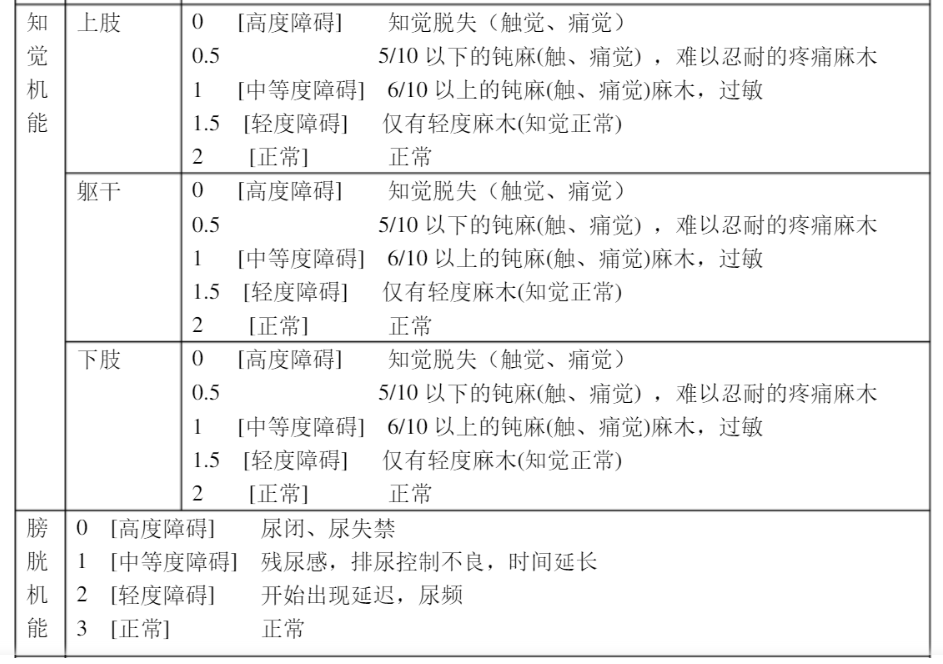

- 分类
  collapsed:: true
	- 神经根型
	  collapsed:: true
		- 表现为受累神经根对应区域的神经痛、感觉障碍、麻木，异样感，活动不灵活。
		- 仰头、咳嗽、喷嚏可加重，
		- {:height 280, :width 270}，
		- {:height 330, :width 460}
	- 脊髓型
	  collapsed:: true
		- 约10 - 15% 病人为此型，
		- 脊髓神经与颈椎间盘之间被一层比较致密的后纵韧带隔绝，而神经根周围没有后纵韧带，所以神经根型颈椎病更容易发生；但颈椎的长期姿势不当，仍可能导致脊髓型颈椎病，
		- 就医
		- 脊髓型颈椎病JOA评分（运动，感觉）
		  collapsed:: true
			- 
			- 
			- 
		- 脊髓型颈椎病一经诊断就应考虑手术治疗；手术的时机通常认为应在表现出*明显症状后6个月*以内，
		- 椎间盘切除术是最常见的手术治疗之一，成功率很高；然而，高达25%的患者可出现再突出和复发性腰部和/或腿部疼痛，
		- 影像
		  collapsed:: true
			- {:height 260, :width 400}
			- {:height 410, :width 400}
			- 脊髓受压
			- {:height 339, :width 401}
			- {:height 220, :width 400}
		- CT颈椎曲度成像
		  collapsed:: true
			- {:height 200, :width 550}
		- 不应进行牵引，理疗，按摩等手段治疗，
		  background-color:: #793e3e
		- 可能需要过伸过屈位的核磁影像辅助诊断，
	- 椎动脉型
	  collapsed:: true
		- 由于颈椎退变致使椎动脉遭受刺激或压迫，以致血管狭窄、折曲而造成以椎基底动脉供血不足,
		- 临床症状：眩晕、头痛、眼部症状（视雾、眼前闪光、暗点、一过性黑朦、暂时性视野缺损、视力减退、复视、幻视以及失明等）、感觉障碍（面部、口周、舌体、四肢或半身麻木）等，
	- 交感神经型
	  collapsed:: true
		- 约占 5%。因颈部交感神经受压产生的症状。因其分布广泛，因此可引起许多器官和系统的症状。
		- 头部症状：头晕，头痛，颈后痛；
		- 眼部症状：眼睑下垂，视物模糊，甚至失明；
		- 心脏症状：心跳加速或减慢，心口疼；
		- 周围症状：肢体、头、颈、面部发麻或疼痛；
		- 其他：耳鸣、耳聋等。
	- 混合型
	  collapsed:: true
		- 以上几种类型可以混合出现，症状也表现得较为复杂，
- 改善
	- 错误姿势
	  collapsed:: true
		- 包括驼背、伏案书写、侧身歪斜地看书、趴在桌子上睡觉、用脖子夹电话等等。
		- 注意颈肩部保暖，避免头颈负重物，避免过度疲劳，坐车时不要打瞌睡。
	- 调整姿势
	  collapsed:: true
		- 正确的姿势维持过久（数十分钟），也会对肌肉和骨骼带来额外压力，导致疲劳感，
		- 应当定期改变头颈部体位，例如工作一段时间后抬头远视几分钟，待眼睛疲劳消除后再工作；
		  collapsed:: true
	- “中立位”
	  collapsed:: true
		- {:height 344, :width 270}，
		- 一般认为，身体位于中立位时受力最小，
		- 骨盆中立位
			- 可以躺下，通过骨盆（臀部）的移动，寻找骨盆的中立位，
		- 胸椎中立位（挺胸）
			- 靠墙站立，通过呼吸找到胸椎的中立位，
		- 肩胛骨（肩膀打开）
			- 靠墙站立，肩胛骨夹紧，
			- 保持肩部放松，不要耸肩，
		- 颈椎回缩（下巴回缩）
			- 靠墙站立，尽量让耳朵和肩膀位于同一直线上，
	- 坐姿
	  collapsed:: true
		- 坐姿中立位
		  collapsed:: true
			- 坐着时候的中立位，大概为脑袋基本在胸腔的正上方，而胸腔基本在骨盆的正上方，
			- 如果不在中立位，则肌肉要花更大的力气保持身体的平衡，
			- 如果脑袋不在胸腔的正上方，会对颈部施加更大的压力， {:height 140, :width 240} ，
			- 中立位时，肩膀和颈部的受力应该较小，表现为可以比较轻松的抬头和耸肩，
			- 如果胸腔不在骨盆的正上方，会对腰部施加更大的压力， {:height 90, :width 240}，
			- 应保持脚与膝盖对齐，膝盖与骨盆对齐，或略高于大腿线，
		- 坐骨
		  collapsed:: true
			- 屁股正下方、左右各有一块的骨头叫做坐骨，位于骨盆最底下的位置，
			- {:height 180, :width 280}，
			- {:height 140, :width 280}，
			- 一般认为，用坐骨而不是尾骨接触椅子，对身体的压力更小，
		- 维持不良坐姿15分钟左右就可能导致肌肉疲劳，脊柱僵硬，从而增加脊柱结构损伤的风险；然而，肌肉疲劳的恢复则可能需要7小时左右，这使得疲劳很容易累积，
		- 来源https://www.necksolutions.com/sitting-posture/
		- 手肘
			- 
			-
	- 站姿
	  collapsed:: true
		- 尽量保持靠墙站立时的中立位，
		- 腹部和臀部可以轻微发力，保持骨盆中立位，
		- 膝盖可以轻微弯曲，减少对膝盖的压力，
	- 睡姿
		- 枕头
			- 枕头的作用是让颈椎得到支撑，维持正常曲度，同时使头和身体保持中立位，
			- 高枕使头部前屈，增大下位颈椎的应力，有加速颈椎退变的可能，
			- 
			- 一般枕头高以 8~15 cm 为宜，或按公式计算：（肩宽 - 头宽）÷ 2；
		- 腰椎
		  collapsed:: true
			- 腰部有一定的生理曲度，
			- 若感觉腰部有些悬空，可以在腰下垫一些支撑物，
		- 仰卧时膝盖可以轻微弯曲，
		- 正确的睡姿应该是仰卧与左、右侧侧卧这三种姿势相互交替，避免长时间单一睡姿而导致人体生物力学结构失衡，
		- 俯卧或半俯卧可能压迫心肺乳房并扭曲颈椎、压迫肩关节和臂神经，应予避免。
	- 呼吸
	  collapsed:: true
		- 肩颈不适的人在呼吸过程中会有轻度的耸肩，即肩膀的起伏，
		- 正常呼吸是要靠腹横肌和膈肌的参与，增加腹内压，让空气进入胸腔的过程，在这过程中，下胸廓要有运动，而且要向各个方向扩展（尤其是要向身体两侧扩展）才可以是一个正常的呼吸，这样的呼吸不会过多动用斜角肌，从而保持了颈椎的稳定，减轻了颈椎的负担。
		- 呼吸训练，注意下肋部一定要向两侧打开，训练腹式呼吸，可以帮助更好地换气，增加氧气的摄入，防止错误的胸式呼吸（也包括斜角肌呼吸模式）。
		- 保证每次吸气下腹部都能鼓起来，而胸廓不会向天花板运动，就可以训练腹式呼吸，每组10次即可，3组。
- 运动
- （物理疗法）
  collapsed:: true
	- 温热敷和红外线等理疗方法可改善血液循环，缓解肌肉痉挛，消除肿胀和减轻症状，有助于巩固和提高正规治疗的效果。
	- 热毛巾、热水袋、热水澡等都是进行温热敷的便利条件。
	- 加热的石蜡、白炽灯等则是很好的红外线发射器。
- [[Medicine]]