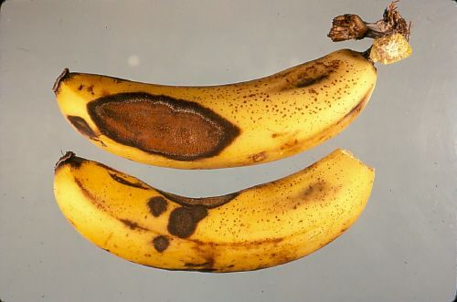
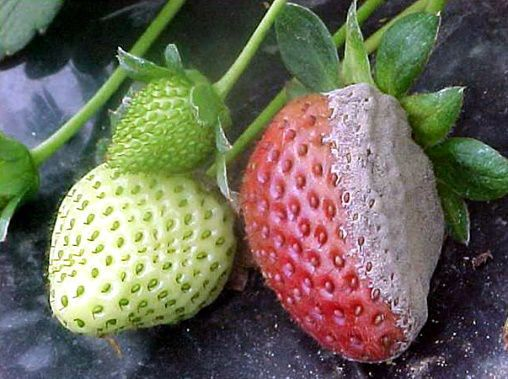
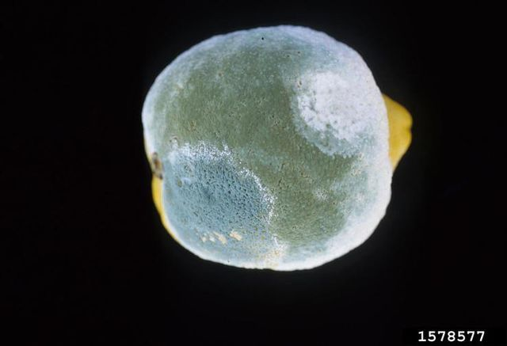
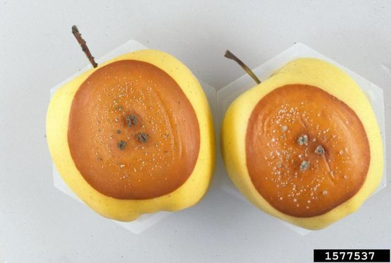
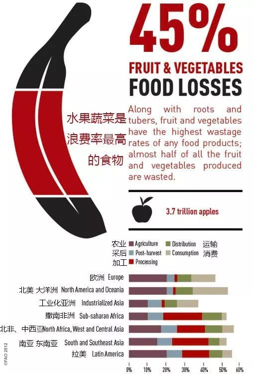

- 可能危害
	- 化学危害
	  collapsed:: true
		- 亚硝酸盐
		- 一般减少食物待在室温中的时间、及时冷藏，亚硝酸盐不会达到有害健康的水平。
	- 生物危害
	  collapsed:: true
		- 烹饪完毕到进食的时间中，各种细菌可能会在这期间繁殖；细菌可能产生有毒物质，
- 细菌种类
	- 食源性致病细菌及其毒素
	  collapsed:: true
		- 如李斯特菌、金黄葡萄球菌，这些细菌可以入侵人体，或产生毒素因而令人患病。
		- 人们一旦吃下足够数量的细菌或其毒素，经过潜伏期后便会出现病征。
	- 腐败细菌
	  collapsed:: true
		- 可以在食物中大量繁殖，令食物腐坏，发出异味或变味，影响其质量。
		- 细菌通常不会令人患病，但如果吃下相当大量的腐败细菌，也会令人肠胃不适。
	- 霉菌
	  collapsed:: true
		- 霉变一般容易肉眼察觉，某些类型的食物，如含水量高的新鲜蔬果，比其他食物更容易长霉菌；而添加了防腐剂的食物，霉菌生长的可能性则会降低。
		- 常见的、易发霉的食物
		  collapsed:: true
			- 水果：如草莓、橘子、葡萄、苹果和覆盆子；
			  collapsed:: true
				- 香蕉炭疽病
				  collapsed:: true
					- 病原菌：香蕉炭疽菌Colletotrichum musae
					- 
					- 病情症状：香蕉果皮上产生略微凹陷的圆形或椭圆形黑色病斑，病斑中心有粉色至橘红色的粘液，实际上是数以亿计的香蕉炭疽菌分生孢子。
					- “香蕉炭疽菌”与会致人死亡的“炭疽病”不同。炭疽病是由细菌炭疽杆菌引起的；香蕉炭疽病是由真菌引起。
					- 一些香蕉上会有黑点，这是香蕉细胞老化死亡时，氧化酚类物质被水解导致的褐化。这样的香蕉可以正常食用。
				- 草莓灰霉病
				  collapsed:: true
					- 病原菌：灰葡萄孢菌 Botrytis cinerea
					- 
					- 病情症状：在寄主表面产生灰色的霉。可以侵染两百多种植物：草莓、蓝莓、苹果……
				- 柑橘青霉病和绿霉病
				  collapsed:: true
					- 病原菌：意大利青霉 Penicillium italicum、指状青霉 Penicillium digitatum
					- 
					- 病情症状：两者引起的病害非常相似，不过感染柑橘后，表现的症状不同：上图左下角的较小一片霉斑呈现蓝绿色，这是青霉病的特征；其余大部分霉斑呈橄榄绿色，这是绿霉病的特征。
					- 注意事项：绿霉病发展速度更快，在湿度较低的时候，染病柑橘会整个失水干瘪皱缩变成僵果；在湿度较高的时候，指状青霉菌丝会瓦解整个果实引起塌陷，周围环境中的其他真菌细菌便可趁虚而入。
				- 苹果青霉病
				  collapsed:: true
					- 病原菌：展青霉Penicillium expansum
					- 
					- 病情症状：在生产运输过程中，由于昆虫鸟类叮咬，果实与硬物或者互相之间碰撞摩擦，果皮上会出现伤口，病原菌便可经由伤口处侵染果实。早期的症状是果实表面出现圆形黄褐色软腐病斑，随后逐渐扩大并在果皮表面产生灰绿色菌丝和分生孢子。
					- 青霉病是苹果和梨这一类梨果中最常见的采后病害。
					- 展青霉的危害更加严重，因为后者能产生具有致癌，致畸作用的真菌毒素展青霉素。
					- 部分采后病害的病原菌不产生已知的对人畜有害的真菌毒素，例如香蕉炭疽病和灰葡萄孢菌导致的各类灰霉病。
					- 但是一些果蔬在长毛发霉后，会产生真菌毒素。不慎食用，会对人体产生严重伤害。
					- 例如苹果青霉病产生的展青霉素可致癌、致畸，这种毒素也可能出现在被展青霉寄生的梨、桃、杏、樱桃、洋葱等等果蔬上，引起番茄黑斑病的链格孢菌产生的链格孢霉毒素也有致癌作用。黄曲霉污染也是采后病害的一种，霉变的瓜子花生就可能含有黄曲霉素，
			- 蔬菜：如西红柿、甜椒和胡萝卜；
			- 烘焙品：特别是不含防腐剂的面包。
			- 其他食物：包括肉类、坚果、牛奶和加工食品。
		- 霉变的判断
		  collapsed:: true
			- 肉类、鱼和家禽：注意表面颜色的变化、无光泽的色调或者奇怪的气味。
			- 煮熟 / 生的蔬菜 ：青豆或芦笋的顶端有时候会枯萎，并且摸起来软软的，虽然气味没有坏掉的肉那么明显，但是也会略有变化。
			- 谷物和意大利面：由于很多谷物都是在水里煮熟的，所以淀粉类食物在腐烂的第一阶段的征兆都是变湿。煮熟的意大利面可以持续五天，而米饭和藜麦则可以持续六天，
			- 植物蛋白：植物蛋白霉变时也会有难闻的气味，如腐臭的硫磺味，
		- 霉菌的毒素
		  collapsed:: true
			- 自然环境中的各种霉菌是混杂居住的。也就是说，一种发霉的食物中，可能存在多种霉菌和霉菌毒素。
			- 此外，并不是吃了发霉的食物一定会引起健康问题，这取决于食用发霉食物的数量。
			- 黄曲霉毒素
			  collapsed:: true
				- 生长在土壤、腐烂植被、干草和谷物中的某些霉菌产生，
				- 可存在于发霉的谷物（玉米、高粱、小麦和大米）、油料（大豆、花生、向日葵和棉籽）、香料（辣椒、黑胡椒、香菜、姜黄和生姜）和坚果（开心果、杏仁、核桃、椰子和巴西坚果）中。
				- 大剂量食用黄曲霉毒素可导致急性中毒，损害肝脏并危及生命；长期低剂量食用也会增加癌症风险。
			- 赭曲霉毒素A
			  collapsed:: true
				- 几种曲霉和青霉产生，是一种常见的食品污染真菌毒素，可在作物储存过程中形成。
				- 会造成肾损伤，也可能会对胎儿发育和免疫系统产生影响。
			- 展青霉素
			  collapsed:: true
				- 存在于腐烂的苹果和苹果制品中，也可存在于各种发霉的水果、谷物等食品中，
				- 可能会引起肠道功能紊乱、恶心、呕吐以及肾脏水肿。
		- 霉变的处理
		  collapsed:: true
			- 在发霉食品中，真菌菌丝并非只存在于表面，而是已经侵入食品内部，即使去除菌丝部分，真菌毒素也已经扩散至未腐烂的完好部位。
			- 在蔬菜水果中，有研究表明苹果中的展青霉素集中分布于距霉烂部位2厘米的区域，而番茄中的展青霉素在距霉烂部位4厘米的区域仍可检测到。
			- 全部发霉：不能再食用，应及时扔掉；
			- 部分发霉：根据食物的质地，采取不同的处理方式。
			- 食物质地较软：如草莓、西红柿、黄瓜、面包和烘焙食品等，则应该丢弃不能食用。因为这种食物通常水分含量高，霉菌容易在其内部生长，却又难以被发现。
			- 食物质地较硬：如苹果、辣椒、胡萝卜，可以将发霉及周边至少2.5cm的部分切除掉再食用。此外，还应防止刀具接触发霉的部分。
			- 黄豆酱、腐乳、臭豆腐等正规的发酵食品：若已经过了保质期，则不能再食用。
			- 若不慎食用发霉食物，应及时吐掉并漱口，如果出现症状应及时就医治疗。
		- 防止食物发霉
		  collapsed:: true
			- 购买阶段
				- 少量购买能在几天内吃完的分量，如果有大量采购的水果，到货之后需立刻检查挑出已经有病斑或者软化的水果，余下水果在阴凉通风处储存，时常检查。
				- 购买时注意检查水果上是否有虫咬痕迹或者刺伤划伤等。因为病原菌易通过开放性伤口入侵果实内部，如果是碰撞伤则无需担心。
			- 储存阶段
				- 核心：保持食物储存区的清洁、干燥，
					- 定期清洁冰箱，每隔几个月擦拭一次内部；
					- 保持清洁用品，包括抹布、海绵和其他用具的干净、卫生；保持储存容器的清洁与密封；
				- 草莓、葡萄等可以立即放入冰箱冷藏；
				- 后熟型水果如香蕉、桃、牛油果等可以室温放置完全成熟后再冷藏。建议直到食用前再清洗水果，因为水会促使病原菌孢子萌发。
				- 草莓等不耐存放的水果，可以将不能马上食用的分量清洗干净，放入冰箱冷冻，食用时再取出。虽然冷冻会影响草莓的口感质地，但微生物生长几乎完全被抑制，保存期可延长至三个月以上。
		- 水果的浪费情况
		  collapsed:: true
			- 根据联合国粮食和农业组织的数据，人类最终利用的蔬菜和水果只占总产量的55%，有45%的产量都在生产、采后处理、加工、运输销售和最终的消费阶段损失了。
			- 
			- 其中的原因有各种病原菌引起的采后病害，昆虫，鸟类和啮齿动物啃食，机械损伤，自然衰老降低利用价值等。
	- 肉毒梭菌
	  collapsed:: true
		- 生理特性
			- 肉毒梭菌是厌氧细菌，在富含氧气的情况下是无法繁殖、分泌毒素。
			- 常见于严格隔绝氧气的肉制品、罐头制品和真空包装食品中，大部分食品都与空气或多或少有流通，所以一般不会发生问题。
			- 肉毒梭菌在 15 度以下的低温就会变身成芽孢状态，芽孢状态的肉毒梭菌不能分泌毒素，
		- 预防措施
			- 肉毒毒素不耐高温， 80℃ 条件下持续 15 分钟就能让毒素分解。
			- 开瓶的肉酱应盖上盖子密封、冷藏保存，最好一星期吃完。
			- 高盐高糖本质上还是降低水活度，使肉毒梭菌无法生长，但这样做无法完全杀死芽孢，
				- 例如，蜂蜜最好冷藏保存并快速食用，
			- （食物制品的预防措施）
				- 加入酸性物质，调节 pH 到 4.6 以下。在这种环境下，肉毒梭菌的芽孢虽然杀不死，但不会生长和分泌毒素。
				- 加入亚硝酸盐。亚硝酸盐能够特异性抑制肉毒梭菌生长。超市里几乎所有的加工肉制品都要添加亚硝酸盐，
				- 将食品彻底灭菌。直接放在 120 度以上的高压灭菌锅内灭菌，时间足够的情况下，所有的芽孢都会被杀死，
	- 椰毒假单胞菌
	  collapsed:: true
		- 生理机制
		  collapsed:: true
			- 广泛分布于外部环境，
			- 严格需氧菌，风干过程中，酵米面的表面和氧气接触，如果存在椰毒假单胞菌，就会开始在表面大量繁殖。
			- 水分：潮湿、温度较高的环境适合椰毒假单胞菌生长，
			- 椰毒假单胞菌不耐酸，体系的 pH 降到 5 以下椰毒假单胞菌基本是活不成的。因此不用担心酸菜、泡菜之类的发酵食物被这种菌污染；
			- 同样，椰毒假单胞菌也不耐盐。因此一般腌制食物比如咸菜、咸肉等，不会出现椰毒假单胞菌的食物中毒，
		- 危害
		  collapsed:: true
			- 米酵菌酸毒性不属于特别高，但一般导致中毒的食物都是被严重污染了，毒素含量高；再加上米面类算主食，本身也会吃得比较多。
			- 毒素对热比较稳定，通常的烹饪过程没办法破坏，
		- 预防
		  collapsed:: true
			- 应谨慎购买新鲜木耳、银耳，不要购买自采的鲜木耳、鲜银耳。
				- 黑木耳、银耳如果被椰毒假单胞菌污染的话，外观看上去会有区别。比如不成型、发粘、无弹性、有异味等。不管是新鲜的还是泡发的，一旦出现这种变质现象，一定要扔掉，不能再吃。
				- 泡发最好控制在几个小时就够，有条件可以选择在冰箱中泡发。泡发后立即烹饪食用，不要在生湿的状态存放太久。
			- 新鲜河粉、肠粉等湿面制品容易出问题，而干制的就不太容易食物中毒。
			- 不要做酵米面一类的发酵谷类制品，发酵过后立即烹饪食用，不要存放。
- 应对
	- 核心：细菌大多喜欢温暖、潮湿的环境，应对方法就是避免让食物待在细菌喜爱的温度——危险温度范围 （Danger zone，4~60 °C），即低温和高温都可以避免细菌滋生，
	- 解冻
	  collapsed:: true
		- 温度高于4°C后，冷藏前已存在于肉类中的细菌就会再度活跃起来并开始繁殖，因此，在室温下或以热水解冻食物并不适宜。
		- 最安全的解冻方式是将食物放在冰箱的冷藏室内缓慢解冻；
		- 如果要达到快速解冻的目的，也可以用流动的冷水或微波炉进行解冻。但应快速烹饪，
	- 烹煮
	  collapsed:: true
		- 一般而言，把食物烹煮至中心温度达 75°C 或以上，并保持至少 30 秒便能杀死大部分致病细菌，
		- 蔬菜在切开或磨碎后，应尽早烹煮。
		- 做好的食物要趁热取出来，尽量少和各种餐具等接触，做完后就放入保鲜盒内。
	- 冷却
	  collapsed:: true
		- 将装好食物的保鲜盒加盖后直接塞进冰箱，尽快达到 4°C 及以下，避免危险温度范围。
		- 要注意热食附近不要放别的食物，以免受到局部温度升高的影响。
	- 食材存储
	  collapsed:: true
		- 塑料饭盒在使用过程中容易产生划痕，划痕内会滋生细菌，要定期用沸水或消毒产品消毒。
		- 尽量避免剩菜，同时剩菜应放在冰箱内保存，并在3-4天内吃完，每次拿出来食用的时间不应超过2小时。
		- 2 小时及 4 小时原则：烹制好的食物如置于室温不超过 2 小时，可存放于冰箱待用或在 4 小时内食用；如置于室温超过 4 小时，必须丢弃。
		- 根据美国农业部（USDA）的建议，煮熟的食物只能在冰箱中安全冷藏 4 天。
		-
- [[Medicine]]